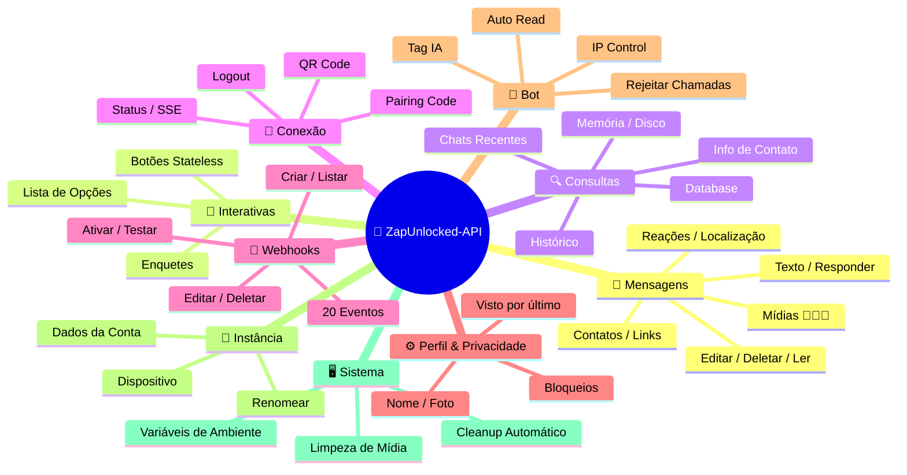
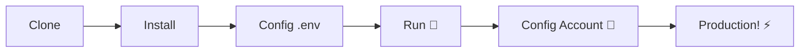

# 🚀 [ZapUnlocked-API](https://zapunlocked-api.kauafpss.com.br) 📲✨


<p align="center">
  
  
  
  
  
</p>

---

### 🌐 Select Language / Selecione o Idioma:

<table width="100%">
  <tr>
    <td align="center" valign="middle"><a href="https://github.com/kauafpssx/ZapUnlocked-API/blob/main/docs/translations/en.md"></a></td>
    <td align="center" valign="middle"><a href="https://github.com/kauafpssx/ZapUnlocked-API/blob/main/docs/translations/es.md"></a></td>
    <td align="center" valign="middle"><a href="https://github.com/kauafpssx/ZapUnlocked-API/blob/main/docs/translations/fr.md"></a></td>
    <td align="center" valign="middle"><a href="https://github.com/kauafpssx/ZapUnlocked-API/blob/main/docs/translations/de.md"></a></td>
    <td align="center" valign="middle"><a href="https://github.com/kauafpssx/ZapUnlocked-API/blob/main/docs/translations/zh.md"></a></td>
    <td align="center" valign="middle"><a href="https://github.com/kauafpssx/ZapUnlocked-API/blob/main/docs/translations/ja.md"></a></td>
    <td align="center" valign="middle"><a href="https://github.com/kauafpssx/ZapUnlocked-API/blob/main/docs/translations/ru.md"></a></td>
    <td align="center" valign="middle"><a href="https://github.com/kauafpssx/ZapUnlocked-API/blob/main/docs/translations/it.md"></a></td>
    <td align="center" valign="middle"><a href="https://github.com/kauafpssx/ZapUnlocked-API/blob/main/docs/translations/ar.md"></a></td>
    <td align="center" valign="middle"><a href="https://github.com/kauafpssx/ZapUnlocked-API/blob/main/docs/translations/tr.md"></a></td>
    <td align="center" valign="middle"><a href="https://github.com/kauafpssx/ZapUnlocked-API/blob/main/docs/translations/ko.md"></a></td>
    <td align="center" valign="middle"><a href="https://github.com/kauafpssx/ZapUnlocked-API/blob/main/docs/translations/hi.md"></a></td>
    <td align="center" valign="middle"><a href="https://github.com/kauafpssx/ZapUnlocked-API/blob/main/docs/translations/nl.md"></a></td>
  </tr>
</table>

---

##  O que é o ZapUnlocked-API?

O mercado de APIs para WhatsApp cobra mensalidades abusivas: dezenas a centenas de reais por mês, com limites de uso, taxas por conversa e dados que passam por servidores de terceiros. **O ZapUnlocked-API existe pra mudar isso.**

Construída em **Python** com **[Neonize](https://github.com/krypton-byte/neonize)** como motor de conexão, esta API oferece uma interface REST simples (FastAPI) para gerenciar sessões, enviar mídias complexas e criar interações inteligentes. **Sem banco de dados pesado, sem mensalidade, sem depender de ninguém.**

Nossa proposta é fundamentada na **excelência técnica** e na **independência do desenvolvedor**. Acreditamos que ferramentas poderosas devem ser acessíveis a quem constrói suas próprias soluções.

> [!TIP]
> Perfeito para desenvolvedores que buscam agilidade na integração de bots, notificações e sistemas de atendimento automatizados. **Sem pagar nada por isso.**

---

## 🗺️ Visão Geral da API



---

## ✨ Funcionalidades em Destaque

| Funcionalidade | Descrição |
| :------------- | :-------- |
| 🧩 **Botões Stateless** | Crie fluxos interativos sem banco de dados, com webhooks criptografados |
| 🔢 **Pareamento sem QR Code** | Conecte via código numérico · ideal para servidores sem GUI |
| 🎵 **Conversão Automática de Áudio** | Envie áudios que aparecem como gravados na hora (PTT) nativamente |
| 📦 **Fila de Mídias Inteligente** | Gerenciamento automático para evitar consumo excessivo de memória |
| 🏷️ **Placeholders Dinâmicos** | Personalize mensagens e webhooks com `{{name}}`, `{{day}}`, `{{phone}}` |

> [!NOTE]
> Todas as funcionalidades são **100% gratuitas** e mantidas pela comunidade open-source.

---

## 📋 Rotas da API

<details>
<summary><b>📨 Envio de Mensagens</b> · 14 endpoints</summary>

| Método | Rota | Descrição |
| :----- | :--- | :-------- |
| `POST` | `/send` | Enviar mensagem de texto / responder |
| `POST` | `/send_image` | Enviar imagem |
| `POST` | `/send_video` | Enviar vídeo (suporta GIF e PTV) |
| `POST` | `/send_audio` | Enviar áudio (com conversão automática para PTT) |
| `POST` | `/send_document` | Enviar documento |
| `POST` | `/send_sticker` | Enviar figurinha |
| `POST` | `/send_reaction` | Enviar reação com emoji |
| `POST` | `/send_location` | Enviar localização |
| `POST` | `/send_contact` | Enviar contato |
| `POST` | `/send_contacts` | Enviar múltiplos contatos |
| `POST` | `/send_link` | Enviar link com preview |
| `POST` | `/messages/delete` | Deletar mensagem |
| `POST` | `/messages/read` | Marcar como lida |
| `POST` | `/messages/edit` | Editar mensagem enviada |
</details>

<details>
<summary><b>🔘 Mensagens Interativas</b> · 4 endpoints</summary>

| Método | Rota | Descrição |
| :----- | :--- | :-------- |
| `POST` | `/send_wbuttons` | Enviar botões (lista, ação, OTP, PIX) |
| `POST` | `/messages/send-option-list` | Enviar lista de opções |
| `POST` | `/messages/send-poll` | Enviar enquete |
| `POST` | `/messages/send-poll-vote` | Votar em enquete |
</details>

<details>
<summary><b>🔍 Consultas e Gestão</b> · 7 endpoints</summary>

| Método | Rota | Descrição |
| :----- | :--- | :-------- |
| `POST` | `/contacts/info` | Informações detalhadas do contato |
| `POST` | `/management/fetch_messages` | Buscar histórico de mensagens |
| `POST` | `/management/recent_contacts` | Listar chats recentes |
| `GET` | `/management/memory` | Status do uso de memória |
| `GET` | `/management/volume_stats` | Verificar uso de disco |
| `GET` | `/management/database/status` | Status e estatísticas do banco |
| `POST` | `/management/database/cleanup` | Limpeza manual do banco |
</details>

<details>
<summary><b>🔗 Conexão e Sessão</b> · 8 endpoints</summary>

| Método | Rota | Descrição |
| :----- | :--- | :-------- |
| `GET` | `/` | Página de boas-vindas (HTML) |
| `GET` | `/status` | Status da conexão e sessão |
| `GET` | `/status/stream` | Status em tempo real (SSE) |
| `GET` | `/qr` | Visualizar QR Code interativo |
| `GET` | `/qr/image` | Obter imagem do QR Code (Base64) |
| `POST` | `/qr/pair` | Gerar código de pareamento numérico |
| `GET` | `/settings/phone-code/{phone}` | Gerar código por número |
| `POST` | `/qr/logout` | Desconectar e resetar sessão |
</details>

<details>
<summary><b>📡 Webhooks (CRUD)</b> · 7 endpoints</summary>

| Método | Rota | Descrição |
| :----- | :--- | :-------- |
| `POST` | `/webhooks` | Criar webhook nomeado |
| `GET` | `/webhooks` | Listar todos os webhooks |
| `PUT` | `/webhooks/{name}` | Editar webhook |
| `DELETE` | `/webhooks/{name}` | Remover webhook |
| `POST` | `/webhooks/{name}/toggle` | Ativar / desativar |
| `POST` | `/webhooks/{name}/test` | Testar webhook |
| `GET` | `/webhooks/events` | Listar tipos de eventos (20 tipos) |
</details>

<details>
<summary><b>⚙️ Perfil e Privacidade</b> · 3 endpoints</summary>

| Método | Rota | Descrição |
| :----- | :--- | :-------- |
| `POST` | `/settings/profile` | Alterar nome e foto do bot |
| `POST` | `/settings/privacy` | Ajustar privacidade (visto por último, etc) |
| `POST` | `/settings/block` | Bloquear / desbloquear contato |
</details>

<details>
<summary><b>🤖 Configurações do Bot</b> · 5 endpoints</summary>

| Método | Rota | Descrição |
| :----- | :--- | :-------- |
| `GET` | `/settings/bot` | Ver configurações do bot |
| `POST` | `/settings/bot` | Atualizar configurações (tag IA, IP control) |
| `PUT` | `/settings/instance/call-reject-auto` | Rejeitar chamadas automaticamente |
| `PUT` | `/settings/instance/call-reject-message` | Mensagem de chamada rejeitada |
| `PUT` | `/settings/instance/auto-read-message` | Leitura automática de mensagens |
</details>

<details>
<summary><b>📱 Instância</b> · 3 endpoints</summary>

| Método | Rota | Descrição |
| :----- | :--- | :-------- |
| `GET` | `/instance/me` | Dados da conta conectada |
| `GET` | `/instance/device` | Dados técnicos do dispositivo |
| `PUT` | `/instance/update-name` | Renomear instância |
</details>

<details>
<summary><b>🖥️ Sistema</b> · 5 endpoints</summary>

| Método | Rota | Descrição |
| :----- | :--- | :-------- |
| `GET` | `/system/env` | Ver variáveis de ambiente |
| `PUT` | `/system/env` | Atualizar variáveis de ambiente |
| `POST` | `/system/cleanup/force` | Limpeza forçada de mídia temporária |
| `GET` | `/system/cleanup/settings` | Ver configurações de limpeza automática |
| `PUT` | `/system/cleanup/settings` | Atualizar intervalo de limpeza automática |
</details>

> **Total: 56 endpoints** · REST completos para automação de WhatsApp.

---

## 📡 Eventos de Webhook

Todos os webhooks recebem um envelope padrão:

```json
{
  "event": "message.text",
  "timestamp": "2025-01-01T12:00:00Z",
  "data": { ... }
}
```

Se o webhook tiver um `body` customizado com `{{placeholders}}`, esse body é enviado em vez do envelope padrão.

### Placeholders (body customizado)

| Placeholder | Valor |
| :---------- | :---- |
| `{{from}}` | Número do remetente |
| `{{text}}` | Texto da mensagem |
| `{{phone}}` | Mesmo que `{{from}}` |
| `{{id}}` | ID da mensagem |
| `{{requested}}` | Quantidade solicitada (fetchMessages) |
| `{{found}}` | Quantidade encontrada (fetchMessages) |
| `{{timestamp}}` | Timestamp UTC atual |
| `{{day}}` | Dia atual (dd) |
| `{{mon}}` | Mês atual (MM) |
| `{{yea}}` | Ano atual (yyyy) |
| `{{hou}}` | Hora atual (HH) |
| `{{min}}` | Minuto atual (mm) |
| `{{sec}}` | Segundo atual (ss) |

<details>
<summary><b>📥 Mensagens Recebidas</b> · 15 eventos</summary>

Campos base presentes em eventos de mensagem recebida:

```json
{
  "messageId": "3EB0ABCDEF123456",
  "from": "5511999999999",
  "fromName": "João Silva",
  "fromJid": "5511999999999@s.whatsapp.net",
  "isGroup": false
}
```

<details>
<summary><code>message.text</code> - Texto simples / formatado</summary>

```json
{
  "event": "message.text",
  "data": {
    "...base": "...",
    "text": "Olá! Como posso ajudar?",
    "quoted": { "id": "3EB0...", "fromMe": true }
  }
}
```
</details>

<details>
<summary><code>message.image</code> - Imagem recebida</summary>

```json
{
  "event": "message.image",
  "data": {
    "...base": "...",
    "caption": "Foto do produto",
    "mimetype": "image/jpeg",
    "fileLength": 204800
  }
}
```
</details>

<details>
<summary><code>message.video</code> - Vídeo recebido</summary>

```json
{
  "event": "message.video",
  "data": {
    "...base": "...",
    "caption": "Veja esse vídeo!",
    "mimetype": "video/mp4",
    "fileLength": 5242880,
    "isPTT": false,
    "isGif": false
  }
}
```
</details>

<details>
<summary><code>message.audio</code> - Áudio / nota de voz</summary>

```json
{
  "event": "message.audio",
  "data": {
    "...base": "...",
    "mimetype": "audio/ogg; codecs=opus",
    "fileLength": 30720,
    "isPTT": true,
    "durationSeconds": 8
  }
}
```
</details>

<details>
<summary><code>message.document</code> - Documento / arquivo</summary>

```json
{
  "event": "message.document",
  "data": {
    "...base": "...",
    "fileName": "contrato.pdf",
    "caption": "Segue o contrato",
    "mimetype": "application/pdf",
    "fileLength": 102400
  }
}
```
</details>

<details>
<summary><code>message.sticker</code> - Figurinha</summary>

```json
{
  "event": "message.sticker",
  "data": {
    "...base": "...",
    "mimetype": "image/webp",
    "isAnimated": false
  }
}
```
</details>

<details>
<summary><code>message.contact</code> - Contato compartilhado</summary>

```json
{
  "event": "message.contact",
  "data": {
    "...base": "...",
    "displayName": "Maria Souza",
    "vcard": "BEGIN:VCARD\nVERSION:3.0\n..."
  }
}
```
</details>

<details>
<summary><code>message.location</code> - Localização</summary>

```json
{
  "event": "message.location",
  "data": {
    "...base": "...",
    "lat": -23.5505,
    "lng": -46.6333,
    "name": "Av. Paulista",
    "address": "Av. Paulista, 1000 - São Paulo"
  }
}
```
</details>

<details>
<summary><code>message.reaction</code> - Reação (emoji)</summary>

```json
{
  "event": "message.reaction",
  "data": {
    "...base": "...",
    "emoji": "❤️",
    "targetMessageId": "3EB0ABCDEF123456",
    "isRemoved": false
  }
}
```
</details>

<details>
<summary><code>message.poll_created</code> - Enquete recebida</summary>

```json
{
  "event": "message.poll_created",
  "data": {
    "...base": "...",
    "pollName": "Qual o melhor sabor?",
    "options": ["Chocolate", "Morango", "Baunilha"]
  }
}
```
</details>

<details>
<summary><code>message.poll_vote</code> - Voto em enquete</summary>

```json
{
  "event": "message.poll_vote",
  "data": {
    "...base": "...",
    "pollId": "3EB0ABCDEF123456",
    "selectedOptions": ["Chocolate"]
  }
}
```
</details>

<details>
<summary><code>message.button_reply</code> - Clique em botão</summary>

```json
{
  "event": "message.button_reply",
  "data": {
    "...base": "...",
    "buttonId": "opcao_sim",
    "displayText": "Sim",
    "type": "quick_reply"
  }
}
```
</details>

<details>
<summary><code>message.list_reply</code> - Seleção em lista interativa</summary>

```json
{
  "event": "message.list_reply",
  "data": {
    "...base": "...",
    "rowId": "1",
    "title": "X-Burguer",
    "description": "R$ 18,90"
  }
}
```
</details>

<details>
<summary><code>message.deleted</code> - Mensagem apagada pelo remetente</summary>

```json
{
  "event": "message.deleted",
  "data": {
    "...base": "..."
  }
}
```
</details>

<details>
<summary><code>message.unknown</code> - Tipo não mapeado</summary>

```json
{
  "event": "message.unknown",
  "data": {
    "...base": "...",
    "rawType": "senderKeyDistributionMessage"
  }
}
```
</details>

</details>

<details>
<summary><b>📤 Mensagens Enviadas</b> · 1 evento</summary>

<details>
<summary><code>message.sent</code> - Mensagem enviada (manual)</summary>

```json
{
  "event": "message.sent",
  "data": {
    "to": "5511999999999",
    "type": "text",
    "messageId": "3EB0ABCDEF123456"
  }
}
```
</details>

</details>

<details>
<summary><b>🔗 Conexão</b> · 3 eventos</summary>

<details>
<summary><code>connection.connected</code> - WhatsApp conectado</summary>

```json
{
  "event": "connection.connected",
  "data": {
    "phone": "5511999999999"
  }
}
```
</details>

<details>
<summary><code>connection.disconnected</code> - WhatsApp desconectado</summary>

```json
{
  "event": "connection.disconnected",
  "data": {}
}
```
</details>

<details>
<summary><code>connection.qr_ready</code> - QR Code gerado</summary>

```json
{
  "event": "connection.qr_ready",
  "data": {
    "qr": "2@abc123..."
  }
}
```
</details>

</details>

<details>
<summary><b>📞 Chamada</b> · 1 evento</summary>

<details>
<summary><code>call.received</code> - Chamada recebida</summary>

```json
{
  "event": "call.received",
  "data": {
    "from": "5511999999999",
    "fromJid": "5511999999999@s.whatsapp.net",
    "callId": "ABC123DEF456"
  }
}
```
</details>

</details>

---

## 🛠️ Instalação e Hospedagem

> Coloque sua API profissional de WhatsApp no ar em menos de **5 minutos** com a **ZapUnlocked-API**.

### 💻 Instalação Local

Ideal para desenvolvimento, testes ou rodar em servidor próprio.



**1. Clone o Repositório**

```bash
git clone https://github.com/kauafpssx/ZapUnlocked-API.git
cd ZapUnlocked-API
```

**2. Instale as Dependências**

| Sistema | Comando |
| :------ | :------ |
| 🪟 Windows | `scripts\install\install.bat` |
| 🐧 Linux / macOS | `bash scripts/install/install.sh` |

**3. Configure o Ambiente**

| Sistema | Comando |
| :------ | :------ |
| 🪟 Windows | `scripts\generate-env\generate-env.bat` |
| 🐧 Linux / macOS | `bash scripts/generate-env/generate-env.sh` |

| Variável | Descrição |
| :------- | :-------- |
| `API_KEY` | Senha para autenticação em todos os endpoints |
| `INTERNAL_SECRET` | Token para validar assinaturas de webhook |
| `PORT` | Porta da API (padrão: `8300`) |

**4. Execute a API**

| Sistema | Comando |
| :------ | :------ |
| 🪟 Windows | `scripts\run\run.bat` |
| 🐧 Linux / macOS | `bash scripts/run/run.sh` |

---

### ☁️ Hospedagem: Alwaysdata (Grátis 24/7)

A **Alwaysdata** é a opção recomendada para hospedar a API de forma estável e gratuita sem precisar manter um servidor ligado.

#### 📊 Recursos do Plano Free

| Recurso | Disponível no Free |
| :------ | :----------------- |
| 💾 Armazenamento | **1 GB SSD** |
| 🧠 RAM | **256 MB** |
| ⚡ CPU | **1/4 vCPU** |
| 🔄 Backup | **3 dias** automático |
| 📡 Uptime | **24/7** via Services |

#### 👣 Passo a Passo para Deploy

**1.** Crie sua conta em [Alwaysdata.com](https://www.alwaysdata.com/) · plano **Free**.

**2.** Acesse o SSH em `https://ssh-[usuario].alwaysdata.net`.

**3.** Clone e instale:

```bash
git clone https://github.com/kauafpssx/ZapUnlocked-API.git ~/ZapUnlocked-API
cd ~/ZapUnlocked-API
bash scripts/install/install.sh
```

**4.** Gere o `.env`:

```bash
bash scripts/generate-env/generate-env.sh
```

**5.** Configure o Serviço (24/7) em **Advanced › Services › Add a service**:

| Campo | Valor |
| :---- | :---- |
| **Name** | `ZapUnlocked-API` |
| **Command** | `bash /home/[usuario]/ZapUnlocked-API/scripts/run/run.sh` |
| **Working directory** | `/home/[usuario]/ZapUnlocked-API` |
| **Environment variables** | `PORT=8300` |

**6.** Acesse via:

```
http://[usuario].alwaysdata.net:8300/
```

> [!TIP]
> A URL já é acessível externamente. *(Opcional)* Para usar um domínio personalizado, configure um **Reverse Proxy** em **Web › Sites › Add a site** apontando para `http://[usuario].alwaysdata.net`.

---

## 🔐 Autenticação (Login)

Após o deploy, conecte sua conta do WhatsApp acessando no navegador:

```text
http://[usuario].alwaysdata.net:8300/qr?API_KEY=SUA_SENHA_SECRETA
```

---

## 📖 Documentação Oficial

<p align="center">
  👉 <a href="https://zapunlocked-api.kauafpss.com.br"><strong>zapunlocked-api.kauafpss.com.br</strong></a>
</p>

Para documentação técnica detalhada, exemplos de código e playground interativo, acesse nosso site oficial.

> [!TIP]
> Use o **LLMs.txt** como índice para IA: [`zapunlocked-api.kauafpss.com.br/llms.txt`](https://zapunlocked-api.kauafpss.com.br/llms.txt). Descubra todas as páginas antes de explorar.

---

## ❤️ Créditos & Agradecimentos

| Projeto | Descrição |
| :------ | :-------- |
| [](https://github.com/krypton-byte/neonize) | Biblioteca Python para conexão nativa com o WhatsApp Web |
| [](https://github.com/tulir/whatsmeow) | Biblioteca Go base do Neonize · o coração da conexão |
| [](https://www.alwaysdata.com/) | Infraestrutura gratuita de alta qualidade |

---

## 📄 Licença

Este projeto é licenciado sob a **Licença MIT**.

<p align="center">
  Feito com 💜 por <a href="https://www.instagram.com/kauafpss_/">Kauã Ferreira</a>
</p>
