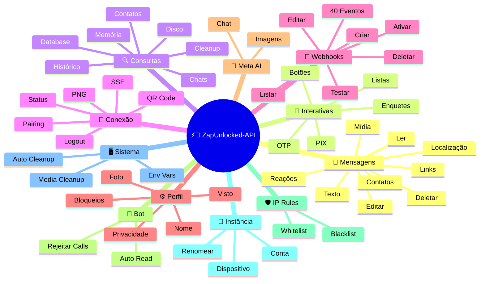
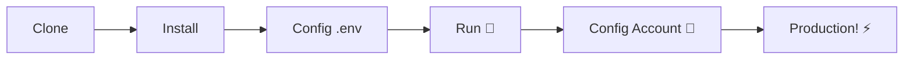

# ⚡💬 [ZapUnlocked-API](https://zapunlocked-api.kauafpss.com.br/)


<p align="center">
  
  <a href="https://downgit.github.io/#/home?url=https://github.com/kauafpssx/ZapUnlocked-API/blob/main/ZapUnlocked.collection.json">
    
  </a>
  
  
  
</p>

---

### 🌐 Select Language / Selecione o Idioma:

<table width="100%">
  <tr>
    <td align="center" valign="middle"><a href="https://github.com/kauafpssx/ZapUnlocked-API/blob/main/docs/translations/en.md"></a></td>
    <td align="center" valign="middle"><a href="https://github.com/kauafpssx/ZapUnlocked-API/blob/main/docs/translations/es.md"></a></td>
    <td align="center" valign="middle"><a href="https://github.com/kauafpssx/ZapUnlocked-API/blob/main/docs/translations/fr.md"></a></td>
    <td align="center" valign="middle"><a href="https://github.com/kauafpssx/ZapUnlocked-API/blob/main/docs/translations/de.md"></a></td>
    <td align="center" valign="middle"><a href="https://github.com/kauafpssx/ZapUnlocked-API/blob/main/docs/translations/zh.md"></a></td>
    <td align="center" valign="middle"><a href="https://github.com/kauafpssx/ZapUnlocked-API/blob/main/docs/translations/ja.md"></a></td>
    <td align="center" valign="middle"><a href="https://github.com/kauafpssx/ZapUnlocked-API/blob/main/docs/translations/ru.md"></a></td>
    <td align="center" valign="middle"><a href="https://github.com/kauafpssx/ZapUnlocked-API/blob/main/docs/translations/it.md"></a></td>
    <td align="center" valign="middle"><a href="https://github.com/kauafpssx/ZapUnlocked-API/blob/main/docs/translations/ar.md"></a></td>
    <td align="center" valign="middle"><a href="https://github.com/kauafpssx/ZapUnlocked-API/blob/main/docs/translations/tr.md"></a></td>
    <td align="center" valign="middle"><a href="https://github.com/kauafpssx/ZapUnlocked-API/blob/main/docs/translations/ko.md"></a></td>
    <td align="center" valign="middle"><a href="https://github.com/kauafpssx/ZapUnlocked-API/blob/main/docs/translations/hi.md"></a></td>
    <td align="center" valign="middle"><a href="https://github.com/kauafpssx/ZapUnlocked-API/blob/main/docs/translations/nl.md"></a></td>
  </tr>
</table>

---

##  O que é o ZapUnlocked-API?

APIs de WhatsApp cobram caro: dezenas a centenas de reais por mês, com limites de uso e taxas por conversa. O **ZapUnlocked-API** é uma alternativa gratuita e open-source.

Construída em **Python** com **[Neonize](https://github.com/krypton-byte/neonize)** como motor de conexão, a API usa FastAPI para gerenciar sessões, enviar mídia e criar bots. Sem banco de dados pesado, sem mensalidade, sem servidor de terceiros.

> [!TIP]
> Use para bots, notificações e sistemas de atendimento. **100% gratuito.**

> [!IMPORTANT]
> 🤖 **Meta AI integrado.** Use `/ai/ask` para conversar e `/ai/imagine` para gerar imagens dentro do WhatsApp. [Ver rota](#-meta-ai--2-endpoints).

---

## 🗺️ Visão Geral da API



---

## ✨ Funcionalidades em Destaque

| Funcionalidade | Descrição |
| :------------- | :-------- |
| 🤖 **Meta AI Integrado** | Converse e gere imagens com IA dentro do WhatsApp. |
| ⌨️ **Recursos Universais** | `delay_message`, `delay_typing`, `reply`/`quoted_id` e `@menções` funcionam em **todos** os endpoints de envio. |
| 🧩 **Botões Stateless** | Fluxos interativos sem banco de dados, com webhooks criptografados. |
| 🔢 **Pareamento sem QR Code** | Conecte via código numérico. Ideal para servidores sem GUI. |
| 🎵 **Conversão Automática de Áudio** | Envie áudios que aparecem como gravados na hora (PTT). |
| 📦 **Fila de Mídias Inteligente** | Gerencia memória automaticamente para evitar estouro. |
| 🏷️ **Placeholders Dinâmicos** | Personalize mensagens e webhooks com `{{name}}`, `{{day}}`, `{{phone}}`. |
| 🔐 **Webhooks Assinados** | Integridade via HMAC-SHA256. Seu webhook só aceita dados legítimos. |
| 🔄 **Reconexão Automática** | Reconecta sozinho em queda, logout remoto ou erro de stream. |
| 📁 **File Upload + URL** | Envie mídia por upload direto **ou** URL pública. |

> [!NOTE]
> Todas as funcionalidades são **100% gratuitas** e mantidas pela comunidade open-source.

---

## 📋 Rotas da API

<details>
<summary><b>📨 Envio de Mensagens</b> · 15 endpoints</summary>

| Método | Rota | Descrição | Body |
| :----- | :--- | :-------- | :--- |
| `POST` | `/send` | Enviar mensagem de texto / responder | `phone`, `message` |
| `POST` | `/send_image` | Enviar imagem | `phone`, `image_url` |
| `POST` | `/send_video` | Enviar vídeo (suporta GIF e PTV) | `phone`, `video_url` |
| `POST` | `/send_gif` | Enviar GIF animado | `phone`, `url` |
| `POST` | `/send_audio` | Enviar áudio (com conversão automática para PTT) | `phone`, `audio_url` |
| `POST` | `/send_document` | Enviar documento | `phone`, `document_url` |
| `POST` | `/send_sticker` | Enviar figurinha | `phone`, `sticker_url` |
| `POST` | `/send_reaction` | Enviar reação com emoji | `phone`, `messageId`, `emoji` |
| `POST` | `/send_location` | Enviar localização | `phone`, `lat`, `lng` |
| `POST` | `/send_contact` | Enviar contato | `phone`, `name`, `contactPhone` |
| `POST` | `/send_contacts` | Enviar múltiplos contatos | `phone`, `contacts` |
| `POST` | `/send_link` | Enviar link com preview | `phone`, `url` |
| `POST` | `/messages/delete` | Deletar mensagem | `phone`, `messageId` |
| `POST` | `/messages/read` | Marcar como lida | `phone`, `messageIds` |
| `POST` | `/messages/edit` | Editar mensagem enviada | `phone`, `messageId`, `message` |
</details>

> [!TIP]
> **Parâmetros universais.** Disponíveis em **todo** endpoint de envio de mensagem (inclusive interativas):
>
> | Parâmetro | O que faz |
> | :-------- | :-------- |
> | `delay_message` | Aguarda N segundos antes de enviar. Ex: `"5.0"` |
> | `delay_typing` | Mostra "digitando..." por N segundos antes de enviar. |
> | `reply` / `quoted_id` | ID da mensagem a ser respondida (citação). |
> | `mentioned` | JSON array de números para @mencionar. Ex: `'["5511999999999"]'` |

<details>
<summary><b>🔘 Mensagens Interativas</b> · 9 endpoints</summary>

| Método | Rota | Descrição | Body |
| :----- | :--- | :-------- | :--- |
| `POST` | `/messages/send-button-list` | Botão de lista de opções | `phone`, `buttons` |
| `POST` | `/messages/send-button-quick-reply` | Botão de resposta rápida | `phone`, `title`, `buttons` |
| `POST` | `/messages/send-button-otp` | Botão de cópia (OTP) | `phone`, `code` |
| `POST` | `/messages/send-button-pix` | Botão de PIX | `phone`, `pixKey` |
| `POST` | `/messages/send-button-url` | Botão com link | `phone`, `title`, `url` |
| `POST` | `/messages/send-button-call` | Botão de chamada | `phone`, `title`, `phoneNumber` |
| `POST` | `/messages/send-option-list` | ⛔ **Temporariamente desabilitada** (incompatível com iPhone, Android e Web) | `phone`, `buttons` |
| `POST` | `/messages/send-poll` | Enviar enquete | `phone`, `name`, `options` |
| `POST` | `/messages/send-poll-vote` | Votar em enquete | `phone`, `options` |
</details>

<details>
<summary><b>🔍 Consultas e Gestão</b> · 12 endpoints</summary>

| Método | Rota | Descrição | Body |
| :----- | :--- | :-------- | :--- |
| `POST` | `/management/fetch_messages` | Buscar histórico de mensagens | `phone` |
| `POST` | `/management/recent_contacts` | Listar chats recentes | ❌ |
| `GET` | `/management/chats` | Listar chats com histórico | ❌ |
| `GET` | `/management/chats/{phone}/messages` | Mensagens de um chat específico | ❌ |
| `GET` | `/management/contacts/{phone}` | Info detalhada do contato | ❌ |
| `GET` | `/management/groups` | Listar grupos | ❌ |
| `DELETE` | `/management/cleanup` | Limpar dados de chat | ❌ |
| `GET` | `/management/export` | Exportar config (webhooks, settings, IP rules) | ❌ |
| `POST` | `/management/import` | Importar config via file upload | `file` |
| `GET` | `/management/database/status` | Status e estatísticas do banco | ❌ |
| `POST` | `/management/database/config` | Atualizar configurações do banco | `interval` |
| `POST` | `/management/database/cleanup` | Limpeza manual do banco | ❌ |
</details>

<details>
<summary><b>👤 Contatos</b> · 1 endpoint</summary>

| Método | Rota | Descrição | Body |
| :----- | :--- | :-------- | :--- |
| `POST` | `/contacts/info` | Informações detalhadas do contato | `phone` |
</details>

<details>
<summary><b>🏠 Geral / Status</b> · 9 endpoints</summary>

| Método | Rota | Descrição | Body |
| :----- | :--- | :-------- | :--- |
| `GET` | `/` | Página de boas-vindas (HTML) | ❌ |
| `GET` | `/status` | Status completo (WhatsApp, CPU, memória, disco) | ❌ |
| `GET` | `/status/stream` | Status em tempo real via SSE | ❌ |
| `GET` | `/status/health` | Health check simples (`{"ok":true}`) | ❌ |
| `GET` | `/status/readiness` | Readiness check (503 se WhatsApp desconectado) | ❌ |
| `GET` | `/status/memory` | Status de memória (processo + sistema) | ❌ |
| `GET` | `/status/volume` | Status de disco (tamanho, arquivos) | ❌ |
| `GET` | `/collection.json` | Download da Collection Postman | ❌ |
| `POST` | `/collection.json` | Atualizar Collection Postman | JSON body |
</details>

<details>
<summary><b>🔗 Conexão (QR)</b> · 2 endpoints</summary>

| Método | Rota | Descrição | Body |
| :----- | :--- | :-------- | :--- |
| `GET` | `/qr` | Visualizar QR Code interativo (HTML) | ❌ |
| `GET` | `/qr/image` | Obter imagem do QR Code (PNG) | ❌ |
</details>

<details>
<summary><b>🔐 Sessão</b> · 2 endpoints</summary>

| Método | Rota | Descrição | Body |
| :----- | :--- | :-------- | :--- |
| `POST` | `/session/pair` | Gerar código de pareamento numérico | `phone` |
| `POST` | `/session/logout` | Desconectar e resetar sessão | ❌ |
</details>

<details>
<summary><b>📡 Webhooks (CRUD)</b> · 8 endpoints</summary>

| Método | Rota | Descrição | Body |
| :----- | :--- | :-------- | :--- |
| `POST` | `/webhooks` | Criar webhook nomeado | `name`, `url` |
| `GET` | `/webhooks` | Listar todos os webhooks | ❌ |
| `GET` | `/webhooks/{name}` | Obter webhook por nome | ❌ |
| `PUT` | `/webhooks/{name}` | Editar webhook | ❌ |
| `DELETE` | `/webhooks/{name}` | Remover webhook | ❌ |
| `POST` | `/webhooks/{name}/toggle` | Ativar / desativar | `active` |
| `POST` | `/webhooks/{name}/test` | Testar webhook | ❌ |
| `GET` | `/webhooks/events` | Listar tipos de eventos (40 tipos) | ❌ |
</details>

<details>
<summary><b>⚙️ Perfil e Privacidade</b> · 13 endpoints</summary>

| Método | Rota | Descrição | Body |
| :----- | :--- | :-------- | :--- |
| `POST` | `/settings/profile` | Alterar nome e foto do bot | `name?`, `photo?` (Form) |
| `POST` | `/settings/block` | Bloquear / desbloquear contato | `phone`, `action` |
| `PUT` | `/settings/privacy/last-seen` | Última vez visto | `value` |
| `PUT` | `/settings/privacy/online` | Status online | `value` |
| `PUT` | `/settings/privacy/profile` | Visibilidade da foto | `value` |
| `PUT` | `/settings/privacy/status` | Visibilidade do status | `value` |
| `PUT` | `/settings/privacy/read-receipts` | Confirmação de leitura | `value` |
| `PUT` | `/settings/privacy/groups-add` | Quem pode adicionar a grupos | `value` |
| `PUT` | `/settings/privacy/call-add` | Quem pode adicionar em chamada | `value` |
| `PUT` | `/settings/privacy/about` | About/recado | `value?` |
| `PUT` | `/settings/privacy/disappearing-timer` | Timer de mensagens temporárias | `value?` |
| `GET` | `/settings/ip-control` | Ver status do IP control | ❌ |
| `PUT` | `/settings/ip-control` | Ativar/desativar IP control | `enabled` |
</details>

<details>
<summary><b>🤖 Configurações do Bot</b> · 4 endpoints</summary>

| Método | Rota | Descrição | Body |
| :----- | :--- | :-------- | :--- |
| `PUT` | `/settings/instance/call-reject-auto` | Rejeitar chamadas automaticamente | `value` |
| `PUT` | `/settings/instance/call-reject-message` | Mensagem de chamada rejeitada | `value` |
| `PUT` | `/settings/instance/auto-read-message` | Leitura automática de mensagens | `value` |
| `GET` | `/settings/phone-code/{phone}` | Gerar código de pareamento por número | ❌ |
</details>

<details>
<summary><b>📱 Instância</b> · 3 endpoints</summary>

| Método | Rota | Descrição | Body |
| :----- | :--- | :-------- | :--- |
| `GET` | `/instance/me` | Dados da conta conectada | ❌ |
| `GET` | `/instance/device` | Dados técnicos do dispositivo | ❌ |
| `PUT` | `/instance/update-name` | Renomear instância | `name` |
</details>

<details>
<summary><b>🛡️ Regras de IP</b> · 5 endpoints</summary>

| Método | Rota | Descrição | Body |
| :----- | :--- | :-------- | :--- |
| `GET` | `/settings/ip-rules` | Listar regras de IP (whitelist/blacklist) | ❌ |
| `POST` | `/settings/ip-rules/whitelist` | Adicionar IP à whitelist | `ip` |
| `POST` | `/settings/ip-rules/blacklist` | Adicionar IP à blacklist | `ip` |
| `DELETE` | `/settings/ip-rules/whitelist/{ip}` | Remover IP da whitelist | ❌ |
| `DELETE` | `/settings/ip-rules/blacklist/{ip}` | Remover IP da blacklist | ❌ |
</details>

<details>
<summary><b>🖥️ Sistema</b> · 5 endpoints</summary>

| Método | Rota | Descrição | Body |
| :----- | :--- | :-------- | :--- |
| `GET` | `/system/env` | Ver variáveis de ambiente | ❌ |
| `PUT` | `/system/env` | Atualizar variáveis de ambiente | ❌ |
| `POST` | `/system/cleanup/force` | Limpeza forçada de mídia temporária | ❌ |
| `GET` | `/system/cleanup/settings` | Ver configurações de limpeza automática | ❌ |
| `PUT` | `/system/cleanup/settings` | Atualizar intervalo de limpeza automática | ❌ |
</details>

<details>
<summary><b>📊 Logs</b> · 3 endpoints</summary>

| Método | Rota | Descrição | Body |
| :----- | :--- | :-------- | :--- |
| `GET` | `/logs/files` | Listar arquivos de log | ❌ |
| `GET` | `/logs` | Visualizar logs com filtros | ❌ |
| `POST` | `/logs/cleanup` | Forçar compressão/limpeza de logs | ❌ |
</details>

<details>
<summary><b>📈 Stats</b> · 6 endpoints</summary>

| Método | Rota | Descrição | Body |
| :----- | :--- | :-------- | :--- |
| `GET` | `/stats` | Estatísticas (uptime, mensagens, webhooks) | ❌ |
| `DELETE` | `/stats` | Resetar estatísticas | ❌ |
| `GET` | `/stats/webhooks` | Stats de todos os webhooks | ❌ |
| `GET` | `/stats/webhooks/{name}` | Stats de um webhook específico | ❌ |
| `DELETE` | `/stats/webhooks` | Resetar stats de todos webhooks | ❌ |
| `DELETE` | `/stats/webhooks/{name}` | Resetar stats de um webhook | ❌ |
</details>

<details>
<summary><b>🤖 Meta AI</b> · 2 endpoints</summary>

| Método | Rota | Descrição | Body |
| :----- | :--- | :-------- | :--- |
| `POST` | `/ai/ask` | Perguntar ao Meta AI | `message` |
| `POST` | `/ai/imagine` | Gerar imagem com Meta AI | `prompt` |
</details>

<details>
<summary><b>🔐 Multi-Session</b> · 7 endpoints</summary>

| Método | Rota | Descrição | Body |
| :----- | :--- | :-------- | :--- |
| `GET` | `/sessions` | Listar todas as sessões | ❌ |
| `POST` | `/sessions` | Criar nova sessão | `name?` |
| `PUT` | `/sessions/{id}/rename` | Renomear sessão | `name` |
| `DELETE` | `/sessions/{id}` | Desativar sessão | ❌ |
| `POST` | `/sessions/{id}/connect` | Conectar sessão | ❌ |
| `POST` | `/sessions/{id}/disconnect` | Desconectar sessão | ❌ |
| `GET` | `/sessions/{id}/status` | Status da sessão | ❌ |
</details>

<details>
<summary><b>📡 Webhooks (Logs)</b> · 3 endpoints</summary>

| Método | Rota | Descrição | Body |
| :----- | :--- | :-------- | :--- |
| `GET` | `/webhooks/{name}/logs` | Logs de entrega do webhook | ❌ |
| `DELETE` | `/webhooks/{name}/logs` | Limpar logs do webhook | ❌ |
| `DELETE` | `/webhooks/logs/all` | Limpar logs de todos webhooks | ❌ |
</details>

> **Total: 108 endpoints**

---

## 📡 Eventos de Webhook

Todos os webhooks recebem um envelope padrão:

```json
{
  "event": "message.text",
  "timestamp": "2025-01-01T12:00:00Z",
  "data": { ... }
}
```

Se o webhook tiver um `body` customizado com `{{placeholders}}`, esse body é enviado em vez do envelope padrão.

---

<details>
<summary><b>🏷️ Placeholders disponíveis no body customizado</b></summary>

| Placeholder | Valor |
| :---------- | :---- |
| `{{from}}` | Número do remetente |
| `{{text}}` | Texto da mensagem |
| `{{phone}}` | Mesmo que `{{from}}` |
| `{{id}}` | ID da mensagem |
| `{{requested}}` | Quantidade solicitada (fetchMessages) |
| `{{found}}` | Quantidade encontrada (fetchMessages) |
| `{{timestamp}}` | Timestamp UTC atual |

</details>

---

<details>
<summary><b>📥 Mensagens Recebidas</b> · 18 eventos</summary>

> **Media fields:** Eventos de mídia (`message.image`, `message.video`, `message.audio`, `message.document`, `message.sticker`) incluem campos extras quando `RECEIVE_MEDIA_ENABLED=true`: `mediaBase64` (base64 do arquivo), `fileName`, `mimeType`, `mediaTooLarge` (bool, true se excede `RECEIVE_MEDIA_MAX_SIZE_MB`).

Campos base presentes em eventos de mensagem recebida:

```json
{
  "messageId": "3EB0ABCDEF123456",
  "from": "5511999999999",
  "fromName": "João Silva",
  "fromJid": "5511999999999@s.whatsapp.net",
  "isGroup": false
}
```

<details>
<summary><code>message.text</code> - Texto simples / formatado</summary>

```json
{
  "event": "message.text",
  "data": {
    "...base": "...",
    "text": "Olá! Como posso ajudar?",
    "quoted": { "id": "3EB0...", "fromMe": true }
  }
}
```
</details>

<details>
<summary><code>message.image</code> - Imagem recebida</summary>

```json
{
  "event": "message.image",
  "data": {
    "...base": "...",
    "caption": "Foto do produto",
    "mimetype": "image/jpeg",
    "fileLength": 204800
  }
}
```
</details>

<details>
<summary><code>message.video</code> - Vídeo recebido</summary>

```json
{
  "event": "message.video",
  "data": {
    "...base": "...",
    "caption": "Veja esse vídeo!",
    "mimetype": "video/mp4",
    "fileLength": 5242880,
    "isPTT": false,
    "isGif": false
  }
}
```
</details>

<details>
<summary><code>message.audio</code> - Áudio / nota de voz</summary>

```json
{
  "event": "message.audio",
  "data": {
    "...base": "...",
    "mimetype": "audio/ogg; codecs=opus",
    "fileLength": 30720,
    "isPTT": true,
    "durationSeconds": 8
  }
}
```
</details>

<details>
<summary><code>message.document</code> - Documento / arquivo</summary>

```json
{
  "event": "message.document",
  "data": {
    "...base": "...",
    "fileName": "contrato.pdf",
    "caption": "Segue o contrato",
    "mimetype": "application/pdf",
    "fileLength": 102400
  }
}
```
</details>

<details>
<summary><code>message.sticker</code> - Figurinha</summary>

```json
{
  "event": "message.sticker",
  "data": {
    "...base": "...",
    "mimetype": "image/webp",
    "isAnimated": false
  }
}
```
</details>

<details>
<summary><code>message.contact</code> - Contato compartilhado</summary>

```json
{
  "event": "message.contact",
  "data": {
    "...base": "...",
    "displayName": "Maria Souza",
    "vcard": "BEGIN:VCARD\nVERSION:3.0\n..."
  }
}
```
</details>

<details>
<summary><code>message.contacts</code> - Múltiplos contatos</summary>

```json
{
  "event": "message.contacts",
  "data": {
    "...base": "...",
    "displayName": "2 contacts",
    "count": 2,
    "contacts": [
      { "displayName": "Maria Souza", "vcard": "BEGIN:VCARD\n..." },
      { "displayName": "João Silva", "vcard": "BEGIN:VCARD\n..." }
    ]
  }
}
```
</details>

<details>
<summary><code>message.location</code> - Localização</summary>

```json
{
  "event": "message.location",
  "data": {
    "...base": "...",
    "lat": -23.5505,
    "lng": -46.6333,
    "name": "Av. Paulista",
    "address": "Av. Paulista, 1000 - São Paulo"
  }
}
```
</details>

<details>
<summary><code>message.reaction</code> - Reação (emoji)</summary>

```json
{
  "event": "message.reaction",
  "data": {
    "...base": "...",
    "emoji": "❤️",
    "targetMessageId": "3EB0ABCDEF123456",
    "isRemoved": false
  }
}
```
</details>

<details>
<summary><code>message.poll_created</code> - Enquete recebida</summary>

```json
{
  "event": "message.poll_created",
  "data": {
    "...base": "...",
    "pollName": "Qual o melhor sabor?",
    "options": ["Chocolate", "Morango", "Baunilha"]
  }
}
```
</details>

<details>
<summary><code>message.poll_vote</code> - Voto em enquete</summary>

```json
{
  "event": "message.poll_vote",
  "data": {
    "...base": "...",
    "pollId": "3EB0ABCDEF123456",
    "selectedOptions": ["Chocolate"]
  }
}
```
</details>

<details>
<summary><code>message.button_reply</code> - Clique em botão</summary>

```json
{
  "event": "message.button_reply",
  "data": {
    "...base": "...",
    "buttonId": "opcao_sim",
    "displayText": "Sim",
    "type": "quick_reply"
  }
}
```
</details>

<details>
<summary><code>message.list_reply</code> - Seleção em lista interativa</summary>

```json
{
  "event": "message.list_reply",
  "data": {
    "...base": "...",
    "rowId": "1",
    "title": "X-Burguer",
    "description": "R$ 18,90"
  }
}
```
</details>

<details>
<summary><code>message.deleted</code> - Mensagem apagada pelo remetente</summary>

```json
{
  "event": "message.deleted",
  "data": {
    "...base": "..."
  }
}
```
</details>

<details>
<summary><code>message.unknown</code> - Tipo não mapeado</summary>

```json
{
  "event": "message.unknown",
  "data": {
    "...base": "...",
    "rawType": "senderKeyDistributionMessage"
  }
}
```
</details>

<details>
<summary><code>message.undecryptable</code> - Mensagem não descriptografável</summary>

```json
{
  "event": "message.undecryptable",
  "data": {
    "...base": "..."
  }
}
```
</details>

</details>

<details>
<summary><b>📤 Mensagens Enviadas</b> · 22 eventos</summary>

<details>
<summary><code>message.sent</code> - Mensagem enviada (genérico)</summary>

```json
{
  "event": "message.sent",
  "data": {
    "to": "5511999999999",
    "type": "text",
    "messageId": "3EB0ABCDEF123456"
  }
}
```
</details>

<details>
<summary><code>message.sent.{type}</code> - Evento específico por tipo</summary>

Mesmo payload do `message.sent`, com evento específico por tipo.

Tipos: `text`, `image`, `audio`, `video`, `document`, `sticker`, `gif`, `interactive`, `list`, `poll`, `poll_vote`, `location`, `contact`, `contacts`, `link`, `reaction`, `edit`, `delete`

```json
{
  "event": "message.sent.image",
  "data": {
    "to": "5511999999999",
    "type": "image",
    "messageId": "3EB0ABCDEF123456"
  }
}
```
</details>

<details>
<summary><code>message.delivered</code> - Mensagem entregue ao destinatário (receipt type 1)</summary>

```json
{
  "event": "message.delivered",
  "data": {
    "from": "5511999999999",
    "messageId": "3EB0ABCDEF123456"
  }
}
```
</details>

<details>
<summary><code>message.read</code> - Mensagem lida pelo destinatário (receipt type 4)</summary>

```json
{
  "event": "message.read",
  "data": {
    "from": "5511999999999",
    "messageId": "3EB0ABCDEF123456"
  }
}
```
</details>

<details>
<summary><code>message.receipt</code> - Outros tipos de confirmação (receipt types 2, 3, 5+)</summary>

```json
{
  "event": "message.receipt",
  "data": {
    "from": "5511999999999",
    "messageId": "3EB0ABCDEF123456",
    "receiptType": 2
  }
}
```
</details>

</details>

<details>
<summary><b>🔗 Conexão</b> · 11 eventos</summary>

<details>
<summary><code>connection.connected</code> - WhatsApp conectado</summary>

```json
{
  "event": "connection.connected",
  "data": {
    "phone": "5511999999999"
  }
}
```
</details>

<details>
<summary><code>connection.disconnected</code> - WhatsApp desconectado</summary>

```json
{
  "event": "connection.disconnected",
  "data": {}
}
```
</details>

<details>
<summary><code>connection.qr_ready</code> - QR Code gerado</summary>

```json
{
  "event": "connection.qr_ready",
  "data": {
    "qr": "2@abc123..."
  }
}
```
</details>

<details>
<summary><code>connection.pair_code</code> - Código de pareamento gerado</summary>

```json
{
  "event": "connection.pair_code",
  "data": {
    "code": "ABCD-1234",
    "connected": false
  }
}
```

`connected: true` quando o pareamento for concluído.
</details>

<details>
<summary><code>connection.pair_status</code> - Status do pareamento</summary>

```json
{
  "event": "connection.pair_status",
  "data": {
    "jid": "5511999999999@s.whatsapp.net",
    "businessName": "My Business",
    "platform": "WEB",
    "status": "OK",
    "error": ""
  }
}
```
</details>

<details>
<summary><code>connection.logged_out</code> - Sessão encerrada remotamente</summary>

```json
{
  "event": "connection.logged_out",
  "data": {
    "reason": "User logout"
  }
}
```
</details>

<details>
<summary><code>connection.connect_failure</code> - Falha na conexão</summary>

```json
{
  "event": "connection.connect_failure",
  "data": {
    "reason": "ERROR_CONNECT",
    "message": "Connection timed out"
  }
}
```
</details>

<details>
<summary><code>connection.stream_error</code> - Erro no stream</summary>

```json
{
  "event": "connection.stream_error",
  "data": {
    "code": "STREAM_ERR"
  }
}
```
</details>

<details>
<summary><code>connection.temporary_ban</code> - Ban temporário</summary>

```json
{
  "event": "connection.temporary_ban",
  "data": {
    "code": "BAN_CODE",
    "expire": 1704153600
  }
}
```
</details>

<details>
<summary><code>connection.client_outdated</code> - Cliente desatualizado</summary>

```json
{
  "event": "connection.client_outdated",
  "data": {}
}
```
</details>

<details>
<summary><code>connection.stream_replaced</code> - Stream substituído</summary>

```json
{
  "event": "connection.stream_replaced",
  "data": {}
}
```
</details>

</details>

<details>
<summary><b>👥 Grupo</b> · 2 eventos</summary>

<details>
<summary><code>group.join</code> - Bot entrou no grupo</summary>

```json
{
  "event": "group.join",
  "data": {
    "groupId": "123456789@g.us",
    "groupName": "My Group",
    "reason": "invite",
    "type": ""
  }
}
```
</details>

<details>
<summary><code>group.update</code> - Grupo atualizado</summary>

```json
{
  "event": "group.update",
  "data": {
    "groupId": "123456789@g.us",
    "sender": "5511999999999@s.whatsapp.net",
    "name": "New Group Name",
    "topic": "New description",
    "locked": false,
    "announce": false,
    "ephemeral": 604800,
    "delete": false,
    "link": null,
    "unlink": null,
    "newInviteLink": "https://chat.whatsapp.com/abc123"
  }
}
```
</details>

</details>

<details>
<summary><b>👤 Contato / Presença</b> · 4 eventos</summary>

<details>
<summary><code>contact.presence</code> - Status de presença do contato</summary>

```json
{
  "event": "contact.presence",
  "data": {
    "from": "5511999999999",
    "fromJid": "5511999999999@s.whatsapp.net",
    "status": "online",
    "lastSeen": 0
  }
}
```

`status`: `"online"` ou `"offline"`.
</details>

<details>
<summary><code>contact.chat_presence</code> - Status de digitação</summary>

```json
{
  "event": "contact.chat_presence",
  "data": {
    "from": "5511999999999",
    "fromJid": "5511999999999@s.whatsapp.net",
    "state": "typing",
    "media": null
  }
}
```

`state`: `"typing"`, `"recording"` ou `"paused"`.
</details>

<details>
<summary><code>contact.picture_change</code> - Foto de perfil alterada</summary>

```json
{
  "event": "contact.picture_change",
  "data": {
    "from": "5511999999999",
    "fromJid": "5511999999999@s.whatsapp.net",
    "author": "5511999999999@s.whatsapp.net",
    "action": "changed"
  }
}
```

`action`: `"changed"` ou `"removed"`.
</details>

<details>
<summary><code>contact.identity_change</code> - Chave de segurança alterada</summary>

```json
{
  "event": "contact.identity_change",
  "data": {
    "from": "5511999999999",
    "fromJid": "5511999999999@s.whatsapp.net",
    "implicit": false,
    "timestamp": 1704067200
  }
}
```
</details>

</details>

<details>
<summary><b>📞 Chamada</b> · 3 eventos</summary>

<details>
<summary><code>call.received</code> - Chamada recebida</summary>

```json
{
  "event": "call.received",
  "data": {
    "from": "5511999999999",
    "fromJid": "5511999999999@s.whatsapp.net",
    "callId": "ABC123DEF456"
  }
}
```
</details>

<details>
<summary><code>call.accepted</code> - Chamada aceita</summary>

```json
{
  "event": "call.accepted",
  "data": {
    "from": "5511999999999",
    "callId": "ABC123DEF456"
  }
}
```
</details>

<details>
<summary><code>call.terminated</code> - Chamada encerrada</summary>

```json
{
  "event": "call.terminated",
  "data": {
    "from": "5511999999999",
    "callId": "ABC123DEF456",
    "reason": "timeout"
  }
}
```
</details>

</details>

<details>
<summary><b>🧹 Media Cleanup</b> · 1 evento</summary>

<details>
<summary><code>media.cleanup.completed</code> - Limpeza automática de mídia executada</summary>

```json
{
  "event": "media.cleanup.completed",
  "data": {
    "filesRemoved": 12,
    "remainingBytes": 52428800
  }
}
```

Executado a cada hora automaticamente. `filesRemoved: 0` quando nada foi removido.
</details>

</details>

<details>
<summary><b>🤖 AI</b> · 1 evento</summary>

<details>
<summary><code>ai.response</code> - Resposta do Meta AI recebida</summary>

```json
{
  "event": "ai.response",
  "data": {
    "text": "Brasília!",
    "hasImage": false,
    "imageBase64": null,
    "imageUrl": null,
    "mimeType": null,
    "messageId": "3EB0ABCDEF123456"
  }
}
```

Disparado quando o Meta AI responde. Use para capturar respostas assíncronas (o `POST /ai/ask` tem timeout de 30s).
</details>

</details>

---

## 🛠️ Instalação e Hospedagem

> API de WhatsApp no ar em menos de **5 minutos**.

### 💻 Instalação Local

Ideal para desenvolvimento, testes ou rodar em servidor próprio.



**1. Clone o Repositório**

```bash
git clone https://github.com/kauafpssx/ZapUnlocked-API.git
cd ZapUnlocked-API
```

**2. Instale as Dependências**

| Sistema | Comando |
| :------ | :------ |
| 🪟 Windows | `scripts\install\install.bat` |
| 🐧 Linux / macOS | `bash scripts/install/install.sh` |

**3. Configure o Ambiente**

| Sistema | Comando |
| :------ | :------ |
| 🪟 Windows | `scripts\generate-env\generate-env.bat` |
| 🐧 Linux / macOS | `bash scripts/generate-env/generate-env.sh` |

| Variável | Descrição |
| :------- | :-------- |
| `API_KEY` | Senha para autenticação em todos os endpoints |
| `INTERNAL_SECRET` | Token para validar assinaturas de webhook |
| `PORT` | Porta da API (padrão: `8300`) |

**4. Execute a API**

| Sistema | Comando |
| :------ | :------ |
| 🪟 Windows | `scripts\run\run.bat` |
| 🐧 Linux / macOS | `bash scripts/run/run.sh` |

---

### ☁️ Hospedagem: Alwaysdata (Grátis 24/7)

Hospedagem gratuita na **Alwaysdata**. A API fica no ar 24/7 sem manter um servidor ligado.

<details>
<summary><b>📊 Ver Recursos e Passo a Passo</b></summary>

#### 📊 Recursos do Plano Free

| Recurso | Disponível no Free |
| :------ | :----------------- |
| 💾 Armazenamento | **1 GB SSD** |
| 🧠 RAM | **256 MB** |
| ⚡ CPU | **1/4 vCPU** |
| 🔄 Backup | **3 dias** automático |
| 📡 Uptime | **24/7** via Services |

#### 👣 Passo a Passo para Deploy

**1.** Crie sua conta em [Alwaysdata.com](https://www.alwaysdata.com/) · plano **Free**.

**2.** Acesse o SSH em `https://ssh-[usuario].alwaysdata.net`.

**3.** Clone e instale:

```bash
git clone https://github.com/kauafpssx/ZapUnlocked-API.git ~/ZapUnlocked-API
cd ~/ZapUnlocked-API
bash scripts/install/install.sh
```

**4.** *(Opcional)* Gere o `.env`:

```bash
bash scripts/generate-env/generate-env.sh
```

> [!NOTE]
> O script de instalação já pergunta se quer configurar o `.env`. Se respondeu **sim**, pule este passo.

**5.** Configure o Serviço (24/7) em **Advanced › Services › Add a service**:

| Campo | Valor |
| :---- | :---- |
| **Command** | `bash scripts/run/run.sh` |
| **Working directory** | `ZapUnlocked-API` |
| **Environment variables** | `PORT=8300` |

**6.** Acesse via:

```
http://services-[usuario].alwaysdata.net:8300/
```

> [!TIP]
> A URL já é acessível externamente. *(Opcional)* Para usar um domínio personalizado, configure um **Reverse Proxy** em **Web › Sites › Add a site** apontando para `http://[usuario].alwaysdata.net`.

---

#### 🔐 Autenticação (Login)

Após o deploy, conecte sua conta do WhatsApp acessando no navegador:

```text
http://services-[usuario].alwaysdata.net:8300/qr?API_KEY=SUA_SENHA_SECRETA
```

</details>

<details>
<summary><b>📌 Outras Informações</b> · Variáveis de ambiente, timezone, parâmetros de envio, bulk, receptor de mídia</summary>

### 🌐 Variáveis de Ambiente Completas

Variáveis extras do `.env` além de `API_KEY`, `INTERNAL_SECRET` e `PORT`:

| Variável | Padrão | Descrição |
| :------- | :----- | :-------- |
| `PUBLIC_URL` | auto | URL pública para link do dashboard `/qr` nos logs |
| `TZ` | `UTC` | Fuso horário para timestamps (ex: `America/Sao_Paulo`) |
| `DRY_RUN` | `false` | Modo teste, intercepta envios sem chamar WhatsApp |
| `RECEIVE_MEDIA_ENABLED` | `false` | Baixa mídia recebida para `temp_media/` |
| `RECEIVE_MEDIA_MAX_SIZE_MB` | `15` | Tamanho máximo de mídia recebida (MB) |
| `CORS_ORIGINS` | `*` | Origens permitidas (separadas por vírgula) |
| `ENABLE_WHATSAPP` | `1` | Desliga o bot do WhatsApp (`0` para testes) |
| `ENABLE_FFMPEG_WARMUP` | `1` | Desliga o aquecimento do FFmpeg (`0`) |
| `MAX_UPLOAD_SIZE_MB` | `500` | Tamanho máximo de upload por arquivo |
| `CLEANUP_MAX_AGE_DAYS` | `7` | Idade máxima de arquivos em `temp_media/` |
| `CLEANUP_MAX_SIZE_MB` | `500` | Tamanho máximo total de `temp_media/` |
| `LOG_MAX_AGE_DAYS` | `30` | Idade máxima de logs compactados |
| `LOG_MAX_SIZE_MB` | `50` | Tamanho máximo total de logs |
| `META_AI_PHONE` | auto | Sobrescreve o número do Meta AI |
| `META_AI_TIMEOUT` | `30` | Timeout de resposta do Meta AI (segundos) |
| `META_AI_KEEP_IMAGES` | `false` | Salva imagens do Meta AI em disco |
| `ALWAYSDATA_ACCOUNT` | auto | Força ambiente Alwaysdata |

---

### 🕐 Fuso Horário (Timezone)

Todo endpoint de envio retorna `timestamp` no ISO 8601 com offset. Configuração por ordem de prioridade:

1. `timezone.conf` na raiz do projeto (primeira linha não-comentada)
2. `TZ` no `.env` ou environment
3. Padrão: `UTC`

Valores comuns: `America/Sao_Paulo`, `America/New_York`, `Europe/London`, `Asia/Tokyo`.

```json
{
  "success": true,
  "message": "Message sent.",
  "messageId": "3EB0ABCDEF123456",
  "timestamp": "2026-06-15T14:30:00-0300"
}
```

---

### ✏️ Formatação Dinâmica de Texto

Placeholders substituídos no momento do envio:

| Placeholder | Substituído por |
| :---------- | :-------------- |
| `{{day}}` | Dia atual (01-31) |
| `{{mon}}` | Mês atual (01-12) |
| `{{yea}}` | Ano atual (2026) |
| `{{hou}}` | Hora atual (00-23) |
| `{{min}}` | Minuto atual (00-59) |
| `{{sec}}` | Segundo atual (00-59) |

```json
{
  "phone": "5511999999999",
  "message": "Hoje é dia {{day}}/{{mon}}/{{yea}} e agora são {{hou}}:{{min}}:{{sec}}"
}
```

Resultado: `"Hoje é dia 15/06/2026 e agora são 14:30:00"`

---

### 🧪 Modo DRY_RUN

`DRY_RUN=true` no `.env` faz todos os endpoints de envio retornarem sucesso sem chamar o WhatsApp. Resposta inclui `"dryRun": true`, `"messageId": null`.

Usos: testar integração, CI/CD, validar payloads.

```json
{
  "success": true,
  "dryRun": true,
  "message": "Message sent.",
  "messageId": null,
  "timestamp": "2026-06-15T14:30:00-0300"
}
```

---

### ⚙️ Parâmetros Opcionais nos Endpoints de Envio

Disponíveis em todos os endpoints `/send/*`, `/send/media`, `/send/buttons/*`:

| Parâmetro | Tipo | Descrição |
| :-------- | :--- | :-------- |
| `quoted_id` | `string` | ID da mensagem para responder |
| `delay_message` | `number` | Delay em segundos antes de enviar |
| `delay_typing` | `number` | Simula digitação por X segundos |
| `mentioned` | `string[]` | Números para marcar (@mention) |

```json
{
  "phone": "5511999999999",
  "message": "Olá @5511888888888, tudo bem?",
  "quoted_id": "3EB0ABC123",
  "delay_message": 2,
  "delay_typing": 3,
  "mentioned": ["5511888888888"]
}
```

> [!NOTE]
> `quoted_id` aceita ID da mensagem (`type: "id"`) ou texto para busca (`type: "text"`). Se o ID não existir no histórico local, a API cria um placeholder e o WhatsApp renderiza a citação mesmo assim.

---

### 📦 Envio em Lote (Bulk Send)

`POST /send/bulk` envia a mesma mensagem para vários números:

| Parâmetro | Tipo | Obrigatório | Descrição |
| :-------- | :--- | :---------- | :-------- |
| `phones` | `string[]` | ✅ | Array de números |
| `message` | `string` | ✅ | Texto da mensagem |
| `delay_message` | `number` | ❌ | Delay antes de cada envio |
| `delay_typing` | `number` | ❌ | Simular digitação |
| `delay_between` | `number` | ❌ | Delay entre um número e outro |
| `mentioned` | `string[]` | ❌ | Menções |

```json
{
  "phones": ["5511999999999", "5511888888888", "5511777777777"],
  "message": "Promoção relâmpago! 🔥",
  "delay_between": 3,
  "delay_typing": 2
}
```

---

### 📥 Receptor de Mídia

Com `RECEIVE_MEDIA_ENABLED=true`, a API baixa mídia recebida (imagem, vídeo, áudio, documento, sticker) e adiciona `mediaUrl` no webhook:

```json
{
  "event": "message.upsert",
  "data": {
    "key": { "remoteJid": "5511999999999@s.whatsapp.net" },
    "message": { "imageMessage": {} },
    "mediaUrl": "http://services-usuario.alwaysdata.net:8300/media/uuid-arquivo.jpg"
  }
}
```

Arquivos ficam em `temp_media/` e são limpos pelo scheduler automático.

---

### 🧹 Limpeza Automática (temp_media)

A limpeza de `temp_media/` roda a cada hora. Dispara quando qualquer critério é atingido:

* Arquivos mais velhos que `CLEANUP_MAX_AGE_DAYS` (padrão: 7 dias)
* Tamanho total excede `CLEANUP_MAX_SIZE_MB` (padrão: 500 MB)

Dispara o webhook `media.cleanup.completed` com `filesRemoved` e `remainingBytes`.

</details>

---

## 📖 Documentação Oficial

<p align="center">
  👉 <a href="https://zapunlocked-api.kauafpss.com.br"><strong>zapunlocked-api.kauafpss.com.br</strong></a>
</p>

Documentação técnica, exemplos de código e playground interativo no site oficial.

> [!TIP]
> Índice para IA: [`zapunlocked-api.kauafpss.com.br/llms.txt`](https://zapunlocked-api.kauafpss.com.br/llms.txt).

---

## ❤️ Créditos & Agradecimentos

| Projeto | Descrição |
| :------ | :-------- |
| [](https://github.com/krypton-byte/neonize) | Biblioteca Python para conexão nativa com o WhatsApp Web |
| [](https://github.com/tulir/whatsmeow) | Biblioteca Go base do Neonize · o coração da conexão |
| [](https://www.alwaysdata.com/) | Infraestrutura gratuita de alta qualidade |

---

## 📄 Licença

Este projeto é licenciado sob a **Licença MIT**.

<p align="center">
  Feito com 💜 por <a href="https://www.instagram.com/kauafpss_/">Kauã Ferreira</a>
</p>
