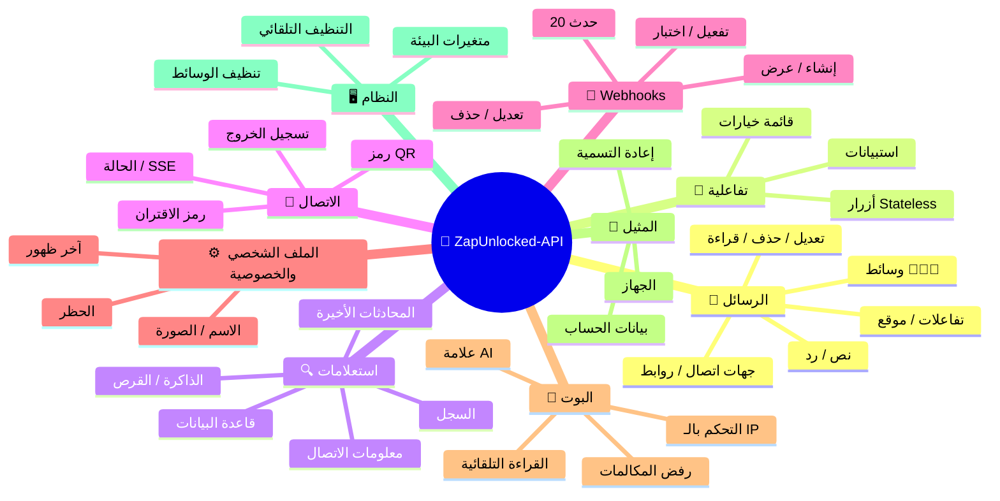
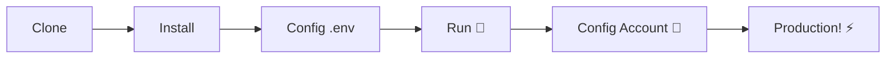

# 🚀 [ZapUnlocked-API](https://zapunlocked-api.kauafpss.com.br) 📲✨


<p align="center">
  
  
  
  
  
</p>

<table width="100%">
  <tr>
    <td align="center" valign="middle"><a href="https://github.com/kauafpssx/ZapUnlocked-API/blob/main/docs/translations/en.md"></a></td>
    <td align="center" valign="middle"><a href="https://github.com/kauafpssx/ZapUnlocked-API/blob/main/docs/translations/es.md"></a></td>
    <td align="center" valign="middle"><a href="https://github.com/kauafpssx/ZapUnlocked-API/blob/main/docs/translations/fr.md"></a></td>
    <td align="center" valign="middle"><a href="https://github.com/kauafpssx/ZapUnlocked-API/blob/main/docs/translations/de.md"></a></td>
    <td align="center" valign="middle"><a href="https://github.com/kauafpssx/ZapUnlocked-API/blob/main/docs/translations/zh.md"></a></td>
    <td align="center" valign="middle"><a href="https://github.com/kauafpssx/ZapUnlocked-API/blob/main/docs/translations/ja.md"></a></td>
    <td align="center" valign="middle"><a href="https://github.com/kauafpssx/ZapUnlocked-API/blob/main/docs/translations/ru.md"></a></td>
    <td align="center" valign="middle"><a href="https://github.com/kauafpssx/ZapUnlocked-API/blob/main/docs/translations/it.md"></a></td>
    <td align="center" valign="middle"><a href="https://github.com/kauafpssx/ZapUnlocked-API/blob/main/docs/translations/tr.md"></a></td>
    <td align="center" valign="middle"><a href="https://github.com/kauafpssx/ZapUnlocked-API/blob/main/docs/translations/kr.md"></a></td>
    <td align="center" valign="middle"><a href="https://github.com/kauafpssx/ZapUnlocked-API/blob/main/docs/translations/in.md"></a></td>
    <td align="center" valign="middle"><a href="https://github.com/kauafpssx/ZapUnlocked-API/blob/main/docs/translations/nl.md"></a></td>
  </tr>
</table>

---

##  ما هو ZapUnlocked-API؟

سوق واجهات برمجة التطبيقات (API) لواتساب يفرض رسوما شهرية باهظة: عشرات بل مئات الريالات شهريا، مع حدود استخدام ورسوم لكل محادثة وبيانات تمر عبر خوادم طرف ثالث. **ZapUnlocked-API موجود لتغيير هذا.**

مبنية على **Python** وباستخدام **[Neonize](https://github.com/krypton-byte/neonize)** كمحرك اتصال، توفر واجهة REST بسيطة (FastAPI) لإدارة الجلسات وإرسال الوسائط المعقدة وإنشاء تفاعلات ذكية. **لا قاعدة بيانات ثقيلة، لا رسوم شهرية، لا اعتماد على أحد.**

رؤيتنا تقوم على **التفوق التقني** و**استقلالية المطور**. نؤمن بأن الأدوات القوية يجب أن تكون متاحة لمن يبني حلوله الخاصة.

> [!TIP]
> مثالية للمطورين الذين يسعون إلى سرعة دمج البوتات والإشعارات وأنظمة الخدمة الآلية. **دون دفع أي شيء مقابل ذلك.**

---

## 🗺️ نظرة عامة على API



---

## ✨ الميزات البارزة

| الميزة | الوصف |
| :--- | :--- |
| 🧩 **الأزرار عديمة الحالة (Stateless)** | إنشاء تدفقات تفاعلية بدون قاعدة بيانات، باستخدام webhook مشفرة |
| 🔢 **الاقتران بدون رمز QR** | الاتصال عبر رمز رقمي · مثالي للخوادم بدون واجهة رسومية |
| 🎵 **تحويل الصوت التلقائي** | إرسال مقاطع صوتية تظهر كأنها مسجلة في اللحظة (PTT) بشكل أصلي |
| 📦 **طابور الوسائط الذكي** | إدارة تلقائية لمنع الاستهلاك المفرط للذاكرة |
| 🏷️ **البدائل الديناميكية** | تخصيص الرسائل وwebhooks باستخدام `{{name}}` و`{{day}}` و`{{phone}}` |

> [!NOTE]
> جميع الميزات **مجانية 100%** ويتم صيانتها بواسطة مجتمع المصادر المفتوحة.

---

## 📋 مسارات API

<details>
<summary><b>📨 إرسال الرسائل</b> · 13 نقطة نهاية</summary>

| الطريقة | المسار | الوصف |
| :----- | :--- | :-------- |
| `POST` | `/send` | إرسال رسالة نصية / رد |
| `POST` | `/send_image` | إرسال صورة |
| `POST` | `/send_video` | إرسال فيديو (يدعم GIF و PTV) |
| `POST` | `/send_audio` | إرسال صوت (مع تحويل تلقائي إلى PTT) |
| `POST` | `/send_document` | إرسال مستند |
| `POST` | `/send_sticker` | إرسال ملصق |
| `POST` | `/send_reaction` | إرسال تفاعل بإيموجي |
| `POST` | `/send_location` | إرسال موقع |
| `POST` | `/send_contact` | إرسال جهة اتصال |
| `POST` | `/send_contacts` | إرسال جهات اتصال متعددة |
| `POST` | `/send_link` | إرسال رابط مع معاينة |
| `POST` | `/messages/delete` | حذف رسالة |
| `POST` | `/messages/read` | وضع علامة كمقروء |
| `POST` | `/messages/edit` | تعديل رسالة مرسلة |
</details>

<details>
<summary><b>🔘 الرسائل التفاعلية</b> · 4 نقاط نهاية</summary>

| الطريقة | المسار | الوصف |
| :----- | :--- | :-------- |
| `POST` | `/send_wbuttons` | إرسال أزرار (قائمة، إجراء، OTP، PIX) |
| `POST` | `/messages/send-option-list` | إرسال قائمة خيارات |
| `POST` | `/messages/send-poll` | إرسال استبيان |
| `POST` | `/messages/send-poll-vote` | التصويت في استبيان |
</details>

<details>
<summary><b>🔍 الاستعلامات والإدارة</b> · 7 نقاط نهاية</summary>

| الطريقة | المسار | الوصف |
| :----- | :--- | :-------- |
| `POST` | `/contacts/info` | معلومات مفصلة عن جهة الاتصال |
| `POST` | `/management/fetch_messages` | جلب سجل الرسائل |
| `POST` | `/management/recent_contacts` | عرض المحادثات الأخيرة |
| `GET` | `/management/memory` | حالة استخدام الذاكرة |
| `GET` | `/management/volume_stats` | التحقق من استخدام القرص |
| `GET` | `/management/database/status` | حالة وإحصائيات قاعدة البيانات |
| `POST` | `/management/database/cleanup` | تنظيف يدوي لقاعدة البيانات |
</details>

<details>
<summary><b>🔗 الاتصال والجلسة</b> · 8 نقاط نهاية</summary>

| الطريقة | المسار | الوصف |
| :----- | :--- | :-------- |
| `GET` | `/` | صفحة الترحيب (HTML) |
| `GET` | `/status` | حالة الاتصال والجلسة |
| `GET` | `/status/stream` | حالة في الوقت الفعلي (SSE) |
| `GET` | `/qr` | عرض رمز QR تفاعلي |
| `GET` | `/qr/image` | الحصول على صورة رمز QR (Base64) |
| `POST` | `/qr/pair` | إنشاء رمز اقتران رقمي |
| `GET` | `/settings/phone-code/{phone}` | إنشاء رمز عبر الرقم |
| `POST` | `/qr/logout` | قطع الاتصال وإعادة تعيين الجلسة |
</details>

<details>
<summary><b>📡 Webhooks (CRUD)</b> · 7 نقاط نهاية</summary>

| الطريقة | المسار | الوصف |
| :----- | :--- | :-------- |
| `POST` | `/webhooks` | إنشاء webhook مسمى |
| `GET` | `/webhooks` | عرض جميع webhooks |
| `PUT` | `/webhooks/{name}` | تعديل webhook |
| `DELETE` | `/webhooks/{name}` | إزالة webhook |
| `POST` | `/webhooks/{name}/toggle` | تفعيل / إلغاء تفعيل |
| `POST` | `/webhooks/{name}/test` | اختبار webhook |
| `GET` | `/webhooks/events` | عرض أنواع الأحداث (20 نوع) |
</details>

<details>
<summary><b>⚙️ الملف الشخصي والخصوصية</b> · 3 نقاط نهاية</summary>

| الطريقة | المسار | الوصف |
| :----- | :--- | :-------- |
| `POST` | `/settings/profile` | تغيير اسم وصورة البوت |
| `POST` | `/settings/privacy` | ضبط الخصوصية (آخر ظهور، إلخ) |
| `POST` | `/settings/block` | حظر / إلغاء حظر جهة اتصال |
</details>

<details>
<summary><b>🤖 إعدادات البوت</b> · 5 نقاط نهاية</summary>

| الطريقة | المسار | الوصف |
| :----- | :--- | :-------- |
| `GET` | `/settings/bot` | عرض إعدادات البوت |
| `POST` | `/settings/bot` | تحديث الإعدادات (علامة AI، التحكم بالـ IP) |
| `PUT` | `/settings/instance/call-reject-auto` | رفض المكالمات تلقائيا |
| `PUT` | `/settings/instance/call-reject-message` | رسالة المكالمة المرفوضة |
| `PUT` | `/settings/instance/auto-read-message` | القراءة التلقائية للرسائل |
</details>

<details>
<summary><b>📱 المثيل</b> · 3 نقاط نهاية</summary>

| الطريقة | المسار | الوصف |
| :----- | :--- | :-------- |
| `GET` | `/instance/me` | بيانات الحساب المتصل |
| `GET` | `/instance/device` | البيانات التقنية للجهاز |
| `PUT` | `/instance/update-name` | إعادة تسمية المثيل |
</details>

<details>
<summary><b>🖥️ النظام</b> · 5 نقاط نهاية</summary>

| الطريقة | المسار | الوصف |
| :----- | :--- | :-------- |
| `GET` | `/system/env` | عرض متغيرات البيئة |
| `PUT` | `/system/env` | تحديث متغيرات البيئة |
| `POST` | `/system/cleanup/force` | تنظيف إجباري للوسائط المؤقتة |
| `GET` | `/system/cleanup/settings` | عرض إعدادات التنظيف التلقائي |
| `PUT` | `/system/cleanup/settings` | تحديث فاصل التنظيف التلقائي |
</details>

> **المجموع: 56 نقطة نهاية** · REST كاملة لأتمتة واتساب.

---

## 🛠️ التثبيت والاستضافة

> قم بتشغيل واجهة API الواتساب الاحترافية الخاصة بك في أقل من **5 دقائق** باستخدام **ZapUnlocked-API**.

### 💻 التثبيت المحلي

مثالية للتطوير والاختبار أو التشغيل على خادم خاص.



**1. استنساخ المستودع**

```bash
git clone https://github.com/kauafpssx/ZapUnlocked-API.git
cd ZapUnlocked-API
```

**2. تثبيت التبعيات**

| النظام | الأمر |
| :------ | :------ |
| 🪟 Windows | `scripts\install\install.bat` |
| 🐧 Linux / macOS | `bash scripts/install/install.sh` |

**3. تهيئة البيئة**

| النظام | الأمر |
| :------ | :------ |
| 🪟 Windows | `scripts\generate-env\generate-env.bat` |
| 🐧 Linux / macOS | `bash scripts/generate-env/generate-env.sh` |

| المتغير | الوصف |
| :------- | :-------- |
| `API_KEY` | كلمة المرور للمصادقة على جميع نقاط النهاية |
| `INTERNAL_SECRET` | رمز مميز للتحقق من توقيعات webhook |
| `PORT` | منفذ API (الافتراضي: `8300`) |

**4. تشغيل API**

| النظام | الأمر |
| :------ | :------ |
| 🪟 Windows | `scripts\run\run.bat` |
| 🐧 Linux / macOS | `bash scripts/run/run.sh` |

---

### ☁️ الاستضافة: Alwaysdata (مجاني 24/7)

**Alwaysdata** هو الخيار الموصى به لاستضافة API بشكل مستقر ومجاني دون الحاجة إلى صيانة خادم خاص.

#### 📊 موارد الخطة المجانية

| المورد | متاح في الخطة المجانية |
| :------ | :----------------- |
| 💾 التخزين | **1 GB SSD** |
| 🧠 RAM | **256 MB** |
| ⚡ CPU | **1/4 vCPU** |
| 🔄 النسخ الاحتياطي | **3 أيام** تلقائي |
| 📡 وقت التشغيل | **24/7** عبر Services |

#### 👣 خطوات النشر خطوة بخطوة

**1.** أنشئ حسابك على [Alwaysdata.com](https://www.alwaysdata.com/) · خطة **Free**.

**2.** قم بالوصول عبر SSH: `https://ssh-[usuario].alwaysdata.net`.

**3.** استنسخ وقم بالتثبيت:

```bash
git clone https://github.com/kauafpssx/ZapUnlocked-API.git ~/ZapUnlocked-API
cd ~/ZapUnlocked-API
bash scripts/install/install.sh
```

**4.** قم بإنشاء `.env`:

```bash
bash scripts/generate-env/generate-env.sh
```

**5.** قم بتكوين الخدمة (24/7) في **Advanced › Services › Add a service**:

| الحقل | القيمة |
| :---- | :---- |
| **Name** | `ZapUnlocked-API` |
| **Command** | `python3 main.py` |
| **Working directory** | `ZapUnlocked-API` |
| **Environment variables** | `PORT=8300` |

**6.** الوصول عبر:

```
http://services-[usuario].alwaysdata.net:8300/
```

> [!TIP]
> العنوان URL قابل للوصول من الخارج بالفعل. *(اختياري)* لاستخدام نطاق مخصص، قم بتكوين **Reverse Proxy** في **Web › Sites › Add a site** مع توجيهه إلى `http://[usuario].alwaysdata.net`.

---

## 🔐 المصادقة (تسجيل الدخول)

بعد النشر، قم بتوصيل حساب واتساب الخاص بك عن طريق الوصول في المتصفح:

```text
http://services-[usuario].alwaysdata.net:8300/qr?API_KEY=SUA_SENHA_SECRETA
```

---

## 📖 الوثائق الرسمية

<p align="center">
  👉 <a href="https://zapunlocked-api.kauafpss.com.br"><strong>zapunlocked-api.kauafpss.com.br</strong></a>
</p>

للحصول على وثائق تقنية مفصلة وأمثلة برمجية ومنصة تفاعلية، قم بزيارة موقعنا الرسمي.

> [!TIP]
> استخدم **LLMs.txt** كفهرس للذكاء الاصطناعي: [`zapunlocked-api.kauafpss.com.br/llms.txt`](https://zapunlocked-api.kauafpss.com.br/llms.txt). اكتشف جميع الصفحات قبل الاستكشاف.

---

## ❤️ الاعتمادات والشكر

| المشروع | الوصف |
| :------ | :-------- |
| [](https://github.com/krypton-byte/neonize) | مكتبة Python للاتصال المباشر بـ WhatsApp Web |
| [](https://github.com/tulir/whatsmeow) | مكتبة Go الأساسية لـ Neonize · قلب الاتصال |
| [](https://www.alwaysdata.com/) | بنية تحتية مجانية عالية الجودة |

---

## 📄 الترخيص

هذا المشروع مرخص تحت **رخصة MIT**.

<p align="center">
  تم صنعه بـ 💜 بواسطة <a href="https://www.instagram.com/kauafpss_/">Kauã Ferreira</a>
</p>

