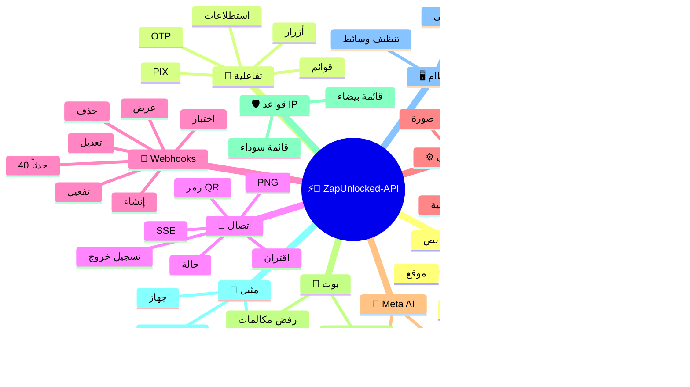
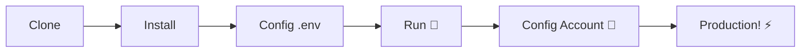

# ⚡💬 [ZapUnlocked-API](https://zapunlocked-api.kauafpss.com.br/)


<p align="center">
  
  <a href="https://downgit.github.io/#/home?url=https://github.com/kauafpssx/ZapUnlocked-API/blob/main/ZapUnlocked.collection.json">
    
  </a>
  
  
  
</p>

---

### 🌐 اختر اللغة:

<table width="100%">
  <tr>
    <td align="center" valign="middle"><a href="https://github.com/kauafpssx/ZapUnlocked-API/blob/main/README.md"></a></td>
    <td align="center" valign="middle"><a href="https://github.com/kauafpssx/ZapUnlocked-API/blob/main/docs/translations/en.md"></a></td>
    <td align="center" valign="middle"><a href="https://github.com/kauafpssx/ZapUnlocked-API/blob/main/docs/translations/es.md"></a></td>
    <td align="center" valign="middle"><a href="https://github.com/kauafpssx/ZapUnlocked-API/blob/main/docs/translations/fr.md"></a></td>
    <td align="center" valign="middle"><a href="https://github.com/kauafpssx/ZapUnlocked-API/blob/main/docs/translations/de.md"></a></td>
    <td align="center" valign="middle"><a href="https://github.com/kauafpssx/ZapUnlocked-API/blob/main/docs/translations/zh.md"></a></td>
    <td align="center" valign="middle"><a href="https://github.com/kauafpssx/ZapUnlocked-API/blob/main/docs/translations/ja.md"></a></td>
    <td align="center" valign="middle"><a href="https://github.com/kauafpssx/ZapUnlocked-API/blob/main/docs/translations/ru.md"></a></td>
    <td align="center" valign="middle"><a href="https://github.com/kauafpssx/ZapUnlocked-API/blob/main/docs/translations/it.md"></a></td>
    <td align="center" valign="middle"><a href="https://github.com/kauafpssx/ZapUnlocked-API/blob/main/docs/translations/ar.md"></a></td>
    <td align="center" valign="middle"><a href="https://github.com/kauafpssx/ZapUnlocked-API/blob/main/docs/translations/tr.md"></a></td>
    <td align="center" valign="middle"><a href="https://github.com/kauafpssx/ZapUnlocked-API/blob/main/docs/translations/ko.md"></a></td>
    <td align="center" valign="middle"><a href="https://github.com/kauafpssx/ZapUnlocked-API/blob/main/docs/translations/hi.md"></a></td>
    <td align="center" valign="middle"><a href="https://github.com/kauafpssx/ZapUnlocked-API/blob/main/docs/translations/nl.md"></a></td>
  </tr>
</table>

---

##  ما هو ZapUnlocked-API؟

سوق واجهات برمجة تطبيقات واتساب يفرض رسوماً شهرية باهظة: عشرات إلى مئات الريالات شهرياً، مع حدود استخدام ورسوم لكل محادثة وبيانات تمر عبر خوادم طرف ثالث. **ZapUnlocked-API مجاني ومفتوح المصدر.**

مبنية على **Python** مع **[Neonize](https://github.com/krypton-byte/neonize)** كمحرك اتصال، تستخدم API واجهة FastAPI لإدارة الجلسات وإرسال الوسائط وإنشاء البوتات. لا قاعدة بيانات ثقيلة، لا رسوم شهرية، لا خوادم طرف ثالث.

> [!TIP]
> استخدم للبوتات والإشعارات وأنظمة خدمة العملاء. **100% مجاني.**

> [!IMPORTANT]
> 🤖 **Meta AI مدمج.** استخدم `/ai/ask` للدردشة و `/ai/imagine` لإنشاء الصور داخل WhatsApp. [عرض المسار](#-meta-ai--2-endpoints).

---

## 🗺️ نظرة عامة على API



---

## ✨ الميزات البارزة

| الميزة | الوصف |
| :------------- | :-------- |
| 🧩 **أزرار بدون حالة** | أنشئ تدفقات تفاعلية بدون قاعدة بيانات، مع webhooks مشفرة |
| 🔢 **اقتران بدون رمز QR** | اتصل عبر رمز رقمي · مثالي للخوادم بدون واجهة رسومية |
| 🎵 **تحويل الصوت التلقائي** | أرسل مقاطع صوتية تظهر كأنها مسجلة (PTT) بشكل أصلي |
| 📦 **طابور وسائط ذكي** | إدارة تلقائية لتجنب الاستهلاك المفرط للذاكرة |
| 🏷️ **بدائل ديناميكية** | خصص الرسائل وwebhooks باستخدام `{{name}}` و `{{day}}` و `{{phone}}` |
| 🤖 **Meta AI** | الدردشة وإنشاء الصور بالذكاء الاصطناعي داخل WhatsApp. |
| ⌨️ **معلمات عامة** | `delay_message` و `delay_typing` و `reply`/`quoted_id` و `@إشارات` تعمل على **جميع** نقاط نهاية الإرسال. |
| 🔐 **Webhooks موقعة** | التكامل عبر HMAC-SHA256. webhook الخاص بك يقبل فقط البيانات المشروعة. |
| 🔄 **إعادة اتصال تلقائي** | يعيد الاتصال تلقائياً عند قطع الاتصال أو تسجيل الخروج عن بعد أو خطأ التدفق. |
| 📁 **رفع ملف + URL** | أرسل الوسائط عن طريق الرفع المباشر **أو** URL عام. |

> [!NOTE]
> جميع الميزات **مجانية 100%** وتُصان بواسطة مجتمع المصادر المفتوحة.

---

## 📋 مسارات API

<details>
<summary><b>📨 إرسال الرسائل</b> · 15 نقطة نهاية</summary>

| الطريقة | المسار | الوصف | الجسم |
| :----- | :--- | :-------- | :--- |
| `POST` | `/send` | إرسال رسالة نصية / رد | `phone`, `message` |
| `POST` | `/send_image` | إرسال صورة | `phone`, `image_url` |
| `POST` | `/send_video` | إرسال فيديو (يدعم GIF و PTV) | `phone`, `video_url` |
| `POST` | `/send_gif` | إرسال GIF متحرك | `phone`, `url` |
| `POST` | `/send_audio` | إرسال صوت (مع تحويل تلقائي إلى PTT) | `phone`, `audio_url` |
| `POST` | `/send_document` | إرسال مستند | `phone`, `document_url` |
| `POST` | `/send_sticker` | إرسال ملصق | `phone`, `sticker_url` |
| `POST` | `/send_reaction` | إرسال رد فعل برمز تعبيري | `phone`, `messageId`, `emoji` |
| `POST` | `/send_location` | إرسال موقع | `phone`, `lat`, `lng` |
| `POST` | `/send_contact` | إرسال جهة اتصال | `phone`, `name`, `contactPhone` |
| `POST` | `/send_contacts` | إرسال جهات اتصال متعددة | `phone`, `contacts` |
| `POST` | `/send_link` | إرسال رابط مع معاينة | `phone`, `url` |
| `POST` | `/messages/delete` | حذف رسالة | `phone`, `messageId` |
| `POST` | `/messages/read` | وضع علامة كمقروء | `phone`, `messageIds` |
| `POST` | `/messages/edit` | تعديل رسالة مرسلة | `phone`, `messageId`, `message` |

> [!TIP]
> **معلمات عامة.** متوفرة في **كل** نقطة نهاية لإرسال الرسائل (بما في ذلك التفاعلية):
>
> | المعلمة | الوظيفة |
> | :-------- | :------ |
> | `delay_message` | ينتظر N ثانية قبل الإرسال. |
> | `delay_typing` | يعرض "يكتب..." لمدة N ثانية قبل الإرسال. |
> | `reply` / `quoted_id` | معرف الرسالة للرد عليها (اقتباس). |
> | `mentioned` | مصفوفة JSON من الأرقام للإشارة إليها @. مثال: `["5511999999999"]` |

</details>

<details>
<summary><b>🔘 الرسائل التفاعلية</b> · 9 نقاط نهاية</summary>

| الطريقة | المسار | الوصف | الجسم |
| :----- | :--- | :-------- | :--- |
| `POST` | `/messages/send-button-list` | زر قائمة خيارات | `phone`, `buttons` |
| `POST` | `/messages/send-button-quick-reply` | زر رد سريع | `phone`, `title`, `buttons` |
| `POST` | `/messages/send-button-otp` | زر نسخ (OTP) | `phone`, `code` |
| `POST` | `/messages/send-button-pix` | زر PIX | `phone`, `pixKey` |
| `POST` | `/messages/send-button-url` | زر مع رابط | `phone`, `title`, `url` |
| `POST` | `/messages/send-button-call` | زر اتصال | `phone`, `title`, `phoneNumber` |
| `POST` | `/messages/send-option-list` | ⛔ **معطل مؤقتاً** (غير متوافق مع iPhone وAndroid وWeb) | `phone`, `buttons` |
| `POST` | `/messages/send-poll` | إرسال استطلاع | `phone`, `name`, `options` |
| `POST` | `/messages/send-poll-vote` | التصويت في استطلاع | `phone`, `options` |
</details>

<details>
<summary><b>🔍 الاستعلامات والإدارة</b> · 12 نقطة نهاية</summary>

| الطريقة | المسار | الوصف | الجسم |
| :----- | :--- | :-------- | :--- |
| `POST` | `/management/fetch_messages` | جلب سجل الرسائل | `phone` |
| `POST` | `/management/recent_contacts` | عرض المحادثات الأخيرة | ❌ |
| `GET` | `/management/chats` | عرض المحادثات مع السجل | ❌ |
| `GET` | `/management/chats/{phone}/messages` | رسائل محادثة محددة | ❌ |
| `GET` | `/management/contacts/{phone}` | معلومات مفصلة لجهة الاتصال | ❌ |
| `GET` | `/management/groups` | عرض المجموعات | ❌ |
| `DELETE` | `/management/cleanup` | مسح بيانات المحادثة | ❌ |
| `GET` | `/management/export` | تصدير الإعدادات (webhooks, settings, IP rules) | ❌ |
| `POST` | `/management/import` | استيراد الإعدادات عبر رفع ملف | `file` |
| `GET` | `/management/database/status` | حالة وإحصائيات قاعدة البيانات | ❌ |
| `POST` | `/management/database/config` | تحديث إعدادات قاعدة البيانات | `interval` |
| `POST` | `/management/database/cleanup` | تنظيف يدوي لقاعدة البيانات | ❌ |
</details>

<details>
<summary><b>👤 جهات الاتصال</b> · 1 نقطة نهاية</summary>

| الطريقة | المسار | الوصف | الجسم |
| :----- | :--- | :-------- | :--- |
| `POST` | `/contacts/info` | معلومات مفصلة لجهة الاتصال | `phone` |
</details>

<details>
<summary><b>🏠 عام / الحالة</b> · 9 نقاط نهاية</summary>

| الطريقة | المسار | الوصف | الجسم |
| :----- | :--- | :-------- | :--- |
| `GET` | `/` | صفحة الترحيب (HTML) | ❌ |
| `GET` | `/status` | الحالة الكاملة (WhatsApp، وحدة المعالجة، الذاكرة، القرص) | ❌ |
| `GET` | `/status/stream` | حالة في الوقت الفعلي عبر SSE | ❌ |
| `GET` | `/status/health` | فحص الصحة البسيط (`{"ok":true}`) | ❌ |
| `GET` | `/status/readiness` | فحص الجاهزية (503 إذا كان WhatsApp غير متصل) | ❌ |
| `GET` | `/status/memory` | حالة الذاكرة (العملية + النظام) | ❌ |
| `GET` | `/status/volume` | حالة القرص (الحجم، الملفات) | ❌ |
| `GET` | `/collection.json` | تنزيل مجموعة Postman | ❌ |
| `POST` | `/collection.json` | تحديث مجموعة Postman | JSON body |
</details>

<details>
<summary><b>🔗 الاتصال (QR)</b> · 2 نقطة نهاية</summary>

| الطريقة | المسار | الوصف | الجسم |
| :----- | :--- | :-------- | :--- |
| `GET` | `/qr` | عرض رمز QR تفاعلي (HTML) | ❌ |
| `GET` | `/qr/image` | الحصول على صورة رمز QR (PNG) | ❌ |
</details>

<details>
<summary><b>🔐 الجلسة</b> · 2 نقطة نهاية</summary>

| الطريقة | المسار | الوصف | الجسم |
| :----- | :--- | :-------- | :--- |
| `POST` | `/session/pair` | إنشاء رمز اقتران رقمي | `phone` |
| `POST` | `/session/logout` | قطع الاتصال وإعادة تعيين الجلسة | ❌ |
</details>

<details>
<summary><b>📡 Webhooks (CRUD)</b> · 8 نقاط نهاية</summary>

| الطريقة | المسار | الوصف | الجسم |
| :----- | :--- | :-------- | :--- |
| `POST` | `/webhooks` | إنشاء webhook مسمى | `name`, `url` |
| `GET` | `/webhooks` | عرض جميع webhooks | ❌ |
| `GET` | `/webhooks/{name}` | الحصول على webhook بالاسم | ❌ |
| `PUT` | `/webhooks/{name}` | تعديل webhook | ❌ |
| `DELETE` | `/webhooks/{name}` | حذف webhook | ❌ |
| `POST` | `/webhooks/{name}/toggle` | تفعيل / إلغاء تفعيل | `active` |
| `POST` | `/webhooks/{name}/test` | اختبار webhook | ❌ |
| `GET` | `/webhooks/events` | عرض أنواع الأحداث (40 نوعاً) | ❌ |
</details>

<details>
<summary><b>⚙️ الملف الشخصي والخصوصية</b> · 13 نقطة نهاية</summary>

| الطريقة | المسار | الوصف | الجسم |
| :----- | :--- | :-------- | :--- |
| `POST` | `/settings/profile` | تغيير اسم وصورة البوت | `name?`, `photo?` (Form) |
| `POST` | `/settings/block` | حظر / إلغاء حظر جهة اتصال | `phone`, `action` |
| `PUT` | `/settings/privacy/last-seen` | آخر ظهور | `value` |
| `PUT` | `/settings/privacy/online` | الحالة متصل | `value` |
| `PUT` | `/settings/privacy/profile` | رؤية الصورة الشخصية | `value` |
| `PUT` | `/settings/privacy/status` | رؤية الحالة | `value` |
| `PUT` | `/settings/privacy/read-receipts` | تأكيد القراءة | `value` |
| `PUT` | `/settings/privacy/groups-add` | من يمكنه الإضافة إلى المجموعات | `value` |
| `PUT` | `/settings/privacy/call-add` | من يمكنه الإضافة إلى المكالمة | `value` |
| `PUT` | `/settings/privacy/about` | عن / رسالة الحالة | `value?` |
| `PUT` | `/settings/privacy/disappearing-timer` | مؤقت الرسائل المؤقتة | `value?` |
| `GET` | `/settings/ip-control` | عرض حالة التحكم في IP | ❌ |
| `PUT` | `/settings/ip-control` | تفعيل/إلغاء تفعيل التحكم في IP | `enabled` |
</details>

<details>
<summary><b>🤖 إعدادات البوت</b> · 4 نقاط نهاية</summary>

| الطريقة | المسار | الوصف | الجسم |
| :----- | :--- | :-------- | :--- |
| `PUT` | `/settings/instance/call-reject-auto` | رفض المكالمات تلقائياً | `value` |
| `PUT` | `/settings/instance/call-reject-message` | رسالة رفض المكالمة | `value` |
| `PUT` | `/settings/instance/auto-read-message` | القراءة التلقائية للرسائل | `value` |
| `GET` | `/settings/phone-code/{phone}` | إنشاء رمز اقتران عبر رقم الهاتف | ❌ |
</details>

<details>
<summary><b>📱 المثيل</b> · 3 نقاط نهاية</summary>

| الطريقة | المسار | الوصف | الجسم |
| :----- | :--- | :-------- | :--- |
| `GET` | `/instance/me` | بيانات الحساب المتصل | ❌ |
| `GET` | `/instance/device` | البيانات الفنية للجهاز | ❌ |
| `PUT` | `/instance/update-name` | إعادة تسمية المثيل | `name` |
</details>

<details>
<summary><b>🛡️ قواعد IP</b> · 5 نقاط نهاية</summary>

| الطريقة | المسار | الوصف | الجسم |
| :----- | :--- | :-------- | :--- |
| `GET` | `/settings/ip-rules` | عرض قواعد IP (القائمة البيضاء/السوداء) | ❌ |
| `POST` | `/settings/ip-rules/whitelist` | إضافة IP إلى القائمة البيضاء | `ip` |
| `POST` | `/settings/ip-rules/blacklist` | إضافة IP إلى القائمة السوداء | `ip` |
| `DELETE` | `/settings/ip-rules/whitelist/{ip}` | إزالة IP من القائمة البيضاء | ❌ |
| `DELETE` | `/settings/ip-rules/blacklist/{ip}` | إزالة IP من القائمة السوداء | ❌ |
</details>

<details>
<summary><b>🖥️ النظام</b> · 5 نقاط نهاية</summary>

| الطريقة | المسار | الوصف | الجسم |
| :----- | :--- | :-------- | :--- |
| `GET` | `/system/env` | عرض متغيرات البيئة | ❌ |
| `PUT` | `/system/env` | تحديث متغيرات البيئة | ❌ |
| `POST` | `/system/cleanup/force` | تنظيف إجباري للوسائط المؤقتة | ❌ |
| `GET` | `/system/cleanup/settings` | عرض إعدادات التنظيف التلقائي | ❌ |
| `PUT` | `/system/cleanup/settings` | تحديث فاصل التنظيف التلقائي | ❌ |
</details>

<details>
<summary><b>📊 السجلات</b> · 3 نقاط نهاية</summary>

| الطريقة | المسار | الوصف | الجسم |
| :----- | :--- | :-------- | :--- |
| `GET` | `/logs/files` | عرض ملفات السجل | ❌ |
| `GET` | `/logs` | عرض السجلات مع فلاتر | ❌ |
| `POST` | `/logs/cleanup` | فرض ضغط/تنظيف السجلات | ❌ |
</details>

<details>
<summary><b>📈 الإحصائيات</b> · 6 نقاط نهاية</summary>

| الطريقة | المسار | الوصف | الجسم |
| :----- | :--- | :-------- | :--- |
| `GET` | `/stats` | إحصائيات (مدة التشغيل، الرسائل، webhooks) | ❌ |
| `DELETE` | `/stats` | إعادة تعيين الإحصائيات | ❌ |
| `GET` | `/stats/webhooks` | إحصائيات جميع webhooks | ❌ |
| `GET` | `/stats/webhooks/{name}` | إحصائيات webhook محدد | ❌ |
| `DELETE` | `/stats/webhooks` | إعادة تعيين إحصائيات جميع webhooks | ❌ |
| `DELETE` | `/stats/webhooks/{name}` | إعادة تعيين إحصائيات webhook محدد | ❌ |
</details>

<details>
<summary><b>🤖 Meta AI</b> · 2 نقطة نهاية</summary>

| الطريقة | المسار | الوصف | الجسم |
| :----- | :--- | :-------- | :--- |
| `POST` | `/ai/ask` | سؤال Meta AI | `message` |
| `POST` | `/ai/imagine` | إنشاء صورة باستخدام Meta AI | `prompt` |
</details>

<details>
<summary><b>🔐 جلسات متعددة</b> · 7 نقاط نهاية</summary>

| الطريقة | المسار | الوصف | الجسم |
| :----- | :--- | :-------- | :--- |
| `GET` | `/sessions` | عرض جميع الجلسات | ❌ |
| `POST` | `/sessions` | إنشاء جلسة جديدة | `name?` |
| `PUT` | `/sessions/{id}/rename` | إعادة تسمية الجلسة | `name` |
| `DELETE` | `/sessions/{id}` | إلغاء تنشيط الجلسة | ❌ |
| `POST` | `/sessions/{id}/connect` | توصيل الجلسة | ❌ |
| `POST` | `/sessions/{id}/disconnect` | فصل الجلسة | ❌ |
| `GET` | `/sessions/{id}/status` | حالة الجلسة | ❌ |
</details>

<details>
<summary><b>📡 Webhooks (السجلات)</b> · 3 نقاط نهاية</summary>

| الطريقة | المسار | الوصف | الجسم |
| :----- | :--- | :-------- | :--- |
| `GET` | `/webhooks/{name}/logs` | سجلات تسليم webhook | ❌ |
| `DELETE` | `/webhooks/{name}/logs` | مسح سجلات webhook | ❌ |
| `DELETE` | `/webhooks/logs/all` | مسح سجلات جميع webhooks | ❌ |
</details>

> **الإجمالي: 108 نقطة نهاية**

---

## 📡 أحداث Webhook

جميع webhooks تتلقى مغلفاً قياسياً:

```json
{
  "event": "message.text",
  "timestamp": "2025-01-01T12:00:00Z",
  "data": { ... }
}
```

إذا كان webhook يحتوي على `body` مخصص مع `{{placeholders}}`، فسيتم إرسال هذا الـ body بدلاً من المغلف القياسي.

---

<details>
<summary><b>🏷️ العناصر النائبة المتاحة في الـ body المخصص</b></summary>

| العنصر النائب | القيمة |
| :---------- | :---- |
| `{{from}}` | رقم المرسل |
| `{{text}}` | نص الرسالة |
| `{{phone}}` | نفس `{{from}}` |
| `{{id}}` | معرف الرسالة |
| `{{requested}}` | الكمية المطلوبة (fetchMessages) |
| `{{found}}` | الكمية الموجودة (fetchMessages) |
| `{{timestamp}}` | الطابع الزمني UTC الحالي |

</details>

---

<details>
<summary><b>📥 الرسائل المستلمة</b> · 18 حدثاً</summary>

> **حقول الوسائط:** أحداث الوسائط (`message.image`, `message.video`, `message.audio`, `message.document`, `message.sticker`) تتضمن حقولاً إضافية عندما يكون `RECEIVE_MEDIA_ENABLED=true`: `mediaBase64` (base64 للملف)، `fileName`, `mimeType`, `mediaTooLarge` (bool: true عندما يتجاوز `RECEIVE_MEDIA_MAX_SIZE_MB`).

الحقول الأساسية الموجودة في أحداث الرسائل المستلمة:

```json
{
  "messageId": "3EB0ABCDEF123456",
  "from": "5511999999999",
  "fromName": "أحمد علي",
  "fromJid": "5511999999999@s.whatsapp.net",
  "isGroup": false
}
```

<details>
<summary><code>message.text</code> - نص عادي / منسق</summary>

```json
{
  "event": "message.text",
  "data": {
    "...base": "...",
    "text": "مرحباً! كيف يمكنني المساعدة؟",
    "quoted": { "id": "3EB0...", "fromMe": true }
  }
}
```
</details>

<details>
<summary><code>message.image</code> - صورة مستلمة</summary>

```json
{
  "event": "message.image",
  "data": {
    "...base": "...",
    "caption": "صورة المنتج",
    "mimetype": "image/jpeg",
    "fileLength": 204800
  }
}
```
</details>

<details>
<summary><code>message.video</code> - فيديو مستلم</summary>

```json
{
  "event": "message.video",
  "data": {
    "...base": "...",
    "caption": "شاهد هذا الفيديو!",
    "mimetype": "video/mp4",
    "fileLength": 5242880,
    "isPTT": false,
    "isGif": false
  }
}
```
</details>

<details>
<summary><code>message.audio</code> - صوت / رسالة صوتية</summary>

```json
{
  "event": "message.audio",
  "data": {
    "...base": "...",
    "mimetype": "audio/ogg; codecs=opus",
    "fileLength": 30720,
    "isPTT": true,
    "durationSeconds": 8
  }
}
```
</details>

<details>
<summary><code>message.document</code> - مستند / ملف</summary>

```json
{
  "event": "message.document",
  "data": {
    "...base": "...",
    "fileName": "عقد.pdf",
    "caption": "إليك العقد",
    "mimetype": "application/pdf",
    "fileLength": 102400
  }
}
```
</details>

<details>
<summary><code>message.sticker</code> - ملصق</summary>

```json
{
  "event": "message.sticker",
  "data": {
    "...base": "...",
    "mimetype": "image/webp",
    "isAnimated": false
  }
}
```
</details>

<details>
<summary><code>message.contact</code> - جهة اتصال مشتركة</summary>

```json
{
  "event": "message.contact",
  "data": {
    "...base": "...",
    "displayName": "مريم سوزا",
    "vcard": "BEGIN:VCARD\nVERSION:3.0\n..."
  }
}
```
</details>

<details>
<summary><code>message.contacts</code> - جهات اتصال متعددة</summary>

```json
{
  "event": "message.contacts",
  "data": {
    "...base": "...",
    "displayName": "جهتا اتصال",
    "count": 2,
    "contacts": [
      { "displayName": "مريم سوزا", "vcard": "BEGIN:VCARD\n..." },
      { "displayName": "أحمد علي", "vcard": "BEGIN:VCARD\n..." }
    ]
  }
}
```
</details>

<details>
<summary><code>message.location</code> - موقع</summary>

```json
{
  "event": "message.location",
  "data": {
    "...base": "...",
    "lat": -23.5505,
    "lng": -46.6333,
    "name": "شارع باوليستا",
    "address": "شارع باوليستا، 1000 - ساو باولو"
  }
}
```
</details>

<details>
<summary><code>message.reaction</code> - رد فعل (رمز تعبيري)</summary>

```json
{
  "event": "message.reaction",
  "data": {
    "...base": "...",
    "emoji": "❤️",
    "targetMessageId": "3EB0ABCDEF123456",
    "isRemoved": false
  }
}
```
</details>

<details>
<summary><code>message.poll_created</code> - استطلاع مستلم</summary>

```json
{
  "event": "message.poll_created",
  "data": {
    "...base": "...",
    "pollName": "ما هو أفضل نكهة؟",
    "options": ["شوكولاتة", "فراولة", "فانيليا"]
  }
}
```
</details>

<details>
<summary><code>message.poll_vote</code> - تصويت في استطلاع</summary>

```json
{
  "event": "message.poll_vote",
  "data": {
    "...base": "...",
    "pollId": "3EB0ABCDEF123456",
    "selectedOptions": ["شوكولاتة"]
  }
}
```
</details>

<details>
<summary><code>message.button_reply</code> - نقرة على زر</summary>

```json
{
  "event": "message.button_reply",
  "data": {
    "...base": "...",
    "buttonId": "option_yes",
    "displayText": "نعم",
    "type": "quick_reply"
  }
}
```
</details>

<details>
<summary><code>message.list_reply</code> - اختيار من قائمة تفاعلية</summary>

```json
{
  "event": "message.list_reply",
  "data": {
    "...base": "...",
    "rowId": "1",
    "title": "X-Burger",
    "description": "R$ 18.90"
  }
}
```
</details>

<details>
<summary><code>message.deleted</code> - رسالة محذوفة بواسطة المرسل</summary>

```json
{
  "event": "message.deleted",
  "data": {
    "...base": "..."
  }
}
```
</details>

<details>
<summary><code>message.unknown</code> - نوع غير معروف</summary>

```json
{
  "event": "message.unknown",
  "data": {
    "...base": "...",
    "rawType": "senderKeyDistributionMessage"
  }
}
```
</details>

<details>
<summary><code>message.undecryptable</code> - رسالة غير قابلة لفك التشفير</summary>

```json
{
  "event": "message.undecryptable",
  "data": {
    "...base": "..."
  }
}
```
</details>

</details>

<details>
<summary><b>📤 الرسائل المرسلة</b> · 22 حدثاً</summary>

<details>
<summary><code>message.sent</code> - رسالة مرسلة (عام)</summary>

```json
{
  "event": "message.sent",
  "data": {
    "to": "5511999999999",
    "type": "text",
    "messageId": "3EB0ABCDEF123456"
  }
}
```
</details>

<details>
<summary><code>message.sent.{type}</code> - حدث محدد حسب النوع</summary>

نفس حمولة `message.sent`، لكن مع حدث محدد. مفيد للاشتراك في نوع إرسال واحد.

الأنواع: `text`, `image`, `audio`, `video`, `document`, `sticker`, `gif`, `interactive`, `list`, `poll`, `poll_vote`, `location`, `contact`, `contacts`, `link`, `reaction`, `edit`, `delete`

```json
{
  "event": "message.sent.image",
  "data": {
    "to": "5511999999999",
    "type": "image",
    "messageId": "3EB0ABCDEF123456"
  }
}
```
</details>

<details>
<summary><code>message.delivered</code> - تم تسليم الرسالة للمستلم (receipt type 1)</summary>

```json
{
  "event": "message.delivered",
  "data": {
    "from": "5511999999999",
    "messageId": "3EB0ABCDEF123456"
  }
}
```
</details>

<details>
<summary><code>message.read</code> - تمت قراءة الرسالة من قبل المستلم (receipt type 4)</summary>

```json
{
  "event": "message.read",
  "data": {
    "from": "5511999999999",
    "messageId": "3EB0ABCDEF123456"
  }
}
```
</details>

<details>
<summary><code>message.receipt</code> - أنواع أخرى من التأكيدات (receipt types 2, 3, 5+)</summary>

```json
{
  "event": "message.receipt",
  "data": {
    "from": "5511999999999",
    "messageId": "3EB0ABCDEF123456",
    "receiptType": 2
  }
}
```
</details>

</details>

<details>
<summary><b>🔗 الاتصال</b> · 11 حدثاً</summary>

<details>
<summary><code>connection.connected</code> - واتساب متصل</summary>

```json
{
  "event": "connection.connected",
  "data": {
    "phone": "5511999999999"
  }
}
```
</details>

<details>
<summary><code>connection.disconnected</code> - واتساب غير متصل</summary>

```json
{
  "event": "connection.disconnected",
  "data": {}
}
```
</details>

<details>
<summary><code>connection.qr_ready</code> - تم إنشاء رمز QR</summary>

```json
{
  "event": "connection.qr_ready",
  "data": {
    "qr": "2@abc123..."
  }
}
```
</details>

<details>
<summary><code>connection.pair_code</code> - تم إنشاء رمز الاقتران</summary>

```json
{
  "event": "connection.pair_code",
  "data": {
    "code": "ABCD-1234",
    "connected": false
  }
}
```

`connected: true` عند اكتمال الاقتران.
</details>

<details>
<summary><code>connection.pair_status</code> - حالة الاقتران</summary>

```json
{
  "event": "connection.pair_status",
  "data": {
    "jid": "5511999999999@s.whatsapp.net",
    "businessName": "نشاطي التجاري",
    "platform": "WEB",
    "status": "OK",
    "error": ""
  }
}
```
</details>

<details>
<summary><code>connection.logged_out</code> - تم تسجيل الخروج عن بعد</summary>

```json
{
  "event": "connection.logged_out",
  "data": {
    "reason": "تسجيل خروج المستخدم"
  }
}
```
</details>

<details>
<summary><code>connection.connect_failure</code> - فشل الاتصال</summary>

```json
{
  "event": "connection.connect_failure",
  "data": {
    "reason": "ERROR_CONNECT",
    "message": "انتهت مهلة الاتصال"
  }
}
```
</details>

<details>
<summary><code>connection.stream_error</code> - خطأ في التدفق</summary>

```json
{
  "event": "connection.stream_error",
  "data": {
    "code": "STREAM_ERR"
  }
}
```
</details>

<details>
<summary><code>connection.temporary_ban</code> - حظر مؤقت</summary>

```json
{
  "event": "connection.temporary_ban",
  "data": {
    "code": "BAN_CODE",
    "expire": 1704153600
  }
}
```
</details>

<details>
<summary><code>connection.client_outdated</code> - العميل قديم</summary>

```json
{
  "event": "connection.client_outdated",
  "data": {}
}
```
</details>

<details>
<summary><code>connection.stream_replaced</code> - تم استبدال التدفق</summary>

```json
{
  "event": "connection.stream_replaced",
  "data": {}
}
```
</details>

</details>

<details>
<summary><b>👥 المجموعة</b> · 2 حدثان</summary>

<details>
<summary><code>group.join</code> - انضمام البوت إلى المجموعة</summary>

```json
{
  "event": "group.join",
  "data": {
    "groupId": "123456789@g.us",
    "groupName": "مجموعتي",
    "reason": "invite",
    "type": ""
  }
}
```
</details>

<details>
<summary><code>group.update</code> - تم تحديث المجموعة</summary>

```json
{
  "event": "group.update",
  "data": {
    "groupId": "123456789@g.us",
    "sender": "5511999999999@s.whatsapp.net",
    "name": "اسم المجموعة الجديد",
    "topic": "وصف جديد",
    "locked": false,
    "announce": false,
    "ephemeral": 604800,
    "delete": false,
    "link": null,
    "unlink": null,
    "newInviteLink": "https://chat.whatsapp.com/abc123"
  }
}
```
</details>

</details>

<details>
<summary><b>👤 جهة اتصال / تواجد</b> · 4 أحداث</summary>

<details>
<summary><code>contact.presence</code> - حالة تواجد جهة الاتصال</summary>

```json
{
  "event": "contact.presence",
  "data": {
    "from": "5511999999999",
    "fromJid": "5511999999999@s.whatsapp.net",
    "status": "online",
    "lastSeen": 0
  }
}
```

`status`: `"online"` أو `"offline"`.
</details>

<details>
<summary><code>contact.chat_presence</code> - حالة الكتابة</summary>

```json
{
  "event": "contact.chat_presence",
  "data": {
    "from": "5511999999999",
    "fromJid": "5511999999999@s.whatsapp.net",
    "state": "typing",
    "media": null
  }
}
```

`state`: `"typing"`, `"recording"` أو `"paused"`.
</details>

<details>
<summary><code>contact.picture_change</code> - تغيير صورة الملف الشخصي</summary>

```json
{
  "event": "contact.picture_change",
  "data": {
    "from": "5511999999999",
    "fromJid": "5511999999999@s.whatsapp.net",
    "author": "5511999999999@s.whatsapp.net",
    "action": "changed"
  }
}
```

`action`: `"changed"` أو `"removed"`.
</details>

<details>
<summary><code>contact.identity_change</code> - تغيير مفتاح الأمان</summary>

```json
{
  "event": "contact.identity_change",
  "data": {
    "from": "5511999999999",
    "fromJid": "5511999999999@s.whatsapp.net",
    "implicit": false,
    "timestamp": 1704067200
  }
}
```
</details>

</details>

<details>
<summary><b>📞 المكالمة</b> · 3 أحداث</summary>

<details>
<summary><code>call.received</code> - مكالمة واردة</summary>

```json
{
  "event": "call.received",
  "data": {
    "from": "5511999999999",
    "fromJid": "5511999999999@s.whatsapp.net",
    "callId": "ABC123DEF456"
  }
}
```
</details>

<details>
<summary><code>call.accepted</code> - تم قبول المكالمة</summary>

```json
{
  "event": "call.accepted",
  "data": {
    "from": "5511999999999",
    "callId": "ABC123DEF456"
  }
}
```
</details>

<details>
<summary><code>call.terminated</code> - تم إنهاء المكالمة</summary>

```json
{
  "event": "call.terminated",
  "data": {
    "from": "5511999999999",
    "callId": "ABC123DEF456",
    "reason": "timeout"
  }
}
```
</details>

</details>

<details>
<summary><b>🧹 تنظيف الوسائط</b> · حدث واحد</summary>

<details>
<summary><code>media.cleanup.completed</code> - تم تنفيذ التنظيف التلقائي للوسائط</summary>

```json
{
  "event": "media.cleanup.completed",
  "data": {
    "filesRemoved": 12,
    "remainingBytes": 52428800
  }
}
```

يتم التنفيذ كل ساعة. `filesRemoved: 0` عندما لم يتم إزالة شيء.
</details>

</details>

<details>
<summary><b>🤖 AI</b> · حدث واحد</summary>

<details>
<summary><code>ai.response</code> - تم استلام رد Meta AI</summary>

```json
{
  "event": "ai.response",
  "data": {
    "text": "برازيليا!",
    "hasImage": false,
    "imageBase64": null,
    "imageUrl": null,
    "mimeType": null,
    "messageId": "3EB0ABCDEF123456"
  }
}
```

يُطلق عند رد Meta AI. استخدمه للتعامل مع الردود غير المتزامنة (`POST /ai/ask` لديه مهلة 30 ثانية).
</details>

</details>

---

## 🛠️ التثبيت والاستضافة

> انشر واجهة WhatsApp مع **ZapUnlocked-API** في **5 دقائق**.

### 💻 التثبيت المحلي

مثالي للتطوير والاختبار أو التشغيل على خادم خاص.



**1. استنساخ المستودع**

```bash
git clone https://github.com/kauafpssx/ZapUnlocked-API.git
cd ZapUnlocked-API
```

**2. تثبيت التبعيات**

| النظام | الأمر |
| :------ | :------ |
| 🪟 Windows | `scripts\install\install.bat` |
| 🐧 Linux / macOS | `bash scripts/install/install.sh` |

**3. تكوين البيئة**

| النظام | الأمر |
| :------ | :------ |
| 🪟 Windows | `scripts\generate-env\generate-env.bat` |
| 🐧 Linux / macOS | `bash scripts/generate-env/generate-env.sh` |

| المتغير | الوصف |
| :------- | :-------- |
| `API_KEY` | كلمة مرور للمصادقة على جميع نقاط النهاية |
| `INTERNAL_SECRET` | رمز مميز للتحقق من توقيعات webhook |
| `PORT` | منفذ API (الافتراضي: `8300`) |

**4. تشغيل API**

| النظام | الأمر |
| :------ | :------ |
| 🪟 Windows | `scripts\run\run.bat` |
| 🐧 Linux / macOS | `bash scripts/run/run.sh` |

---

### ☁️ الاستضافة: Alwaysdata (مجاني 24/7)

نوصي باستخدام **Alwaysdata** لاستضافة API بشكل مستقر ومجاني دون تشغيل خادم خاص.

<details>
<summary><b>📊 عرض الموارد والخطوات</b></summary>

#### 📊 موارد الخطة المجانية

| المورد | متاح في الخطة المجانية |
| :------ | :----------------- |
| 💾 التخزين | **1 GB SSD** |
| 🧠 RAM | **256 MB** |
| ⚡ CPU | **1/4 vCPU** |
| 🔄 النسخ الاحتياطي | **3 أيام** تلقائي |
| 📡 وقت التشغيل | **24/7** عبر Services |

#### 👣 خطوات النشر خطوة بخطوة

**1.** أنشئ حسابك على [Alwaysdata.com](https://www.alwaysdata.com/) · الخطة **المجانية**.

**2.** اتصل عبر SSH: `https://ssh-[المستخدم].alwaysdata.net`.

**3.** استنسخ وقم بالتثبيت:

```bash
git clone https://github.com/kauafpssx/ZapUnlocked-API.git ~/ZapUnlocked-API
cd ~/ZapUnlocked-API
bash scripts/install/install.sh
```

**4.** *(اختياري)* قم بإنشاء `.env`:

```bash
bash scripts/generate-env/generate-env.sh
```

> [!NOTE]
> يسألك سكريبت التثبيت إذا كنت تريد تهيئة `.env`. إذا أجبت **نعم**، يمكن تخطي هذه الخطوة. وإلا، قم بتشغيل الأمر أعلاه أو قم بتهيئة `.env` يدوياً.

**5.** قم بتكوين الخدمة (24/7) في **Advanced › Services › Add a service**:

| الحقل | القيمة |
| :---- | :---- |
| **Command** | `bash scripts/run/run.sh` |
| **Working directory** | `ZapUnlocked-API` |
| **Environment variables** | `PORT=8300` |

**6.** رابط الوصول:

```
http://services-[المستخدم].alwaysdata.net:8300/
```

> [!TIP]
> الرابط قابل للوصول خارجياً. *(اختياري)* لاستخدام نطاق مخصص، قم بتكوين **Reverse Proxy** في **Web › Sites › Add a site** موجه إلى `http://[المستخدم].alwaysdata.net`.

---

#### 🔐 المصادقة (تسجيل الدخول)

بعد النشر، قم بتوصيل حساب واتساب الخاص بك عن طريق الوصول في المتصفح:

```text
http://services-[المستخدم].alwaysdata.net:8300/qr?API_KEY=مفتاحك_السري
```

</details>

---

<details>
<summary><b>📌 معلومات أخرى</b> · متغيرات البيئة، المنطقة الزمنية، معلمات الإرسال، الإرسال الجماعي، مستقبل الوسائط</summary>

### 🌐 متغيرات البيئة الكاملة

متغيرات `.env` الإضافية بجانب `API_KEY` و `INTERNAL_SECRET` و `PORT`:

| المتغير | الافتراضي | الوصف |
| :------- | :----- | :-------- |
| `PUBLIC_URL` | تلقائي | الرابط العام لرابط لوحة `/qr` في السجلات |
| `TZ` | `UTC` | المنطقة الزمنية للطوابع الزمنية (مثال: `America/Sao_Paulo`) |
| `DRY_RUN` | `false` | وضع الاختبار، يعترض الإرسال دون استدعاء WhatsApp |
| `RECEIVE_MEDIA_ENABLED` | `false` | تنزيل الوسائط المستلمة تلقائياً إلى `temp_media/` |
| `RECEIVE_MEDIA_MAX_SIZE_MB` | `15` | الحد الأقصى لحجم الوسائط المستلمة (ميجابايت) |
| `CORS_ORIGINS` | `*` | الأصول المسموح بها (مفصولة بفواصل) |
| `ENABLE_WHATSAPP` | `1` | تعطيل بوت WhatsApp (`0` للاختبار) |
| `ENABLE_FFMPEG_WARMUP` | `1` | تعطيل إحماء FFmpeg (`0`) |
| `MAX_UPLOAD_SIZE_MB` | `500` | الحد الأقصى لحجم الرفع لكل ملف |
| `CLEANUP_MAX_AGE_DAYS` | `7` | الحد الأقصى لعمر الملفات في `temp_media/` |
| `CLEANUP_MAX_SIZE_MB` | `500` | الحد الأقصى للحجم الإجمالي لـ `temp_media/` |
| `LOG_MAX_AGE_DAYS` | `30` | الحد الأقصى لعمر السجلات المضغوطة |
| `LOG_MAX_SIZE_MB` | `50` | الحد الأقصى للحجم الإجمالي للسجلات |
| `META_AI_PHONE` | تلقائي | تجاوز رقم هاتف Meta AI |
| `META_AI_TIMEOUT` | `30` | مهلة استجابة Meta AI (ثواني) |
| `META_AI_KEEP_IMAGES` | `false` | حفظ صور Meta AI على القرص |
| `ALWAYSDATA_ACCOUNT` | تلقائي | فرض بيئة Alwaysdata |

---

### 🕐 المنطقة الزمنية

كل نقطة نهاية إرسال ترجع `timestamp` بتنسيق ISO 8601 مع الإزاحة. التكوين حسب الأولوية:

1. ملف `timezone.conf` في جذر المشروع (أول سطر غير معلق)
2. `TZ` في `.env` أو متغير البيئة
3. الافتراضي: `UTC`

القيم الشائعة: `America/Sao_Paulo`، `America/New_York`، `Europe/London`، `Asia/Tokyo`.

```json
{
  "success": true,
  "message": "Message sent.",
  "messageId": "3EB0ABCDEF123456",
  "timestamp": "2026-06-15T14:30:00-0300"
}
```

---

### ✏️ تنسيق النص الديناميكي

العناصر النائبة التي يتم استبدالها عند الإرسال:

| العنصر النائب | يستبدل بـ |
| :---------- | :-------------- |
| `{{day}}` | اليوم الحالي (01-31) |
| `{{mon}}` | الشهر الحالي (01-12) |
| `{{yea}}` | السنة الحالية (2026) |
| `{{hou}}` | الساعة الحالية (00-23) |
| `{{min}}` | الدقيقة الحالية (00-59) |
| `{{sec}}` | الثانية الحالية (00-59) |

```json
{
  "phone": "5511999999999",
  "message": "اليوم {{day}}/{{mon}}/{{yea}} والساعة {{hou}}:{{min}}:{{sec}}"
}
```

النتيجة: `"اليوم 15/06/2026 والساعة 14:30:00"`

---

### 🧪 وضع DRY_RUN

`DRY_RUN=true` في `.env` يجعل جميع نقاط نهاية الإرسال ترجع نجاحاً دون استدعاء WhatsApp. الاستجابة تتضمن `"dryRun": true`، `"messageId": null`.

الاستخدامات: اختبار التكامل، CI/CD، التحقق من الحمولة.

```json
{
  "success": true,
  "dryRun": true,
  "message": "Message sent.",
  "messageId": null,
  "timestamp": "2026-06-15T14:30:00-0300"
}
```

---

### ⚙️ المعلمات الاختيارية في نقاط نهاية الإرسال

متوفرة في جميع نقاط نهاية `/send/*` و `/send/media` و `/send/buttons/*`:

| المعلمة | النوع | الوصف |
| :-------- | :--- | :-------- |
| `quoted_id` | `string` | معرف الرسالة للرد عليها |
| `delay_message` | `number` | التأخير بالثواني قبل الإرسال |
| `delay_typing` | `number` | محاكاة الكتابة لـ X ثانية |
| `mentioned` | `string[]` | أرقام للإشارة إليها (@mention) |

```json
{
  "phone": "5511999999999",
  "message": "مرحباً @5511888888888!",
  "quoted_id": "3EB0ABC123",
  "delay_message": 2,
  "delay_typing": 3,
  "mentioned": ["5511888888888"]
}
```

> [!NOTE]
> `quoted_id` يقبل معرف الرسالة (`type: "id"`) أو نص للبحث (`type: "text"`). إذا لم يتم العثور على المعرف في السجل المحلي، يقوم API بإنشاء عنصر نائب ويعرض WhatsApp الاقتباس على أي حال.

---

### 📦 الإرسال الجماعي

`POST /send/bulk` يرسل نفس الرسالة إلى عدة أرقام:

| المعلمة | النوع | إلزامي | الوصف |
| :-------- | :--- | :---------- | :-------- |
| `phones` | `string[]` | ✅ | مصفوفة الأرقام |
| `message` | `string` | ✅ | نص الرسالة |
| `delay_message` | `number` | ❌ | التأخير قبل كل إرسال |
| `delay_typing` | `number` | ❌ | محاكاة الكتابة |
| `delay_between` | `number` | ❌ | التأخير بين الأرقام |
| `mentioned` | `string[]` | ❌ | الإشارات |

```json
{
  "phones": ["5511999999999", "5511888888888", "5511777777777"],
  "message": "تخفيضات! 🔥",
  "delay_between": 3,
  "delay_typing": 2
}
```

---

### 📥 مستقبل الوسائط

عند تفعيل `RECEIVE_MEDIA_ENABLED=true`، يقوم API بتنزيل الوسائط المستلمة (صورة، فيديو، صوت، مستند، ملصق) ويضيف `mediaUrl` إلى webhook:

```json
{
  "event": "message.upsert",
  "data": {
    "key": { "remoteJid": "5511999999999@s.whatsapp.net" },
    "message": { "imageMessage": {} },
    "mediaUrl": "http://services-المستخدم.alwaysdata.net:8300/media/uuid-ملف.jpg"
  }
}
```

يتم تخزين الملفات في `temp_media/` ويتم تنظيفها بواسطة المجدول التلقائي.

---

### 🧹 التنظيف التلقائي (temp_media)

يتم تشغيل تنظيف `temp_media/` كل ساعة. يتم التشغيل عند الوصول إلى أي معيار:

* ملفات أقدم من `CLEANUP_MAX_AGE_DAYS` (الافتراضي: 7 أيام)
* الحجم الإجمالي يتجاوز `CLEANUP_MAX_SIZE_MB` (الافتراضي: 500 ميجابايت)

يقوم بتشغيل webhook `media.cleanup.completed` مع `filesRemoved` و `remainingBytes`.

</details>

---

## 📖 الوثائق الرسمية

## 📖 الوثائق الرسمية

<p align="center">
  👉 <a href="https://zapunlocked-api.kauafpss.com.br"><strong>zapunlocked-api.kauafpss.com.br</strong></a>
</p>

للحصول على وثائق تقنية مفصلة وأمثلة رمز ومنصة تفاعلية، قم بزيارة موقعنا الرسمي.

> [!TIP]
> استخدم **LLMs.txt** كفهرس للذكاء الاصطناعي: [`zapunlocked-api.kauafpss.com.br/llms.txt`](https://zapunlocked-api.kauafpss.com.br/llms.txt). اكتشف جميع الصفحات قبل الاستكشاف.

---

## ❤️ الاعتمادات والشكر

| المشروع | الوصف |
| :------ | :-------- |
| [](https://github.com/krypton-byte/neonize) | مكتبة Python للاتصال الأصلي بـ WhatsApp Web |
| [](https://github.com/tulir/whatsmeow) | مكتبة Go الأساسية لـ Neonize · قلب الاتصال |
| [](https://www.alwaysdata.com/) | بنية تحتية مجانية عالية الجودة |

---

## 📄 الرخصة

هذا المشروع مرخص بموجب **رخصة MIT**.

<p align="center">
  صنع بـ 💜 بواسطة <a href="https://www.instagram.com/kauafpss_/">Kauã Ferreira</a>
</p>
