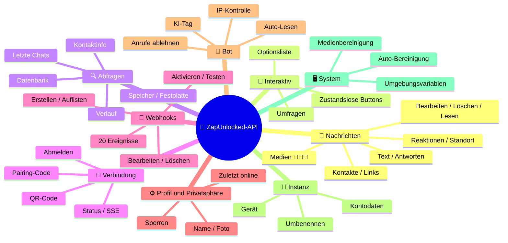
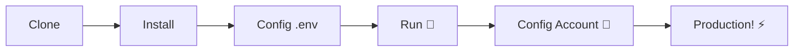

# 🚀 [ZapUnlocked-API](https://zapunlocked-api.kauafpss.com.br) 📲✨


<p align="center">
  
  
  
  
  
</p>

<table width="100%">
  <tr>
    <td align="center" valign="middle"><a href="https://github.com/kauafpssx/ZapUnlocked-API/blob/main/docs/translations/en.md"></a></td>
    <td align="center" valign="middle"><a href="https://github.com/kauafpssx/ZapUnlocked-API/blob/main/docs/translations/es.md"></a></td>
    <td align="center" valign="middle"><a href="https://github.com/kauafpssx/ZapUnlocked-API/blob/main/docs/translations/fr.md"></a></td>
    <td align="center" valign="middle"><a href="https://github.com/kauafpssx/ZapUnlocked-API/blob/main/docs/translations/cn.md"></a></td>
    <td align="center" valign="middle"><a href="https://github.com/kauafpssx/ZapUnlocked-API/blob/main/docs/translations/jp.md"></a></td>
    <td align="center" valign="middle"><a href="https://github.com/kauafpssx/ZapUnlocked-API/blob/main/docs/translations/ru.md"></a></td>
    <td align="center" valign="middle"><a href="https://github.com/kauafpssx/ZapUnlocked-API/blob/main/docs/translations/it.md"></a></td>
    <td align="center" valign="middle"><a href="https://github.com/kauafpssx/ZapUnlocked-API/blob/main/docs/translations/sa.md"></a></td>
    <td align="center" valign="middle"><a href="https://github.com/kauafpssx/ZapUnlocked-API/blob/main/docs/translations/tr.md"></a></td>
    <td align="center" valign="middle"><a href="https://github.com/kauafpssx/ZapUnlocked-API/blob/main/docs/translations/kr.md"></a></td>
    <td align="center" valign="middle"><a href="https://github.com/kauafpssx/ZapUnlocked-API/blob/main/docs/translations/in.md"></a></td>
    <td align="center" valign="middle"><a href="https://github.com/kauafpssx/ZapUnlocked-API/blob/main/docs/translations/nl.md"></a></td>
  </tr>
</table>

---

##  Was ist ZapUnlocked-API?

Der WhatsApp-API-Markt verlangt missbräuchliche Monatsgebühren: Dutzende bis Hunderte von Euros pro Monat, mit Nutzungslimits, Gebühren pro Konversation und Daten, die über Drittanbieter-Server laufen. **ZapUnlocked-API wurde entwickelt, um das zu ändern.**

Entwickelt in **Python** mit **[Neonize](https://github.com/krypton-byte/neonize)** als Verbindungs-Engine, bietet diese API eine einfache REST-Schnittstelle (FastAPI) zum Verwalten von Sitzungen, Senden komplexer Medien und Erstellen intelligenter Interaktionen. **Keine schwere Datenbank, keine Monatsgebühren, keine Abhängigkeit von anderen.**

Unser Vorschlag basiert auf **technischer Exzellenz** und **Entwicklerunabhängigkeit**. Wir glauben, dass leistungsstarke Werkzeuge für diejenigen zugänglich sein sollten, die ihre eigenen Lösungen entwickeln.

> [!TIP]
> Perfekt für Entwickler, die Agilität bei der Integration von Bots, Benachrichtigungen und automatisierten Servicesystemen suchen. **Ohne dafür zu bezahlen.**

---

## 🗺️ API-Übersicht



---

## ✨ Hervorgehobene Funktionen

| Funktion | Beschreibung |
| :------- | :----------- |
| 🧩 **Zustandslose Buttons** | Erstellen Sie interaktive Abläufe ohne Datenbank, mit verschlüsselten Webhooks |
| 🔢 **Pairing ohne QR-Code** | Verbinden Sie sich per Zahlencode · ideal für Server ohne GUI |
| 🎵 **Automatische Audio-Konvertierung** | Senden Sie Audios, die als live aufgenommen erscheinen (PTT) nativ |
| 📦 **Intelligente Medien-Warteschlange** | Automatische Verwaltung zur Vermeidung übermäßigen Speicherverbrauchs |
| 🏷️ **Dynamische Platzhalter** | Personalisieren Sie Nachrichten und Webhooks mit `{{name}}`, `{{day}}`, `{{phone}}` |

> [!NOTE]
> Alle Funktionen sind **100% kostenlos** und werden von der Open-Source-Community gepflegt.

---

## 📋 API-Routen

<details>
<summary><b>📨 Nachrichten senden</b> · 13 Endpunkte</summary>

| Methode | Route | Beschreibung |
| :------ | :---- | :----------- |
| `POST` | `/send` | Textnachricht senden / antworten |
| `POST` | `/send_image` | Bild senden |
| `POST` | `/send_video` | Video senden (unterstützt GIF und PTV) |
| `POST` | `/send_audio` | Audio senden (mit automatischer PTT-Konvertierung) |
| `POST` | `/send_document` | Dokument senden |
| `POST` | `/send_sticker` | Sticker senden |
| `POST` | `/send_reaction` | Reaktion mit Emoji senden |
| `POST` | `/send_location` | Standort senden |
| `POST` | `/send_contact` | Kontakt senden |
| `POST` | `/send_contacts` | Mehrere Kontakte senden |
| `POST` | `/send_link` | Link mit Vorschau senden |
| `POST` | `/messages/delete` | Nachricht löschen |
| `POST` | `/messages/read` | Als gelesen markieren |
| `POST` | `/messages/edit` | Gesendete Nachricht bearbeiten |
</details>

<details>
<summary><b>🔘 Interaktive Nachrichten</b> · 4 Endpunkte</summary>

| Methode | Route | Beschreibung |
| :------ | :---- | :----------- |
| `POST` | `/send_wbuttons` | Buttons senden (Liste, Aktion, OTP, PIX) |
| `POST` | `/messages/send-option-list` | Optionsliste senden |
| `POST` | `/messages/send-poll` | Umfrage senden |
| `POST` | `/messages/send-poll-vote` | In Umfrage abstimmen |
</details>

<details>
<summary><b>🔍 Abfragen und Verwaltung</b> · 7 Endpunkte</summary>

| Methode | Route | Beschreibung |
| :------ | :---- | :----------- |
| `POST` | `/contacts/info` | Detaillierte Kontaktinformationen |
| `POST` | `/management/fetch_messages` | Nachrichtenverlauf abrufen |
| `POST` | `/management/recent_contacts` | Letzte Chats auflisten |
| `GET` | `/management/memory` | Speichernutzungsstatus |
| `GET` | `/management/volume_stats` | Festplattennutzung prüfen |
| `GET` | `/management/database/status` | Datenbankstatus und Statistiken |
| `POST` | `/management/database/cleanup` | Manuelle Datenbankbereinigung |
</details>

<details>
<summary><b>🔗 Verbindung und Sitzung</b> · 8 Endpunkte</summary>

| Methode | Route | Beschreibung |
| :------ | :---- | :----------- |
| `GET` | `/` | Willkommensseite (HTML) |
| `GET` | `/status` | Verbindungs- und Sitzungsstatus |
| `GET` | `/status/stream` | Echtzeit-Status (SSE) |
| `GET` | `/qr` | Interaktiven QR-Code anzeigen |
| `GET` | `/qr/image` | QR-Code-Bild abrufen (Base64) |
| `POST` | `/qr/pair` | Numerischen Pairing-Code generieren |
| `GET` | `/settings/phone-code/{phone}` | Code per Nummer generieren |
| `POST` | `/qr/logout` | Trennen und Sitzung zurücksetzen |
</details>

<details>
<summary><b>📡 Webhooks (CRUD)</b> · 7 Endpunkte</summary>

| Methode | Route | Beschreibung |
| :------ | :---- | :----------- |
| `POST` | `/webhooks` | Benannten Webhook erstellen |
| `GET` | `/webhooks` | Alle Webhooks auflisten |
| `PUT` | `/webhooks/{name}` | Webhook bearbeiten |
| `DELETE` | `/webhooks/{name}` | Webhook entfernen |
| `POST` | `/webhooks/{name}/toggle` | Aktivieren / deaktivieren |
| `POST` | `/webhooks/{name}/test` | Webhook testen |
| `GET` | `/webhooks/events` | Ereignistypen auflisten (20 Typen) |
</details>

<details>
<summary><b>⚙️ Profil und Privatsphäre</b> · 3 Endpunkte</summary>

| Methode | Route | Beschreibung |
| :------ | :---- | :----------- |
| `POST` | `/settings/profile` | Bot-Name und -Foto ändern |
| `POST` | `/settings/privacy` | Privatsphäre anpassen (zuletzt online, etc) |
| `POST` | `/settings/block` | Kontakt blockieren / entsperren |
</details>

<details>
<summary><b>🤖 Bot-Einstellungen</b> · 5 Endpunkte</summary>

| Methode | Route | Beschreibung |
| :------ | :---- | :----------- |
| `GET` | `/settings/bot` | Bot-Einstellungen anzeigen |
| `POST` | `/settings/bot` | Einstellungen aktualisieren (KI-Tag, IP-Kontrolle) |
| `PUT` | `/settings/instance/call-reject-auto` | Anrufe automatisch ablehnen |
| `PUT` | `/settings/instance/call-reject-message` | Nachricht bei abgelehntem Anruf |
| `PUT` | `/settings/instance/auto-read-message` | Automatisches Lesen von Nachrichten |
</details>

<details>
<summary><b>📱 Instanz</b> · 3 Endpunkte</summary>

| Methode | Route | Beschreibung |
| :------ | :---- | :----------- |
| `GET` | `/instance/me` | Verbundene Kontodaten |
| `GET` | `/instance/device` | Gerätetechnische Daten |
| `PUT` | `/instance/update-name` | Instanz umbenennen |
</details>

<details>
<summary><b>🖥️ System</b> · 5 Endpunkte</summary>

| Methode | Route | Beschreibung |
| :------ | :---- | :----------- |
| `GET` | `/system/env` | Umgebungsvariablen anzeigen |
| `PUT` | `/system/env` | Umgebungsvariablen aktualisieren |
| `POST` | `/system/cleanup/force` | Erzwungene Bereinigung temporärer Medien |
| `GET` | `/system/cleanup/settings` | Auto-Bereinigungseinstellungen anzeigen |
| `PUT` | `/system/cleanup/settings` | Auto-Bereinigungsintervall aktualisieren |
</details>

> **Gesamt: 56 Endpunkte** · Vollständiges REST für WhatsApp-Automatisierung.

---

## 🛠️ Installation und Hosting

> Bringen Sie Ihre professionelle WhatsApp-API in weniger als **5 Minuten** mit **ZapUnlocked-API** online.

### 💻 Lokale Installation

Ideal für Entwicklung, Tests oder den Betrieb auf Ihrem eigenen Server.



**1. Repository klonen**

```bash
git clone https://github.com/kauafpssx/ZapUnlocked-API.git
cd ZapUnlocked-API
```

**2. Abhängigkeiten installieren**

| System | Befehl |
| :------ | :------ |
| 🪟 Windows | `scripts\install\install.bat` |
| 🐧 Linux / macOS | `bash scripts/install/install.sh` |

**3. Umgebung konfigurieren**

| System | Befehl |
| :------ | :------ |
| 🪟 Windows | `scripts\generate-env\generate-env.bat` |
| 🐧 Linux / macOS | `bash scripts/generate-env/generate-env.sh` |

| Variable | Beschreibung |
| :------- | :----------- |
| `API_KEY` | Passwort für die Authentifizierung an allen Endpunkten |
| `INTERNAL_SECRET` | Token zur Validierung von Webhook-Signaturen |
| `PORT` | API-Port (Standard: `8300`) |

**4. API ausführen**

| System | Befehl |
| :------ | :------ |
| 🪟 Windows | `scripts\run\run.bat` |
| 🐧 Linux / macOS | `bash scripts/run/run.sh` |

---

### ☁️ Hosting: Alwaysdata (Kostenlos 24/7)

**Alwaysdata** ist die empfohlene Option zum stabilen und kostenlosen Hosten der API, ohne einen eigenen Server betreiben zu müssen.

#### 📊 Ressourcen des kostenlosen Plans

| Ressource | Verfügbar im Free-Plan |
| :-------- | :--------------------- |
| 💾 Speicher | **1 GB SSD** |
| 🧠 RAM | **256 MB** |
| ⚡ CPU | **1/4 vCPU** |
| 🔄 Backup | **3 Tage** automatisch |
| 📡 Uptime | **24/7** über Services |

#### 👣 Schritt-für-Schritt zum Deployment

**1.** Erstellen Sie Ihr Konto auf [Alwaysdata.com](https://www.alwaysdata.com/) · **Free**-Plan.

**2.** Greifen Sie per SSH auf `https://ssh-[usuario].alwaysdata.net` zu.

**3.** Klonen und installieren:

```bash
git clone https://github.com/kauafpssx/ZapUnlocked-API.git ~/ZapUnlocked-API
cd ~/ZapUnlocked-API
bash scripts/install/install.sh
```

**4.** `.env` generieren:

```bash
bash scripts/generate-env/generate-env.sh
```

**5.** Konfigurieren Sie den Dienst (24/7) unter **Advanced · Services · Add a service**:

| Feld | Wert |
| :--- | :--- |
| **Name** | `ZapUnlocked-API` |
| **Command** | `python3 main.py` |
| **Working directory** | `ZapUnlocked-API` |
| **Environment variables** | `PORT=8300` |

**6.** Zugriff über:

```
http://services-[usuario].alwaysdata.net:8300/
```

> [!TIP]
> Die URL ist bereits extern erreichbar. *(Optional)* Um eine benutzerdefinierte Domain zu verwenden, konfigurieren Sie einen **Reverse Proxy** unter **Web · Sites · Add a site**, der auf `http://[usuario].alwaysdata.net` verweist.

---

## 🔐 Authentifizierung (Anmeldung)

Stellen Sie nach dem Deployment eine Verbindung zu Ihrem WhatsApp-Konto her, indem Sie in Ihrem Browser aufrufen:

```text
http://services-[usuario].alwaysdata.net:8300/qr?API_KEY=IHR_GEHEIMES_PASSWORT
```

---

## 📖 Offizielle Dokumentation

<p align="center">
  👉 <a href="https://zapunlocked-api.kauafpss.com.br"><strong>zapunlocked-api.kauafpss.com.br</strong></a>
</p>

Für detaillierte technische Dokumentation, Codebeispiele und eine interaktive Spielwiese besuchen Sie unsere offizielle Website.

> [!TIP]
> Verwenden Sie die **LLMs.txt** als KI-Index: [`zapunlocked-api.kauafpss.com.br/llms.txt`](https://zapunlocked-api.kauafpss.com.br/llms.txt). Entdecken Sie alle Seiten, bevor Sie loslegen.

---

## ❤️ Danksagungen

| Projekt | Beschreibung |
| :------ | :----------- |
| [](https://github.com/krypton-byte/neonize) | Python-Bibliothek für native WhatsApp-Web-Verbindung |
| [](https://github.com/tulir/whatsmeow) | Go-Basisbibliothek von Neonize · das Herz der Verbindung |
| [](https://www.alwaysdata.com/) | Hochwertige kostenlose Infrastruktur |

---

## 📄 Lizenz

Dieses Projekt ist unter der **MIT-Lizenz** lizenziert.

<p align="center">
  Mit 💜 gemacht von <a href="https://www.instagram.com/kauafpss_/">Kauã Ferreira</a>
</p>
