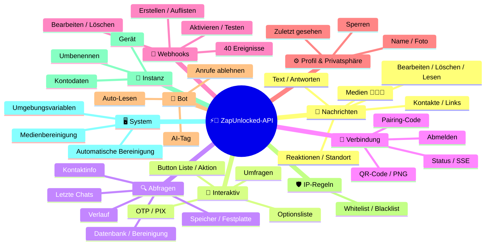
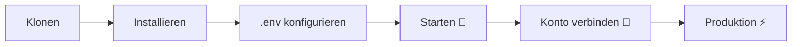

# ⚡💬 [ZapUnlocked-API](https://zapunlocked-api.kauafpss.com.br/)


<p align="center">
  
  <a href="https://downgit.github.io/#/home?url=https://github.com/kauafpssx/ZapUnlocked-API/blob/main/ZapUnlocked.collection.json" target="_blank">
    
  </a>
  
  
  
</p>

---

### 🌐 Sprache Auswählen :

<table width="100%">
  <tr>
    <td align="center" valign="middle"><a href="https://github.com/kauafpssx/ZapUnlocked-API/blob/main/README.md"></a></td>
    <td align="center" valign="middle"><a href="https://github.com/kauafpssx/ZapUnlocked-API/blob/main/docs/translations/en.md"></a></td>
    <td align="center" valign="middle"><a href="https://github.com/kauafpssx/ZapUnlocked-API/blob/main/docs/translations/es.md"></a></td>
    <td align="center" valign="middle"><a href="https://github.com/kauafpssx/ZapUnlocked-API/blob/main/docs/translations/fr.md"></a></td>
    <td align="center" valign="middle"><a href="https://github.com/kauafpssx/ZapUnlocked-API/blob/main/docs/translations/zh.md"></a></td>
    <td align="center" valign="middle"><a href="https://github.com/kauafpssx/ZapUnlocked-API/blob/main/docs/translations/ja.md"></a></td>
    <td align="center" valign="middle"><a href="https://github.com/kauafpssx/ZapUnlocked-API/blob/main/docs/translations/ru.md"></a></td>
    <td align="center" valign="middle"><a href="https://github.com/kauafpssx/ZapUnlocked-API/blob/main/docs/translations/it.md"></a></td>
    <td align="center" valign="middle"><a href="https://github.com/kauafpssx/ZapUnlocked-API/blob/main/docs/translations/ar.md"></a></td>
    <td align="center" valign="middle"><a href="https://github.com/kauafpssx/ZapUnlocked-API/blob/main/docs/translations/tr.md"></a></td>
    <td align="center" valign="middle"><a href="https://github.com/kauafpssx/ZapUnlocked-API/blob/main/docs/translations/ko.md"></a></td>
    <td align="center" valign="middle"><a href="https://github.com/kauafpssx/ZapUnlocked-API/blob/main/docs/translations/hi.md"></a></td>
    <td align="center" valign="middle"><a href="https://github.com/kauafpssx/ZapUnlocked-API/blob/main/docs/translations/nl.md"></a></td>
  </tr>
</table>

---

##  Was ist ZapUnlocked-API?

Der Markt für WhatsApp-APIs verlangt missbräuchliche Monatsgebühren: Dutzende bis Hunderte Reais pro Monat, mit Nutzungslimits, Gebühren pro Konversation und Daten, die über Drittanbieter-Server laufen. **ZapUnlocked-API existiert, um das zu ändern.**

Entwickelt in **Python** mit **[Neonize](https://github.com/krypton-byte/neonize)** als Verbindungsengine, bietet diese API eine einfache REST-Schnittstelle (FastAPI) zur Verwaltung von Sitzungen, zum Senden komplexer Medien und zur Erstellung intelligenter Interaktionen. **Ohne schwere Datenbank, ohne Abogebühren, ohne von irgendwem abhängig zu sein.**

Unser Ansatz basiert auf **technischer Exzellenz** und **Entwicklerunabhängigkeit**. Wir glauben, dass leistungsstarke Werkzeuge für diejenigen zugänglich sein sollten, die ihre eigenen Lösungen entwickeln.

> [!TIP]
> Perfekt für Entwickler, die nach Agilität bei der Integration von Bots, Benachrichtigungen und automatisierten Kundenservice-Systemen suchen. **Ohne dafür zu bezahlen.**

---

## 🗺️ API-Übersicht




---

## ✨ Hauptfunktionen

| Funktion | Beschreibung |
| :------- | :----------- |
| 🧩 **Zustandslose Buttons** | Erstellen Sie interaktive Abläufe ohne Datenbank, mit verschlüsselten Webhooks |
| 🔢 **Pairing ohne QR** | Verbinden Sie sich per Zahlencode · ideal für Server ohne GUI |
| 🎵 **Automatische Audiokonvertierung** | Senden Sie Audio, das nativ als "soeben aufgenommen" (PTT) erscheint |
| 📦 **Intelligente Medien-Warteschlange** | Automatische Verwaltung zur Vermeidung übermäßigen Speicherverbrauchs |
| 🏷️ **Dynamische Platzhalter** | Personalisieren Sie Nachrichten und Webhooks mit \`{{name}}\`, \`{{phone}}\` |

> [!NOTE]
> Alle Funktionen sind **100% kostenlos** und werden von der Open-Source-Community gewartet.

---

## 📋 API-Routen

<details>
<summary><b>📨 Nachrichten senden</b> · 15 Endpunkte</summary>

| Methode | Route | Beschreibung | Body |
| :------ | :---- | :----------- | :--- |
| `POST` | `/send` | Textnachricht senden / antworten | `phone`, `message` |
| `POST` | `/send_image` | Bild senden | `phone`, `image_url` |
| `POST` | `/send_video` | Video senden (unterstützt GIF und PTV) | `phone`, `video_url` |
| `POST` | `/send_audio` | Audio senden (mit automatischer PTT-Konvertierung) | `phone`, `audio_url` |
| `POST` | `/send_document` | Dokument senden | `phone`, `document_url` |
| `POST` | `/send_sticker` | Sticker senden | `phone`, `sticker_url` |
| `POST` | `/send_reaction` | Reaktion mit Emoji senden | `phone`, `messageId`, `emoji` |
| `POST` | `/send_location` | Standort senden | `phone`, `lat`, `lng` |
| `POST` | `/send_contact` | Kontakt senden | `phone`, `name`, `contactPhone` |
| `POST` | `/send_contacts` | Mehrere Kontakte senden | `phone`, `contacts` |
| `POST` | `/send_link` | Link mit Vorschau senden | `phone`, `url` |
| `POST` | `/messages/delete` | Nachricht löschen | `phone`, `messageId` |
| `POST` | `/messages/read` | Als gelesen markieren | `phone`, `messageIds` |
| `POST` | `/messages/edit` | Gesendete Nachricht bearbeiten | `phone`, `messageId`, `message` |
</details>

<details>
<summary><b>🔘 Interaktive Nachrichten</b> · 7 Endpunkte</summary>

| Methode | Route | Beschreibung | Body |
| :------ | :---- | :----------- | :--- |
| `POST` | `/messages/send-button-list` | Optionslisten-Button | `phone`, `buttons` |
| `POST` | `/messages/send-button-actions` | Aktionsbutton | `phone`, `buttons` |
| `POST` | `/messages/send-button-otp` | Kopierbutton (OTP) | `phone`, `code` |
| `POST` | `/messages/send-button-pix` | PIX-Button | `phone`, `pixKey` |
| `POST` | `/messages/send-option-list` | Optionsliste senden | `phone`, `buttons` |
| `POST` | `/messages/send-poll` | Umfrage senden | `phone`, `name`, `options` |
| `POST` | `/messages/send-poll-vote` | In Umfrage abstimmen | `phone`, `options` |
</details>

<details>
<summary><b>🔍 Abfragen und Verwaltung</b> · 8 Endpunkte</summary>

| Methode | Route | Beschreibung | Body |
| :------ | :---- | :----------- | :--- |
| `POST` | `/management/fetch_messages` | Nachrichtenverlauf abrufen | `phone` |
| `POST` | `/management/recent_contacts` | Letzte Chats auflisten | ❌ |
| `GET` | `/management/memory` | Speichernutzungsstatus | ❌ |
| `GET` | `/management/volume_stats` | Festplattenutzung prüfen | ❌ |
| `DELETE` | `/management/cleanup` | Temporäre Medien bereinigen | ❌ |
| `GET` | `/management/database/status` | DB-Status und Statistiken | ❌ |
| `POST` | `/management/database/config` | DB-Konfiguration aktualisieren | `interval` |
| `POST` | `/management/database/cleanup` | Manuelle DB-Bereinigung | ❌ |
</details>

<details>
<summary><b>👤 Kontakte</b> · 1 Endpunkt</summary>

| Methode | Route | Beschreibung | Body |
| :------ | :---- | :----------- | :--- |
| `POST` | `/contacts/info` | Detaillierte Kontaktinformationen | `phone` |
</details>

<details>
<summary><b>🏠 Allgemein</b> · 3 Endpunkte</summary>

| Methode | Route | Beschreibung | Body |
| :------ | :---- | :----------- | :--- |
| `GET` | `/` | Willkommensseite (HTML) | ❌ |
| `GET` | `/status` | Verbindungs- und Sitzungsstatus (JSON) | ❌ |
| `GET` | `/status/stream` | Echtzeit-Status (SSE) | ❌ |
</details>

<details>
<summary><b>🔗 Verbindung (QR)</b> · 2 Endpunkte</summary>

| Methode | Route | Beschreibung | Body |
| :------ | :---- | :----------- | :--- |
| `GET` | `/qr` | Interaktiven QR-Code anzeigen (HTML) | ❌ |
| `GET` | `/qr/image` | QR-Code-Bild abrufen (PNG) | ❌ |
</details>

<details>
<summary><b>🔐 Sitzung</b> · 2 Endpunkte</summary>

| Methode | Route | Beschreibung | Body |
| :------ | :---- | :----------- | :--- |
| `POST` | `/session/pair` | Numerischen Pairing-Code generieren | `phone` |
| `POST` | `/session/logout` | Trennen und Sitzung zurücksetzen | ❌ |
</details>

<details>
<summary><b>📡 Webhooks (CRUD)</b> · 8 Endpunkte</summary>

| Methode | Route | Beschreibung | Body |
| :------ | :---- | :----------- | :--- |
| `POST` | `/webhooks` | Benannten Webhook erstellen | `name`, `url` |
| `GET` | `/webhooks` | Alle Webhooks auflisten | ❌ |
| `GET` | `/webhooks/{name}` | Webhook nach Name abrufen | ❌ |
| `PUT` | `/webhooks/{name}` | Webhook bearbeiten | ❌ |
| `DELETE` | `/webhooks/{name}` | Webhook entfernen | ❌ |
| `POST` | `/webhooks/{name}/toggle` | Aktivieren / deaktivieren | `active` |
| `POST` | `/webhooks/{name}/test` | Webhook testen | ❌ |
| `GET` | `/webhooks/events` | Ereignistypen auflisten (40 Typen) | ❌ |
</details>

<details>
<summary><b>⚙️ Profil und Privatsphäre</b> · 3 Endpunkte</summary>

| Methode | Route | Beschreibung | Body |
| :------ | :---- | :----------- | :--- |
| `POST` | `/settings/profile` | Bot-Name und -Foto ändern | ❌ |
| `POST` | `/settings/privacy` | Privatsphäre anpassen (zuletzt gesehen, usw.) | ❌ |
| `POST` | `/settings/block` | Kontakt sperren / entsperren | `phone`, `action` |
</details>

<details>
<summary><b>🤖 Bot-Konfiguration</b> · 6 Endpunkte</summary>

| Methode | Route | Beschreibung | Body |
| :------ | :---- | :----------- | :--- |
| `GET` | `/settings/bot` | Bot-Konfiguration anzeigen | ❌ |
| `POST` | `/settings/bot` | Konfiguration aktualisieren (AI-Tag, IP-Kontrolle) | ❌ |
| `PUT` | `/settings/instance/call-reject-auto` | Anrufe automatisch ablehnen | `value` |
| `PUT` | `/settings/instance/call-reject-message` | Nachricht bei abgelehntem Anruf | `value` |
| `PUT` | `/settings/instance/auto-read-message` | Automatisches Lesen von Nachrichten | `value` |
| `GET` | `/settings/phone-code/{phone}` | Code per Telefonnummer generieren | ❌ |
</details>

<details>
<summary><b>📱 Instanz</b> · 3 Endpunkte</summary>

| Methode | Route | Beschreibung | Body |
| :------ | :---- | :----------- | :--- |
| `GET` | `/instance/me` | Daten des verbundenen Kontos | ❌ |
| `GET` | `/instance/device` | Technische Gerätedaten | ❌ |
| `PUT` | `/instance/update-name` | Instanz umbenennen | `name` |
</details>

<details>
<summary><b>🛡️ IP-Regeln</b> · 5 Endpunkte</summary>

| Methode | Route | Beschreibung | Body |
| :------ | :---- | :----------- | :--- |
| `GET` | `/settings/ip-rules` | IP-Regeln auflisten (Whitelist/Blacklist) | ❌ |
| `POST` | `/settings/ip-rules/whitelist` | IP zur Whitelist hinzufügen | `ip` |
| `POST` | `/settings/ip-rules/blacklist` | IP zur Blacklist hinzufügen | `ip` |
| `DELETE` | `/settings/ip-rules/whitelist/{ip}` | IP aus Whitelist entfernen | ❌ |
| `DELETE` | `/settings/ip-rules/blacklist/{ip}` | IP aus Blacklist entfernen | ❌ |
</details>

<details>
<summary><b>🖥️ System</b> · 5 Endpunkte</summary>

| Methode | Route | Beschreibung | Body |
| :------ | :---- | :----------- | :--- |
| `GET` | `/system/env` | Umgebungsvariablen anzeigen | ❌ |
| `PUT` | `/system/env` | Umgebungsvariablen aktualisieren | ❌ |
| `POST` | `/system/cleanup/force` | Erzwungene Bereinigung temporärer Medien | ❌ |
| `GET` | `/system/cleanup/settings` | Auto-Bereinigungseinstellungen anzeigen | ❌ |
| `PUT` | `/system/cleanup/settings` | Auto-Bereinigungsintervall aktualisieren | ❌ |
</details>

> **Insgesamt: 68 Endpunkte**

---

## 📡 Webhook-Ereignisse

Alle Webhooks erhalten eine Standardhülle:

```json
{
  "event": "message.text",
  "timestamp": "2025-01-01T12:00:00Z",
  "data": { ... }
}
```

Wenn der Webhook einen benutzerdefinierten `body` mit `{{placeholders}}` hat, wird dieser Body anstelle der Standardhülle gesendet.


---

<details>
<summary><b>🏷️ Verfügbare Platzhalter im benutzerdefinierten Body</b></summary>

| Platzhalter | Wert |
| :---------- | :--- |
| `{{from}}` | Absendernummer |
| `{{text}}` | Nachrichtentext |
| `{{phone}}` | Gleich wie `{{from}}` |
| `{{id}}` | Nachrichten-ID |
| `{{requested}}` | Angeforderte Menge (fetchMessages) |
| `{{found}}` | Gefundene Menge (fetchMessages) |
| `{{timestamp}}` | Aktueller UTC-Zeitstempel |

</details>

---


<details>
<summary><b>📥 Empfangene Nachrichten</b> · 40 Ereignisse</summary>

Basisfelder in empfangenen Nachrichtenereignissen:

```json
{
  "messageId": "3EB0ABCDEF123456",
  "from": "5511999999999",
  "fromName": "João Silva",
  "fromJid": "5511999999999@s.whatsapp.net",
  "isGroup": false
}
```

<details>
<summary><code>message.text</code> - Einfacher / formatierter Text</summary>

```json
{
  "event": "message.text",
  "data": {
    "...base": "...",
    "text": "Olá! Como posso ajudar?",
    "quoted": { "id": "3EB0...", "fromMe": true }
  }
}
```
</details>

<details>
<summary><code>message.image</code> - Empfangenes Bild</summary>

```json
{
  "event": "message.image",
  "data": {
    "...base": "...",
    "caption": "Foto do produto",
    "mimetype": "image/jpeg",
    "fileLength": 204800
  }
}
```
</details>

<details>
<summary><code>message.video</code> - Empfangenes Video</summary>

```json
{
  "event": "message.video",
  "data": {
    "...base": "...",
    "caption": "Veja esse vídeo!",
    "mimetype": "video/mp4",
    "fileLength": 5242880,
    "isPTT": false,
    "isGif": false
  }
}
```
</details>

<details>
<summary><code>message.audio</code> - Audio / Sprachnotiz</summary>

```json
{
  "event": "message.audio",
  "data": {
    "...base": "...",
    "mimetype": "audio/ogg; codecs=opus",
    "fileLength": 30720,
    "isPTT": true,
    "durationSeconds": 8
  }
}
```
</details>

<details>
<summary><code>message.document</code> - Dokument / Datei</summary>

```json
{
  "event": "message.document",
  "data": {
    "...base": "...",
    "fileName": "contrato.pdf",
    "caption": "Segue o contrato",
    "mimetype": "application/pdf",
    "fileLength": 102400
  }
}
```
</details>

<details>
<summary><code>message.sticker</code> - Sticker</summary>

```json
{
  "event": "message.sticker",
  "data": {
    "...base": "...",
    "mimetype": "image/webp",
    "isAnimated": false
  }
}
```
</details>

<details>
<summary><code>message.contact</code> - Geteilter Kontakt</summary>

```json
{
  "event": "message.contact",
  "data": {
    "...base": "...",
    "displayName": "Maria Souza",
    "vcard": "BEGIN:VCARD\nVERSION:3.0\n..."
  }
}
```
</details>

<details>
<summary><code>message.location</code> - Standort</summary>

```json
{
  "event": "message.location",
  "data": {
    "...base": "...",
    "lat": -23.5505,
    "lng": -46.6333,
    "name": "Av. Paulista",
    "address": "Av. Paulista, 1000 - São Paulo"
  }
}
```
</details>

<details>
<summary><code>message.reaction</code> - Reaktion (Emoji)</summary>

```json
{
  "event": "message.reaction",
  "data": {
    "...base": "...",
    "emoji": "❤️",
    "targetMessageId": "3EB0ABCDEF123456",
    "isRemoved": false
  }
}
```
</details>

<details>
<summary><code>message.poll_created</code> - Empfangene Umfrage</summary>

```json
{
  "event": "message.poll_created",
  "data": {
    "...base": "...",
    "pollName": "Qual o melhor sabor?",
    "options": ["Chocolate", "Morango", "Baunilha"]
  }
}
```
</details>

<details>
<summary><code>message.poll_vote</code> - Umfrage-Stimme</summary>

```json
{
  "event": "message.poll_vote",
  "data": {
    "...base": "...",
    "pollId": "3EB0ABCDEF123456",
    "selectedOptions": ["Chocolate"]
  }
}
```
</details>

<details>
<summary><code>message.button_reply</code> - Button-Klick</summary>

```json
{
  "event": "message.button_reply",
  "data": {
    "...base": "...",
    "buttonId": "opcao_sim",
    "displayText": "Sim",
    "type": "quick_reply"
  }
}
```
</details>

<details>
<summary><code>message.list_reply</code> - Auswahl in interaktiver Liste</summary>

```json
{
  "event": "message.list_reply",
  "data": {
    "...base": "...",
    "rowId": "1",
    "title": "X-Burguer",
    "description": "R$ 18,90"
  }
}
```
</details>

<details>
<summary><code>message.deleted</code> - Vom Absender gelöschte Nachricht</summary>

```json
{
  "event": "message.deleted",
  "data": {
    "...base": "..."
  }
}
```
</details>

<details>
<summary><code>message.unknown</code> - Nicht zugeordneter Typ</summary>

```json
{
  "event": "message.unknown",
  "data": {
    "...base": "...",
    "rawType": "senderKeyDistributionMessage"
  }
}
```
</details>

<details>
<summary><code>message.undecryptable</code> - Nicht entschlüsselbare Nachricht</summary>

```json
{
  "event": "message.undecryptable",
  "data": {
    "...base": "..."
  }
}
```
</details>

</details>

<details>
<summary><b>📤 Gesendete Nachrichten</b> · 40 Ereignisse</summary>

<details>
<summary><code>message.sent</code> - Gesendete Nachricht (manuell)</summary>

```json
{
  "event": "message.sent",
  "data": {
    "to": "5511999999999",
    "type": "text",
    "messageId": "3EB0ABCDEF123456"
  }
}
```
</details>

<details>
<summary><code>message.read</code> - Nachricht vom Empfänger gelesen</summary>

```json
{
  "event": "message.read",
  "data": {
    "from": "5511999999999",
    "messageId": "3EB0ABCDEF123456"
  }
}
```
</details>

<details>
<summary><code>message.delivered</code> - Nachricht an Empfänger zugestellt (receipt type 1)</summary>

```json
{
  "event": "message.delivered",
  "data": {
    "from": "5511999999999",
    "messageId": "3EB0ABCDEF123456"
  }
}
```
</details>

<details>
<summary><code>message.receipt</code> - Andere Zustellungsbestätigungen (receipt types 2, 3, 5+)</summary>

```json
{
  "event": "message.receipt",
  "data": {
    "from": "5511999999999",
    "messageId": "3EB0ABCDEF123456",
    "receiptType": 2
  }
}
```
</details>

</details>

<details>
<summary><b>🔗 Verbindung</b> · 40 Ereignisse</summary>

<details>
<summary><code>connection.connected</code> - WhatsApp verbunden</summary>

```json
{
  "event": "connection.connected",
  "data": {
    "phone": "5511999999999"
  }
}
```
</details>

<details>
<summary><code>connection.disconnected</code> - WhatsApp getrennt</summary>

```json
{
  "event": "connection.disconnected",
  "data": {}
}
```
</details>

<details>
<summary><code>connection.qr_ready</code> - QR-Code generiert</summary>

```json
{
  "event": "connection.qr_ready",
  "data": {
    "qr": "2@abc123..."
  }
}
```
</details>

<details>
<summary><code>connection.pair_code</code> - Pairing-Code generiert</summary>

```json
{
  "event": "connection.pair_code",
  "data": {
    "code": "NR62-NZSF"
  }
}
```
</details>

<details>
<summary><code>connection.pair_status</code> - Pairing-Status</summary>

```json
{
  "event": "connection.pair_status",
  "data": {
    "status": "waiting",
    "phone": "5511999999999"
  }
}
```
</details>

<details>
<summary><code>connection.logged_out</code> - Remote abgemeldet</summary>

```json
{
  "event": "connection.logged_out",
  "data": {}
}
```
</details>

<details>
<summary><code>connection.connect_failure</code> - Verbindungsfehler</summary>

```json
{
  "event": "connection.connect_failure",
  "data": {
    "reason": "network_error"
  }
}
```
</details>

<details>
<summary><code>connection.stream_error</code> - Stream-Fehler</summary>

```json
{
  "event": "connection.stream_error",
  "data": {
    "error": "connection closed"
  }
}
```
</details>

<details>
<summary><code>connection.temporary_ban</code> - Vorübergehende Sperrung</summary>

```json
{
  "event": "connection.temporary_ban",
  "data": {
    "phone": "5511999999999"
  }
}
```
</details>

<details>
<summary><code>connection.client_outdated</code> - Client veraltet</summary>

```json
{
  "event": "connection.client_outdated",
  "data": {}
}
```
</details>

<details>
<summary><code>connection.stream_replaced</code> - Stream ersetzt</summary>

```json
{
  "event": "connection.stream_replaced",
  "data": {}
}
```
</details>

</details>

<details>
<summary><b>👥 Gruppe</b> · 40 Ereignisse</summary>

<details>
<summary><code>group.join</code> - Neues Mitglied in Gruppe</summary>

```json
{
  "event": "group.join",
  "data": {
    "groupId": "5511999999999-123456@g.us",
    "inviter": "5511888888888",
    "member": "5511999999999"
  }
}
```
</details>

<details>
<summary><code>group.update</code> - Gruppe aktualisiert</summary>

```json
{
  "event": "group.update",
  "data": {
    "groupId": "5511999999999-123456@g.us",
    "name": "Neuer Name",
    "updatedBy": "5511888888888"
  }
}
```
</details>

</details>

<details>
<summary><b>👤 Kontakt / Anwesenheit</b> · 40 Ereignisse</summary>

<details>
<summary><code>contact.presence</code> - Anwesenheitsstatus des Kontakts</summary>

```json
{
  "event": "contact.presence",
  "data": {
    "from": "5511999999999@s.whatsapp.net",
    "presence": "available",
    "lastSeen": 1700000000
  }
}
```
</details>

<details>
<summary><code>contact.chat_presence</code> - Tippstatus</summary>

```json
{
  "event": "contact.chat_presence",
  "data": {
    "from": "5511999999999@s.whatsapp.net",
    "presence": "composing",
    "mediaType": 0
  }
}
```
</details>

<details>
<summary><code>contact.picture_change</code> - Profilbild geändert</summary>

```json
{
  "event": "contact.picture_change",
  "data": {
    "from": "5511999999999@s.whatsapp.net",
    "pictureId": "abc123"
  }
}
```
</details>

<details>
<summary><code>contact.identity_change</code> - Sicherheitsschlüssel geändert</summary>

```json
{
  "event": "contact.identity_change",
  "data": {
    "from": "5511999999999@s.whatsapp.net"
  }
}
```
</details>

</details>

<details>
<summary><b>📞 Anruf</b> · 40 Ereignisse</summary>

<details>
<summary><code>call.received</code> - Anruf erhalten</summary>

```json
{
  "event": "call.received",
  "data": {
    "from": "5511999999999",
    "fromJid": "5511999999999@s.whatsapp.net",
    "callId": "ABC123DEF456"
  }
}
```
</details>

<details>
<summary><code>call.accepted</code> - Anruf angenommen</summary>

```json
{
  "event": "call.accepted",
  "data": {
    "from": "5511999999999",
    "callId": "ABC123DEF456"
  }
}
```
</details>

<details>
<summary><code>call.terminated</code> - Anruf beendet</summary>

```json
{
  "event": "call.terminated",
  "data": {
    "from": "5511999999999",
    "callId": "ABC123DEF456",
    "reason": "timeout"
  }
}
```
</details>

</details>

<details>
<summary><code>call.received</code> - Anruf erhalten</summary>

```json
{
  "event": "call.received",
  "data": {
    "from": "5511999999999",
    "fromJid": "5511999999999@s.whatsapp.net",
    "callId": "ABC123DEF456"
  }
}
```
</details>

</details>

---

## 🛠️ Installation und Hosting

> Bringen Sie Ihre professionelle WhatsApp-API in weniger als **5 Minuten** mit **ZapUnlocked-API** zum Laufen.

### 💻 Lokale Installation

Ideal für Entwicklung, Tests oder den Betrieb auf Ihrem eigenen Server.



**1. Repository klonen**

```bash
git clone https://github.com/kauafpssx/ZapUnlocked-API.git
cd ZapUnlocked-API
```

**2. Abhängigkeiten installieren**

| System | Befehl |
| :----- | :----- |
| 🪟 Windows | `scripts\install\install.bat` |
| 🐧 Linux / macOS | `bash scripts/install/install.sh` |

**3. Umgebung konfigurieren**

| System | Befehl |
| :----- | :----- |
| 🪟 Windows | `scripts\generate-env\generate-env.bat` |
| 🐧 Linux / macOS | `bash scripts/generate-env/generate-env.sh` |

| Variable | Beschreibung |
| :------- | :----------- |
| `API_KEY` | Passwort für Authentifizierung an allen Endpunkten |
| `INTERNAL_SECRET` | Token zur Validierung von Webhook-Signaturen |
| `PORT` | API-Port (Standard: `8300`) |

**4. API starten**

| System | Befehl |
| :----- | :----- |
| 🪟 Windows | `scripts\run\run.bat` |
| 🐧 Linux / macOS | `bash scripts/run/run.sh` |

---

### ☁️ Hosting: Alwaysdata (Kostenlos 24/7)

**Alwaysdata** ist die empfohlene Option, um die API stabil und kostenlos zu hosten, ohne einen eigenen Server betreiben zu müssen.

#### 📊 Ressourcen des Free-Plans

| Ressource | Verfügbar im Free-Plan |
| :-------- | :--------------------- |
| 💾 Speicher | **1 GB SSD** |
| 🧠 RAM | **256 MB** |
| ⚡ CPU | **1/4 vCPU** |
| 🔄 Backup | **3 Tage** automatisch |
| 📡 Uptime | **24/7** über Services |

#### 👣 Schritt-für-Schritt-Anleitung zum Deployment

**1.** Erstellen Sie ein Konto auf [Alwaysdata.com](https://www.alwaysdata.com/) · **Free**-Plan.

**2.** Greifen Sie auf SSH zu unter `https://ssh-[user].alwaysdata.net`.

**3.** Klonen und installieren:

```bash
git clone https://github.com/kauafpssx/ZapUnlocked-API.git ~/ZapUnlocked-API
cd ~/ZapUnlocked-API
bash scripts/install/install.sh
```

**4.** *(Optional)* `.env` generieren:

```bash
bash scripts/generate-env/generate-env.sh
```

> [!NOTE]
> Das Installationsskript fragt bereits, ob Sie die `.env` konfigurieren möchten. Wenn Sie **ja** geantwortet haben, kann dieser Schritt übersprungen werden. Andernfalls führen Sie den obigen Befehl aus oder konfigurieren Sie die `.env` manuell.

**5.** Dienst konfigurieren (24/7) unter **Advanced › Services › Add a service**:

| Feld | Wert |
| :--- | :--- |
| **Name** | `ZapUnlocked-API` |
| **Command** | `python3 main.py` |
| **Working directory** | `ZapUnlocked-API` |
| **Environment variables** | `PORT=8300` |

**6.** Zugriff über:

```
http://services-[user].alwaysdata.net:8300/
```

> [!TIP]
> Die URL ist bereits extern erreichbar. *(Optional)* Für eine benutzerdefinierte Domain konfigurieren Sie einen **Reverse Proxy** unter **Web › Sites › Add a site**, der auf `http://[user].alwaysdata.net` verweist.

---

## 🔐 Authentifizierung (Login)

Nach dem Deployment verbinden Sie Ihr WhatsApp-Konto, indem Sie im Browser aufrufen:

```text
http://services-[user].alwaysdata.net:8300/qr?API_KEY=IHR_GEHEIMER_SCHLÜSSEL
```

---

## 📖 Offizielle Dokumentation

<p align="center">
  👉 <a href="https://zapunlocked-api.kauafpss.com.br"><strong>zapunlocked-api.kauafpss.com.br</strong></a>
</p>

Besuchen Sie unsere offizielle Website für detaillierte technische Dokumentation, Codebeispiele und eine interaktive Playground-Umgebung.

> [!TIP]
> Verwenden Sie die **LLMs.txt** als KI-Index: [`zapunlocked-api.kauafpss.com.br/llms.txt`](https://zapunlocked-api.kauafpss.com.br/llms.txt). Entdecken Sie alle Seiten, bevor Sie weiter erkunden.

---

## ❤️ Danksagungen

| Projekt | Beschreibung |
| :------ | :----------- |
| [](https://github.com/krypton-byte/neonize) | Python-Bibliothek für native WhatsApp Web-Verbindung |
| [](https://github.com/tulir/whatsmeow) | Go-Basisbibliothek von Neonize · das Herz der Verbindung |
| [](https://www.alwaysdata.com/) | Hochwertige kostenlose Infrastruktur |

---

## 📄 Lizenz

Dieses Projekt ist unter der **MIT-Lizenz** lizenziert.

<p align="center">
  Mit 💜 gemacht von <a href="https://www.instagram.com/kauafpss_/">Kauã Ferreira</a>
</p>