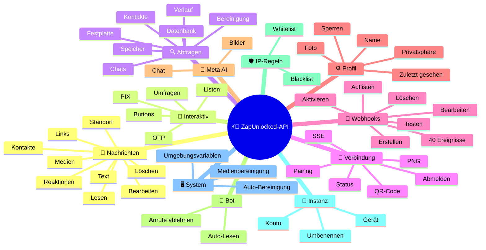
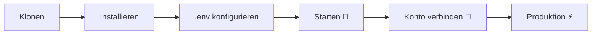

# ⚡💬 [ZapUnlocked-API](https://zapunlocked-api.kauafpss.com.br/)


<p align="center">
  
  <a href="https://downgit.github.io/#/home?url=https://github.com/kauafpssx/ZapUnlocked-API/blob/main/ZapUnlocked.collection.json">
    
  </a>
  
  
  
</p>

---

### 🌐 Sprache auswählen:

<table width="100%">
  <tr>
    <td align="center" valign="middle"><a href="https://github.com/kauafpssx/ZapUnlocked-API/blob/main/README.md"></a></td>
    <td align="center" valign="middle"><a href="https://github.com/kauafpssx/ZapUnlocked-API/blob/main/docs/translations/en.md"></a></td>
    <td align="center" valign="middle"><a href="https://github.com/kauafpssx/ZapUnlocked-API/blob/main/docs/translations/es.md"></a></td>
    <td align="center" valign="middle"><a href="https://github.com/kauafpssx/ZapUnlocked-API/blob/main/docs/translations/fr.md"></a></td>
    <td align="center" valign="middle"><a href="https://github.com/kauafpssx/ZapUnlocked-API/blob/main/docs/translations/de.md"></a></td>
    <td align="center" valign="middle"><a href="https://github.com/kauafpssx/ZapUnlocked-API/blob/main/docs/translations/zh.md"></a></td>
    <td align="center" valign="middle"><a href="https://github.com/kauafpssx/ZapUnlocked-API/blob/main/docs/translations/ja.md"></a></td>
    <td align="center" valign="middle"><a href="https://github.com/kauafpssx/ZapUnlocked-API/blob/main/docs/translations/ru.md"></a></td>
    <td align="center" valign="middle"><a href="https://github.com/kauafpssx/ZapUnlocked-API/blob/main/docs/translations/it.md"></a></td>
    <td align="center" valign="middle"><a href="https://github.com/kauafpssx/ZapUnlocked-API/blob/main/docs/translations/ar.md"></a></td>
    <td align="center" valign="middle"><a href="https://github.com/kauafpssx/ZapUnlocked-API/blob/main/docs/translations/tr.md"></a></td>
    <td align="center" valign="middle"><a href="https://github.com/kauafpssx/ZapUnlocked-API/blob/main/docs/translations/ko.md"></a></td>
    <td align="center" valign="middle"><a href="https://github.com/kauafpssx/ZapUnlocked-API/blob/main/docs/translations/hi.md"></a></td>
    <td align="center" valign="middle"><a href="https://github.com/kauafpssx/ZapUnlocked-API/blob/main/docs/translations/nl.md"></a></td>
  </tr>
</table>

---

##  Was ist ZapUnlocked-API?

WhatsApp-APIs verlangen überhöhte monatliche Gebühren: Dutzende bis Hunderte Reais pro Monat, Nutzungslimits, Gebühren pro Konversation und Daten über Drittanbieter-Server. **ZapUnlocked-API ist kostenlos und Open Source.**

Entwickelt in **Python** mit **[Neonize](https://github.com/krypton-byte/neonize)** als Verbindungs-Engine, verwendet die API FastAPI zum Verwalten von Sitzungen, Senden von Medien und Erstellen von Bots. Keine schwere Datenbank, keine monatlichen Gebühren, keine Server von Drittanbietern.

> [!TIP]
> Nutzen Sie für Bots, Benachrichtigungen und Kundenservice-Systeme. **100% kostenlos.**

> [!IMPORTANT]
> 🤖 **Meta AI integriert.** Nutzen Sie `/ai/ask` zum Chatten und `/ai/imagine` zum Generieren von Bildern in WhatsApp. [Route ansehen](#-meta-ai--2-endpoints).

---

## 🗺️ API-Übersicht



---

## ✨ Hauptfunktionen

| Funktion | Beschreibung |
| :------- | :----------- |
| 🧩 **Zustandslose Buttons** | Erstellen Sie interaktive Abläufe ohne Datenbank, mit verschlüsselten Webhooks |
| 🔢 **Pairing ohne QR-Code** | Verbinden Sie sich per Zahlencode · ideal für Server ohne GUI |
| 🎵 **Automatische Audiokonvertierung** | Senden Sie Audios, die nativ als soeben aufgenommen (PTT) erscheinen |
| 📦 **Intelligente Medien-Warteschlange** | Automatische Verwaltung zur Vermeidung übermäßigen Speicherverbrauchs |
| 🏷️ **Dynamische Platzhalter** | Personalisieren Sie Nachrichten und Webhooks mit `{{name}}`, `{{day}}`, `{{phone}}` |
| 🤖 **Meta AI** | Chatten Sie und generieren Sie Bilder mit KI in WhatsApp. |
| ⌨️ **Universelle Parameter** | `delay_message`, `delay_typing`, `reply`/`quoted_id` und `@Erwähnungen` funktionieren auf **allen** Sende-Endpoints. |
| 🔐 **Signierte Webhooks** | Integrität via HMAC-SHA256. Ihr Webhook akzeptiert nur legitime Daten. |
| 🔄 **Automatische Wiederverbindung** | Verbindet automatisch neu bei Trennung, Remote-Logout oder Stream-Fehler. |
| 📁 **Datei-Upload + URL** | Senden Sie Medien per Direkt-Upload **oder** öffentlicher URL. |

> [!NOTE]
> Alle Funktionen sind **100 % kostenlos** und werden von der Open-Source-Community gewartet.

---

## 📋 API-Routen

<details>
<summary><b>📨 Nachrichten senden</b> · 15 Endpunkte</summary>

| Methode | Route | Beschreibung | Body |
| :------ | :---- | :----------- | :--- |
| `POST` | `/send` | Textnachricht senden / antworten | `phone`, `message` |
| `POST` | `/send_image` | Bild senden | `phone`, `image_url` |
| `POST` | `/send_video` | Video senden (unterstützt GIF und PTV) | `phone`, `video_url` |
| `POST` | `/send_gif` | Animiertes GIF senden | `phone`, `url` |
| `POST` | `/send_audio` | Audio senden (mit automatischer PTT-Konvertierung) | `phone`, `audio_url` |
| `POST` | `/send_document` | Dokument senden | `phone`, `document_url` |
| `POST` | `/send_sticker` | Sticker senden | `phone`, `sticker_url` |
| `POST` | `/send_reaction` | Reaktion mit Emoji senden | `phone`, `messageId`, `emoji` |
| `POST` | `/send_location` | Standort senden | `phone`, `lat`, `lng` |
| `POST` | `/send_contact` | Kontakt senden | `phone`, `name`, `contactPhone` |
| `POST` | `/send_contacts` | Mehrere Kontakte senden | `phone`, `contacts` |
| `POST` | `/send_link` | Link mit Vorschau senden | `phone`, `url` |
| `POST` | `/messages/delete` | Nachricht löschen | `phone`, `messageId` |
| `POST` | `/messages/read` | Als gelesen markieren | `phone`, `messageIds` |
| `POST` | `/messages/edit` | Gesendete Nachricht bearbeiten | `phone`, `messageId`, `message` |
</details>

> [!TIP]
> **Universelle Parameter.** Verfügbar auf **jedem** Sende-Endpoint (auch interaktiv):
>
> | Parameter | Funktion |
> | :-------- | :------- |
> | `delay_message` | Wartet N Sekunden vor dem Senden. |
> | `delay_typing` | Zeigt "tippt..." für N Sekunden vor dem Senden. |
> | `reply` / `quoted_id` | ID der zu beantwortenden Nachricht (Zitat). |
> | `mentioned` | JSON-Array von Telefonnummern für @Erwähnungen. Beispiel: `["5511999999999"]` |

<details>
<summary><b>🔘 Interaktive Nachrichten</b> · 9 Endpunkte</summary>

| Methode | Route | Beschreibung | Body |
| :------ | :---- | :----------- | :--- |
| `POST` | `/messages/send-button-list` | Optionslisten-Button | `phone`, `buttons` |
| `POST` | `/messages/send-button-quick-reply` | Schnellantwort-Button | `phone`, `title`, `buttons` |
| `POST` | `/messages/send-button-otp` | Kopier-Button (OTP) | `phone`, `code` |
| `POST` | `/messages/send-button-pix` | PIX-Button | `phone`, `pixKey` |
| `POST` | `/messages/send-button-url` | Button mit Link | `phone`, `title`, `url` |
| `POST` | `/messages/send-button-call` | Anruf-Button | `phone`, `title`, `phoneNumber` |
| `POST` | `/messages/send-option-list` | ⛔ **Vorübergehend deaktiviert** (inkompatibel mit iPhone, Android und Web) | `phone`, `buttons` |
| `POST` | `/messages/send-poll` | Umfrage senden | `phone`, `name`, `options` |
| `POST` | `/messages/send-poll-vote` | In Umfrage abstimmen | `phone`, `options` |
</details>

<details>
<summary><b>🔍 Abfragen und Verwaltung</b> · 12 Endpunkte</summary>

| Methode | Route | Beschreibung | Body |
| :------ | :---- | :----------- | :--- |
| `POST` | `/management/fetch_messages` | Nachrichtenverlauf abrufen | `phone` |
| `POST` | `/management/recent_contacts` | Letzte Chats auflisten | ❌ |
| `GET` | `/management/chats` | Chats mit Verlauf auflisten | ❌ |
| `GET` | `/management/chats/{phone}/messages` | Nachrichten eines bestimmten Chats | ❌ |
| `GET` | `/management/contacts/{phone}` | Detaillierte Kontaktinformationen | ❌ |
| `GET` | `/management/groups` | Gruppen auflisten | ❌ |
| `DELETE` | `/management/cleanup` | Chat-Daten bereinigen | ❌ |
| `GET` | `/management/export` | Konfiguration exportieren (Webhooks, Einstellungen, IP-Regeln) | ❌ |
| `POST` | `/management/import` | Konfiguration per Datei-Upload importieren | `file` |
| `GET` | `/management/database/status` | Datenbank-Status und Statistiken | ❌ |
| `POST` | `/management/database/config` | Datenbank-Konfiguration aktualisieren | `interval` |
| `POST` | `/management/database/cleanup` | Manuelle Datenbankbereinigung | ❌ |
</details>

<details>
<summary><b>👤 Kontakte</b> · 1 Endpunkt</summary>

| Methode | Route | Beschreibung | Body |
| :------ | :---- | :----------- | :--- |
| `POST` | `/contacts/info` | Detaillierte Kontaktinformationen | `phone` |
</details>

<details>
<summary><b>🏠 Allgemein / Status</b> · 9 Endpunkte</summary>

| Methode | Route | Beschreibung | Body |
| :------ | :---- | :----------- | :--- |
| `GET` | `/` | Willkommensseite (HTML) | ❌ |
| `GET` | `/status` | Vollständiger Status (WhatsApp, CPU, Speicher, Festplatte) | ❌ |
| `GET` | `/status/stream` | Echtzeit-Status via SSE | ❌ |
| `GET` | `/status/health` | Einfacher Health-Check (`{"ok":true}`) | ❌ |
| `GET` | `/status/readiness` | Readiness-Check (503 wenn WhatsApp getrennt) | ❌ |
| `GET` | `/status/memory` | Speicherstatus (Prozess + System) | ❌ |
| `GET` | `/status/volume` | Festplattenstatus (Größe, Dateien) | ❌ |
| `GET` | `/collection.json` | Postman-Collection herunterladen | ❌ |
| `POST` | `/collection.json` | Postman-Collection aktualisieren | JSON body |
</details>

<details>
<summary><b>🔗 Verbindung (QR)</b> · 2 Endpunkte</summary>

| Methode | Route | Beschreibung | Body |
| :------ | :---- | :----------- | :--- |
| `GET` | `/qr` | Interaktiven QR-Code anzeigen (HTML) | ❌ |
| `GET` | `/qr/image` | QR-Code-Bild abrufen (PNG) | ❌ |
</details>

<details>
<summary><b>🔐 Sitzung</b> · 2 Endpunkte</summary>

| Methode | Route | Beschreibung | Body |
| :------ | :---- | :----------- | :--- |
| `POST` | `/session/pair` | Numerischen Pairing-Code generieren | `phone` |
| `POST` | `/session/logout` | Trennen und Sitzung zurücksetzen | ❌ |
</details>

<details>
<summary><b>📡 Webhooks (CRUD)</b> · 8 Endpunkte</summary>

| Methode | Route | Beschreibung | Body |
| :------ | :---- | :----------- | :--- |
| `POST` | `/webhooks` | Benannten Webhook erstellen | `name`, `url` |
| `GET` | `/webhooks` | Alle Webhooks auflisten | ❌ |
| `GET` | `/webhooks/{name}` | Webhook nach Name abrufen | ❌ |
| `PUT` | `/webhooks/{name}` | Webhook bearbeiten | ❌ |
| `DELETE` | `/webhooks/{name}` | Webhook entfernen | ❌ |
| `POST` | `/webhooks/{name}/toggle` | Aktivieren / deaktivieren | `active` |
| `POST` | `/webhooks/{name}/test` | Webhook testen | ❌ |
| `GET` | `/webhooks/events` | Ereignistypen auflisten (40 Typen) | ❌ |
</details>

<details>
<summary><b>⚙️ Profil und Privatsphäre</b> · 13 Endpunkte</summary>

| Methode | Route | Beschreibung | Body |
| :------ | :---- | :----------- | :--- |
| `POST` | `/settings/profile` | Bot-Namen und -Foto ändern | `name?`, `photo?` (Form) |
| `POST` | `/settings/block` | Kontakt sperren / entsperren | `phone`, `action` |
| `PUT` | `/settings/privacy/last-seen` | Zuletzt gesehen | `value` |
| `PUT` | `/settings/privacy/online` | Online-Status | `value` |
| `PUT` | `/settings/privacy/profile` | Foto-Sichtbarkeit | `value` |
| `PUT` | `/settings/privacy/status` | Status-Sichtbarkeit | `value` |
| `PUT` | `/settings/privacy/read-receipts` | Lesebestätigung | `value` |
| `PUT` | `/settings/privacy/groups-add` | Wer kann zu Gruppen hinzufügen | `value` |
| `PUT` | `/settings/privacy/call-add` | Wer kann zu Anrufen hinzufügen | `value` |
| `PUT` | `/settings/privacy/about` | Info/Statusmeldung | `value?` |
| `PUT` | `/settings/privacy/disappearing-timer` | Timer für temporäre Nachrichten | `value?` |
| `GET` | `/settings/ip-control` | IP-Control-Status anzeigen | ❌ |
| `PUT` | `/settings/ip-control` | IP-Control aktivieren/deaktivieren | `enabled` |
</details>

<details>
<summary><b>🤖 Bot-Konfiguration</b> · 4 Endpunkte</summary>

| Methode | Route | Beschreibung | Body |
| :------ | :---- | :----------- | :--- |
| `PUT` | `/settings/instance/call-reject-auto` | Anrufe automatisch ablehnen | `value` |
| `PUT` | `/settings/instance/call-reject-message` | Nachricht bei abgelehntem Anruf | `value` |
| `PUT` | `/settings/instance/auto-read-message` | Automatisches Lesen von Nachrichten | `value` |
| `GET` | `/settings/phone-code/{phone}` | Pairing-Code per Telefonnummer generieren | ❌ |
</details>

<details>
<summary><b>📱 Instanz</b> · 3 Endpunkte</summary>

| Methode | Route | Beschreibung | Body |
| :------ | :---- | :----------- | :--- |
| `GET` | `/instance/me` | Daten des verbundenen Kontos | ❌ |
| `GET` | `/instance/device` | Technische Gerätedaten | ❌ |
| `PUT` | `/instance/update-name` | Instanz umbenennen | `name` |
</details>

<details>
<summary><b>🛡️ IP-Regeln</b> · 5 Endpunkte</summary>

| Methode | Route | Beschreibung | Body |
| :------ | :---- | :----------- | :--- |
| `GET` | `/settings/ip-rules` | IP-Regeln auflisten (Whitelist/Blacklist) | ❌ |
| `POST` | `/settings/ip-rules/whitelist` | IP zur Whitelist hinzufügen | `ip` |
| `POST` | `/settings/ip-rules/blacklist` | IP zur Blacklist hinzufügen | `ip` |
| `DELETE` | `/settings/ip-rules/whitelist/{ip}` | IP aus Whitelist entfernen | ❌ |
| `DELETE` | `/settings/ip-rules/blacklist/{ip}` | IP aus Blacklist entfernen | ❌ |
</details>

<details>
<summary><b>🖥️ System</b> · 5 Endpunkte</summary>

| Methode | Route | Beschreibung | Body |
| :------ | :---- | :----------- | :--- |
| `GET` | `/system/env` | Umgebungsvariablen anzeigen | ❌ |
| `PUT` | `/system/env` | Umgebungsvariablen aktualisieren | ❌ |
| `POST` | `/system/cleanup/force` | Erzwungene Bereinigung temporärer Medien | ❌ |
| `GET` | `/system/cleanup/settings` | Auto-Bereinigungseinstellungen anzeigen | ❌ |
| `PUT` | `/system/cleanup/settings` | Auto-Bereinigungsintervall aktualisieren | ❌ |
</details>

<details>
<summary><b>📊 Logs</b> · 3 Endpunkte</summary>

| Methode | Route | Beschreibung | Body |
| :------ | :---- | :----------- | :--- |
| `GET` | `/logs/files` | Log-Dateien auflisten | ❌ |
| `GET` | `/logs` | Logs mit Filtern anzeigen | ❌ |
| `POST` | `/logs/cleanup` | Log-Komprimierung/-Bereinigung erzwingen | ❌ |
</details>

<details>
<summary><b>📈 Statistiken</b> · 6 Endpunkte</summary>

| Methode | Route | Beschreibung | Body |
| :------ | :---- | :----------- | :--- |
| `GET` | `/stats` | Statistiken (Uptime, Nachrichten, Webhooks) | ❌ |
| `DELETE` | `/stats` | Statistiken zurücksetzen | ❌ |
| `GET` | `/stats/webhooks` | Stats aller Webhooks | ❌ |
| `GET` | `/stats/webhooks/{name}` | Stats eines bestimmten Webhooks | ❌ |
| `DELETE` | `/stats/webhooks` | Stats aller Webhooks zurücksetzen | ❌ |
| `DELETE` | `/stats/webhooks/{name}` | Stats eines Webhooks zurücksetzen | ❌ |
</details>

<details>
<summary><b>🤖 Meta KI</b> · 2 Endpunkte</summary>

| Methode | Route | Beschreibung | Body |
| :------ | :---- | :----------- | :--- |
| `POST` | `/ai/ask` | Meta KI fragen | `message` |
| `POST` | `/ai/imagine` | Bild mit Meta KI generieren | `prompt` |
</details>

<details>
<summary><b>🔐 Multi-Session</b> · 7 Endpunkte</summary>

| Methode | Route | Beschreibung | Body |
| :------ | :---- | :----------- | :--- |
| `GET` | `/sessions` | Alle Sitzungen auflisten | ❌ |
| `POST` | `/sessions` | Neue Sitzung erstellen | `name?` |
| `PUT` | `/sessions/{id}/rename` | Sitzung umbenennen | `name` |
| `DELETE` | `/sessions/{id}` | Sitzung deaktivieren | ❌ |
| `POST` | `/sessions/{id}/connect` | Sitzung verbinden | ❌ |
| `POST` | `/sessions/{id}/disconnect` | Sitzung trennen | ❌ |
| `GET` | `/sessions/{id}/status` | Sitzungsstatus | ❌ |
</details>

<details>
<summary><b>📡 Webhooks (Logs)</b> · 3 Endpunkte</summary>

| Methode | Route | Beschreibung | Body |
| :------ | :---- | :----------- | :--- |
| `GET` | `/webhooks/{name}/logs` | Zustellungs-Logs des Webhooks | ❌ |
| `DELETE` | `/webhooks/{name}/logs` | Webhook-Logs löschen | ❌ |
| `DELETE` | `/webhooks/logs/all` | Logs aller Webhooks löschen | ❌ |
</details>

> **Gesamt: 108 Endpunkte**

---

## 📡 Webhook-Ereignisse

Alle Webhooks erhalten eine Standardhülle:

```json
{
  "event": "message.text",
  "timestamp": "2025-01-01T12:00:00Z",
  "data": { ... }
}
```

Wenn der Webhook einen benutzerdefinierten `body` mit `{{placeholders}}` hat, wird dieser Body anstelle der Standardhülle gesendet.

---

<details>
<summary><b>🏷️ Verfügbare Platzhalter im benutzerdefinierten Body</b></summary>

| Platzhalter | Wert |
| :---------- | :---- |
| `{{from}}` | Absendernummer |
| `{{text}}` | Nachrichtentext |
| `{{phone}}` | Gleich wie `{{from}}` |
| `{{id}}` | Nachrichten-ID |
| `{{requested}}` | Angeforderte Menge (fetchMessages) |
| `{{found}}` | Gefundene Menge (fetchMessages) |
| `{{timestamp}}` | Aktueller UTC-Zeitstempel |

</details>

---

<details>
<summary><b>📥 Empfangene Nachrichten</b> · 18 Ereignisse</summary>

> **Medienfelder:** Medienereignisse (`message.image`, `message.video`, `message.audio`, `message.document`, `message.sticker`) enthalten zusätzliche Felder wenn `RECEIVE_MEDIA_ENABLED=true`: `mediaBase64` (Base64 der Datei), `fileName`, `mimeType`, `mediaTooLarge` (bool, true wenn `RECEIVE_MEDIA_MAX_SIZE_MB` überschritten).

Basis-Felder in empfangenen Nachrichtenereignissen:

```json
{
  "messageId": "3EB0ABCDEF123456",
  "from": "5511999999999",
  "fromName": "João Silva",
  "fromJid": "5511999999999@s.whatsapp.net",
  "isGroup": false
}
```

<details>
<summary><code>message.text</code> - Einfacher / formatierter Text</summary>

```json
{
  "event": "message.text",
  "data": {
    "...base": "...",
    "text": "Hallo! Wie kann ich Ihnen helfen?",
    "quoted": { "id": "3EB0...", "fromMe": true }
  }
}
```
</details>

<details>
<summary><code>message.image</code> - Empfangenes Bild</summary>

```json
{
  "event": "message.image",
  "data": {
    "...base": "...",
    "caption": "Produktfoto",
    "mimetype": "image/jpeg",
    "fileLength": 204800
  }
}
```
</details>

<details>
<summary><code>message.video</code> - Empfangenes Video</summary>

```json
{
  "event": "message.video",
  "data": {
    "...base": "...",
    "caption": "Schau dir dieses Video an!",
    "mimetype": "video/mp4",
    "fileLength": 5242880,
    "isPTT": false,
    "isGif": false
  }
}
```
</details>

<details>
<summary><code>message.audio</code> - Audio / Sprachnotiz</summary>

```json
{
  "event": "message.audio",
  "data": {
    "...base": "...",
    "mimetype": "audio/ogg; codecs=opus",
    "fileLength": 30720,
    "isPTT": true,
    "durationSeconds": 8
  }
}
```
</details>

<details>
<summary><code>message.document</code> - Dokument / Datei</summary>

```json
{
  "event": "message.document",
  "data": {
    "...base": "...",
    "fileName": "vertrag.pdf",
    "caption": "Anbei der Vertrag",
    "mimetype": "application/pdf",
    "fileLength": 102400
  }
}
```
</details>

<details>
<summary><code>message.sticker</code> - Sticker</summary>

```json
{
  "event": "message.sticker",
  "data": {
    "...base": "...",
    "mimetype": "image/webp",
    "isAnimated": false
  }
}
```
</details>

<details>
<summary><code>message.contact</code> - Geteilter Kontakt</summary>

```json
{
  "event": "message.contact",
  "data": {
    "...base": "...",
    "displayName": "Maria Souza",
    "vcard": "BEGIN:VCARD\nVERSION:3.0\n..."
  }
}
```
</details>

<details>
<summary><code>message.contacts</code> - Mehrere Kontakte</summary>

```json
{
  "event": "message.contacts",
  "data": {
    "...base": "...",
    "displayName": "2 Kontakte",
    "count": 2,
    "contacts": [
      { "displayName": "Maria Souza", "vcard": "BEGIN:VCARD\n..." },
      { "displayName": "João Silva", "vcard": "BEGIN:VCARD\n..." }
    ]
  }
}
```
</details>

<details>
<summary><code>message.location</code> - Standort</summary>

```json
{
  "event": "message.location",
  "data": {
    "...base": "...",
    "lat": -23.5505,
    "lng": -46.6333,
    "name": "Av. Paulista",
    "address": "Av. Paulista, 1000 - São Paulo"
  }
}
```
</details>

<details>
<summary><code>message.reaction</code> - Reaktion (Emoji)</summary>

```json
{
  "event": "message.reaction",
  "data": {
    "...base": "...",
    "emoji": "❤️",
    "targetMessageId": "3EB0ABCDEF123456",
    "isRemoved": false
  }
}
```
</details>

<details>
<summary><code>message.poll_created</code> - Empfangene Umfrage</summary>

```json
{
  "event": "message.poll_created",
  "data": {
    "...base": "...",
    "pollName": "Was ist der beste Geschmack?",
    "options": ["Schokolade", "Erdbeere", "Vanille"]
  }
}
```
</details>

<details>
<summary><code>message.poll_vote</code> - Stimme in Umfrage</summary>

```json
{
  "event": "message.poll_vote",
  "data": {
    "...base": "...",
    "pollId": "3EB0ABCDEF123456",
    "selectedOptions": ["Schokolade"]
  }
}
```
</details>

<details>
<summary><code>message.button_reply</code> - Button-Klick</summary>

```json
{
  "event": "message.button_reply",
  "data": {
    "...base": "...",
    "buttonId": "option_ja",
    "displayText": "Ja",
    "type": "quick_reply"
  }
}
```
</details>

<details>
<summary><code>message.list_reply</code> - Auswahl in interaktiver Liste</summary>

```json
{
  "event": "message.list_reply",
  "data": {
    "...base": "...",
    "rowId": "1",
    "title": "X-Burger",
    "description": "R$ 18,90"
  }
}
```
</details>

<details>
<summary><code>message.deleted</code> - Vom Absender gelöschte Nachricht</summary>

```json
{
  "event": "message.deleted",
  "data": {
    "...base": "..."
  }
}
```
</details>

<details>
<summary><code>message.unknown</code> - Nicht zugeordneter Typ</summary>

```json
{
  "event": "message.unknown",
  "data": {
    "...base": "...",
    "rawType": "senderKeyDistributionMessage"
  }
}
```
</details>

<details>
<summary><code>message.undecryptable</code> - Nicht entschlüsselbare Nachricht</summary>

```json
{
  "event": "message.undecryptable",
  "data": {
    "...base": "..."
  }
}
```
</details>

</details>

<details>
<summary><b>📤 Gesendete Nachrichten</b> · 22 Ereignisse</summary>

<details>
<summary><code>message.sent</code> - Nachricht gesendet (allgemein)</summary>

```json
{
  "event": "message.sent",
  "data": {
    "to": "5511999999999",
    "type": "text",
    "messageId": "3EB0ABCDEF123456"
  }
}
```
</details>

<details>
<summary><code>message.sent.{type}</code> - Spezifisches Ereignis nach Typ</summary>

Gleiches Payload wie `message.sent`, aber mit spezifischem Ereignis. Nützlich, um einen einzelnen Sendetyp zu abonnieren.

Typen: `text`, `image`, `audio`, `video`, `document`, `sticker`, `gif`, `interactive`, `list`, `poll`, `poll_vote`, `location`, `contact`, `contacts`, `link`, `reaction`, `edit`, `delete`

```json
{
  "event": "message.sent.image",
  "data": {
    "to": "5511999999999",
    "type": "image",
    "messageId": "3EB0ABCDEF123456"
  }
}
```
</details>

<details>
<summary><code>message.delivered</code> - Nachricht zugestellt (receipt type 1)</summary>

```json
{
  "event": "message.delivered",
  "data": {
    "from": "5511999999999",
    "messageId": "3EB0ABCDEF123456"
  }
}
```
</details>

<details>
<summary><code>message.read</code> - Nachricht gelesen (receipt type 4)</summary>

```json
{
  "event": "message.read",
  "data": {
    "from": "5511999999999",
    "messageId": "3EB0ABCDEF123456"
  }
}
```
</details>

<details>
<summary><code>message.receipt</code> - Andere Bestätigungstypen (receipt types 2, 3, 5+)</summary>

```json
{
  "event": "message.receipt",
  "data": {
    "from": "5511999999999",
    "messageId": "3EB0ABCDEF123456",
    "receiptType": 2
  }
}
```
</details>

</details>

<details>
<summary><b>🔗 Verbindung</b> · 11 Ereignisse</summary>

<details>
<summary><code>connection.connected</code> - WhatsApp verbunden</summary>

```json
{
  "event": "connection.connected",
  "data": {
    "phone": "5511999999999"
  }
}
```
</details>

<details>
<summary><code>connection.disconnected</code> - WhatsApp getrennt</summary>

```json
{
  "event": "connection.disconnected",
  "data": {}
}
```
</details>

<details>
<summary><code>connection.qr_ready</code> - QR-Code generiert</summary>

```json
{
  "event": "connection.qr_ready",
  "data": {
    "qr": "2@abc123..."
  }
}
```
</details>

<details>
<summary><code>connection.pair_code</code> - Pairing-Code generiert</summary>

```json
{
  "event": "connection.pair_code",
  "data": {
    "code": "ABCD-1234",
    "connected": false
  }
}
```

`connected: true` wenn das Pairing abgeschlossen ist.
</details>

<details>
<summary><code>connection.pair_status</code> - Pairing-Status</summary>

```json
{
  "event": "connection.pair_status",
  "data": {
    "jid": "5511999999999@s.whatsapp.net",
    "businessName": "My Business",
    "platform": "WEB",
    "status": "OK",
    "error": ""
  }
}
```
</details>

<details>
<summary><code>connection.logged_out</code> - Remote abgemeldet</summary>

```json
{
  "event": "connection.logged_out",
  "data": {
    "reason": "User logout"
  }
}
```
</details>

<details>
<summary><code>connection.connect_failure</code> - Verbindungsfehler</summary>

```json
{
  "event": "connection.connect_failure",
  "data": {
    "reason": "ERROR_CONNECT",
    "message": "Connection timed out"
  }
}
```
</details>

<details>
<summary><code>connection.stream_error</code> - Stream-Fehler</summary>

```json
{
  "event": "connection.stream_error",
  "data": {
    "code": "STREAM_ERR"
  }
}
```
</details>

<details>
<summary><code>connection.temporary_ban</code> - Vorübergehende Sperrung</summary>

```json
{
  "event": "connection.temporary_ban",
  "data": {
    "code": "BAN_CODE",
    "expire": 1704153600
  }
}
```
</details>

<details>
<summary><code>connection.client_outdated</code> - Client veraltet</summary>

```json
{
  "event": "connection.client_outdated",
  "data": {}
}
```
</details>

<details>
<summary><code>connection.stream_replaced</code> - Stream ersetzt</summary>

```json
{
  "event": "connection.stream_replaced",
  "data": {}
}
```
</details>

</details>

<details>
<summary><b>👥 Gruppe</b> · 2 Ereignisse</summary>

<details>
<summary><code>group.join</code> - Bot ist der Gruppe beigetreten</summary>

```json
{
  "event": "group.join",
  "data": {
    "groupId": "123456789@g.us",
    "groupName": "My Group",
    "reason": "invite",
    "type": ""
  }
}
```
</details>

<details>
<summary><code>group.update</code> - Gruppe aktualisiert</summary>

```json
{
  "event": "group.update",
  "data": {
    "groupId": "123456789@g.us",
    "sender": "5511999999999@s.whatsapp.net",
    "name": "New Group Name",
    "topic": "New description",
    "locked": false,
    "announce": false,
    "ephemeral": 604800,
    "delete": false,
    "link": null,
    "unlink": null,
    "newInviteLink": "https://chat.whatsapp.com/abc123"
  }
}
```
</details>

</details>

<details>
<summary><b>👤 Kontakt / Anwesenheit</b> · 4 Ereignisse</summary>

<details>
<summary><code>contact.presence</code> - Anwesenheitsstatus des Kontakts</summary>

```json
{
  "event": "contact.presence",
  "data": {
    "from": "5511999999999",
    "fromJid": "5511999999999@s.whatsapp.net",
    "status": "online",
    "lastSeen": 0
  }
}
```

`status`: `"online"` oder `"offline"`.
</details>

<details>
<summary><code>contact.chat_presence</code> - Tippstatus</summary>

```json
{
  "event": "contact.chat_presence",
  "data": {
    "from": "5511999999999",
    "fromJid": "5511999999999@s.whatsapp.net",
    "state": "typing",
    "media": null
  }
}
```

`state`: `"typing"`, `"recording"` oder `"paused"`.
</details>

<details>
<summary><code>contact.picture_change</code> - Profilbild geändert</summary>

```json
{
  "event": "contact.picture_change",
  "data": {
    "from": "5511999999999",
    "fromJid": "5511999999999@s.whatsapp.net",
    "author": "5511999999999@s.whatsapp.net",
    "action": "changed"
  }
}
```

`action`: `"changed"` oder `"removed"`.
</details>

<details>
<summary><code>contact.identity_change</code> - Sicherheitsschlüssel geändert</summary>

```json
{
  "event": "contact.identity_change",
  "data": {
    "from": "5511999999999",
    "fromJid": "5511999999999@s.whatsapp.net",
    "implicit": false,
    "timestamp": 1704067200
  }
}
```
</details>

</details>

<details>
<summary><b>📞 Anruf</b> · 3 Ereignisse</summary>

<details>
<summary><code>call.received</code> - Anruf erhalten</summary>

```json
{
  "event": "call.received",
  "data": {
    "from": "5511999999999",
    "fromJid": "5511999999999@s.whatsapp.net",
    "callId": "ABC123DEF456"
  }
}
```
</details>

<details>
<summary><code>call.accepted</code> - Anruf angenommen</summary>

```json
{
  "event": "call.accepted",
  "data": {
    "from": "5511999999999",
    "callId": "ABC123DEF456"
  }
}
```
</details>

<details>
<summary><code>call.terminated</code> - Anruf beendet</summary>

```json
{
  "event": "call.terminated",
  "data": {
    "from": "5511999999999",
    "callId": "ABC123DEF456",
    "reason": "timeout"
  }
}
```
</details>

</details>

<details>
<summary><b>🧹 Medienbereinigung</b> · 1 Ereignis</summary>

<details>
<summary><code>media.cleanup.completed</code> - Automatische Medienbereinigung ausgeführt</summary>

```json
{
  "event": "media.cleanup.completed",
  "data": {
    "filesRemoved": 12,
    "remainingBytes": 52428800
  }
}
```

Wird stündlich automatisch ausgeführt. `filesRemoved: 0` wenn nichts entfernt wurde.
</details>

</details>

<details>
<summary><b>🤖 KI</b> · 1 Ereignis</summary>

<details>
<summary><code>ai.response</code> - Meta-KI-Antwort erhalten</summary>

```json
{
  "event": "ai.response",
  "data": {
    "text": "Brasília!",
    "hasImage": false,
    "imageBase64": null,
    "imageUrl": null,
    "mimeType": null,
    "messageId": "3EB0ABCDEF123456"
  }
}
```

Wird immer ausgelöst, wenn die Meta KI antwortet. Verwenden Sie dies, wenn Sie mit asynchronen Antworten umgehen müssen (`POST /ai/ask` hat ein Timeout von 30s).
</details>

</details>

---

## 🛠️ Installation und Hosting

> Bringen Sie Ihre professionelle WhatsApp-API in weniger als **5 Minuten** mit **ZapUnlocked-API** zum Laufen.

### 💻 Lokale Installation

Ideal für Entwicklung, Tests oder den Betrieb auf Ihrem eigenen Server.



**1. Repository klonen**

```bash
git clone https://github.com/kauafpssx/ZapUnlocked-API.git
cd ZapUnlocked-API
```

**2. Abhängigkeiten installieren**

| System | Befehl |
| :----- | :----- |
| 🪟 Windows | `scripts\install\install.bat` |
| 🐧 Linux / macOS | `bash scripts/install/install.sh` |

**3. Umgebung konfigurieren**

| System | Befehl |
| :----- | :----- |
| 🪟 Windows | `scripts\generate-env\generate-env.bat` |
| 🐧 Linux / macOS | `bash scripts/generate-env/generate-env.sh` |

| Variable | Beschreibung |
| :------- | :----------- |
| `API_KEY` | Passwort für Authentifizierung an allen Endpunkten |
| `INTERNAL_SECRET` | Token zur Validierung von Webhook-Signaturen |
| `PORT` | API-Port (Standard: `8300`) |

**4. API starten**

| System | Befehl |
| :----- | :----- |
| 🪟 Windows | `scripts\run\run.bat` |
| 🐧 Linux / macOS | `bash scripts/run/run.sh` |

---

### ☁️ Hosting: Alwaysdata (Kostenlos 24/7)

**Alwaysdata** hostet die API stabil und kostenlos.

<details>
<summary><b>📊 Ressourcen und Schritt-für-Schritt</b></summary>

#### 📊 Ressourcen des Free-Plans

| Ressource | Verfügbar im Free-Plan |
| :-------- | :--------------------- |
| 💾 Speicher | **1 GB SSD** |
| 🧠 RAM | **256 MB** |
| ⚡ CPU | **1/4 vCPU** |
| 🔄 Backup | **3 Tage** automatisch |
| 📡 Uptime | **24/7** über Services |

#### 👣 Schritt-für-Schritt-Anleitung zum Deployment

**1.** Erstellen Sie ein Konto auf [Alwaysdata.com](https://www.alwaysdata.com/) · **Free**-Plan.

**2.** Greifen Sie auf SSH zu unter `https://ssh-[benutzer].alwaysdata.net`.

**3.** Klonen und installieren:

```bash
git clone https://github.com/kauafpssx/ZapUnlocked-API.git ~/ZapUnlocked-API
cd ~/ZapUnlocked-API
bash scripts/install/install.sh
```

**4.** *(Optional)* `.env` generieren:

```bash
bash scripts/generate-env/generate-env.sh
```

> [!NOTE]
> Das Installationsskript fragt bereits, ob Sie die `.env` konfigurieren möchten. Wenn Sie **ja** geantwortet haben, kann dieser Schritt übersprungen werden. Andernfalls führen Sie den obigen Befehl aus oder konfigurieren Sie die `.env` manuell.

**5.** Dienst konfigurieren (24/7) unter **Advanced › Services › Add a service**:

| Feld | Wert |
| :--- | :--- |
| **Command** | `bash scripts/run/run.sh` |
| **Working directory** | `ZapUnlocked-API` |
| **Environment variables** | `PORT=8300` |

**6.** Zugriff über:

```
http://services-[benutzer].alwaysdata.net:8300/
```

> [!TIP]
> Die URL ist bereits extern erreichbar. *(Optional)* Für eine benutzerdefinierte Domain konfigurieren Sie einen **Reverse Proxy** unter **Web › Sites › Add a site**, der auf `http://[benutzer].alwaysdata.net` verweist.

---

#### 🔐 Authentifizierung (Login)

Nach dem Deployment verbinden Sie Ihr WhatsApp-Konto, indem Sie im Browser aufrufen:

```text
http://services-[benutzer].alwaysdata.net:8300/qr?API_KEY=IHR_GEHEIMER_SCHLÜSSEL
```

</details>

---

<details>
<summary><b>📌 Weitere Informationen</b> · Umgebungsvariablen, Zeitzone, Sendeparameter, Bulk, Medienempfang</summary>

### 🌐 Vollständige Umgebungsvariablen

Zusätzliche `.env`-Variablen neben `API_KEY`, `INTERNAL_SECRET` und `PORT`:

| Variable | Standard | Beschreibung |
| :------- | :------- | :-------- |
| `PUBLIC_URL` | auto | Öffentliche URL für den `/qr`-Dashboard-Link in Logs |
| `TZ` | `UTC` | Zeitzone für Zeitstempel (z.B. `America/Sao_Paulo`) |
| `DRY_RUN` | `false` | Testmodus, fängt Sendungen ab ohne WhatsApp aufzurufen |
| `RECEIVE_MEDIA_ENABLED` | `false` | Empfangene Medien automatisch nach `temp_media/` herunterladen |
| `RECEIVE_MEDIA_MAX_SIZE_MB` | `15` | Maximale Größe empfangener Medien (MB) |
| `CORS_ORIGINS` | `*` | Erlaubte Ursprünge (kommagetrennt) |
| `ENABLE_WHATSAPP` | `1` | WhatsApp-Bot deaktivieren (`0` zum Testen) |
| `ENABLE_FFMPEG_WARMUP` | `1` | FFmpeg-Aufwärmphase deaktivieren (`0`) |
| `MAX_UPLOAD_SIZE_MB` | `500` | Maximale Upload-Größe pro Datei |
| `CLEANUP_MAX_AGE_DAYS` | `7` | Maximales Alter von Dateien in `temp_media/` |
| `CLEANUP_MAX_SIZE_MB` | `500` | Maximale Gesamtgröße von `temp_media/` |
| `LOG_MAX_AGE_DAYS` | `30` | Maximales Alter komprimierter Logs |
| `LOG_MAX_SIZE_MB` | `50` | Maximale Gesamtgröße von Logs |
| `META_AI_PHONE` | auto | Meta AI-Telefonnummer überschreiben |
| `META_AI_TIMEOUT` | `30` | Meta AI-Antwort-Timeout (Sekunden) |
| `META_AI_KEEP_IMAGES` | `false` | Meta AI-Bilder auf Festplatte speichern |
| `ALWAYSDATA_ACCOUNT` | auto | Alwaysdata-Umgebung erzwingen |

---

### 🕐 Zeitzone (Timezone)

Jeder Sende-Endpoint gibt `timestamp` im ISO 8601-Format mit Offset zurück. Konfiguration nach Priorität:

1. `timezone.conf` im Projektstamm (erste nicht auskommentierte Zeile)
2. `TZ` in `.env` oder Umgebungsvariable
3. Standard: `UTC`

Häufige Werte: `America/Sao_Paulo`, `America/New_York`, `Europe/London`, `Asia/Tokyo`.

```json
{
  "success": true,
  "message": "Message sent.",
  "messageId": "3EB0ABCDEF123456",
  "timestamp": "2026-06-15T14:30:00-0300"
}
```

---

### ✏️ Dynamische Textformatierung

Platzhalter, die beim Senden ersetzt werden:

| Platzhalter | Ersetzt durch |
| :---------- | :-------------- |
| `{{day}}` | Aktueller Tag (01-31) |
| `{{mon}}` | Aktueller Monat (01-12) |
| `{{yea}}` | Aktuelles Jahr (2026) |
| `{{hou}}` | Aktuelle Stunde (00-23) |
| `{{min}}` | Aktuelle Minute (00-59) |
| `{{sec}}` | Aktuelle Sekunde (00-59) |

```json
{
  "phone": "5511999999999",
  "message": "Heute ist der {{day}}.{{mon}}.{{yea}} und es ist {{hou}}:{{min}}:{{sec}} Uhr"
}
```

Ergebnis: `"Heute ist der 15.06.2026 und es ist 14:30:00 Uhr"`

---

### 🧪 DRY_RUN-Modus

`DRY_RUN=true` in `.env` bewirkt, dass alle Sende-Endpoints Erfolg zurückgeben ohne WhatsApp aufzurufen. Die Antwort enthält `"dryRun": true`, `"messageId": null`.

Verwendung: Integrationstests, CI/CD, Payload-Validierung.

```json
{
  "success": true,
  "dryRun": true,
  "message": "Message sent.",
  "messageId": null,
  "timestamp": "2026-06-15T14:30:00-0300"
}
```

---

### ⚙️ Optionale Parameter der Sende-Endpoints

Verfügbar auf allen `/send/*`, `/send/media`, `/send/buttons/*`-Endpoints:

| Parameter | Typ | Beschreibung |
| :-------- | :--- | :-------- |
| `quoted_id` | `string` | ID der zu beantwortenden Nachricht |
| `delay_message` | `number` | Verzögerung in Sekunden vor dem Senden |
| `delay_typing` | `number` | Tippen für X Sekunden simulieren |
| `mentioned` | `string[]` | Zu erwähnende Nummern (@mention) |

```json
{
  "phone": "5511999999999",
  "message": "Hallo @5511888888888!",
  "quoted_id": "3EB0ABC123",
  "delay_message": 2,
  "delay_typing": 3,
  "mentioned": ["5511888888888"]
}
```

> [!NOTE]
> `quoted_id` akzeptiert Nachrichten-ID (`type: "id"`) oder Text zur Suche (`type: "text"`). Wenn die ID nicht im lokalen Verlauf existiert, erstellt die API einen Platzhalter und WhatsApp rendert das Zitat trotzdem.

---

### 📦 Massenversand (Bulk Send)

`POST /send/bulk` sendet dieselbe Nachricht an mehrere Nummern:

| Parameter | Typ | Erforderlich | Beschreibung |
| :-------- | :--- | :---------- | :-------- |
| `phones` | `string[]` | ✅ | Array von Nummern |
| `message` | `string` | ✅ | Nachrichtentext |
| `delay_message` | `number` | ❌ | Verzögerung vor jedem Senden |
| `delay_typing` | `number` | ❌ | Tippen simulieren |
| `delay_between` | `number` | ❌ | Verzögerung zwischen Nummern |
| `mentioned` | `string[]` | ❌ | Erwähnungen |

```json
{
  "phones": ["5511999999999", "5511888888888", "5511777777777"],
  "message": "Blitzangebot! 🔥",
  "delay_between": 3,
  "delay_typing": 2
}
```

---

### 📥 Medienempfänger

Mit `RECEIVE_MEDIA_ENABLED=true` lädt die API empfangene Medien herunter (Bild, Video, Audio, Dokument, Sticker) und fügt `mediaUrl` zum Webhook hinzu:

```json
{
  "event": "message.upsert",
  "data": {
    "key": { "remoteJid": "5511999999999@s.whatsapp.net" },
    "message": { "imageMessage": {} },
    "mediaUrl": "http://services-benutzer.alwaysdata.net:8300/media/uuid-datei.jpg"
  }
}
```

Dateien werden in `temp_media/` gespeichert und vom automatischen Planer bereinigt.

---

### 🧹 Automatische Bereinigung (temp_media)

Die Bereinigung von `temp_media/` läuft stündlich. Wird ausgelöst, wenn ein Kriterium erreicht ist:

* Dateien älter als `CLEANUP_MAX_AGE_DAYS` (Standard: 7 Tage)
* Gesamtgröße überschreitet `CLEANUP_MAX_SIZE_MB` (Standard: 500 MB)

Löst den Webhook `media.cleanup.completed` mit `filesRemoved` und `remainingBytes` aus.

</details>

---

## 📖 Offizielle Dokumentation

<p align="center">
  👉 <a href="https://zapunlocked-api.kauafpss.com.br"><strong>zapunlocked-api.kauafpss.com.br</strong></a>
</p>

Für detaillierte technische Dokumentation, Codebeispiele und interaktive Playground-Umgebung besuchen Sie unsere offizielle Website.

> [!TIP]
> Verwenden Sie die **LLMs.txt** als KI-Index: [`zapunlocked-api.kauafpss.com.br/llms.txt`](https://zapunlocked-api.kauafpss.com.br/llms.txt).

---

## ❤️ Credits & Danksagungen

| Projekt | Beschreibung |
| :------ | :----------- |
| [](https://github.com/krypton-byte/neonize) | Python-Bibliothek für native WhatsApp Web-Verbindung |
| [](https://github.com/tulir/whatsmeow) | Go-Basisbibliothek von Neonize · das Herz der Verbindung |
| [](https://www.alwaysdata.com/) | Hochwertige kostenlose Infrastruktur |

---

## 📄 Lizenz

Dieses Projekt ist unter der **MIT-Lizenz** lizenziert.

<p align="center">
  Mit 💜 gemacht von <a href="https://www.instagram.com/kauafpss_/">Kauã Ferreira</a>
</p>
