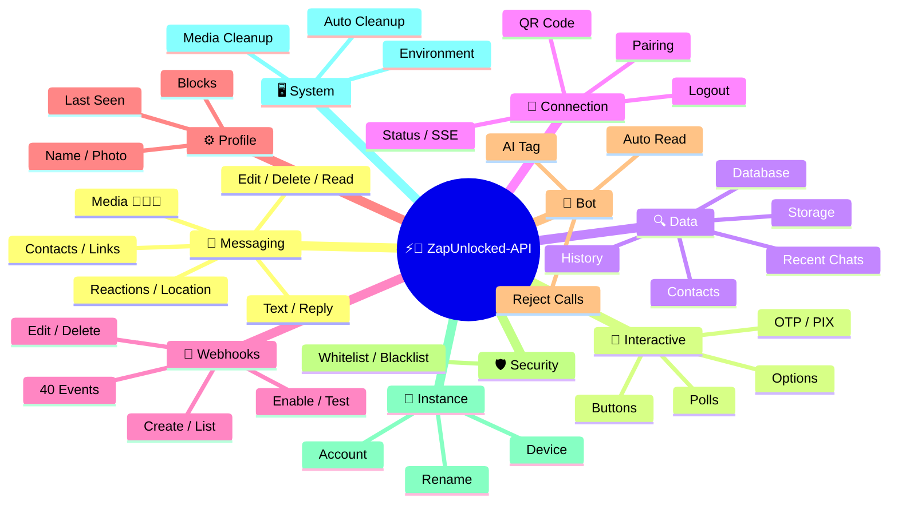
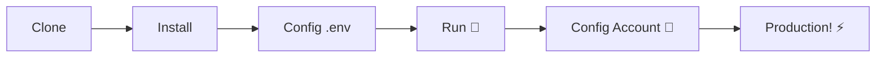

# ⚡💬 [ZapUnlocked-API](https://zapunlocked-api.kauafpss.com.br/)(https://zapunlocked-api.kauafpss.com.br/)


<p align="center">
  
  <a href="https://downgit.github.io/#/home?url=https://github.com/kauafpssx/ZapUnlocked-API/blob/main/ZapUnlocked.collection.json" target="_blank">
    
  </a>
  
  
  
</p>

---

### 🌐 Select Language / Selecione o Idioma:

<table width="100%">
  <tr>
    <td align="center" valign="middle"><a href="https://github.com/kauafpssx/ZapUnlocked-API/blob/main/README.md"></a></td>
    <td align="center" valign="middle"><a href="https://github.com/kauafpssx/ZapUnlocked-API/blob/main/docs/translations/es.md"></a></td>
    <td align="center" valign="middle"><a href="https://github.com/kauafpssx/ZapUnlocked-API/blob/main/docs/translations/fr.md"></a></td>
    <td align="center" valign="middle"><a href="https://github.com/kauafpssx/ZapUnlocked-API/blob/main/docs/translations/de.md"></a></td>
    <td align="center" valign="middle"><a href="https://github.com/kauafpssx/ZapUnlocked-API/blob/main/docs/translations/zh.md"></a></td>
    <td align="center" valign="middle"><a href="https://github.com/kauafpssx/ZapUnlocked-API/blob/main/docs/translations/ja.md"></a></td>
    <td align="center" valign="middle"><a href="https://github.com/kauafpssx/ZapUnlocked-API/blob/main/docs/translations/ru.md"></a></td>
    <td align="center" valign="middle"><a href="https://github.com/kauafpssx/ZapUnlocked-API/blob/main/docs/translations/it.md"></a></td>
    <td align="center" valign="middle"><a href="https://github.com/kauafpssx/ZapUnlocked-API/blob/main/docs/translations/ar.md"></a></td>
    <td align="center" valign="middle"><a href="https://github.com/kauafpssx/ZapUnlocked-API/blob/main/docs/translations/tr.md"></a></td>
    <td align="center" valign="middle"><a href="https://github.com/kauafpssx/ZapUnlocked-API/blob/main/docs/translations/ko.md"></a></td>
    <td align="center" valign="middle"><a href="https://github.com/kauafpssx/ZapUnlocked-API/blob/main/docs/translations/hi.md"></a></td>
    <td align="center" valign="middle"><a href="https://github.com/kauafpssx/ZapUnlocked-API/blob/main/docs/translations/nl.md"></a></td>
  </tr>
</table>

---

##  What is ZapUnlocked-API?

The WhatsApp API market charges abusive monthly fees: tens to hundreds of dollars per month, with usage limits, per-conversation fees, and data that passes through third-party servers. **ZapUnlocked-API exists to change that.**

Built in **Python** with **[Neonize](https://github.com/krypton-byte/neonize)** as the connection engine, this API offers a simple REST interface (FastAPI) to manage sessions, send complex media, and create intelligent interactions. **No heavy database, no monthly fees, no dependency on anyone.**

Our proposal is grounded in **technical excellence** and **developer independence**. We believe powerful tools should be accessible to those who build their own solutions.

> [!TIP]
> Perfect for developers seeking agility in integrating bots, notifications, and automated customer service systems. **Without paying anything for it.**

---

## 🗺️ API Overview




---

## ✨ Features

| Feature | Description |
| :------ | :---------- |
| 🧩 **Stateless Buttons** | Create interactive flows without a database, with encrypted webhooks |
| 🔢 **QR-less Pairing** | Connect via numeric code · ideal for headless servers |
| 🎵 **Automatic Audio Conversion** | Send audio that appears as recorded on the spot (PTT) natively |
| 📦 **Smart Media Queue** | Automatic management to prevent excessive memory consumption |
| 🏷️ **Dynamic Placeholders** | Personalize messages and webhooks with {{name}}, {{phone}} |

> [!NOTE]
> All features are **100% free** and maintained by the open-source community.

---

## 📋 API Routes

<details>
<summary><b>📨 Sending Messages</b> · 15 endpoints</summary>

| Method | Route | Description | Body |
| :----- | :---- | :---------- | :--- |
| `POST` | `/send` | Send text message / reply | `phone`, `message` |
| `POST` | `/send_image` | Send image | `phone`, `image_url` |
| `POST` | `/send_video` | Send video (supports GIF and PTV) | `phone`, `video_url` |
| `POST` | `/send_audio` | Send audio (with automatic PTT conversion) | `phone`, `audio_url` |
| `POST` | `/send_document` | Send document | `phone`, `document_url` |
| `POST` | `/send_sticker` | Send sticker | `phone`, `sticker_url` |
| `POST` | `/send_reaction` | Send reaction with emoji | `phone`, `messageId`, `emoji` |
| `POST` | `/send_location` | Send location | `phone`, `lat`, `lng` |
| `POST` | `/send_contact` | Send contact | `phone`, `name`, `contactPhone` |
| `POST` | `/send_contacts` | Send multiple contacts | `phone`, `contacts` |
| `POST` | `/send_link` | Send link with preview | `phone`, `url` |
| `POST` | `/messages/delete` | Delete message | `phone`, `messageId` |
| `POST` | `/messages/read` | Mark as read | `phone`, `messageIds` |
| `POST` | `/messages/edit` | Edit sent message | `phone`, `messageId`, `message` |
</details>

<details>
<summary><b>🔘 Interactive Messages</b> · 7 endpoints</summary>

| Method | Route | Description | Body |
| :----- | :---- | :---------- | :--- |
| `POST` | `/messages/send-button-list` | Send button list | `phone`, `buttons` |
| `POST` | `/messages/send-button-actions` | Send action button | `phone`, `buttons` |
| `POST` | `/messages/send-button-otp` | Send copy button (OTP) | `phone`, `code` |
| `POST` | `/messages/send-button-pix` | Send PIX button | `phone`, `pixKey` |
| `POST` | `/messages/send-option-list` | Send option list | `phone`, `buttons` |
| `POST` | `/messages/send-poll` | Send poll | `phone`, `name`, `options` |
| `POST` | `/messages/send-poll-vote` | Vote on poll | `phone`, `options` |
</details>

<details>
<summary><b>🔍 Queries & Management</b> · 8 endpoints</summary>

| Method | Route | Description | Body |
| :----- | :---- | :---------- | :--- |
| `POST` | `/management/fetch_messages` | Fetch message history | `phone` |
| `POST` | `/management/recent_contacts` | List recent chats | ❌ |
| `GET` | `/management/memory` | Memory usage status | ❌ |
| `GET` | `/management/volume_stats` | Check disk usage | ❌ |
| `DELETE` | `/management/cleanup` | Clean temporary media | ❌ |
| `GET` | `/management/database/status` | Database status and statistics | ❌ |
| `POST` | `/management/database/config` | Update database settings | `interval` |
| `POST` | `/management/database/cleanup` | Manual database cleanup | ❌ |
</details>

<details>
<summary><b>👤 Contacts</b> · 1 endpoint</summary>

| Method | Route | Description | Body |
| :----- | :---- | :---------- | :--- |
| `POST` | `/contacts/info` | Detailed contact information | `phone` |
</details>

<details>
<summary><b>🏠 General</b> · 3 endpoints</summary>

| Method | Route | Description | Body |
| :----- | :---- | :---------- | :--- |
| `GET` | `/` | Welcome page (HTML) | ❌ |
| `GET` | `/status` | Connection and session status (JSON) | ❌ |
| `GET` | `/status/stream` | Real-time status (SSE) | ❌ |
</details>

<details>
<summary><b>🔗 Connection (QR)</b> · 2 endpoints</summary>

| Method | Route | Description | Body |
| :----- | :---- | :---------- | :--- |
| `GET` | `/qr` | View interactive QR code (HTML) | ❌ |
| `GET` | `/qr/image` | Get QR code image (PNG) | ❌ |
</details>

<details>
<summary><b>🔐 Session</b> · 2 endpoints</summary>

| Method | Route | Description | Body |
| :----- | :---- | :---------- | :--- |
| `POST` | `/session/pair` | Generate numeric pairing code | `phone` |
| `POST` | `/session/logout` | Disconnect and reset session | ❌ |
</details>

<details>
<summary><b>📡 Webhooks (CRUD)</b> · 8 endpoints</summary>

| Method | Route | Description | Body |
| :----- | :---- | :---------- | :--- |
| `POST` | `/webhooks` | Create named webhook | `name`, `url` |
| `GET` | `/webhooks` | List all webhooks | ❌ |
| `GET` | `/webhooks/{name}` | Get webhook by name | ❌ |
| `PUT` | `/webhooks/{name}` | Edit webhook | ❌ |
| `DELETE` | `/webhooks/{name}` | Remove webhook | ❌ |
| `POST` | `/webhooks/{name}/toggle` | Enable / disable | `active` |
| `POST` | `/webhooks/{name}/test` | Test webhook | ❌ |
| `GET` | `/webhooks/events` | List event types (40 types) | ❌ |
</details>

<details>
<summary><b>⚙️ Profile & Privacy</b> · 3 endpoints</summary>

| Method | Route | Description | Body |
| :----- | :---- | :---------- | :--- |
| `POST` | `/settings/profile` | Change bot name and photo | ❌ |
| `POST` | `/settings/privacy` | Adjust privacy (last seen, etc.) | ❌ |
| `POST` | `/settings/block` | Block / unblock contact | `phone`, `action` |
</details>

<details>
<summary><b>🤖 Bot Settings</b> · 6 endpoints</summary>

| Method | Route | Description | Body |
| :----- | :---- | :---------- | :--- |
| `GET` | `/settings/bot` | View bot settings | ❌ |
| `POST` | `/settings/bot` | Update bot settings (AI tag, IP control) | ❌ |
| `PUT` | `/settings/instance/call-reject-auto` | Auto-reject calls | `value` |
| `PUT` | `/settings/instance/call-reject-message` | Call rejection message | `value` |
| `PUT` | `/settings/instance/auto-read-message` | Auto-read messages | `value` |
| `GET` | `/settings/phone-code/{phone}` | Generate pairing code by phone number | ❌ |
</details>

<details>
<summary><b>📱 Instance</b> · 3 endpoints</summary>

| Method | Route | Description | Body |
| :----- | :---- | :---------- | :--- |
| `GET` | `/instance/me` | Connected account data | ❌ |
| `GET` | `/instance/device` | Device technical data | ❌ |
| `PUT` | `/instance/update-name` | Rename instance | `name` |
</details>

<details>
<summary><b>🛡️ IP Rules</b> · 5 endpoints</summary>

| Method | Route | Description | Body |
| :----- | :---- | :---------- | :--- |
| `GET` | `/settings/ip-rules` | List IP rules (whitelist/blacklist) | ❌ |
| `POST` | `/settings/ip-rules/whitelist` | Add IP to whitelist | `ip` |
| `POST` | `/settings/ip-rules/blacklist` | Add IP to blacklist | `ip` |
| `DELETE` | `/settings/ip-rules/whitelist/{ip}` | Remove IP from whitelist | ❌ |
| `DELETE` | `/settings/ip-rules/blacklist/{ip}` | Remove IP from blacklist | ❌ |
</details>

<details>
<summary><b>🖥️ System</b> · 5 endpoints</summary>

| Method | Route | Description | Body |
| :----- | :---- | :---------- | :--- |
| `GET` | `/system/env` | View environment variables | ❌ |
| `PUT` | `/system/env` | Update environment variables | ❌ |
| `POST` | `/system/cleanup/force` | Force temporary media cleanup | ❌ |
| `GET` | `/system/cleanup/settings` | View auto-cleanup settings | ❌ |
| `PUT` | `/system/cleanup/settings` | Update auto-cleanup interval | ❌ |
</details>

> **Total: 68 endpoints**

---

## 📡 Webhook Events

All webhooks receive a standard envelope:

```json
{
  "event": "message.text",
  "timestamp": "2025-01-01T12:00:00Z",
  "data": { ... }
}
```

If the webhook has a custom `body` with `{{placeholders}}`, this body is sent instead of the standard envelope.


---

<details>
<summary><b>🏷️ Placeholders available in custom body</b></summary>

| Placeholder | Value |
| :---------- | :---- |
| `{{from}}` | Sender number |
| `{{text}}` | Message text |
| `{{phone}}` | Same as `{{from}}` |
| `{{id}}` | Message ID |
| `{{requested}}` | Requested amount (fetchMessages) |
| `{{found}}` | Found amount (fetchMessages) |
| `{{timestamp}}` | Current UTC timestamp |

</details>

---


<details>
<summary><b>📥 Messages Received</b> · 16 events</summary>

Base fields present in received message events:

```json
{
  "messageId": "3EB0ABCDEF123456",
  "from": "5511999999999",
  "fromName": "João Silva",
  "fromJid": "5511999999999@s.whatsapp.net",
  "isGroup": false
}
```

<details>
<summary><code>message.text</code> - Plain / formatted text</summary>

```json
{
  "event": "message.text",
  "data": {
    "...base": "...",
    "text": "Olá! Como posso ajudar?",
    "quoted": { "id": "3EB0...", "fromMe": true }
  }
}
```
</details>

<details>
<summary><code>message.image</code> - Image received</summary>

```json
{
  "event": "message.image",
  "data": {
    "...base": "...",
    "caption": "Foto do produto",
    "mimetype": "image/jpeg",
    "fileLength": 204800
  }
}
```
</details>

<details>
<summary><code>message.video</code> - Video received</summary>

```json
{
  "event": "message.video",
  "data": {
    "...base": "...",
    "caption": "Veja esse vídeo!",
    "mimetype": "video/mp4",
    "fileLength": 5242880,
    "isPTT": false,
    "isGif": false
  }
}
```
</details>

<details>
<summary><code>message.audio</code> - Audio / voice note</summary>

```json
{
  "event": "message.audio",
  "data": {
    "...base": "...",
    "mimetype": "audio/ogg; codecs=opus",
    "fileLength": 30720,
    "isPTT": true,
    "durationSeconds": 8
  }
}
```
</details>

<details>
<summary><code>message.document</code> - Document / file</summary>

```json
{
  "event": "message.document",
  "data": {
    "...base": "...",
    "fileName": "contrato.pdf",
    "caption": "Segue o contrato",
    "mimetype": "application/pdf",
    "fileLength": 102400
  }
}
```
</details>

<details>
<summary><code>message.sticker</code> - Sticker</summary>

```json
{
  "event": "message.sticker",
  "data": {
    "...base": "...",
    "mimetype": "image/webp",
    "isAnimated": false
  }
}
```
</details>

<details>
<summary><code>message.contact</code> - Shared contact</summary>

```json
{
  "event": "message.contact",
  "data": {
    "...base": "...",
    "displayName": "Maria Souza",
    "vcard": "BEGIN:VCARD\nVERSION:3.0\n..."
  }
}
```
</details>

<details>
<summary><code>message.location</code> - Location</summary>

```json
{
  "event": "message.location",
  "data": {
    "...base": "...",
    "lat": -23.5505,
    "lng": -46.6333,
    "name": "Av. Paulista",
    "address": "Av. Paulista, 1000 - São Paulo"
  }
}
```
</details>

<details>
<summary><code>message.reaction</code> - Reaction (emoji)</summary>

```json
{
  "event": "message.reaction",
  "data": {
    "...base": "...",
    "emoji": "❤️",
    "targetMessageId": "3EB0ABCDEF123456",
    "isRemoved": false
  }
}
```
</details>

<details>
<summary><code>message.poll_created</code> - Poll received</summary>

```json
{
  "event": "message.poll_created",
  "data": {
    "...base": "...",
    "pollName": "Qual o melhor sabor?",
    "options": ["Chocolate", "Morango", "Baunilha"]
  }
}
```
</details>

<details>
<summary><code>message.poll_vote</code> - Poll vote</summary>

```json
{
  "event": "message.poll_vote",
  "data": {
    "...base": "...",
    "pollId": "3EB0ABCDEF123456",
    "selectedOptions": ["Chocolate"]
  }
}
```
</details>

<details>
<summary><code>message.button_reply</code> - Button click</summary>

```json
{
  "event": "message.button_reply",
  "data": {
    "...base": "...",
    "buttonId": "opcao_sim",
    "displayText": "Sim",
    "type": "quick_reply"
  }
}
```
</details>

<details>
<summary><code>message.list_reply</code> - Interactive list selection</summary>

```json
{
  "event": "message.list_reply",
  "data": {
    "...base": "...",
    "rowId": "1",
    "title": "X-Burguer",
    "description": "R$ 18,90"
  }
}
```
</details>

<details>
<summary><code>message.deleted</code> - Message deleted by sender</summary>

```json
{
  "event": "message.deleted",
  "data": {
    "...base": "..."
  }
}
```
</details>

<details>
<summary><code>message.unknown</code> - Unmapped message type</summary>

```json
{
  "event": "message.unknown",
  "data": {
    "...base": "...",
    "rawType": "senderKeyDistributionMessage"
  }
}
```
</details>

<details>
<summary><code>message.undecryptable</code> - Undecryptable message</summary>

```json
{
  "event": "message.undecryptable",
  "data": {
    "...base": "..."
  }
}
```
</details>

</details>

<details>
<summary><b>📤 Messages Sent</b> · 4 events</summary>

<details>
<summary><code>message.sent</code> - Message sent (manual)</summary>

```json
{
  "event": "message.sent",
  "data": {
    "to": "5511999999999",
    "type": "text",
    "messageId": "3EB0ABCDEF123456"
  }
}
```
</details>

<details>
<summary><code>message.read</code> - Message read by recipient</summary>

```json
{
  "event": "message.read",
  "data": {
    "from": "5511999999999",
    "messageId": "3EB0ABCDEF123456"
  }
}
```
</details>

<details>
<summary><code>message.delivered</code> - Message delivered to recipient (receipt type 1)</summary>

```json
{
  "event": "message.delivered",
  "data": {
    "from": "5511999999999",
    "messageId": "3EB0ABCDEF123456"
  }
}
```
</details>

<details>
<summary><code>message.receipt</code> - Other delivery confirmations (receipt types 2, 3, 5+)</summary>

```json
{
  "event": "message.receipt",
  "data": {
    "from": "5511999999999",
    "messageId": "3EB0ABCDEF123456",
    "receiptType": 2
  }
}
```
</details>

</details>

<details>
<summary><b>🔗 Connection</b> · 11 events</summary>

<details>
<summary><code>connection.connected</code> - WhatsApp connected</summary>

```json
{
  "event": "connection.connected",
  "data": {
    "phone": "5511999999999"
  }
}
```
</details>

<details>
<summary><code>connection.disconnected</code> - WhatsApp disconnected</summary>

```json
{
  "event": "connection.disconnected",
  "data": {}
}
```
</details>

<details>
<summary><code>connection.qr_ready</code> - QR Code generated</summary>

```json
{
  "event": "connection.qr_ready",
  "data": {
    "qr": "2@abc123..."
  }
}
```
</details>

<details>
<summary><code>connection.pair_code</code> - Pairing code generated</summary>

```json
{
  "event": "connection.pair_code",
  "data": {
    "code": "NR62-NZSF"
  }
}
```
</details>

<details>
<summary><code>connection.pair_status</code> - Pairing status</summary>

```json
{
  "event": "connection.pair_status",
  "data": {
    "status": "waiting",
    "phone": "5511999999999"
  }
}
```
</details>

<details>
<summary><code>connection.logged_out</code> - Session ended remotely</summary>

```json
{
  "event": "connection.logged_out",
  "data": {}
}
```
</details>

<details>
<summary><code>connection.connect_failure</code> - Connection failure</summary>

```json
{
  "event": "connection.connect_failure",
  "data": {
    "reason": "network_error"
  }
}
```
</details>

<details>
<summary><code>connection.stream_error</code> - Stream error</summary>

```json
{
  "event": "connection.stream_error",
  "data": {
    "error": "connection closed"
  }
}
```
</details>

<details>
<summary><code>connection.temporary_ban</code> - Temporary ban</summary>

```json
{
  "event": "connection.temporary_ban",
  "data": {
    "phone": "5511999999999"
  }
}
```
</details>

<details>
<summary><code>connection.client_outdated</code> - Client outdated</summary>

```json
{
  "event": "connection.client_outdated",
  "data": {}
}
```
</details>

<details>
<summary><code>connection.stream_replaced</code> - Stream replaced</summary>

```json
{
  "event": "connection.stream_replaced",
  "data": {}
}
```
</details>

</details>

<details>
<summary><b>👥 Group</b> · 2 events</summary>

<details>
<summary><code>group.join</code> - New member joined group</summary>

```json
{
  "event": "group.join",
  "data": {
    "groupId": "5511999999999-123456@g.us",
    "inviter": "5511888888888",
    "member": "5511999999999"
  }
}
```
</details>

<details>
<summary><code>group.update</code> - Group updated</summary>

```json
{
  "event": "group.update",
  "data": {
    "groupId": "5511999999999-123456@g.us",
    "name": "New Name",
    "updatedBy": "5511888888888"
  }
}
```
</details>

</details>

<details>
<summary><b>👤 Contact / Presence</b> · 4 events</summary>

<details>
<summary><code>contact.presence</code> - Contact presence status</summary>

```json
{
  "event": "contact.presence",
  "data": {
    "from": "5511999999999@s.whatsapp.net",
    "presence": "available",
    "lastSeen": 1700000000
  }
}
```
</details>

<details>
<summary><code>contact.chat_presence</code> - Typing status</summary>

```json
{
  "event": "contact.chat_presence",
  "data": {
    "from": "5511999999999@s.whatsapp.net",
    "presence": "composing",
    "mediaType": 0
  }
}
```
</details>

<details>
<summary><code>contact.picture_change</code> - Profile picture changed</summary>

```json
{
  "event": "contact.picture_change",
  "data": {
    "from": "5511999999999@s.whatsapp.net",
    "pictureId": "abc123"
  }
}
```
</details>

<details>
<summary><code>contact.identity_change</code> - Security key changed</summary>

```json
{
  "event": "contact.identity_change",
  "data": {
    "from": "5511999999999@s.whatsapp.net"
  }
}
```
</details>

</details>

<details>
<summary><b>📞 Call</b> · 3 events</summary>

<details>
<summary><code>call.received</code> - Call received</summary>

```json
{
  "event": "call.received",
  "data": {
    "from": "5511999999999",
    "fromJid": "5511999999999@s.whatsapp.net",
    "callId": "ABC123DEF456"
  }
}
```
</details>

<details>
<summary><code>call.accepted</code> - Call accepted</summary>

```json
{
  "event": "call.accepted",
  "data": {
    "from": "5511999999999",
    "callId": "ABC123DEF456"
  }
}
```
</details>

<details>
<summary><code>call.terminated</code> - Call ended</summary>

```json
{
  "event": "call.terminated",
  "data": {
    "from": "5511999999999",
    "callId": "ABC123DEF456",
    "reason": "timeout"
  }
}
```
</details>

</details>

</details>

---

## 🛠️ Installation & Hosting

> Get your professional WhatsApp API up and running in less than **5 minutes** with **ZapUnlocked-API**.

### 💻 Local Installation

Ideal for development, testing, or running on your own server.



**1. Clone the Repository**

```bash
git clone https://github.com/kauafpssx/ZapUnlocked-API.git
cd ZapUnlocked-API
```

**2. Install Dependencies**

| System | Command |
| :----- | :------ |
| 🪟 Windows | scripts\install\install.bat |
| 🐧 Linux / macOS | bash scripts/install/install.sh |

**3. Configure the Environment**

| System | Command |
| :----- | :------ |
| 🪟 Windows | scripts\generate-env\generate-env.bat |
| 🐧 Linux / macOS | bash scripts/generate-env/generate-env.sh |

| Variable | Description |
| :------- | :---------- |
| API_KEY | Password for authentication on all endpoints |
| INTERNAL_SECRET | Token to validate webhook signatures |
| PORT | API port (default: 8300) |

**4. Run the API**

| System | Command |
| :----- | :------ |
| 🪟 Windows | scripts\run\run.bat |
| 🐧 Linux / macOS | bash scripts/run/run.sh |

---

### ☁️ Hosting: Alwaysdata (Free 24/7)

**Alwaysdata** is the recommended option for hosting the API stably and for free without needing to keep a server running.

#### 📊 Free Plan Resources

| Resource | Available on Free |
| :------- | :---------------- |
| 💾 Storage | **1 GB SSD** |
| 🧠 RAM | **256 MB** |
| ⚡ CPU | **1/4 vCPU** |
| 🔄 Backup | **3 days** automatic |
| 📡 Uptime | **24/7** via Services |

#### 👣 Step-by-Step Deployment

**1.** Create your account at [Alwaysdata.com](https://www.alwaysdata.com/) · **Free** plan.

**2.** Access SSH at https://ssh-[user].alwaysdata.net.

**3.** Clone and install:

```bash
git clone https://github.com/kauafpssx/ZapUnlocked-API.git ~/ZapUnlocked-API
cd ~/ZapUnlocked-API
bash scripts/install/install.sh
```

**4.** *(Optional)* Generate `.env`:

```bash
bash scripts/generate-env/generate-env.sh
```

> [!NOTE]
> The install script already asks if you want to configure the `.env`. If you answered **yes**, this step can be skipped. Otherwise, run the command above or configure `.env` manually.

**5.** Configure the Service (24/7) under **Advanced · Services · Add a service**:

| Field | Value |
| :---- | :---- |
| **Name** | ZapUnlocked-API |
| **Command** | python3 main.py |
| **Working directory** | ZapUnlocked-API |
| **Environment variables** | PORT=8300 |

**6.** Access via:

```
http://services-[user].alwaysdata.net:8300/
```

> [!TIP]
> The URL is already externally accessible. *(Optional)* To use a custom domain, configure a **Reverse Proxy** under **Web · Sites · Add a site** pointing to http://[user].alwaysdata.net.

---

## 🔐 Authentication (Login)

After deployment, connect your WhatsApp account by accessing in your browser:

```text
http://services-[user].alwaysdata.net:8300/qr?API_KEY=YOUR_SECRET_KEY
```

---

## 📖 Official Documentation

<p align="center">
  👉 <a href="https://zapunlocked-api.kauafpss.com.br"><strong>zapunlocked-api.kauafpss.com.br</strong></a>
</p>

For detailed technical documentation, code examples, and an interactive playground, visit our official website.

> [!TIP]
> Use **LLMs.txt** as an AI index: [zapunlocked-api.kauafpss.com.br/llms.txt](https://zapunlocked-api.kauafpss.com.br/llms.txt). Discover all pages before exploring.

---

## ❤️ Credits & Acknowledgments

| Project | Description |
| :------ | :---------- |
| [](https://github.com/krypton-byte/neonize) | Python library for native WhatsApp Web connection |
| [](https://github.com/tulir/whatsmeow) | Go base library for Neonize · the heart of the connection |
| [](https://www.alwaysdata.com/) | High-quality free infrastructure |

---

## 📄 License

This project is licensed under the **MIT License**.

<p align="center">
  Made with 💜 by <a href="https://www.instagram.com/kauafpss_/">Kauã Ferreira</a>
</p>