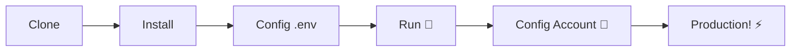

# 🚀 [ZapUnlocked-API](https://zapunlocked-api.kauafpss.com.br) 📲✨


<p align="center">
  
  
  
  
  
</p>

---

### 🌐 Select Language / Selecione o Idioma:

<table width="100%">
  <tr>
    <td align="center" valign="middle"><a href="https://github.com/kauafpssx/ZapUnlocked-API/blob/main/README.md"></a></td>
    <td align="center" valign="middle"><a href="https://github.com/kauafpssx/ZapUnlocked-API/blob/main/docs/translations/es.md"></a></td>
    <td align="center" valign="middle"><a href="https://github.com/kauafpssx/ZapUnlocked-API/blob/main/docs/translations/fr.md"></a></td>
    <td align="center" valign="middle"><a href="https://github.com/kauafpssx/ZapUnlocked-API/blob/main/docs/translations/de.md"></a></td>
    <td align="center" valign="middle"><a href="https://github.com/kauafpssx/ZapUnlocked-API/blob/main/docs/translations/zh.md"></a></td>
    <td align="center" valign="middle"><a href="https://github.com/kauafpssx/ZapUnlocked-API/blob/main/docs/translations/ja.md"></a></td>
    <td align="center" valign="middle"><a href="https://github.com/kauafpssx/ZapUnlocked-API/blob/main/docs/translations/ru.md"></a></td>
    <td align="center" valign="middle"><a href="https://github.com/kauafpssx/ZapUnlocked-API/blob/main/docs/translations/it.md"></a></td>
    <td align="center" valign="middle"><a href="https://github.com/kauafpssx/ZapUnlocked-API/blob/main/docs/translations/ar.md"></a></td>
    <td align="center" valign="middle"><a href="https://github.com/kauafpssx/ZapUnlocked-API/blob/main/docs/translations/tr.md"></a></td>
    <td align="center" valign="middle"><a href="https://github.com/kauafpssx/ZapUnlocked-API/blob/main/docs/translations/ko.md"></a></td>
    <td align="center" valign="middle"><a href="https://github.com/kauafpssx/ZapUnlocked-API/blob/main/docs/translations/hi.md"></a></td>
    <td align="center" valign="middle"><a href="https://github.com/kauafpssx/ZapUnlocked-API/blob/main/docs/translations/nl.md"></a></td>
  </tr>
</table>

---

##  What is ZapUnlocked-API?

The WhatsApp API market charges abusive monthly fees: tens to hundreds of dollars per month, with usage limits, per-conversation fees, and data that passes through third-party servers. **ZapUnlocked-API exists to change that.**

Built in **Python** with **[Neonize](https://github.com/krypton-byte/neonize)** as the connection engine, this API offers a simple REST interface (FastAPI) to manage sessions, send complex media, and create intelligent interactions. **No heavy database, no monthly fees, no dependency on anyone.**

Our proposal is grounded in **technical excellence** and **developer independence**. We believe powerful tools should be accessible to those who build their own solutions.

> [!TIP]
> Perfect for developers seeking agility in integrating bots, notifications, and automated customer service systems. **Without paying anything for it.**

---

## 🗺️ API Overview

`````mermaid
mindmap
  root((📲 ZapUnlocked-API))
    📨 Messages
      Text / Reply
      Media 📸🎥🎵
      Reactions / Location
      Contacts / Links
      Edit / Delete / Read
    🔘 Interactive
      Stateless Buttons
      Option List
      Polls
    🔍 Queries
      Contact Info
      History
      Recent Chats
      Memory / Disk
      Database
    🔗 Connection
      Status / SSE
      QR Code
      Pairing Code
      Logout
    📡 Webhooks
      Create / List
      Edit / Delete
      Enable / Test
      20 Events
    ⚙️ Profile & Privacy
      Name / Photo
      Last Seen
      Blocks
    🤖 Bot
      AI Tag
      IP Control
      Reject Calls
      Auto Read
    📱 Instance
      Account Data
      Device
      Rename
    🖥️ System
      Environment Variables
      Media Cleanup
      Auto Cleanup
```

---

## ✨ Features

| Feature | Description |
| :------ | :---------- |
| 🧩 **Stateless Buttons** | Create interactive flows without a database, with encrypted webhooks |
| 🔢 **QR-less Pairing** | Connect via numeric code · ideal for headless servers |
| 🎵 **Automatic Audio Conversion** | Send audio that appears as recorded on the spot (PTT) natively |
| 📦 **Smart Media Queue** | Automatic management to prevent excessive memory consumption |
| 🏷️ **Dynamic Placeholders** | Personalize messages and webhooks with {{name}}, {{day}}, {{phone}} |

> [!NOTE]
> All features are **100% free** and maintained by the open-source community.

---

## 📋 API Routes

<details>
<summary><b>📨 Sending Messages</b> · 14 endpoints</summary>

| Method | Route | Description |
| :----- | :---- | :---------- |
| POST | /send | Send text message / reply |
| POST | /send_image | Send image |
| POST | /send_video | Send video (supports GIF and PTV) |
| POST | /send_audio | Send audio (with automatic PTT conversion) |
| POST | /send_document | Send document |
| POST | /send_sticker | Send sticker |
| POST | /send_reaction | Send reaction with emoji |
| POST | /send_location | Send location |
| POST | /send_contact | Send contact |
| POST | /send_contacts | Send multiple contacts |
| POST | /send_link | Send link with preview |
| POST | /messages/delete | Delete message |
| POST | /messages/read | Mark as read |
| POST | /messages/edit | Edit sent message |
</details>

<details>
<summary><b>🔘 Interactive Messages</b> · 4 endpoints</summary>

| Method | Route | Description |
| :----- | :---- | :---------- |
| POST | /send_wbuttons | Send buttons (list, action, OTP, PIX) |
| POST | /messages/send-option-list | Send option list |
| POST | /messages/send-poll | Send poll |
| POST | /messages/send-poll-vote | Vote on poll |
</details>

<details>
<summary><b>🔍 Queries & Management</b> · 7 endpoints</summary>

| Method | Route | Description |
| :----- | :---- | :---------- |
| POST | /contacts/info | Detailed contact information |
| POST | /management/fetch_messages | Fetch message history |
| POST | /management/recent_contacts | List recent chats |
| GET | /management/memory | Memory usage status |
| GET | /management/volume_stats | Check disk usage |
| GET | /management/database/status | Database status and statistics |
| POST | /management/database/cleanup | Manual database cleanup |
</details>

<details>
<summary><b>🔗 Connection & Session</b> · 8 endpoints</summary>

| Method | Route | Description |
| :----- | :---- | :---------- |
| GET | / | Welcome page (HTML) |
| GET | /status | Connection and session status |
| GET | /status/stream | Real-time status (SSE) |
| GET | /qr | View interactive QR code |
| GET | /qr/image | Get QR code image (Base64) |
| POST | /qr/pair | Generate numeric pairing code |
| GET | /settings/phone-code/{phone} | Generate code by phone number |
| POST | /qr/logout | Disconnect and reset session |
</details>

<details>
<summary><b>📡 Webhooks (CRUD)</b> · 7 endpoints</summary>

| Method | Route | Description |
| :----- | :---- | :---------- |
| POST | /webhooks | Create named webhook |
| GET | /webhooks | List all webhooks |
| PUT | /webhooks/{name} | Edit webhook |
| DELETE | /webhooks/{name} | Remove webhook |
| POST | /webhooks/{name}/toggle | Enable / disable |
| POST | /webhooks/{name}/test | Test webhook |
| GET | /webhooks/events | List event types (20 types) |
</details>

<details>
<summary><b>⚙️ Profile & Privacy</b> · 3 endpoints</summary>

| Method | Route | Description |
| :----- | :---- | :---------- |
| POST | /settings/profile | Change bot name and photo |
| POST | /settings/privacy | Adjust privacy (last seen, etc.) |
| POST | /settings/block | Block / unblock contact |
</details>

<details>
<summary><b>🤖 Bot Settings</b> · 5 endpoints</summary>

| Method | Route | Description |
| :----- | :---- | :---------- |
| GET | /settings/bot | View bot settings |
| POST | /settings/bot | Update bot settings (AI tag, IP control) |
| PUT | /settings/instance/call-reject-auto | Auto-reject calls |
| PUT | /settings/instance/call-reject-message | Call rejection message |
| PUT | /settings/instance/auto-read-message | Auto-read messages |
</details>

<details>
<summary><b>📱 Instance</b> · 3 endpoints</summary>

| Method | Route | Description |
| :----- | :---- | :---------- |
| GET | /instance/me | Connected account data |
| GET | /instance/device | Device technical data |
| PUT | /instance/update-name | Rename instance |
</details>

<details>
<summary><b>🖥️ System</b> · 5 endpoints</summary>

| Method | Route | Description |
| :----- | :---- | :---------- |
| GET | /system/env | View environment variables |
| PUT | /system/env | Update environment variables |
| POST | /system/cleanup/force | Force temporary media cleanup |
| GET | /system/cleanup/settings | View auto-cleanup settings |
| PUT | /system/cleanup/settings | Update auto-cleanup interval |
</details>

> **Total: 56 endpoints** · Complete REST for WhatsApp automation.

---

## 🛠️ Installation & Hosting

> Get your professional WhatsApp API up and running in less than **5 minutes** with **ZapUnlocked-API**.

### 💻 Local Installation

Ideal for development, testing, or running on your own server.



**1. Clone the Repository**

```bash
git clone https://github.com/kauafpssx/ZapUnlocked-API.git
cd ZapUnlocked-API
```

**2. Install Dependencies**

| System | Command |
| :----- | :------ |
| 🪟 Windows | scripts\install\install.bat |
| 🐧 Linux / macOS | bash scripts/install/install.sh |

**3. Configure the Environment**

| System | Command |
| :----- | :------ |
| 🪟 Windows | scripts\generate-env\generate-env.bat |
| 🐧 Linux / macOS | bash scripts/generate-env/generate-env.sh |

| Variable | Description |
| :------- | :---------- |
| API_KEY | Password for authentication on all endpoints |
| INTERNAL_SECRET | Token to validate webhook signatures |
| PORT | API port (default: 8300) |

**4. Run the API**

| System | Command |
| :----- | :------ |
| 🪟 Windows | scripts\run\run.bat |
| 🐧 Linux / macOS | bash scripts/run/run.sh |

---

### ☁️ Hosting: Alwaysdata (Free 24/7)

**Alwaysdata** is the recommended option for hosting the API stably and for free without needing to keep a server running.

#### 📊 Free Plan Resources

| Resource | Available on Free |
| :------- | :---------------- |
| 💾 Storage | **1 GB SSD** |
| 🧠 RAM | **256 MB** |
| ⚡ CPU | **1/4 vCPU** |
| 🔄 Backup | **3 days** automatic |
| 📡 Uptime | **24/7** via Services |

#### 👣 Step-by-Step Deployment

**1.** Create your account at [Alwaysdata.com](https://www.alwaysdata.com/) · **Free** plan.

**2.** Access SSH at https://ssh-[user].alwaysdata.net.

**3.** Clone and install:

```bash
git clone https://github.com/kauafpssx/ZapUnlocked-API.git ~/ZapUnlocked-API
cd ~/ZapUnlocked-API
bash scripts/install/install.sh
```

**4.** Generate .env:

```bash
bash scripts/generate-env/generate-env.sh
```

**5.** Configure the Service (24/7) under **Advanced · Services · Add a service**:

| Field | Value |
| :---- | :---- |
| **Name** | ZapUnlocked-API |
| **Command** | python3 main.py |
| **Working directory** | ZapUnlocked-API |
| **Environment variables** | PORT=8300 |

**6.** Access via:

```
http://services-[user].alwaysdata.net:8300/
```

> [!TIP]
> The URL is already externally accessible. *(Optional)* To use a custom domain, configure a **Reverse Proxy** under **Web · Sites · Add a site** pointing to http://[user].alwaysdata.net.

---

## 🔐 Authentication (Login)

After deployment, connect your WhatsApp account by accessing in your browser:

```text
http://services-[user].alwaysdata.net:8300/qr?API_KEY=YOUR_SECRET_KEY
```

---

## 📖 Official Documentation

<p align="center">
  👉 <a href="https://zapunlocked-api.kauafpss.com.br"><strong>zapunlocked-api.kauafpss.com.br</strong></a>
</p>

For detailed technical documentation, code examples, and an interactive playground, visit our official website.

> [!TIP]
> Use **LLMs.txt** as an AI index: [zapunlocked-api.kauafpss.com.br/llms.txt](https://zapunlocked-api.kauafpss.com.br/llms.txt). Discover all pages before exploring.

---

## ❤️ Credits & Acknowledgments

| Project | Description |
| :------ | :---------- |
| [](https://github.com/krypton-byte/neonize) | Python library for native WhatsApp Web connection |
| [](https://github.com/tulir/whatsmeow) | Go base library for Neonize · the heart of the connection |
| [](https://www.alwaysdata.com/) | High-quality free infrastructure |

---

## 📄 License

This project is licensed under the **MIT License**.

<p align="center">
  Made with 💜 by <a href="https://www.instagram.com/kauafpss_/">Kauã Ferreira</a>
</p>