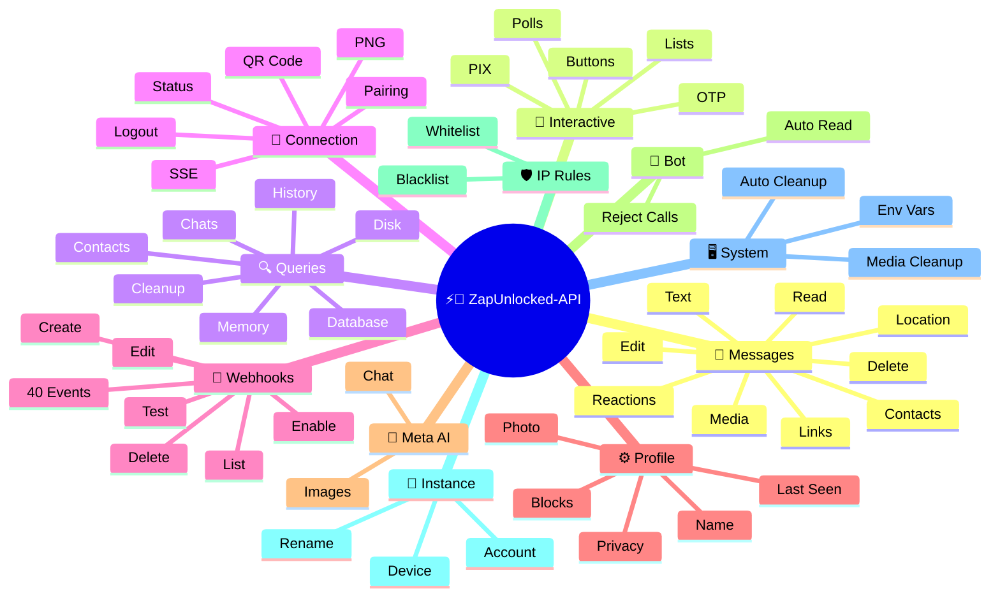
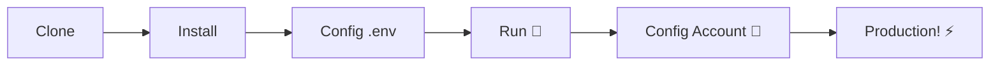

# ⚡💬 [ZapUnlocked-API](https://zapunlocked-api.kauafpss.com.br/)


<p align="center">
  
  <a href="https://downgit.github.io/#/home?url=https://github.com/kauafpssx/ZapUnlocked-API/blob/main/ZapUnlocked.collection.json">
    
  </a>
  
  
  
</p>

---

### 🌐 Select Language / Selecione o Idioma:

<table width="100%">
  <tr>
    <td align="center" valign="middle"><a href="https://github.com/kauafpssx/ZapUnlocked-API/blob/main/README.md"></a></td>
    <td align="center" valign="middle"><a href="https://github.com/kauafpssx/ZapUnlocked-API/blob/main/docs/translations/es.md"></a></td>
    <td align="center" valign="middle"><a href="https://github.com/kauafpssx/ZapUnlocked-API/blob/main/docs/translations/fr.md"></a></td>
    <td align="center" valign="middle"><a href="https://github.com/kauafpssx/ZapUnlocked-API/blob/main/docs/translations/de.md"></a></td>
    <td align="center" valign="middle"><a href="https://github.com/kauafpssx/ZapUnlocked-API/blob/main/docs/translations/zh.md"></a></td>
    <td align="center" valign="middle"><a href="https://github.com/kauafpssx/ZapUnlocked-API/blob/main/docs/translations/ja.md"></a></td>
    <td align="center" valign="middle"><a href="https://github.com/kauafpssx/ZapUnlocked-API/blob/main/docs/translations/ru.md"></a></td>
    <td align="center" valign="middle"><a href="https://github.com/kauafpssx/ZapUnlocked-API/blob/main/docs/translations/it.md"></a></td>
    <td align="center" valign="middle"><a href="https://github.com/kauafpssx/ZapUnlocked-API/blob/main/docs/translations/ar.md"></a></td>
    <td align="center" valign="middle"><a href="https://github.com/kauafpssx/ZapUnlocked-API/blob/main/docs/translations/tr.md"></a></td>
    <td align="center" valign="middle"><a href="https://github.com/kauafpssx/ZapUnlocked-API/blob/main/docs/translations/ko.md"></a></td>
    <td align="center" valign="middle"><a href="https://github.com/kauafpssx/ZapUnlocked-API/blob/main/docs/translations/hi.md"></a></td>
    <td align="center" valign="middle"><a href="https://github.com/kauafpssx/ZapUnlocked-API/blob/main/docs/translations/nl.md"></a></td>
  </tr>
</table>

---

##  What is ZapUnlocked-API?

The WhatsApp API market charges monthly fees of tens to hundreds of dollars, with usage limits, per-conversation costs, and third-party server routing. **ZapUnlocked-API is free and open-source.**

Built in **Python** with **[Neonize](https://github.com/krypton-byte/neonize)** as the connection engine, the API uses FastAPI to manage sessions, send media, and create bots. No heavy database, no monthly fees, no third-party servers.

> [!TIP]
> Use for bots, notifications, and customer service systems. **100% free.**

> [!IMPORTANT]
> 🤖 **Meta AI integrated.** Use `/ai/ask` to chat and `/ai/imagine` to generate images inside WhatsApp. [See route](#-meta-ai--2-endpoints).

---

## 🗺️ API Overview



---

## ✨ Features

| Feature | Description |
| :------ | :---------- |
| 🧩 **Stateless Buttons** | Create interactive flows without a database, with encrypted webhooks |
| 🔢 **QR-less Pairing** | Connect via numeric code · ideal for servers without GUI |
| 🎵 **Automatic Audio Conversion** | Send audio that appears as recorded on the spot (PTT) natively |
| 📦 **Smart Media Queue** | Automatic management to prevent excessive memory consumption |
| 🏷️ **Dynamic Placeholders** | Personalize messages and webhooks with `{{name}}`, `{{day}}`, `{{phone}}` |
| 🤖 **Meta AI** | Chat and generate images with AI inside WhatsApp. |
| ⌨️ **Universal Parameters** | `delay_message`, `delay_typing`, `reply`/`quoted_id` and `@mentions` work on **every** send endpoint. |
| 🔐 **Signed Webhooks** | HMAC-SHA256 integrity. Your webhook only accepts legitimate data. |
| 🔄 **Auto Reconnect** | Reconnects automatically on disconnect, remote logout, or stream error. |
| 📁 **File Upload + URL** | Send media by direct upload **or** public URL. |

> [!NOTE]
> All features are **100% free** and maintained by the open-source community.

---

## 📋 API Routes

<details>
<summary><b>📨 Sending Messages</b> · 15 endpoints</summary>

| Method | Route | Description | Body |
| :----- | :---- | :---------- | :--- |
| `POST` | `/send` | Send text message / reply | `phone`, `message` |
| `POST` | `/send_image` | Send image | `phone`, `image_url` |
| `POST` | `/send_video` | Send video (supports GIF and PTV) | `phone`, `video_url` |
| `POST` | `/send_gif` | Send animated GIF | `phone`, `url` |
| `POST` | `/send_audio` | Send audio (with automatic PTT conversion) | `phone`, `audio_url` |
| `POST` | `/send_document` | Send document | `phone`, `document_url` |
| `POST` | `/send_sticker` | Send sticker | `phone`, `sticker_url` |
| `POST` | `/send_reaction` | Send reaction with emoji | `phone`, `messageId`, `emoji` |
| `POST` | `/send_location` | Send location | `phone`, `lat`, `lng` |
| `POST` | `/send_contact` | Send contact | `phone`, `name`, `contactPhone` |
| `POST` | `/send_contacts` | Send multiple contacts | `phone`, `contacts` |
| `POST` | `/send_link` | Send link with preview | `phone`, `url` |
| `POST` | `/messages/delete` | Delete message | `phone`, `messageId` |
| `POST` | `/messages/read` | Mark as read | `phone`, `messageIds` |
| `POST` | `/messages/edit` | Edit sent message | `phone`, `messageId`, `message` |
</details>

> [!TIP]
> **Universal parameters.** Available on **every** message send endpoint (including interactive):
>
> | Parameter | What it does |
> | :-------- | :------------ |
> | `delay_message` | Waits N seconds before sending. |
> | `delay_typing` | Shows "typing..." for N seconds before sending. |
> | `reply` / `quoted_id` | ID of the message to reply to (quote). |
> | `mentioned` | JSON array of phone numbers to @mention. Example: `["5511999999999"]` |

<details>
<summary><b>🔘 Interactive Messages</b> · 9 endpoints</summary>

| Method | Route | Description | Body |
| :----- | :---- | :---------- | :--- |
| `POST` | `/messages/send-button-list` | Option list button | `phone`, `buttons` |
| `POST` | `/messages/send-button-quick-reply` | Quick reply button | `phone`, `title`, `buttons` |
| `POST` | `/messages/send-button-otp` | Copy button (OTP) | `phone`, `code` |
| `POST` | `/messages/send-button-pix` | PIX button | `phone`, `pixKey` |
| `POST` | `/messages/send-button-url` | URL button | `phone`, `title`, `url` |
| `POST` | `/messages/send-button-call` | Call button | `phone`, `title`, `phoneNumber` |
| `POST` | `/messages/send-option-list` | ⛔ **Temporarily disabled** (incompatible with iPhone, Android and Web) | `phone`, `buttons` |
| `POST` | `/messages/send-poll` | Send poll | `phone`, `name`, `options` |
| `POST` | `/messages/send-poll-vote` | Vote on poll | `phone`, `options` |
</details>

<details>
<summary><b>🔍 Queries & Management</b> · 12 endpoints</summary>

| Method | Route | Description | Body |
| :----- | :---- | :---------- | :--- |
| `POST` | `/management/fetch_messages` | Fetch message history | `phone` |
| `POST` | `/management/recent_contacts` | List recent chats | ❌ |
| `GET` | `/management/chats` | List chats with history | ❌ |
| `GET` | `/management/chats/{phone}/messages` | Messages from a specific chat | ❌ |
| `GET` | `/management/contacts/{phone}` | Detailed contact info | ❌ |
| `GET` | `/management/groups` | List groups | ❌ |
| `DELETE` | `/management/cleanup` | Clear chat data | ❌ |
| `GET` | `/management/export` | Export config (webhooks, settings, IP rules) | ❌ |
| `POST` | `/management/import` | Import config via file upload | `file` |
| `GET` | `/management/database/status` | Database status and statistics | ❌ |
| `POST` | `/management/database/config` | Update database settings | `interval` |
| `POST` | `/management/database/cleanup` | Manual database cleanup | ❌ |
</details>

<details>
<summary><b>👤 Contacts</b> · 1 endpoint</summary>

| Method | Route | Description | Body |
| :----- | :---- | :---------- | :--- |
| `POST` | `/contacts/info` | Detailed contact information | `phone` |
</details>

<details>
<summary><b>🏠 General / Status</b> · 9 endpoints</summary>

| Method | Route | Description | Body |
| :----- | :---- | :---------- | :--- |
| `GET` | `/` | Welcome page (HTML) | ❌ |
| `GET` | `/status` | Full status (WhatsApp, CPU, memory, disk) | ❌ |
| `GET` | `/status/stream` | Real-time status via SSE | ❌ |
| `GET` | `/status/health` | Simple health check (`{"ok":true}`) | ❌ |
| `GET` | `/status/readiness` | Readiness check (503 if WhatsApp disconnected) | ❌ |
| `GET` | `/status/memory` | Memory status (process + system) | ❌ |
| `GET` | `/status/volume` | Disk status (size, files) | ❌ |
| `GET` | `/collection.json` | Download Postman Collection | ❌ |
| `POST` | `/collection.json` | Update Postman Collection | JSON body |
</details>

<details>
<summary><b>🔗 Connection (QR)</b> · 2 endpoints</summary>

| Method | Route | Description | Body |
| :----- | :---- | :---------- | :--- |
| `GET` | `/qr` | View interactive QR code (HTML) | ❌ |
| `GET` | `/qr/image` | Get QR code image (PNG) | ❌ |
</details>

<details>
<summary><b>🔐 Session</b> · 2 endpoints</summary>

| Method | Route | Description | Body |
| :----- | :---- | :---------- | :--- |
| `POST` | `/session/pair` | Generate numeric pairing code | `phone` |
| `POST` | `/session/logout` | Disconnect and reset session | ❌ |
</details>

<details>
<summary><b>📡 Webhooks (CRUD)</b> · 8 endpoints</summary>

| Method | Route | Description | Body |
| :----- | :---- | :---------- | :--- |
| `POST` | `/webhooks` | Create named webhook | `name`, `url` |
| `GET` | `/webhooks` | List all webhooks | ❌ |
| `GET` | `/webhooks/{name}` | Get webhook by name | ❌ |
| `PUT` | `/webhooks/{name}` | Edit webhook | ❌ |
| `DELETE` | `/webhooks/{name}` | Remove webhook | ❌ |
| `POST` | `/webhooks/{name}/toggle` | Enable / disable | `active` |
| `POST` | `/webhooks/{name}/test` | Test webhook | ❌ |
| `GET` | `/webhooks/events` | List event types (40 types) | ❌ |
</details>

<details>
<summary><b>⚙️ Profile & Privacy</b> · 13 endpoints</summary>

| Method | Route | Description | Body |
| :----- | :---- | :---------- | :--- |
| `POST` | `/settings/profile` | Change bot name and photo | `name?`, `photo?` (Form) |
| `POST` | `/settings/block` | Block / unblock contact | `phone`, `action` |
| `PUT` | `/settings/privacy/last-seen` | Last seen time | `value` |
| `PUT` | `/settings/privacy/online` | Online status | `value` |
| `PUT` | `/settings/privacy/profile` | Profile photo visibility | `value` |
| `PUT` | `/settings/privacy/status` | Status visibility | `value` |
| `PUT` | `/settings/privacy/read-receipts` | Read receipts | `value` |
| `PUT` | `/settings/privacy/groups-add` | Who can add to groups | `value` |
| `PUT` | `/settings/privacy/call-add` | Who can add to calls | `value` |
| `PUT` | `/settings/privacy/about` | About / status message | `value?` |
| `PUT` | `/settings/privacy/disappearing-timer` | Disappearing messages timer | `value?` |
| `GET` | `/settings/ip-control` | View IP control status | ❌ |
| `PUT` | `/settings/ip-control` | Enable/disable IP control | `enabled` |
</details>

<details>
<summary><b>🤖 Bot Settings</b> · 4 endpoints</summary>

| Method | Route | Description | Body |
| :----- | :---- | :---------- | :--- |
| `PUT` | `/settings/instance/call-reject-auto` | Auto-reject calls | `value` |
| `PUT` | `/settings/instance/call-reject-message` | Rejected call message | `value` |
| `PUT` | `/settings/instance/auto-read-message` | Auto-read messages | `value` |
| `GET` | `/settings/phone-code/{phone}` | Generate pairing code by phone number | ❌ |
</details>

<details>
<summary><b>📱 Instance</b> · 3 endpoints</summary>

| Method | Route | Description | Body |
| :----- | :---- | :---------- | :--- |
| `GET` | `/instance/me` | Connected account data | ❌ |
| `GET` | `/instance/device` | Device technical data | ❌ |
| `PUT` | `/instance/update-name` | Rename instance | `name` |
</details>

<details>
<summary><b>🛡️ IP Rules</b> · 5 endpoints</summary>

| Method | Route | Description | Body |
| :----- | :---- | :---------- | :--- |
| `GET` | `/settings/ip-rules` | List IP rules (whitelist/blacklist) | ❌ |
| `POST` | `/settings/ip-rules/whitelist` | Add IP to whitelist | `ip` |
| `POST` | `/settings/ip-rules/blacklist` | Add IP to blacklist | `ip` |
| `DELETE` | `/settings/ip-rules/whitelist/{ip}` | Remove IP from whitelist | ❌ |
| `DELETE` | `/settings/ip-rules/blacklist/{ip}` | Remove IP from blacklist | ❌ |
</details>

<details>
<summary><b>🖥️ System</b> · 5 endpoints</summary>

| Method | Route | Description | Body |
| :----- | :---- | :---------- | :--- |
| `GET` | `/system/env` | View environment variables | ❌ |
| `PUT` | `/system/env` | Update environment variables | ❌ |
| `POST` | `/system/cleanup/force` | Force temporary media cleanup | ❌ |
| `GET` | `/system/cleanup/settings` | View auto-cleanup settings | ❌ |
| `PUT` | `/system/cleanup/settings` | Update auto-cleanup interval | ❌ |
</details>

<details>
<summary><b>📊 Logs</b> · 3 endpoints</summary>

| Method | Route | Description | Body |
| :----- | :---- | :---------- | :--- |
| `GET` | `/logs/files` | List log files | ❌ |
| `GET` | `/logs` | View logs with filters | ❌ |
| `POST` | `/logs/cleanup` | Force log compression/cleanup | ❌ |
</details>

<details>
<summary><b>📈 Stats</b> · 6 endpoints</summary>

| Method | Route | Description | Body |
| :----- | :---- | :---------- | :--- |
| `GET` | `/stats` | Statistics (uptime, messages, webhooks) | ❌ |
| `DELETE` | `/stats` | Reset statistics | ❌ |
| `GET` | `/stats/webhooks` | Stats for all webhooks | ❌ |
| `GET` | `/stats/webhooks/{name}` | Stats for a specific webhook | ❌ |
| `DELETE` | `/stats/webhooks` | Reset all webhook stats | ❌ |
| `DELETE` | `/stats/webhooks/{name}` | Reset a webhook's stats | ❌ |
</details>

<details>
<summary><b>🤖 Meta AI</b> · 2 endpoints</summary>

| Method | Route | Description | Body |
| :----- | :---- | :---------- | :--- |
| `POST` | `/ai/ask` | Ask Meta AI | `message` |
| `POST` | `/ai/imagine` | Generate image with Meta AI | `prompt` |
</details>

<details>
<summary><b>🔐 Multi-Session</b> · 7 endpoints</summary>

| Method | Route | Description | Body |
| :----- | :---- | :---------- | :--- |
| `GET` | `/sessions` | List all sessions | ❌ |
| `POST` | `/sessions` | Create new session | `name?` |
| `PUT` | `/sessions/{id}/rename` | Rename session | `name` |
| `DELETE` | `/sessions/{id}` | Disable session | ❌ |
| `POST` | `/sessions/{id}/connect` | Connect session | ❌ |
| `POST` | `/sessions/{id}/disconnect` | Disconnect session | ❌ |
| `GET` | `/sessions/{id}/status` | Session status | ❌ |
</details>

<details>
<summary><b>📡 Webhooks (Logs)</b> · 3 endpoints</summary>

| Method | Route | Description | Body |
| :----- | :---- | :---------- | :--- |
| `GET` | `/webhooks/{name}/logs` | Webhook delivery logs | ❌ |
| `DELETE` | `/webhooks/{name}/logs` | Clear webhook logs | ❌ |
| `DELETE` | `/webhooks/logs/all` | Clear all webhook logs | ❌ |
</details>

> **Total: 108 endpoints**

---

## 📡 Webhook Events

All webhooks receive a standard envelope:

```json
{
  "event": "message.text",
  "timestamp": "2025-01-01T12:00:00Z",
  "data": { ... }
}
```

If the webhook has a custom `body` with `{{placeholders}}`, this body is sent instead of the standard envelope.

---

<details>
<summary><b>🏷️ Placeholders available in custom body</b></summary>

| Placeholder | Value |
| :---------- | :---- |
| `{{from}}` | Sender number |
| `{{text}}` | Message text |
| `{{phone}}` | Same as `{{from}}` |
| `{{id}}` | Message ID |
| `{{requested}}` | Requested amount (fetchMessages) |
| `{{found}}` | Found amount (fetchMessages) |
| `{{timestamp}}` | Current UTC timestamp |

</details>

---

<details>
<summary><b>📥 Messages Received</b> · 18 events</summary>

> **Media fields:** Media events (`message.image`, `message.video`, `message.audio`, `message.document`, `message.sticker`) include extra fields when `RECEIVE_MEDIA_ENABLED=true`: `mediaBase64` (file base64), `fileName`, `mimeType`, `mediaTooLarge` (bool: true when exceeds `RECEIVE_MEDIA_MAX_SIZE_MB`).

Base fields present in received message events:

```json
{
  "messageId": "3EB0ABCDEF123456",
  "from": "5511999999999",
  "fromName": "João Silva",
  "fromJid": "5511999999999@s.whatsapp.net",
  "isGroup": false
}
```

<details>
<summary><code>message.text</code> - Plain / formatted text</summary>

```json
{
  "event": "message.text",
  "data": {
    "...base": "...",
    "text": "Hello! How can I help you?",
    "quoted": { "id": "3EB0...", "fromMe": true }
  }
}
```
</details>

<details>
<summary><code>message.image</code> - Image received</summary>

```json
{
  "event": "message.image",
  "data": {
    "...base": "...",
    "caption": "Product photo",
    "mimetype": "image/jpeg",
    "fileLength": 204800
  }
}
```
</details>

<details>
<summary><code>message.video</code> - Video received</summary>

```json
{
  "event": "message.video",
  "data": {
    "...base": "...",
    "caption": "Check out this video!",
    "mimetype": "video/mp4",
    "fileLength": 5242880,
    "isPTT": false,
    "isGif": false
  }
}
```
</details>

<details>
<summary><code>message.audio</code> - Audio / voice note</summary>

```json
{
  "event": "message.audio",
  "data": {
    "...base": "...",
    "mimetype": "audio/ogg; codecs=opus",
    "fileLength": 30720,
    "isPTT": true,
    "durationSeconds": 8
  }
}
```
</details>

<details>
<summary><code>message.document</code> - Document / file</summary>

```json
{
  "event": "message.document",
  "data": {
    "...base": "...",
    "fileName": "contract.pdf",
    "caption": "Here is the contract",
    "mimetype": "application/pdf",
    "fileLength": 102400
  }
}
```
</details>

<details>
<summary><code>message.sticker</code> - Sticker</summary>

```json
{
  "event": "message.sticker",
  "data": {
    "...base": "...",
    "mimetype": "image/webp",
    "isAnimated": false
  }
}
```
</details>

<details>
<summary><code>message.contact</code> - Shared contact</summary>

```json
{
  "event": "message.contact",
  "data": {
    "...base": "...",
    "displayName": "Maria Souza",
    "vcard": "BEGIN:VCARD\nVERSION:3.0\n..."
  }
}
```
</details>

<details>
<summary><code>message.contacts</code> - Multiple contacts</summary>

```json
{
  "event": "message.contacts",
  "data": {
    "...base": "...",
    "displayName": "2 contacts",
    "count": 2,
    "contacts": [
      { "displayName": "Maria Souza", "vcard": "BEGIN:VCARD\n..." },
      { "displayName": "João Silva", "vcard": "BEGIN:VCARD\n..." }
    ]
  }
}
```
</details>

<details>
<summary><code>message.location</code> - Location</summary>

```json
{
  "event": "message.location",
  "data": {
    "...base": "...",
    "lat": -23.5505,
    "lng": -46.6333,
    "name": "Av. Paulista",
    "address": "Av. Paulista, 1000 - São Paulo"
  }
}
```
</details>

<details>
<summary><code>message.reaction</code> - Reaction (emoji)</summary>

```json
{
  "event": "message.reaction",
  "data": {
    "...base": "...",
    "emoji": "❤️",
    "targetMessageId": "3EB0ABCDEF123456",
    "isRemoved": false
  }
}
```
</details>

<details>
<summary><code>message.poll_created</code> - Poll received</summary>

```json
{
  "event": "message.poll_created",
  "data": {
    "...base": "...",
    "pollName": "What's the best flavor?",
    "options": ["Chocolate", "Strawberry", "Vanilla"]
  }
}
```
</details>

<details>
<summary><code>message.poll_vote</code> - Poll vote</summary>

```json
{
  "event": "message.poll_vote",
  "data": {
    "...base": "...",
    "pollId": "3EB0ABCDEF123456",
    "selectedOptions": ["Chocolate"]
  }
}
```
</details>

<details>
<summary><code>message.button_reply</code> - Button click</summary>

```json
{
  "event": "message.button_reply",
  "data": {
    "...base": "...",
    "buttonId": "option_yes",
    "displayText": "Yes",
    "type": "quick_reply"
  }
}
```
</details>

<details>
<summary><code>message.list_reply</code> - Interactive list selection</summary>

```json
{
  "event": "message.list_reply",
  "data": {
    "...base": "...",
    "rowId": "1",
    "title": "X-Burger",
    "description": "$18.90"
  }
}
```
</details>

<details>
<summary><code>message.deleted</code> - Message deleted by sender</summary>

```json
{
  "event": "message.deleted",
  "data": {
    "...base": "..."
  }
}
```
</details>

<details>
<summary><code>message.unknown</code> - Unmapped message type</summary>

```json
{
  "event": "message.unknown",
  "data": {
    "...base": "...",
    "rawType": "senderKeyDistributionMessage"
  }
}
```
</details>

<details>
<summary><code>message.undecryptable</code> - Undecryptable message</summary>

```json
{
  "event": "message.undecryptable",
  "data": {
    "...base": "..."
  }
}
```
</details>

</details>

<details>
<summary><b>📤 Messages Sent</b> · 22 events</summary>

<details>
<summary><code>message.sent</code> - Message sent (generic)</summary>

```json
{
  "event": "message.sent",
  "data": {
    "to": "5511999999999",
    "type": "text",
    "messageId": "3EB0ABCDEF123456"
  }
}
```
</details>

<details>
<summary><code>message.sent.{type}</code> - Specific event by type</summary>

Same payload as `message.sent`, but with a specific event. Useful for subscribing to a single send type.

Types: `text`, `image`, `audio`, `video`, `document`, `sticker`, `gif`, `interactive`, `list`, `poll`, `poll_vote`, `location`, `contact`, `contacts`, `link`, `reaction`, `edit`, `delete`

```json
{
  "event": "message.sent.image",
  "data": {
    "to": "5511999999999",
    "type": "image",
    "messageId": "3EB0ABCDEF123456"
  }
}
```
</details>

<details>
<summary><code>message.delivered</code> - Message delivered to recipient (receipt type 1)</summary>

```json
{
  "event": "message.delivered",
  "data": {
    "from": "5511999999999",
    "messageId": "3EB0ABCDEF123456"
  }
}
```
</details>

<details>
<summary><code>message.read</code> - Message read by recipient (receipt type 4)</summary>

```json
{
  "event": "message.read",
  "data": {
    "from": "5511999999999",
    "messageId": "3EB0ABCDEF123456"
  }
}
```
</details>

<details>
<summary><code>message.receipt</code> - Other delivery confirmations (receipt types 2, 3, 5+)</summary>

```json
{
  "event": "message.receipt",
  "data": {
    "from": "5511999999999",
    "messageId": "3EB0ABCDEF123456",
    "receiptType": 2
  }
}
```
</details>

</details>

<details>
<summary><b>🔗 Connection</b> · 11 events</summary>

<details>
<summary><code>connection.connected</code> - WhatsApp connected</summary>

```json
{
  "event": "connection.connected",
  "data": {
    "phone": "5511999999999"
  }
}
```
</details>

<details>
<summary><code>connection.disconnected</code> - WhatsApp disconnected</summary>

```json
{
  "event": "connection.disconnected",
  "data": {}
}
```
</details>

<details>
<summary><code>connection.qr_ready</code> - QR Code generated</summary>

```json
{
  "event": "connection.qr_ready",
  "data": {
    "qr": "2@abc123..."
  }
}
```
</details>

<details>
<summary><code>connection.pair_code</code> - Pairing code generated</summary>

```json
{
  "event": "connection.pair_code",
  "data": {
    "code": "ABCD-1234",
    "connected": false
  }
}
```

`connected: true` when pairing is completed.
</details>

<details>
<summary><code>connection.pair_status</code> - Pairing status</summary>

```json
{
  "event": "connection.pair_status",
  "data": {
    "jid": "5511999999999@s.whatsapp.net",
    "businessName": "My Business",
    "platform": "WEB",
    "status": "OK",
    "error": ""
  }
}
```
</details>

<details>
<summary><code>connection.logged_out</code> - Session ended remotely</summary>

```json
{
  "event": "connection.logged_out",
  "data": {
    "reason": "User logout"
  }
}
```
</details>

<details>
<summary><code>connection.connect_failure</code> - Connection failure</summary>

```json
{
  "event": "connection.connect_failure",
  "data": {
    "reason": "ERROR_CONNECT",
    "message": "Connection timed out"
  }
}
```
</details>

<details>
<summary><code>connection.stream_error</code> - Stream error</summary>

```json
{
  "event": "connection.stream_error",
  "data": {
    "code": "STREAM_ERR"
  }
}
```
</details>

<details>
<summary><code>connection.temporary_ban</code> - Temporary ban</summary>

```json
{
  "event": "connection.temporary_ban",
  "data": {
    "code": "BAN_CODE",
    "expire": 1704153600
  }
}
```
</details>

<details>
<summary><code>connection.client_outdated</code> - Client outdated</summary>

```json
{
  "event": "connection.client_outdated",
  "data": {}
}
```
</details>

<details>
<summary><code>connection.stream_replaced</code> - Stream replaced</summary>

```json
{
  "event": "connection.stream_replaced",
  "data": {}
}
```
</details>

</details>

<details>
<summary><b>👥 Group</b> · 2 events</summary>

<details>
<summary><code>group.join</code> - Bot joined the group</summary>

```json
{
  "event": "group.join",
  "data": {
    "groupId": "123456789@g.us",
    "groupName": "My Group",
    "reason": "invite",
    "type": ""
  }
}
```
</details>

<details>
<summary><code>group.update</code> - Group updated</summary>

```json
{
  "event": "group.update",
  "data": {
    "groupId": "123456789@g.us",
    "sender": "5511999999999@s.whatsapp.net",
    "name": "New Group Name",
    "topic": "New description",
    "locked": false,
    "announce": false,
    "ephemeral": 604800,
    "delete": false,
    "link": null,
    "unlink": null,
    "newInviteLink": "https://chat.whatsapp.com/abc123"
  }
}
```
</details>

</details>

<details>
<summary><b>👤 Contact / Presence</b> · 4 events</summary>

<details>
<summary><code>contact.presence</code> - Contact presence status</summary>

```json
{
  "event": "contact.presence",
  "data": {
    "from": "5511999999999",
    "fromJid": "5511999999999@s.whatsapp.net",
    "status": "online",
    "lastSeen": 0
  }
}
```

`status`: `"online"` or `"offline"`.
</details>

<details>
<summary><code>contact.chat_presence</code> - Typing status</summary>

```json
{
  "event": "contact.chat_presence",
  "data": {
    "from": "5511999999999",
    "fromJid": "5511999999999@s.whatsapp.net",
    "state": "typing",
    "media": null
  }
}
```

`state`: `"typing"`, `"recording"` or `"paused"`.
</details>

<details>
<summary><code>contact.picture_change</code> - Profile picture changed</summary>

```json
{
  "event": "contact.picture_change",
  "data": {
    "from": "5511999999999",
    "fromJid": "5511999999999@s.whatsapp.net",
    "author": "5511999999999@s.whatsapp.net",
    "action": "changed"
  }
}
```

`action`: `"changed"` or `"removed"`.
</details>

<details>
<summary><code>contact.identity_change</code> - Security key changed</summary>

```json
{
  "event": "contact.identity_change",
  "data": {
    "from": "5511999999999",
    "fromJid": "5511999999999@s.whatsapp.net",
    "implicit": false,
    "timestamp": 1704067200
  }
}
```
</details>

</details>

<details>
<summary><b>📞 Call</b> · 3 events</summary>

<details>
<summary><code>call.received</code> - Call received</summary>

```json
{
  "event": "call.received",
  "data": {
    "from": "5511999999999",
    "fromJid": "5511999999999@s.whatsapp.net",
    "callId": "ABC123DEF456"
  }
}
```
</details>

<details>
<summary><code>call.accepted</code> - Call accepted</summary>

```json
{
  "event": "call.accepted",
  "data": {
    "from": "5511999999999",
    "callId": "ABC123DEF456"
  }
}
```
</details>

<details>
<summary><code>call.terminated</code> - Call ended</summary>

```json
{
  "event": "call.terminated",
  "data": {
    "from": "5511999999999",
    "callId": "ABC123DEF456",
    "reason": "timeout"
  }
}
```
</details>

</details>

<details>
<summary><b>🧹 Media Cleanup</b> · 1 event</summary>

<details>
<summary><code>media.cleanup.completed</code> - Automatic media cleanup executed</summary>

```json
{
  "event": "media.cleanup.completed",
  "data": {
    "filesRemoved": 12,
    "remainingBytes": 52428800
  }
}
```

Runs every hour automatically. `filesRemoved: 0` when nothing was removed.
</details>

</details>

<details>
<summary><b>🤖 AI</b> · 1 event</summary>

<details>
<summary><code>ai.response</code> - Meta AI response received</summary>

```json
{
  "event": "ai.response",
  "data": {
    "text": "Brasília!",
    "hasImage": false,
    "imageBase64": null,
    "imageUrl": null,
    "mimeType": null,
    "messageId": "3EB0ABCDEF123456"
  }
}
```

Always fired when Meta AI responds. Use when you need to handle async responses (the `POST /ai/ask` has a 30s timeout).
</details>

</details>

---

## 🛠️ Installation & Hosting

> Run ZapUnlocked-API in under **5 minutes**.

### 💻 Local Installation

For development, testing, or self-hosting.



**1. Clone the Repository**

```bash
git clone https://github.com/kauafpssx/ZapUnlocked-API.git
cd ZapUnlocked-API
```

**2. Install Dependencies**

| System | Command |
| :----- | :------ |
| 🪟 Windows | `scripts\install\install.bat` |
| 🐧 Linux / macOS | `bash scripts/install/install.sh` |

**3. Configure the Environment**

| System | Command |
| :----- | :------ |
| 🪟 Windows | `scripts\generate-env\generate-env.bat` |
| 🐧 Linux / macOS | `bash scripts/generate-env/generate-env.sh` |

| Variable | Description |
| :------- | :---------- |
| `API_KEY` | Password for authentication on all endpoints |
| `INTERNAL_SECRET` | Token to validate webhook signatures |
| `PORT` | API port (default: `8300`) |

**4. Run the API**

| System | Command |
| :----- | :------ |
| 🪟 Windows | `scripts\run\run.bat` |
| 🐧 Linux / macOS | `bash scripts/run/run.sh` |

---

### ☁️ Hosting: Alwaysdata (Free 24/7)

**Alwaysdata** hosts the API for free with 24/7 uptime.

<details>
<summary><b>📊 View Resources & Step-by-Step</b></summary>

#### 📊 Free Plan Resources

| Resource | Available on Free |
| :------- | :---------------- |
| 💾 Storage | **1 GB SSD** |
| 🧠 RAM | **256 MB** |
| ⚡ CPU | **1/4 vCPU** |
| 🔄 Backup | **3 days** automatic |
| 📡 Uptime | **24/7** via Services |

#### 👣 Step-by-Step Deployment

**1.** Create your account at [Alwaysdata.com](https://www.alwaysdata.com/) · **Free** plan.

**2.** Access SSH at `https://ssh-[user].alwaysdata.net`.

**3.** Clone and install:

```bash
git clone https://github.com/kauafpssx/ZapUnlocked-API.git ~/ZapUnlocked-API
cd ~/ZapUnlocked-API
bash scripts/install/install.sh
```

**4.** *(Optional)* Generate `.env`:

```bash
bash scripts/generate-env/generate-env.sh
```

> [!NOTE]
> The install script already asks if you want to configure the `.env`. If you answered **yes**, this step can be skipped. Otherwise, run the command above or configure `.env` manually.

**5.** Configure the Service (24/7) under **Advanced › Services › Add a service**:

| Field | Value |
| :---- | :---- |
| **Command** | `bash scripts/run/run.sh` |
| **Working directory** | `ZapUnlocked-API` |
| **Environment variables** | `PORT=8300` |

**6.** Access via:

```
http://services-[user].alwaysdata.net:8300/
```

> [!TIP]
> The URL is externally accessible. *(Optional)* To use a custom domain, configure a **Reverse Proxy** under **Web › Sites › Add a site** pointing to `http://[user].alwaysdata.net`.

---

#### 🔐 Authentication (Login)

After deployment, connect your WhatsApp account by accessing in your browser:

```text
http://services-[user].alwaysdata.net:8300/qr?API_KEY=YOUR_SECRET_KEY
```

</details>

---

<details>
<summary><b>📌 Other Information</b> · Environment variables, timezone, send params, bulk, media receiver</summary>

### 🌐 Complete Environment Variables

Extra `.env` variables beyond `API_KEY`, `INTERNAL_SECRET` and `PORT`:

| Variable | Default | Description |
| :------- | :----- | :-------- |
| `PUBLIC_URL` | auto | Public URL for `/qr` dashboard link in logs |
| `TZ` | `UTC` | Timezone for timestamps (e.g. `America/Sao_Paulo`) |
| `DRY_RUN` | `false` | Test mode, intercepts sends without calling WhatsApp |
| `RECEIVE_MEDIA_ENABLED` | `false` | Auto-download received media to `temp_media/` |
| `RECEIVE_MEDIA_MAX_SIZE_MB` | `15` | Max received media size (MB) |
| `CORS_ORIGINS` | `*` | Allowed origins (comma-separated) |
| `ENABLE_WHATSAPP` | `1` | Disable WhatsApp bot (`0` for testing) |
| `ENABLE_FFMPEG_WARMUP` | `1` | Disable FFmpeg warmup (`0`) |
| `MAX_UPLOAD_SIZE_MB` | `500` | Max upload size per file |
| `CLEANUP_MAX_AGE_DAYS` | `7` | Max file age in `temp_media/` |
| `CLEANUP_MAX_SIZE_MB` | `500` | Max total size of `temp_media/` |
| `LOG_MAX_AGE_DAYS` | `30` | Max age of compressed logs |
| `LOG_MAX_SIZE_MB` | `50` | Max total log size |
| `META_AI_PHONE` | auto | Override Meta AI phone number |
| `META_AI_TIMEOUT` | `30` | Meta AI response timeout (seconds) |
| `META_AI_KEEP_IMAGES` | `false` | Save Meta AI images to disk |
| `ALWAYSDATA_ACCOUNT` | auto | Force Alwaysdata environment |

---

### 🕐 Timezone

Every send endpoint returns `timestamp` in ISO 8601 with offset. Configuration priority:

1. `timezone.conf` file at project root (first uncommented line)
2. `TZ` in `.env` or environment
3. Default: `UTC`

Common values: `America/Sao_Paulo`, `America/New_York`, `Europe/London`, `Asia/Tokyo`.

```json
{
  "success": true,
  "message": "Message sent.",
  "messageId": "3EB0ABCDEF123456",
  "timestamp": "2026-06-15T14:30:00-0300"
}
```

---

### ✏️ Dynamic Text Formatting

Placeholders replaced at send time:

| Placeholder | Replaced by |
| :---------- | :-------------- |
| `{{day}}` | Current day (01-31) |
| `{{mon}}` | Current month (01-12) |
| `{{yea}}` | Current year (2026) |
| `{{hou}}` | Current hour (00-23) |
| `{{min}}` | Current minute (00-59) |
| `{{sec}}` | Current second (00-59) |

```json
{
  "phone": "5511999999999",
  "message": "Today is {{mon}}/{{day}}/{{yea}} and the time is {{hou}}:{{min}}:{{sec}}"
}
```

Result: `"Today is 06/15/2026 and the time is 14:30:00"`

---

### 🧪 DRY_RUN Mode

`DRY_RUN=true` in `.env` makes all send endpoints return success without calling WhatsApp. Response includes `"dryRun": true`, `"messageId": null`.

Uses: integration testing, CI/CD, payload validation.

```json
{
  "success": true,
  "dryRun": true,
  "message": "Message sent.",
  "messageId": null,
  "timestamp": "2026-06-15T14:30:00-0300"
}
```

---

### ⚙️ Optional Send Parameters

Available on all `/send/*`, `/send/media`, `/send/buttons/*` endpoints:

| Parameter | Type | Description |
| :-------- | :--- | :-------- |
| `quoted_id` | `string` | Message ID to reply to |
| `delay_message` | `number` | Delay in seconds before sending |
| `delay_typing` | `number` | Simulate typing for X seconds |
| `mentioned` | `string[]` | Phone numbers to @mention |

```json
{
  "phone": "5511999999999",
  "message": "Hello @5511888888888!",
  "quoted_id": "3EB0ABC123",
  "delay_message": 2,
  "delay_typing": 3,
  "mentioned": ["5511888888888"]
}
```

> [!NOTE]
> `quoted_id` accepts message ID (`type: "id"`) or text to search (`type: "text"`). If the ID is not found locally, the API creates a placeholder and WhatsApp renders the quote anyway.

---

### 📦 Bulk Send

`POST /send/bulk` sends the same message to multiple numbers:

| Parameter | Type | Required | Description |
| :-------- | :--- | :---------- | :-------- |
| `phones` | `string[]` | ✅ | Array of phone numbers |
| `message` | `string` | ✅ | Message text |
| `delay_message` | `number` | ❌ | Delay before each send |
| `delay_typing` | `number` | ❌ | Simulate typing |
| `delay_between` | `number` | ❌ | Delay between numbers |
| `mentioned` | `string[]` | ❌ | Mentions |

```json
{
  "phones": ["5511999999999", "5511888888888", "5511777777777"],
  "message": "Flash sale! 🔥",
  "delay_between": 3,
  "delay_typing": 2
}
```

---

### 📥 Media Receiver

With `RECEIVE_MEDIA_ENABLED=true`, the API downloads received media (image, video, audio, document, sticker) and adds `mediaUrl` to the webhook:

```json
{
  "event": "message.upsert",
  "data": {
    "key": { "remoteJid": "5511999999999@s.whatsapp.net" },
    "message": { "imageMessage": {} },
    "mediaUrl": "http://services-user.alwaysdata.net:8300/media/uuid-file.jpg"
  }
}
```

Files are stored in `temp_media/` and cleaned by the auto scheduler.

---

### 🧹 Auto Cleanup (temp_media)

`temp_media/` cleanup runs every hour. Triggers when either threshold is hit:

* Files older than `CLEANUP_MAX_AGE_DAYS` (default: 7 days)
* Total size exceeds `CLEANUP_MAX_SIZE_MB` (default: 500 MB)

Fires webhook `media.cleanup.completed` with `filesRemoved` and `remainingBytes`.

</details>

---

## 📖 Official Documentation

<p align="center">
  👉 <a href="https://zapunlocked-api.kauafpss.com.br"><strong>zapunlocked-api.kauafpss.com.br</strong></a>
</p>

For detailed technical documentation, code examples, and an interactive playground, visit our official website.

> [!TIP]
> Use **LLMs.txt** as an AI index: [`zapunlocked-api.kauafpss.com.br/llms.txt`](https://zapunlocked-api.kauafpss.com.br/llms.txt).

---

## ❤️ Credits & Acknowledgments

| Project | Description |
| :------ | :---------- |
| [](https://github.com/krypton-byte/neonize) | Python library for native WhatsApp Web connection |
| [](https://github.com/tulir/whatsmeow) | Go base library for Neonize · the heart of the connection |
| [](https://www.alwaysdata.com/) | High-quality free infrastructure |

---

## 📄 License

This project is licensed under the **MIT License**.

<p align="center">
  Made with 💜 by <a href="https://www.instagram.com/kauafpss_/">Kauã Ferreira</a>
</p>
