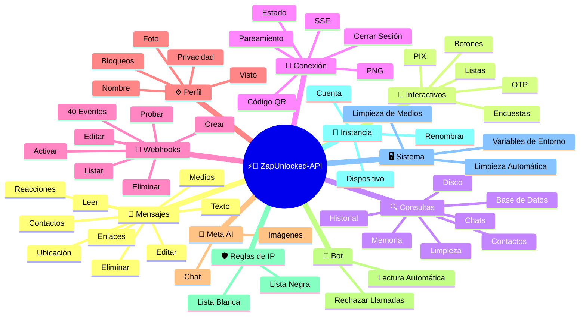
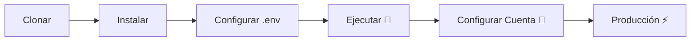

# ⚡💬 [ZapUnlocked-API](https://zapunlocked-api.kauafpss.com.br/)


<p align="center">
  
  <a href="https://downgit.github.io/#/home?url=https://github.com/kauafpssx/ZapUnlocked-API/blob/main/ZapUnlocked.collection.json">
    
  </a>
  
  
  
</p>

---

### 🌐 Seleccionar Idioma:

<table width="100%">
  <tr>
    <td align="center" valign="middle"><a href="https://github.com/kauafpssx/ZapUnlocked-API/blob/main/README.md"></a></td>
    <td align="center" valign="middle"><a href="https://github.com/kauafpssx/ZapUnlocked-API/blob/main/docs/translations/en.md"></a></td>
    <td align="center" valign="middle"><a href="https://github.com/kauafpssx/ZapUnlocked-API/blob/main/docs/translations/es.md"></a></td>
    <td align="center" valign="middle"><a href="https://github.com/kauafpssx/ZapUnlocked-API/blob/main/docs/translations/fr.md"></a></td>
    <td align="center" valign="middle"><a href="https://github.com/kauafpssx/ZapUnlocked-API/blob/main/docs/translations/de.md"></a></td>
    <td align="center" valign="middle"><a href="https://github.com/kauafpssx/ZapUnlocked-API/blob/main/docs/translations/zh.md"></a></td>
    <td align="center" valign="middle"><a href="https://github.com/kauafpssx/ZapUnlocked-API/blob/main/docs/translations/ja.md"></a></td>
    <td align="center" valign="middle"><a href="https://github.com/kauafpssx/ZapUnlocked-API/blob/main/docs/translations/ru.md"></a></td>
    <td align="center" valign="middle"><a href="https://github.com/kauafpssx/ZapUnlocked-API/blob/main/docs/translations/it.md"></a></td>
    <td align="center" valign="middle"><a href="https://github.com/kauafpssx/ZapUnlocked-API/blob/main/docs/translations/ar.md"></a></td>
    <td align="center" valign="middle"><a href="https://github.com/kauafpssx/ZapUnlocked-API/blob/main/docs/translations/tr.md"></a></td>
    <td align="center" valign="middle"><a href="https://github.com/kauafpssx/ZapUnlocked-API/blob/main/docs/translations/ko.md"></a></td>
    <td align="center" valign="middle"><a href="https://github.com/kauafpssx/ZapUnlocked-API/blob/main/docs/translations/hi.md"></a></td>
    <td align="center" valign="middle"><a href="https://github.com/kauafpssx/ZapUnlocked-API/blob/main/docs/translations/nl.md"></a></td>
  </tr>
</table>

---

##  ¿Qué es ZapUnlocked-API?

El mercado de APIs para WhatsApp cobra mensualidades abusivas: decenas a cientos de reales por mes, con límites de uso, tarifas por conversación y datos que pasan por servidores de terceros. **ZapUnlocked-API es gratuita y de código abierto.**

Construida en **Python** con **[Neonize](https://github.com/krypton-byte/neonize)** como motor de conexión, la API usa FastAPI para gestionar sesiones, enviar medios y crear bots. Sin base de datos pesada, sin mensualidad, sin servidores de terceros.

> [!TIP]
> Use para bots, notificaciones y sistemas de atención al cliente. **100% gratis.**

> [!IMPORTANT]
> 🤖 **Meta AI integrado.** Use `/ai/ask` para conversar y `/ai/imagine` para generar imágenes dentro de WhatsApp. [Ver ruta](#-meta-ai--2-endpoints).

---

## 🗺️ Visión General de la API



---

## ✨ Funcionalidades Destacadas

| Funcionalidad | Descripción |
| :------------- | :-------- |
| 🧩 **Botones Stateless** | Crea flujos interactivos sin base de datos, con webhooks cifrados |
| 🔢 **Pareamiento sin Código QR** | Conecta mediante código numérico · ideal para servidores sin GUI |
| 🎵 **Conversión Automática de Audio** | Envía audios que aparecen como grabados al momento (PTT) nativamente |
| 📦 **Cola de Medios Inteligente** | Gestión automática para evitar consumo excesivo de memoria |
| 🏷️ **Placeholders Dinámicos** | Personaliza mensajes y webhooks con `{{name}}`, `{{day}}`, `{{phone}}` |
| 🤖 **Meta AI** | Conversa y genera imágenes con IA dentro de WhatsApp. |
| ⌨️ **Parámetros Universales** | `delay_message`, `delay_typing`, `reply`/`quoted_id` y `@menciones` funcionan en **todos** los endpoints de envío. |
| 🔐 **Webhooks Firmados** | Integridad vía HMAC-SHA256. Tu webhook solo acepta datos legítimos. |
| 🔄 **Reconexión Automática** | Reconoce automáticamente al desconectar, cerrar sesión remota o error de stream. |
| 📁 **Subida de Archivos + URL** | Envía medios por carga directa **o** URL pública. |

> [!NOTE]
> Todas las funcionalidades son **100% gratuitas** y mantenidas por la comunidad open-source.

---

## 📋 Rutas de la API

<details>
<summary><b>📨 Envío de Mensajes</b> · 15 endpoints</summary>

| Método | Ruta | Descripción | Body |
| :----- | :--- | :-------- | :--- |
| `POST` | `/send` | Enviar mensaje de texto / responder | `phone`, `message` |
| `POST` | `/send_image` | Enviar imagen | `phone`, `image_url` |
| `POST` | `/send_video` | Enviar vídeo (soporta GIF y PTV) | `phone`, `video_url` |
| `POST` | `/send_gif` | Enviar GIF animado | `phone`, `url` |
| `POST` | `/send_audio` | Enviar audio (con conversión automática a PTT) | `phone`, `audio_url` |
| `POST` | `/send_document` | Enviar documento | `phone`, `document_url` |
| `POST` | `/send_sticker` | Enviar sticker | `phone`, `sticker_url` |
| `POST` | `/send_reaction` | Enviar reacción con emoji | `phone`, `messageId`, `emoji` |
| `POST` | `/send_location` | Enviar ubicación | `phone`, `lat`, `lng` |
| `POST` | `/send_contact` | Enviar contacto | `phone`, `name`, `contactPhone` |
| `POST` | `/send_contacts` | Enviar múltiples contactos | `phone`, `contacts` |
| `POST` | `/send_link` | Enviar enlace con vista previa | `phone`, `url` |
| `POST` | `/messages/delete` | Eliminar mensaje | `phone`, `messageId` |
| `POST` | `/messages/read` | Marcar como leído | `phone`, `messageIds` |
| `POST` | `/messages/edit` | Editar mensaje enviado | `phone`, `messageId`, `message` |
</details>

> [!TIP]
> **Parámetros universales.** Disponibles en **todo** endpoint de envío de mensajes (incluso interactivos):
>
> | Parámetro | Qué hace |
> | :-------- | :-------- |
> | `delay_message` | Espera N segundos antes de enviar. |
> | `delay_typing` | Muestra "escribiendo..." por N segundos antes de enviar. |
> | `reply` / `quoted_id` | ID del mensaje a responder (cita). |
> | `mentioned` | JSON array de números para @mencionar. Ejemplo: `["5511999999999"]` |

<details>
<summary><b>🔘 Mensajes Interactivos</b> · 9 endpoints</summary>

| Método | Ruta | Descripción | Body |
| :----- | :--- | :-------- | :--- |
| `POST` | `/messages/send-button-list` | Botón de lista de opciones | `phone`, `buttons` |
| `POST` | `/messages/send-button-quick-reply` | Botón de respuesta rápida | `phone`, `title`, `buttons` |
| `POST` | `/messages/send-button-otp` | Botón de copia (OTP) | `phone`, `code` |
| `POST` | `/messages/send-button-pix` | Botón de PIX | `phone`, `pixKey` |
| `POST` | `/messages/send-button-url` | Botón con enlace | `phone`, `title`, `url` |
| `POST` | `/messages/send-button-call` | Botón de llamada | `phone`, `title`, `phoneNumber` |
| `POST` | `/messages/send-option-list` | ⛔ **Temporalmente deshabilitada** (incompatible con iPhone, Android y Web) | `phone`, `buttons` |
| `POST` | `/messages/send-poll` | Enviar encuesta | `phone`, `name`, `options` |
| `POST` | `/messages/send-poll-vote` | Votar en encuesta | `phone`, `options` |
</details>

<details>
<summary><b>🔍 Consultas y Gestión</b> · 12 endpoints</summary>

| Método | Ruta | Descripción | Body |
| :----- | :--- | :-------- | :--- |
| `POST` | `/management/fetch_messages` | Buscar historial de mensajes | `phone` |
| `POST` | `/management/recent_contacts` | Listar chats recientes | ❌ |
| `GET` | `/management/chats` | Listar chats con historial | ❌ |
| `GET` | `/management/chats/{phone}/messages` | Mensajes de un chat específico | ❌ |
| `GET` | `/management/contacts/{phone}` | Información detallada del contacto | ❌ |
| `GET` | `/management/groups` | Listar grupos | ❌ |
| `DELETE` | `/management/cleanup` | Limpiar datos de chat | ❌ |
| `GET` | `/management/export` | Exportar configuración (webhooks, settings, IP rules) | ❌ |
| `POST` | `/management/import` | Importar configuración vía file upload | `file` |
| `GET` | `/management/database/status` | Estado y estadísticas de la base de datos | ❌ |
| `POST` | `/management/database/config` | Actualizar configuración de la base de datos | `interval` |
| `POST` | `/management/database/cleanup` | Limpieza manual de la base de datos | ❌ |
</details>

<details>
<summary><b>👤 Contactos</b> · 1 endpoint</summary>

| Método | Ruta | Descripción | Body |
| :----- | :--- | :-------- | :--- |
| `POST` | `/contacts/info` | Información detallada del contacto | `phone` |
</details>

<details>
<summary><b>🏠 General / Estado</b> · 9 endpoints</summary>

| Método | Ruta | Descripción | Body |
| :----- | :--- | :-------- | :--- |
| `GET` | `/` | Página de bienvenida (HTML) | ❌ |
| `GET` | `/status` | Estado completo (WhatsApp, CPU, memoria, disco) | ❌ |
| `GET` | `/status/stream` | Estado en tiempo real vía SSE | ❌ |
| `GET` | `/status/health` | Health check simple (`{"ok":true}`) | ❌ |
| `GET` | `/status/readiness` | Readiness check (503 si WhatsApp desconectado) | ❌ |
| `GET` | `/status/memory` | Estado de memoria (proceso + sistema) | ❌ |
| `GET` | `/status/volume` | Estado de disco (tamaño, archivos) | ❌ |
| `GET` | `/collection.json` | Descargar la Collection de Postman | ❌ |
| `POST` | `/collection.json` | Actualizar Collection de Postman | JSON body |
</details>

<details>
<summary><b>🔗 Conexión (QR)</b> · 2 endpoints</summary>

| Método | Ruta | Descripción | Body |
| :----- | :--- | :-------- | :--- |
| `GET` | `/qr` | Ver código QR interactivo (HTML) | ❌ |
| `GET` | `/qr/image` | Obtener imagen del código QR (PNG) | ❌ |
</details>

<details>
<summary><b>🔐 Sesión</b> · 2 endpoints</summary>

| Método | Ruta | Descripción | Body |
| :----- | :--- | :-------- | :--- |
| `POST` | `/session/pair` | Generar código de pareamiento numérico | `phone` |
| `POST` | `/session/logout` | Desconectar y reiniciar sesión | ❌ |
</details>

<details>
<summary><b>📡 Webhooks (CRUD)</b> · 8 endpoints</summary>

| Método | Ruta | Descripción | Body |
| :----- | :--- | :-------- | :--- |
| `POST` | `/webhooks` | Crear webhook nombrado | `name`, `url` |
| `GET` | `/webhooks` | Listar todos los webhooks | ❌ |
| `GET` | `/webhooks/{name}` | Obtener webhook por nombre | ❌ |
| `PUT` | `/webhooks/{name}` | Editar webhook | ❌ |
| `DELETE` | `/webhooks/{name}` | Eliminar webhook | ❌ |
| `POST` | `/webhooks/{name}/toggle` | Activar / desactivar | `active` |
| `POST` | `/webhooks/{name}/test` | Probar webhook | ❌ |
| `GET` | `/webhooks/events` | Listar tipos de eventos (40 tipos) | ❌ |
</details>

<details>
<summary><b>⚙️ Perfil y Privacidad</b> · 13 endpoints</summary>

| Método | Ruta | Descripción | Body |
| :----- | :--- | :-------- | :--- |
| `POST` | `/settings/profile` | Cambiar nombre y foto del bot | `name?`, `photo?` (Form) |
| `POST` | `/settings/block` | Bloquear / desbloquear contacto | `phone`, `action` |
| `PUT` | `/settings/privacy/last-seen` | Última vez visto | `value` |
| `PUT` | `/settings/privacy/online` | Estado en línea | `value` |
| `PUT` | `/settings/privacy/profile` | Visibilidad de la foto | `value` |
| `PUT` | `/settings/privacy/status` | Visibilidad del estado | `value` |
| `PUT` | `/settings/privacy/read-receipts` | Confirmación de lectura | `value` |
| `PUT` | `/settings/privacy/groups-add` | Quién puede añadir a grupos | `value` |
| `PUT` | `/settings/privacy/call-add` | Quién puede añadir a llamadas | `value` |
| `PUT` | `/settings/privacy/about` | About/recado | `value?` |
| `PUT` | `/settings/privacy/disappearing-timer` | Temporizador de mensajes temporales | `value?` |
| `GET` | `/settings/ip-control` | Ver estado del control de IP | ❌ |
| `PUT` | `/settings/ip-control` | Activar/desactivar control de IP | `enabled` |
</details>

<details>
<summary><b>🤖 Configuración del Bot</b> · 4 endpoints</summary>

| Método | Ruta | Descripción | Body |
| :----- | :--- | :-------- | :--- |
| `PUT` | `/settings/instance/call-reject-auto` | Rechazar llamadas automáticamente | `value` |
| `PUT` | `/settings/instance/call-reject-message` | Mensaje de llamada rechazada | `value` |
| `PUT` | `/settings/instance/auto-read-message` | Lectura automática de mensajes | `value` |
| `GET` | `/settings/phone-code/{phone}` | Generar código de pareamiento por número | ❌ |
</details>

<details>
<summary><b>📱 Instancia</b> · 3 endpoints</summary>

| Método | Ruta | Descripción | Body |
| :----- | :--- | :-------- | :--- |
| `GET` | `/instance/me` | Datos de la cuenta conectada | ❌ |
| `GET` | `/instance/device` | Datos técnicos del dispositivo | ❌ |
| `PUT` | `/instance/update-name` | Renombrar instancia | `name` |
</details>

<details>
<summary><b>🛡️ Reglas de IP</b> · 5 endpoints</summary>

| Método | Ruta | Descripción | Body |
| :----- | :--- | :-------- | :--- |
| `GET` | `/settings/ip-rules` | Listar reglas de IP (whitelist/blacklist) | ❌ |
| `POST` | `/settings/ip-rules/whitelist` | Añadir IP a la whitelist | `ip` |
| `POST` | `/settings/ip-rules/blacklist` | Añadir IP a la blacklist | `ip` |
| `DELETE` | `/settings/ip-rules/whitelist/{ip}` | Eliminar IP de la whitelist | ❌ |
| `DELETE` | `/settings/ip-rules/blacklist/{ip}` | Eliminar IP de la blacklist | ❌ |
</details>

<details>
<summary><b>🖥️ Sistema</b> · 5 endpoints</summary>

| Método | Ruta | Descripción | Body |
| :----- | :--- | :-------- | :--- |
| `GET` | `/system/env` | Ver variables de entorno | ❌ |
| `PUT` | `/system/env` | Actualizar variables de entorno | ❌ |
| `POST` | `/system/cleanup/force` | Limpieza forzada de medios temporales | ❌ |
| `GET` | `/system/cleanup/settings` | Ver configuración de limpieza automática | ❌ |
| `PUT` | `/system/cleanup/settings` | Actualizar intervalo de limpieza automática | ❌ |
</details>

<details>
<summary><b>📊 Logs</b> · 3 endpoints</summary>

| Método | Ruta | Descripción | Body |
| :----- | :--- | :-------- | :--- |
| `GET` | `/logs/files` | Listar archivos de log | ❌ |
| `GET` | `/logs` | Ver logs con filtros | ❌ |
| `POST` | `/logs/cleanup` | Forzar compresión/limpieza de logs | ❌ |
</details>

<details>
<summary><b>📈 Stats</b> · 6 endpoints</summary>

| Método | Ruta | Descripción | Body |
| :----- | :--- | :-------- | :--- |
| `GET` | `/stats` | Estadísticas (uptime, mensajes, webhooks) | ❌ |
| `DELETE` | `/stats` | Reiniciar estadísticas | ❌ |
| `GET` | `/stats/webhooks` | Stats de todos los webhooks | ❌ |
| `GET` | `/stats/webhooks/{name}` | Stats de un webhook específico | ❌ |
| `DELETE` | `/stats/webhooks` | Reiniciar stats de todos los webhooks | ❌ |
| `DELETE` | `/stats/webhooks/{name}` | Reiniciar stats de un webhook | ❌ |
</details>

<details>
<summary><b>🤖 Meta AI</b> · 2 endpoints</summary>

| Método | Ruta | Descripción | Body |
| :----- | :--- | :-------- | :--- |
| `POST` | `/ai/ask` | Preguntar a Meta AI | `message` |
| `POST` | `/ai/imagine` | Generar imagen con Meta AI | `prompt` |
</details>

<details>
<summary><b>🔐 Multi-Session</b> · 7 endpoints</summary>

| Método | Ruta | Descripción | Body |
| :----- | :--- | :-------- | :--- |
| `GET` | `/sessions` | Listar todas las sesiones | ❌ |
| `POST` | `/sessions` | Crear nueva sesión | `name?` |
| `PUT` | `/sessions/{id}/rename` | Renombrar sesión | `name` |
| `DELETE` | `/sessions/{id}` | Desactivar sesión | ❌ |
| `POST` | `/sessions/{id}/connect` | Conectar sesión | ❌ |
| `POST` | `/sessions/{id}/disconnect` | Desconectar sesión | ❌ |
| `GET` | `/sessions/{id}/status` | Estado de la sesión | ❌ |
</details>

<details>
<summary><b>📡 Webhooks (Logs)</b> · 3 endpoints</summary>

| Método | Ruta | Descripción | Body |
| :----- | :--- | :-------- | :--- |
| `GET` | `/webhooks/{name}/logs` | Logs de entrega del webhook | ❌ |
| `DELETE` | `/webhooks/{name}/logs` | Limpiar logs del webhook | ❌ |
| `DELETE` | `/webhooks/logs/all` | Limpiar logs de todos los webhooks | ❌ |
</details>

> **Total: 108 endpoints**

---

## 📡 Eventos de Webhook

Todos los webhooks reciben un sobre estándar:

```json
{
  "event": "message.text",
  "timestamp": "2025-01-01T12:00:00Z",
  "data": { ... }
}
```

Si el webhook tiene un `body` personalizado con `{{placeholders}}`, ese body se envía en lugar del sobre estándar.

---

<details>
<summary><b>🏷️ Placeholders disponibles en el body personalizado</b></summary>

| Placeholder | Valor |
| :---------- | :---- |
| `{{from}}` | Número del remitente |
| `{{text}}` | Texto del mensaje |
| `{{phone}}` | Igual que `{{from}}` |
| `{{id}}` | ID del mensaje |
| `{{requested}}` | Cantidad solicitada (fetchMessages) |
| `{{found}}` | Cantidad encontrada (fetchMessages) |
| `{{timestamp}}` | Timestamp UTC actual |

</details>

---

<details>
<summary><b>📥 Mensajes Recibidos</b> · 18 eventos</summary>

> **Media fields:** Los eventos de medios (`message.image`, `message.video`, `message.audio`, `message.document`, `message.sticker`) incluyen campos extra cuando `RECEIVE_MEDIA_ENABLED=true`: `mediaBase64` (base64 del archivo), `fileName`, `mimeType`, `mediaTooLarge` (bool, true si supera `RECEIVE_MEDIA_MAX_SIZE_MB`).

Campos base presentes en eventos de mensaje recibido:

```json
{
  "messageId": "3EB0ABCDEF123456",
  "from": "5511999999999",
  "fromName": "Juan García",
  "fromJid": "5511999999999@s.whatsapp.net",
  "isGroup": false
}
```

<details>
<summary><code>message.text</code> - Texto simple / formateado</summary>

```json
{
  "event": "message.text",
  "data": {
    "...base": "...",
    "text": "¡Hola! ¿Cómo puedo ayudarte?",
    "quoted": { "id": "3EB0...", "fromMe": true }
  }
}
```
</details>

<details>
<summary><code>message.image</code> - Imagen recibida</summary>

```json
{
  "event": "message.image",
  "data": {
    "...base": "...",
    "caption": "Foto del producto",
    "mimetype": "image/jpeg",
    "fileLength": 204800
  }
}
```
</details>

<details>
<summary><code>message.video</code> - Video recibido</summary>

```json
{
  "event": "message.video",
  "data": {
    "...base": "...",
    "caption": "¡Mira este video!",
    "mimetype": "video/mp4",
    "fileLength": 5242880,
    "isPTT": false,
    "isGif": false
  }
}
```
</details>

<details>
<summary><code>message.audio</code> - Audio / nota de voz</summary>

```json
{
  "event": "message.audio",
  "data": {
    "...base": "...",
    "mimetype": "audio/ogg; codecs=opus",
    "fileLength": 30720,
    "isPTT": true,
    "durationSeconds": 8
  }
}
```
</details>

<details>
<summary><code>message.document</code> - Documento / archivo</summary>

```json
{
  "event": "message.document",
  "data": {
    "...base": "...",
    "fileName": "contrato.pdf",
    "caption": "Adjunto el contrato",
    "mimetype": "application/pdf",
    "fileLength": 102400
  }
}
```
</details>

<details>
<summary><code>message.sticker</code> - Sticker</summary>

```json
{
  "event": "message.sticker",
  "data": {
    "...base": "...",
    "mimetype": "image/webp",
    "isAnimated": false
  }
}
```
</details>

<details>
<summary><code>message.contact</code> - Contacto compartido</summary>

```json
{
  "event": "message.contact",
  "data": {
    "...base": "...",
    "displayName": "María Souza",
    "vcard": "BEGIN:VCARD\nVERSION:3.0\n..."
  }
}
```
</details>

<details>
<summary><code>message.contacts</code> - Múltiples contactos</summary>

```json
{
  "event": "message.contacts",
  "data": {
    "...base": "...",
    "displayName": "2 contacts",
    "count": 2,
    "contacts": [
      { "displayName": "María Souza", "vcard": "BEGIN:VCARD\n..." },
      { "displayName": "Juan García", "vcard": "BEGIN:VCARD\n..." }
    ]
  }
}
```
</details>

<details>
<summary><code>message.location</code> - Ubicación</summary>

```json
{
  "event": "message.location",
  "data": {
    "...base": "...",
    "lat": -23.5505,
    "lng": -46.6333,
    "name": "Av. Paulista",
    "address": "Av. Paulista, 1000 - São Paulo"
  }
}
```
</details>

<details>
<summary><code>message.reaction</code> - Reacción (emoji)</summary>

```json
{
  "event": "message.reaction",
  "data": {
    "...base": "...",
    "emoji": "❤️",
    "targetMessageId": "3EB0ABCDEF123456",
    "isRemoved": false
  }
}
```
</details>

<details>
<summary><code>message.poll_created</code> - Encuesta recibida</summary>

```json
{
  "event": "message.poll_created",
  "data": {
    "...base": "...",
    "pollName": "¿Cuál es el mejor sabor?",
    "options": ["Chocolate", "Fresa", "Vainilla"]
  }
}
```
</details>

<details>
<summary><code>message.poll_vote</code> - Voto en encuesta</summary>

```json
{
  "event": "message.poll_vote",
  "data": {
    "...base": "...",
    "pollId": "3EB0ABCDEF123456",
    "selectedOptions": ["Chocolate"]
  }
}
```
</details>

<details>
<summary><code>message.button_reply</code> - Click en botón</summary>

```json
{
  "event": "message.button_reply",
  "data": {
    "...base": "...",
    "buttonId": "opcion_si",
    "displayText": "Sí",
    "type": "quick_reply"
  }
}
```
</details>

<details>
<summary><code>message.list_reply</code> - Selección en lista interactiva</summary>

```json
{
  "event": "message.list_reply",
  "data": {
    "...base": "...",
    "rowId": "1",
    "title": "X-Burguer",
    "description": "R$ 18,90"
  }
}
```
</details>

<details>
<summary><code>message.deleted</code> - Mensaje eliminado por el remitente</summary>

```json
{
  "event": "message.deleted",
  "data": {
    "...base": "..."
  }
}
```
</details>

<details>
<summary><code>message.unknown</code> - Tipo no mapeado</summary>

```json
{
  "event": "message.unknown",
  "data": {
    "...base": "...",
    "rawType": "senderKeyDistributionMessage"
  }
}
```
</details>

<details>
<summary><code>message.undecryptable</code> - Mensaje no descifrable</summary>

```json
{
  "event": "message.undecryptable",
  "data": {
    "...base": "..."
  }
}
```
</details>

</details>

<details>
<summary><b>📤 Mensajes Enviados</b> · 22 eventos</summary>

<details>
<summary><code>message.sent</code> - Mensaje enviado (genérico)</summary>

```json
{
  "event": "message.sent",
  "data": {
    "to": "5511999999999",
    "type": "text",
    "messageId": "3EB0ABCDEF123456"
  }
}
```
</details>

<details>
<summary><code>message.sent.{type}</code> - Evento específico por tipo</summary>

Mismo payload que `message.sent`, pero con evento específico. Útil para suscribirse a un único tipo de envío.

Tipos: `text`, `image`, `audio`, `video`, `document`, `sticker`, `gif`, `interactive`, `list`, `poll`, `poll_vote`, `location`, `contact`, `contacts`, `link`, `reaction`, `edit`, `delete`

```json
{
  "event": "message.sent.image",
  "data": {
    "to": "5511999999999",
    "type": "image",
    "messageId": "3EB0ABCDEF123456"
  }
}
```
</details>

<details>
<summary><code>message.delivered</code> - Mensaje entregado al destinatario (receipt type 1)</summary>

```json
{
  "event": "message.delivered",
  "data": {
    "from": "5511999999999",
    "messageId": "3EB0ABCDEF123456"
  }
}
```
</details>

<details>
<summary><code>message.read</code> - Mensaje leído por el destinatario (receipt type 4)</summary>

```json
{
  "event": "message.read",
  "data": {
    "from": "5511999999999",
    "messageId": "3EB0ABCDEF123456"
  }
}
```
</details>

<details>
<summary><code>message.receipt</code> - Otros tipos de confirmación (receipt types 2, 3, 5+)</summary>

```json
{
  "event": "message.receipt",
  "data": {
    "from": "5511999999999",
    "messageId": "3EB0ABCDEF123456",
    "receiptType": 2
  }
}
```
</details>

</details>

<details>
<summary><b>🔗 Conexión</b> · 11 eventos</summary>

<details>
<summary><code>connection.connected</code> - WhatsApp conectado</summary>

```json
{
  "event": "connection.connected",
  "data": {
    "phone": "5511999999999"
  }
}
```
</details>

<details>
<summary><code>connection.disconnected</code> - WhatsApp desconectado</summary>

```json
{
  "event": "connection.disconnected",
  "data": {}
}
```
</details>

<details>
<summary><code>connection.qr_ready</code> - Código QR generado</summary>

```json
{
  "event": "connection.qr_ready",
  "data": {
    "qr": "2@abc123..."
  }
}
```
</details>

<details>
<summary><code>connection.pair_code</code> - Código de pareamiento generado</summary>

```json
{
  "event": "connection.pair_code",
  "data": {
    "code": "ABCD-1234",
    "connected": false
  }
}
```

`connected: true` cuando se completa el pareamiento.
</details>

<details>
<summary><code>connection.pair_status</code> - Estado del pareamiento</summary>

```json
{
  "event": "connection.pair_status",
  "data": {
    "jid": "5511999999999@s.whatsapp.net",
    "businessName": "My Business",
    "platform": "WEB",
    "status": "OK",
    "error": ""
  }
}
```
</details>

<details>
<summary><code>connection.logged_out</code> - Sesión cerrada remotamente</summary>

```json
{
  "event": "connection.logged_out",
  "data": {
    "reason": "User logout"
  }
}
```
</details>

<details>
<summary><code>connection.connect_failure</code> - Error de conexión</summary>

```json
{
  "event": "connection.connect_failure",
  "data": {
    "reason": "ERROR_CONNECT",
    "message": "Connection timed out"
  }
}
```
</details>

<details>
<summary><code>connection.stream_error</code> - Error en el stream</summary>

```json
{
  "event": "connection.stream_error",
  "data": {
    "code": "STREAM_ERR"
  }
}
```
</details>

<details>
<summary><code>connection.temporary_ban</code> - Bloqueo temporal</summary>

```json
{
  "event": "connection.temporary_ban",
  "data": {
    "code": "BAN_CODE",
    "expire": 1704153600
  }
}
```
</details>

<details>
<summary><code>connection.client_outdated</code> - Cliente desactualizado</summary>

```json
{
  "event": "connection.client_outdated",
  "data": {}
}
```
</details>

<details>
<summary><code>connection.stream_replaced</code> - Stream reemplazado</summary>

```json
{
  "event": "connection.stream_replaced",
  "data": {}
}
```
</details>

</details>

<details>
<summary><b>👥 Grupo</b> · 2 eventos</summary>

<details>
<summary><code>group.join</code> - Bot entró al grupo</summary>

```json
{
  "event": "group.join",
  "data": {
    "groupId": "123456789@g.us",
    "groupName": "My Group",
    "reason": "invite",
    "type": ""
  }
}
```
</details>

<details>
<summary><code>group.update</code> - Grupo actualizado</summary>

```json
{
  "event": "group.update",
  "data": {
    "groupId": "123456789@g.us",
    "sender": "5511999999999@s.whatsapp.net",
    "name": "New Group Name",
    "topic": "New description",
    "locked": false,
    "announce": false,
    "ephemeral": 604800,
    "delete": false,
    "link": null,
    "unlink": null,
    "newInviteLink": "https://chat.whatsapp.com/abc123"
  }
}
```
</details>

</details>

<details>
<summary><b>👤 Contacto / Presencia</b> · 4 eventos</summary>

<details>
<summary><code>contact.presence</code> - Estado de presencia del contacto</summary>

```json
{
  "event": "contact.presence",
  "data": {
    "from": "5511999999999",
    "fromJid": "5511999999999@s.whatsapp.net",
    "status": "online",
    "lastSeen": 0
  }
}
```

`status`: `"online"` o `"offline"`.
</details>

<details>
<summary><code>contact.chat_presence</code> - Estado de escritura</summary>

```json
{
  "event": "contact.chat_presence",
  "data": {
    "from": "5511999999999",
    "fromJid": "5511999999999@s.whatsapp.net",
    "state": "typing",
    "media": null
  }
}
```

`state`: `"typing"`, `"recording"` o `"paused"`.
</details>

<details>
<summary><code>contact.picture_change</code> - Foto de perfil cambiada</summary>

```json
{
  "event": "contact.picture_change",
  "data": {
    "from": "5511999999999",
    "fromJid": "5511999999999@s.whatsapp.net",
    "author": "5511999999999@s.whatsapp.net",
    "action": "changed"
  }
}
```

`action`: `"changed"` o `"removed"`.
</details>

<details>
<summary><code>contact.identity_change</code> - Clave de seguridad cambiada</summary>

```json
{
  "event": "contact.identity_change",
  "data": {
    "from": "5511999999999",
    "fromJid": "5511999999999@s.whatsapp.net",
    "implicit": false,
    "timestamp": 1704067200
  }
}
```
</details>

</details>

<details>
<summary><b>📞 Llamada</b> · 3 eventos</summary>

<details>
<summary><code>call.received</code> - Llamada recibida</summary>

```json
{
  "event": "call.received",
  "data": {
    "from": "5511999999999",
    "fromJid": "5511999999999@s.whatsapp.net",
    "callId": "ABC123DEF456"
  }
}
```
</details>

<details>
<summary><code>call.accepted</code> - Llamada aceptada</summary>

```json
{
  "event": "call.accepted",
  "data": {
    "from": "5511999999999",
    "callId": "ABC123DEF456"
  }
}
```
</details>

<details>
<summary><code>call.terminated</code> - Llamada finalizada</summary>

```json
{
  "event": "call.terminated",
  "data": {
    "from": "5511999999999",
    "callId": "ABC123DEF456",
    "reason": "timeout"
  }
}
```
</details>

</details>

<details>
<summary><b>🧹 Media Cleanup</b> · 1 evento</summary>

<details>
<summary><code>media.cleanup.completed</code> - Limpieza automática de medios ejecutada</summary>

```json
{
  "event": "media.cleanup.completed",
  "data": {
    "filesRemoved": 12,
    "remainingBytes": 52428800
  }
}
```

Se ejecuta cada hora automáticamente. `filesRemoved: 0` cuando no se eliminó nada.
</details>

</details>

<details>
<summary><b>🤖 AI</b> · 1 evento</summary>

<details>
<summary><code>ai.response</code> - Respuesta de Meta AI recibida</summary>

```json
{
  "event": "ai.response",
  "data": {
    "text": "¡Brasilia!",
    "hasImage": false,
    "imageBase64": null,
    "imageUrl": null,
    "mimeType": null,
    "messageId": "3EB0ABCDEF123456"
  }
}
```

Siempre se dispara cuando Meta AI responde. Úsalo cuando necesites manejar respuestas asíncronas (el `POST /ai/ask` tiene timeout de 30s).
</details>

</details>

---

## 🛠️ Instalación y Alojamiento

> Instala y ejecuta la API en menos de 5 minutos.

### 💻 Instalación Local

Ideal para desarrollo, pruebas o ejecutar en tu propio servidor.



**1. Clonar el Repositorio**

```bash
git clone https://github.com/kauafpssx/ZapUnlocked-API.git
cd ZapUnlocked-API
```

**2. Instalar las Dependencias**

| Sistema | Comando |
| :------ | :------ |
| 🪟 Windows | `scripts\install\install.bat` |
| 🐧 Linux / macOS | `bash scripts/install/install.sh` |

**3. Configurar el Entorno**

| Sistema | Comando |
| :------ | :------ |
| 🪟 Windows | `scripts\generate-env\generate-env.bat` |
| 🐧 Linux / macOS | `bash scripts/generate-env/generate-env.sh` |

| Variable | Descripción |
| :------- | :-------- |
| `API_KEY` | Contraseña para autenticación en todos los endpoints |
| `INTERNAL_SECRET` | Token para validar firmas de webhook |
| `PORT` | Puerto de la API (predeterminado: `8300`) |

**4. Ejecutar la API**

| Sistema | Comando |
| :------ | :------ |
| 🪟 Windows | `scripts\run\run.bat` |
| 🐧 Linux / macOS | `bash scripts/run/run.sh` |

---

### ☁️ Alojamiento: Alwaysdata (Gratis 24/7)

**Alwaysdata** aloja la API gratis 24/7 sin necesidad de mantener un servidor encendido.

<details>
<summary><b>📊 Ver Recursos y Paso a Paso</b></summary>

#### 📊 Recursos del Plan Free

| Recurso | Disponible en Free |
| :------ | :----------------- |
| 💾 Almacenamiento | **1 GB SSD** |
| 🧠 RAM | **256 MB** |
| ⚡ CPU | **1/4 vCPU** |
| 🔄 Copia de seguridad | **3 días** automática |
| 📡 Uptime | **24/7** vía Services |

#### 👣 Paso a Paso para el Deploy

**1.** Crea tu cuenta en [Alwaysdata.com](https://www.alwaysdata.com/) · plan **Free**.

**2.** Accede al SSH en `https://ssh-[usuario].alwaysdata.net`.

**3.** Clona e instala:

```bash
git clone https://github.com/kauafpssx/ZapUnlocked-API.git ~/ZapUnlocked-API
cd ~/ZapUnlocked-API
bash scripts/install/install.sh
```

**4.** *(Opcional)* Genera el `.env`:

```bash
bash scripts/generate-env/generate-env.sh
```

> [!NOTE]
> El script de instalación ya pregunta si deseas configurar el `.env`. Si respondiste **sí**, puedes saltarte este paso. De lo contrario, ejecuta el comando anterior o configura el `.env` manualmente.

**5.** Configura el Servicio (24/7) en **Advanced › Services › Add a service**:

| Campo | Valor |
| :---- | :---- |
| **Command** | `bash scripts/run/run.sh` |
| **Working directory** | `ZapUnlocked-API` |
| **Environment variables** | `PORT=8300` |

**6.** Accede vía:

```
http://services-[usuario].alwaysdata.net:8300/
```

> [!TIP]
> La URL ya es accesible externamente. *(Opcional)* Para usar un dominio personalizado, configura un **Reverse Proxy** en **Web › Sites › Add a site** apuntando a `http://[usuario].alwaysdata.net`.

---

#### 🔐 Autenticación (Inicio de Sesión)

Después del deploy, conecta tu cuenta de WhatsApp accediendo en el navegador:

```text
http://services-[usuario].alwaysdata.net:8300/qr?API_KEY=TU_CLAVE_SECRETA
```

</details>

---

<details>
<summary><b>📌 Otra Información</b> · Variables de entorno, zona horaria, parámetros de envío, bulk, receptor de medios</summary>

### 🌐 Variables de Entorno Completas

Variables extra del `.env` además de `API_KEY`, `INTERNAL_SECRET` y `PORT`:

| Variable | Por Defecto | Descripción |
| :------- | :----- | :-------- |
| `PUBLIC_URL` | auto | URL pública para el enlace del dashboard `/qr` en logs |
| `TZ` | `UTC` | Zona horaria para timestamps (ej. `America/Sao_Paulo`) |
| `DRY_RUN` | `false` | Modo prueba, intercepta envíos sin llamar a WhatsApp |
| `RECEIVE_MEDIA_ENABLED` | `false` | Descarga automática de medios recibidos a `temp_media/` |
| `RECEIVE_MEDIA_MAX_SIZE_MB` | `15` | Tamaño máximo de medios recibidos (MB) |
| `CORS_ORIGINS` | `*` | Orígenes permitidos (separados por coma) |
| `ENABLE_WHATSAPP` | `1` | Desactiva el bot de WhatsApp (`0` para pruebas) |
| `ENABLE_FFMPEG_WARMUP` | `1` | Desactiva el calentamiento de FFmpeg (`0`) |
| `MAX_UPLOAD_SIZE_MB` | `500` | Tamaño máximo de carga por archivo |
| `CLEANUP_MAX_AGE_DAYS` | `7` | Edad máxima de archivos en `temp_media/` |
| `CLEANUP_MAX_SIZE_MB` | `500` | Tamaño máximo total de `temp_media/` |
| `LOG_MAX_AGE_DAYS` | `30` | Edad máxima de logs comprimidos |
| `LOG_MAX_SIZE_MB` | `50` | Tamaño máximo total de logs |
| `META_AI_PHONE` | auto | Sobrescribe el número de Meta AI |
| `META_AI_TIMEOUT` | `30` | Tiempo de espera de respuesta de Meta AI (segundos) |
| `META_AI_KEEP_IMAGES` | `false` | Guarda imágenes de Meta AI en disco |
| `ALWAYSDATA_ACCOUNT` | auto | Forzar entorno Alwaysdata |

---

### 🕐 Zona Horaria (Timezone)

Cada endpoint de envío devuelve `timestamp` en ISO 8601 con offset. Configuración por orden de prioridad:

1. `timezone.conf` en la raíz del proyecto (primera línea sin comentar)
2. `TZ` en `.env` o variable de entorno
3. Por defecto: `UTC`

Valores comunes: `America/Sao_Paulo`, `America/New_York`, `Europe/London`, `Asia/Tokyo`.

```json
{
  "success": true,
  "message": "Message sent.",
  "messageId": "3EB0ABCDEF123456",
  "timestamp": "2026-06-15T14:30:00-0300"
}
```

---

### ✏️ Formato Dinámico de Texto

Placeholders reemplazados al enviar:

| Placeholder | Reemplazado por |
| :---------- | :-------------- |
| `{{day}}` | Día actual (01-31) |
| `{{mon}}` | Mes actual (01-12) |
| `{{yea}}` | Año actual (2026) |
| `{{hou}}` | Hora actual (00-23) |
| `{{min}}` | Minuto actual (00-59) |
| `{{sec}}` | Segundo actual (00-59) |

```json
{
  "phone": "5511999999999",
  "message": "Hoy es {{day}}/{{mon}}/{{yea}} y son las {{hou}}:{{min}}:{{sec}}"
}
```

Resultado: `"Hoy es 15/06/2026 y son las 14:30:00"`

---

### 🧪 Modo DRY_RUN

`DRY_RUN=true` en `.env` hace que todos los endpoints de envío devuelvan éxito sin llamar a WhatsApp. La respuesta incluye `"dryRun": true`, `"messageId": null`.

Usos: probar integración, CI/CD, validar payloads.

```json
{
  "success": true,
  "dryRun": true,
  "message": "Message sent.",
  "messageId": null,
  "timestamp": "2026-06-15T14:30:00-0300"
}
```

---

### ⚙️ Parámetros Opcionales en los Endpoints de Envío

Disponibles en todos los endpoints `/send/*`, `/send/media`, `/send/buttons/*`:

| Parámetro | Tipo | Descripción |
| :-------- | :--- | :-------- |
| `quoted_id` | `string` | ID del mensaje para responder |
| `delay_message` | `number` | Demora en segundos antes de enviar |
| `delay_typing` | `number` | Simula escritura por X segundos |
| `mentioned` | `string[]` | Números para mencionar (@mention) |

```json
{
  "phone": "5511999999999",
  "message": "¡Hola @5511888888888!",
  "quoted_id": "3EB0ABC123",
  "delay_message": 2,
  "delay_typing": 3,
  "mentioned": ["5511888888888"]
}
```

> [!NOTE]
> `quoted_id` acepta ID del mensaje (`type: "id"`) o texto para buscar (`type: "text"`). Si el ID no existe en el historial local, la API crea un placeholder y WhatsApp renderiza la cita de todos modos.

---

### 📦 Envío en Lote (Bulk Send)

`POST /send/bulk` envía el mismo mensaje a varios números:

| Parámetro | Tipo | Obligatorio | Descripción |
| :-------- | :--- | :---------- | :-------- |
| `phones` | `string[]` | ✅ | Array de números |
| `message` | `string` | ✅ | Texto del mensaje |
| `delay_message` | `number` | ❌ | Demora antes de cada envío |
| `delay_typing` | `number` | ❌ | Simular escritura |
| `delay_between` | `number` | ❌ | Demora entre un número y otro |
| `mentioned` | `string[]` | ❌ | Menciones |

```json
{
  "phones": ["5511999999999", "5511888888888", "5511777777777"],
  "message": "¡Oferta relámpago! 🔥",
  "delay_between": 3,
  "delay_typing": 2
}
```

---

### 📥 Receptor de Medios

Con `RECEIVE_MEDIA_ENABLED=true`, la API descarga los medios recibidos (imagen, video, audio, documento, sticker) y agrega `mediaUrl` al webhook:

```json
{
  "event": "message.upsert",
  "data": {
    "key": { "remoteJid": "5511999999999@s.whatsapp.net" },
    "message": { "imageMessage": {} },
    "mediaUrl": "http://services-usuario.alwaysdata.net:8300/media/uuid-archivo.jpg"
  }
}
```

Los archivos se guardan en `temp_media/` y son limpiados por el programador automático.

---

### 🧹 Limpieza Automática (temp_media)

La limpieza de `temp_media/` se ejecuta cada hora. Se activa cuando se alcanza cualquier criterio:

* Archivos más antiguos que `CLEANUP_MAX_AGE_DAYS` (por defecto: 7 días)
* El tamaño total supera `CLEANUP_MAX_SIZE_MB` (por defecto: 500 MB)

Activa el webhook `media.cleanup.completed` con `filesRemoved` y `remainingBytes`.

</details>

---

## 📖 Documentación Oficial

<p align="center">
  👉 <a href="https://zapunlocked-api.kauafpss.com.br"><strong>zapunlocked-api.kauafpss.com.br</strong></a>
</p>

Para documentación técnica detallada, ejemplos de código y playground interactivo, visita nuestro sitio web oficial.

> [!TIP]
> Usa el **LLMs.txt** como índice para IA: [`zapunlocked-api.kauafpss.com.br/llms.txt`](https://zapunlocked-api.kauafpss.com.br/llms.txt). Descubre todas las páginas antes de explorar.

---

## ❤️ Créditos y Agradecimientos

| Proyecto | Descripción |
| :------ | :-------- |
| [](https://github.com/krypton-byte/neonize) | Biblioteca Python para conexión nativa con WhatsApp Web |
| [](https://github.com/tulir/whatsmeow) | Biblioteca Go base de Neonize · el corazón de la conexión |
| [](https://www.alwaysdata.com/) | Infraestructura gratuita |

---

## 📄 Licencia

Este proyecto está licenciado bajo la **Licencia MIT**.

<p align="center">
  Hecho con 💜 por <a href="https://www.instagram.com/kauafpss_/">Kauã Ferreira</a>
</p>
