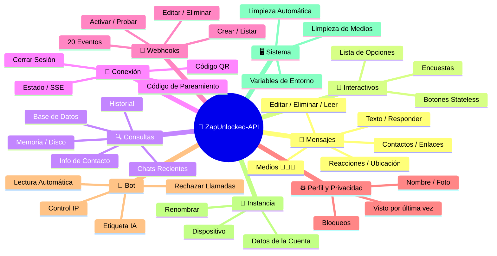
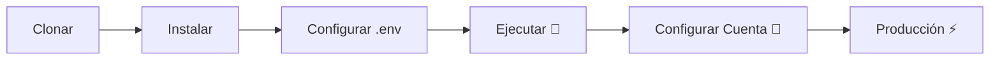

# 🚀 [ZapUnlocked-API](https://zapunlocked-api.kauafpss.com.br) 📲✨


<p align="center">
  
  
  
  
  
</p>

---

### 🌐 Seleccionar Idioma:

<table width="100%">
  <tr>
    <td align="center" valign="middle"><a href="https://github.com/kauafpssx/ZapUnlocked-API/blob/main/README.MD"></a></td>
    <td align="center" valign="middle"><a href="https://github.com/kauafpssx/ZapUnlocked-API/blob/main/docs/translations/en.md"></a></td>
    <td align="center" valign="middle"><a href="https://github.com/kauafpssx/ZapUnlocked-API/blob/main/docs/translations/fr.md"></a></td>
    <td align="center" valign="middle"><a href="https://github.com/kauafpssx/ZapUnlocked-API/blob/main/docs/translations/de.md"></a></td>
    <td align="center" valign="middle"><a href="https://github.com/kauafpssx/ZapUnlocked-API/blob/main/docs/translations/zh.md"></a></td>
    <td align="center" valign="middle"><a href="https://github.com/kauafpssx/ZapUnlocked-API/blob/main/docs/translations/ja.md"></a></td>
    <td align="center" valign="middle"><a href="https://github.com/kauafpssx/ZapUnlocked-API/blob/main/docs/translations/ru.md"></a></td>
    <td align="center" valign="middle"><a href="https://github.com/kauafpssx/ZapUnlocked-API/blob/main/docs/translations/it.md"></a></td>
    <td align="center" valign="middle"><a href="https://github.com/kauafpssx/ZapUnlocked-API/blob/main/docs/translations/ar.md"></a></td>
    <td align="center" valign="middle"><a href="https://github.com/kauafpssx/ZapUnlocked-API/blob/main/docs/translations/tr.md"></a></td>
    <td align="center" valign="middle"><a href="https://github.com/kauafpssx/ZapUnlocked-API/blob/main/docs/translations/ko.md"></a></td>
    <td align="center" valign="middle"><a href="https://github.com/kauafpssx/ZapUnlocked-API/blob/main/docs/translations/hi.md"></a></td>
    <td align="center" valign="middle"><a href="https://github.com/kauafpssx/ZapUnlocked-API/blob/main/docs/translations/nl.md"></a></td>
  </tr>
</table>

---

##  ¿Qué es ZapUnlocked-API?

El mercado de APIs para WhatsApp cobra mensualidades abusivas: decenas a cientos de reales por mes, con límites de uso, tarifas por conversación y datos que pasan por servidores de terceros. **ZapUnlocked-API existe para cambiar eso.**

Construida en **Python** con **[Neonize](https://github.com/krypton-byte/neonize)** como motor de conexión, esta API ofrece una interfaz REST simple (FastAPI) para gestionar sesiones, enviar medios complejos y crear interacciones inteligentes. **Sin base de datos pesada, sin mensualidad, sin depender de nadie.**

Nuestra propuesta se fundamenta en la **excelencia técnica** y la **independencia del desarrollador**. Creemos que las herramientas poderosas deben ser accesibles para quienes construyen sus propias soluciones.

> [!TIP]
> Perfecto para desarrolladores que buscan agilidad en la integración de bots, notificaciones y sistemas de atención automatizados. **Sin pagar nada por ello.**

---

## 🗺️ Visión General de la API



---

## ✨ Funcionalidades Destacadas

| Funcionalidad | Descripción |
| :------------ | :---------- |
| 🧩 **Botones Stateless** | Crea flujos interactivos sin base de datos, con webhooks cifrados |
| 🔢 **Pareamiento sin QR** | Conecta mediante código numérico · ideal para servidores sin GUI |
| 🎵 **Conversión Automática de Audio** | Envía audios que aparecen como grabados al momento (PTT) nativamente |
| 📦 **Cola de Medios Inteligente** | Gestión automática para evitar consumo excesivo de memoria |
| 🏷️ **Placeholders Dinámicos** | Personaliza mensajes y webhooks con `{{name}}`, `{{day}}`, `{{phone}}` |

> [!NOTE]
> Todas las funcionalidades son **100% gratuitas** y mantenidas por la comunidad open-source.

---

## 📋 Rutas de la API

<details>
<summary><b>📨 Envío de Mensajes</b> · 14 endpoints</summary>

| Método | Ruta | Descripción |
| :----- | :--- | :---------- |
| `POST` | `/send` | Enviar mensaje de texto / responder |
| `POST` | `/send_image` | Enviar imagen |
| `POST` | `/send_video` | Enviar vídeo (soporta GIF y PTV) |
| `POST` | `/send_audio` | Enviar audio (con conversión automática a PTT) |
| `POST` | `/send_document` | Enviar documento |
| `POST` | `/send_sticker` | Enviar sticker |
| `POST` | `/send_reaction` | Enviar reacción con emoji |
| `POST` | `/send_location` | Enviar ubicación |
| `POST` | `/send_contact` | Enviar contacto |
| `POST` | `/send_contacts` | Enviar múltiples contactos |
| `POST` | `/send_link` | Enviar enlace con vista previa |
| `POST` | `/messages/delete` | Eliminar mensaje |
| `POST` | `/messages/read` | Marcar como leído |
| `POST` | `/messages/edit` | Editar mensaje enviado |
</details>

<details>
<summary><b>🔘 Mensajes Interactivos</b> · 4 endpoints</summary>

| Método | Ruta | Descripción |
| :----- | :--- | :---------- |
| `POST` | `/send_wbuttons` | Enviar botones (lista, acción, OTP, PIX) |
| `POST` | `/messages/send-option-list` | Enviar lista de opciones |
| `POST` | `/messages/send-poll` | Enviar encuesta |
| `POST` | `/messages/send-poll-vote` | Votar en encuesta |
</details>

<details>
<summary><b>🔍 Consultas y Gestión</b> · 7 endpoints</summary>

| Método | Ruta | Descripción |
| :----- | :--- | :---------- |
| `POST` | `/contacts/info` | Información detallada del contacto |
| `POST` | `/management/fetch_messages` | Buscar historial de mensajes |
| `POST` | `/management/recent_contacts` | Listar chats recientes |
| `GET` | `/management/memory` | Estado del uso de memoria |
| `GET` | `/management/volume_stats` | Verificar uso de disco |
| `GET` | `/management/database/status` | Estado y estadísticas de la BD |
| `POST` | `/management/database/cleanup` | Limpieza manual de la BD |
</details>

<details>
<summary><b>🔗 Conexión y Sesión</b> · 8 endpoints</summary>

| Método | Ruta | Descripción |
| :----- | :--- | :---------- |
| `GET` | `/` | Página de bienvenida (HTML) |
| `GET` | `/status` | Estado de la conexión y sesión |
| `GET` | `/status/stream` | Estado en tiempo real (SSE) |
| `GET` | `/qr` | Ver código QR interactivo |
| `GET` | `/qr/image` | Obtener imagen del código QR (Base64) |
| `POST` | `/qr/pair` | Generar código de pareamiento numérico |
| `GET` | `/settings/phone-code/{phone}` | Generar código por número |
| `POST` | `/qr/logout` | Desconectar y reiniciar sesión |
</details>

<details>
<summary><b>📡 Webhooks (CRUD)</b> · 7 endpoints</summary>

| Método | Ruta | Descripción |
| :----- | :--- | :---------- |
| `POST` | `/webhooks` | Crear webhook nombrado |
| `GET` | `/webhooks` | Listar todos los webhooks |
| `PUT` | `/webhooks/{name}` | Editar webhook |
| `DELETE` | `/webhooks/{name}` | Eliminar webhook |
| `POST` | `/webhooks/{name}/toggle` | Activar / desactivar |
| `POST` | `/webhooks/{name}/test` | Probar webhook |
| `GET` | `/webhooks/events` | Listar tipos de eventos (20 tipos) |
</details>

<details>
<summary><b>⚙️ Perfil y Privacidad</b> · 3 endpoints</summary>

| Método | Ruta | Descripción |
| :----- | :--- | :---------- |
| `POST` | `/settings/profile` | Cambiar nombre y foto del bot |
| `POST` | `/settings/privacy` | Ajustar privacidad (visto por última vez, etc.) |
| `POST` | `/settings/block` | Bloquear / desbloquear contacto |
</details>

<details>
<summary><b>🤖 Configuración del Bot</b> · 5 endpoints</summary>

| Método | Ruta | Descripción |
| :----- | :--- | :---------- |
| `GET` | `/settings/bot` | Ver configuración del bot |
| `POST` | `/settings/bot` | Actualizar configuración (etiqueta IA, control IP) |
| `PUT` | `/settings/instance/call-reject-auto` | Rechazar llamadas automáticamente |
| `PUT` | `/settings/instance/call-reject-message` | Mensaje de llamada rechazada |
| `PUT` | `/settings/instance/auto-read-message` | Lectura automática de mensajes |
</details>

<details>
<summary><b>📱 Instancia</b> · 3 endpoints</summary>

| Método | Ruta | Descripción |
| :----- | :--- | :---------- |
| `GET` | `/instance/me` | Datos de la cuenta conectada |
| `GET` | `/instance/device` | Datos técnicos del dispositivo |
| `PUT` | `/instance/update-name` | Renombrar instancia |
</details>

<details>
<summary><b>🖥️ Sistema</b> · 5 endpoints</summary>

| Método | Ruta | Descripción |
| :----- | :--- | :---------- |
| `GET` | `/system/env` | Ver variables de entorno |
| `PUT` | `/system/env` | Actualizar variables de entorno |
| `POST` | `/system/cleanup/force` | Limpieza forzada de medios temporales |
| `GET` | `/system/cleanup/settings` | Ver configuración de limpieza automática |
| `PUT` | `/system/cleanup/settings` | Actualizar intervalo de limpieza automática |
</details>

> **Total: 56 endpoints** · REST completos para automatización de WhatsApp.

---

## 📡 Eventos de Webhook

Todos los webhooks reciben un sobre estándar:

```json
{
  "event": "message.text",
  "timestamp": "2025-01-01T12:00:00Z",
  "data": { ... }
}
```

Si el webhook tiene un `body` personalizado con `{{placeholders}}`, ese body se envía en lugar del sobre estándar.

### Placeholders (body personalizado)

| Placeholder | Valor |
| :---------- | :---- |
| `{{from}}` | Número del remitente |
| `{{text}}` | Texto del mensaje |
| `{{phone}}` | Igual que `{{from}}` |
| `{{id}}` | ID del mensaje |
| `{{requested}}` | Cantidad solicitada (fetchMessages) |
| `{{found}}` | Cantidad encontrada (fetchMessages) |
| `{{timestamp}}` | Timestamp UTC actual |
| `{{day}}` | Día actual (dd) |
| `{{mon}}` | Mes actual (MM) |
| `{{yea}}` | Año actual (yyyy) |
| `{{hou}}` | Hora actual (HH) |
| `{{min}}` | Minuto actual (mm) |
| `{{sec}}` | Segundo actual (ss) |

<details>
<summary><b>📥 Mensajes Recibidos</b> · 15 eventos</summary>

Campos base presentes en eventos de mensaje recibido:

```json
{
  "messageId": "3EB0ABCDEF123456",
  "from": "5511999999999",
  "fromName": "João Silva",
  "fromJid": "5511999999999@s.whatsapp.net",
  "isGroup": false
}
```

<details>
<summary><code>message.text</code> - Texto simple / formateado</summary>

```json
{
  "event": "message.text",
  "data": {
    "...base": "...",
    "text": "Olá! Como posso ajudar?",
    "quoted": { "id": "3EB0...", "fromMe": true }
  }
}
```
</details>

<details>
<summary><code>message.image</code> - Imagen recibida</summary>

```json
{
  "event": "message.image",
  "data": {
    "...base": "...",
    "caption": "Foto do produto",
    "mimetype": "image/jpeg",
    "fileLength": 204800
  }
}
```
</details>

<details>
<summary><code>message.video</code> - Video recibido</summary>

```json
{
  "event": "message.video",
  "data": {
    "...base": "...",
    "caption": "Veja esse vídeo!",
    "mimetype": "video/mp4",
    "fileLength": 5242880,
    "isPTT": false,
    "isGif": false
  }
}
```
</details>

<details>
<summary><code>message.audio</code> - Audio / nota de voz</summary>

```json
{
  "event": "message.audio",
  "data": {
    "...base": "...",
    "mimetype": "audio/ogg; codecs=opus",
    "fileLength": 30720,
    "isPTT": true,
    "durationSeconds": 8
  }
}
```
</details>

<details>
<summary><code>message.document</code> - Documento / archivo</summary>

```json
{
  "event": "message.document",
  "data": {
    "...base": "...",
    "fileName": "contrato.pdf",
    "caption": "Segue o contrato",
    "mimetype": "application/pdf",
    "fileLength": 102400
  }
}
```
</details>

<details>
<summary><code>message.sticker</code> - Sticker / figurita</summary>

```json
{
  "event": "message.sticker",
  "data": {
    "...base": "...",
    "mimetype": "image/webp",
    "isAnimated": false
  }
}
```
</details>

<details>
<summary><code>message.contact</code> - Contacto compartido</summary>

```json
{
  "event": "message.contact",
  "data": {
    "...base": "...",
    "displayName": "Maria Souza",
    "vcard": "BEGIN:VCARD\nVERSION:3.0\n..."
  }
}
```
</details>

<details>
<summary><code>message.location</code> - Ubicación</summary>

```json
{
  "event": "message.location",
  "data": {
    "...base": "...",
    "lat": -23.5505,
    "lng": -46.6333,
    "name": "Av. Paulista",
    "address": "Av. Paulista, 1000 - São Paulo"
  }
}
```
</details>

<details>
<summary><code>message.reaction</code> - Reacción (emoji)</summary>

```json
{
  "event": "message.reaction",
  "data": {
    "...base": "...",
    "emoji": "❤️",
    "targetMessageId": "3EB0ABCDEF123456",
    "isRemoved": false
  }
}
```
</details>

<details>
<summary><code>message.poll_created</code> - Encuesta recibida</summary>

```json
{
  "event": "message.poll_created",
  "data": {
    "...base": "...",
    "pollName": "Qual o melhor sabor?",
    "options": ["Chocolate", "Morango", "Baunilha"]
  }
}
```
</details>

<details>
<summary><code>message.poll_vote</code> - Voto en encuesta</summary>

```json
{
  "event": "message.poll_vote",
  "data": {
    "...base": "...",
    "pollId": "3EB0ABCDEF123456",
    "selectedOptions": ["Chocolate"]
  }
}
```
</details>

<details>
<summary><code>message.button_reply</code> - Click en botón</summary>

```json
{
  "event": "message.button_reply",
  "data": {
    "...base": "...",
    "buttonId": "opcao_sim",
    "displayText": "Sim",
    "type": "quick_reply"
  }
}
```
</details>

<details>
<summary><code>message.list_reply</code> - Selección en lista interactiva</summary>

```json
{
  "event": "message.list_reply",
  "data": {
    "...base": "...",
    "rowId": "1",
    "title": "X-Burguer",
    "description": "R$ 18,90"
  }
}
```
</details>

<details>
<summary><code>message.deleted</code> - Mensaje eliminado por el remitente</summary>

```json
{
  "event": "message.deleted",
  "data": {
    "...base": "..."
  }
}
```
</details>

<details>
<summary><code>message.unknown</code> - Tipo no mapeado</summary>

```json
{
  "event": "message.unknown",
  "data": {
    "...base": "...",
    "rawType": "senderKeyDistributionMessage"
  }
}
```
</details>

</details>

<details>
<summary><b>📤 Mensajes Enviados</b> · 1 evento</summary>

<details>
<summary><code>message.sent</code> - Mensaje enviado (manual)</summary>

```json
{
  "event": "message.sent",
  "data": {
    "to": "5511999999999",
    "type": "text",
    "messageId": "3EB0ABCDEF123456"
  }
}
```
</details>

</details>

<details>
<summary><b>🔗 Conexión</b> · 3 eventos</summary>

<details>
<summary><code>connection.connected</code> - WhatsApp conectado</summary>

```json
{
  "event": "connection.connected",
  "data": {
    "phone": "5511999999999"
  }
}
```
</details>

<details>
<summary><code>connection.disconnected</code> - WhatsApp desconectado</summary>

```json
{
  "event": "connection.disconnected",
  "data": {}
}
```
</details>

<details>
<summary><code>connection.qr_ready</code> - Código QR generado</summary>

```json
{
  "event": "connection.qr_ready",
  "data": {
    "qr": "2@abc123..."
  }
}
```
</details>

</details>

<details>
<summary><b>📞 Llamada</b> · 1 evento</summary>

<details>
<summary><code>call.received</code> - Llamada recibida</summary>

```json
{
  "event": "call.received",
  "data": {
    "from": "5511999999999",
    "fromJid": "5511999999999@s.whatsapp.net",
    "callId": "ABC123DEF456"
  }
}
```
</details>

</details>

---

## 🛠️ Instalación y Alojamiento

> Pon tu API profesional de WhatsApp en funcionamiento en menos de **5 minutos** con **ZapUnlocked-API**.

### 💻 Instalación Local

Ideal para desarrollo, pruebas o ejecutar en tu propio servidor.



**1. Clonar el Repositorio**

```bash
git clone https://github.com/kauafpssx/ZapUnlocked-API.git
cd ZapUnlocked-API
```

**2. Instalar las Dependencias**

| Sistema | Comando |
| :------ | :------ |
| 🪟 Windows | `scripts\install\install.bat` |
| 🐧 Linux / macOS | `bash scripts/install/install.sh` |

**3. Configurar el Entorno**

| Sistema | Comando |
| :------ | :------ |
| 🪟 Windows | `scripts\generate-env\generate-env.bat` |
| 🐧 Linux / macOS | `bash scripts/generate-env/generate-env.sh` |

| Variable | Descripción |
| :------- | :---------- |
| `API_KEY` | Contraseña para autenticación en todos los endpoints |
| `INTERNAL_SECRET` | Token para validar firmas de webhook |
| `PORT` | Puerto de la API (predeterminado: `8300`) |

**4. Ejecutar la API**

| Sistema | Comando |
| :------ | :------ |
| 🪟 Windows | `scripts\run\run.bat` |
| 🐧 Linux / macOS | `bash scripts/run/run.sh` |

---

### ☁️ Alojamiento: Alwaysdata (Gratis 24/7)

**Alwaysdata** es la opción recomendada para alojar la API de forma estable y gratuita sin necesidad de mantener un servidor encendido.

#### 📊 Recursos del Plan Free

| Recurso | Disponible en Free |
| :------ | :----------------- |
| 💾 Almacenamiento | **1 GB SSD** |
| 🧠 RAM | **256 MB** |
| ⚡ CPU | **1/4 vCPU** |
| 🔄 Copia de seguridad | **3 días** automática |
| 📡 Uptime | **24/7** vía Services |

#### 👣 Paso a Paso para el Deploy

**1.** Crea tu cuenta en [Alwaysdata.com](https://www.alwaysdata.com/) · plan **Free**.

**2.** Accede al SSH en `https://ssh-[usuario].alwaysdata.net`.

**3.** Clona e instala:

```bash
git clone https://github.com/kauafpssx/ZapUnlocked-API.git ~/ZapUnlocked-API
cd ~/ZapUnlocked-API
bash scripts/install/install.sh
```

**4.** Genera el `.env`:

```bash
bash scripts/generate-env/generate-env.sh
```

**5.** Configura el Servicio (24/7) en **Advanced › Services › Add a service**:

| Campo | Valor |
| :---- | :---- |
| **Name** | `ZapUnlocked-API` |
| **Command** | `python3 main.py` |
| **Working directory** | `ZapUnlocked-API` |
| **Environment variables** | `PORT=8300` |

**6.** Accede vía:

```
http://services-[usuario].alwaysdata.net:8300/
```

> [!TIP]
> La URL ya es accesible externamente. *(Opcional)* Para usar un dominio personalizado, configura un **Reverse Proxy** en **Web › Sites › Add a site** apuntando a `http://[usuario].alwaysdata.net`.

---

## 🔐 Autenticación (Inicio de Sesión)

Después del deploy, conecta tu cuenta de WhatsApp accediendo en el navegador:

```text
http://services-[usuario].alwaysdata.net:8300/qr?API_KEY=TU_CLAVE_SECRETA
```

---

## 📖 Documentación Oficial

<p align="center">
  👉 <a href="https://zapunlocked-api.kauafpss.com.br"><strong>zapunlocked-api.kauafpss.com.br</strong></a>
</p>

Para documentación técnica detallada, ejemplos de código y playground interactivo, visita nuestro sitio web oficial.

> [!TIP]
> Usa el **LLMs.txt** como índice para IA: [`zapunlocked-api.kauafpss.com.br/llms.txt`](https://zapunlocked-api.kauafpss.com.br/llms.txt). Descubre todas las páginas antes de explorar.

---

## ❤️ Créditos y Agradecimientos

| Proyecto | Descripción |
| :------- | :---------- |
| [](https://github.com/krypton-byte/neonize) | Biblioteca Python para conexión nativa con WhatsApp Web |
| [](https://github.com/tulir/whatsmeow) | Biblioteca Go base de Neonize · el corazón de la conexión |
| [](https://www.alwaysdata.com/) | Infraestructura gratuita de alta calidad |

---

## 📄 Licencia

Este proyecto está licenciado bajo la **Licencia MIT**.

<p align="center">
  Hecho con 💜 por <a href="https://www.instagram.com/kauafpss_/">Kauã Ferreira</a>
</p>