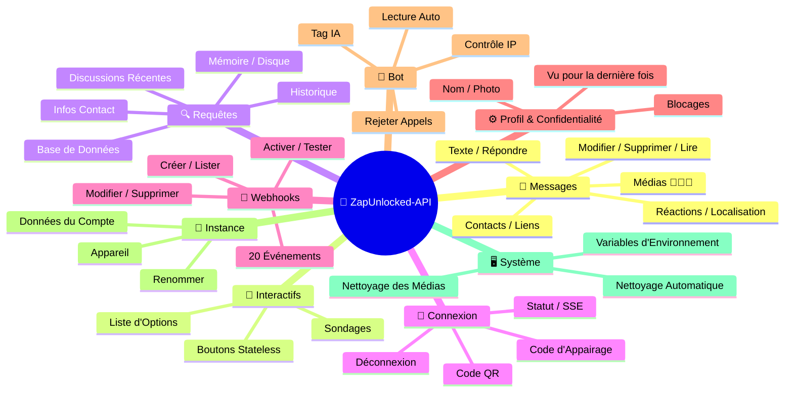
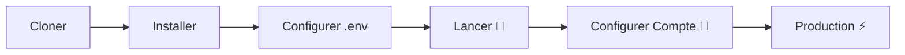

# 🚀 [ZapUnlocked-API](https://zapunlocked-api.kauafpss.com.br) 📲✨


<p align="center">
  
  
  
  
  
</p>

---

### 🌐 Sélectionner la Langue :

<table width="100%">
  <tr>
    <td align="center" valign="middle"><a href="https://github.com/kauafpssx/ZapUnlocked-API/blob/main/README.MD"></a></td>
    <td align="center" valign="middle"><a href="https://github.com/kauafpssx/ZapUnlocked-API/blob/main/docs/translations/en.md"></a></td>
    <td align="center" valign="middle"><a href="https://github.com/kauafpssx/ZapUnlocked-API/blob/main/docs/translations/es.md"></a></td>
    <td align="center" valign="middle"><a href="https://github.com/kauafpssx/ZapUnlocked-API/blob/main/docs/translations/de.md"></a></td>
    <td align="center" valign="middle"><a href="https://github.com/kauafpssx/ZapUnlocked-API/blob/main/docs/translations/zh.md"></a></td>
    <td align="center" valign="middle"><a href="https://github.com/kauafpssx/ZapUnlocked-API/blob/main/docs/translations/ja.md"></a></td>
    <td align="center" valign="middle"><a href="https://github.com/kauafpssx/ZapUnlocked-API/blob/main/docs/translations/ru.md"></a></td>
    <td align="center" valign="middle"><a href="https://github.com/kauafpssx/ZapUnlocked-API/blob/main/docs/translations/it.md"></a></td>
    <td align="center" valign="middle"><a href="https://github.com/kauafpssx/ZapUnlocked-API/blob/main/docs/translations/ar.md"></a></td>
    <td align="center" valign="middle"><a href="https://github.com/kauafpssx/ZapUnlocked-API/blob/main/docs/translations/tr.md"></a></td>
    <td align="center" valign="middle"><a href="https://github.com/kauafpssx/ZapUnlocked-API/blob/main/docs/translations/ko.md"></a></td>
    <td align="center" valign="middle"><a href="https://github.com/kauafpssx/ZapUnlocked-API/blob/main/docs/translations/hi.md"></a></td>
    <td align="center" valign="middle"><a href="https://github.com/kauafpssx/ZapUnlocked-API/blob/main/docs/translations/nl.md"></a></td>
  </tr>
</table>

---

##  Qu'est-ce que ZapUnlocked-API ?

Le marché des API WhatsApp facture des abonnements abusifs : des dizaines à des centaines de reais par mois, avec des limites d'utilisation, des frais par conversation et des données qui transitent par des serveurs tiers. **ZapUnlocked-API existe pour changer cela.**

Construite en **Python** avec **[Neonize](https://github.com/krypton-byte/neonize)** comme moteur de connexion, cette API offre une interface REST simple (FastAPI) pour gérer les sessions, envoyer des médias complexes et créer des interactions intelligentes. **Sans base de données lourde, sans abonnement, sans dépendre de personne.**

Notre proposition est fondée sur l'**excellence technique** et l'**indépendance du développeur**. Nous croyons que les outils puissants doivent être accessibles à ceux qui construisent leurs propres solutions.

> [!TIP]
> Parfait pour les développeurs cherchant de l'agilité dans l'intégration de bots, notifications et systèmes de service client automatisés. **Sans rien payer pour cela.**

---

## 🗺️ Aperçu de l'API



---

## ✨ Fonctionnalités Phares

| Fonctionnalité | Description |
| :------------- | :---------- |
| 🧩 **Boutons Stateless** | Créez des flux interactifs sans base de données, avec webhooks chiffrés |
| 🔢 **Appairage sans QR** | Connectez-vous via code numérique · idéal pour les serveurs sans GUI |
| 🎵 **Conversion Audio Automatique** | Envoyez des audios qui apparaissent comme enregistrés sur le moment (PTT) |
| 📦 **File d'Attente Intelligente** | Gestion automatique pour éviter une consommation mémoire excessive |
| 🏷️ **Placeholders Dynamiques** | Personnalisez messages et webhooks avec `{{name}}`, `{{day}}`, `{{phone}}` |

> [!NOTE]
> Toutes les fonctionnalités sont **100% gratuites** et maintenues par la communauté open-source.

---

## 📋 Routes de l'API

<details>
<summary><b>📨 Envoi de Messages</b> · 14 endpoints</summary>

| Méthode | Route | Description |
| :------ | :---- | :---------- |
| `POST` | `/send` | Envoyer un message texte / répondre |
| `POST` | `/send_image` | Envoyer une image |
| `POST` | `/send_video` | Envoyer une vidéo (prend en charge GIF et PTV) |
| `POST` | `/send_audio` | Envoyer un audio (avec conversion automatique en PTT) |
| `POST` | `/send_document` | Envoyer un document |
| `POST` | `/send_sticker` | Envoyer un sticker |
| `POST` | `/send_reaction` | Envoyer une réaction avec emoji |
| `POST` | `/send_location` | Envoyer une localisation |
| `POST` | `/send_contact` | Envoyer un contact |
| `POST` | `/send_contacts` | Envoyer plusieurs contacts |
| `POST` | `/send_link` | Envoyer un lien avec aperçu |
| `POST` | `/messages/delete` | Supprimer un message |
| `POST` | `/messages/read` | Marquer comme lu |
| `POST` | `/messages/edit` | Modifier un message envoyé |
</details>

<details>
<summary><b>🔘 Messages Interactifs</b> · 4 endpoints</summary>

| Méthode | Route | Description |
| :------ | :---- | :---------- |
| `POST` | `/send_wbuttons` | Envoyer des boutons (liste, action, OTP, PIX) |
| `POST` | `/messages/send-option-list` | Envoyer une liste d'options |
| `POST` | `/messages/send-poll` | Envoyer un sondage |
| `POST` | `/messages/send-poll-vote` | Voter dans un sondage |
</details>

<details>
<summary><b>🔍 Requêtes et Gestion</b> · 7 endpoints</summary>

| Méthode | Route | Description |
| :------ | :---- | :---------- |
| `POST` | `/contacts/info` | Informations détaillées du contact |
| `POST` | `/management/fetch_messages` | Rechercher l'historique des messages |
| `POST` | `/management/recent_contacts` | Lister les discussions récentes |
| `GET` | `/management/memory` | État d'utilisation de la mémoire |
| `GET` | `/management/volume_stats` | Vérifier l'utilisation du disque |
| `GET` | `/management/database/status` | État et statistiques de la BD |
| `POST` | `/management/database/cleanup` | Nettoyage manuel de la BD |
</details>

<details>
<summary><b>🔗 Connexion et Session</b> · 8 endpoints</summary>

| Méthode | Route | Description |
| :------ | :---- | :---------- |
| `GET` | `/` | Page d'accueil (HTML) |
| `GET` | `/status` | État de la connexion et de la session |
| `GET` | `/status/stream` | État en temps réel (SSE) |
| `GET` | `/qr` | Voir le code QR interactif |
| `GET` | `/qr/image` | Obtenir l'image du code QR (Base64) |
| `POST` | `/qr/pair` | Générer un code d'appairage numérique |
| `GET` | `/settings/phone-code/{phone}` | Générer un code par numéro |
| `POST` | `/qr/logout` | Déconnecter et réinitialiser la session |
</details>

<details>
<summary><b>📡 Webhooks (CRUD)</b> · 7 endpoints</summary>

| Méthode | Route | Description |
| :------ | :---- | :---------- |
| `POST` | `/webhooks` | Créer un webhook nommé |
| `GET` | `/webhooks` | Lister tous les webhooks |
| `PUT` | `/webhooks/{name}` | Modifier un webhook |
| `DELETE` | `/webhooks/{name}` | Supprimer un webhook |
| `POST` | `/webhooks/{name}/toggle` | Activer / désactiver |
| `POST` | `/webhooks/{name}/test` | Tester un webhook |
| `GET` | `/webhooks/events` | Lister les types d'événements (20 types) |
</details>

<details>
<summary><b>⚙️ Profil et Confidentialité</b> · 3 endpoints</summary>

| Méthode | Route | Description |
| :------ | :---- | :---------- |
| `POST` | `/settings/profile` | Changer le nom et la photo du bot |
| `POST` | `/settings/privacy` | Ajuster la confidentialité (vu pour la dernière fois, etc.) |
| `POST` | `/settings/block` | Bloquer / débloquer un contact |
</details>

<details>
<summary><b>🤖 Configuration du Bot</b> · 5 endpoints</summary>

| Méthode | Route | Description |
| :------ | :---- | :---------- |
| `GET` | `/settings/bot` | Voir la configuration du bot |
| `POST` | `/settings/bot` | Mettre à jour la configuration (tag IA, contrôle IP) |
| `PUT` | `/settings/instance/call-reject-auto` | Rejeter les appels automatiquement |
| `PUT` | `/settings/instance/call-reject-message` | Message d'appel rejeté |
| `PUT` | `/settings/instance/auto-read-message` | Lecture automatique des messages |
</details>

<details>
<summary><b>📱 Instance</b> · 3 endpoints</summary>

| Méthode | Route | Description |
| :------ | :---- | :---------- |
| `GET` | `/instance/me` | Données du compte connecté |
| `GET` | `/instance/device` | Données techniques de l'appareil |
| `PUT` | `/instance/update-name` | Renommer l'instance |
</details>

<details>
<summary><b>🖥️ Système</b> · 5 endpoints</summary>

| Méthode | Route | Description |
| :------ | :---- | :---------- |
| `GET` | `/system/env` | Voir les variables d'environnement |
| `PUT` | `/system/env` | Mettre à jour les variables d'environnement |
| `POST` | `/system/cleanup/force` | Nettoyage forcé des médias temporaires |
| `GET` | `/system/cleanup/settings` | Voir la configuration du nettoyage automatique |
| `PUT` | `/system/cleanup/settings` | Mettre à jour l'intervalle de nettoyage automatique |
</details>

> **Total : 56 endpoints** · REST complets pour l'automatisation WhatsApp.

---

## 📡 Événements Webhook

Tous les webhooks reçoivent une enveloppe standard :

```json
{
  "event": "message.text",
  "timestamp": "2025-01-01T12:00:00Z",
  "data": { ... }
}
```

Si le webhook a un `body` personnalisé avec `{{placeholders}}`, ce body est envoyé à la place de l'enveloppe standard.

### Placeholders (body personnalisé)

| Placeholder | Valeur |
| :---------- | :----- |
| `{{from}}` | Numéro de l'expéditeur |
| `{{text}}` | Texte du message |
| `{{phone}}` | Identique à `{{from}}` |
| `{{id}}` | ID du message |
| `{{requested}}` | Quantité demandée (fetchMessages) |
| `{{found}}` | Quantité trouvée (fetchMessages) |
| `{{timestamp}}` | Timestamp UTC actuel |
| `{{day}}` | Jour actuel (dd) |
| `{{mon}}` | Mois actuel (MM) |
| `{{yea}}` | Année actuelle (yyyy) |
| `{{hou}}` | Heure actuelle (HH) |
| `{{min}}` | Minute actuelle (mm) |
| `{{sec}}` | Seconde actuelle (ss) |

<details>
<summary><b>📥 Messages Reçus</b> · 15 événements</summary>

Champs de base présents dans les événements de message reçu :

```json
{
  "messageId": "3EB0ABCDEF123456",
  "from": "5511999999999",
  "fromName": "João Silva",
  "fromJid": "5511999999999@s.whatsapp.net",
  "isGroup": false
}
```

<details>
<summary><code>message.text</code> - Texte simple / formaté</summary>

```json
{
  "event": "message.text",
  "data": {
    "...base": "...",
    "text": "Olá! Como posso ajudar?",
    "quoted": { "id": "3EB0...", "fromMe": true }
  }
}
```
</details>

<details>
<summary><code>message.image</code> - Image reçue</summary>

```json
{
  "event": "message.image",
  "data": {
    "...base": "...",
    "caption": "Foto do produto",
    "mimetype": "image/jpeg",
    "fileLength": 204800
  }
}
```
</details>

<details>
<summary><code>message.video</code> - Vidéo reçue</summary>

```json
{
  "event": "message.video",
  "data": {
    "...base": "...",
    "caption": "Veja esse vídeo!",
    "mimetype": "video/mp4",
    "fileLength": 5242880,
    "isPTT": false,
    "isGif": false
  }
}
```
</details>

<details>
<summary><code>message.audio</code> - Audio / note vocale</summary>

```json
{
  "event": "message.audio",
  "data": {
    "...base": "...",
    "mimetype": "audio/ogg; codecs=opus",
    "fileLength": 30720,
    "isPTT": true,
    "durationSeconds": 8
  }
}
```
</details>

<details>
<summary><code>message.document</code> - Document / fichier</summary>

```json
{
  "event": "message.document",
  "data": {
    "...base": "...",
    "fileName": "contrato.pdf",
    "caption": "Segue o contrato",
    "mimetype": "application/pdf",
    "fileLength": 102400
  }
}
```
</details>

<details>
<summary><code>message.sticker</code> - Sticker</summary>

```json
{
  "event": "message.sticker",
  "data": {
    "...base": "...",
    "mimetype": "image/webp",
    "isAnimated": false
  }
}
```
</details>

<details>
<summary><code>message.contact</code> - Contact partagé</summary>

```json
{
  "event": "message.contact",
  "data": {
    "...base": "...",
    "displayName": "Maria Souza",
    "vcard": "BEGIN:VCARD\nVERSION:3.0\n..."
  }
}
```
</details>

<details>
<summary><code>message.location</code> - Localisation</summary>

```json
{
  "event": "message.location",
  "data": {
    "...base": "...",
    "lat": -23.5505,
    "lng": -46.6333,
    "name": "Av. Paulista",
    "address": "Av. Paulista, 1000 - São Paulo"
  }
}
```
</details>

<details>
<summary><code>message.reaction</code> - Réaction (emoji)</summary>

```json
{
  "event": "message.reaction",
  "data": {
    "...base": "...",
    "emoji": "❤️",
    "targetMessageId": "3EB0ABCDEF123456",
    "isRemoved": false
  }
}
```
</details>

<details>
<summary><code>message.poll_created</code> - Sondage reçu</summary>

```json
{
  "event": "message.poll_created",
  "data": {
    "...base": "...",
    "pollName": "Qual o melhor sabor?",
    "options": ["Chocolate", "Morango", "Baunilha"]
  }
}
```
</details>

<details>
<summary><code>message.poll_vote</code> - Vote dans un sondage</summary>

```json
{
  "event": "message.poll_vote",
  "data": {
    "...base": "...",
    "pollId": "3EB0ABCDEF123456",
    "selectedOptions": ["Chocolate"]
  }
}
```
</details>

<details>
<summary><code>message.button_reply</code> - Clic sur bouton</summary>

```json
{
  "event": "message.button_reply",
  "data": {
    "...base": "...",
    "buttonId": "opcao_sim",
    "displayText": "Sim",
    "type": "quick_reply"
  }
}
```
</details>

<details>
<summary><code>message.list_reply</code> - Sélection dans liste interactive</summary>

```json
{
  "event": "message.list_reply",
  "data": {
    "...base": "...",
    "rowId": "1",
    "title": "X-Burguer",
    "description": "R$ 18,90"
  }
}
```
</details>

<details>
<summary><code>message.deleted</code> - Message supprimé par l'expéditeur</summary>

```json
{
  "event": "message.deleted",
  "data": {
    "...base": "..."
  }
}
```
</details>

<details>
<summary><code>message.unknown</code> - Type non mappé</summary>

```json
{
  "event": "message.unknown",
  "data": {
    "...base": "...",
    "rawType": "senderKeyDistributionMessage"
  }
}
```
</details>

</details>

<details>
<summary><b>📤 Messages Envoyés</b> · 1 événement</summary>

<details>
<summary><code>message.sent</code> - Message envoyé (manuel)</summary>

```json
{
  "event": "message.sent",
  "data": {
    "to": "5511999999999",
    "type": "text",
    "messageId": "3EB0ABCDEF123456"
  }
}
```
</details>

</details>

<details>
<summary><b>🔗 Connexion</b> · 3 événements</summary>

<details>
<summary><code>connection.connected</code> - WhatsApp connecté</summary>

```json
{
  "event": "connection.connected",
  "data": {
    "phone": "5511999999999"
  }
}
```
</details>

<details>
<summary><code>connection.disconnected</code> - WhatsApp déconnecté</summary>

```json
{
  "event": "connection.disconnected",
  "data": {}
}
```
</details>

<details>
<summary><code>connection.qr_ready</code> - Code QR généré</summary>

```json
{
  "event": "connection.qr_ready",
  "data": {
    "qr": "2@abc123..."
  }
}
```
</details>

</details>

<details>
<summary><b>📞 Appel</b> · 1 événement</summary>

<details>
<summary><code>call.received</code> - Appel reçu</summary>

```json
{
  "event": "call.received",
  "data": {
    "from": "5511999999999",
    "fromJid": "5511999999999@s.whatsapp.net",
    "callId": "ABC123DEF456"
  }
}
```
</details>

</details>

---

## 🛠️ Installation et Hébergement

> Mettez votre API WhatsApp professionnelle en ligne en moins de **5 minutes** avec **ZapUnlocked-API**.

### 💻 Installation Locale

Idéal pour le développement, les tests ou l'exécution sur votre propre serveur.



**1. Cloner le Dépôt**

```bash
git clone https://github.com/kauafpssx/ZapUnlocked-API.git
cd ZapUnlocked-API
```

**2. Installer les Dépendances**

| Système | Commande |
| :------ | :------- |
| 🪟 Windows | `scripts\install\install.bat` |
| 🐧 Linux / macOS | `bash scripts/install/install.sh` |

**3. Configurer l'Environnement**

| Système | Commande |
| :------ | :------- |
| 🪟 Windows | `scripts\generate-env\generate-env.bat` |
| 🐧 Linux / macOS | `bash scripts/generate-env/generate-env.sh` |

| Variable | Description |
| :------- | :---------- |
| `API_KEY` | Mot de passe pour l'authentification sur tous les endpoints |
| `INTERNAL_SECRET` | Jeton pour valider les signatures de webhook |
| `PORT` | Port de l'API (par défaut : `8300`) |

**4. Lancer l'API**

| Système | Commande |
| :------ | :------- |
| 🪟 Windows | `scripts\run\run.bat` |
| 🐧 Linux / macOS | `bash scripts/run/run.sh` |

---

### ☁️ Hébergement : Alwaysdata (Gratuit 24/7)

**Alwaysdata** est l'option recommandée pour héberger l'API de manière stable et gratuite sans avoir à maintenir un serveur allumé.

#### 📊 Ressources du Plan Free

| Ressource | Disponible sur Free |
| :-------- | :------------------ |
| 💾 Stockage | **1 Go SSD** |
| 🧠 RAM | **256 Mo** |
| ⚡ CPU | **1/4 vCPU** |
| 🔄 Sauvegarde | **3 jours** automatique |
| 📡 Uptime | **24/7** via Services |

#### 👣 Étapes de Déploiement

**1.** Créez votre compte sur [Alwaysdata.com](https://www.alwaysdata.com/) · plan **Free**.

**2.** Accédez au SSH via `https://ssh-[utilisateur].alwaysdata.net`.

**3.** Clonez et installez :

```bash
git clone https://github.com/kauafpssx/ZapUnlocked-API.git ~/ZapUnlocked-API
cd ~/ZapUnlocked-API
bash scripts/install/install.sh
```

**4.** Générez le `.env` :

```bash
bash scripts/generate-env/generate-env.sh
```

**5.** Configurez le Service (24/7) dans **Advanced › Services › Add a service** :

| Champ | Valeur |
| :---- | :----- |
| **Name** | `ZapUnlocked-API` |
| **Command** | `python3 main.py` |
| **Working directory** | `ZapUnlocked-API` |
| **Environment variables** | `PORT=8300` |

**6.** Accédez via :

```
http://services-[utilisateur].alwaysdata.net:8300/
```

> [!TIP]
> L'URL est déjà accessible de l'extérieur. *(Optionnel)* Pour utiliser un domaine personnalisé, configurez un **Reverse Proxy** dans **Web › Sites › Add a site** pointant vers `http://[utilisateur].alwaysdata.net`.

---

## 🔐 Authentification (Connexion)

Après le déploiement, connectez votre compte WhatsApp en accédant dans votre navigateur :

```text
http://services-[utilisateur].alwaysdata.net:8300/qr?API_KEY=VOTRE_CLÉ_SECRÈTE
```

---

## 📖 Documentation Officielle

<p align="center">
  👉 <a href="https://zapunlocked-api.kauafpss.com.br"><strong>zapunlocked-api.kauafpss.com.br</strong></a>
</p>

Pour une documentation technique détaillée, des exemples de code et un playground interactif, visitez notre site web officiel.

> [!TIP]
> Utilisez le **LLMs.txt** comme index pour l'IA : [`zapunlocked-api.kauafpss.com.br/llms.txt`](https://zapunlocked-api.kauafpss.com.br/llms.txt). Découvrez toutes les pages avant d'explorer.

---

## ❤️ Crédits et Remerciements

| Projet | Description |
| :----- | :---------- |
| [](https://github.com/krypton-byte/neonize) | Bibliothèque Python pour connexion native WhatsApp Web |
| [](https://github.com/tulir/whatsmeow) | Bibliothèque Go de base de Neonize · le coeur de la connexion |
| [](https://www.alwaysdata.com/) | Infrastructure gratuite de haute qualité |

---

## 📄 Licence

Ce projet est sous licence **MIT**.

<p align="center">
  Fait avec 💜 par <a href="https://www.instagram.com/kauafpss_/">Kauã Ferreira</a>
</p>