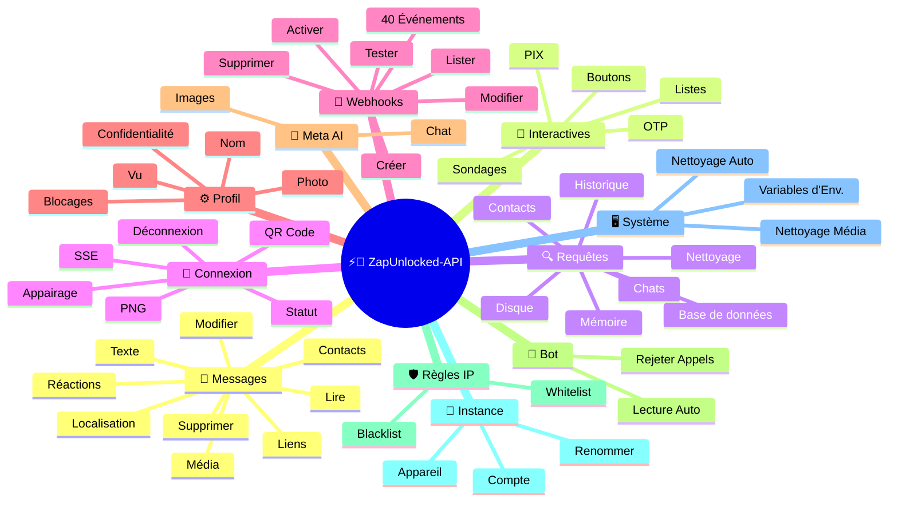
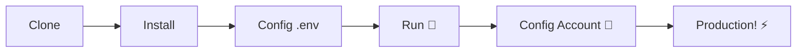

# ⚡💬 [ZapUnlocked-API](https://zapunlocked-api.kauafpss.com.br/)


<p align="center">
  
  <a href="https://downgit.github.io/#/home?url=https://github.com/kauafpssx/ZapUnlocked-API/blob/main/ZapUnlocked.collection.json">
    
  </a>
  
  
  
</p>

---

### 🌐 Sélectionner la langue :

<table width="100%">
  <tr>
    <td align="center" valign="middle"><a href="https://github.com/kauafpssx/ZapUnlocked-API/blob/main/README.md"></a></td>
    <td align="center" valign="middle"><a href="https://github.com/kauafpssx/ZapUnlocked-API/blob/main/docs/translations/en.md"></a></td>
    <td align="center" valign="middle"><a href="https://github.com/kauafpssx/ZapUnlocked-API/blob/main/docs/translations/es.md"></a></td>
    <td align="center" valign="middle"><a href="https://github.com/kauafpssx/ZapUnlocked-API/blob/main/docs/translations/fr.md"></a></td>
    <td align="center" valign="middle"><a href="https://github.com/kauafpssx/ZapUnlocked-API/blob/main/docs/translations/de.md"></a></td>
    <td align="center" valign="middle"><a href="https://github.com/kauafpssx/ZapUnlocked-API/blob/main/docs/translations/zh.md"></a></td>
    <td align="center" valign="middle"><a href="https://github.com/kauafpssx/ZapUnlocked-API/blob/main/docs/translations/ja.md"></a></td>
    <td align="center" valign="middle"><a href="https://github.com/kauafpssx/ZapUnlocked-API/blob/main/docs/translations/ru.md"></a></td>
    <td align="center" valign="middle"><a href="https://github.com/kauafpssx/ZapUnlocked-API/blob/main/docs/translations/it.md"></a></td>
    <td align="center" valign="middle"><a href="https://github.com/kauafpssx/ZapUnlocked-API/blob/main/docs/translations/ar.md"></a></td>
    <td align="center" valign="middle"><a href="https://github.com/kauafpssx/ZapUnlocked-API/blob/main/docs/translations/tr.md"></a></td>
    <td align="center" valign="middle"><a href="https://github.com/kauafpssx/ZapUnlocked-API/blob/main/docs/translations/ko.md"></a></td>
    <td align="center" valign="middle"><a href="https://github.com/kauafpssx/ZapUnlocked-API/blob/main/docs/translations/hi.md"></a></td>
    <td align="center" valign="middle"><a href="https://github.com/kauafpssx/ZapUnlocked-API/blob/main/docs/translations/nl.md"></a></td>
  </tr>
</table>

---

##  Qu'est-ce que ZapUnlocked-API ?

Les API WhatsApp facturent des abonnements abusifs : des dizaines à des centaines de reais par mois, avec limites d'utilisation, frais par conversation et données qui transitent par des serveurs tiers. **ZapUnlocked-API est gratuit et open-source.**

Construite en **Python** avec **[Neonize](https://github.com/krypton-byte/neonize)** comme moteur de connexion, l'API utilise FastAPI pour gérer les sessions, envoyer des médias et créer des bots. Sans base de données lourde, sans abonnement mensuel, sans serveur tiers.

> [!TIP]
> Utilisez pour bots, notifications et systèmes de service client. **100% gratuit.**

> [!IMPORTANT]
> 🤖 **Meta AI intégré.** Utilisez `/ai/ask` pour discuter et `/ai/imagine` pour générer des images dans WhatsApp. [Voir route](#-meta-ai--2-endpoints).

---

## 🗺️ Aperçu de l'API



---

## ✨ Fonctionnalités Phares

| Fonctionnalité | Description |
| :------------- | :---------- |
| 🧩 **Boutons Stateless** | Créez des flux interactifs sans base de données, avec webhooks chiffrés |
| 🔢 **Appairage sans QR Code** | Connectez-vous via code numérique · idéal pour les serveurs sans GUI |
| 🎵 **Conversion Audio Automatique** | Envoyez des audios qui apparaissent comme enregistrés sur le moment (PTT) nativement |
| 📦 **File d'Attente Intelligente** | Gestion automatique pour éviter une consommation mémoire excessive |
| 🏷️ **Placeholders Dynamiques** | Personnalisez messages et webhooks avec `{{name}}`, `{{day}}`, `{{phone}}` |
| 🤖 **Meta AI** | Discutez et générez des images avec l'IA dans WhatsApp. |
| ⌨️ **Paramètres Universels** | `delay_message`, `delay_typing`, `reply`/`quoted_id` et `@mentions` fonctionnent sur **tous** les endpoints d'envoi. |
| 🔐 **Webhooks Signés** | Intégrité via HMAC-SHA256. Votre webhook n'accepte que des données légitimes. |
| 🔄 **Reconnexion Automatique** | Se reconnecte automatiquement en cas de déconnexion, déconnexion à distance ou erreur de flux. |
| 📁 **Upload Fichier + URL** | Envoyez des médias par téléchargement direct **ou** URL publique. |

> [!NOTE]
> Toutes les fonctionnalités sont **100% gratuites** et maintenues par la communauté open-source.

---

## 📋 Routes de l'API

<details>
<summary><b>📨 Envoi de Messages</b> · 15 endpoints</summary>

| Méthode | Route | Description | Corps |
| :----- | :--- | :-------- | :--- |
| `POST` | `/send` | Envoyer un message texte / répondre | `phone`, `message` |
| `POST` | `/send_image` | Envoyer une image | `phone`, `image_url` |
| `POST` | `/send_video` | Envoyer une vidéo (prend en charge GIF et PTV) | `phone`, `video_url` |
| `POST` | `/send_gif` | Envoyer un GIF animé | `phone`, `url` |
| `POST` | `/send_audio` | Envoyer un audio (avec conversion automatique en PTT) | `phone`, `audio_url` |
| `POST` | `/send_document` | Envoyer un document | `phone`, `document_url` |
| `POST` | `/send_sticker` | Envoyer un sticker | `phone`, `sticker_url` |
| `POST` | `/send_reaction` | Envoyer une réaction avec emoji | `phone`, `messageId`, `emoji` |
| `POST` | `/send_location` | Envoyer une localisation | `phone`, `lat`, `lng` |
| `POST` | `/send_contact` | Envoyer un contact | `phone`, `name`, `contactPhone` |
| `POST` | `/send_contacts` | Envoyer plusieurs contacts | `phone`, `contacts` |
| `POST` | `/send_link` | Envoyer un lien avec aperçu | `phone`, `url` |
| `POST` | `/messages/delete` | Supprimer un message | `phone`, `messageId` |
| `POST` | `/messages/read` | Marquer comme lu | `phone`, `messageIds` |
| `POST` | `/messages/edit` | Modifier un message envoyé | `phone`, `messageId`, `message` |
</details>

> [!TIP]
> **Paramètres universels.** Disponibles sur **tous** les endpoints d'envoi de messages (y compris interactifs) :
>
> | Paramètre | Action |
> | :-------- | :----- |
> | `delay_message` | Attend N secondes avant d'envoyer. |
> | `delay_typing` | Affiche "tape..." pendant N secondes avant d'envoyer. |
> | `reply` / `quoted_id` | ID du message auquel répondre (citation). |
> | `mentioned` | Tableau JSON de numéros à @mentionner. Exemple : `["5511999999999"]` |

<details>
<summary><b>🔘 Messages Interactifs</b> · 9 endpoints</summary>

| Méthode | Route | Description | Corps |
| :----- | :--- | :-------- | :--- |
| `POST` | `/messages/send-button-list` | Bouton de liste d'options | `phone`, `buttons` |
| `POST` | `/messages/send-button-quick-reply` | Bouton de réponse rapide | `phone`, `title`, `buttons` |
| `POST` | `/messages/send-button-otp` | Bouton de copie (OTP) | `phone`, `code` |
| `POST` | `/messages/send-button-pix` | Bouton PIX | `phone`, `pixKey` |
| `POST` | `/messages/send-button-url` | Bouton avec lien | `phone`, `title`, `url` |
| `POST` | `/messages/send-button-call` | Bouton d'appel | `phone`, `title`, `phoneNumber` |
| `POST` | `/messages/send-option-list` | ⛔ **Temporairement désactivée** (incompatible avec iPhone, Android et Web) | `phone`, `buttons` |
| `POST` | `/messages/send-poll` | Envoyer un sondage | `phone`, `name`, `options` |
| `POST` | `/messages/send-poll-vote` | Voter dans un sondage | `phone`, `options` |
</details>

<details>
<summary><b>🔍 Requêtes et Gestion</b> · 12 endpoints</summary>

| Méthode | Route | Description | Corps |
| :----- | :--- | :-------- | :--- |
| `POST` | `/management/fetch_messages` | Rechercher l'historique des messages | `phone` |
| `POST` | `/management/recent_contacts` | Lister les discussions récentes | ❌ |
| `GET` | `/management/chats` | Lister les discussions avec historique | ❌ |
| `GET` | `/management/chats/{phone}/messages` | Messages d'une discussion spécifique | ❌ |
| `GET` | `/management/contacts/{phone}` | Infos détaillées du contact | ❌ |
| `GET` | `/management/groups` | Lister les groupes | ❌ |
| `DELETE` | `/management/cleanup` | Nettoyer les données de discussion | ❌ |
| `GET` | `/management/export` | Exporter la config (webhooks, settings, règles IP) | ❌ |
| `POST` | `/management/import` | Importer la config via upload de fichier | `file` |
| `GET` | `/management/database/status` | Statut et statistiques de la base de données | ❌ |
| `POST` | `/management/database/config` | Mettre à jour les paramètres de la base de données | `interval` |
| `POST` | `/management/database/cleanup` | Nettoyage manuel de la base de données | ❌ |
</details>

<details>
<summary><b>👤 Contacts</b> · 1 endpoint</summary>

| Méthode | Route | Description | Corps |
| :----- | :--- | :-------- | :--- |
| `POST` | `/contacts/info` | Informations détaillées du contact | `phone` |
</details>

<details>
<summary><b>🏠 Général / Statut</b> · 9 endpoints</summary>

| Méthode | Route | Description | Corps |
| :----- | :--- | :-------- | :--- |
| `GET` | `/` | Page d'accueil (HTML) | ❌ |
| `GET` | `/status` | Statut complet (WhatsApp, CPU, mémoire, disque) | ❌ |
| `GET` | `/status/stream` | Statut en temps réel via SSE | ❌ |
| `GET` | `/status/health` | Health check simple (`{"ok":true}`) | ❌ |
| `GET` | `/status/readiness` | Readiness check (503 si WhatsApp déconnecté) | ❌ |
| `GET` | `/status/memory` | Statut mémoire (processus + système) | ❌ |
| `GET` | `/status/volume` | Statut disque (taille, fichiers) | ❌ |
| `GET` | `/collection.json` | Télécharger la Collection Postman | ❌ |
| `POST` | `/collection.json` | Mettre à jour la Collection Postman | JSON body |
</details>

<details>
<summary><b>🔗 Connexion (QR)</b> · 2 endpoints</summary>

| Méthode | Route | Description | Corps |
| :----- | :--- | :-------- | :--- |
| `GET` | `/qr` | Voir le QR Code interactif (HTML) | ❌ |
| `GET` | `/qr/image` | Obtenir l'image du QR Code (PNG) | ❌ |
</details>

<details>
<summary><b>🔐 Session</b> · 2 endpoints</summary>

| Méthode | Route | Description | Corps |
| :----- | :--- | :-------- | :--- |
| `POST` | `/session/pair` | Générer un code d'appairage numérique | `phone` |
| `POST` | `/session/logout` | Déconnecter et réinitialiser la session | ❌ |
</details>

<details>
<summary><b>📡 Webhooks (CRUD)</b> · 8 endpoints</summary>

| Méthode | Route | Description | Corps |
| :----- | :--- | :-------- | :--- |
| `POST` | `/webhooks` | Créer un webhook nommé | `name`, `url` |
| `GET` | `/webhooks` | Lister tous les webhooks | ❌ |
| `GET` | `/webhooks/{name}` | Obtenir un webhook par nom | ❌ |
| `PUT` | `/webhooks/{name}` | Modifier un webhook | ❌ |
| `DELETE` | `/webhooks/{name}` | Supprimer un webhook | ❌ |
| `POST` | `/webhooks/{name}/toggle` | Activer / désactiver | `active` |
| `POST` | `/webhooks/{name}/test` | Tester un webhook | ❌ |
| `GET` | `/webhooks/events` | Lister les types d'événements (40 types) | ❌ |
</details>

<details>
<summary><b>⚙️ Profil et Confidentialité</b> · 13 endpoints</summary>

| Méthode | Route | Description | Corps |
| :----- | :--- | :-------- | :--- |
| `POST` | `/settings/profile` | Changer le nom et la photo du bot | `name?`, `photo?` (Form) |
| `POST` | `/settings/block` | Bloquer / débloquer un contact | `phone`, `action` |
| `PUT` | `/settings/privacy/last-seen` | Dernière vue en ligne | `value` |
| `PUT` | `/settings/privacy/online` | Statut en ligne | `value` |
| `PUT` | `/settings/privacy/profile` | Visibilité de la photo | `value` |
| `PUT` | `/settings/privacy/status` | Visibilité du statut | `value` |
| `PUT` | `/settings/privacy/read-receipts` | Confirmation de lecture | `value` |
| `PUT` | `/settings/privacy/groups-add` | Qui peut ajouter aux groupes | `value` |
| `PUT` | `/settings/privacy/call-add` | Qui peut ajouter en appel | `value` |
| `PUT` | `/settings/privacy/about` | Bio / message d'état | `value?` |
| `PUT` | `/settings/privacy/disappearing-timer` | Minuteur des messages éphémères | `value?` |
| `GET` | `/settings/ip-control` | Voir le statut du contrôle IP | ❌ |
| `PUT` | `/settings/ip-control` | Activer/désactiver le contrôle IP | `enabled` |
</details>

<details>
<summary><b>🤖 Configuration du Bot</b> · 4 endpoints</summary>

| Méthode | Route | Description | Corps |
| :----- | :--- | :-------- | :--- |
| `PUT` | `/settings/instance/call-reject-auto` | Rejeter les appels automatiquement | `value` |
| `PUT` | `/settings/instance/call-reject-message` | Message d'appel rejeté | `value` |
| `PUT` | `/settings/instance/auto-read-message` | Lecture automatique des messages | `value` |
| `GET` | `/settings/phone-code/{phone}` | Générer un code d'appairage par numéro | ❌ |
</details>

<details>
<summary><b>📱 Instance</b> · 3 endpoints</summary>

| Méthode | Route | Description | Corps |
| :----- | :--- | :-------- | :--- |
| `GET` | `/instance/me` | Données du compte connecté | ❌ |
| `GET` | `/instance/device` | Données techniques de l'appareil | ❌ |
| `PUT` | `/instance/update-name` | Renommer l'instance | `name` |
</details>

<details>
<summary><b>🛡️ Règles IP</b> · 5 endpoints</summary>

| Méthode | Route | Description | Corps |
| :----- | :--- | :-------- | :--- |
| `GET` | `/settings/ip-rules` | Lister les règles IP (whitelist/blacklist) | ❌ |
| `POST` | `/settings/ip-rules/whitelist` | Ajouter une IP à la whitelist | `ip` |
| `POST` | `/settings/ip-rules/blacklist` | Ajouter une IP à la blacklist | `ip` |
| `DELETE` | `/settings/ip-rules/whitelist/{ip}` | Supprimer une IP de la whitelist | ❌ |
| `DELETE` | `/settings/ip-rules/blacklist/{ip}` | Supprimer une IP de la blacklist | ❌ |
</details>

<details>
<summary><b>🖥️ Système</b> · 5 endpoints</summary>

| Méthode | Route | Description | Corps |
| :----- | :--- | :-------- | :--- |
| `GET` | `/system/env` | Voir les variables d'environnement | ❌ |
| `PUT` | `/system/env` | Mettre à jour les variables d'environnement | ❌ |
| `POST` | `/system/cleanup/force` | Nettoyage forcé des médias temporaires | ❌ |
| `GET` | `/system/cleanup/settings` | Voir les paramètres de nettoyage automatique | ❌ |
| `PUT` | `/system/cleanup/settings` | Mettre à jour l'intervalle de nettoyage automatique | ❌ |
</details>

<details>
<summary><b>📊 Logs</b> · 3 endpoints</summary>

| Méthode | Route | Description | Corps |
| :----- | :--- | :-------- | :--- |
| `GET` | `/logs/files` | Lister les fichiers de log | ❌ |
| `GET` | `/logs` | Voir les logs avec filtres | ❌ |
| `POST` | `/logs/cleanup` | Forcer la compression/nettoyage des logs | ❌ |
</details>

<details>
<summary><b>📈 Statistiques</b> · 6 endpoints</summary>

| Méthode | Route | Description | Corps |
| :----- | :--- | :-------- | :--- |
| `GET` | `/stats` | Statistiques (uptime, messages, webhooks) | ❌ |
| `DELETE` | `/stats` | Réinitialiser les statistiques | ❌ |
| `GET` | `/stats/webhooks` | Stats de tous les webhooks | ❌ |
| `GET` | `/stats/webhooks/{name}` | Stats d'un webhook spécifique | ❌ |
| `DELETE` | `/stats/webhooks` | Réinitialiser les stats de tous les webhooks | ❌ |
| `DELETE` | `/stats/webhooks/{name}` | Réinitialiser les stats d'un webhook | ❌ |
</details>

<details>
<summary><b>🤖 Meta AI</b> · 2 endpoints</summary>

| Méthode | Route | Description | Corps |
| :----- | :--- | :-------- | :--- |
| `POST` | `/ai/ask` | Demander à Meta AI | `message` |
| `POST` | `/ai/imagine` | Générer une image avec Meta AI | `prompt` |
</details>

<details>
<summary><b>🔐 Multi-Session</b> · 7 endpoints</summary>

| Méthode | Route | Description | Corps |
| :----- | :--- | :-------- | :--- |
| `GET` | `/sessions` | Lister toutes les sessions | ❌ |
| `POST` | `/sessions` | Créer une nouvelle session | `name?` |
| `PUT` | `/sessions/{id}/rename` | Renommer une session | `name` |
| `DELETE` | `/sessions/{id}` | Désactiver une session | ❌ |
| `POST` | `/sessions/{id}/connect` | Connecter une session | ❌ |
| `POST` | `/sessions/{id}/disconnect` | Déconnecter une session | ❌ |
| `GET` | `/sessions/{id}/status` | Statut de la session | ❌ |
</details>

<details>
<summary><b>📡 Webhooks (Logs)</b> · 3 endpoints</summary>

| Méthode | Route | Description | Corps |
| :----- | :--- | :-------- | :--- |
| `GET` | `/webhooks/{name}/logs` | Logs de livraison du webhook | ❌ |
| `DELETE` | `/webhooks/{name}/logs` | Nettoyer les logs du webhook | ❌ |
| `DELETE` | `/webhooks/logs/all` | Nettoyer les logs de tous les webhooks | ❌ |
</details>

> **Total : 108 endpoints**

---

## 📡 Événements Webhook

Tous les webhooks reçoivent une enveloppe standard :

```json
{
  "event": "message.text",
  "timestamp": "2025-01-01T12:00:00Z",
  "data": { ... }
}
```

Si le webhook a un `body` personnalisé avec `{{placeholders}}`, ce body est envoyé à la place de l'enveloppe standard.

---

<details>
<summary><b>🏷️ Placeholders disponibles dans le body personnalisé</b></summary>

| Placeholder | Valeur |
| :---------- | :---- |
| `{{from}}` | Numéro de l'expéditeur |
| `{{text}}` | Texte du message |
| `{{phone}}` | Identique à `{{from}}` |
| `{{id}}` | ID du message |
| `{{requested}}` | Quantité demandée (fetchMessages) |
| `{{found}}` | Quantité trouvée (fetchMessages) |
| `{{timestamp}}` | Timestamp UTC actuel |

</details>

---

<details>
<summary><b>📥 Messages Reçus</b> · 18 événements</summary>

> **Media fields :** Les événements média (`message.image`, `message.video`, `message.audio`, `message.document`, `message.sticker`) incluent des champs supplémentaires quand `RECEIVE_MEDIA_ENABLED=true` : `mediaBase64` (base64 du fichier), `fileName`, `mimeType`, `mediaTooLarge` (bool : true quand la taille dépasse `RECEIVE_MEDIA_MAX_SIZE_MB`).

Champs de base présents dans les événements de message reçu :

```json
{
  "messageId": "3EB0ABCDEF123456",
  "from": "5511999999999",
  "fromName": "João Silva",
  "fromJid": "5511999999999@s.whatsapp.net",
  "isGroup": false
}
```

<details>
<summary><code>message.text</code> - Texte simple / formaté</summary>

```json
{
  "event": "message.text",
  "data": {
    "...base": "...",
    "text": "Bonjour ! Comment puis-je vous aider ?",
    "quoted": { "id": "3EB0...", "fromMe": true }
  }
}
```
</details>

<details>
<summary><code>message.image</code> - Image reçue</summary>

```json
{
  "event": "message.image",
  "data": {
    "...base": "...",
    "caption": "Photo du produit",
    "mimetype": "image/jpeg",
    "fileLength": 204800
  }
}
```
</details>

<details>
<summary><code>message.video</code> - Vidéo reçue</summary>

```json
{
  "event": "message.video",
  "data": {
    "...base": "...",
    "caption": "Regardez cette vidéo !",
    "mimetype": "video/mp4",
    "fileLength": 5242880,
    "isPTT": false,
    "isGif": false
  }
}
```
</details>

<details>
<summary><code>message.audio</code> - Audio / note vocale</summary>

```json
{
  "event": "message.audio",
  "data": {
    "...base": "...",
    "mimetype": "audio/ogg; codecs=opus",
    "fileLength": 30720,
    "isPTT": true,
    "durationSeconds": 8
  }
}
```
</details>

<details>
<summary><code>message.document</code> - Document / fichier</summary>

```json
{
  "event": "message.document",
  "data": {
    "...base": "...",
    "fileName": "contrat.pdf",
    "caption": "Voici le contrat",
    "mimetype": "application/pdf",
    "fileLength": 102400
  }
}
```
</details>

<details>
<summary><code>message.sticker</code> - Sticker</summary>

```json
{
  "event": "message.sticker",
  "data": {
    "...base": "...",
    "mimetype": "image/webp",
    "isAnimated": false
  }
}
```
</details>

<details>
<summary><code>message.contact</code> - Contact partagé</summary>

```json
{
  "event": "message.contact",
  "data": {
    "...base": "...",
    "displayName": "Maria Souza",
    "vcard": "BEGIN:VCARD\nVERSION:3.0\n..."
  }
}
```
</details>

<details>
<summary><code>message.contacts</code> - Contacts multiples</summary>

```json
{
  "event": "message.contacts",
  "data": {
    "...base": "...",
    "displayName": "2 contacts",
    "count": 2,
    "contacts": [
      { "displayName": "Maria Souza", "vcard": "BEGIN:VCARD\n..." },
      { "displayName": "João Silva", "vcard": "BEGIN:VCARD\n..." }
    ]
  }
}
```
</details>

<details>
<summary><code>message.location</code> - Localisation</summary>

```json
{
  "event": "message.location",
  "data": {
    "...base": "...",
    "lat": -23.5505,
    "lng": -46.6333,
    "name": "Av. Paulista",
    "address": "Av. Paulista, 1000 - São Paulo"
  }
}
```
</details>

<details>
<summary><code>message.reaction</code> - Réaction (emoji)</summary>

```json
{
  "event": "message.reaction",
  "data": {
    "...base": "...",
    "emoji": "❤️",
    "targetMessageId": "3EB0ABCDEF123456",
    "isRemoved": false
  }
}
```
</details>

<details>
<summary><code>message.poll_created</code> - Sondage reçu</summary>

```json
{
  "event": "message.poll_created",
  "data": {
    "...base": "...",
    "pollName": "Quelle est la meilleure saveur ?",
    "options": ["Chocolat", "Fraise", "Vanille"]
  }
}
```
</details>

<details>
<summary><code>message.poll_vote</code> - Vote dans un sondage</summary>

```json
{
  "event": "message.poll_vote",
  "data": {
    "...base": "...",
    "pollId": "3EB0ABCDEF123456",
    "selectedOptions": ["Chocolat"]
  }
}
```
</details>

<details>
<summary><code>message.button_reply</code> - Clic sur bouton</summary>

```json
{
  "event": "message.button_reply",
  "data": {
    "...base": "...",
    "buttonId": "option_oui",
    "displayText": "Oui",
    "type": "quick_reply"
  }
}
```
</details>

<details>
<summary><code>message.list_reply</code> - Sélection dans liste interactive</summary>

```json
{
  "event": "message.list_reply",
  "data": {
    "...base": "...",
    "rowId": "1",
    "title": "X-Burger",
    "description": "R$ 18,90"
  }
}
```
</details>

<details>
<summary><code>message.deleted</code> - Message supprimé par l'expéditeur</summary>

```json
{
  "event": "message.deleted",
  "data": {
    "...base": "..."
  }
}
```
</details>

<details>
<summary><code>message.unknown</code> - Type non mappé</summary>

```json
{
  "event": "message.unknown",
  "data": {
    "...base": "...",
    "rawType": "senderKeyDistributionMessage"
  }
}
```
</details>

<details>
<summary><code>message.undecryptable</code> - Message non déchiffrable</summary>

```json
{
  "event": "message.undecryptable",
  "data": {
    "...base": "..."
  }
}
```
</details>

</details>

<details>
<summary><b>📤 Messages Envoyés</b> · 22 événements</summary>

<details>
<summary><code>message.sent</code> - Message envoyé (générique)</summary>

```json
{
  "event": "message.sent",
  "data": {
    "to": "5511999999999",
    "type": "text",
    "messageId": "3EB0ABCDEF123456"
  }
}
```
</details>

<details>
<summary><code>message.sent.{type}</code> - Événement spécifique par type</summary>

Même payload que `message.sent`, mais avec un événement spécifique. Permet de s'abonner à un seul type d'envoi.

Types : `text`, `image`, `audio`, `video`, `document`, `sticker`, `gif`, `interactive`, `list`, `poll`, `poll_vote`, `location`, `contact`, `contacts`, `link`, `reaction`, `edit`, `delete`

```json
{
  "event": "message.sent.image",
  "data": {
    "to": "5511999999999",
    "type": "image",
    "messageId": "3EB0ABCDEF123456"
  }
}
```
</details>

<details>
<summary><code>message.delivered</code> - Message livré au destinataire (receipt type 1)</summary>

```json
{
  "event": "message.delivered",
  "data": {
    "from": "5511999999999",
    "messageId": "3EB0ABCDEF123456"
  }
}
```
</details>

<details>
<summary><code>message.read</code> - Message lu par le destinataire (receipt type 4)</summary>

```json
{
  "event": "message.read",
  "data": {
    "from": "5511999999999",
    "messageId": "3EB0ABCDEF123456"
  }
}
```
</details>

<details>
<summary><code>message.receipt</code> - Autres types de confirmation (receipt types 2, 3, 5+)</summary>

```json
{
  "event": "message.receipt",
  "data": {
    "from": "5511999999999",
    "messageId": "3EB0ABCDEF123456",
    "receiptType": 2
  }
}
```
</details>

</details>

<details>
<summary><b>🔗 Connexion</b> · 11 événements</summary>

<details>
<summary><code>connection.connected</code> - WhatsApp connecté</summary>

```json
{
  "event": "connection.connected",
  "data": {
    "phone": "5511999999999"
  }
}
```
</details>

<details>
<summary><code>connection.disconnected</code> - WhatsApp déconnecté</summary>

```json
{
  "event": "connection.disconnected",
  "data": {}
}
```
</details>

<details>
<summary><code>connection.qr_ready</code> - QR Code généré</summary>

```json
{
  "event": "connection.qr_ready",
  "data": {
    "qr": "2@abc123..."
  }
}
```
</details>

<details>
<summary><code>connection.pair_code</code> - Code d'appairage généré</summary>

```json
{
  "event": "connection.pair_code",
  "data": {
    "code": "ABCD-1234",
    "connected": false
  }
}
```

`connected: true` quand l'appairage est terminé.
</details>

<details>
<summary><code>connection.pair_status</code> - Statut de l'appairage</summary>

```json
{
  "event": "connection.pair_status",
  "data": {
    "jid": "5511999999999@s.whatsapp.net",
    "businessName": "My Business",
    "platform": "WEB",
    "status": "OK",
    "error": ""
  }
}
```
</details>

<details>
<summary><code>connection.logged_out</code> - Session fermée à distance</summary>

```json
{
  "event": "connection.logged_out",
  "data": {
    "reason": "User logout"
  }
}
```
</details>

<details>
<summary><code>connection.connect_failure</code> - Échec de connexion</summary>

```json
{
  "event": "connection.connect_failure",
  "data": {
    "reason": "ERROR_CONNECT",
    "message": "Connection timed out"
  }
}
```
</details>

<details>
<summary><code>connection.stream_error</code> - Erreur de flux</summary>

```json
{
  "event": "connection.stream_error",
  "data": {
    "code": "STREAM_ERR"
  }
}
```
</details>

<details>
<summary><code>connection.temporary_ban</code> - Bannissement temporaire</summary>

```json
{
  "event": "connection.temporary_ban",
  "data": {
    "code": "BAN_CODE",
    "expire": 1704153600
  }
}
```
</details>

<details>
<summary><code>connection.client_outdated</code> - Client obsolète</summary>

```json
{
  "event": "connection.client_outdated",
  "data": {}
}
```
</details>

<details>
<summary><code>connection.stream_replaced</code> - Flux remplacé</summary>

```json
{
  "event": "connection.stream_replaced",
  "data": {}
}
```
</details>

</details>

<details>
<summary><b>👥 Groupe</b> · 2 événements</summary>

<details>
<summary><code>group.join</code> - Le bot a rejoint le groupe</summary>

```json
{
  "event": "group.join",
  "data": {
    "groupId": "123456789@g.us",
    "groupName": "My Group",
    "reason": "invite",
    "type": ""
  }
}
```
</details>

<details>
<summary><code>group.update</code> - Groupe mis à jour</summary>

```json
{
  "event": "group.update",
  "data": {
    "groupId": "123456789@g.us",
    "sender": "5511999999999@s.whatsapp.net",
    "name": "New Group Name",
    "topic": "New description",
    "locked": false,
    "announce": false,
    "ephemeral": 604800,
    "delete": false,
    "link": null,
    "unlink": null,
    "newInviteLink": "https://chat.whatsapp.com/abc123"
  }
}
```
</details>

</details>

<details>
<summary><b>👤 Contact / Présence</b> · 4 événements</summary>

<details>
<summary><code>contact.presence</code> - Présence du contact</summary>

```json
{
  "event": "contact.presence",
  "data": {
    "from": "5511999999999",
    "fromJid": "5511999999999@s.whatsapp.net",
    "status": "online",
    "lastSeen": 0
  }
}
```

`status` : `"online"` ou `"offline"`.
</details>

<details>
<summary><code>contact.chat_presence</code> - Statut de saisie</summary>

```json
{
  "event": "contact.chat_presence",
  "data": {
    "from": "5511999999999",
    "fromJid": "5511999999999@s.whatsapp.net",
    "state": "typing",
    "media": null
  }
}
```

`state` : `"typing"`, `"recording"` ou `"paused"`.
</details>

<details>
<summary><code>contact.picture_change</code> - Photo de profil modifiée</summary>

```json
{
  "event": "contact.picture_change",
  "data": {
    "from": "5511999999999",
    "fromJid": "5511999999999@s.whatsapp.net",
    "author": "5511999999999@s.whatsapp.net",
    "action": "changed"
  }
}
```

`action` : `"changed"` ou `"removed"`.
</details>

<details>
<summary><code>contact.identity_change</code> - Clé de sécurité modifiée</summary>

```json
{
  "event": "contact.identity_change",
  "data": {
    "from": "5511999999999",
    "fromJid": "5511999999999@s.whatsapp.net",
    "implicit": false,
    "timestamp": 1704067200
  }
}
```
</details>

</details>

<details>
<summary><b>📞 Appel</b> · 3 événements</summary>

<details>
<summary><code>call.received</code> - Appel reçu</summary>

```json
{
  "event": "call.received",
  "data": {
    "from": "5511999999999",
    "fromJid": "5511999999999@s.whatsapp.net",
    "callId": "ABC123DEF456"
  }
}
```
</details>

<details>
<summary><code>call.accepted</code> - Appel accepté</summary>

```json
{
  "event": "call.accepted",
  "data": {
    "from": "5511999999999",
    "callId": "ABC123DEF456"
  }
}
```
</details>

<details>
<summary><code>call.terminated</code> - Appel terminé</summary>

```json
{
  "event": "call.terminated",
  "data": {
    "from": "5511999999999",
    "callId": "ABC123DEF456",
    "reason": "timeout"
  }
}
```
</details>

</details>

<details>
<summary><b>🧹 Media Cleanup</b> · 1 événement</summary>

<details>
<summary><code>media.cleanup.completed</code> - Nettoyage automatique des médias exécuté</summary>

```json
{
  "event": "media.cleanup.completed",
  "data": {
    "filesRemoved": 12,
    "remainingBytes": 52428800
  }
}
```

Exécuté automatiquement chaque heure. `filesRemoved: 0` quand rien n'a été supprimé.
</details>

</details>

<details>
<summary><b>🤖 IA</b> · 1 événement</summary>

<details>
<summary><code>ai.response</code> - Réponse de Meta AI reçue</summary>

```json
{
  "event": "ai.response",
  "data": {
    "text": "Brasília !",
    "hasImage": false,
    "imageBase64": null,
    "imageUrl": null,
    "mimeType": null,
    "messageId": "3EB0ABCDEF123456"
  }
}
```

Déclenché quand Meta AI répond. Utilisez-le pour gérer les réponses asynchrones (le `POST /ai/ask` a un timeout de 30s).
</details>

</details>

---

## 🛠️ Installation et Hébergement

> Mettez votre API WhatsApp en ligne en moins de **5 minutes** avec **ZapUnlocked-API**.

### 💻 Installation Locale

Idéal pour le développement, les tests ou l'exécution sur votre propre serveur.



**1. Clonez le Dépôt**

```bash
git clone https://github.com/kauafpssx/ZapUnlocked-API.git
cd ZapUnlocked-API
```

**2. Installez les Dépendances**

| Système | Commande |
| :------ | :------ |
| 🪟 Windows | `scripts\install\install.bat` |
| 🐧 Linux / macOS | `bash scripts/install/install.sh` |

**3. Configurez l'Environnement**

| Système | Commande |
| :------ | :------ |
| 🪟 Windows | `scripts\generate-env\generate-env.bat` |
| 🐧 Linux / macOS | `bash scripts/generate-env/generate-env.sh` |

| Variable | Description |
| :------- | :-------- |
| `API_KEY` | Mot de passe pour l'authentification sur tous les endpoints |
| `INTERNAL_SECRET` | Jeton pour valider les signatures de webhook |
| `PORT` | Port de l'API (par défaut : `8300`) |

**4. Lancez l'API**

| Système | Commande |
| :------ | :------ |
| 🪟 Windows | `scripts\run\run.bat` |
| 🐧 Linux / macOS | `bash scripts/run/run.sh` |

---

### ☁️ Hébergement : Alwaysdata (Gratuit 24/7)

Nous recommandons **Alwaysdata** pour un hébergement stable et gratuit, sans serveur à maintenir.

<details>
<summary><b>📊 Voir Ressources et Étapes</b></summary>

#### 📊 Ressources du Plan Free

| Ressource | Disponible sur Free |
| :------ | :----------------- |
| 💾 Stockage | **1 Go SSD** |
| 🧠 RAM | **256 Mo** |
| ⚡ CPU | **1/4 vCPU** |
| 🔄 Sauvegarde | **3 jours** automatique |
| 📡 Uptime | **24/7** via Services |

#### 👣 Étapes de Déploiement

**1.** Créez votre compte sur [Alwaysdata.com](https://www.alwaysdata.com/) · plan **Free**.

**2.** Accédez au SSH via `https://ssh-[utilisateur].alwaysdata.net`.

**3.** Clonez et installez :

```bash
git clone https://github.com/kauafpssx/ZapUnlocked-API.git ~/ZapUnlocked-API
cd ~/ZapUnlocked-API
bash scripts/install/install.sh
```

**4.** *(Optionnel)* Générez le `.env` :

```bash
bash scripts/generate-env/generate-env.sh
```

> [!NOTE]
> Le script d'installation demande si vous souhaitez configurer le `.env`. Si vous avez répondu **oui**, cette étape peut être ignorée. Sinon, exécutez la commande ci-dessus ou configurez le `.env` manuellement.

**5.** Configurez le Service (24/7) dans **Advanced › Services › Add a service** :

| Champ | Valeur |
| :---- | :---- |
| **Command** | `bash scripts/run/run.sh` |
| **Working directory** | `ZapUnlocked-API` |
| **Environment variables** | `PORT=8300` |

**6.** Accédez via :

```
http://services-[utilisateur].alwaysdata.net:8300/
```

> [!TIP]
> L'URL est accessible de l'extérieur. *(Optionnel)* Pour utiliser un domaine personnalisé, configurez un **Reverse Proxy** dans **Web › Sites › Add a site** pointant vers `http://[utilisateur].alwaysdata.net`.

---

#### 🔐 Authentification (Connexion)

Après le déploiement, connectez votre compte WhatsApp en accédant dans votre navigateur :

```text
http://services-[utilisateur].alwaysdata.net:8300/qr?API_KEY=VOTRE_CLÉ_SECRÈTE
```

</details>

---

<details>
<summary><b>📌 Autres Informations</b> · Variables d'environnement, fuseau horaire, paramètres d'envoi, lot, récepteur média</summary>

### 🌐 Variables d'Environnement Complètes

Variables supplémentaires du `.env` outre `API_KEY`, `INTERNAL_SECRET` et `PORT` :

| Variable | Défaut | Description |
| :------- | :----- | :-------- |
| `PUBLIC_URL` | auto | URL publique pour le lien du tableau de bord `/qr` dans les logs |
| `TZ` | `UTC` | Fuseau horaire pour les timestamps (ex. `America/Sao_Paulo`) |
| `DRY_RUN` | `false` | Mode test, intercepte les envois sans appeler WhatsApp |
| `RECEIVE_MEDIA_ENABLED` | `false` | Télécharge les médias reçus dans `temp_media/` |
| `RECEIVE_MEDIA_MAX_SIZE_MB` | `15` | Taille max des médias reçus (Mo) |
| `CORS_ORIGINS` | `*` | Origines autorisées (séparées par virgule) |
| `ENABLE_WHATSAPP` | `1` | Désactive le bot WhatsApp (`0` pour tests) |
| `ENABLE_FFMPEG_WARMUP` | `1` | Désactive le préchauffage FFmpeg (`0`) |
| `MAX_UPLOAD_SIZE_MB` | `500` | Taille max de téléchargement par fichier |
| `CLEANUP_MAX_AGE_DAYS` | `7` | Âge max des fichiers dans `temp_media/` |
| `CLEANUP_MAX_SIZE_MB` | `500` | Taille totale max de `temp_media/` |
| `LOG_MAX_AGE_DAYS` | `30` | Âge max des logs compressés |
| `LOG_MAX_SIZE_MB` | `50` | Taille totale max des logs |
| `META_AI_PHONE` | auto | Remplace le numéro Meta AI |
| `META_AI_TIMEOUT` | `30` | Délai d'attente de réponse Meta AI (secondes) |
| `META_AI_KEEP_IMAGES` | `false` | Sauvegarde les images Meta AI sur le disque |
| `ALWAYSDATA_ACCOUNT` | auto | Forcer l'environnement Alwaysdata |

---

### 🕐 Fuseau Horaire (Timezone)

Chaque endpoint d'envoi retourne `timestamp` en ISO 8601 avec offset. Configuration par ordre de priorité :

1. `timezone.conf` à la racine du projet (première ligne non commentée)
2. `TZ` dans `.env` ou variable d'environnement
3. Défaut : `UTC`

Valeurs courantes : `America/Sao_Paulo`, `America/New_York`, `Europe/London`, `Asia/Tokyo`.

```json
{
  "success": true,
  "message": "Message sent.",
  "messageId": "3EB0ABCDEF123456",
  "timestamp": "2026-06-15T14:30:00-0300"
}
```

---

### ✏️ Formatage Dynamique du Texte

Placeholders remplacés au moment de l'envoi :

| Placeholder | Remplacé par |
| :---------- | :-------------- |
| `{{day}}` | Jour actuel (01-31) |
| `{{mon}}` | Mois actuel (01-12) |
| `{{yea}}` | Année actuelle (2026) |
| `{{hou}}` | Heure actuelle (00-23) |
| `{{min}}` | Minute actuelle (00-59) |
| `{{sec}}` | Seconde actuelle (00-59) |

```json
{
  "phone": "5511999999999",
  "message": "Nous sommes le {{day}}/{{mon}}/{{yea}} et il est {{hou}}:{{min}}:{{sec}}"
}
```

Résultat : `"Nous sommes le 15/06/2026 et il est 14:30:00"`

---

### 🧪 Mode DRY_RUN

`DRY_RUN=true` dans `.env` fait que tous les endpoints d'envoi retournent un succès sans appeler WhatsApp. La réponse inclut `"dryRun": true`, `"messageId": null`.

Usages : tester l'intégration, CI/CD, valider les payloads.

```json
{
  "success": true,
  "dryRun": true,
  "message": "Message sent.",
  "messageId": null,
  "timestamp": "2026-06-15T14:30:00-0300"
}
```

---

### ⚙️ Paramètres Optionnels des Endpoints d'Envoi

Disponibles sur tous les endpoints `/send/*`, `/send/media`, `/send/buttons/*` :

| Paramètre | Type | Description |
| :-------- | :--- | :-------- |
| `quoted_id` | `string` | ID du message auquel répondre |
| `delay_message` | `number` | Délai en secondes avant l'envoi |
| `delay_typing` | `number` | Simule la frappe pendant X secondes |
| `mentioned` | `string[]` | Numéros à mentionner (@mention) |

```json
{
  "phone": "5511999999999",
  "message": "Bonjour @5511888888888 !",
  "quoted_id": "3EB0ABC123",
  "delay_message": 2,
  "delay_typing": 3,
  "mentioned": ["5511888888888"]
}
```

> [!NOTE]
> `quoted_id` accepte l'ID du message (`type: "id"`) ou un texte à rechercher (`type: "text"`). Si l'ID n'existe pas dans l'historique local, l'API crée un placeholder et WhatsApp affiche la citation quand même.

---

### 📦 Envoi en Lot (Bulk Send)

`POST /send/bulk` envoie le même message à plusieurs numéros :

| Paramètre | Type | Obligatoire | Description |
| :-------- | :--- | :---------- | :-------- |
| `phones` | `string[]` | ✅ | Tableau de numéros |
| `message` | `string` | ✅ | Texte du message |
| `delay_message` | `number` | ❌ | Délai avant chaque envoi |
| `delay_typing` | `number` | ❌ | Simuler la frappe |
| `delay_between` | `number` | ❌ | Délai entre deux numéros |
| `mentioned` | `string[]` | ❌ | Mentions |

```json
{
  "phones": ["5511999999999", "5511888888888", "5511777777777"],
  "message": "Promotion éclair ! 🔥",
  "delay_between": 3,
  "delay_typing": 2
}
```

---

### 📥 Récepteur de Médias

Avec `RECEIVE_MEDIA_ENABLED=true`, l'API télécharge les médias reçus (image, vidéo, audio, document, sticker) et ajoute `mediaUrl` au webhook :

```json
{
  "event": "message.upsert",
  "data": {
    "key": { "remoteJid": "5511999999999@s.whatsapp.net" },
    "message": { "imageMessage": {} },
    "mediaUrl": "http://services-utilisateur.alwaysdata.net:8300/media/uuid-fichier.jpg"
  }
}
```

Les fichiers sont stockés dans `temp_media/` et nettoyés par le planificateur automatique.

---

### 🧹 Nettoyage Automatique (temp_media)

Le nettoyage de `temp_media/` s'exécute toutes les heures. Se déclenche quand un critère est atteint :

* Fichiers plus vieux que `CLEANUP_MAX_AGE_DAYS` (défaut : 7 jours)
* La taille totale dépasse `CLEANUP_MAX_SIZE_MB` (défaut : 500 Mo)

Déclenche le webhook `media.cleanup.completed` avec `filesRemoved` et `remainingBytes`.

</details>

---

## 📖 Documentation Officielle

<p align="center">
  👉 <a href="https://zapunlocked-api.kauafpss.com.br"><strong>zapunlocked-api.kauafpss.com.br</strong></a>
</p>

Pour une documentation technique détaillée, des exemples de code et un playground interactif, visitez notre site officiel.

> [!TIP]
> Utilisez le **LLMs.txt** comme index pour l'IA : [`zapunlocked-api.kauafpss.com.br/llms.txt`](https://zapunlocked-api.kauafpss.com.br/llms.txt). Découvrez toutes les pages avant d'explorer.

---

## ❤️ Crédits et Remerciements

| Projet | Description |
| :------ | :-------- |
| [](https://github.com/krypton-byte/neonize) | Bibliothèque Python pour connexion native WhatsApp Web |
| [](https://github.com/tulir/whatsmeow) | Bibliothèque Go de base de Neonize · le cœur de la connexion |
| [](https://www.alwaysdata.com/) | Infrastructure gratuite de haute qualité |

---

## 📄 Licence

Ce projet est sous licence **MIT**.

<p align="center">
  Fait avec 💜 par <a href="https://www.instagram.com/kauafpss_/">Kauã Ferreira</a>
</p>
