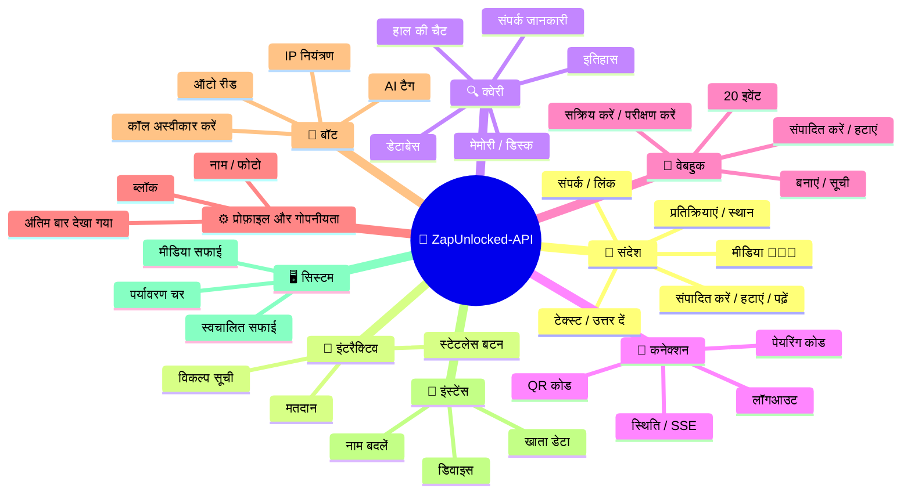
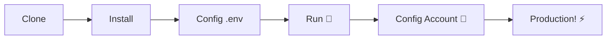

# 🚀 ZapUnlocked-API 📲✨


<p align="center">
  
  
  
  
  
</p>

<table width="100%">
  <tr>
    <td align="center" valign="middle"><a href="https://github.com/kauafpssx/ZapUnlocked-API/blob/main/docs/translations/en.md"></a></td>
    <td align="center" valign="middle"><a href="https://github.com/kauafpssx/ZapUnlocked-API/blob/main/docs/translations/es.md"></a></td>
    <td align="center" valign="middle"><a href="https://github.com/kauafpssx/ZapUnlocked-API/blob/main/docs/translations/fr.md"></a></td>
    <td align="center" valign="middle"><a href="https://github.com/kauafpssx/ZapUnlocked-API/blob/main/docs/translations/de.md"></a></td>
    <td align="center" valign="middle"><a href="https://github.com/kauafpssx/ZapUnlocked-API/blob/main/docs/translations/zh.md"></a></td>
    <td align="center" valign="middle"><a href="https://github.com/kauafpssx/ZapUnlocked-API/blob/main/docs/translations/ja.md"></a></td>
    <td align="center" valign="middle"><a href="https://github.com/kauafpssx/ZapUnlocked-API/blob/main/docs/translations/ru.md"></a></td>
    <td align="center" valign="middle"><a href="https://github.com/kauafpssx/ZapUnlocked-API/blob/main/docs/translations/it.md"></a></td>
    <td align="center" valign="middle"><a href="https://github.com/kauafpssx/ZapUnlocked-API/blob/main/docs/translations/ar.md"></a></td>
    <td align="center" valign="middle"><a href="https://github.com/kauafpssx/ZapUnlocked-API/blob/main/docs/translations/tr.md"></a></td>
    <td align="center" valign="middle"><a href="https://github.com/kauafpssx/ZapUnlocked-API/blob/main/docs/translations/ko.md"></a></td>
    <td align="center" valign="middle"><a href="https://github.com/kauafpssx/ZapUnlocked-API/blob/main/docs/translations/nl.md"></a></td>
  </tr>
</table>

---

##  ZapUnlocked-API क्या है?

WhatsApp API बाजार महंगी मासिक सदस्यता लेता है: दर्जनों से सैकड़ों रुपये प्रति माह, उपयोग सीमाएं, प्रति वार्ता शुल्क और तीसरे पक्ष के सर्वरों से गुजरने वाला डेटा। **ZapUnlocked-API इसे बदलने के लिए है।**

**Python** और **[Neonize](https://github.com/krypton-byte/neonize)** को कनेक्शन इंजन के रूप में उपयोग करके बनाया गया यह API, सत्र प्रबंधित करने, जटिल मीडिया भेजने और स्मार्ट इंटरैक्शन बनाने के लिए एक सरल REST इंटरफेस (FastAPI) प्रदान करता है। **कोई भारी डेटाबेस नहीं, कोई मासिक शुल्क नहीं, किसी पर निर्भर नहीं।**

हमारा प्रस्ताव **तकनीकी उत्कृष्टता** और **डेवलपर स्वतंत्रता** पर आधारित है। हम मानते हैं कि शक्तिशाली उपकरण उन लोगों के लिए सुलभ होने चाहिए जो अपने स्वयं के समाधान बनाते हैं।

> [!TIP]
> बॉट एकीकरण, सूचनाएं और स्वचालित सेवा प्रणालियों में चपलता चाहने वाले डेवलपर्स के लिए एकदम सही। **इसके लिए कुछ भी भुगतान किए बिना।**

---

## 🗺️ API अवलोकन



---

## ✨ मुख्य विशेषताएं

| विशेषता | विवरण |
| :------- | :-------- |
| 🧩 **स्टेटलेस बटन** | एन्क्रिप्टेड वेबहुक के साथ डेटाबेस के बिना इंटरैक्टिव फ्लो बनाएं |
| 🔢 **QR कोड के बिना पेयरिंग** | संख्यात्मक कोड से कनेक्ट करें · GUI रहित सर्वर के लिए आदर्श |
| 🎵 **ऑटो ऑडियो रूपांतरण** | ऑडियो को रिकॉर्ड किए गए (PTT) के रूप में मूल रूप से भेजें |
| 📦 **स्मार्ट मीडिया क्यू** | अत्यधिक मेमोरी खपत को रोकने के लिए स्वचालित प्रबंधन |
| 🏷️ **डायनामिक प्लेसहोल्डर** | `{{name}}`, `{{day}}`, `{{phone}}` के साथ संदेश और वेबहुक अनुकूलित करें |

> [!NOTE]
> सभी विशेषताएं **100% मुफ्त** हैं और ओपन-सोर्स समुदाय द्वारा बनाए रखी जाती हैं।

---

## 📋 API रूट्स

<details>
<summary><b>📨 संदेश भेजना</b> · 13 एंडपॉइंट</summary>

| विधि | रूट | विवरण |
| :--- | :--- | :----- |
| `POST` | `/send` | टेक्स्ट संदेश भेजें / उत्तर दें |
| `POST` | `/send_image` | छवि भेजें |
| `POST` | `/send_video` | वीडियो भेजें (GIF और PTV समर्थन) |
| `POST` | `/send_audio` | ऑडियो भेजें (PTT में स्वचालित रूपांतरण) |
| `POST` | `/send_document` | दस्तावेज़ भेजें |
| `POST` | `/send_sticker` | स्टिकर भेजें |
| `POST` | `/send_reaction` | इमोजी प्रतिक्रिया भेजें |
| `POST` | `/send_location` | स्थान भेजें |
| `POST` | `/send_contact` | संपर्क भेजें |
| `POST` | `/send_contacts` | एकाधिक संपर्क भेजें |
| `POST` | `/send_link` | पूर्वावलोकन के साथ लिंक भेजें |
| `POST` | `/messages/delete` | संदेश हटाएं |
| `POST` | `/messages/read` | पढ़ा हुआ चिह्नित करें |
| `POST` | `/messages/edit` | भेजे गए संदेश को संपादित करें |
</details>

<details>
<summary><b>🔘 इंटरैक्टिव संदेश</b> · 4 एंडपॉइंट</summary>

| विधि | रूट | विवरण |
| :--- | :--- | :----- |
| `POST` | `/send_wbuttons` | बटन भेजें (सूची, कार्रवाई, OTP, PIX) |
| `POST` | `/messages/send-option-list` | विकल्प सूची भेजें |
| `POST` | `/messages/send-poll` | मतदान भेजें |
| `POST` | `/messages/send-poll-vote` | मतदान में वोट करें |
</details>

<details>
<summary><b>🔍 क्वेरी और प्रबंधन</b> · 7 एंडपॉइंट</summary>

| विधि | रूट | विवरण |
| :--- | :--- | :----- |
| `POST` | `/contacts/info` | संपर्क विस्तृत जानकारी |
| `POST` | `/management/fetch_messages` | संदेश इतिहास लाएं |
| `POST` | `/management/recent_contacts` | हाल की चैट सूचीबद्ध करें |
| `GET` | `/management/memory` | मेमोरी उपयोग स्थिति |
| `GET` | `/management/volume_stats` | डिस्क उपयोग जांचें |
| `GET` | `/management/database/status` | डेटाबेस स्थिति और आंकड़े |
| `POST` | `/management/database/cleanup` | डेटाबेस मैन्युअल सफाई |
</details>

<details>
<summary><b>🔗 कनेक्शन और सत्र</b> · 8 एंडपॉइंट</summary>

| विधि | रूट | विवरण |
| :--- | :--- | :----- |
| `GET` | `/` | स्वागत पृष्ठ (HTML) |
| `GET` | `/status` | कनेक्शन और सत्र स्थिति |
| `GET` | `/status/stream` | रीयल-टाइम स्थिति (SSE) |
| `GET` | `/qr` | इंटरैक्टिव QR कोड देखें |
| `GET` | `/qr/image` | QR कोड छवि प्राप्त करें (Base64) |
| `POST` | `/qr/pair` | संख्यात्मक पेयरिंग कोड उत्पन्न करें |
| `GET` | `/settings/phone-code/{phone}` | नंबर द्वारा कोड उत्पन्न करें |
| `POST` | `/qr/logout` | डिस्कनेक्ट करें और सत्र रीसेट करें |
</details>

<details>
<summary><b>📡 वेबहुक (CRUD)</b> · 7 एंडपॉइंट</summary>

| विधि | रूट | विवरण |
| :--- | :--- | :----- |
| `POST` | `/webhooks` | नामित वेबहुक बनाएं |
| `GET` | `/webhooks` | सभी वेबहुक सूचीबद्ध करें |
| `PUT` | `/webhooks/{name}` | वेबहुक संपादित करें |
| `DELETE` | `/webhooks/{name}` | वेबहुक हटाएं |
| `POST` | `/webhooks/{name}/toggle` | सक्रिय / निष्क्रिय करें |
| `POST` | `/webhooks/{name}/test` | वेबहुक का परीक्षण करें |
| `GET` | `/webhooks/events` | ईवेंट प्रकार सूचीबद्ध करें (20 प्रकार) |
</details>

<details>
<summary><b>⚙️ प्रोफ़ाइल और गोपनीयता</b> · 3 एंडपॉइंट</summary>

| विधि | रूट | विवरण |
| :--- | :--- | :----- |
| `POST` | `/settings/profile` | बॉट का नाम और फोटो बदलें |
| `POST` | `/settings/privacy` | गोपनीयता समायोजित करें (अंतिम बार देखा गया, आदि) |
| `POST` | `/settings/block` | संपर्क को ब्लॉक / अनब्लॉक करें |
</details>

<details>
<summary><b>🤖 बॉट सेटिंग्स</b> · 5 एंडपॉइंट</summary>

| विधि | रूट | विवरण |
| :--- | :--- | :----- |
| `GET` | `/settings/bot` | बॉट सेटिंग्स देखें |
| `POST` | `/settings/bot` | सेटिंग्स अपडेट करें (AI टैग, IP नियंत्रण) |
| `PUT` | `/settings/instance/call-reject-auto` | कॉल स्वचालित रूप से अस्वीकार करें |
| `PUT` | `/settings/instance/call-reject-message` | अस्वीकृत कॉल संदेश |
| `PUT` | `/settings/instance/auto-read-message` | संदेशों की स्वचालित रीडिंग |
</details>

<details>
<summary><b>📱 इंस्टेंस</b> · 3 एंडपॉइंट</summary>

| विधि | रूट | विवरण |
| :--- | :--- | :----- |
| `GET` | `/instance/me` | कनेक्टेड खाता डेटा |
| `GET` | `/instance/device` | डिवाइस तकनीकी डेटा |
| `PUT` | `/instance/update-name` | इंस्टेंस का नाम बदलें |
</details>

<details>
<summary><b>🖥️ सिस्टम</b> · 5 एंडपॉइंट</summary>

| विधि | रूट | विवरण |
| :--- | :--- | :----- |
| `GET` | `/system/env` | पर्यावरण चर देखें |
| `PUT` | `/system/env` | पर्यावरण चर अपडेट करें |
| `POST` | `/system/cleanup/force` | अस्थायी मीडिया की जबरदस्ती सफाई |
| `GET` | `/system/cleanup/settings` | स्वचालित सफाई सेटिंग्स देखें |
| `PUT` | `/system/cleanup/settings` | स्वचालित सफाई अंतराल अपडेट करें |
</details>

> **कुल: 56 एंडपॉइंट** · WhatsApp ऑटोमेशन के लिए पूर्ण REST.

---

## 🛠️ स्थापना और होस्टिंग

> **ZapUnlocked-API** के साथ अपने पेशेवर WhatsApp API को **5 मिनट से भी कम** में चालू करें।

### 💻 स्थानीय स्थापना

विकास, परीक्षण या अपने स्वयं के सर्वर पर चलाने के लिए आदर्श।



**1. रिपॉजिटरी क्लोन करें**

```bash
git clone https://github.com/kauafpssx/ZapUnlocked-API.git
cd ZapUnlocked-API
```

**2. निर्भरताएं स्थापित करें**

| सिस्टम | कमांड |
| :----- | :---- |
| 🪟 Windows | `scripts\install\install.bat` |
| 🐧 Linux / macOS | `bash scripts/install/install.sh` |

**3. पर्यावरण कॉन्फ़िगर करें**

| सिस्टम | कमांड |
| :----- | :---- |
| 🪟 Windows | `scripts\generate-env\generate-env.bat` |
| 🐧 Linux / macOS | `bash scripts/generate-env/generate-env.sh` |

| चर | विवरण |
| :-- | :---- |
| `API_KEY` | सभी एंडपॉइंट पर प्रमाणीकरण के लिए पासवर्ड |
| `INTERNAL_SECRET` | वेबहुक हस्ताक्षर सत्यापित करने के लिए टोकन |
| `PORT` | API पोर्ट (डिफ़ॉल्ट: `8300`) |

**4. API चलाएं**

| सिस्टम | कमांड |
| :----- | :---- |
| 🪟 Windows | `scripts\run\run.bat` |
| 🐧 Linux / macOS | `bash scripts/run/run.sh` |

---

### ☁️ होस्टिंग: Alwaysdata (24/7 मुफ्त)

**Alwaysdata**, API को सर्वर चालू रखने की आवश्यकता के बिना स्थिर और मुफ्त होस्ट करने के लिए अनुशंसित विकल्प है।

#### 📊 मुफ्त प्लान संसाधन

| संसाधन | मुफ्त में उपलब्ध |
| :------ | :---------------- |
| 💾 भंडारण | **1 GB SSD** |
| 🧠 RAM | **256 MB** |
| ⚡ CPU | **1/4 vCPU** |
| 🔤 बैकअप | **3 दिन** स्वचालित |
| 📡 अपटाइम | सेवाओं के माध्यम से **24/7** |

#### 👣 डिप्लॉय के चरण

**1.** [Alwaysdata.com](https://www.alwaysdata.com/) पर खाता बनाएं · **मुफ्त** प्लान।

**2.** SSH `https://ssh-[उपयोगकर्ता].alwaysdata.net` पर पहुंचें।

**3.** क्लोन करें और स्थापित करें:

```bash
git clone https://github.com/kauafpssx/ZapUnlocked-API.git ~/ZapUnlocked-API
cd ~/ZapUnlocked-API
bash scripts/install/install.sh
```

**4.** `.env` जनरेट करें:

```bash
bash scripts/generate-env/generate-env.sh
```

**5.** **Advanced · Services · Add a service** में सेवा (24/7) कॉन्फ़िगर करें:

| फ़ील्ड | मान |
| :----- | :--- |
| **Name** | `ZapUnlocked-API` |
| **Command** | `python3 main.py` |
| **Working directory** | `ZapUnlocked-API` |
| **Environment variables** | `PORT=8300` |

**6.** इसके माध्यम से पहुंचें:

```
http://services-[उपयोगकर्ता].alwaysdata.net:8300/
```

> [!TIP]
> URL बाहरी रूप से पहले से ही सुलभ है। *(वैकल्पिक)* कस्टम डोमेन का उपयोग करने के लिए **Web · Sites · Add a site** में `http://[उपयोगकर्ता].alwaysdata.net` पर इंगित करते हुए **रिवर्स प्रॉक्सी (Reverse Proxy)** कॉन्फ़िगर करें।

---

## 🔐 प्रमाणीकरण (लॉगिन)

डिप्लॉय के बाद, ब्राउज़र में निम्नलिखित एक्सेस करके अपना WhatsApp खाता कनेक्ट करें:

```text
http://services-[उपयोगकर्ता].alwaysdata.net:8300/qr?API_KEY=आपका_गुप्त_पासवर्ड
```

---

## 📖 आधिकारिक दस्तावेज़ीकरण

<p align="center">
  👉 <a href="https://zapunlocked-api.kauafpss.com.br"><strong>zapunlocked-api.kauafpss.com.br</strong></a>
</p>

विस्तृत तकनीकी दस्तावेज़ीकरण, कोड उदाहरण और इंटरैक्टिव प्लेग्राउंड के लिए हमारी आधिकारिक वेबसाइट देखें।

> [!TIP]
> **LLMs.txt** को AI इंडेक्स के रूप में उपयोग करें: [`zapunlocked-api.kauafpss.com.br/llms.txt`](https://zapunlocked-api.kauafpss.com.br/llms.txt)। एक्सप्लोर करने से पहले सभी पृष्ठ खोजें।

---

## ❤️ क्रेडिट और धन्यवाद

| प्रोजेक्ट | विवरण |
| :-------- | :---- |
| [](https://github.com/krypton-byte/neonize) | WhatsApp Web से मूल कनेक्शन के लिए Python लाइब्रेरी |
| [](https://github.com/tulir/whatsmeow) | Neonize का आधार Go लाइब्रेरी · कनेक्शन का दिल |
| [](https://www.alwaysdata.com/) | उच्च गुणवत्ता वाला मुफ्त बुनियादी ढांचा |

---

## 📄 लाइसेंस

यह प्रोजेक्ट **MIT लाइसेंस** के तहत लाइसेंस प्राप्त है।

<p align="center">
  <a href="https://www.instagram.com/kauafpss_/">Kauã Ferreira</a> 💜 द्वारा बनाया गया
</p>

