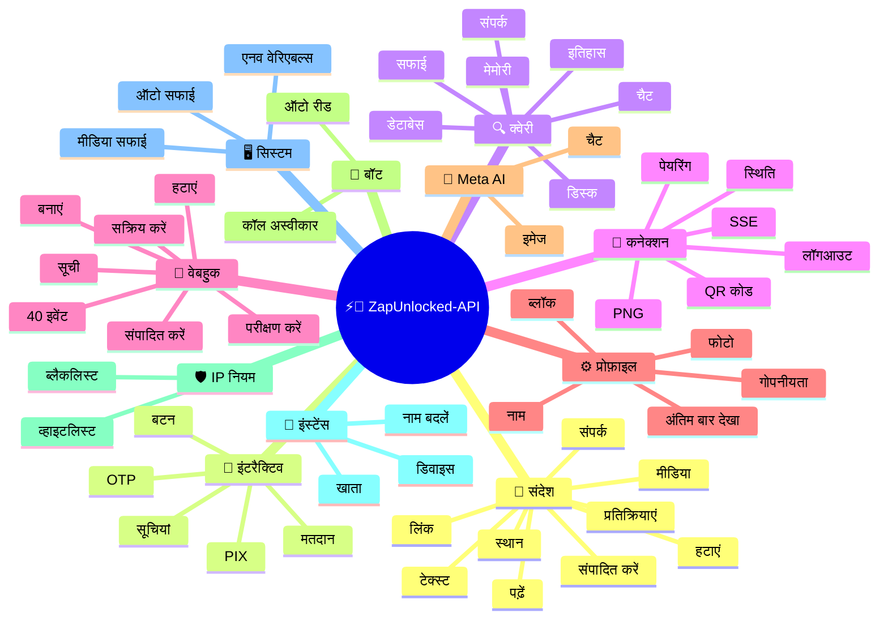
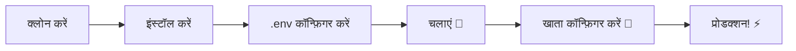

# ⚡💬 [ZapUnlocked-API](https://zapunlocked-api.kauafpss.com.br/)


<p align="center">
  
  <a href="https://downgit.github.io/#/home?url=https://github.com/kauafpssx/ZapUnlocked-API/blob/main/ZapUnlocked.collection.json">
    
  </a>
  
  
  
</p>

---

### 🌐 भाषा चुनें:

<table width="100%">
  <tr>
    <td align="center" valign="middle"><a href="https://github.com/kauafpssx/ZapUnlocked-API/blob/main/README.md"></a></td>
    <td align="center" valign="middle"><a href="https://github.com/kauafpssx/ZapUnlocked-API/blob/main/docs/translations/en.md"></a></td>
    <td align="center" valign="middle"><a href="https://github.com/kauafpssx/ZapUnlocked-API/blob/main/docs/translations/es.md"></a></td>
    <td align="center" valign="middle"><a href="https://github.com/kauafpssx/ZapUnlocked-API/blob/main/docs/translations/fr.md"></a></td>
    <td align="center" valign="middle"><a href="https://github.com/kauafpssx/ZapUnlocked-API/blob/main/docs/translations/de.md"></a></td>
    <td align="center" valign="middle"><a href="https://github.com/kauafpssx/ZapUnlocked-API/blob/main/docs/translations/zh.md"></a></td>
    <td align="center" valign="middle"><a href="https://github.com/kauafpssx/ZapUnlocked-API/blob/main/docs/translations/ja.md"></a></td>
    <td align="center" valign="middle"><a href="https://github.com/kauafpssx/ZapUnlocked-API/blob/main/docs/translations/ru.md"></a></td>
    <td align="center" valign="middle"><a href="https://github.com/kauafpssx/ZapUnlocked-API/blob/main/docs/translations/it.md"></a></td>
    <td align="center" valign="middle"><a href="https://github.com/kauafpssx/ZapUnlocked-API/blob/main/docs/translations/ar.md"></a></td>
    <td align="center" valign="middle"><a href="https://github.com/kauafpssx/ZapUnlocked-API/blob/main/docs/translations/tr.md"></a></td>
    <td align="center" valign="middle"><a href="https://github.com/kauafpssx/ZapUnlocked-API/blob/main/docs/translations/ko.md"></a></td>
    <td align="center" valign="middle"><a href="https://github.com/kauafpssx/ZapUnlocked-API/blob/main/docs/translations/hi.md"></a></td>
    <td align="center" valign="middle"><a href="https://github.com/kauafpssx/ZapUnlocked-API/blob/main/docs/translations/nl.md"></a></td>
  </tr>
</table>

---

##  ZapUnlocked-API क्या है?

WhatsApp API बाज़ार भारी मासिक शुल्क वसूलता है: दसियों से सैकड़ों रुपए प्रति माह, उपयोग सीमाएं, प्रति वार्ता शुल्क और डेटा जो तीसरे पक्ष के सर्वरों से होकर गुज़रता है। **ZapUnlocked-API मुफ्त और ओपन-सोर्स है।**

**Python** और **[Neonize](https://github.com/krypton-byte/neonize)** के साथ निर्मित, यह API सत्र प्रबंधित करने, मीडिया भेजने और बॉट बनाने के लिए FastAPI का उपयोग करता है। कोई भारी डेटाबेस नहीं, कोई मासिक शुल्क नहीं, कोई तीसरे पक्ष का सर्वर नहीं।

> [!TIP]
> बॉट, सूचनाएं और ग्राहक सेवा प्रणालियों के लिए उपयोग करें। **100% मुफ्त।**

> [!IMPORTANT]
> 🤖 **Meta AI एकीकृत.** चैट करने के लिए `/ai/ask` और WhatsApp में इमेज जनरेट करने के लिए `/ai/imagine` का उपयोग करें। [रूट देखें](#-meta-ai--2-endpoints).

---

## 🗺️ API अवलोकन



---

## ✨ प्रमुख विशेषताएं

| विशेषता | विवरण |
| :------ | :---- |
| 🧩 **स्टेटलेस बटन** | एन्क्रिप्टेड वेबहुक के साथ, बिना डेटाबेस के इंटरैक्टिव फ्लो बनाएं |
| 🔢 **QR कोड रहित पेयरिंग** | संख्यात्मक कोड के माध्यम से कनेक्ट करें · GUI रहित सर्वर के लिए आदर्श |
| 🎵 **स्वचालित ऑडियो रूपांतरण** | ऑडियो भेजें जो मूल रूप से रिकॉर्ड किए गए (PTT) के रूप में दिखाई देता है |
| 📦 **स्मार्ट मीडिया कतार** | अत्यधिक मेमोरी खपत से बचने के लिए स्वचालित प्रबंधन |
| 🏷️ **डायनामिक प्लेसहोल्डर** | `{{name}}`, `{{day}}`, `{{phone}}` के साथ संदेश और वेबहुक वैयक्तिकृत करें |
| 🤖 **Meta AI** | WhatsApp के अंदर AI के साथ चैट करें और इमेज जनरेट करें। |
| ⌨️ **सार्वभौमिक पैरामीटर** | `delay_message`, `delay_typing`, `reply`/`quoted_id` और `@उल्लेख` **सभी** भेजने वाले एंडपॉइंट पर काम करते हैं। |
| 🔐 **हस्ताक्षरित Webhooks** | HMAC-SHA256 के माध्यम से अखंडता। आपका webhook केवल वैध डेटा स्वीकार करता है। |
| 🔄 **स्वचालित पुनर्संयोजन** | डिस्कनेक्ट, रिमोट लॉगआउट या स्ट्रीम त्रुटि पर स्वचालित रूप से पुनः कनेक्ट होता है। |
| 📁 **फ़ाइल अपलोड + URL** | सीधे अपलोड **या** सार्वजनिक URL द्वारा मीडिया भेजें। |

> [!NOTE]
> सभी विशेषताएं **100% मुफ्त** हैं और ओपन-सोर्स समुदाय द्वारा अनुरक्षित हैं।

---

## 📋 API रूट्स

<details>
<summary><b>📨 संदेश भेजना</b> · 15 एंडपॉइंट</summary>

| मेथड | रूट | विवरण | बॉडी |
| :----- | :--- | :-------- | :--- |
| `POST` | `/send` | टेक्स्ट संदेश भेजें / उत्तर दें | `phone`, `message` |
| `POST` | `/send_image` | चित्र भेजें | `phone`, `image_url` |
| `POST` | `/send_video` | वीडियो भेजें (GIF और PTV सपोर्ट करता है) | `phone`, `video_url` |
| `POST` | `/send_gif` | एनिमेटेड GIF भेजें | `phone`, `url` |
| `POST` | `/send_audio` | ऑडियो भेजें (स्वचालित PTT रूपांतरण के साथ) | `phone`, `audio_url` |
| `POST` | `/send_document` | दस्तावेज़ भेजें | `phone`, `document_url` |
| `POST` | `/send_sticker` | स्टिकर भेजें | `phone`, `sticker_url` |
| `POST` | `/send_reaction` | इमोजी के साथ प्रतिक्रिया भेजें | `phone`, `messageId`, `emoji` |
| `POST` | `/send_location` | स्थान भेजें | `phone`, `lat`, `lng` |
| `POST` | `/send_contact` | संपर्क भेजें | `phone`, `name`, `contactPhone` |
| `POST` | `/send_contacts` | एकाधिक संपर्क भेजें | `phone`, `contacts` |
| `POST` | `/send_link` | पूर्वावलोकन के साथ लिंक भेजें | `phone`, `url` |
| `POST` | `/messages/delete` | संदेश हटाएं | `phone`, `messageId` |
| `POST` | `/messages/read` | पढ़ा हुआ चिह्नित करें | `phone`, `messageIds` |
| `POST` | `/messages/edit` | भेजा गया संदेश संपादित करें | `phone`, `messageId`, `message` |

> [!TIP]
> **सार्वभौमिक पैरामीटर।** **प्रत्येक** संदेश भेजने वाले एंडपॉइंट (इंटरैक्टिव सहित) पर उपलब्ध:
>
> | पैरामीटर | कार्य |
> | :-------- | :---- |
> | `delay_message` | भेजने से पहले N सेकंड प्रतीक्षा करता है। |
> | `delay_typing` | भेजने से पहले N सेकंड के लिए "टाइप कर रहा है..." दिखाता है। |
> | `reply` / `quoted_id` | उत्तर देने के लिए संदेश का ID (उद्धरण)। |
> | `mentioned` | @उल्लेख के लिए फ़ोन नंबरों की JSON सरणी। उदाहरण: `["5511999999999"]` |

</details>

<details>
<summary><b>🔘 इंटरैक्टिव संदेश</b> · 9 एंडपॉइंट</summary>

| मेथड | रूट | विवरण | बॉडी |
| :----- | :--- | :-------- | :--- |
| `POST` | `/messages/send-button-list` | विकल्प सूची बटन | `phone`, `buttons` |
| `POST` | `/messages/send-button-quick-reply` | त्वरित उत्तर बटन | `phone`, `title`, `buttons` |
| `POST` | `/messages/send-button-otp` | कॉपी बटन (OTP) | `phone`, `code` |
| `POST` | `/messages/send-button-pix` | PIX बटन | `phone`, `pixKey` |
| `POST` | `/messages/send-button-url` | लिंक वाला बटन | `phone`, `title`, `url` |
| `POST` | `/messages/send-button-call` | कॉल बटन | `phone`, `title`, `phoneNumber` |
| `POST` | `/messages/send-option-list` | ⛔ **अस्थायी रूप से अक्षम** (iPhone, Android और Web के साथ असंगत) | `phone`, `buttons` |
| `POST` | `/messages/send-poll` | मतदान भेजें | `phone`, `name`, `options` |
| `POST` | `/messages/send-poll-vote` | मतदान में वोट करें | `phone`, `options` |
</details>

<details>
<summary><b>🔍 क्वेरी और प्रबंधन</b> · 12 एंडपॉइंट</summary>

| मेथड | रूट | विवरण | बॉडी |
| :----- | :--- | :-------- | :--- |
| `POST` | `/management/fetch_messages` | संदेश इतिहास प्राप्त करें | `phone` |
| `POST` | `/management/recent_contacts` | हाल के चैट की सूची बनाएं | ❌ |
| `GET` | `/management/chats` | इतिहास सहित चैट सूचीबद्ध करें | ❌ |
| `GET` | `/management/chats/{phone}/messages` | किसी विशिष्ट चैट के संदेश | ❌ |
| `GET` | `/management/contacts/{phone}` | संपर्क की विस्तृत जानकारी | ❌ |
| `GET` | `/management/groups` | समूह सूचीबद्ध करें | ❌ |
| `DELETE` | `/management/cleanup` | चैट डेटा साफ़ करें | ❌ |
| `GET` | `/management/export` | कॉन्फ़िगरेशन निर्यात करें (वेबहुक, सेटिंग्स, IP नियम) | ❌ |
| `POST` | `/management/import` | फ़ाइल अपलोड के माध्यम से कॉन्फ़िगरेशन आयात करें | `file` |
| `GET` | `/management/database/status` | डेटाबेस स्थिति और आंकड़े | ❌ |
| `POST` | `/management/database/config` | डेटाबेस कॉन्फ़िगरेशन अपडेट करें | `interval` |
| `POST` | `/management/database/cleanup` | मैन्युअल डेटाबेस सफाई | ❌ |
</details>

<details>
<summary><b>👤 संपर्क</b> · 1 एंडपॉइंट</summary>

| मेथड | रूट | विवरण | बॉडी |
| :----- | :--- | :-------- | :--- |
| `POST` | `/contacts/info` | संपर्क की विस्तृत जानकारी | `phone` |
</details>

<details>
<summary><b>🏠 सामान्य / स्थिति</b> · 9 एंडपॉइंट</summary>

| मेथड | रूट | विवरण | बॉडी |
| :----- | :--- | :-------- | :--- |
| `GET` | `/` | स्वागत पृष्ठ (HTML) | ❌ |
| `GET` | `/status` | पूर्ण स्थिति (WhatsApp, CPU, मेमोरी, डिस्क) | ❌ |
| `GET` | `/status/stream` | SSE के माध्यम से रीयल-टाइम स्थिति | ❌ |
| `GET` | `/status/health` | सरल हेल्थ चेक (`{"ok":true}`) | ❌ |
| `GET` | `/status/readiness` | रेडीनेस चेक (WhatsApp डिस्कनेक्टेड होने पर 503) | ❌ |
| `GET` | `/status/memory` | मेमोरी स्थिति (प्रक्रिया + सिस्टम) | ❌ |
| `GET` | `/status/volume` | डिस्क स्थिति (आकार, फ़ाइलें) | ❌ |
| `GET` | `/collection.json` | Postman Collection डाउनलोड करें | ❌ |
| `POST` | `/collection.json` | Postman Collection अपडेट करें | JSON body |
</details>

<details>
<summary><b>🔗 कनेक्शन (QR)</b> · 2 एंडपॉइंट</summary>

| मेथड | रूट | विवरण | बॉडी |
| :----- | :--- | :-------- | :--- |
| `GET` | `/qr` | इंटरैक्टिव QR कोड देखें (HTML) | ❌ |
| `GET` | `/qr/image` | QR कोड छवि प्राप्त करें (PNG) | ❌ |
</details>

<details>
<summary><b>🔐 सत्र</b> · 2 एंडपॉइंट</summary>

| मेथड | रूट | विवरण | बॉडी |
| :----- | :--- | :-------- | :--- |
| `POST` | `/session/pair` | संख्यात्मक पेयरिंग कोड जनरेट करें | `phone` |
| `POST` | `/session/logout` | डिस्कनेक्ट करें और सत्र रीसेट करें | ❌ |
</details>

<details>
<summary><b>📡 वेबहुक (CRUD)</b> · 8 एंडपॉइंट</summary>

| मेथड | रूट | विवरण | बॉडी |
| :----- | :--- | :-------- | :--- |
| `POST` | `/webhooks` | नामांकित वेबहुक बनाएं | `name`, `url` |
| `GET` | `/webhooks` | सभी वेबहुक सूचीबद्ध करें | ❌ |
| `GET` | `/webhooks/{name}` | नाम से वेबहुक प्राप्त करें | ❌ |
| `PUT` | `/webhooks/{name}` | वेबहुक संपादित करें | ❌ |
| `DELETE` | `/webhooks/{name}` | वेबहुक हटाएं | ❌ |
| `POST` | `/webhooks/{name}/toggle` | सक्रिय / निष्क्रिय करें | `active` |
| `POST` | `/webhooks/{name}/test` | वेबहुक का परीक्षण करें | ❌ |
| `GET` | `/webhooks/events` | इवेंट प्रकार सूचीबद्ध करें (40 प्रकार) | ❌ |
</details>

<details>
<summary><b>⚙️ प्रोफ़ाइल और गोपनीयता</b> · 13 एंडपॉइंट</summary>

| मेथड | रूट | विवरण | बॉडी |
| :----- | :--- | :-------- | :--- |
| `POST` | `/settings/profile` | बॉट का नाम और फोटो बदलें | `name?`, `photo?` (Form) |
| `POST` | `/settings/block` | संपर्क को ब्लॉक / अनब्लॉक करें | `phone`, `action` |
| `PUT` | `/settings/privacy/last-seen` | अंतिम बार देखा गया | `value` |
| `PUT` | `/settings/privacy/online` | ऑनलाइन स्थिति | `value` |
| `PUT` | `/settings/privacy/profile` | फोटो दृश्यता | `value` |
| `PUT` | `/settings/privacy/status` | स्थिति दृश्यता | `value` |
| `PUT` | `/settings/privacy/read-receipts` | पढ़ने की पुष्टि | `value` |
| `PUT` | `/settings/privacy/groups-add` | समूहों में कौन जोड़ सकता है | `value` |
| `PUT` | `/settings/privacy/call-add` | कॉल में कौन जोड़ सकता है | `value` |
| `PUT` | `/settings/privacy/about` | अबाउट / स्टेटस | `value?` |
| `PUT` | `/settings/privacy/disappearing-timer` | अस्थायी संदेश टाइमर | `value?` |
| `GET` | `/settings/ip-control` | IP नियंत्रण स्थिति देखें | ❌ |
| `PUT` | `/settings/ip-control` | IP नियंत्रण सक्रिय/निष्क्रिय करें | `enabled` |
</details>

<details>
<summary><b>🤖 बॉट सेटिंग्स</b> · 4 एंडपॉइंट</summary>

| मेथड | रूट | विवरण | बॉडी |
| :----- | :--- | :-------- | :--- |
| `PUT` | `/settings/instance/call-reject-auto` | कॉल स्वचालित रूप से अस्वीकार करें | `value` |
| `PUT` | `/settings/instance/call-reject-message` | अस्वीकृत कॉल के लिए संदेश | `value` |
| `PUT` | `/settings/instance/auto-read-message` | संदेशों को स्वचालित रूप से पढ़ें | `value` |
| `GET` | `/settings/phone-code/{phone}` | नंबर द्वारा पेयरिंग कोड जनरेट करें | ❌ |
</details>

<details>
<summary><b>📱 इंस्टेंस</b> · 3 एंडपॉइंट</summary>

| मेथड | रूट | विवरण | बॉडी |
| :----- | :--- | :-------- | :--- |
| `GET` | `/instance/me` | कनेक्टेड खाते का डेटा | ❌ |
| `GET` | `/instance/device` | डिवाइस का तकनीकी डेटा | ❌ |
| `PUT` | `/instance/update-name` | इंस्टेंस का नाम बदलें | `name` |
</details>

<details>
<summary><b>🛡️ IP नियम</b> · 5 एंडपॉइंट</summary>

| मेथड | रूट | विवरण | बॉडी |
| :----- | :--- | :-------- | :--- |
| `GET` | `/settings/ip-rules` | IP नियम सूचीबद्ध करें (व्हाइटलिस्ट/ब्लैकलिस्ट) | ❌ |
| `POST` | `/settings/ip-rules/whitelist` | व्हाइटलिस्ट में IP जोड़ें | `ip` |
| `POST` | `/settings/ip-rules/blacklist` | ब्लैकलिस्ट में IP जोड़ें | `ip` |
| `DELETE` | `/settings/ip-rules/whitelist/{ip}` | व्हाइटलिस्ट से IP हटाएं | ❌ |
| `DELETE` | `/settings/ip-rules/blacklist/{ip}` | ब्लैकलिस्ट से IP हटाएं | ❌ |
</details>

<details>
<summary><b>🖥️ सिस्टम</b> · 5 एंडपॉइंट</summary>

| मेथड | रूट | विवरण | बॉडी |
| :----- | :--- | :-------- | :--- |
| `GET` | `/system/env` | एनवायरनमेंट वेरिएबल देखें | ❌ |
| `PUT` | `/system/env` | एनवायरनमेंट वेरिएबल अपडेट करें | ❌ |
| `POST` | `/system/cleanup/force` | अस्थायी मीडिया की फोर्स सफाई | ❌ |
| `GET` | `/system/cleanup/settings` | स्वचालित सफाई सेटिंग्स देखें | ❌ |
| `PUT` | `/system/cleanup/settings` | स्वचालित सफाई अंतराल अपडेट करें | ❌ |
</details>

<details>
<summary><b>📊 लॉग</b> · 3 एंडपॉइंट</summary>

| मेथड | रूट | विवरण | बॉडी |
| :----- | :--- | :-------- | :--- |
| `GET` | `/logs/files` | लॉग फ़ाइलों की सूची बनाएं | ❌ |
| `GET` | `/logs` | फ़िल्टर के साथ लॉग देखें | ❌ |
| `POST` | `/logs/cleanup` | लॉग संपीड़न/सफाई बलपूर्वक करें | ❌ |
</details>

<details>
<summary><b>📈 स्टैट्स</b> · 6 एंडपॉइंट</summary>

| मेथड | रूट | विवरण | बॉडी |
| :----- | :--- | :-------- | :--- |
| `GET` | `/stats` | आंकड़े (अपटाइम, संदेश, वेबहुक) | ❌ |
| `DELETE` | `/stats` | आंकड़े रीसेट करें | ❌ |
| `GET` | `/stats/webhooks` | सभी वेबहुक के आंकड़े | ❌ |
| `GET` | `/stats/webhooks/{name}` | किसी विशिष्ट वेबहुक के आंकड़े | ❌ |
| `DELETE` | `/stats/webhooks` | सभी वेबहुक के आंकड़े रीसेट करें | ❌ |
| `DELETE` | `/stats/webhooks/{name}` | एक वेबहुक के आंकड़े रीसेट करें | ❌ |
</details>

<details>
<summary><b>🤖 मेटा AI</b> · 2 एंडपॉइंट</summary>

| मेथड | रूट | विवरण | बॉडी |
| :----- | :--- | :-------- | :--- |
| `POST` | `/ai/ask` | मेटा AI से पूछें | `message` |
| `POST` | `/ai/imagine` | मेटा AI के साथ छवि जनरेट करें | `prompt` |
</details>

<details>
<summary><b>🔐 मल्टी-सत्र</b> · 7 एंडपॉइंट</summary>

| मेथड | रूट | विवरण | बॉडी |
| :----- | :--- | :-------- | :--- |
| `GET` | `/sessions` | सभी सत्रों की सूची बनाएं | ❌ |
| `POST` | `/sessions` | नया सत्र बनाएं | `name?` |
| `PUT` | `/sessions/{id}/rename` | सत्र का नाम बदलें | `name` |
| `DELETE` | `/sessions/{id}` | सत्र निष्क्रिय करें | ❌ |
| `POST` | `/sessions/{id}/connect` | सत्र कनेक्ट करें | ❌ |
| `POST` | `/sessions/{id}/disconnect` | सत्र डिस्कनेक्ट करें | ❌ |
| `GET` | `/sessions/{id}/status` | सत्र की स्थिति | ❌ |
</details>

<details>
<summary><b>📡 वेबहुक (लॉग)</b> · 3 एंडपॉइंट</summary>

| मेथड | रूट | विवरण | बॉडी |
| :----- | :--- | :-------- | :--- |
| `GET` | `/webhooks/{name}/logs` | वेबहुक डिलीवरी लॉग | ❌ |
| `DELETE` | `/webhooks/{name}/logs` | वेबहुक लॉग साफ़ करें | ❌ |
| `DELETE` | `/webhooks/logs/all` | सभी वेबहुक के लॉग साफ़ करें | ❌ |
</details>

> **कुल: 108 एंडपॉइंट**

---

## 📡 वेबहुक इवेंट

सभी वेबहुक को एक मानक लिफाफा प्राप्त होता है:

```json
{
  "event": "message.text",
  "timestamp": "2025-01-01T12:00:00Z",
  "data": { ... }
}
```

यदि वेबहुक में `{{placeholders}}` के साथ कस्टम `body` है, तो मानक लिफाफे के बजाय वह body भेजा जाता है।

---

<details>
<summary><b>🏷️ कस्टम body में उपलब्ध प्लेसहोल्डर</b></summary>

| प्लेसहोल्डर | मान |
| :---------- | :---- |
| `{{from}}` | प्रेषक का नंबर |
| `{{text}}` | संदेश का टेक्स्ट |
| `{{phone}}` | `{{from}}` के समान |
| `{{id}}` | संदेश ID |
| `{{requested}}` | अनुरोधित मात्रा (fetchMessages) |
| `{{found}}` | प्राप्त मात्रा (fetchMessages) |
| `{{timestamp}}` | वर्तमान UTC टाइमस्टैंप |

</details>

---

<details>
<summary><b>📥 प्राप्त संदेश</b> · 18 इवेंट</summary>

> **मीडिया फ़ील्ड:** मीडिया इवेंट (`message.image`, `message.video`, `message.audio`, `message.document`, `message.sticker`) में अतिरिक्त फ़ील्ड शामिल होते हैं जब `RECEIVE_MEDIA_ENABLED=true`: `mediaBase64` (फ़ाइल का base64), `fileName`, `mimeType`, `mediaTooLarge` (bool, true जब `RECEIVE_MEDIA_MAX_SIZE_MB` से अधिक हो)।

प्राप्त संदेश इवेंट में मौजूद आधार फ़ील्ड:

```json
{
  "messageId": "3EB0ABCDEF123456",
  "from": "5511999999999",
  "fromName": "João Silva",
  "fromJid": "5511999999999@s.whatsapp.net",
  "isGroup": false
}
```

<details>
<summary><code>message.text</code> - सादा / फ़ॉर्मेटेड टेक्स्ट</summary>

```json
{
  "event": "message.text",
  "data": {
    "...base": "...",
    "text": "नमस्ते! मैं कैसे मदद कर सकता हूँ?",
    "quoted": { "id": "3EB0...", "fromMe": true }
  }
}
```
</details>

<details>
<summary><code>message.image</code> - प्राप्त छवि</summary>

```json
{
  "event": "message.image",
  "data": {
    "...base": "...",
    "caption": "उत्पाद की फोटो",
    "mimetype": "image/jpeg",
    "fileLength": 204800
  }
}
```
</details>

<details>
<summary><code>message.video</code> - प्राप्त वीडियो</summary>

```json
{
  "event": "message.video",
  "data": {
    "...base": "...",
    "caption": "यह वीडियो देखें!",
    "mimetype": "video/mp4",
    "fileLength": 5242880,
    "isPTT": false,
    "isGif": false
  }
}
```
</details>

<details>
<summary><code>message.audio</code> - ऑडियो / वॉइस नोट</summary>

```json
{
  "event": "message.audio",
  "data": {
    "...base": "...",
    "mimetype": "audio/ogg; codecs=opus",
    "fileLength": 30720,
    "isPTT": true,
    "durationSeconds": 8
  }
}
```
</details>

<details>
<summary><code>message.document</code> - दस्तावेज़ / फ़ाइल</summary>

```json
{
  "event": "message.document",
  "data": {
    "...base": "...",
    "fileName": "अनुबंध.pdf",
    "caption": "अनुबंध संलग्न है",
    "mimetype": "application/pdf",
    "fileLength": 102400
  }
}
```
</details>

<details>
<summary><code>message.sticker</code> - स्टिकर</summary>

```json
{
  "event": "message.sticker",
  "data": {
    "...base": "...",
    "mimetype": "image/webp",
    "isAnimated": false
  }
}
```
</details>

<details>
<summary><code>message.contact</code> - साझा संपर्क</summary>

```json
{
  "event": "message.contact",
  "data": {
    "...base": "...",
    "displayName": "Maria Souza",
    "vcard": "BEGIN:VCARD\nVERSION:3.0\n..."
  }
}
```
</details>

<details>
<summary><code>message.contacts</code> - एकाधिक संपर्क</summary>

```json
{
  "event": "message.contacts",
  "data": {
    "...base": "...",
    "displayName": "2 संपर्क",
    "count": 2,
    "contacts": [
      { "displayName": "Maria Souza", "vcard": "BEGIN:VCARD\n..." },
      { "displayName": "João Silva", "vcard": "BEGIN:VCARD\n..." }
    ]
  }
}
```
</details>

<details>
<summary><code>message.location</code> - स्थान</summary>

```json
{
  "event": "message.location",
  "data": {
    "...base": "...",
    "lat": -23.5505,
    "lng": -46.6333,
    "name": "Av. Paulista",
    "address": "Av. Paulista, 1000 - साओ पाउलो"
  }
}
```
</details>

<details>
<summary><code>message.reaction</code> - प्रतिक्रिया (इमोजी)</summary>

```json
{
  "event": "message.reaction",
  "data": {
    "...base": "...",
    "emoji": "❤️",
    "targetMessageId": "3EB0ABCDEF123456",
    "isRemoved": false
  }
}
```
</details>

<details>
<summary><code>message.poll_created</code> - प्राप्त मतदान</summary>

```json
{
  "event": "message.poll_created",
  "data": {
    "...base": "...",
    "pollName": "सबसे अच्छा स्वाद कौन सा है?",
    "options": ["चॉकलेट", "स्ट्रॉबेरी", "वेनिला"]
  }
}
```
</details>

<details>
<summary><code>message.poll_vote</code> - मतदान में वोट</summary>

```json
{
  "event": "message.poll_vote",
  "data": {
    "...base": "...",
    "pollId": "3EB0ABCDEF123456",
    "selectedOptions": ["चॉकलेट"]
  }
}
```
</details>

<details>
<summary><code>message.button_reply</code> - बटन क्लिक</summary>

```json
{
  "event": "message.button_reply",
  "data": {
    "...base": "...",
    "buttonId": "opcao_sim",
    "displayText": "हाँ",
    "type": "quick_reply"
  }
}
```
</details>

<details>
<summary><code>message.list_reply</code> - इंटरैक्टिव सूची चयन</summary>

```json
{
  "event": "message.list_reply",
  "data": {
    "...base": "...",
    "rowId": "1",
    "title": "X-Burguer",
    "description": "R$ 18,90"
  }
}
```
</details>

<details>
<summary><code>message.deleted</code> - प्रेषक द्वारा हटाया गया संदेश</summary>

```json
{
  "event": "message.deleted",
  "data": {
    "...base": "..."
  }
}
```
</details>

<details>
<summary><code>message.unknown</code> - अमैप्ड प्रकार</summary>

```json
{
  "event": "message.unknown",
  "data": {
    "...base": "...",
    "rawType": "senderKeyDistributionMessage"
  }
}
```
</details>

<details>
<summary><code>message.undecryptable</code> - अडिक्रिप्टेबल संदेश</summary>

```json
{
  "event": "message.undecryptable",
  "data": {
    "...base": "..."
  }
}
```
</details>

</details>

<details>
<summary><b>📤 भेजे गए संदेश</b> · 22 इवेंट</summary>

<details>
<summary><code>message.sent</code> - संदेश भेजा गया (सामान्य)</summary>

```json
{
  "event": "message.sent",
  "data": {
    "to": "5511999999999",
    "type": "text",
    "messageId": "3EB0ABCDEF123456"
  }
}
```
</details>

<details>
<summary><code>message.sent.{type}</code> - प्रकार के अनुसार विशिष्ट इवेंट</summary>

वही payload जो `message.sent` में है, लेकिन विशिष्ट इवेंट नाम के साथ। एक ही प्रकार की डिलीवरी की सदस्यता लेने के लिए उपयोगी।

प्रकार: `text`, `image`, `audio`, `video`, `document`, `sticker`, `gif`, `interactive`, `list`, `poll`, `poll_vote`, `location`, `contact`, `contacts`, `link`, `reaction`, `edit`, `delete`

```json
{
  "event": "message.sent.image",
  "data": {
    "to": "5511999999999",
    "type": "image",
    "messageId": "3EB0ABCDEF123456"
  }
}
```
</details>

<details>
<summary><code>message.delivered</code> - संदेश प्राप्तकर्ता को डिलीवर हुआ (receipt type 1)</summary>

```json
{
  "event": "message.delivered",
  "data": {
    "from": "5511999999999",
    "messageId": "3EB0ABCDEF123456"
  }
}
```
</details>

<details>
<summary><code>message.read</code> - संदेश प्राप्तकर्ता द्वारा पढ़ा गया (receipt type 4)</summary>

```json
{
  "event": "message.read",
  "data": {
    "from": "5511999999999",
    "messageId": "3EB0ABCDEF123456"
  }
}
```
</details>

<details>
<summary><code>message.receipt</code> - अन्य प्रकार की पुष्टि (receipt types 2, 3, 5+)</summary>

```json
{
  "event": "message.receipt",
  "data": {
    "from": "5511999999999",
    "messageId": "3EB0ABCDEF123456",
    "receiptType": 2
  }
}
```
</details>

</details>

<details>
<summary><b>🔗 कनेक्शन</b> · 11 इवेंट</summary>

<details>
<summary><code>connection.connected</code> - WhatsApp कनेक्टेड</summary>

```json
{
  "event": "connection.connected",
  "data": {
    "phone": "5511999999999"
  }
}
```
</details>

<details>
<summary><code>connection.disconnected</code> - WhatsApp डिस्कनेक्टेड</summary>

```json
{
  "event": "connection.disconnected",
  "data": {}
}
```
</details>

<details>
<summary><code>connection.qr_ready</code> - QR कोड जनरेटेड</summary>

```json
{
  "event": "connection.qr_ready",
  "data": {
    "qr": "2@abc123..."
  }
}
```
</details>

<details>
<summary><code>connection.pair_code</code> - पेयरिंग कोड जनरेटेड</summary>

```json
{
  "event": "connection.pair_code",
  "data": {
    "code": "ABCD-1234",
    "connected": false
  }
}
```

`connected: true` जब पेयरिंग पूरी हो जाती है।
</details>

<details>
<summary><code>connection.pair_status</code> - पेयरिंग स्थिति</summary>

```json
{
  "event": "connection.pair_status",
  "data": {
    "jid": "5511999999999@s.whatsapp.net",
    "businessName": "My Business",
    "platform": "WEB",
    "status": "OK",
    "error": ""
  }
}
```
</details>

<details>
<summary><code>connection.logged_out</code> - सत्र दूरस्थ रूप से समाप्त हुआ</summary>

```json
{
  "event": "connection.logged_out",
  "data": {
    "reason": "User logout"
  }
}
```
</details>

<details>
<summary><code>connection.connect_failure</code> - कनेक्शन विफलता</summary>

```json
{
  "event": "connection.connect_failure",
  "data": {
    "reason": "ERROR_CONNECT",
    "message": "Connection timed out"
  }
}
```
</details>

<details>
<summary><code>connection.stream_error</code> - स्ट्रीम त्रुटि</summary>

```json
{
  "event": "connection.stream_error",
  "data": {
    "code": "STREAM_ERR"
  }
}
```
</details>

<details>
<summary><code>connection.temporary_ban</code> - अस्थायी प्रतिबंध</summary>

```json
{
  "event": "connection.temporary_ban",
  "data": {
    "code": "BAN_CODE",
    "expire": 1704153600
  }
}
```
</details>

<details>
<summary><code>connection.client_outdated</code> - क्लाइंट पुराना हो गया</summary>

```json
{
  "event": "connection.client_outdated",
  "data": {}
}
```
</details>

<details>
<summary><code>connection.stream_replaced</code> - स्ट्रीम बदली गई</summary>

```json
{
  "event": "connection.stream_replaced",
  "data": {}
}
```
</details>

</details>

<details>
<summary><b>👥 समूह</b> · 2 इवेंट</summary>

<details>
<summary><code>group.join</code> - बॉट समूह में शामिल हुआ</summary>

```json
{
  "event": "group.join",
  "data": {
    "groupId": "123456789@g.us",
    "groupName": "My Group",
    "reason": "invite",
    "type": ""
  }
}
```
</details>

<details>
<summary><code>group.update</code> - समूह अपडेट किया गया</summary>

```json
{
  "event": "group.update",
  "data": {
    "groupId": "123456789@g.us",
    "sender": "5511999999999@s.whatsapp.net",
    "name": "New Group Name",
    "topic": "New description",
    "locked": false,
    "announce": false,
    "ephemeral": 604800,
    "delete": false,
    "link": null,
    "unlink": null,
    "newInviteLink": "https://chat.whatsapp.com/abc123"
  }
}
```
</details>

</details>

<details>
<summary><b>👤 संपर्क / उपस्थिति</b> · 4 इवेंट</summary>

<details>
<summary><code>contact.presence</code> - संपर्क की उपस्थिति स्थिति</summary>

```json
{
  "event": "contact.presence",
  "data": {
    "from": "5511999999999",
    "fromJid": "5511999999999@s.whatsapp.net",
    "status": "online",
    "lastSeen": 0
  }
}
```

`status`: `"online"` या `"offline"`.
</details>

<details>
<summary><code>contact.chat_presence</code> - टाइपिंग स्थिति</summary>

```json
{
  "event": "contact.chat_presence",
  "data": {
    "from": "5511999999999",
    "fromJid": "5511999999999@s.whatsapp.net",
    "state": "typing",
    "media": null
  }
}
```

`state`: `"typing"`, `"recording"` या `"paused"`.
</details>

<details>
<summary><code>contact.picture_change</code> - प्रोफ़ाइल फोटो बदली गई</summary>

```json
{
  "event": "contact.picture_change",
  "data": {
    "from": "5511999999999",
    "fromJid": "5511999999999@s.whatsapp.net",
    "author": "5511999999999@s.whatsapp.net",
    "action": "changed"
  }
}
```

`action`: `"changed"` या `"removed"`.
</details>

<details>
<summary><code>contact.identity_change</code> - सुरक्षा कुंजी बदली गई</summary>

```json
{
  "event": "contact.identity_change",
  "data": {
    "from": "5511999999999",
    "fromJid": "5511999999999@s.whatsapp.net",
    "implicit": false,
    "timestamp": 1704067200
  }
}
```
</details>

</details>

<details>
<summary><b>📞 कॉल</b> · 3 इवेंट</summary>

<details>
<summary><code>call.received</code> - कॉल प्राप्त हुई</summary>

```json
{
  "event": "call.received",
  "data": {
    "from": "5511999999999",
    "fromJid": "5511999999999@s.whatsapp.net",
    "callId": "ABC123DEF456"
  }
}
```
</details>

<details>
<summary><code>call.accepted</code> - कॉल स्वीकार की गई</summary>

```json
{
  "event": "call.accepted",
  "data": {
    "from": "5511999999999",
    "callId": "ABC123DEF456"
  }
}
```
</details>

<details>
<summary><code>call.terminated</code> - कॉल समाप्त हुई</summary>

```json
{
  "event": "call.terminated",
  "data": {
    "from": "5511999999999",
    "callId": "ABC123DEF456",
    "reason": "timeout"
  }
}
```
</details>

</details>

<details>
<summary><b>🧹 मीडिया सफाई</b> · 1 इवेंट</summary>

<details>
<summary><code>media.cleanup.completed</code> - स्वचालित मीडिया सफाई निष्पादित हुई</summary>

```json
{
  "event": "media.cleanup.completed",
  "data": {
    "filesRemoved": 12,
    "remainingBytes": 52428800
  }
}
```

हर घंटे स्वचालित रूप से निष्पादित होता है। जब कुछ नहीं हटाया गया तो `filesRemoved: 0`.
</details>

</details>

<details>
<summary><b>🤖 AI</b> · 1 इवेंट</summary>

<details>
<summary><code>ai.response</code> - मेटा AI से उत्तर प्राप्त हुआ</summary>

```json
{
  "event": "ai.response",
  "data": {
    "text": "ब्रासीलिया!",
    "hasImage": false,
    "imageBase64": null,
    "imageUrl": null,
    "mimeType": null,
    "messageId": "3EB0ABCDEF123456"
  }
}
```

जब मेटा AI उत्तर देता है तो हमेशा ट्रिगर होता है। जब आपको अतुल्यकालिक उत्तरों को संभालने की आवश्यकता हो तब उपयोग करें (`POST /ai/ask` का टाइमआउट 30s है)।
</details>

</details>

---

## 🛠️ इंस्टॉलेशन और होस्टिंग

> अपनी पेशेवर WhatsApp API को **5 मिनट** से भी कम समय में **ZapUnlocked-API** के साथ चालू करें।

### 💻 स्थानीय इंस्टॉलेशन

डेवलपमेंट, परीक्षण या अपने स्वयं के सर्वर पर चलाने के लिए आदर्श।



**1. रिपॉजिटरी क्लोन करें**

```bash
git clone https://github.com/kauafpssx/ZapUnlocked-API.git
cd ZapUnlocked-API
```

**2. निर्भरताएं इंस्टॉल करें**

| सिस्टम | कमांड |
| :------ | :------ |
| 🪟 विंडोज | `scripts\install\install.bat` |
| 🐧 लिनक्स / मैकओएस | `bash scripts/install/install.sh` |

**3. एनवायरनमेंट कॉन्फ़िगर करें**

| सिस्टम | कमांड |
| :------ | :------ |
| 🪟 विंडोज | `scripts\generate-env\generate-env.bat` |
| 🐧 लिनक्स / मैकओएस | `bash scripts/generate-env/generate-env.sh` |

| वेरिएबल | विवरण |
| :------- | :-------- |
| `API_KEY` | सभी एंडपॉइंट पर प्रमाणीकरण के लिए पासवर्ड |
| `INTERNAL_SECRET` | वेबहुक हस्ताक्षर मान्य करने के लिए टोकन |
| `PORT` | API पोर्ट (डिफ़ॉल्ट: `8300`) |

**4. API चलाएं**

| सिस्टम | कमांड |
| :------ | :------ |
| 🪟 विंडोज | `scripts\run\run.bat` |
| 🐧 लिनक्स / मैकओएस | `bash scripts/run/run.sh` |

---

### ☁️ होस्टिंग: Alwaysdata (मुफ्त 24/7)

**Alwaysdata** API को स्थिर और मुफ्त होस्ट करने के लिए अनुशंसित विकल्प है, बिना सर्वर चालू रखने की आवश्यकता के।

<details>
<summary><b>📊 संसाधन और चरण-दर-चरण देखें</b></summary>

#### 📊 मुफ्त योजना के संसाधन

| संसाधन | मुफ्त में उपलब्ध |
| :------ | :----------------- |
| 💾 स्टोरेज | **1 GB SSD** |
| 🧠 रैम | **256 MB** |
| ⚡ CPU | **1/4 vCPU** |
| 🔄 बैकअप | **3 दिन** स्वचालित |
| 📡 अपटाइम | **24/7** सर्विसेज के माध्यम से |

#### 👣 डिप्लॉय के लिए चरण-दर-चरण

**1.** [Alwaysdata.com](https://www.alwaysdata.com/) पर अपना खाता बनाएं · **मुफ्त** योजना।

**2.** SSH एक्सेस करें: `https://ssh-[उपयोगकर्ता].alwaysdata.net`।

**3.** क्लोन और इंस्टॉल करें:

```bash
git clone https://github.com/kauafpssx/ZapUnlocked-API.git ~/ZapUnlocked-API
cd ~/ZapUnlocked-API
bash scripts/install/install.sh
```

**4.** *(वैकल्पिक)* `.env` जनरेट करें:

```bash
bash scripts/generate-env/generate-env.sh
```

> [!NOTE]
> इंस्टॉल स्क्रिप्ट पहले से पूछती है कि क्या आप `.env` कॉन्फ़िगर करना चाहते हैं। यदि आपने **हाँ** उत्तर दिया है, तो यह चरण छोड़ा जा सकता है। अन्यथा, ऊपर का कमांड चलाएं या `.env` को मैन्युअल रूप से कॉन्फ़िगर करें।

**5.** सर्विस कॉन्फ़िगर करें (24/7) **Advanced › Services › Add a service** में:

| फ़ील्ड | मान |
| :---- | :---- |
| **Command** | `bash scripts/run/run.sh` |
| **Working directory** | `ZapUnlocked-API` |
| **Environment variables** | `PORT=8300` |

**6.** एक्सेस करें:

```
http://services-[उपयोगकर्ता].alwaysdata.net:8300/
```

> [!TIP]
> URL पहले से ही बाहरी रूप से सुलभ है। *(वैकल्पिक)* कस्टम डोमेन उपयोग करने के लिए, **Web › Sites › Add a site** में **Reverse Proxy** कॉन्फ़िगर करें जो `http://[उपयोगकर्ता].alwaysdata.net` पर इंगित करे।

---

#### 🔐 प्रमाणीकरण (लॉगिन)

डिप्लॉय के बाद, अपने ब्राउज़र में एक्सेस करके अपना WhatsApp खाता कनेक्ट करें:

```text
http://services-[उपयोगकर्ता].alwaysdata.net:8300/qr?API_KEY=आपकी_गुप्त_कुंजी
```

</details>

---

<details>
<summary><b>📌 अन्य जानकारी</b> · पर्यावरण चर, समय क्षेत्र, भेजने के पैरामीटर, बल्क भेजना, मीडिया रिसीवर</summary>

### 🌐 पूर्ण पर्यावरण चर

`API_KEY`, `INTERNAL_SECRET` और `PORT` के अलावा अतिरिक्त `.env` चर:

| चर | डिफ़ॉल्ट | विवरण |
| :------- | :----- | :-------- |
| `PUBLIC_URL` | ऑटो | लॉग में `/qr` डैशबोर्ड लिंक के लिए सार्वजनिक URL |
| `TZ` | `UTC` | टाइमस्टैम्प के लिए समय क्षेत्र (जैसे `America/Sao_Paulo`) |
| `DRY_RUN` | `false` | परीक्षण मोड, WhatsApp को कॉल किए बिना भेजने को रोकता है |
| `RECEIVE_MEDIA_ENABLED` | `false` | प्राप्त मीडिया को स्वचालित रूप से `temp_media/` में डाउनलोड करें |
| `RECEIVE_MEDIA_MAX_SIZE_MB` | `15` | प्राप्त मीडिया का अधिकतम आकार (MB) |
| `CORS_ORIGINS` | `*` | अनुमत स्रोत (अल्पविराम से अलग) |
| `ENABLE_WHATSAPP` | `1` | WhatsApp बॉट बंद करें (परीक्षण के लिए `0`) |
| `ENABLE_FFMPEG_WARMUP` | `1` | FFmpeg वार्मअप बंद करें (`0`) |
| `MAX_UPLOAD_SIZE_MB` | `500` | प्रति फ़ाइल अधिकतम अपलोड आकार |
| `CLEANUP_MAX_AGE_DAYS` | `7` | `temp_media/` में फ़ाइलों की अधिकतम आयु |
| `CLEANUP_MAX_SIZE_MB` | `500` | `temp_media/` का अधिकतम कुल आकार |
| `LOG_MAX_AGE_DAYS` | `30` | संपीड़ित लॉग की अधिकतम आयु |
| `LOG_MAX_SIZE_MB` | `50` | लॉग का अधिकतम कुल आकार |
| `META_AI_PHONE` | ऑटो | Meta AI फ़ोन नंबर ओवरराइड करें |
| `META_AI_TIMEOUT` | `30` | Meta AI प्रतिक्रिया टाइमआउट (सेकंड) |
| `META_AI_KEEP_IMAGES` | `false` | Meta AI छवियों को डिस्क पर सहेजें |
| `ALWAYSDATA_ACCOUNT` | ऑटो | Alwaysdata वातावरण बलपूर्वक लागू करें |

---

### 🕐 समय क्षेत्र (Timezone)

प्रत्येक भेजने का एंडपॉइंट ISO 8601 प्रारूप में ऑफ़सेट के साथ `timestamp` लौटाता है। प्राथमिकता के अनुसार कॉन्फ़िगरेशन:

1. प्रोजेक्ट रूट में `timezone.conf` फ़ाइल (पहली गैर-टिप्पणी पंक्ति)
2. `.env` या पर्यावरण चर में `TZ`
3. डिफ़ॉल्ट: `UTC`

सामान्य मान: `America/Sao_Paulo`, `America/New_York`, `Europe/London`, `Asia/Tokyo`.

```json
{
  "success": true,
  "message": "Message sent.",
  "messageId": "3EB0ABCDEF123456",
  "timestamp": "2026-06-15T14:30:00-0300"
}
```

---

### ✏️ गतिशील टेक्स्ट फ़ॉर्मेटिंग

भेजने के समय बदले जाने वाले प्लेसहोल्डर:

| प्लेसहोल्डर | इससे बदला जाता है |
| :---------- | :-------------- |
| `{{day}}` | वर्तमान दिन (01-31) |
| `{{mon}}` | वर्तमान माह (01-12) |
| `{{yea}}` | वर्तमान वर्ष (2026) |
| `{{hou}}` | वर्तमान घंटा (00-23) |
| `{{min}}` | वर्तमान मिनट (00-59) |
| `{{sec}}` | वर्तमान सेकंड (00-59) |

```json
{
  "phone": "5511999999999",
  "message": "आज {{day}}/{{mon}}/{{yea}} है और समय {{hou}}:{{min}}:{{sec}} है"
}
```

परिणाम: `"आज 15/06/2026 है और समय 14:30:00 है"`

---

### 🧪 DRY_RUN मोड

`.env` में `DRY_RUN=true` सभी भेजने वाले एंडपॉइंट को WhatsApp को कॉल किए बिना सफलता लौटाने पर मजबूर करता है। प्रतिक्रिया में `"dryRun": true`, `"messageId": null` शामिल है।

उपयोग: एकीकरण परीक्षण, CI/CD, पेलोड सत्यापन।

```json
{
  "success": true,
  "dryRun": true,
  "message": "Message sent.",
  "messageId": null,
  "timestamp": "2026-06-15T14:30:00-0300"
}
```

---

### ⚙️ भेजने के एंडपॉइंट में वैकल्पिक पैरामीटर

सभी `/send/*`, `/send/media`, `/send/buttons/*` एंडपॉइंट पर उपलब्ध:

| पैरामीटर | प्रकार | विवरण |
| :-------- | :--- | :-------- |
| `quoted_id` | `string` | उत्तर देने के लिए संदेश का ID |
| `delay_message` | `number` | भेजने से पहले सेकंड में देरी |
| `delay_typing` | `number` | X सेकंड के लिए टाइपिंग अनुकरण करें |
| `mentioned` | `string[]` | उल्लेख करने के लिए फ़ोन नंबर (@mention) |

```json
{
  "phone": "5511999999999",
  "message": "नमस्ते @5511888888888!",
  "quoted_id": "3EB0ABC123",
  "delay_message": 2,
  "delay_typing": 3,
  "mentioned": ["5511888888888"]
}
```

> [!NOTE]
> `quoted_id` संदेश ID (`type: "id"`) या खोजने के लिए टेक्स्ट (`type: "text"`) स्वीकार करता है। यदि ID स्थानीय इतिहास में नहीं मिलता है, तो API एक प्लेसहोल्डर बनाता है और WhatsApp उद्धरण प्रस्तुत करता है।

---

### 📦 बल्क भेजना

`POST /send/bulk` एक ही संदेश को कई नंबरों पर भेजता है:

| पैरामीटर | प्रकार | अनिवार्य | विवरण |
| :-------- | :--- | :---------- | :-------- |
| `phones` | `string[]` | ✅ | फ़ोन नंबरों की सरणी |
| `message` | `string` | ✅ | संदेश टेक्स्ट |
| `delay_message` | `number` | ❌ | प्रत्येक भेजने से पहले देरी |
| `delay_typing` | `number` | ❌ | टाइपिंग अनुकरण करें |
| `delay_between` | `number` | ❌ | नंबरों के बीच देरी |
| `mentioned` | `string[]` | ❌ | उल्लेख |

```json
{
  "phones": ["5511999999999", "5511888888888", "5511777777777"],
  "message": "फ्लैश सेल! 🔥",
  "delay_between": 3,
  "delay_typing": 2
}
```

---

### 📥 मीडिया रिसीवर

`RECEIVE_MEDIA_ENABLED=true` के साथ, API प्राप्त मीडिया (इमेज, वीडियो, ऑडियो, दस्तावेज़, स्टिकर) डाउनलोड करता है और वेबहुक में `mediaUrl` जोड़ता है:

```json
{
  "event": "message.upsert",
  "data": {
    "key": { "remoteJid": "5511999999999@s.whatsapp.net" },
    "message": { "imageMessage": {} },
    "mediaUrl": "http://services-उपयोगकर्ता.alwaysdata.net:8300/media/uuid-फ़ाइल.jpg"
  }
}
```

फ़ाइलें `temp_media/` में संग्रहीत की जाती हैं और स्वचालित शेड्यूलर द्वारा साफ़ की जाती हैं।

---

### 🧹 स्वचालित सफाई (temp_media)

`temp_media/` की सफाई हर घंटे चलती है। किसी भी मानदंड के पूरा होने पर ट्रिगर होती है:

* `CLEANUP_MAX_AGE_DAYS` (डिफ़ॉल्ट: 7 दिन) से पुरानी फ़ाइलें
* कुल आकार `CLEANUP_MAX_SIZE_MB` (डिफ़ॉल्ट: 500 MB) से अधिक

`filesRemoved` और `remainingBytes` के साथ वेबहुक `media.cleanup.completed` को ट्रिगर करता है।

</details>

---

## 📖 आधिकारिक दस्तावेज़ीकरण

<p align="center">
  👉 <a href="https://zapunlocked-api.kauafpss.com.br"><strong>zapunlocked-api.kauafpss.com.br</strong></a>
</p>

विस्तृत तकनीकी दस्तावेज़ीकरण, कोड उदाहरण और इंटरैक्टिव प्लेग्राउंड के लिए, हमारी आधिकारिक वेबसाइट पर जाएं।

> [!TIP]
> AI इंडेक्स के रूप में **LLMs.txt** का उपयोग करें: [`zapunlocked-api.kauafpss.com.br/llms.txt`](https://zapunlocked-api.kauafpss.com.br/llms.txt)। एक्सप्लोर करने से पहले सभी पेज खोजें।

---

## ❤️ क्रेडिट और आभार

| प्रोजेक्ट | विवरण |
| :------ | :-------- |
| [](https://github.com/krypton-byte/neonize) | WhatsApp Web से मूल कनेक्शन के लिए Python लाइब्रेरी |
| [](https://github.com/tulir/whatsmeow) | Neonize की Go आधार लाइब्रेरी · कनेक्शन का हृदय |
| [](https://www.alwaysdata.com/) | उच्च गुणवत्ता वाला मुफ्त बुनियादी ढांचा |

---

## 📄 लाइसेंस

यह प्रोजेक्ट **MIT लाइसेंस** के तहत लाइसेंस प्राप्त है।

<p align="center">
  💜 के साथ बनाया गया <a href="https://www.instagram.com/kauafpss_/">Kauã Ferreira</a> द्वारा
</p>
