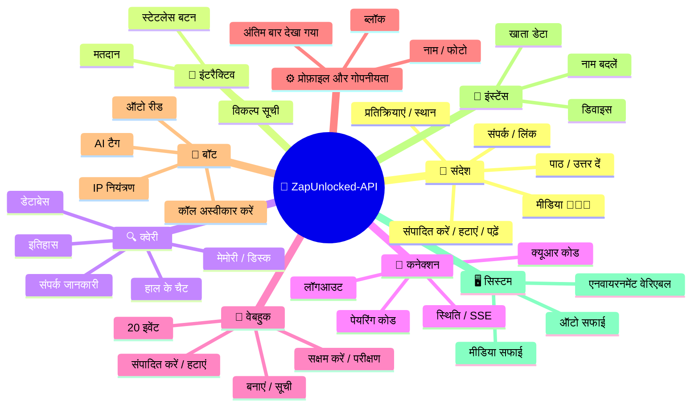
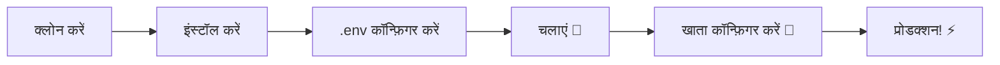

# 🚀 [ZapUnlocked-API](https://zapunlocked-api.kauafpss.com.br) 📲✨


<p align="center">
  
  
  
  
  
</p>

---

### 🌐 भाषा चुनें:

<table width="100%">
  <tr>
    <td align="center" valign="middle"><a href="https://github.com/kauafpssx/ZapUnlocked-API/blob/main/README.MD"></a></td>
    <td align="center" valign="middle"><a href="https://github.com/kauafpssx/ZapUnlocked-API/blob/main/docs/translations/en.md"></a></td>
    <td align="center" valign="middle"><a href="https://github.com/kauafpssx/ZapUnlocked-API/blob/main/docs/translations/es.md"></a></td>
    <td align="center" valign="middle"><a href="https://github.com/kauafpssx/ZapUnlocked-API/blob/main/docs/translations/fr.md"></a></td>
    <td align="center" valign="middle"><a href="https://github.com/kauafpssx/ZapUnlocked-API/blob/main/docs/translations/de.md"></a></td>
    <td align="center" valign="middle"><a href="https://github.com/kauafpssx/ZapUnlocked-API/blob/main/docs/translations/ja.md"></a></td>
    <td align="center" valign="middle"><a href="https://github.com/kauafpssx/ZapUnlocked-API/blob/main/docs/translations/ru.md"></a></td>
    <td align="center" valign="middle"><a href="https://github.com/kauafpssx/ZapUnlocked-API/blob/main/docs/translations/zh.md"></a></td>
    <td align="center" valign="middle"><a href="https://github.com/kauafpssx/ZapUnlocked-API/blob/main/docs/translations/it.md"></a></td>
    <td align="center" valign="middle"><a href="https://github.com/kauafpssx/ZapUnlocked-API/blob/main/docs/translations/ar.md"></a></td>
    <td align="center" valign="middle"><a href="https://github.com/kauafpssx/ZapUnlocked-API/blob/main/docs/translations/tr.md"></a></td>
    <td align="center" valign="middle"><a href="https://github.com/kauafpssx/ZapUnlocked-API/blob/main/docs/translations/ko.md"></a></td>
    <td align="center" valign="middle"><a href="https://github.com/kauafpssx/ZapUnlocked-API/blob/main/docs/translations/nl.md"></a></td>
  </tr>
</table>

---

##  ZapUnlocked-API क्या है?

व्हाट्सएप एपीआई बाजार भारी मासिक शुल्क लेता है: प्रति माह दसियों से सैकड़ों रियाल, उपयोग सीमाएं, प्रति बातचीत शुल्क और डेटा जो तीसरे पक्ष के सर्वर से होकर गुजरता है। **ZapUnlocked-API इसे बदलने के लिए मौजूद है।**

**पायथन** में **[Neonize](https://github.com/krypton-byte/neonize)** को कनेक्शन इंजन के रूप में उपयोग करके बनाया गया, यह API सेशन प्रबंधित करने, जटिल मीडिया भेजने और बुद्धिमान इंटरैक्शन बनाने के लिए एक सरल REST इंटरफ़ेस (FastAPI) प्रदान करता है। **कोई भारी डेटाबेस नहीं, कोई मासिक शुल्क नहीं, किसी पर निर्भरता नहीं।**

हमारा प्रस्ताव **तकनीकी उत्कृष्टता** और **डेवलपर स्वतंत्रता** पर आधारित है। हम मानते हैं कि शक्तिशाली उपकरण उन लोगों के लिए सुलभ होने चाहिए जो अपने स्वयं के समाधान बनाते हैं।

> [!TIP]
> उन डेवलपर्स के लिए उपयुक्त जो बॉट, सूचनाएं और स्वचालित ग्राहक सेवा प्रणालियों को एकीकृत करने में तेजी चाहते हैं। **इसके लिए कुछ भी भुगतान किए बिना।**

---

## 🗺️ API अवलोकन



---

## ✨ मुख्य विशेषताएं

| विशेषता | विवरण |
| :------ | :---- |
| 🧩 **स्टेटलेस बटन** | एन्क्रिप्टेड वेबहुक के साथ, बिना डेटाबेस के इंटरैक्टिव फ्लो बनाएं |
| 🔢 **क्यूआर-रहित पेयरिंग** | संख्यात्मक कोड के माध्यम से कनेक्ट करें · GUI रहित सर्वर के लिए आदर्श |
| 🎵 **स्वचालित ऑडियो रूपांतरण** | ऑडियो भेजें जो मूल रूप से रिकॉर्ड किए गए (PTT) के रूप में दिखाई देता है |
| 📦 **स्मार्ट मीडिया कतार** | अत्यधिक मेमोरी खपत को रोकने के लिए स्वचालित प्रबंधन |
| 🏷️ **डायनामिक प्लेसहोल्डर** | `{{name}}`, `{{day}}`, `{{phone}}` के साथ संदेश और वेबहुक वैयक्तिकृत करें |

> [!NOTE]
> सभी विशेषताएं **100% मुफ्त** हैं और ओपन-सोर्स समुदाय द्वारा बनाए रखी जाती हैं।

---

## 📋 API रूट्स

<details>
<summary><b>📨 संदेश भेजना</b> · 14 एंडपॉइंट</summary>

| मेथड | रूट | विवरण |
| :----- | :--- | :-------- |
| `POST` | `/send` | टेक्स्ट संदेश भेजें / उत्तर दें |
| `POST` | `/send_image` | चित्र भेजें |
| `POST` | `/send_video` | वीडियो भेजें (GIF और PTV सपोर्ट करता है) |
| `POST` | `/send_audio` | ऑडियो भेजें (स्वचालित PTT रूपांतरण के साथ) |
| `POST` | `/send_document` | दस्तावेज़ भेजें |
| `POST` | `/send_sticker` | स्टिकर भेजें |
| `POST` | `/send_reaction` | इमोजी के साथ प्रतिक्रिया भेजें |
| `POST` | `/send_location` | स्थान भेजें |
| `POST` | `/send_contact` | संपर्क भेजें |
| `POST` | `/send_contacts` | एकाधिक संपर्क भेजें |
| `POST` | `/send_link` | पूर्वावलोकन के साथ लिंक भेजें |
| `POST` | `/messages/delete` | संदेश हटाएं |
| `POST` | `/messages/read` | पढ़ा हुआ चिह्नित करें |
| `POST` | `/messages/edit` | भेजा गया संदेश संपादित करें |
</details>

<details>
<summary><b>🔘 इंटरैक्टिव संदेश</b> · 4 एंडपॉइंट</summary>

| मेथड | रूट | विवरण |
| :----- | :--- | :-------- |
| `POST` | `/send_wbuttons` | बटन भेजें (सूची, कार्रवाई, OTP, PIX) |
| `POST` | `/messages/send-option-list` | विकल्प सूची भेजें |
| `POST` | `/messages/send-poll` | मतदान भेजें |
| `POST` | `/messages/send-poll-vote` | मतदान में वोट करें |
</details>

<details>
<summary><b>🔍 क्वेरी और प्रबंधन</b> · 7 एंडपॉइंट</summary>

| मेथड | रूट | विवरण |
| :----- | :--- | :-------- |
| `POST` | `/contacts/info` | संपर्क की विस्तृत जानकारी |
| `POST` | `/management/fetch_messages` | संदेश इतिहास प्राप्त करें |
| `POST` | `/management/recent_contacts` | हाल के चैट की सूची |
| `GET` | `/management/memory` | मेमोरी उपयोग की स्थिति |
| `GET` | `/management/volume_stats` | डिस्क उपयोग की जांच करें |
| `GET` | `/management/database/status` | डेटाबेस स्थिति और आंकड़े |
| `POST` | `/management/database/cleanup` | मैन्युअल डेटाबेस सफाई |
</details>

<details>
<summary><b>🔗 कनेक्शन और सेशन</b> · 8 एंडपॉइंट</summary>

| मेथड | रूट | विवरण |
| :----- | :--- | :-------- |
| `GET` | `/` | स्वागत पृष्ठ (HTML) |
| `GET` | `/status` | कनेक्शन और सेशन की स्थिति |
| `GET` | `/status/stream` | रीयल-टाइम स्थिति (SSE) |
| `GET` | `/qr` | इंटरैक्टिव क्यूआर कोड देखें |
| `GET` | `/qr/image` | क्यूआर कोड छवि प्राप्त करें (Base64) |
| `POST` | `/qr/pair` | संख्यात्मक पेयरिंग कोड जनरेट करें |
| `GET` | `/settings/phone-code/{phone}` | फोन नंबर द्वारा कोड जनरेट करें |
| `POST` | `/qr/logout` | डिस्कनेक्ट करें और सेशन रीसेट करें |
</details>

<details>
<summary><b>📡 वेबहुक (CRUD)</b> · 7 एंडपॉइंट</summary>

| मेथड | रूट | विवरण |
| :----- | :--- | :-------- |
| `POST` | `/webhooks` | नामांकित वेबहुक बनाएं |
| `GET` | `/webhooks` | सभी वेबहुक की सूची |
| `PUT` | `/webhooks/{name}` | वेबहुक संपादित करें |
| `DELETE` | `/webhooks/{name}` | वेबहुक हटाएं |
| `POST` | `/webhooks/{name}/toggle` | सक्षम / अक्षम करें |
| `POST` | `/webhooks/{name}/test` | वेबहुक का परीक्षण करें |
| `GET` | `/webhooks/events` | इवेंट प्रकारों की सूची (20 प्रकार) |
</details>

<details>
<summary><b>⚙️ प्रोफ़ाइल और गोपनीयता</b> · 3 एंडपॉइंट</summary>

| मेथड | रूट | विवरण |
| :----- | :--- | :-------- |
| `POST` | `/settings/profile` | बॉट का नाम और फोटो बदलें |
| `POST` | `/settings/privacy` | गोपनीयता समायोजित करें (अंतिम बार देखा गया, आदि) |
| `POST` | `/settings/block` | संपर्क को ब्लॉक / अनब्लॉक करें |
</details>

<details>
<summary><b>🤖 बॉट सेटिंग्स</b> · 5 एंडपॉइंट</summary>

| मेथड | रूट | विवरण |
| :----- | :--- | :-------- |
| `GET` | `/settings/bot` | बॉट सेटिंग्स देखें |
| `POST` | `/settings/bot` | बॉट सेटिंग्स अपडेट करें (AI टैग, IP नियंत्रण) |
| `PUT` | `/settings/instance/call-reject-auto` | कॉल स्वचालित रूप से अस्वीकार करें |
| `PUT` | `/settings/instance/call-reject-message` | कॉल अस्वीकृति संदेश |
| `PUT` | `/settings/instance/auto-read-message` | संदेश स्वचालित रूप से पढ़ें |
</details>

<details>
<summary><b>📱 इंस्टेंस</b> · 3 एंडपॉइंट</summary>

| मेथड | रूट | विवरण |
| :----- | :--- | :-------- |
| `GET` | `/instance/me` | कनेक्टेड खाते का डेटा |
| `GET` | `/instance/device` | डिवाइस का तकनीकी डेटा |
| `PUT` | `/instance/update-name` | इंस्टेंस का नाम बदलें |
</details>

<details>
<summary><b>🖥️ सिस्टम</b> · 5 एंडपॉइंट</summary>

| मेथड | रूट | विवरण |
| :----- | :--- | :-------- |
| `GET` | `/system/env` | एनवायरनमेंट वेरिएबल देखें |
| `PUT` | `/system/env` | एनवायरनमेंट वेरिएबल अपडेट करें |
| `POST` | `/system/cleanup/force` | अस्थायी मीडिया की फोर्स सफाई |
| `GET` | `/system/cleanup/settings` | ऑटो-सफाई सेटिंग्स देखें |
| `PUT` | `/system/cleanup/settings` | ऑटो-सफाई अंतराल अपडेट करें |
</details>

> **कुल: 56 एंडपॉइंट** · व्हाट्सएप ऑटोमेशन के लिए पूर्ण REST।

---

## 📡 Webhook इवेंट्स

सभी webhook एक मानक लिफाफा प्राप्त करते हैं:

```json
{
  "event": "message.text",
  "timestamp": "2025-01-01T12:00:00Z",
  "data": { ... }
}
```

यदि webhook में `{{placeholders}}` के साथ कस्टम `body` है, तो मानक लिफाफे के बजाय यह body भेजा जाता है।

### प्लेसहोल्डर (कस्टम body)

| प्लेसहोल्डर | मान |
| :----------- | :-- |
| `{{from}}` | प्रेषक संख्या |
| `{{text}}` | संदेश टेक्स्ट |
| `{{phone}}` | `{{from}}` के समान |
| `{{id}}` | संदेश ID |
| `{{requested}}` | अनुरोधित मात्रा (fetchMessages) |
| `{{found}}` | मिली मात्रा (fetchMessages) |
| `{{timestamp}}` | वर्तमान UTC टाइमस्टैंप |
| `{{day}}` | वर्तमान दिन (dd) |
| `{{mon}}` | वर्तमान माह (MM) |
| `{{yea}}` | वर्तमान वर्ष (yyyy) |
| `{{hou}}` | वर्तमान घंटा (HH) |
| `{{min}}` | वर्तमान मिनट (mm) |
| `{{sec}}` | वर्तमान सेकंड (ss) |

<details>
<summary><b>📥 प्राप्त संदेश</b> · 15 इवेंट्स</summary>

प्राप्त संदेश इवेंट्स में मौजूद आधार फ़ील्ड:

```json
{
  "messageId": "3EB0ABCDEF123456",
  "from": "5511999999999",
  "fromName": "João Silva",
  "fromJid": "5511999999999@s.whatsapp.net",
  "isGroup": false
}
```

<details>
<summary><code>message.text</code> - सादा / फ़ॉर्मेटेड टेक्स्ट</summary>

```json
{
  "event": "message.text",
  "data": {
    "...base": "...",
    "text": "Olá! Como posso ajudar?",
    "quoted": { "id": "3EB0...", "fromMe": true }
  }
}
```
</details>

<details>
<summary><code>message.image</code> - प्राप्त छवि</summary>

```json
{
  "event": "message.image",
  "data": {
    "...base": "...",
    "caption": "Foto do produto",
    "mimetype": "image/jpeg",
    "fileLength": 204800
  }
}
```
</details>

<details>
<summary><code>message.video</code> - प्राप्त वीडियो</summary>

```json
{
  "event": "message.video",
  "data": {
    "...base": "...",
    "caption": "Veja esse vídeo!",
    "mimetype": "video/mp4",
    "fileLength": 5242880,
    "isPTT": false,
    "isGif": false
  }
}
```
</details>

<details>
<summary><code>message.audio</code> - ऑडियो / वॉइस नोट</summary>

```json
{
  "event": "message.audio",
  "data": {
    "...base": "...",
    "mimetype": "audio/ogg; codecs=opus",
    "fileLength": 30720,
    "isPTT": true,
    "durationSeconds": 8
  }
}
```
</details>

<details>
<summary><code>message.document</code> - दस्तावेज़ / फ़ाइल</summary>

```json
{
  "event": "message.document",
  "data": {
    "...base": "...",
    "fileName": "contrato.pdf",
    "caption": "Segue o contrato",
    "mimetype": "application/pdf",
    "fileLength": 102400
  }
}
```
</details>

<details>
<summary><code>message.sticker</code> - स्टिकर</summary>

```json
{
  "event": "message.sticker",
  "data": {
    "...base": "...",
    "mimetype": "image/webp",
    "isAnimated": false
  }
}
```
</details>

<details>
<summary><code>message.contact</code> - साझा संपर्क</summary>

```json
{
  "event": "message.contact",
  "data": {
    "...base": "...",
    "displayName": "Maria Souza",
    "vcard": "BEGIN:VCARD\nVERSION:3.0\n..."
  }
}
```
</details>

<details>
<summary><code>message.location</code> - स्थान</summary>

```json
{
  "event": "message.location",
  "data": {
    "...base": "...",
    "lat": -23.5505,
    "lng": -46.6333,
    "name": "Av. Paulista",
    "address": "Av. Paulista, 1000 - São Paulo"
  }
}
```
</details>

<details>
<summary><code>message.reaction</code> - प्रतिक्रिया (इमोजी)</summary>

```json
{
  "event": "message.reaction",
  "data": {
    "...base": "...",
    "emoji": "❤️",
    "targetMessageId": "3EB0ABCDEF123456",
    "isRemoved": false
  }
}
```
</details>

<details>
<summary><code>message.poll_created</code> - प्राप्त पोल</summary>

```json
{
  "event": "message.poll_created",
  "data": {
    "...base": "...",
    "pollName": "Qual o melhor sabor?",
    "options": ["Chocolate", "Morango", "Baunilha"]
  }
}
```
</details>

<details>
<summary><code>message.poll_vote</code> - पोल में वोट</summary>

```json
{
  "event": "message.poll_vote",
  "data": {
    "...base": "...",
    "pollId": "3EB0ABCDEF123456",
    "selectedOptions": ["Chocolate"]
  }
}
```
</details>

<details>
<summary><code>message.button_reply</code> - बटन क्लिक</summary>

```json
{
  "event": "message.button_reply",
  "data": {
    "...base": "...",
    "buttonId": "opcao_sim",
    "displayText": "Sim",
    "type": "quick_reply"
  }
}
```
</details>

<details>
<summary><code>message.list_reply</code> - इंटरैक्टिव सूची चयन</summary>

```json
{
  "event": "message.list_reply",
  "data": {
    "...base": "...",
    "rowId": "1",
    "title": "X-Burguer",
    "description": "R$ 18,90"
  }
}
```
</details>

<details>
<summary><code>message.deleted</code> - प्रेषक द्वारा हटाया गया संदेश</summary>

```json
{
  "event": "message.deleted",
  "data": {
    "...base": "..."
  }
}
```
</details>

<details>
<summary><code>message.unknown</code> - अमैप्ड प्रकार</summary>

```json
{
  "event": "message.unknown",
  "data": {
    "...base": "...",
    "rawType": "senderKeyDistributionMessage"
  }
}
```
</details>

</details>

<details>
<summary><b>📤 भेजे गए संदेश</b> · 1 इवेंट</summary>

<details>
<summary><code>message.sent</code> - भेजा गया संदेश (मैन्युअल)</summary>

```json
{
  "event": "message.sent",
  "data": {
    "to": "5511999999999",
    "type": "text",
    "messageId": "3EB0ABCDEF123456"
  }
}
```
</details>

</details>

<details>
<summary><b>🔗 कनेक्शन</b> · 3 इवेंट्स</summary>

<details>
<summary><code>connection.connected</code> - WhatsApp कनेक्टेड</summary>

```json
{
  "event": "connection.connected",
  "data": {
    "phone": "5511999999999"
  }
}
```
</details>

<details>
<summary><code>connection.disconnected</code> - WhatsApp डिस्कनेक्टेड</summary>

```json
{
  "event": "connection.disconnected",
  "data": {}
}
```
</details>

<details>
<summary><code>connection.qr_ready</code> - QR कोड जनरेटेड</summary>

```json
{
  "event": "connection.qr_ready",
  "data": {
    "qr": "2@abc123..."
  }
}
```
</details>

</details>

<details>
<summary><b>📞 कॉल</b> · 1 इवेंट</summary>

<details>
<summary><code>call.received</code> - कॉल प्राप्त हुई</summary>

```json
{
  "event": "call.received",
  "data": {
    "from": "5511999999999",
    "fromJid": "5511999999999@s.whatsapp.net",
    "callId": "ABC123DEF456"
  }
}
```
</details>

</details>

---

## 🛠️ इंस्टॉलेशन और होस्टिंग

> अपनी पेशेवर व्हाट्सएप एपीआई को **5 मिनट** से भी कम समय में **ZapUnlocked-API** के साथ चालू करें।

### 💻 स्थानीय इंस्टॉलेशन

डेवलपमेंट, परीक्षण या अपने स्वयं के सर्वर पर चलाने के लिए आदर्श।



**1. रिपॉजिटरी क्लोन करें**

```bash
git clone https://github.com/kauafpssx/ZapUnlocked-API.git
cd ZapUnlocked-API
```

**2. निर्भरताएं इंस्टॉल करें**

| सिस्टम | कमांड |
| :----- | :---- |
| 🪟 विंडोज | `scripts\install\install.bat` |
| 🐧 लिनक्स / मैकओएस | `bash scripts/install/install.sh` |

**3. एनवायरनमेंट कॉन्फ़िगर करें**

| सिस्टम | कमांड |
| :----- | :---- |
| 🪟 विंडोज | `scripts\generate-env\generate-env.bat` |
| 🐧 लिनक्स / मैकओएस | `bash scripts/generate-env/generate-env.sh` |

| वेरिएबल | विवरण |
| :------- | :----- |
| `API_KEY` | सभी एंडपॉइंट पर प्रमाणीकरण के लिए पासवर्ड |
| `INTERNAL_SECRET` | वेबहुक हस्ताक्षर मान्य करने के लिए टोकन |
| `PORT` | API पोर्ट (डिफ़ॉल्ट: `8300`) |

**4. API चलाएं**

| सिस्टम | कमांड |
| :----- | :---- |
| 🪟 विंडोज | `scripts\run\run.bat` |
| 🐧 लिनक्स / मैकओएस | `bash scripts/run/run.sh` |

---

### ☁️ होस्टिंग: Alwaysdata (मुफ्त 24/7)

**Alwaysdata** API को स्थिर और मुफ्त होस्ट करने के लिए अनुशंसित विकल्प है, बिना सर्वर चालू रखने की आवश्यकता के।

#### 📊 मुफ्त योजना के संसाधन

| संसाधन | मुफ्त में उपलब्ध |
| :------ | :---------------- |
| 💾 स्टोरेज | **1 GB SSD** |
| 🧠 रैम | **256 MB** |
| ⚡ CPU | **1/4 vCPU** |
| 🔄 बैकअप | **3 दिन** स्वचालित |
| 📡 अपटाइम | **24/7** सर्विसेज के माध्यम से |

#### 👣 डिप्लॉय के लिए चरण-दर-चरण

**1.** [Alwaysdata.com](https://www.alwaysdata.com/) पर अपना खाता बनाएं · **मुफ्त** योजना।

**2.** SSH एक्सेस करें: `https://ssh-[उपयोगकर्ता].alwaysdata.net`.

**3.** क्लोन और इंस्टॉल करें:

```bash
git clone https://github.com/kauafpssx/ZapUnlocked-API.git ~/ZapUnlocked-API
cd ~/ZapUnlocked-API
bash scripts/install/install.sh
```

**4.** `.env` जनरेट करें:

```bash
bash scripts/generate-env/generate-env.sh
```

**5.** सर्विस कॉन्फ़िगर करें (24/7) **Advanced · Services · Add a service** में:

| फील्ड | मान |
| :---- | :--- |
| **Name** | `ZapUnlocked-API` |
| **Command** | `python3 main.py` |
| **Working directory** | `ZapUnlocked-API` |
| **Environment variables** | `PORT=8300` |

**6.** एक्सेस करें:

```
http://services-[उपयोगकर्ता].alwaysdata.net:8300/
```

> [!TIP]
> URL पहले से ही बाहरी रूप से सुलभ है। *(वैकल्पिक)* कस्टम डोमेन उपयोग करने के लिए, **Web · Sites · Add a site** में **Reverse Proxy** कॉन्फ़िगर करें जो `http://[उपयोगकर्ता].alwaysdata.net` पर इंगित करे।

---

## 🔐 प्रमाणीकरण (लॉगिन)

डिप्लॉय के बाद, अपने ब्राउज़र में एक्सेस करके अपना व्हाट्सएप खाता कनेक्ट करें:

```text
http://services-[उपयोगकर्ता].alwaysdata.net:8300/qr?API_KEY=आपकी_गुप्त_कुंजी
```

---

## 📖 आधिकारिक दस्तावेज़ीकरण

<p align="center">
  👉 <a href="https://zapunlocked-api.kauafpss.com.br"><strong>zapunlocked-api.kauafpss.com.br</strong></a>
</p>

विस्तृत तकनीकी दस्तावेज़ीकरण, कोड उदाहरण और इंटरैक्टिव प्लेग्राउंड के लिए, हमारी आधिकारिक वेबसाइट पर जाएं।

> [!TIP]
> AI इंडेक्स के रूप में **LLMs.txt** का उपयोग करें: [`zapunlocked-api.kauafpss.com.br/llms.txt`](https://zapunlocked-api.kauafpss.com.br/llms.txt)। एक्सप्लोर करने से पहले सभी पेज खोजें।

---

## ❤️ क्रेडिट और आभार

| प्रोजेक्ट | विवरण |
| :------- | :----- |
| [](https://github.com/krypton-byte/neonize) | व्हाट्सएप वेब से मूल कनेक्शन के लिए पायथन लाइब्रेरी |
| [](https://github.com/tulir/whatsmeow) | Neonize की Go आधार लाइब्रेरी · कनेक्शन का हृदय |
| [](https://www.alwaysdata.com/) | उच्च गुणवत्ता वाला मुफ्त बुनियादी ढांचा |

---

## 📄 लाइसेंस

यह प्रोजेक्ट **MIT लाइसेंस** के तहत लाइसेंस प्राप्त है।

<p align="center">
  💜 के साथ बनाया गया <a href="https://www.instagram.com/kauafpss_/">Kauã Ferreira</a> द्वारा
</p>
