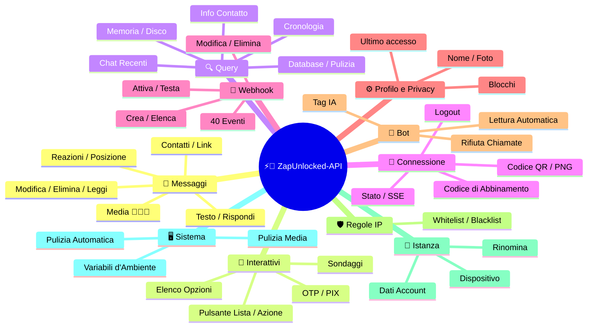
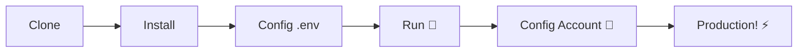

# ⚡💬 [ZapUnlocked-API](https://zapunlocked-api.kauafpss.com.br/)


<p align="center">
  
  <a href="https://downgit.github.io/#/home?url=https://github.com/kauafpssx/ZapUnlocked-API/blob/main/ZapUnlocked.collection.json">
    
  </a>
  
  
  
</p>

---

### 🌐 Seleziona Lingua:

<table width="100%">
  <tr>
    <td align="center" valign="middle"><a href="https://github.com/kauafpssx/ZapUnlocked-API/blob/main/README.md"></a></td>
    <td align="center" valign="middle"><a href="https://github.com/kauafpssx/ZapUnlocked-API/blob/main/docs/translations/en.md"></a></td>
    <td align="center" valign="middle"><a href="https://github.com/kauafpssx/ZapUnlocked-API/blob/main/docs/translations/es.md"></a></td>
    <td align="center" valign="middle"><a href="https://github.com/kauafpssx/ZapUnlocked-API/blob/main/docs/translations/fr.md"></a></td>
    <td align="center" valign="middle"><a href="https://github.com/kauafpssx/ZapUnlocked-API/blob/main/docs/translations/de.md"></a></td>
    <td align="center" valign="middle"><a href="https://github.com/kauafpssx/ZapUnlocked-API/blob/main/docs/translations/zh.md"></a></td>
    <td align="center" valign="middle"><a href="https://github.com/kauafpssx/ZapUnlocked-API/blob/main/docs/translations/ja.md"></a></td>
    <td align="center" valign="middle"><a href="https://github.com/kauafpssx/ZapUnlocked-API/blob/main/docs/translations/ru.md"></a></td>
    <td align="center" valign="middle"><a href="https://github.com/kauafpssx/ZapUnlocked-API/blob/main/docs/translations/ar.md"></a></td>
    <td align="center" valign="middle"><a href="https://github.com/kauafpssx/ZapUnlocked-API/blob/main/docs/translations/tr.md"></a></td>
    <td align="center" valign="middle"><a href="https://github.com/kauafpssx/ZapUnlocked-API/blob/main/docs/translations/ko.md"></a></td>
    <td align="center" valign="middle"><a href="https://github.com/kauafpssx/ZapUnlocked-API/blob/main/docs/translations/hi.md"></a></td>
    <td align="center" valign="middle"><a href="https://github.com/kauafpssx/ZapUnlocked-API/blob/main/docs/translations/nl.md"></a></td>
  </tr>
</table>

---

##  Cos'è ZapUnlocked-API?

Il mercato delle API per WhatsApp applica canoni mensili esorbitanti: decine o centinaia di euro al mese, con limiti di utilizzo, commissioni per conversazione e dati che passano attraverso server di terze parti. **ZapUnlocked-API esiste per cambiare questa situazione.**

Costruita in **Python** con **[Neonize](https://github.com/krypton-byte/neonize)** come motore di connessione, questa API offre una semplice interfaccia REST (FastAPI) per gestire sessioni, inviare media complessi e creare interazioni intelligenti. **Niente database pesante, niente canone mensile, nessuna dipendenza da terzi.**

La nostra proposta si fonda sull'**eccellenza tecnica** e sull'**indipendenza dello sviluppatore**. Crediamo che gli strumenti potenti debbano essere accessibili a chi costruisce le proprie soluzioni.

> [!TIP]
> Perfetto per sviluppatori che cercano agilità nell'integrazione di bot, notifiche e sistemi di assistenza automatizzati. **Senza pagare nulla.**

---

## 🗺️ Panoramica dell'API




---

## ✨ Funzionalità in Evidenza

| Funzionalità | Descrizione |
| :----------- | :---------- |
| 🧩 **Pulsanti Stateless** | Crea flussi interattivi senza database, con webhook crittografati |
| 🔢 **Abbinamento senza QR** | Connettiti tramite codice numerico · ideale per server senza GUI |
| 🎵 **Conversione Audio Automatica** | Invia audio che appaiono come registrati (PTT) nativamente |
| 📦 **Coda Media Intelligente** | Gestione automatica per evitare consumo eccessivo di memoria |
| 🏷️ **Placeholder Dinamici** | Personalizza messaggi e webhook con `{{name}}`, `{{phone}}` |

> [!NOTE]
> Tutte le funzionalità sono **100% gratuite** e mantenute dalla comunità open-source.

---

## 📋 Rotte dell'API

<details>
<summary><b>📨 Invio Messaggi</b> · 15 endpoint</summary>

| Metodo | Rotta | Descrizione | Body |
| :----- | :---- | :---------- | :--- |
| `POST` | `/send` | Invia messaggio di testo / rispondi | `phone`, `message` |
| `POST` | `/send_image` | Invia immagine | `phone`, `image_url` |
| `POST` | `/send_video` | Invia video (supporta GIF e PTV) | `phone`, `video_url` |
| `POST` | `/send_audio` | Invia audio (con conversione automatica PTT) | `phone`, `audio_url` |
| `POST` | `/send_document` | Invia documento | `phone`, `document_url` |
| `POST` | `/send_sticker` | Invia adesivo | `phone`, `sticker_url` |
| `POST` | `/send_reaction` | Invia reazione con emoji | `phone`, `messageId`, `emoji` |
| `POST` | `/send_location` | Invia posizione | `phone`, `lat`, `lng` |
| `POST` | `/send_contact` | Invia contatto | `phone`, `name`, `contactPhone` |
| `POST` | `/send_contacts` | Invia contatti multipli | `phone`, `contacts` |
| `POST` | `/send_link` | Invia link con anteprima | `phone`, `url` |
| `POST` | `/messages/delete` | Elimina messaggio | `phone`, `messageId` |
| `POST` | `/messages/read` | Segna come letto | `phone`, `messageIds` |
| `POST` | `/messages/edit` | Modifica messaggio inviato | `phone`, `messageId`, `message` |
</details>

<details>
<summary><b>🔘 Messaggi Interattivi</b> · 7 endpoint</summary>

| Metodo | Rotta | Descrizione | Body |
| :----- | :---- | :---------- | :--- |
| `POST` | `/messages/send-button-list` | Invia lista pulsanti | `phone`, `buttons` |
| `POST` | `/messages/send-button-actions` | Invia pulsanti azione | `phone`, `buttons` |
| `POST` | `/messages/send-button-otp` | Invia pulsante OTP | `phone`, `code` |
| `POST` | `/messages/send-button-pix` | Invia pulsante PIX | `phone`, `pixKey` |
| `POST` | `/messages/send-option-list` | Invia elenco opzioni | `phone`, `buttons` |
| `POST` | `/messages/send-poll` | Invia sondaggio | `phone`, `name`, `options` |
| `POST` | `/messages/send-poll-vote` | Vota nel sondaggio | `phone`, `options` |
</details>

<details>
<summary><b>🔍 Query e Gestione</b> · 8 endpoint</summary>

| Metodo | Rotta | Descrizione | Body |
| :----- | :---- | :---------- | :--- |
| `POST` | `/management/fetch_messages` | Recupera cronologia messaggi | `phone` |
| `POST` | `/management/recent_contacts` | Elenca chat recenti | ❌ |
| `GET` | `/management/memory` | Stato utilizzo memoria | ❌ |
| `GET` | `/management/volume_stats` | Verifica utilizzo disco | ❌ |
| `GET` | `/management/database/status` | Stato e statistiche del database | ❌ |
| `POST` | `/management/database/config` | Configurazione del database | `interval` |
| `POST` | `/management/database/cleanup` | Pulizia manuale del database | ❌ |
| `DELETE` | `/management/cleanup` | Pulizia forzata della coda messaggi | ❌ |
</details>

<details>
<summary><b>📇 Contatti</b> · 1 endpoint</summary>

| Metodo | Rotta | Descrizione | Body |
| :----- | :---- | :---------- | :--- |
| `POST` | `/contacts/info` | Informazioni dettagliate del contatto | `phone` |
</details>

<details>
<summary><b>🏠 Generale</b> · 3 endpoint</summary>

| Metodo | Rotta | Descrizione | Body |
| :----- | :---- | :---------- | :--- |
| `GET` | `/` | Pagina di benvenuto (HTML) | ❌ |
| `GET` | `/status` | Stato connessione e sessione | ❌ |
| `GET` | `/status/stream` | Stato in tempo reale (SSE) | ❌ |
</details>

<details>
<summary><b>🔗 Connessione (QR)</b> · 2 endpoint</summary>

| Metodo | Rotta | Descrizione | Body |
| :----- | :---- | :---------- | :--- |
| `GET` | `/qr` | Visualizza codice QR interattivo | ❌ |
| `GET` | `/qr/image` | Ottieni immagine QR (Base64) | ❌ |
</details>

<details>
<summary><b>🔐 Sessione</b> · 2 endpoint</summary>

| Metodo | Rotta | Descrizione | Body |
| :----- | :---- | :---------- | :--- |
| `POST` | `/session/pair` | Genera codice di abbinamento numerico | `phone` |
| `POST` | `/session/logout` | Disconnetti e resetta sessione | ❌ |
</details>

<details>
<summary><b>📡 Webhook (CRUD)</b> · 8 endpoint</summary>

| Metodo | Rotta | Descrizione | Body |
| :----- | :---- | :---------- | :--- |
| `POST` | `/webhooks` | Crea webhook nominato | `name`, `url` |
| `GET` | `/webhooks` | Elenca tutti i webhook | ❌ |
| `GET` | `/webhooks/{name}` | Ottieni webhook per nome | ❌ |
| `PUT` | `/webhooks/{name}` | Modifica webhook | ❌ |
| `DELETE` | `/webhooks/{name}` | Rimuovi webhook | ❌ |
| `POST` | `/webhooks/{name}/toggle` | Attiva / disattiva | `active` |
| `POST` | `/webhooks/{name}/test` | Testa webhook | ❌ |
| `GET` | `/webhooks/events` | Elenca tipi di evento (40 tipi) | ❌ |
</details>

<details>
<summary><b>⚙️ Profilo e Privacy</b> · 3 endpoint</summary>

| Metodo | Rotta | Descrizione | Body |
| :----- | :---- | :---------- | :--- |
| `POST` | `/settings/profile` | Modifica nome e foto del bot | ❌ |
| `POST` | `/settings/privacy` | Regola privacy (ultimo accesso, ecc.) | ❌ |
| `POST` | `/settings/block` | Blocca / sblocca contatto | `phone`, `action` |
</details>

<details>
<summary><b>🤖 Impostazioni Bot</b> · 6 endpoint</summary>

| Metodo | Rotta | Descrizione | Body |
| :----- | :---- | :---------- | :--- |
| `GET` | `/settings/bot` | Visualizza impostazioni bot | ❌ |
| `POST` | `/settings/bot` | Aggiorna impostazioni (tag IA, controllo IP) | ❌ |
| `PUT` | `/settings/instance/call-reject-auto` | Rifiuta chiamate automaticamente | `value` |
| `PUT` | `/settings/instance/call-reject-message` | Messaggio di chiamata rifiutata | `value` |
| `PUT` | `/settings/instance/auto-read-message` | Lettura automatica dei messaggi | `value` |
| `GET` | `/settings/phone-code/{phone}` | Genera codice tramite numero di telefono | ❌ |
</details>

<details>
<summary><b>📱 Istanza</b> · 3 endpoint</summary>

| Metodo | Rotta | Descrizione | Body |
| :----- | :---- | :---------- | :--- |
| `GET` | `/instance/me` | Dati dell'account connesso | ❌ |
| `GET` | `/instance/device` | Dati tecnici del dispositivo | ❌ |
| `PUT` | `/instance/update-name` | Rinomina istanza | `name` |
</details>

<details>
<summary><b>🛡️ Regole IP</b> · 5 endpoint</summary>

| Metodo | Rotta | Descrizione | Body |
| :----- | :---- | :---------- | :--- |
| `GET` | `/settings/ip-rules` | Visualizza regole IP | ❌ |
| `POST` | `/settings/ip-rules/whitelist` | Aggiungi IP alla whitelist | `ip` |
| `POST` | `/settings/ip-rules/blacklist` | Aggiungi IP alla blacklist | `ip` |
| `DELETE` | `/settings/ip-rules/whitelist/{ip}` | Rimuovi IP dalla whitelist | ❌ |
| `DELETE` | `/settings/ip-rules/blacklist/{ip}` | Rimuovi IP dalla blacklist | ❌ |
</details>

<details>
<summary><b>🖥️ Sistema</b> · 5 endpoint</summary>

| Metodo | Rotta | Descrizione | Body |
| :----- | :---- | :---------- | :--- |
| `GET` | `/system/env` | Visualizza variabili d'ambiente | ❌ |
| `PUT` | `/system/env` | Aggiorna variabili d'ambiente | ❌ |
| `POST` | `/system/cleanup/force` | Pulizia forzata dei media temporanei | ❌ |
| `GET` | `/system/cleanup/settings` | Visualizza impostazioni pulizia automatica | ❌ |
| `PUT` | `/system/cleanup/settings` | Aggiorna intervallo pulizia automatica | ❌ |
</details>

> **Totale: 68 endpoint**

---

## 📡 Eventi Webhook

Tutti i webhook ricevono una busta standard:

```json
{
  "event": "message.text",
  "timestamp": "2025-01-01T12:00:00Z",
  "data": { ... }
}
```

Se il webhook ha un `body` personalizzato con `{{placeholders}}`, quel body viene inviato al posto della busta standard.


---

<details>
<summary><b>🏷️ Placeholder disponibili nel body personalizzato</b></summary>

| Placeholder | Valore |
| :---------- | :----- |
| `{{from}}` | Numero del mittente |
| `{{text}}` | Testo del messaggio |
| `{{phone}}` | Uguale a `{{from}}` |
| `{{id}}` | ID del messaggio |
| `{{requested}}` | Quantità richiesta (fetchMessages) |
| `{{found}}` | Quantità trovata (fetchMessages) |
| `{{timestamp}}` | Timestamp UTC corrente |

</details>

---


<details>
<summary><b>📥 Messaggi Ricevuti</b> · 16 eventi</summary>

Campi base presenti negli eventi di messaggio ricevuto:

```json
{
  "messageId": "3EB0ABCDEF123456",
  "from": "5511999999999",
  "fromName": "João Silva",
  "fromJid": "5511999999999@s.whatsapp.net",
  "isGroup": false
}
```

<details>
<summary><code>message.text</code> - Testo semplice / formattato</summary>

```json
{
  "event": "message.text",
  "data": {
    "...base": "...",
    "text": "Olá! Como posso ajudar?",
    "quoted": { "id": "3EB0...", "fromMe": true }
  }
}
```
</details>

<details>
<summary><code>message.image</code> - Immagine ricevuta</summary>

```json
{
  "event": "message.image",
  "data": {
    "...base": "...",
    "caption": "Foto do produto",
    "mimetype": "image/jpeg",
    "fileLength": 204800
  }
}
```
</details>

<details>
<summary><code>message.video</code> - Video ricevuto</summary>

```json
{
  "event": "message.video",
  "data": {
    "...base": "...",
    "caption": "Veja esse vídeo!",
    "mimetype": "video/mp4",
    "fileLength": 5242880,
    "isPTT": false,
    "isGif": false
  }
}
```
</details>

<details>
<summary><code>message.audio</code> - Audio / nota vocale</summary>

```json
{
  "event": "message.audio",
  "data": {
    "...base": "...",
    "mimetype": "audio/ogg; codecs=opus",
    "fileLength": 30720,
    "isPTT": true,
    "durationSeconds": 8
  }
}
```
</details>

<details>
<summary><code>message.document</code> - Documento / file</summary>

```json
{
  "event": "message.document",
  "data": {
    "...base": "...",
    "fileName": "contrato.pdf",
    "caption": "Segue o contrato",
    "mimetype": "application/pdf",
    "fileLength": 102400
  }
}
```
</details>

<details>
<summary><code>message.sticker</code> - Sticker</summary>

```json
{
  "event": "message.sticker",
  "data": {
    "...base": "...",
    "mimetype": "image/webp",
    "isAnimated": false
  }
}
```
</details>

<details>
<summary><code>message.contact</code> - Contatto condiviso</summary>

```json
{
  "event": "message.contact",
  "data": {
    "...base": "...",
    "displayName": "Maria Souza",
    "vcard": "BEGIN:VCARD\nVERSION:3.0\n..."
  }
}
```
</details>

<details>
<summary><code>message.location</code> - Posizione</summary>

```json
{
  "event": "message.location",
  "data": {
    "...base": "...",
    "lat": -23.5505,
    "lng": -46.6333,
    "name": "Av. Paulista",
    "address": "Av. Paulista, 1000 - São Paulo"
  }
}
```
</details>

<details>
<summary><code>message.reaction</code> - Reazione (emoji)</summary>

```json
{
  "event": "message.reaction",
  "data": {
    "...base": "...",
    "emoji": "❤️",
    "targetMessageId": "3EB0ABCDEF123456",
    "isRemoved": false
  }
}
```
</details>

<details>
<summary><code>message.poll_created</code> - Sondaggio ricevuto</summary>

```json
{
  "event": "message.poll_created",
  "data": {
    "...base": "...",
    "pollName": "Qual o melhor sabor?",
    "options": ["Chocolate", "Morango", "Baunilha"]
  }
}
```
</details>

<details>
<summary><code>message.poll_vote</code> - Voto nel sondaggio</summary>

```json
{
  "event": "message.poll_vote",
  "data": {
    "...base": "...",
    "pollId": "3EB0ABCDEF123456",
    "selectedOptions": ["Chocolate"]
  }
}
```
</details>

<details>
<summary><code>message.button_reply</code> - Click su pulsante</summary>

```json
{
  "event": "message.button_reply",
  "data": {
    "...base": "...",
    "buttonId": "opcao_sim",
    "displayText": "Sim",
    "type": "quick_reply"
  }
}
```
</details>

<details>
<summary><code>message.list_reply</code> - Selezione in lista interattiva</summary>

```json
{
  "event": "message.list_reply",
  "data": {
    "...base": "...",
    "rowId": "1",
    "title": "X-Burguer",
    "description": "R$ 18,90"
  }
}
```
</details>

<details>
<summary><code>message.deleted</code> - Messaggio eliminato dal mittente</summary>

```json
{
  "event": "message.deleted",
  "data": {
    "...base": "..."
  }
}
```
</details>

<details>
<summary><code>message.unknown</code> - Tipo non mappato</summary>

```json
{
  "event": "message.unknown",
  "data": {
    "...base": "...",
    "rawType": "senderKeyDistributionMessage"
  }
}
```
</details>

<details>
<summary><code>message.undecryptable</code> - Messaggio non decifrabile</summary>

```json
{
  "event": "message.undecryptable",
  "data": {
    "...base": "...",
    "reason": "missing_decryption_key"
  }
}
```
</details>

</details>

<details>
<summary><b>📤 Messaggi Inviati</b> · 4 eventi</summary>

<details>
<summary><code>message.sent</code> - Messaggio inviato (manuale)</summary>

```json
{
  "event": "message.sent",
  "data": {
    "to": "5511999999999",
    "type": "text",
    "messageId": "3EB0ABCDEF123456"
  }
}
```
</details>

<details>
<summary><code>message.read</code> - Messaggio letto dal destinatario</summary>

```json
{
  "event": "message.read",
  "data": {
    "from": "5511999999999",
    "messageId": "3EB0ABCDEF123456"
  }
}
```
</details>

<details>
<summary><code>message.delivered</code> - Messaggio consegnato al destinatario (receipt type 1)</summary>

```json
{
  "event": "message.delivered",
  "data": {
    "from": "5511999999999",
    "messageId": "3EB0ABCDEF123456"
  }
}
```
</details>

<details>
<summary><code>message.receipt</code> - Altre conferme di consegna (receipt types 2, 3, 5+)</summary>

```json
{
  "event": "message.receipt",
  "data": {
    "from": "5511999999999",
    "messageId": "3EB0ABCDEF123456",
    "receiptType": 2
  }
}
```
</details>

</details>

<details>
<summary><b>🔗 Connessione</b> · 11 eventi</summary>

<details>
<summary><code>connection.connected</code> - WhatsApp connesso</summary>

```json
{
  "event": "connection.connected",
  "data": {
    "phone": "5511999999999"
  }
}
```
</details>

<details>
<summary><code>connection.disconnected</code> - WhatsApp disconnesso</summary>

```json
{
  "event": "connection.disconnected",
  "data": {}
}
```
</details>

<details>
<summary><code>connection.qr_ready</code> - Codice QR generato</summary>

```json
{
  "event": "connection.qr_ready",
  "data": {
    "qr": "2@abc123..."
  }
}
```
</details>

<details>
<summary><code>connection.pair_code</code> - Codice di abbinamento generato</summary>

```json
{
  "event": "connection.pair_code",
  "data": {
    "code": "ABC123"
  }
}
```
</details>

<details>
<summary><code>connection.pair_status</code> - Stato abbinamento aggiornato</summary>

```json
{
  "event": "connection.pair_status",
  "data": {
    "status": "pairing"
  }
}
```
</details>

<details>
<summary><code>connection.logged_out</code> - Disconnesso dall'esterno</summary>

```json
{
  "event": "connection.logged_out",
  "data": {}
}
```
</details>

<details>
<summary><code>connection.connect_failure</code> - Errore di connessione</summary>

```json
{
  "event": "connection.connect_failure",
  "data": {
    "reason": "network_error"
  }
}
```
</details>

<details>
<summary><code>connection.stream_error</code> - Errore nello stream</summary>

```json
{
  "event": "connection.stream_error",
  "data": {
    "error": "stream_error_description"
  }
}
```
</details>

<details>
<summary><code>connection.temporary_ban</code> - Bando temporaneo</summary>

```json
{
  "event": "connection.temporary_ban",
  "data": {
    "phone": "5511999999999",
    "duration": 300
  }
}
```
</details>

<details>
<summary><code>connection.client_outdated</code> - Client obsoleto</summary>

```json
{
  "event": "connection.client_outdated",
  "data": {
    "message": "Please update your WhatsApp client"
  }
}
```
</details>

<details>
<summary><code>connection.stream_replaced</code> - Stream sostituito</summary>

```json
{
  "event": "connection.stream_replaced",
  "data": {}
}
```
</details>

</details>

<details>
<summary><b>👥 Gruppo</b> · 2 eventi</summary>

<details>
<summary><code>group.join</code> - Nuovo membro nel gruppo</summary>

```json
{
  "event": "group.join",
  "data": {
    "groupId": "123456789-123456@g.us",
    "who": "5511999999999",
    "author": "5511888888888"
  }
}
```
</details>

<details>
<summary><code>group.update</code> - Aggiornamento gruppo</summary>

```json
{
  "event": "group.update",
  "data": {
    "groupId": "123456789-123456@g.us",
    "action": "subject_change",
    "value": "Nuovo Nome Gruppo"
  }
}
```
</details>

</details>

<details>
<summary><b>👤 Contatto / Presenza</b> · 4 eventi</summary>

<details>
<summary><code>contact.presence</code> - Stato presenza cambiato</summary>

```json
{
  "event": "contact.presence",
  "data": {
    "from": "5511999999999@s.whatsapp.net",
    "presence": "available"
  }
}
```
</details>

<details>
<summary><code>contact.chat_presence</code> - Presenza chat cambiata</summary>

```json
{
  "event": "contact.chat_presence",
  "data": {
    "from": "5511999999999@s.whatsapp.net",
    "chatPresence": "composing",
    "media": 0
  }
}
```
</details>

<details>
<summary><code>contact.picture_change</code> - Foto profilo cambiata</summary>

```json
{
  "event": "contact.picture_change",
  "data": {
    "from": "5511999999999@s.whatsapp.net",
    "profilePic": "base64_encoded_image"
  }
}
```
</details>

<details>
<summary><code>contact.identity_change</code> - Identità contatto cambiata</summary>

```json
{
  "event": "contact.identity_change",
  "data": {
    "from": "5511999999999@s.whatsapp.net",
    "oldIdentity": "abc123",
    "newIdentity": "def456"
  }
}
```
</details>

</details>

<details>
<summary><b>📞 Chiamata</b> · 3 eventi</summary>

<details>
<summary><code>call.received</code> - Chiamata ricevuta</summary>

```json
{
  "event": "call.received",
  "data": {
    "from": "5511999999999",
    "fromJid": "5511999999999@s.whatsapp.net",
    "callId": "ABC123DEF456"
  }
}
```
</details>

<details>
<summary><code>call.accepted</code> - Chiamata accettata</summary>

```json
{
  "event": "call.accepted",
  "data": {
    "from": "5511999999999",
    "fromJid": "5511999999999@s.whatsapp.net",
    "callId": "ABC123DEF456"
  }
}
```
</details>

<details>
<summary><code>call.terminated</code> - Chiamata terminata</summary>

```json
{
  "event": "call.terminated",
  "data": {
    "from": "5511999999999",
    "fromJid": "5511999999999@s.whatsapp.net",
    "callId": "ABC123DEF456",
    "reason": "timeout"
  }
}
```
</details>

</details>

---

## 🛠️ Installazione e Hosting

> Metti online la tua API WhatsApp professionale in meno di **5 minuti** con **ZapUnlocked-API**.

### 💻 Installazione Locale

Ideale per sviluppo, test o esecuzione su server proprio.



**1. Clona il Repository**

```bash
git clone https://github.com/kauafpssx/ZapUnlocked-API.git
cd ZapUnlocked-API
```

**2. Installa le Dipendenze**

| Sistema | Comando |
| :------ | :------ |
| 🪟 Windows | `scripts\install\install.bat` |
| 🐧 Linux / macOS | `bash scripts/install/install.sh` |

**3. Configura l'Ambiente**

| Sistema | Comando |
| :------ | :------ |
| 🪟 Windows | `scripts\generate-env\generate-env.bat` |
| 🐧 Linux / macOS | `bash scripts/generate-env/generate-env.sh` |

| Variabile | Descrizione |
| :-------- | :---------- |
| `API_KEY` | Password per l'autenticazione su tutti gli endpoint |
| `INTERNAL_SECRET` | Token per validare le firme dei webhook |
| `PORT` | Porta dell'API (default: `8300`) |

**4. Esegui l'API**

| Sistema | Comando |
| :------ | :------ |
| 🪟 Windows | `scripts\run\run.bat` |
| 🐧 Linux / macOS | `bash scripts/run/run.sh` |

---

### ☁️ Hosting: Alwaysdata (Gratuito 24/7)

**Alwaysdata** è l'opzione consigliata per ospitare l'API in modo stabile e gratuito senza dover mantenere un server acceso.

#### 📊 Risorse del Piano Free

| Risorsa | Disponibile nel Free |
| :------ | :------------------- |
| 💾 Archiviazione | **1 GB SSD** |
| 🧠 RAM | **256 MB** |
| ⚡ CPU | **1/4 vCPU** |
| 🔄 Backup | **3 giorni** automatico |
| 📡 Uptime | **24/7** tramite Services |

#### 👣 Passo dopo Passo per il Deploy

**1.** Crea il tuo account su [Alwaysdata.com](https://www.alwaysdata.com/) · piano **Free**.

**2.** Accedi via SSH: `https://ssh-[utente].alwaysdata.net`.

**3.** Clona e installa:

```bash
git clone https://github.com/kauafpssx/ZapUnlocked-API.git ~/ZapUnlocked-API
cd ~/ZapUnlocked-API
bash scripts/install/install.sh
```

**4.** *(Opzionale)* Genera il `.env`:

```bash
bash scripts/generate-env/generate-env.sh
```

> [!NOTE]
> Lo script di installazione chiede già se si desidera configurare il `.env`. Se hai risposto **sì**, questo passaggio può essere saltato. Altrimenti, esegui il comando sopra o configura il `.env` manualmente.

**5.** Configura il Servizio (24/7) in **Advanced · Services · Add a service**:

| Campo | Valore |
| :---- | :----- |
| **Command** | `bash scripts/run/run.sh` |
| **Working directory** | `ZapUnlocked-API` |
| **Environment variables** | `PORT=8300` |

**6.** URL di accesso:

```
http://services-[utente].alwaysdata.net:8300/
```

> [!TIP]
> L'URL è già accessibile esternamente. *(Opzionale)* Per usare un dominio personalizzato, configura un **Reverse Proxy** in **Web · Sites · Add a site** puntando a `http://[utente].alwaysdata.net`.

---

## 🔐 Autenticazione (Login)

Dopo il deploy, connetti il tuo account WhatsApp accedendo nel browser:

```text
http://services-[utente].alwaysdata.net:8300/qr?API_KEY=YOUR_SECRET_KEY
```

---

## 📖 Documentazione Ufficiale

<p align="center">
  👉 <a href="https://zapunlocked-api.kauafpss.com.br"><strong>zapunlocked-api.kauafpss.com.br</strong></a>
</p>

Per documentazione tecnica dettagliata, esempi di codice e playground interattivo, visita il nostro sito ufficiale.

> [!TIP]
> Usa **LLMs.txt** come indice per l'IA: [`zapunlocked-api.kauafpss.com.br/llms.txt`](https://zapunlocked-api.kauafpss.com.br/llms.txt). Scopri tutte le pagine prima di esplorare.

---

## ❤️ Crediti e Riconoscimenti

| Progetto | Descrizione |
| :------- | :---------- |
| [](https://github.com/krypton-byte/neonize) | Libreria Python per connessione nativa a WhatsApp Web |
| [](https://github.com/tulir/whatsmeow) | Libreria Go alla base di Neonize · il cuore della connessione |
| [](https://www.alwaysdata.com/) | Infrastruttura gratuita di alta qualità |

---

## 📄 Licenza

Questo progetto è concesso in licenza sotto la **Licenza MIT**.

<p align="center">
  Fatto con 💜 da <a href="https://www.instagram.com/kauafpss_/">Kauã Ferreira</a>
</p>