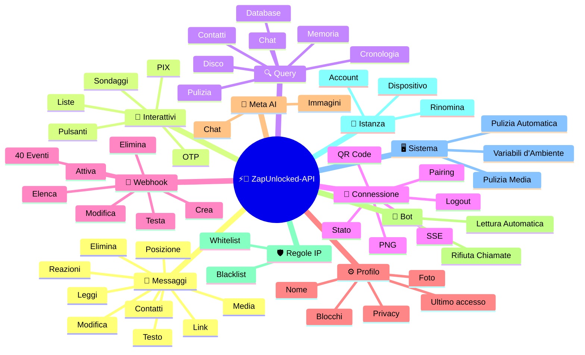
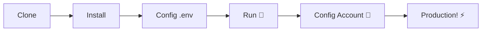

# ⚡💬 [ZapUnlocked-API](https://zapunlocked-api.kauafpss.com.br/)


<p align="center">
  
  <a href="https://downgit.github.io/#/home?url=https://github.com/kauafpssx/ZapUnlocked-API/blob/main/ZapUnlocked.collection.json">
    
  </a>
  
  
  
</p>

---

### 🌐 Seleziona Lingua:

<table width="100%">
  <tr>
    <td align="center" valign="middle"><a href="https://github.com/kauafpssx/ZapUnlocked-API/blob/main/README.md"></a></td>
    <td align="center" valign="middle"><a href="https://github.com/kauafpssx/ZapUnlocked-API/blob/main/docs/translations/en.md"></a></td>
    <td align="center" valign="middle"><a href="https://github.com/kauafpssx/ZapUnlocked-API/blob/main/docs/translations/es.md"></a></td>
    <td align="center" valign="middle"><a href="https://github.com/kauafpssx/ZapUnlocked-API/blob/main/docs/translations/fr.md"></a></td>
    <td align="center" valign="middle"><a href="https://github.com/kauafpssx/ZapUnlocked-API/blob/main/docs/translations/de.md"></a></td>
    <td align="center" valign="middle"><a href="https://github.com/kauafpssx/ZapUnlocked-API/blob/main/docs/translations/zh.md"></a></td>
    <td align="center" valign="middle"><a href="https://github.com/kauafpssx/ZapUnlocked-API/blob/main/docs/translations/ja.md"></a></td>
    <td align="center" valign="middle"><a href="https://github.com/kauafpssx/ZapUnlocked-API/blob/main/docs/translations/ru.md"></a></td>
    <td align="center" valign="middle"><a href="https://github.com/kauafpssx/ZapUnlocked-API/blob/main/docs/translations/ar.md"></a></td>
    <td align="center" valign="middle"><a href="https://github.com/kauafpssx/ZapUnlocked-API/blob/main/docs/translations/tr.md"></a></td>
    <td align="center" valign="middle"><a href="https://github.com/kauafpssx/ZapUnlocked-API/blob/main/docs/translations/ko.md"></a></td>
    <td align="center" valign="middle"><a href="https://github.com/kauafpssx/ZapUnlocked-API/blob/main/docs/translations/hi.md"></a></td>
    <td align="center" valign="middle"><a href="https://github.com/kauafpssx/ZapUnlocked-API/blob/main/docs/translations/nl.md"></a></td>
  </tr>
</table>

---

##  Cos'è ZapUnlocked-API?

Il mercato delle API per WhatsApp applica canoni mensili esorbitanti: decine o centinaia di euro al mese, con limiti di utilizzo, commissioni per conversazione e dati che passano attraverso server di terze parti. **ZapUnlocked-API è gratuito e open-source.**

Costruita in **Python** con **[Neonize](https://github.com/krypton-byte/neonize)** come motore di connessione, la API usa FastAPI per gestire sessioni, inviare media e creare bot. Nessun database pesante, nessun canone mensile, nessun server di terze parti.

> [!TIP]
> Usa per bot, notificazioni e sistemi di assistenza clienti. **100% gratuito.**

> [!IMPORTANT]
> 🤖 **Meta AI integrato.** Usa `/ai/ask` per conversare e `/ai/imagine` per generare immagini dentro WhatsApp. [Vedi rotta](#-meta-ai--2-endpoints).

---

## 🗺️ Panoramica dell'API



---

## ✨ Funzionalità in Evidenza

| Funzionalità | Descrizione |
| :------------- | :-------- |
| 🧩 **Pulsanti Stateless** | Crea flussi interattivi senza database, con webhook crittografati |
| 🔢 **Abbinamento senza QR Code** | Connettiti tramite codice numerico · ideale per server senza GUI |
| 🎵 **Conversione Audio Automatica** | Invia audio che appaiono come registrati (PTT) nativamente |
| 📦 **Coda Media Intelligente** | Gestione automatica per evitare consumo eccessivo di memoria |
| 🏷️ **Placeholder Dinamici** | Personalizza messaggi e webhook con `{{name}}`, `{{day}}`, `{{phone}}` |
| 🤖 **Meta AI** | Conversa e genera immagini con l'IA dentro WhatsApp. |
| ⌨️ **Parametri Universali** | `delay_message`, `delay_typing`, `reply`/`quoted_id` e `@menzioni` funzionano su **ogni** endpoint di invio. |
| 🔐 **Webhook Firmati** | Integrità via HMAC-SHA256. Il tuo webhook accetta solo dati legittimi. |
| 🔄 **Riconnessione Automatica** | Si riconnette automaticamente in caso di disconnessione, logout remoto o errore di stream. |
| 📁 **Carica File + URL** | Invia media tramite upload diretto **o** URL pubblico. |

> [!NOTE]
> Tutte le funzionalità sono **100% gratuite** e mantenute dalla comunità open-source.

---

## 📋 Rotte dell'API

<details>
<summary><b>📨 Invio Messaggi</b> · 15 endpoint</summary>

| Metodo | Rotta | Descrizione | Body |
| :----- | :--- | :-------- | :--- |
| `POST` | `/send` | Inviare messaggio di testo / rispondere | `phone`, `message` |
| `POST` | `/send_image` | Inviare immagine | `phone`, `image_url` |
| `POST` | `/send_video` | Inviare video (supporta GIF e PTV) | `phone`, `video_url` |
| `POST` | `/send_gif` | Inviare GIF animata | `phone`, `url` |
| `POST` | `/send_audio` | Inviare audio (con conversione automatica per PTT) | `phone`, `audio_url` |
| `POST` | `/send_document` | Inviare documento | `phone`, `document_url` |
| `POST` | `/send_sticker` | Inviare adesivo | `phone`, `sticker_url` |
| `POST` | `/send_reaction` | Inviare reazione con emoji | `phone`, `messageId`, `emoji` |
| `POST` | `/send_location` | Inviare posizione | `phone`, `lat`, `lng` |
| `POST` | `/send_contact` | Inviare contatto | `phone`, `name`, `contactPhone` |
| `POST` | `/send_contacts` | Inviare contatti multipli | `phone`, `contacts` |
| `POST` | `/send_link` | Inviare link con anteprima | `phone`, `url` |
| `POST` | `/messages/delete` | Eliminare messaggio | `phone`, `messageId` |
| `POST` | `/messages/read` | Segnare come letto | `phone`, `messageIds` |
| `POST` | `/messages/edit` | Modificare messaggio inviato | `phone`, `messageId`, `message` |
</details>

> [!TIP]
> **Parametri universali.** Disponibili su **ogni** endpoint di invio messaggi (inclusi interattivi):
>
> | Parametro | Cosa fa |
> | :-------- | :------ |
> | `delay_message` | Aspetta N secondi prima di inviare. |
> | `delay_typing` | Mostra "sta scrivendo..." per N secondi prima di inviare. |
> | `reply` / `quoted_id` | ID del messaggio a cui rispondere (citazione). |
> | `mentioned` | JSON array di numeri da @menzionare. Esempio: `["5511999999999"]` |

<details>
<summary><b>🔘 Messaggi Interattivi</b> · 9 endpoint</summary>

| Metodo | Rotta | Descrizione | Body |
| :----- | :--- | :-------- | :--- |
| `POST` | `/messages/send-button-list` | Pulsante di lista opzioni | `phone`, `buttons` |
| `POST` | `/messages/send-button-quick-reply` | Pulsante di risposta rapida | `phone`, `title`, `buttons` |
| `POST` | `/messages/send-button-otp` | Pulsante di copia (OTP) | `phone`, `code` |
| `POST` | `/messages/send-button-pix` | Pulsante PIX | `phone`, `pixKey` |
| `POST` | `/messages/send-button-url` | Pulsante con link | `phone`, `title`, `url` |
| `POST` | `/messages/send-button-call` | Pulsante di chiamata | `phone`, `title`, `phoneNumber` |
| `POST` | `/messages/send-option-list` | ⛔ **Temporaneamente disabilitata** (incompatibile con iPhone, Android e Web) | `phone`, `buttons` |
| `POST` | `/messages/send-poll` | Inviare sondaggio | `phone`, `name`, `options` |
| `POST` | `/messages/send-poll-vote` | Votare in un sondaggio | `phone`, `options` |
</details>

<details>
<summary><b>🔍 Query e Gestione</b> · 12 endpoint</summary>

| Metodo | Rotta | Descrizione | Body |
| :----- | :--- | :-------- | :--- |
| `POST` | `/management/fetch_messages` | Recuperare cronologia messaggi | `phone` |
| `POST` | `/management/recent_contacts` | Elencare chat recenti | ❌ |
| `GET` | `/management/chats` | Elencare chat con cronologia | ❌ |
| `GET` | `/management/chats/{phone}/messages` | Messaggi di una chat specifica | ❌ |
| `GET` | `/management/contacts/{phone}` | Info dettagliate del contatto | ❌ |
| `GET` | `/management/groups` | Elencare gruppi | ❌ |
| `DELETE` | `/management/cleanup` | Pulire dati chat | ❌ |
| `GET` | `/management/export` | Esportare config (webhooks, settings, IP rules) | ❌ |
| `POST` | `/management/import` | Importare config tramite file upload | `file` |
| `GET` | `/management/database/status` | Stato e statistiche del database | ❌ |
| `POST` | `/management/database/config` | Aggiornare impostazioni database | `interval` |
| `POST` | `/management/database/cleanup` | Pulizia manuale del database | ❌ |
</details>

<details>
<summary><b>👤 Contatti</b> · 1 endpoint</summary>

| Metodo | Rotta | Descrizione | Body |
| :----- | :--- | :-------- | :--- |
| `POST` | `/contacts/info` | Informazioni dettagliate del contatto | `phone` |
</details>

<details>
<summary><b>🏠 Generale / Stato</b> · 9 endpoint</summary>

| Metodo | Rotta | Descrizione | Body |
| :----- | :--- | :-------- | :--- |
| `GET` | `/` | Pagina di benvenuto (HTML) | ❌ |
| `GET` | `/status` | Stato completo (WhatsApp, CPU, memoria, disco) | ❌ |
| `GET` | `/status/stream` | Stato in tempo reale via SSE | ❌ |
| `GET` | `/status/health` | Health check semplice (`{"ok":true}`) | ❌ |
| `GET` | `/status/readiness` | Readiness check (503 se WhatsApp disconnesso) | ❌ |
| `GET` | `/status/memory` | Stato memoria (processo + sistema) | ❌ |
| `GET` | `/status/volume` | Stato disco (dimensione, file) | ❌ |
| `GET` | `/collection.json` | Download della Collection Postman | ❌ |
| `POST` | `/collection.json` | Aggiornare Collection Postman | JSON body |
</details>

<details>
<summary><b>🔗 Connessione (QR)</b> · 2 endpoint</summary>

| Metodo | Rotta | Descrizione | Body |
| :----- | :--- | :-------- | :--- |
| `GET` | `/qr` | Visualizzare QR Code interattivo (HTML) | ❌ |
| `GET` | `/qr/image` | Ottenere immagine del QR Code (PNG) | ❌ |
</details>

<details>
<summary><b>🔐 Sessione</b> · 2 endpoint</summary>

| Metodo | Rotta | Descrizione | Body |
| :----- | :--- | :-------- | :--- |
| `POST` | `/session/pair` | Generare codice di abbinamento numerico | `phone` |
| `POST` | `/session/logout` | Disconnettere e resettare sessione | ❌ |
</details>

<details>
<summary><b>📡 Webhook (CRUD)</b> · 8 endpoint</summary>

| Metodo | Rotta | Descrizione | Body |
| :----- | :--- | :-------- | :--- |
| `POST` | `/webhooks` | Creare webhook nominato | `name`, `url` |
| `GET` | `/webhooks` | Elencare tutti i webhook | ❌ |
| `GET` | `/webhooks/{name}` | Ottenere webhook per nome | ❌ |
| `PUT` | `/webhooks/{name}` | Modificare webhook | ❌ |
| `DELETE` | `/webhooks/{name}` | Rimuovere webhook | ❌ |
| `POST` | `/webhooks/{name}/toggle` | Attivare / disattivare | `active` |
| `POST` | `/webhooks/{name}/test` | Testare webhook | ❌ |
| `GET` | `/webhooks/events` | Elencare tipi di evento (40 tipi) | ❌ |
</details>

<details>
<summary><b>⚙️ Profilo e Privacy</b> · 13 endpoint</summary>

| Metodo | Rotta | Descrizione | Body |
| :----- | :--- | :-------- | :--- |
| `POST` | `/settings/profile` | Modificare nome e foto del bot | `name?`, `photo?` (Form) |
| `POST` | `/settings/block` | Bloccare / sbloccare contatto | `phone`, `action` |
| `PUT` | `/settings/privacy/last-seen` | Ultimo accesso | `value` |
| `PUT` | `/settings/privacy/online` | Stato online | `value` |
| `PUT` | `/settings/privacy/profile` | Visibilità della foto | `value` |
| `PUT` | `/settings/privacy/status` | Visibilità dello stato | `value` |
| `PUT` | `/settings/privacy/read-receipts` | Conferma di lettura | `value` |
| `PUT` | `/settings/privacy/groups-add` | Chi può aggiungere a gruppi | `value` |
| `PUT` | `/settings/privacy/call-add` | Chi può aggiungere in chiamata | `value` |
| `PUT` | `/settings/privacy/about` | About/info | `value?` |
| `PUT` | `/settings/privacy/disappearing-timer` | Timer messaggi temporanei | `value?` |
| `GET` | `/settings/ip-control` | Visualizzare stato IP control | ❌ |
| `PUT` | `/settings/ip-control` | Attivare/disattivare IP control | `enabled` |
</details>

<details>
<summary><b>🤖 Impostazioni del Bot</b> · 4 endpoint</summary>

| Metodo | Rotta | Descrizione | Body |
| :----- | :--- | :-------- | :--- |
| `PUT` | `/settings/instance/call-reject-auto` | Rifiutare chiamate automaticamente | `value` |
| `PUT` | `/settings/instance/call-reject-message` | Messaggio di chiamata rifiutata | `value` |
| `PUT` | `/settings/instance/auto-read-message` | Lettura automatica dei messaggi | `value` |
| `GET` | `/settings/phone-code/{phone}` | Generare codice di abbinamento per numero | ❌ |
</details>

<details>
<summary><b>📱 Istanza</b> · 3 endpoint</summary>

| Metodo | Rotta | Descrizione | Body |
| :----- | :--- | :-------- | :--- |
| `GET` | `/instance/me` | Dati dell'account connesso | ❌ |
| `GET` | `/instance/device` | Dati tecnici del dispositivo | ❌ |
| `PUT` | `/instance/update-name` | Rinominare istanza | `name` |
</details>

<details>
<summary><b>🛡️ Regole IP</b> · 5 endpoint</summary>

| Metodo | Rotta | Descrizione | Body |
| :----- | :--- | :-------- | :--- |
| `GET` | `/settings/ip-rules` | Elencare regole IP (whitelist/blacklist) | ❌ |
| `POST` | `/settings/ip-rules/whitelist` | Aggiungere IP alla whitelist | `ip` |
| `POST` | `/settings/ip-rules/blacklist` | Aggiungere IP alla blacklist | `ip` |
| `DELETE` | `/settings/ip-rules/whitelist/{ip}` | Rimuovere IP dalla whitelist | ❌ |
| `DELETE` | `/settings/ip-rules/blacklist/{ip}` | Rimuovere IP dalla blacklist | ❌ |
</details>

<details>
<summary><b>🖥️ Sistema</b> · 5 endpoint</summary>

| Metodo | Rotta | Descrizione | Body |
| :----- | :--- | :-------- | :--- |
| `GET` | `/system/env` | Visualizzare variabili d'ambiente | ❌ |
| `PUT` | `/system/env` | Aggiornare variabili d'ambiente | ❌ |
| `POST` | `/system/cleanup/force` | Pulizia forzata dei media temporanei | ❌ |
| `GET` | `/system/cleanup/settings` | Visualizzare impostazioni pulizia automatica | ❌ |
| `PUT` | `/system/cleanup/settings` | Aggiornare intervallo pulizia automatica | ❌ |
</details>

<details>
<summary><b>📊 Log</b> · 3 endpoint</summary>

| Metodo | Rotta | Descrizione | Body |
| :----- | :--- | :-------- | :--- |
| `GET` | `/logs/files` | Elencare file di log | ❌ |
| `GET` | `/logs` | Visualizzare log con filtri | ❌ |
| `POST` | `/logs/cleanup` | Forzare compressione/pulizia log | ❌ |
</details>

<details>
<summary><b>📈 Statistiche</b> · 6 endpoint</summary>

| Metodo | Rotta | Descrizione | Body |
| :----- | :--- | :-------- | :--- |
| `GET` | `/stats` | Statistiche (uptime, messaggi, webhook) | ❌ |
| `DELETE` | `/stats` | Resettare statistiche | ❌ |
| `GET` | `/stats/webhooks` | Statistiche di tutti i webhook | ❌ |
| `GET` | `/stats/webhooks/{name}` | Statistiche di un webhook specifico | ❌ |
| `DELETE` | `/stats/webhooks` | Resettare statistiche di tutti i webhook | ❌ |
| `DELETE` | `/stats/webhooks/{name}` | Resettare statistiche di un webhook | ❌ |
</details>

<details>
<summary><b>🤖 Meta AI</b> · 2 endpoint</summary>

| Metodo | Rotta | Descrizione | Body |
| :----- | :--- | :-------- | :--- |
| `POST` | `/ai/ask` | Chiedere a Meta AI | `message` |
| `POST` | `/ai/imagine` | Generare immagine con Meta AI | `prompt` |
</details>

<details>
<summary><b>🔐 Multi-Sessione</b> · 7 endpoint</summary>

| Metodo | Rotta | Descrizione | Body |
| :----- | :--- | :-------- | :--- |
| `GET` | `/sessions` | Elencare tutte le sessioni | ❌ |
| `POST` | `/sessions` | Creare nuova sessione | `name?` |
| `PUT` | `/sessions/{id}/rename` | Rinominare sessione | `name` |
| `DELETE` | `/sessions/{id}` | Disattivare sessione | ❌ |
| `POST` | `/sessions/{id}/connect` | Connettere sessione | ❌ |
| `POST` | `/sessions/{id}/disconnect` | Disconnettere sessione | ❌ |
| `GET` | `/sessions/{id}/status` | Stato della sessione | ❌ |
</details>

<details>
<summary><b>📡 Webhook (Log)</b> · 3 endpoint</summary>

| Metodo | Rotta | Descrizione | Body |
| :----- | :--- | :-------- | :--- |
| `GET` | `/webhooks/{name}/logs` | Log di consegna del webhook | ❌ |
| `DELETE` | `/webhooks/{name}/logs` | Pulire log del webhook | ❌ |
| `DELETE` | `/webhooks/logs/all` | Pulire log di tutti i webhook | ❌ |
</details>

> **Totale: 108 endpoint**

---

## 📡 Eventi Webhook

Tutti i webhook ricevono un envelope standard:

```json
{
  "event": "message.text",
  "timestamp": "2025-01-01T12:00:00Z",
  "data": { ... }
}
```

Se il webhook ha un `body` personalizzato con `{{placeholders}}`, quel body viene inviato al posto dell'envelope standard.

---

<details>
<summary><b>🏷️ Placeholder disponibili nel body personalizzato</b></summary>

| Placeholder | Valore |
| :---------- | :---- |
| `{{from}}` | Numero del mittente |
| `{{text}}` | Testo del messaggio |
| `{{phone}}` | Uguale a `{{from}}` |
| `{{id}}` | ID del messaggio |
| `{{requested}}` | Quantità richiesta (fetchMessages) |
| `{{found}}` | Quantità trovata (fetchMessages) |
| `{{timestamp}}` | Timestamp UTC corrente |

</details>

---

<details>
<summary><b>📥 Messaggi Ricevuti</b> · 18 eventi</summary>

> **Media fields:** Eventi media (`message.image`, `message.video`, `message.audio`, `message.document`, `message.sticker`) includono campi extra quando `RECEIVE_MEDIA_ENABLED=true`: `mediaBase64` (base64 del file), `fileName`, `mimeType`, `mediaTooLarge` (bool: true quando supera `RECEIVE_MEDIA_MAX_SIZE_MB`).

Campi base presenti negli eventi di messaggio ricevuto:

```json
{
  "messageId": "3EB0ABCDEF123456",
  "from": "5511999999999",
  "fromName": "João Silva",
  "fromJid": "5511999999999@s.whatsapp.net",
  "isGroup": false
}
```

<details>
<summary><code>message.text</code> - Testo semplice / formattato</summary>

```json
{
  "event": "message.text",
  "data": {
    "...base": "...",
    "text": "Ciao! Come posso aiutare?",
    "quoted": { "id": "3EB0...", "fromMe": true }
  }
}
```
</details>

<details>
<summary><code>message.image</code> - Immagine ricevuta</summary>

```json
{
  "event": "message.image",
  "data": {
    "...base": "...",
    "caption": "Foto del prodotto",
    "mimetype": "image/jpeg",
    "fileLength": 204800
  }
}
```
</details>

<details>
<summary><code>message.video</code> - Video ricevuto</summary>

```json
{
  "event": "message.video",
  "data": {
    "...base": "...",
    "caption": "Guarda questo video!",
    "mimetype": "video/mp4",
    "fileLength": 5242880,
    "isPTT": false,
    "isGif": false
  }
}
```
</details>

<details>
<summary><code>message.audio</code> - Audio / nota vocale</summary>

```json
{
  "event": "message.audio",
  "data": {
    "...base": "...",
    "mimetype": "audio/ogg; codecs=opus",
    "fileLength": 30720,
    "isPTT": true,
    "durationSeconds": 8
  }
}
```
</details>

<details>
<summary><code>message.document</code> - Documento / file</summary>

```json
{
  "event": "message.document",
  "data": {
    "...base": "...",
    "fileName": "contratto.pdf",
    "caption": "Allego il contratto",
    "mimetype": "application/pdf",
    "fileLength": 102400
  }
}
```
</details>

<details>
<summary><code>message.sticker</code> - Adesivo</summary>

```json
{
  "event": "message.sticker",
  "data": {
    "...base": "...",
    "mimetype": "image/webp",
    "isAnimated": false
  }
}
```
</details>

<details>
<summary><code>message.contact</code> - Contatto condiviso</summary>

```json
{
  "event": "message.contact",
  "data": {
    "...base": "...",
    "displayName": "Maria Souza",
    "vcard": "BEGIN:VCARD\nVERSION:3.0\n..."
  }
}
```
</details>

<details>
<summary><code>message.contacts</code> - Contatti multipli</summary>

```json
{
  "event": "message.contacts",
  "data": {
    "...base": "...",
    "displayName": "2 contatti",
    "count": 2,
    "contacts": [
      { "displayName": "Maria Souza", "vcard": "BEGIN:VCARD\n..." },
      { "displayName": "João Silva", "vcard": "BEGIN:VCARD\n..." }
    ]
  }
}
```
</details>

<details>
<summary><code>message.location</code> - Posizione</summary>

```json
{
  "event": "message.location",
  "data": {
    "...base": "...",
    "lat": -23.5505,
    "lng": -46.6333,
    "name": "Via Paulista",
    "address": "Via Paulista, 1000 - San Paolo"
  }
}
```
</details>

<details>
<summary><code>message.reaction</code> - Reazione (emoji)</summary>

```json
{
  "event": "message.reaction",
  "data": {
    "...base": "...",
    "emoji": "❤️",
    "targetMessageId": "3EB0ABCDEF123456",
    "isRemoved": false
  }
}
```
</details>

<details>
<summary><code>message.poll_created</code> - Sondaggio ricevuto</summary>

```json
{
  "event": "message.poll_created",
  "data": {
    "...base": "...",
    "pollName": "Qual è il gusto migliore?",
    "options": ["Cioccolato", "Fragola", "Vaniglia"]
  }
}
```
</details>

<details>
<summary><code>message.poll_vote</code> - Voto in un sondaggio</summary>

```json
{
  "event": "message.poll_vote",
  "data": {
    "...base": "...",
    "pollId": "3EB0ABCDEF123456",
    "selectedOptions": ["Cioccolato"]
  }
}
```
</details>

<details>
<summary><code>message.button_reply</code> - Click su pulsante</summary>

```json
{
  "event": "message.button_reply",
  "data": {
    "...base": "...",
    "buttonId": "opzione_si",
    "displayText": "Sì",
    "type": "quick_reply"
  }
}
```
</details>

<details>
<summary><code>message.list_reply</code> - Selezione in lista interattiva</summary>

```json
{
  "event": "message.list_reply",
  "data": {
    "...base": "...",
    "rowId": "1",
    "title": "X-Burger",
    "description": "€ 18,90"
  }
}
```
</details>

<details>
<summary><code>message.deleted</code> - Messaggio eliminato dal mittente</summary>

```json
{
  "event": "message.deleted",
  "data": {
    "...base": "..."
  }
}
```
</details>

<details>
<summary><code>message.unknown</code> - Tipo non mappato</summary>

```json
{
  "event": "message.unknown",
  "data": {
    "...base": "...",
    "rawType": "senderKeyDistributionMessage"
  }
}
```
</details>

<details>
<summary><code>message.undecryptable</code> - Messaggio non decifrabile</summary>

```json
{
  "event": "message.undecryptable",
  "data": {
    "...base": "..."
  }
}
```
</details>

</details>

<details>
<summary><b>📤 Messaggi Inviati</b> · 22 eventi</summary>

<details>
<summary><code>message.sent</code> - Messaggio inviato (generico)</summary>

```json
{
  "event": "message.sent",
  "data": {
    "to": "5511999999999",
    "type": "text",
    "messageId": "3EB0ABCDEF123456"
  }
}
```
</details>

<details>
<summary><code>message.sent.{type}</code> - Evento specifico per tipo</summary>

Stesso payload di `message.sent`, ma con evento specifico. Utile per sottoscrivere un singolo tipo di invio.

Tipi: `text`, `image`, `audio`, `video`, `document`, `sticker`, `gif`, `interactive`, `list`, `poll`, `poll_vote`, `location`, `contact`, `contacts`, `link`, `reaction`, `edit`, `delete`

```json
{
  "event": "message.sent.image",
  "data": {
    "to": "5511999999999",
    "type": "image",
    "messageId": "3EB0ABCDEF123456"
  }
}
```
</details>

<details>
<summary><code>message.delivered</code> - Messaggio consegnato al destinatario (receipt type 1)</summary>

```json
{
  "event": "message.delivered",
  "data": {
    "from": "5511999999999",
    "messageId": "3EB0ABCDEF123456"
  }
}
```
</details>

<details>
<summary><code>message.read</code> - Messaggio letto dal destinatario (receipt type 4)</summary>

```json
{
  "event": "message.read",
  "data": {
    "from": "5511999999999",
    "messageId": "3EB0ABCDEF123456"
  }
}
```
</details>

<details>
<summary><code>message.receipt</code> - Altri tipi di conferma (receipt types 2, 3, 5+)</summary>

```json
{
  "event": "message.receipt",
  "data": {
    "from": "5511999999999",
    "messageId": "3EB0ABCDEF123456",
    "receiptType": 2
  }
}
```
</details>

</details>

<details>
<summary><b>🔗 Connessione</b> · 11 eventi</summary>

<details>
<summary><code>connection.connected</code> - WhatsApp connesso</summary>

```json
{
  "event": "connection.connected",
  "data": {
    "phone": "5511999999999"
  }
}
```
</details>

<details>
<summary><code>connection.disconnected</code> - WhatsApp disconnesso</summary>

```json
{
  "event": "connection.disconnected",
  "data": {}
}
```
</details>

<details>
<summary><code>connection.qr_ready</code> - QR Code generato</summary>

```json
{
  "event": "connection.qr_ready",
  "data": {
    "qr": "2@abc123..."
  }
}
```
</details>

<details>
<summary><code>connection.pair_code</code> - Codice di abbinamento generato</summary>

```json
{
  "event": "connection.pair_code",
  "data": {
    "code": "ABCD-1234",
    "connected": false
  }
}
```

`connected: true` quando l'abbinamento è completato.
</details>

<details>
<summary><code>connection.pair_status</code> - Stato dell'abbinamento</summary>

```json
{
  "event": "connection.pair_status",
  "data": {
    "jid": "5511999999999@s.whatsapp.net",
    "businessName": "My Business",
    "platform": "WEB",
    "status": "OK",
    "error": ""
  }
}
```
</details>

<details>
<summary><code>connection.logged_out</code> - Sessione terminata da remoto</summary>

```json
{
  "event": "connection.logged_out",
  "data": {
    "reason": "User logout"
  }
}
```
</details>

<details>
<summary><code>connection.connect_failure</code> - Errore di connessione</summary>

```json
{
  "event": "connection.connect_failure",
  "data": {
    "reason": "ERROR_CONNECT",
    "message": "Connection timed out"
  }
}
```
</details>

<details>
<summary><code>connection.stream_error</code> - Errore nello stream</summary>

```json
{
  "event": "connection.stream_error",
  "data": {
    "code": "STREAM_ERR"
  }
}
```
</details>

<details>
<summary><code>connection.temporary_ban</code> - Ban temporaneo</summary>

```json
{
  "event": "connection.temporary_ban",
  "data": {
    "code": "BAN_CODE",
    "expire": 1704153600
  }
}
```
</details>

<details>
<summary><code>connection.client_outdated</code> - Client obsoleto</summary>

```json
{
  "event": "connection.client_outdated",
  "data": {}
}
```
</details>

<details>
<summary><code>connection.stream_replaced</code> - Stream sostituito</summary>

```json
{
  "event": "connection.stream_replaced",
  "data": {}
}
```
</details>

</details>

<details>
<summary><b>👥 Gruppo</b> · 2 eventi</summary>

<details>
<summary><code>group.join</code> - Il bot è entrato nel gruppo</summary>

```json
{
  "event": "group.join",
  "data": {
    "groupId": "123456789@g.us",
    "groupName": "My Group",
    "reason": "invite",
    "type": ""
  }
}
```
</details>

<details>
<summary><code>group.update</code> - Gruppo aggiornato</summary>

```json
{
  "event": "group.update",
  "data": {
    "groupId": "123456789@g.us",
    "sender": "5511999999999@s.whatsapp.net",
    "name": "New Group Name",
    "topic": "New description",
    "locked": false,
    "announce": false,
    "ephemeral": 604800,
    "delete": false,
    "link": null,
    "unlink": null,
    "newInviteLink": "https://chat.whatsapp.com/abc123"
  }
}
```
</details>

</details>

<details>
<summary><b>👤 Contatto / Presenza</b> · 4 eventi</summary>

<details>
<summary><code>contact.presence</code> - Stato di presenza del contatto</summary>

```json
{
  "event": "contact.presence",
  "data": {
    "from": "5511999999999",
    "fromJid": "5511999999999@s.whatsapp.net",
    "status": "online",
    "lastSeen": 0
  }
}
```

`status`: `"online"` o `"offline"`.
</details>

<details>
<summary><code>contact.chat_presence</code> - Stato di digitazione</summary>

```json
{
  "event": "contact.chat_presence",
  "data": {
    "from": "5511999999999",
    "fromJid": "5511999999999@s.whatsapp.net",
    "state": "typing",
    "media": null
  }
}
```

`state`: `"typing"`, `"recording"` o `"paused"`.
</details>

<details>
<summary><code>contact.picture_change</code> - Foto profilo cambiata</summary>

```json
{
  "event": "contact.picture_change",
  "data": {
    "from": "5511999999999",
    "fromJid": "5511999999999@s.whatsapp.net",
    "author": "5511999999999@s.whatsapp.net",
    "action": "changed"
  }
}
```

`action`: `"changed"` o `"removed"`.
</details>

<details>
<summary><code>contact.identity_change</code> - Chiave di sicurezza cambiata</summary>

```json
{
  "event": "contact.identity_change",
  "data": {
    "from": "5511999999999",
    "fromJid": "5511999999999@s.whatsapp.net",
    "implicit": false,
    "timestamp": 1704067200
  }
}
```
</details>

</details>

<details>
<summary><b>📞 Chiamata</b> · 3 eventi</summary>

<details>
<summary><code>call.received</code> - Chiamata ricevuta</summary>

```json
{
  "event": "call.received",
  "data": {
    "from": "5511999999999",
    "fromJid": "5511999999999@s.whatsapp.net",
    "callId": "ABC123DEF456"
  }
}
```
</details>

<details>
<summary><code>call.accepted</code> - Chiamata accettata</summary>

```json
{
  "event": "call.accepted",
  "data": {
    "from": "5511999999999",
    "callId": "ABC123DEF456"
  }
}
```
</details>

<details>
<summary><code>call.terminated</code> - Chiamata terminata</summary>

```json
{
  "event": "call.terminated",
  "data": {
    "from": "5511999999999",
    "callId": "ABC123DEF456",
    "reason": "timeout"
  }
}
```
</details>

</details>

<details>
<summary><b>🧹 Media Cleanup</b> · 1 evento</summary>

<details>
<summary><code>media.cleanup.completed</code> - Pulizia automatica dei media eseguita</summary>

```json
{
  "event": "media.cleanup.completed",
  "data": {
    "filesRemoved": 12,
    "remainingBytes": 52428800
  }
}
```

Eseguito ogni ora automaticamente. `filesRemoved: 0` quando non è stato rimosso nulla.
</details>

</details>

<details>
<summary><b>🤖 AI</b> · 1 evento</summary>

<details>
<summary><code>ai.response</code> - Risposta di Meta AI ricevuta</summary>

```json
{
  "event": "ai.response",
  "data": {
    "text": "Brasilia!",
    "hasImage": false,
    "imageBase64": null,
    "imageUrl": null,
    "mimeType": null,
    "messageId": "3EB0ABCDEF123456"
  }
}
```

Sempre attivato quando Meta AI risponde. Utilizzare quando è necessario gestire risposte asincrone (il `POST /ai/ask` ha un timeout di 30s).
</details>

</details>

---

## 🛠️ Installazione e Hosting

> Avvia la tua API WhatsApp in meno di **5 minuti** con **ZapUnlocked-API**.

### 💻 Installazione Locale

Ideale per sviluppo, test o esecuzione su server proprio.



**1. Clona il Repository**

```bash
git clone https://github.com/kauafpssx/ZapUnlocked-API.git
cd ZapUnlocked-API
```

**2. Installa le Dipendenze**

| Sistema | Comando |
| :------ | :------ |
| 🪟 Windows | `scripts\install\install.bat` |
| 🐧 Linux / macOS | `bash scripts/install/install.sh` |

**3. Configura l'Ambiente**

| Sistema | Comando |
| :------ | :------ |
| 🪟 Windows | `scripts\generate-env\generate-env.bat` |
| 🐧 Linux / macOS | `bash scripts/generate-env/generate-env.sh` |

| Variabile | Descrizione |
| :------- | :-------- |
| `API_KEY` | Password per l'autenticazione su tutti gli endpoint |
| `INTERNAL_SECRET` | Token per validare le firme dei webhook |
| `PORT` | Porta dell'API (default: `8300`) |

**4. Esegui l'API**

| Sistema | Comando |
| :------ | :------ |
| 🪟 Windows | `scripts\run\run.bat` |
| 🐧 Linux / macOS | `bash scripts/run/run.sh` |

---

### ☁️ Hosting: Alwaysdata (Gratuito 24/7)

Usa **Alwaysdata** per ospitare l'API gratuitamente 24/7.

<details>
<summary><b>📊 Vedi Risorse e Passo Dopo Passo</b></summary>

#### 📊 Risorse del Piano Free

| Risorsa | Disponibile nel Free |
| :------ | :----------------- |
| 💾 Archiviazione | **1 GB SSD** |
| 🧠 RAM | **256 MB** |
| ⚡ CPU | **1/4 vCPU** |
| 🔄 Backup | **3 giorni** automatico |
| 📡 Uptime | **24/7** tramite Services |

#### 👣 Passo dopo Passo per il Deploy

**1.** Crea il tuo account su [Alwaysdata.com](https://www.alwaysdata.com/) · piano **Free**.

**2.** Accedi via SSH: `https://ssh-[utente].alwaysdata.net`.

**3.** Clona e installa:

```bash
git clone https://github.com/kauafpssx/ZapUnlocked-API.git ~/ZapUnlocked-API
cd ~/ZapUnlocked-API
bash scripts/install/install.sh
```

**4.** *(Opzionale)* Genera il `.env`:

```bash
bash scripts/generate-env/generate-env.sh
```

> [!NOTE]
> Lo script di installazione chiede se configurare il `.env`. Se hai risposto **sì**, salta questo passaggio. Altrimenti, esegui il comando sopra o configura il `.env` manualmente.

**5.** Configura il Servizio (24/7) in **Advanced › Services › Add a service**:

| Campo | Valore |
| :---- | :---- |
| **Command** | `bash scripts/run/run.sh` |
| **Working directory** | `ZapUnlocked-API` |
| **Environment variables** | `PORT=8300` |

**6.** Accedi tramite:

```
http://services-[utente].alwaysdata.net:8300/
```

> [!TIP]
> L'URL è accessibile esternamente. *(Opzionale)* Per usare un dominio personalizzato, configura un **Reverse Proxy** in **Web › Sites › Add a site** puntando a `http://[utente].alwaysdata.net`.

---

#### 🔐 Autenticazione (Login)

Dopo il deploy, connetti il tuo account WhatsApp accedendo nel browser:

```text
http://services-[utente].alwaysdata.net:8300/qr?API_KEY=LA_TUA_PASSWORD_SEGRETA
```

</details>

---

<details>
<summary><b>📌 Altre Informazioni</b> · Variabili d'ambiente, fuso orario, parametri d'invio, bulk, ricevitore media</summary>

### 🌐 Variabili d'Ambiente Complete

Variabili extra del `.env` oltre a `API_KEY`, `INTERNAL_SECRET` e `PORT`:

| Variabile | Predefinito | Descrizione |
| :------- | :----- | :-------- |
| `PUBLIC_URL` | auto | URL pubblica per il link della dashboard `/qr` nei log |
| `TZ` | `UTC` | Fuso orario per timestamp (es. `America/Sao_Paulo`) |
| `DRY_RUN` | `false` | Modalità test, intercetta invii senza chiamare WhatsApp |
| `RECEIVE_MEDIA_ENABLED` | `false` | Scarica automaticamente i media ricevuti in `temp_media/` |
| `RECEIVE_MEDIA_MAX_SIZE_MB` | `15` | Dimensione massima media ricevuti (MB) |
| `CORS_ORIGINS` | `*` | Origini consentite (separate da virgola) |
| `ENABLE_WHATSAPP` | `1` | Disabilita il bot WhatsApp (`0` per test) |
| `ENABLE_FFMPEG_WARMUP` | `1` | Disabilita il riscaldamento FFmpeg (`0`) |
| `MAX_UPLOAD_SIZE_MB` | `500` | Dimensione massima upload per file |
| `CLEANUP_MAX_AGE_DAYS` | `7` | Età massima file in `temp_media/` |
| `CLEANUP_MAX_SIZE_MB` | `500` | Dimensione totale massima di `temp_media/` |
| `LOG_MAX_AGE_DAYS` | `30` | Età massima log compressi |
| `LOG_MAX_SIZE_MB` | `50` | Dimensione totale massima log |
| `META_AI_PHONE` | auto | Sovrascrive il numero Meta AI |
| `META_AI_TIMEOUT` | `30` | Timeout risposta Meta AI (secondi) |
| `META_AI_KEEP_IMAGES` | `false` | Salva immagini Meta AI su disco |
| `ALWAYSDATA_ACCOUNT` | auto | Forza ambiente Alwaysdata |

---

### 🕐 Fuso Orario (Timezone)

Ogni endpoint d'invio restituisce `timestamp` in ISO 8601 con offset. Configurazione per priorità:

1. `timezone.conf` nella radice del progetto (prima riga non commentata)
2. `TZ` in `.env` o variabile d'ambiente
3. Predefinito: `UTC`

Valori comuni: `America/Sao_Paulo`, `America/New_York`, `Europe/London`, `Asia/Tokyo`.

```json
{
  "success": true,
  "message": "Message sent.",
  "messageId": "3EB0ABCDEF123456",
  "timestamp": "2026-06-15T14:30:00-0300"
}
```

---

### ✏️ Formattazione Dinamica del Testo

Placeholder sostituiti al momento dell'invio:

| Placeholder | Sostituito da |
| :---------- | :-------------- |
| `{{day}}` | Giorno corrente (01-31) |
| `{{mon}}` | Mese corrente (01-12) |
| `{{yea}}` | Anno corrente (2026) |
| `{{hou}}` | Ora corrente (00-23) |
| `{{min}}` | Minuto corrente (00-59) |
| `{{sec}}` | Secondo corrente (00-59) |

```json
{
  "phone": "5511999999999",
  "message": "Oggi è il {{day}}/{{mon}}/{{yea}} e sono le {{hou}}:{{min}}:{{sec}}"
}
```

Risultato: `"Oggi è il 15/06/2026 e sono le 14:30:00"`

---

### 🧪 Modalità DRY_RUN

`DRY_RUN=true` in `.env` fa sì che tutti gli endpoint d'invio restituiscano successo senza chiamare WhatsApp. La risposta include `"dryRun": true`, `"messageId": null`.

Usi: test d'integrazione, CI/CD, validazione payload.

```json
{
  "success": true,
  "dryRun": true,
  "message": "Message sent.",
  "messageId": null,
  "timestamp": "2026-06-15T14:30:00-0300"
}
```

---

### ⚙️ Parametri Opzionali degli Endpoint d'Invio

Disponibili su tutti gli endpoint `/send/*`, `/send/media`, `/send/buttons/*`:

| Parametro | Tipo | Descrizione |
| :-------- | :--- | :-------- |
| `quoted_id` | `string` | ID del messaggio a cui rispondere |
| `delay_message` | `number` | Ritardo in secondi prima dell'invio |
| `delay_typing` | `number` | Simula digitazione per X secondi |
| `mentioned` | `string[]` | Numeri da menzionare (@mention) |

```json
{
  "phone": "5511999999999",
  "message": "Ciao @5511888888888!",
  "quoted_id": "3EB0ABC123",
  "delay_message": 2,
  "delay_typing": 3,
  "mentioned": ["5511888888888"]
}
```

> [!NOTE]
> `quoted_id` accetta ID del messaggio (`type: "id"`) o testo da cercare (`type: "text"`). Se l'ID non esiste nella cronologia locale, l'API crea un placeholder e WhatsApp visualizza comunque la citazione.

---

### 📦 Invio in Lotto (Bulk Send)

`POST /send/bulk` invia lo stesso messaggio a più numeri:

| Parametro | Tipo | Obbligatorio | Descrizione |
| :-------- | :--- | :---------- | :-------- |
| `phones` | `string[]` | ✅ | Array di numeri |
| `message` | `string` | ✅ | Testo del messaggio |
| `delay_message` | `number` | ❌ | Ritardo prima di ogni invio |
| `delay_typing` | `number` | ❌ | Simula digitazione |
| `delay_between` | `number` | ❌ | Ritardo tra un numero e l'altro |
| `mentioned` | `string[]` | ❌ | Menzioni |

```json
{
  "phones": ["5511999999999", "5511888888888", "5511777777777"],
  "message": "Offerta lampo! 🔥",
  "delay_between": 3,
  "delay_typing": 2
}
```

---

### 📥 Ricevitore Media

Con `RECEIVE_MEDIA_ENABLED=true`, l'API scarica i media ricevuti (immagine, video, audio, documento, sticker) e aggiunge `mediaUrl` al webhook:

```json
{
  "event": "message.upsert",
  "data": {
    "key": { "remoteJid": "5511999999999@s.whatsapp.net" },
    "message": { "imageMessage": {} },
    "mediaUrl": "http://services-utente.alwaysdata.net:8300/media/uuid-file.jpg"
  }
}
```

I file vengono salvati in `temp_media/` e puliti dal pianificatore automatico.

---

### 🧹 Pulizia Automatica (temp_media)

La pulizia di `temp_media/` viene eseguita ogni ora. Si attiva quando viene raggiunto qualsiasi criterio:

* File più vecchi di `CLEANUP_MAX_AGE_DAYS` (predefinito: 7 giorni)
* La dimensione totale supera `CLEANUP_MAX_SIZE_MB` (predefinito: 500 MB)

Attiva il webhook `media.cleanup.completed` con `filesRemoved` e `remainingBytes`.

</details>

---

## 📖 Documentazione Ufficiale

<p align="center">
  👉 <a href="https://zapunlocked-api.kauafpss.com.br"><strong>zapunlocked-api.kauafpss.com.br</strong></a>
</p>

Per documentazione tecnica dettagliata, esempi di codice e playground interattivo, visita il nostro sito ufficiale.

> [!TIP]
> Usa **LLMs.txt** come indice per l'IA: [`zapunlocked-api.kauafpss.com.br/llms.txt`](https://zapunlocked-api.kauafpss.com.br/llms.txt). Leggi tutte le pagine prima di consultare l'API.

---

## ❤️ Crediti e Riconoscimenti

| Progetto | Descrizione |
| :------ | :-------- |
| [](https://github.com/krypton-byte/neonize) | Libreria Python per connessione nativa a WhatsApp Web |
| [](https://github.com/tulir/whatsmeow) | Libreria Go alla base di Neonize · il cuore della connessione |
| [](https://www.alwaysdata.com/) | Infrastruttura gratuita di alta qualità |

---

## 📄 Licenza

Questo progetto è concesso in licenza sotto la **Licenza MIT**.

<p align="center">
  Fatto con 💜 da <a href="https://www.instagram.com/kauafpss_/">Kauã Ferreira</a>
</p>
