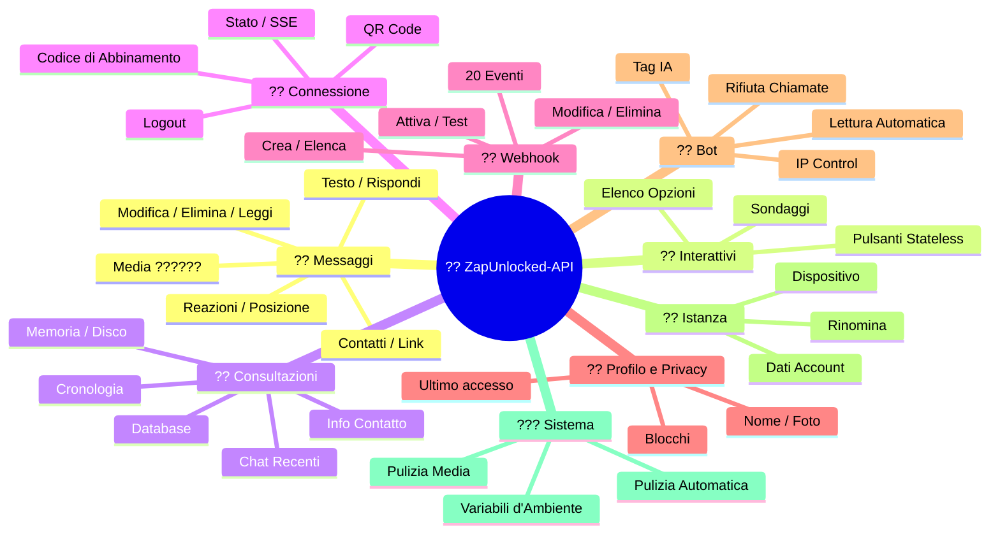
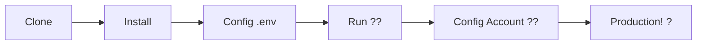

# ?? [ZapUnlocked-API](https://zapunlocked-api.kauafpss.com.br) ???


<p align="center">
  
  
  
  
  
</p>

<table width="100%">
  <tr>
    <td align="center" valign="middle"><a href="https://github.com/kauafpssx/ZapUnlocked-API/blob/main/README.md"></a></td>
    <td align="center" valign="middle"><a href="https://github.com/kauafpssx/ZapUnlocked-API/blob/main/docs/translations/en.md"></a></td>
    <td align="center" valign="middle"><a href="https://github.com/kauafpssx/ZapUnlocked-API/blob/main/docs/translations/es.md"></a></td>
    <td align="center" valign="middle"><a href="https://github.com/kauafpssx/ZapUnlocked-API/blob/main/docs/translations/fr.md"></a></td>
    <td align="center" valign="middle"><a href="https://github.com/kauafpssx/ZapUnlocked-API/blob/main/docs/translations/de.md"></a></td>
    <td align="center" valign="middle"><a href="https://github.com/kauafpssx/ZapUnlocked-API/blob/main/docs/translations/zh.md"></a></td>
    <td align="center" valign="middle"><a href="https://github.com/kauafpssx/ZapUnlocked-API/blob/main/docs/translations/ja.md"></a></td>
    <td align="center" valign="middle"><a href="https://github.com/kauafpssx/ZapUnlocked-API/blob/main/docs/translations/ru.md"></a></td>
    <td align="center" valign="middle"><a href="https://github.com/kauafpssx/ZapUnlocked-API/blob/main/docs/translations/ar.md"></a></td>
    <td align="center" valign="middle"><a href="https://github.com/kauafpssx/ZapUnlocked-API/blob/main/docs/translations/tr.md"></a></td>
    <td align="center" valign="middle"><a href="https://github.com/kauafpssx/ZapUnlocked-API/blob/main/docs/translations/kr.md"></a></td>
    <td align="center" valign="middle"><a href="https://github.com/kauafpssx/ZapUnlocked-API/blob/main/docs/translations/in.md"></a></td>
    <td align="center" valign="middle"><a href="https://github.com/kauafpssx/ZapUnlocked-API/blob/main/docs/translations/nl.md"></a></td>
  </tr>
</table>

---

##  Cos'è ZapUnlocked-API?

Il mercato delle API per WhatsApp impone canoni mensili esorbitanti: decine o centinaia di euro al mese, con limiti di utilizzo, commissioni per conversazione e dati che transitano su server di terze parti. **ZapUnlocked-API esiste per cambiare tutto questo.**

Costruita in **Python** con **[Neonize](https://github.com/krypton-byte/neonize)** come motore di connessione, questa API offre una semplice interfaccia REST (FastAPI) per gestire sessioni, inviare contenuti multimediali complessi e creare interazioni intelligenti. **Niente database pesante, niente canone mensile, nessuna dipendenza da terzi.**

La nostra proposta si fonda sull'**eccellenza tecnica** e sull'**indipendenza dello sviluppatore**. Crediamo che gli strumenti potenti debbano essere accessibili a chi costruisce le proprie soluzioni.

> [!TIP]
> Perfetto per sviluppatori che cercano agilità nell'integrazione di bot, notifiche e sistemi di assistenza automatizzati. **Senza pagare nulla.**

---

## ??? Panoramica dell'API



---

## ? Funzionalità in Evidenza

| Funzionalità | Descrizione |
| :--- | :--- |
| ?? **Pulsanti Stateless** | Crea flussi interattivi senza database, con webhook crittografati |
| ?? **Abbinamento senza QR Code** | Connettiti tramite codice numerico · ideale per server senza GUI |
| ?? **Conversione Audio Automatica** | Invia audio che appaiono come registrati al momento (PTT) nativamente |
| ?? **Coda Media Intelligente** | Gestione automatica per evitare un consumo eccessivo di memoria |
| ??? **Segnaposto Dinamici** | Personalizza messaggi e webhook con `{{name}}`, `{{day}}`, `{{phone}}` |

> [!NOTE]
> Tutte le funzionalità sono **100% gratuite** e mantenute dalla comunità open-source.

---

## ?? Rotte dell'API

<details>
<summary><b>?? Invio Messaggi</b> · 13 endpoint</summary>

| Metodo | Rotta | Descrizione |
| :----- | :--- | :-------- |
| `POST` | `/send` | Inviare messaggio di testo / rispondere |
| `POST` | `/send_image` | Inviare immagine |
| `POST` | `/send_video` | Inviare video (supporta GIF e PTV) |
| `POST` | `/send_audio` | Inviare audio (con conversione automatica in PTT) |
| `POST` | `/send_document` | Inviare documento |
| `POST` | `/send_sticker` | Inviare adesivo |
| `POST` | `/send_reaction` | Inviare reazione con emoji |
| `POST` | `/send_location` | Inviare posizione |
| `POST` | `/send_contact` | Inviare contatto |
| `POST` | `/send_contacts` | Inviare contatti multipli |
| `POST` | `/send_link` | Inviare link con anteprima |
| `POST` | `/messages/delete` | Eliminare messaggio |
| `POST` | `/messages/read` | Segnare come letto |
| `POST` | `/messages/edit` | Modificare messaggio inviato |
</details>

<details>
<summary><b>?? Messaggi Interattivi</b> · 4 endpoint</summary>

| Metodo | Rotta | Descrizione |
| :----- | :--- | :-------- |
| `POST` | `/send_wbuttons` | Inviare pulsanti (elenco, azione, OTP, PIX) |
| `POST` | `/messages/send-option-list` | Inviare elenco di opzioni |
| `POST` | `/messages/send-poll` | Inviare sondaggio |
| `POST` | `/messages/send-poll-vote` | Votare in un sondaggio |
</details>

<details>
<summary><b>?? Consultazioni e Gestione</b> · 7 endpoint</summary>

| Metodo | Rotta | Descrizione |
| :----- | :--- | :-------- |
| `POST` | `/contacts/info` | Informazioni dettagliate del contatto |
| `POST` | `/management/fetch_messages` | Recuperare cronologia messaggi |
| `POST` | `/management/recent_contacts` | Elencare chat recenti |
| `GET` | `/management/memory` | Stato utilizzo memoria |
| `GET` | `/management/volume_stats` | Verificare utilizzo disco |
| `GET` | `/management/database/status` | Stato e statistiche del database |
| `POST` | `/management/database/cleanup` | Pulizia manuale del database |
</details>

<details>
<summary><b>?? Connessione e Sessione</b> · 8 endpoint</summary>

| Metodo | Rotta | Descrizione |
| :----- | :--- | :-------- |
| `GET` | `/` | Pagina di benvenuto (HTML) |
| `GET` | `/status` | Stato della connessione e sessione |
| `GET` | `/status/stream` | Stato in tempo reale (SSE) |
| `GET` | `/qr` | Visualizzare QR Code interattivo |
| `GET` | `/qr/image` | Ottenere immagine QR Code (Base64) |
| `POST` | `/qr/pair` | Generare codice di abbinamento numerico |
| `GET` | `/settings/phone-code/{phone}` | Generare codice tramite numero |
| `POST` | `/qr/logout` | Disconnettere e resettare sessione |
</details>

<details>
<summary><b>?? Webhook (CRUD)</b> · 7 endpoint</summary>

| Metodo | Rotta | Descrizione |
| :----- | :--- | :-------- |
| `POST` | `/webhooks` | Creare webhook nominato |
| `GET` | `/webhooks` | Elencare tutti i webhook |
| `PUT` | `/webhooks/{name}` | Modificare webhook |
| `DELETE` | `/webhooks/{name}` | Rimuovere webhook |
| `POST` | `/webhooks/{name}/toggle` | Attivare / disattivare |
| `POST` | `/webhooks/{name}/test` | Testare webhook |
| `GET` | `/webhooks/events` | Elencare tipi di evento (20 tipi) |
</details>

<details>
<summary><b>?? Profilo e Privacy</b> · 3 endpoint</summary>

| Metodo | Rotta | Descrizione |
| :----- | :--- | :-------- |
| `POST` | `/settings/profile` | Modificare nome e foto del bot |
| `POST` | `/settings/privacy` | Regolare privacy (ultimo accesso, ecc.) |
| `POST` | `/settings/block` | Bloccare / sbloccare contatto |
</details>

<details>
<summary><b>?? Configurazioni del Bot</b> · 5 endpoint</summary>

| Metodo | Rotta | Descrizione |
| :----- | :--- | :-------- |
| `GET` | `/settings/bot` | Visualizzare configurazioni del bot |
| `POST` | `/settings/bot` | Aggiornare configurazioni (tag IA, IP control) |
| `PUT` | `/settings/instance/call-reject-auto` | Rifiutare chiamate automaticamente |
| `PUT` | `/settings/instance/call-reject-message` | Messaggio di chiamata rifiutata |
| `PUT` | `/settings/instance/auto-read-message` | Lettura automatica dei messaggi |
</details>

<details>
<summary><b>?? Istanza</b> · 3 endpoint</summary>

| Metodo | Rotta | Descrizione |
| :----- | :--- | :-------- |
| `GET` | `/instance/me` | Dati dell'account connesso |
| `GET` | `/instance/device` | Dati tecnici del dispositivo |
| `PUT` | `/instance/update-name` | Rinominare istanza |
</details>

<details>
<summary><b>??? Sistema</b> · 5 endpoint</summary>

| Metodo | Rotta | Descrizione |
| :----- | :--- | :-------- |
| `GET` | `/system/env` | Visualizzare variabili d'ambiente |
| `PUT` | `/system/env` | Aggiornare variabili d'ambiente |
| `POST` | `/system/cleanup/force` | Pulizia forzata dei media temporanei |
| `GET` | `/system/cleanup/settings` | Visualizzare impostazioni pulizia automatica |
| `PUT` | `/system/cleanup/settings` | Aggiornare intervallo pulizia automatica |
</details>

> **Totale: 56 endpoint** · REST completi per l'automazione di WhatsApp.

---

## ??? Installazione e Hosting

> Metti online la tua API WhatsApp professionale in meno di **5 minuti** con **ZapUnlocked-API**.

### ?? Installazione Locale

Ideale per sviluppo, test o esecuzione su server proprio.



**1. Clona il Repository**

```bash
git clone https://github.com/kauafpssx/ZapUnlocked-API.git
cd ZapUnlocked-API
```

**2. Installa le Dipendenze**

| Sistema | Comando |
| :------ | :------ |
| ?? Windows | `scripts\install\install.bat` |
| ?? Linux / macOS | `bash scripts/install/install.sh` |

**3. Configura l'Ambiente**

| Sistema | Comando |
| :------ | :------ |
| ?? Windows | `scripts\generate-env\generate-env.bat` |
| ?? Linux / macOS | `bash scripts/generate-env/generate-env.sh` |

| Variabile | Descrizione |
| :------- | :-------- |
| `API_KEY` | Password per l'autenticazione su tutti gli endpoint |
| `INTERNAL_SECRET` | Token per convalidare le firme dei webhook |
| `PORT` | Porta dell'API (predefinita: `8300`) |

**4. Esegui l'API**

| Sistema | Comando |
| :------ | :------ |
| ?? Windows | `scripts\run\run.bat` |
| ?? Linux / macOS | `bash scripts/run/run.sh` |

---

### ?? Hosting: Alwaysdata (Gratis 24/7)

**Alwaysdata** è l'opzione consigliata per ospitare l'API in modo stabile e gratuito senza dover mantenere un server acceso.

#### ?? Risorse del Piano Free

| Risorsa | Disponibile nel Free |
| :------ | :----------------- |
| ?? Archiviazione | **1 GB SSD** |
| ?? RAM | **256 MB** |
| ? CPU | **1/4 vCPU** |
| ?? Backup | **3 giorni** automatico |
| ?? Uptime | **24/7** tramite Services |

#### ?? Guida Passo Passo per il Deploy

**1.** Crea il tuo account su [Alwaysdata.com](https://www.alwaysdata.com/) · piano **Free**.

**2.** Accedi via SSH: `https://ssh-[usuario].alwaysdata.net`.

**3.** Clona e installa:

```bash
git clone https://github.com/kauafpssx/ZapUnlocked-API.git ~/ZapUnlocked-API
cd ~/ZapUnlocked-API
bash scripts/install/install.sh
```

**4.** Genera il `.env`:

```bash
bash scripts/generate-env/generate-env.sh
```

**5.** Configura il Servizio (24/7) in **Advanced › Services › Add a service**:

| Campo | Valore |
| :---- | :---- |
| **Name** | `ZapUnlocked-API` |
| **Command** | `python3 main.py` |
| **Working directory** | `ZapUnlocked-API` |
| **Environment variables** | `PORT=8300` |

**6.** Accedi tramite:

```
http://services-[usuario].alwaysdata.net:8300/
```

> [!TIP]
> L'URL è già accessibile esternamente. *(Opzionale)* Per utilizzare un dominio personalizzato, configura un **Reverse Proxy** in **Web › Sites › Add a site** puntando a `http://[usuario].alwaysdata.net`.

---

## ?? Autenticazione (Login)

Dopo il deploy, collega il tuo account WhatsApp accedendo nel browser:

```text
http://services-[usuario].alwaysdata.net:8300/qr?API_KEY=SUA_SENHA_SECRETA
```

---

## ?? Documentazione Ufficiale

<p align="center">
  ?? <a href="https://zapunlocked-api.kauafpss.com.br"><strong>zapunlocked-api.kauafpss.com.br</strong></a>
</p>

Per documentazione tecnica dettagliata, esempi di codice e playground interattivo, visita il nostro sito ufficiale.

> [!TIP]
> Usa **LLMs.txt** come indice per l'IA: [`zapunlocked-api.kauafpss.com.br/llms.txt`](https://zapunlocked-api.kauafpss.com.br/llms.txt). Scopri tutte le pagine prima di esplorare.

---

## ?? Crediti e Riconoscimenti

| Progetto | Descrizione |
| :------ | :-------- |
| [](https://github.com/krypton-byte/neonize) | Libreria Python per connessione nativa a WhatsApp Web |
| [](https://github.com/tulir/whatsmeow) | Libreria Go base di Neonize · il cuore della connessione |
| [](https://www.alwaysdata.com/) | Infrastruttura gratuita di alta qualità |

---

## ?? Licenza

Questo progetto è concesso in licenza sotto la **Licenza MIT**.

<p align="center">
  Fatto con ?? da <a href="https://www.instagram.com/kauafpss_/">Kauã Ferreira</a>
</p>

