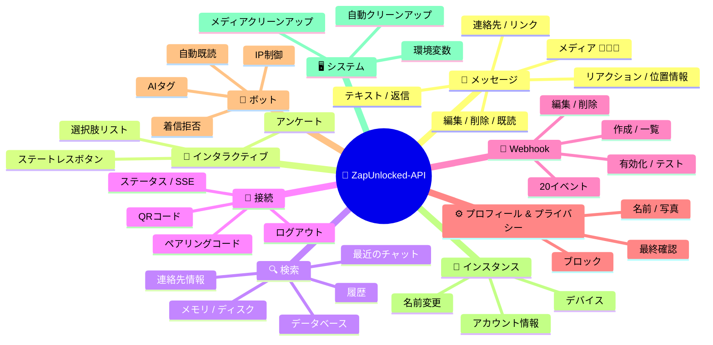
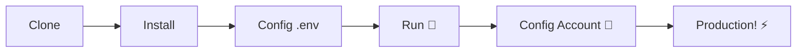

# 🚀 [ZapUnlocked-API](https://zapunlocked-api.kauafpss.com.br) 📲✨


<p align="center">
  
  
  
  
  
</p>

<table width="100%">
  <tr>
    <td align="center" valign="middle"><a href="https://github.com/kauafpssx/ZapUnlocked-API/blob/main/docs/translations/en.md"></a></td>
    <td align="center" valign="middle"><a href="https://github.com/kauafpssx/ZapUnlocked-API/blob/main/docs/translations/es.md"></a></td>
    <td align="center" valign="middle"><a href="https://github.com/kauafpssx/ZapUnlocked-API/blob/main/docs/translations/fr.md"></a></td>
    <td align="center" valign="middle"><a href="https://github.com/kauafpssx/ZapUnlocked-API/blob/main/docs/translations/de.md"></a></td>
    <td align="center" valign="middle"><a href="https://github.com/kauafpssx/ZapUnlocked-API/blob/main/docs/translations/zh.md"></a></td>
    <td align="center" valign="middle"><a href="https://github.com/kauafpssx/ZapUnlocked-API/blob/main/docs/translations/ru.md"></a></td>
    <td align="center" valign="middle"><a href="https://github.com/kauafpssx/ZapUnlocked-API/blob/main/docs/translations/it.md"></a></td>
    <td align="center" valign="middle"><a href="https://github.com/kauafpssx/ZapUnlocked-API/blob/main/docs/translations/ar.md"></a></td>
    <td align="center" valign="middle"><a href="https://github.com/kauafpssx/ZapUnlocked-API/blob/main/docs/translations/tr.md"></a></td>
    <td align="center" valign="middle"><a href="https://github.com/kauafpssx/ZapUnlocked-API/blob/main/docs/translations/kr.md"></a></td>
    <td align="center" valign="middle"><a href="https://github.com/kauafpssx/ZapUnlocked-API/blob/main/docs/translations/in.md"></a></td>
    <td align="center" valign="middle"><a href="https://github.com/kauafpssx/ZapUnlocked-API/blob/main/docs/translations/nl.md"></a></td>
  </tr>
</table>

---

##  ZapUnlocked-API とは？

WhatsApp API市場では月額料金が高額で、数十から数百レアル（R$）もの費用がかかり、使用制限や会話ごとの料金、第三者サーバーを経由するデータなど、多くの問題があります。**ZapUnlocked-APIは、これを変えるためにあります。**

**Python**で構築され、**[Neonize](https://github.com/krypton-byte/neonize)** を接続エンジンとして使用するこのAPIは、シンプルなRESTインターフェース（FastAPI）を提供し、セッション管理、複雑なメディア送信、インテリジェントなインタラクションを実現します。**高負荷なデータベース不要、月額料金不要、誰にも依存しません。**

私たちの提案は、**技術的卓越性**と**開発者の独立性**に基づいています。強力なツールは、独自のソリューションを構築する人々にとってアクセス可能であるべきだと考えています。

> [!TIP]
> ボット統合、通知、自動応答システムの迅速な統合を求める開発者に最適です。**そのために一切の費用はかかりません。**

---

## 🗺️ API概要



---

## ✨ 主な機能

| 機能 | 説明 |
| :--- | :--- |
| 🧩 **ステートレスボタン** | 暗号化されたwebhookを使用して、データベースなしでインタラクティブなフローを作成 |
| 🔢 **QRコードなしペアリング** | 数値コードで接続 · GUIなしサーバーに最適 |
| 🎵 **自動音声変換** | 録音したように表示される音声（PTT）をネイティブで送信 |
| 📦 **スマートメディアキュー** | 過剰なメモリ消費を防ぐ自動管理 |
| 🏷️ **動的プレースホルダー** | `{{name}}`、`{{day}}`、`{{phone}}` でメッセージとwebhookをカスタマイズ |

> [!NOTE]
> すべての機能は**100%無料**で、オープンソースコミュニティによって維持されています。

---

## 📋 APIルート

<details>
<summary><b>📨 メッセージ送信</b> · 13エンドポイント</summary>

| メソッド | ルート | 説明 |
| :----- | :--- | :-------- |
| `POST` | `/send` | テキストメッセージを送信 / 返信 |
| `POST` | `/send_image` | 画像を送信 |
| `POST` | `/send_video` | 動画を送信（GIF・PTV対応） |
| `POST` | `/send_audio` | 音声を送信（PTT自動変換） |
| `POST` | `/send_document` | ドキュメントを送信 |
| `POST` | `/send_sticker` | ステッカーを送信 |
| `POST` | `/send_reaction` | 絵文字リアクションを送信 |
| `POST` | `/send_location` | 位置情報を送信 |
| `POST` | `/send_contact` | 連絡先を送信 |
| `POST` | `/send_contacts` | 複数の連絡先を送信 |
| `POST` | `/send_link` | プレビュー付きリンクを送信 |
| `POST` | `/messages/delete` | メッセージを削除 |
| `POST` | `/messages/read` | 既読にする |
| `POST` | `/messages/edit` | 送信済みメッセージを編集 |
</details>

<details>
<summary><b>🔘 インタラクティブメッセージ</b> · 4エンドポイント</summary>

| メソッド | ルート | 説明 |
| :----- | :--- | :-------- |
| `POST` | `/send_wbuttons` | ボタンを送信（リスト、アクション、OTP、PIX） |
| `POST` | `/messages/send-option-list` | 選択肢リストを送信 |
| `POST` | `/messages/send-poll` | アンケートを送信 |
| `POST` | `/messages/send-poll-vote` | アンケートに投票 |
</details>

<details>
<summary><b>🔍 検索と管理</b> · 7エンドポイント</summary>

| メソッド | ルート | 説明 |
| :----- | :--- | :-------- |
| `POST` | `/contacts/info` | 連絡先の詳細情報 |
| `POST` | `/management/fetch_messages` | メッセージ履歴を取得 |
| `POST` | `/management/recent_contacts` | 最近のチャットを一覧 |
| `GET` | `/management/memory` | メモリ使用状況 |
| `GET` | `/management/volume_stats` | ディスク使用状況を確認 |
| `GET` | `/management/database/status` | データベースのステータスと統計 |
| `POST` | `/management/database/cleanup` | データベースの手動クリーンアップ |
</details>

<details>
<summary><b>🔗 接続とセッション</b> · 8エンドポイント</summary>

| メソッド | ルート | 説明 |
| :----- | :--- | :-------- |
| `GET` | `/` | ウェルカムページ（HTML） |
| `GET` | `/status` | 接続とセッションのステータス |
| `GET` | `/status/stream` | リアルタイムステータス（SSE） |
| `GET` | `/qr` | インタラクティブQRコードを表示 |
| `GET` | `/qr/image` | QRコード画像を取得（Base64） |
| `POST` | `/qr/pair` | 数値ペアリングコードを生成 |
| `GET` | `/settings/phone-code/{phone}` | 電話番号からコードを生成 |
| `POST` | `/qr/logout` | 切断してセッションをリセット |
</details>

<details>
<summary><b>📡 Webhook（CRUD）</b> · 7エンドポイント</summary>

| メソッド | ルート | 説明 |
| :----- | :--- | :-------- |
| `POST` | `/webhooks` | 名前付きWebhookを作成 |
| `GET` | `/webhooks` | すべてのWebhookを一覧 |
| `PUT` | `/webhooks/{name}` | Webhookを編集 |
| `DELETE` | `/webhooks/{name}` | Webhookを削除 |
| `POST` | `/webhooks/{name}/toggle` | 有効化 / 無効化 |
| `POST` | `/webhooks/{name}/test` | Webhookをテスト |
| `GET` | `/webhooks/events` | イベントタイプを一覧（20種類） |
</details>

<details>
<summary><b>⚙️ プロフィールとプライバシー</b> · 3エンドポイント</summary>

| メソッド | ルート | 説明 |
| :----- | :--- | :-------- |
| `POST` | `/settings/profile` | ボットの名前と写真を変更 |
| `POST` | `/settings/privacy` | プライバシーを調整（最終確認など） |
| `POST` | `/settings/block` | 連絡先をブロック / ブロック解除 |
</details>

<details>
<summary><b>🤖 ボット設定</b> · 5エンドポイント</summary>

| メソッド | ルート | 説明 |
| :----- | :--- | :-------- |
| `GET` | `/settings/bot` | ボット設定を表示 |
| `POST` | `/settings/bot` | 設定を更新（AIタグ、IP制御） |
| `PUT` | `/settings/instance/call-reject-auto` | 自動的に着信を拒否 |
| `PUT` | `/settings/instance/call-reject-message` | 拒否された通話のメッセージ |
| `PUT` | `/settings/instance/auto-read-message` | メッセージの自動既読 |
</details>

<details>
<summary><b>📱 インスタンス</b> · 3エンドポイント</summary>

| メソッド | ルート | 説明 |
| :----- | :--- | :-------- |
| `GET` | `/instance/me` | 接続済みアカウントのデータ |
| `GET` | `/instance/device` | デバイスの技術情報 |
| `PUT` | `/instance/update-name` | インスタンスの名前を変更 |
</details>

<details>
<summary><b>🖥️ システム</b> · 5エンドポイント</summary>

| メソッド | ルート | 説明 |
| :----- | :--- | :-------- |
| `GET` | `/system/env` | 環境変数を表示 |
| `PUT` | `/system/env` | 環境変数を更新 |
| `POST` | `/system/cleanup/force` | 一時メディアの強制クリーンアップ |
| `GET` | `/system/cleanup/settings` | 自動クリーンアップ設定を表示 |
| `PUT` | `/system/cleanup/settings` | 自動クリーンアップ間隔を更新 |
</details>

> **合計: 56エンドポイント** · WhatsApp自動化のための完全なREST API。

---

## 🛠️ インストールとホスティング

> **ZapUnlocked-API** を使えば、プロフェッショナルなWhatsApp APIを**5分**以内に稼働させることができます。

### 💻 ローカルインストール

開発、テスト、または独自サーバーでの実行に最適です。



**1. リポジトリをクローン**

```bash
git clone https://github.com/kauafpssx/ZapUnlocked-API.git
cd ZapUnlocked-API
```

**2. 依存関係をインストール**

| システム | コマンド |
| :------ | :------ |
| 🪟 Windows | `scripts\install\install.bat` |
| 🐧 Linux / macOS | `bash scripts/install/install.sh` |

**3. 環境を設定**

| システム | コマンド |
| :------ | :------ |
| 🪟 Windows | `scripts\generate-env\generate-env.bat` |
| 🐧 Linux / macOS | `bash scripts/generate-env/generate-env.sh` |

| 変数 | 説明 |
| :------- | :-------- |
| `API_KEY` | すべてのエンドポイントの認証パスワード |
| `INTERNAL_SECRET` | Webhook署名を検証するためのトークン |
| `PORT` | APIのポート（デフォルト: `8300`） |

**4. APIを実行**

| システム | コマンド |
| :------ | :------ |
| 🪟 Windows | `scripts\run\run.bat` |
| 🐧 Linux / macOS | `bash scripts/run/run.sh` |

---

### ☁️ ホスティング: Alwaysdata（無料 24/7）

**Alwaysdata** は、サーバーを常時稼働させることなく、安定して無料でAPIをホストするための推奨オプションです。

#### 📊 無料プランのリソース

| リソース | 無料版で利用可能 |
| :------ | :----------------- |
| 💾 ストレージ | **1 GB SSD** |
| 🧠 RAM | **256 MB** |
| ⚡ CPU | **1/4 vCPU** |
| 🔄 バックアップ | **3日間** 自動 |
| 📡 稼働時間 | **24/7**（Services経由） |

#### 👣 デプロイ手順

**1.** [Alwaysdata.com](https://www.alwaysdata.com/) でアカウントを作成 · **Free** プラン。

**2.** SSHにアクセス: `https://ssh-[usuario].alwaysdata.net`。

**3.** クローンしてインストール:

```bash
git clone https://github.com/kauafpssx/ZapUnlocked-API.git ~/ZapUnlocked-API
cd ~/ZapUnlocked-API
bash scripts/install/install.sh
```

**4.** `.env` を生成:

```bash
bash scripts/generate-env/generate-env.sh
```

**5.** サービスを設定（24/7）: **Advanced › Services › Add a service**:

| フィールド | 値 |
| :---- | :---- |
| **Name** | `ZapUnlocked-API` |
| **Command** | `python3 main.py` |
| **Working directory** | `ZapUnlocked-API` |
| **Environment variables** | `PORT=8300` |

**6.** アクセス:

```
http://services-[usuario].alwaysdata.net:8300/
```

> [!TIP]
> URLは外部からアクセス可能です。*(オプション)* カスタムドメインを使用するには、**Web › Sites › Add a site** で **Reverse Proxy** を設定し、`http://[usuario].alwaysdata.net` を指定してください。

---

## 🔐 認証（ログイン）

デプロイ後、ブラウザで以下のURLにアクセスしてWhatsAppアカウントを接続します:

```text
http://services-[usuario].alwaysdata.net:8300/qr?API_KEY=SUA_SENHA_SECRETA
```

---

## 📖 公式ドキュメント

<p align="center">
  👉 <a href="https://zapunlocked-api.kauafpss.com.br"><strong>zapunlocked-api.kauafpss.com.br</strong></a>
</p>

詳細な技術ドキュメント、コード例、インタラクティブなプレイグラウンドについては、公式サイトをご覧ください。

> [!TIP]
> **LLMs.txt** をAI用のインデックスとして使用: [`zapunlocked-api.kauafpss.com.br/llms.txt`](https://zapunlocked-api.kauafpss.com.br/llms.txt)。探索する前にすべてのページを確認してください。

---

## ❤️ クレジットと謝辞

| プロジェクト | 説明 |
| :------ | :-------- |
| [](https://github.com/krypton-byte/neonize) | WhatsApp Webへのネイティブ接続のためのPythonライブラリ |
| [](https://github.com/tulir/whatsmeow) | NeonizeのベースとなるGoライブラリ · 接続の核心 |
| [](https://www.alwaysdata.com/) | 高品質な無料インフラストラクチャ |

---

## 📄 ライセンス

このプロジェクトは**MITライセンス**の下でライセンスされています。

<p align="center">
  💜を込めて <a href="https://www.instagram.com/kauafpss_/">Kauã Ferreira</a> が制作
</p>

