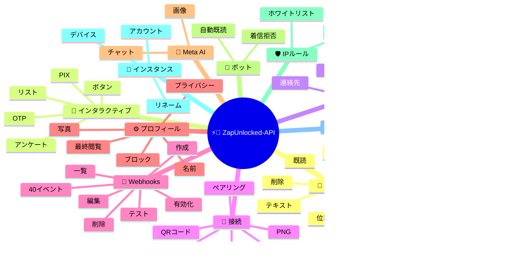
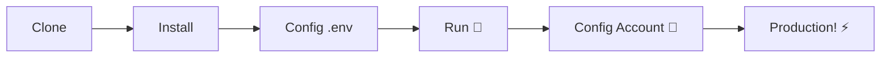

# ⚡💬 [ZapUnlocked-API](https://zapunlocked-api.kauafpss.com.br/)


<p align="center">
  
  <a href="https://downgit.github.io/#/home?url=https://github.com/kauafpssx/ZapUnlocked-API/blob/main/ZapUnlocked.collection.json">
    
  </a>
  
  
  
</p>

---

### 🌐 言語を選択:

<table width="100%">
  <tr>
    <td align="center" valign="middle"><a href="https://github.com/kauafpssx/ZapUnlocked-API/blob/main/README.md"></a></td>
    <td align="center" valign="middle"><a href="https://github.com/kauafpssx/ZapUnlocked-API/blob/main/docs/translations/en.md"></a></td>
    <td align="center" valign="middle"><a href="https://github.com/kauafpssx/ZapUnlocked-API/blob/main/docs/translations/es.md"></a></td>
    <td align="center" valign="middle"><a href="https://github.com/kauafpssx/ZapUnlocked-API/blob/main/docs/translations/fr.md"></a></td>
    <td align="center" valign="middle"><a href="https://github.com/kauafpssx/ZapUnlocked-API/blob/main/docs/translations/de.md"></a></td>
    <td align="center" valign="middle"><a href="https://github.com/kauafpssx/ZapUnlocked-API/blob/main/docs/translations/zh.md"></a></td>
    <td align="center" valign="middle"><a href="https://github.com/kauafpssx/ZapUnlocked-API/blob/main/docs/translations/ja.md"></a></td>
    <td align="center" valign="middle"><a href="https://github.com/kauafpssx/ZapUnlocked-API/blob/main/docs/translations/ru.md"></a></td>
    <td align="center" valign="middle"><a href="https://github.com/kauafpssx/ZapUnlocked-API/blob/main/docs/translations/it.md"></a></td>
    <td align="center" valign="middle"><a href="https://github.com/kauafpssx/ZapUnlocked-API/blob/main/docs/translations/ar.md"></a></td>
    <td align="center" valign="middle"><a href="https://github.com/kauafpssx/ZapUnlocked-API/blob/main/docs/translations/tr.md"></a></td>
    <td align="center" valign="middle"><a href="https://github.com/kauafpssx/ZapUnlocked-API/blob/main/docs/translations/ko.md"></a></td>
    <td align="center" valign="middle"><a href="https://github.com/kauafpssx/ZapUnlocked-API/blob/main/docs/translations/hi.md"></a></td>
    <td align="center" valign="middle"><a href="https://github.com/kauafpssx/ZapUnlocked-API/blob/main/docs/translations/nl.md"></a></td>
  </tr>
</table>

---

##  ZapUnlocked-APIとは？

WhatsApp API市場は毎月法外な料金を請求します。月額数十から数百レアル、使用制限、会話ごとの料金、サードパーティのサーバーを通過するデータ。**ZapUnlocked-APIは無料でオープンソースです。**

**Python** と **[Neonize](https://github.com/krypton-byte/neonize)** を接続エンジンとして構築、APIはFastAPIを使用してセッション管理、メディア送信、ボット作成を行います。重いデータベースも月額料金もサードパーティサーバーも不要。

> [!TIP]
> ボット、通知、カスタマーサービスシステムに使用。**100% 無料。**

> [!IMPORTANT]
> 🤖 **Meta AI 統合済み。** `/ai/ask` でチャット、`/ai/imagine` で WhatsApp 内で画像生成。[ルートを見る](#-meta-ai--2-endpoints)。

---

## 🗺️ API概要



---

## ✨ 主な機能

| 機能 | 説明 |
| :--- | :--- |
| 🧩 **ステートレスボタン** | 暗号化されたWebhookでデータベース不要のインタラクティブフローを作成 |
| 🔢 **QRコード不要のペアリング** | 数値コードで接続 · GUIなしサーバーに最適 |
| 🎵 **自動音声変換** | ネイティブPTTとして録音したように表示される音声を送信 |
| 📦 **スマートメディアキュー** | メモリ消費を抑える自動管理 |
| 🏷️ **動的プレースホルダー** | `{{name}}`、`{{day}}`、`{{phone}}` でメッセージとWebhookをカスタマイズ |

| 🤖 **Meta AI** | WhatsApp内でAIとチャットし、画像を生成します。 |
| ⌨️ **ユニバーサルパラメータ** | `delay_message`、`delay_typing`、`reply`/`quoted_id`、`@メンション`が**すべての**送信エンドポイントで機能します。 |
| 🔐 **署名付きWebhook** | HMAC-SHA256による整合性。あなたのwebhookは正当なデータのみを受け入れます。 |
| 🔄 **自動再接続** | 切断、リモートログアウト、ストリームエラー時に自動的に再接続します。 |
| 📁 **ファイルアップロード+URL** | 直接アップロード**または**公開URLでメディアを送信します。 |

> [!NOTE]
> すべての機能は**100%無料**で、オープンソースコミュニティが維持しています。

---

## 📋 APIルート

<details>
<summary><b>📨 メッセージ送信</b> · 15エンドポイント</summary>

| メソッド | ルート | 説明 | ボディ |
| :------ | :---- | :--- | :--- |
| `POST` | `/send` | テキストメッセージ / 返信を送信 | `phone`, `message` |
| `POST` | `/send_image` | 画像を送信 | `phone`, `image_url` |
| `POST` | `/send_video` | 動画を送信（GIF・PTV対応） | `phone`, `video_url` |
| `POST` | `/send_gif` | アニメーションGIFを送信 | `phone`, `url` |
| `POST` | `/send_audio` | 音声を送信（自動PTT変換） | `phone`, `audio_url` |
| `POST` | `/send_document` | ドキュメントを送信 | `phone`, `document_url` |
| `POST` | `/send_sticker` | ステッカーを送信 | `phone`, `sticker_url` |
| `POST` | `/send_reaction` | 絵文字リアクションを送信 | `phone`, `messageId`, `emoji` |
| `POST` | `/send_location` | 位置情報を送信 | `phone`, `lat`, `lng` |
| `POST` | `/send_contact` | 連絡先を送信 | `phone`, `name`, `contactPhone` |
| `POST` | `/send_contacts` | 複数連絡先を送信 | `phone`, `contacts` |
| `POST` | `/send_link` | プレビュー付きリンクを送信 | `phone`, `url` |
| `POST` | `/messages/delete` | メッセージを削除 | `phone`, `messageId` |
| `POST` | `/messages/read` | 既読にする | `phone`, `messageIds` |
| `POST` | `/messages/edit` | 送信済みメッセージを編集 | `phone`, `messageId`, `message` |

> [!TIP]
> **ユニバーサルパラメータ。** **すべての**メッセージ送信エンドポイント（インタラクティブを含む）で利用可能：
>
> | パラメータ | 機能 |
> | :-------- | :--- |
> | `delay_message` | 送信前にN秒待機します。 |
> | `delay_typing` | 送信前にN秒間「入力中...」を表示します。 |
> | `reply` / `quoted_id` | 返信先メッセージのID（引用）。 |
> | `mentioned` | @メンションする電話番号のJSON配列。例：`["5511999999999"]` |

</details>

<details>
<summary><b>🔘 インタラクティブメッセージ</b> · 9エンドポイント</summary>

| メソッド | ルート | 説明 | ボディ |
| :------ | :---- | :--- | :--- |
| `POST` | `/messages/send-button-list` | オプションリストボタン | `phone`, `buttons` |
| `POST` | `/messages/send-button-quick-reply` | クイックリプライボタン | `phone`, `title`, `buttons` |
| `POST` | `/messages/send-button-otp` | コピーボタン（OTP） | `phone`, `code` |
| `POST` | `/messages/send-button-pix` | PIXボタン | `phone`, `pixKey` |
| `POST` | `/messages/send-button-url` | リンクボタン | `phone`, `title`, `url` |
| `POST` | `/messages/send-button-call` | 通話ボタン | `phone`, `title`, `phoneNumber` |
| `POST` | `/messages/send-option-list` | ⛔ **一時的に無効**（iPhone、Android、Webと互換性なし） | `phone`, `buttons` |
| `POST` | `/messages/send-poll` | アンケートを送信 | `phone`, `name`, `options` |
| `POST` | `/messages/send-poll-vote` | アンケートに投票 | `phone`, `options` |
</details>

<details>
<summary><b>🔍 クエリと管理</b> · 12エンドポイント</summary>

| メソッド | ルート | 説明 | ボディ |
| :------ | :---- | :--- | :--- |
| `POST` | `/management/fetch_messages` | メッセージ履歴を取得 | `phone` |
| `POST` | `/management/recent_contacts` | 最近のチャットを一覧 | ❌ |
| `GET` | `/management/chats` | 履歴のあるチャットを一覧 | ❌ |
| `GET` | `/management/chats/{phone}/messages` | 特定チャットのメッセージ | ❌ |
| `GET` | `/management/contacts/{phone}` | 連絡先の詳細情報 | ❌ |
| `GET` | `/management/groups` | グループを一覧 | ❌ |
| `DELETE` | `/management/cleanup` | チャットデータをクリア | ❌ |
| `GET` | `/management/export` | 設定をエクスポート（webhook、設定、IPルール） | ❌ |
| `POST` | `/management/import` | ファイルアップロードで設定をインポート | `file` |
| `GET` | `/management/database/status` | DBのステータスと統計 | ❌ |
| `POST` | `/management/database/config` | DB設定を更新 | `interval` |
| `POST` | `/management/database/cleanup` | DBの手動クリーンアップ | ❌ |
</details>

<details>
<summary><b>👤 連絡先</b> · 1エンドポイント</summary>

| メソッド | ルート | 説明 | ボディ |
| :------ | :---- | :--- | :--- |
| `POST` | `/contacts/info` | 連絡先の詳細情報 | `phone` |
</details>

<details>
<summary><b>🏠 一般 / ステータス</b> · 9エンドポイント</summary>

| メソッド | ルート | 説明 | ボディ |
| :------ | :---- | :--- | :--- |
| `GET` | `/` | ウェルカムページ（HTML） | ❌ |
| `GET` | `/status` | 完全ステータス（WhatsApp、CPU、メモリ、ディスク） | ❌ |
| `GET` | `/status/stream` | SSEによるリアルタイムステータス | ❌ |
| `GET` | `/status/health` | シンプルなHealth check（`{"ok":true}`） | ❌ |
| `GET` | `/status/readiness` | Readiness check（WhatsApp切断時は503） | ❌ |
| `GET` | `/status/memory` | メモリステータス（プロセス + システム） | ❌ |
| `GET` | `/status/volume` | ディスクステータス（サイズ、ファイル） | ❌ |
| `GET` | `/collection.json` | Postman Collectionをダウンロード | ❌ |
| `POST` | `/collection.json` | Postman Collectionを更新 | JSON body |
</details>

<details>
<summary><b>🔗 接続（QR）</b> · 2エンドポイント</summary>

| メソッド | ルート | 説明 | ボディ |
| :------ | :---- | :--- | :--- |
| `GET` | `/qr` | インタラクティブQRコードを表示（HTML） | ❌ |
| `GET` | `/qr/image` | QRコード画像を取得（PNG） | ❌ |
</details>

<details>
<summary><b>🔐 セッション</b> · 2エンドポイント</summary>

| メソッド | ルート | 説明 | ボディ |
| :------ | :---- | :--- | :--- |
| `POST` | `/session/pair` | 数値ペアリングコードを生成 | `phone` |
| `POST` | `/session/logout` | 切断してセッションをリセット | ❌ |
</details>

<details>
<summary><b>📡 Webhooks（CRUD）</b> · 8エンドポイント</summary>

| メソッド | ルート | 説明 | ボディ |
| :------ | :---- | :--- | :--- |
| `POST` | `/webhooks` | 名前付きWebhookを作成 | `name`, `url` |
| `GET` | `/webhooks` | 全Webhookを一覧 | ❌ |
| `GET` | `/webhooks/{name}` | 名前でWebhookを取得 | ❌ |
| `PUT` | `/webhooks/{name}` | Webhookを編集 | ❌ |
| `DELETE` | `/webhooks/{name}` | Webhookを削除 | ❌ |
| `POST` | `/webhooks/{name}/toggle` | 有効化 / 無効化 | `active` |
| `POST` | `/webhooks/{name}/test` | Webhookをテスト | ❌ |
| `GET` | `/webhooks/events` | イベントタイプ一覧（40種類） | ❌ |
</details>

<details>
<summary><b>⚙️ プロフィールとプライバシー</b> · 13エンドポイント</summary>

| メソッド | ルート | 説明 | ボディ |
| :------ | :---- | :--- | :--- |
| `POST` | `/settings/profile` | ボットの名前と写真を変更 | `name?`, `photo?`（Form） |
| `POST` | `/settings/block` | 連絡先をブロック / ブロック解除 | `phone`, `action` |
| `PUT` | `/settings/privacy/last-seen` | 最終閲覧設定 | `value` |
| `PUT` | `/settings/privacy/online` | オンラインステータス | `value` |
| `PUT` | `/settings/privacy/profile` | プロフィール写真の表示設定 | `value` |
| `PUT` | `/settings/privacy/status` | ステータスの表示設定 | `value` |
| `PUT` | `/settings/privacy/read-receipts` | 既読の確認設定 | `value` |
| `PUT` | `/settings/privacy/groups-add` | グループ追加の許可設定 | `value` |
| `PUT` | `/settings/privacy/call-add` | 通話追加の許可設定 | `value` |
| `PUT` | `/settings/privacy/about` | ステータスメッセージ | `value?` |
| `PUT` | `/settings/privacy/disappearing-timer` | 消えるメッセージのタイマー | `value?` |
| `GET` | `/settings/ip-control` | IP制御のステータスを確認 | ❌ |
| `PUT` | `/settings/ip-control` | IP制御の有効化/無効化 | `enabled` |
</details>

<details>
<summary><b>🤖 ボット設定</b> · 4エンドポイント</summary>

| メソッド | ルート | 説明 | ボディ |
| :------ | :---- | :--- | :--- |
| `PUT` | `/settings/instance/call-reject-auto` | 着信を自動拒否 | `value` |
| `PUT` | `/settings/instance/call-reject-message` | 着信拒否メッセージ | `value` |
| `PUT` | `/settings/instance/auto-read-message` | メッセージの自動既読 | `value` |
| `GET` | `/settings/phone-code/{phone}` | 電話番号からペアリングコードを生成 | ❌ |
</details>

<details>
<summary><b>📱 インスタンス</b> · 3エンドポイント</summary>

| メソッド | ルート | 説明 | ボディ |
| :------ | :---- | :--- | :--- |
| `GET` | `/instance/me` | 接続済みアカウントデータ | ❌ |
| `GET` | `/instance/device` | デバイスの技術データ | ❌ |
| `PUT` | `/instance/update-name` | インスタンス名を変更 | `name` |
</details>

<details>
<summary><b>🛡️ IPルール</b> · 5エンドポイント</summary>

| メソッド | ルート | 説明 | ボディ |
| :------ | :---- | :--- | :--- |
| `GET` | `/settings/ip-rules` | IPルールを一覧（ホワイトリスト/ブラックリスト） | ❌ |
| `POST` | `/settings/ip-rules/whitelist` | IPをホワイトリストに追加 | `ip` |
| `POST` | `/settings/ip-rules/blacklist` | IPをブラックリストに追加 | `ip` |
| `DELETE` | `/settings/ip-rules/whitelist/{ip}` | IPをホワイトリストから削除 | ❌ |
| `DELETE` | `/settings/ip-rules/blacklist/{ip}` | IPをブラックリストから削除 | ❌ |
</details>

<details>
<summary><b>🖥️ システム</b> · 5エンドポイント</summary>

| メソッド | ルート | 説明 | ボディ |
| :------ | :---- | :--- | :--- |
| `GET` | `/system/env` | 環境変数を表示 | ❌ |
| `PUT` | `/system/env` | 環境変数を更新 | ❌ |
| `POST` | `/system/cleanup/force` | 一時メディアを強制クリーンアップ | ❌ |
| `GET` | `/system/cleanup/settings` | 自動クリーンアップ設定を表示 | ❌ |
| `PUT` | `/system/cleanup/settings` | 自動クリーンアップ間隔を更新 | ❌ |
</details>

<details>
<summary><b>📊 ログ</b> · 3エンドポイント</summary>

| メソッド | ルート | 説明 | ボディ |
| :------ | :---- | :--- | :--- |
| `GET` | `/logs/files` | ログファイルを一覧 | ❌ |
| `GET` | `/logs` | フィルター付きでログを表示 | ❌ |
| `POST` | `/logs/cleanup` | ログの圧縮/クリーンアップを強制 | ❌ |
</details>

<details>
<summary><b>📈 統計</b> · 6エンドポイント</summary>

| メソッド | ルート | 説明 | ボディ |
| :------ | :---- | :--- | :--- |
| `GET` | `/stats` | 統計（稼働時間、メッセージ、webhook） | ❌ |
| `DELETE` | `/stats` | 統計をリセット | ❌ |
| `GET` | `/stats/webhooks` | 全Webhookの統計 | ❌ |
| `GET` | `/stats/webhooks/{name}` | 特定Webhookの統計 | ❌ |
| `DELETE` | `/stats/webhooks` | 全Webhookの統計をリセット | ❌ |
| `DELETE` | `/stats/webhooks/{name}` | 特定Webhookの統計をリセット | ❌ |
</details>

<details>
<summary><b>🤖 Meta AI</b> · 2エンドポイント</summary>

| メソッド | ルート | 説明 | ボディ |
| :------ | :---- | :--- | :--- |
| `POST` | `/ai/ask` | Meta AIに質問 | `message` |
| `POST` | `/ai/imagine` | Meta AIで画像を生成 | `prompt` |
</details>

<details>
<summary><b>🔐 マルチセッション</b> · 7エンドポイント</summary>

| メソッド | ルート | 説明 | ボディ |
| :------ | :---- | :--- | :--- |
| `GET` | `/sessions` | 全セッションを一覧 | ❌ |
| `POST` | `/sessions` | 新しいセッションを作成 | `name?` |
| `PUT` | `/sessions/{id}/rename` | セッション名を変更 | `name` |
| `DELETE` | `/sessions/{id}` | セッションを無効化 | ❌ |
| `POST` | `/sessions/{id}/connect` | セッションに接続 | ❌ |
| `POST` | `/sessions/{id}/disconnect` | セッションを切断 | ❌ |
| `GET` | `/sessions/{id}/status` | セッションのステータス | ❌ |
</details>

<details>
<summary><b>📡 Webhooks（ログ）</b> · 3エンドポイント</summary>

| メソッド | ルート | 説明 | ボディ |
| :------ | :---- | :--- | :--- |
| `GET` | `/webhooks/{name}/logs` | Webhookの配信ログ | ❌ |
| `DELETE` | `/webhooks/{name}/logs` | Webhookのログをクリア | ❌ |
| `DELETE` | `/webhooks/logs/all` | 全Webhookのログをクリア | ❌ |
</details>

> **合計: 108エンドポイント**

---

## 📡 Webhookイベント

すべてのWebhookは標準のエンベロープを受け取ります：

```json
{
  "event": "message.text",
  "timestamp": "2025-01-01T12:00:00Z",
  "data": { ... }
}
```

`{{placeholders}}` を含むカスタム `body` が設定されている場合、標準のエンベロープの代わりにそのbodyが送信されます。

---

<details>
<summary><b>🏷️ カスタムbodyで使用できるプレースホルダー</b></summary>

| プレースホルダー | 値 |
| :-------------- | :-- |
| `{{from}}` | 送信者番号 |
| `{{text}}` | メッセージテキスト |
| `{{phone}}` | `{{from}}` と同じ |
| `{{id}}` | メッセージID |
| `{{requested}}` | 要求数（fetchMessages） |
| `{{found}}` | 見つかった数（fetchMessages） |
| `{{timestamp}}` | 現在のUTCタイムスタンプ |

</details>

---

<details>
<summary><b>📥 受信メッセージ</b> · 18イベント</summary>

> **メディアフィールド:** メディアイベント（`message.image`、`message.video`、`message.audio`、`message.document`、`message.sticker`）には、`RECEIVE_MEDIA_ENABLED=true` の場合、追加フィールドが含まれます：`mediaBase64`（ファイルのbase64）、`fileName`、`mimeType`、`mediaTooLarge`（ブール値。`RECEIVE_MEDIA_MAX_SIZE_MB` を超えるとtrue）。

受信メッセージイベントに含まれる基本フィールド：

```json
{
  "messageId": "3EB0ABCDEF123456",
  "from": "5511999999999",
  "fromName": "ジョアン・シウバ",
  "fromJid": "5511999999999@s.whatsapp.net",
  "isGroup": false
}
```

<details>
<summary><code>message.text</code> - プレーンテキスト / 書式付きテキスト</summary>

```json
{
  "event": "message.text",
  "data": {
    "...base": "...",
    "text": "こんにちは！どのようにお手伝いできますか？",
    "quoted": { "id": "3EB0...", "fromMe": true }
  }
}
```
</details>

<details>
<summary><code>message.image</code> - 受信した画像</summary>

```json
{
  "event": "message.image",
  "data": {
    "...base": "...",
    "caption": "商品の写真",
    "mimetype": "image/jpeg",
    "fileLength": 204800
  }
}
```
</details>

<details>
<summary><code>message.video</code> - 受信した動画</summary>

```json
{
  "event": "message.video",
  "data": {
    "...base": "...",
    "caption": "この動画を見てください！",
    "mimetype": "video/mp4",
    "fileLength": 5242880,
    "isPTT": false,
    "isGif": false
  }
}
```
</details>

<details>
<summary><code>message.audio</code> - 音声 / ボイスメモ</summary>

```json
{
  "event": "message.audio",
  "data": {
    "...base": "...",
    "mimetype": "audio/ogg; codecs=opus",
    "fileLength": 30720,
    "isPTT": true,
    "durationSeconds": 8
  }
}
```
</details>

<details>
<summary><code>message.document</code> - ドキュメント / ファイル</summary>

```json
{
  "event": "message.document",
  "data": {
    "...base": "...",
    "fileName": "contract.pdf",
    "caption": "契約書を送ります",
    "mimetype": "application/pdf",
    "fileLength": 102400
  }
}
```
</details>

<details>
<summary><code>message.sticker</code> - ステッカー</summary>

```json
{
  "event": "message.sticker",
  "data": {
    "...base": "...",
    "mimetype": "image/webp",
    "isAnimated": false
  }
}
```
</details>

<details>
<summary><code>message.contact</code> - 共有された連絡先</summary>

```json
{
  "event": "message.contact",
  "data": {
    "...base": "...",
    "displayName": "マリア・ソウザ",
    "vcard": "BEGIN:VCARD\nVERSION:3.0\n..."
  }
}
```
</details>

<details>
<summary><code>message.contacts</code> - 複数の連絡先</summary>

```json
{
  "event": "message.contacts",
  "data": {
    "...base": "...",
    "displayName": "2件の連絡先",
    "count": 2,
    "contacts": [
      { "displayName": "マリア・ソウザ", "vcard": "BEGIN:VCARD\n..." },
      { "displayName": "ジョアン・シウバ", "vcard": "BEGIN:VCARD\n..." }
    ]
  }
}
```
</details>

<details>
<summary><code>message.location</code> - 位置情報</summary>

```json
{
  "event": "message.location",
  "data": {
    "...base": "...",
    "lat": -23.5505,
    "lng": -46.6333,
    "name": "パウリスタ大通り",
    "address": "パウリスタ大通り、1000 - サンパウロ"
  }
}
```
</details>

<details>
<summary><code>message.reaction</code> - リアクション（絵文字）</summary>

```json
{
  "event": "message.reaction",
  "data": {
    "...base": "...",
    "emoji": "❤️",
    "targetMessageId": "3EB0ABCDEF123456",
    "isRemoved": false
  }
}
```
</details>

<details>
<summary><code>message.poll_created</code> - 受信したアンケート</summary>

```json
{
  "event": "message.poll_created",
  "data": {
    "...base": "...",
    "pollName": "最高の味は？",
    "options": ["チョコレート", "イチゴ", "バニラ"]
  }
}
```
</details>

<details>
<summary><code>message.poll_vote</code> - アンケートの投票</summary>

```json
{
  "event": "message.poll_vote",
  "data": {
    "...base": "...",
    "pollId": "3EB0ABCDEF123456",
    "selectedOptions": ["チョコレート"]
  }
}
```
</details>

<details>
<summary><code>message.button_reply</code> - ボタンクリック</summary>

```json
{
  "event": "message.button_reply",
  "data": {
    "...base": "...",
    "buttonId": "opcao_sim",
    "displayText": "はい",
    "type": "quick_reply"
  }
}
```
</details>

<details>
<summary><code>message.list_reply</code> - インタラクティブリスト選択</summary>

```json
{
  "event": "message.list_reply",
  "data": {
    "...base": "...",
    "rowId": "1",
    "title": "X-バーガー",
    "description": "R$ 18.90"
  }
}
```
</details>

<details>
<summary><code>message.deleted</code> - 送信者によって削除されたメッセージ</summary>

```json
{
  "event": "message.deleted",
  "data": {
    "...base": "..."
  }
}
```
</details>

<details>
<summary><code>message.unknown</code> - 未マッピングタイプ</summary>

```json
{
  "event": "message.unknown",
  "data": {
    "...base": "...",
    "rawType": "senderKeyDistributionMessage"
  }
}
```
</details>

<details>
<summary><code>message.undecryptable</code> - 復号できないメッセージ</summary>

```json
{
  "event": "message.undecryptable",
  "data": {
    "...base": "..."
  }
}
```
</details>

</details>

<details>
<summary><b>📤 送信メッセージ</b> · 22イベント</summary>

<details>
<summary><code>message.sent</code> - メッセージ送信（汎用）</summary>

```json
{
  "event": "message.sent",
  "data": {
    "to": "5511999999999",
    "type": "text",
    "messageId": "3EB0ABCDEF123456"
  }
}
```
</details>

<details>
<summary><code>message.sent.{type}</code> - タイプ別の特定イベント</summary>

`message.sent` と同じペイロードで、特定のイベント名を持ちます。単一の送信タイプのみを購読する場合に使用します。

タイプ: `text`, `image`, `audio`, `video`, `document`, `sticker`, `gif`, `interactive`, `list`, `poll`, `poll_vote`, `location`, `contact`, `contacts`, `link`, `reaction`, `edit`, `delete`

```json
{
  "event": "message.sent.image",
  "data": {
    "to": "5511999999999",
    "type": "image",
    "messageId": "3EB0ABCDEF123456"
  }
}
```
</details>

<details>
<summary><code>message.delivered</code> - 受信者に配信されたメッセージ（receipt type 1）</summary>

```json
{
  "event": "message.delivered",
  "data": {
    "from": "5511999999999",
    "messageId": "3EB0ABCDEF123456"
  }
}
```
</details>

<details>
<summary><code>message.read</code> - 受信者に読まれたメッセージ（receipt type 4）</summary>

```json
{
  "event": "message.read",
  "data": {
    "from": "5511999999999",
    "messageId": "3EB0ABCDEF123456"
  }
}
```
</details>

<details>
<summary><code>message.receipt</code> - その他の確認タイプ（receipt types 2, 3, 5+）</summary>

```json
{
  "event": "message.receipt",
  "data": {
    "from": "5511999999999",
    "messageId": "3EB0ABCDEF123456",
    "receiptType": 2
  }
}
```
</details>

</details>

<details>
<summary><b>🔗 接続</b> · 11イベント</summary>

<details>
<summary><code>connection.connected</code> - WhatsApp接続完了</summary>

```json
{
  "event": "connection.connected",
  "data": {
    "phone": "5511999999999"
  }
}
```
</details>

<details>
<summary><code>connection.disconnected</code> - WhatsApp切断</summary>

```json
{
  "event": "connection.disconnected",
  "data": {}
}
```
</details>

<details>
<summary><code>connection.qr_ready</code> - QRコード生成完了</summary>

```json
{
  "event": "connection.qr_ready",
  "data": {
    "qr": "2@abc123..."
  }
}
```
</details>

<details>
<summary><code>connection.pair_code</code> - ペアリングコード生成</summary>

```json
{
  "event": "connection.pair_code",
  "data": {
    "code": "ABCD-1234",
    "connected": false
  }
}
```

`connected: true` はペアリングが完了したことを示します。
</details>

<details>
<summary><code>connection.pair_status</code> - ペアリングステータス</summary>

```json
{
  "event": "connection.pair_status",
  "data": {
    "jid": "5511999999999@s.whatsapp.net",
    "businessName": "マイビジネス",
    "platform": "WEB",
    "status": "OK",
    "error": ""
  }
}
```
</details>

<details>
<summary><code>connection.logged_out</code> - リモートでログアウト</summary>

```json
{
  "event": "connection.logged_out",
  "data": {
    "reason": "ユーザーログアウト"
  }
}
```
</details>

<details>
<summary><code>connection.connect_failure</code> - 接続エラー</summary>

```json
{
  "event": "connection.connect_failure",
  "data": {
    "reason": "ERROR_CONNECT",
    "message": "接続がタイムアウトしました"
  }
}
```
</details>

<details>
<summary><code>connection.stream_error</code> - ストリームエラー</summary>

```json
{
  "event": "connection.stream_error",
  "data": {
    "code": "STREAM_ERR"
  }
}
```
</details>

<details>
<summary><code>connection.temporary_ban</code> - 一時的なBAN</summary>

```json
{
  "event": "connection.temporary_ban",
  "data": {
    "code": "BAN_CODE",
    "expire": 1704153600
  }
}
```
</details>

<details>
<summary><code>connection.client_outdated</code> - クライアントが古い</summary>

```json
{
  "event": "connection.client_outdated",
  "data": {}
}
```
</details>

<details>
<summary><code>connection.stream_replaced</code> - ストリームが置き換えられました</summary>

```json
{
  "event": "connection.stream_replaced",
  "data": {}
}
```
</details>

</details>

<details>
<summary><b>👥 グループ</b> · 2イベント</summary>

<details>
<summary><code>group.join</code> - ボットがグループに参加</summary>

```json
{
  "event": "group.join",
  "data": {
    "groupId": "123456789@g.us",
    "groupName": "マイグループ",
    "reason": "invite",
    "type": ""
  }
}
```
</details>

<details>
<summary><code>group.update</code> - グループ更新</summary>

```json
{
  "event": "group.update",
  "data": {
    "groupId": "123456789@g.us",
    "sender": "5511999999999@s.whatsapp.net",
    "name": "新しいグループ名",
    "topic": "新しい説明",
    "locked": false,
    "announce": false,
    "ephemeral": 604800,
    "delete": false,
    "link": null,
    "unlink": null,
    "newInviteLink": "https://chat.whatsapp.com/abc123"
  }
}
```
</details>

</details>

<details>
<summary><b>👤 連絡先 / プレゼンス</b> · 4イベント</summary>

<details>
<summary><code>contact.presence</code> - 連絡先のプレゼンスステータス</summary>

```json
{
  "event": "contact.presence",
  "data": {
    "from": "5511999999999",
    "fromJid": "5511999999999@s.whatsapp.net",
    "status": "online",
    "lastSeen": 0
  }
}
```

`status`: `"online"` または `"offline"`。
</details>

<details>
<summary><code>contact.chat_presence</code> - タイピングステータス</summary>

```json
{
  "event": "contact.chat_presence",
  "data": {
    "from": "5511999999999",
    "fromJid": "5511999999999@s.whatsapp.net",
    "state": "typing",
    "media": null
  }
}
```

`state`: `"typing"`、`"recording"` または `"paused"`。
</details>

<details>
<summary><code>contact.picture_change</code> - プロフィール写真変更</summary>

```json
{
  "event": "contact.picture_change",
  "data": {
    "from": "5511999999999",
    "fromJid": "5511999999999@s.whatsapp.net",
    "author": "5511999999999@s.whatsapp.net",
    "action": "changed"
  }
}
```

`action`: `"changed"` または `"removed"`。
</details>

<details>
<summary><code>contact.identity_change</code> - セキュリティキー変更</summary>

```json
{
  "event": "contact.identity_change",
  "data": {
    "from": "5511999999999",
    "fromJid": "5511999999999@s.whatsapp.net",
    "implicit": false,
    "timestamp": 1704067200
  }
}
```
</details>

</details>

<details>
<summary><b>📞 通話</b> · 3イベント</summary>

<details>
<summary><code>call.received</code> - 着信</summary>

```json
{
  "event": "call.received",
  "data": {
    "from": "5511999999999",
    "fromJid": "5511999999999@s.whatsapp.net",
    "callId": "ABC123DEF456"
  }
}
```
</details>

<details>
<summary><code>call.accepted</code> - 通話応答</summary>

```json
{
  "event": "call.accepted",
  "data": {
    "from": "5511999999999",
    "callId": "ABC123DEF456"
  }
}
```
</details>

<details>
<summary><code>call.terminated</code> - 通話終了</summary>

```json
{
  "event": "call.terminated",
  "data": {
    "from": "5511999999999",
    "callId": "ABC123DEF456",
    "reason": "timeout"
  }
}
```
</details>

</details>

<details>
<summary><b>🧹 メディアクリーンアップ</b> · 1イベント</summary>

<details>
<summary><code>media.cleanup.completed</code> - 自動メディアクリーンアップ実行</summary>

```json
{
  "event": "media.cleanup.completed",
  "data": {
    "filesRemoved": 12,
    "remainingBytes": 52428800
  }
}
```

毎時間実行されます。削除がない場合は `filesRemoved: 0` です。
</details>

</details>

<details>
<summary><b>🤖 AI</b> · 1イベント</summary>

<details>
<summary><code>ai.response</code> - Meta AIの応答を受信</summary>

```json
{
  "event": "ai.response",
  "data": {
    "text": "ブラジリアです！",
    "hasImage": false,
    "imageBase64": null,
    "imageUrl": null,
    "mimeType": null,
    "messageId": "3EB0ABCDEF123456"
  }
}
```

Meta AIが応答するたびに発火します。非同期応答を処理する場合に使用します（`POST /ai/ask` は30秒のタイムアウトがあります）。
</details>

</details>

---

## 🛠️ インストールとホスティング

> **ZapUnlocked-API** を使うと、**5分以内**にWhatsApp APIを稼働できます。

### 💻 ローカルインストール

開発、テスト、独自サーバーでの実行に対応します。



**1. リポジトリをクローン**

```bash
git clone https://github.com/kauafpssx/ZapUnlocked-API.git
cd ZapUnlocked-API
```

**2. 依存関係をインストール**

| システム | コマンド |
| :------ | :------ |
| 🪟 Windows | `scripts\install\install.bat` |
| 🐧 Linux / macOS | `bash scripts/install/install.sh` |

**3. 環境を設定**

| システム | コマンド |
| :------ | :------ |
| 🪟 Windows | `scripts\generate-env\generate-env.bat` |
| 🐧 Linux / macOS | `bash scripts/generate-env/generate-env.sh` |

| 変数 | 説明 |
| :--- | :--- |
| `API_KEY` | 全エンドポイントの認証パスワード |
| `INTERNAL_SECRET` | Webhook署名を検証するトークン |
| `PORT` | APIポート（デフォルト: `8300`） |

**4. APIを実行**

| システム | コマンド |
| :------ | :------ |
| 🪟 Windows | `scripts\run\run.bat` |
| 🐧 Linux / macOS | `bash scripts/run/run.sh` |

---

### ☁️ ホスティング: Alwaysdata（無料 24/7）

**Alwaysdata** はサーバーを常時稼働させずにAPIを無料でホスティングします。

<details>
<summary><b>📊 リソースと手順を見る</b></summary>

#### 📊 無料プランのリソース

| リソース | 無料版での利用可否 |
| :------ | :---------------- |
| 💾 ストレージ | **1 GB SSD** |
| 🧠 RAM | **256 MB** |
| ⚡ CPU | **1/4 vCPU** |
| 🔄 バックアップ | **3日間**自動 |
| 📡 稼働時間 | Services経由で **24/7** |

#### 👣 デプロイ手順

**1.** [Alwaysdata.com](https://www.alwaysdata.com/) でアカウントを作成 · **Free** プラン。

**2.** SSHにアクセス: `https://ssh-[ユーザー名].alwaysdata.net`。

**3.** クローンしてインストール:

```bash
git clone https://github.com/kauafpssx/ZapUnlocked-API.git ~/ZapUnlocked-API
cd ~/ZapUnlocked-API
bash scripts/install/install.sh
```

**4.** *（オプション）* `.env` を生成:

```bash
bash scripts/generate-env/generate-env.sh
```

> [!NOTE]
> インストールスクリプトは`.env` の設定について尋ねます。**はい**と答えた場合は、このステップをスキップできます。そうでない場合は、上記のコマンドを実行するか、`.env` を手動で設定してください。

**5.** サービスを設定（24/7）: **Advanced › Services › Add a service**:

| フィールド | 値 |
| :------- | :--- |
| **Command** | `bash scripts/run/run.sh` |
| **Working directory** | `ZapUnlocked-API` |
| **Environment variables** | `PORT=8300` |

**6.** アクセスURL:

```
http://services-[ユーザー名].alwaysdata.net:8300/
```

> [!TIP]
> URLは外部からアクセス可能です。カスタムドメインを使用するには、**Web › Sites › Add a site** で **Reverse Proxy** を設定し、`http://[ユーザー名].alwaysdata.net` を指定してください。

---

#### 🔐 認証（ログイン）

デプロイ後、ブラウザで以下のURLにアクセスしてWhatsAppアカウントを接続:

```text
http://services-[ユーザー名].alwaysdata.net:8300/qr?API_KEY=あなたの秘密のパスワード
```

</details>

---

<details>
<summary><b>📌 その他の情報</b> · 環境変数、タイムゾーン、送信パラメータ、一括送信、メディア受信</summary>

### 🌐 完全な環境変数

`API_KEY`、`INTERNAL_SECRET`、`PORT` 以外の追加 `.env` 変数:

| 変数 | デフォルト | 説明 |
| :------- | :----- | :-------- |
| `PUBLIC_URL` | auto | ログ内の `/qr` ダッシュボードリンクの公開URL |
| `TZ` | `UTC` | タイムスタンプのタイムゾーン（例: `America/Sao_Paulo`） |
| `DRY_RUN` | `false` | テストモード、WhatsAppを呼び出さずに送信をインターセプト |
| `RECEIVE_MEDIA_ENABLED` | `false` | 受信メディアを自動で `temp_media/` にダウンロード |
| `RECEIVE_MEDIA_MAX_SIZE_MB` | `15` | 受信メディアの最大サイズ (MB) |
| `CORS_ORIGINS` | `*` | 許可されるオリジン（カンマ区切り） |
| `ENABLE_WHATSAPP` | `1` | WhatsAppボットを無効化（テスト用は `0`） |
| `ENABLE_FFMPEG_WARMUP` | `1` | FFmpegウォームアップを無効化（`0`） |
| `MAX_UPLOAD_SIZE_MB` | `500` | ファイルあたりの最大アップロードサイズ |
| `CLEANUP_MAX_AGE_DAYS` | `7` | `temp_media/` 内のファイルの最大保存日数 |
| `CLEANUP_MAX_SIZE_MB` | `500` | `temp_media/` の最大合計サイズ |
| `LOG_MAX_AGE_DAYS` | `30` | 圧縮ログの最大保存日数 |
| `LOG_MAX_SIZE_MB` | `50` | ログの最大合計サイズ |
| `META_AI_PHONE` | auto | Meta AI電話番号を上書き |
| `META_AI_TIMEOUT` | `30` | Meta AI応答タイムアウト（秒） |
| `META_AI_KEEP_IMAGES` | `false` | Meta AI画像をディスクに保存 |
| `ALWAYSDATA_ACCOUNT` | auto | Alwaysdata環境を強制 |

---

### 🕐 タイムゾーン

各送信エンドポイントはオフセット付きISO 8601形式で `timestamp` を返します。優先順位に従って設定:

1. プロジェクトルートの `timezone.conf` ファイル（最初のコメントでない行）
2. `.env` または環境変数の `TZ`
3. デフォルト: `UTC`

一般的な値: `America/Sao_Paulo`、`America/New_York`、`Europe/London`、`Asia/Tokyo`。

```json
{
  "success": true,
  "message": "Message sent.",
  "messageId": "3EB0ABCDEF123456",
  "timestamp": "2026-06-15T14:30:00-0300"
}
```

---

### ✏️ 動的テキストフォーマット

送信時に置換されるプレースホルダー:

| プレースホルダー | 置換後 |
| :---------- | :-------------- |
| `{{day}}` | 現在の日 (01-31) |
| `{{mon}}` | 現在の月 (01-12) |
| `{{yea}}` | 現在の年 (2026) |
| `{{hou}}` | 現在の時 (00-23) |
| `{{min}}` | 現在の分 (00-59) |
| `{{sec}}` | 現在の秒 (00-59) |

```json
{
  "phone": "5511999999999",
  "message": "今日は {{yea}}年{{mon}}月{{day}}日 {{hou}}:{{min}}:{{sec}} です"
}
```

結果: `"今日は 2026年06月15日 14:30:00 です"`

---

### 🧪 DRY_RUN モード

`.env` の `DRY_RUN=true` により、すべての送信エンドポイントがWhatsAppを呼び出さずに成功を返します。応答には `"dryRun": true`、`"messageId": null` が含まれます。

用途: 統合テスト、CI/CD、ペイロード検証。

```json
{
  "success": true,
  "dryRun": true,
  "message": "Message sent.",
  "messageId": null,
  "timestamp": "2026-06-15T14:30:00-0300"
}
```

---

### ⚙️ 送信エンドポイントのオプションパラメータ

すべての `/send/*`、`/send/media`、`/send/buttons/*` エンドポイントで利用可能:

| パラメータ | 型 | 説明 |
| :-------- | :--- | :-------- |
| `quoted_id` | `string` | 返信先メッセージのID |
| `delay_message` | `number` | 送信前の遅延（秒） |
| `delay_typing` | `number` | X秒間の入力をシミュレート |
| `mentioned` | `string[]` | メンションする電話番号 (@mention) |

```json
{
  "phone": "5511999999999",
  "message": "こんにちは @5511888888888！",
  "quoted_id": "3EB0ABC123",
  "delay_message": 2,
  "delay_typing": 3,
  "mentioned": ["5511888888888"]
}
```

> [!NOTE]
> `quoted_id` はメッセージID（`type: "id"`）または検索テキスト（`type: "text"`）を受け入れます。ローカル履歴にIDが見つからない場合、APIはプレースホルダーを作成し、WhatsAppは引用を表示します。

---

### 📦 一括送信

`POST /send/bulk` は同じメッセージを複数の番号に送信します:

| パラメータ | 型 | 必須 | 説明 |
| :-------- | :--- | :---------- | :-------- |
| `phones` | `string[]` | ✅ | 電話番号の配列 |
| `message` | `string` | ✅ | メッセージテキスト |
| `delay_message` | `number` | ❌ | 各送信前の遅延 |
| `delay_typing` | `number` | ❌ | 入力をシミュレート |
| `delay_between` | `number` | ❌ | 番号間の遅延 |
| `mentioned` | `string[]` | ❌ | メンション |

```json
{
  "phones": ["5511999999999", "5511888888888", "5511777777777"],
  "message": "タイムセール！🔥",
  "delay_between": 3,
  "delay_typing": 2
}
```

---

### 📥 メディアレシーバー

`RECEIVE_MEDIA_ENABLED=true` の場合、APIは受信したメディア（画像、動画、音声、ドキュメント、ステッカー）をダウンロードし、`mediaUrl` をwebhookに追加します:

```json
{
  "event": "message.upsert",
  "data": {
    "key": { "remoteJid": "5511999999999@s.whatsapp.net" },
    "message": { "imageMessage": {} },
    "mediaUrl": "http://services-ユーザー名.alwaysdata.net:8300/media/uuid-ファイル.jpg"
  }
}
```

ファイルは `temp_media/` に保存され、自動スケジューラーによってクリーンアップされます。

---

### 🧹 自動クリーンアップ (temp_media)

`temp_media/` のクリーンアップは毎時実行されます。いずれかの条件に達した場合にトリガーされます:

* `CLEANUP_MAX_AGE_DAYS`（デフォルト: 7日）より古いファイル
* 合計サイズが `CLEANUP_MAX_SIZE_MB`（デフォルト: 500 MB）を超える

`filesRemoved` と `remainingBytes` を含む webhook `media.cleanup.completed` を発行します。

</details>

---

## 📖 公式ドキュメント

## 📖 公式ドキュメント

<p align="center">
  👉 <a href="https://zapunlocked-api.kauafpss.com.br"><strong>zapunlocked-api.kauafpss.com.br</strong></a>
</p>

技術ドキュメント、コード例、プレイグラウンドについては公式ウェブサイトをご覧ください。

> [!TIP]
> **LLMs.txt** をAIのインデックスとして使用: [`zapunlocked-api.kauafpss.com.br/llms.txt`](https://zapunlocked-api.kauafpss.com.br/llms.txt)。すべてのページを確認してください。

---

## ❤️ クレジットと謝辞

| プロジェクト | 説明 |
| :--------- | :--- |
| [](https://github.com/krypton-byte/neonize) | WhatsApp Webへのネイティブ接続のためのPythonライブラリ |
| [](https://github.com/tulir/whatsmeow) | Neonizeの基盤となるGoライブラリ · 接続の中核 |
| [](https://www.alwaysdata.com/) | 高品質な無料インフラストラクチャ |

---

## 📄 ライセンス

このプロジェクトは **MITライセンス** の下でライセンスされています。

<p align="center">
  💜 愛を込めて <a href="https://www.instagram.com/kauafpss_/">Kauã Ferreira</a> より
</p>
