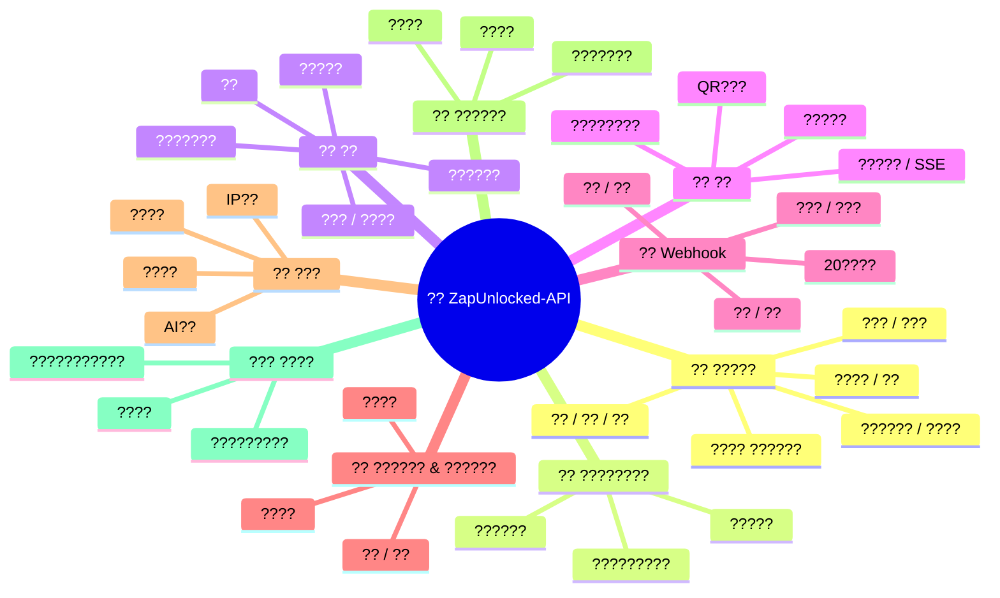
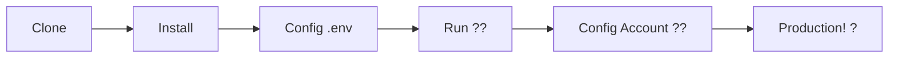

# ?? [ZapUnlocked-API](https://zapunlocked-api.kauafpss.com.br) ???


<p align="center">
  
  
  
  
  
</p>

<table width="100%">
  <tr>
    <td align="center" valign="middle"><a href="https://github.com/kauafpssx/ZapUnlocked-API/blob/main/README.md"></a></td>
    <td align="center" valign="middle"><a href="https://github.com/kauafpssx/ZapUnlocked-API/blob/main/docs/translations/en.md"></a></td>
    <td align="center" valign="middle"><a href="https://github.com/kauafpssx/ZapUnlocked-API/blob/main/docs/translations/es.md"></a></td>
    <td align="center" valign="middle"><a href="https://github.com/kauafpssx/ZapUnlocked-API/blob/main/docs/translations/fr.md"></a></td>
    <td align="center" valign="middle"><a href="https://github.com/kauafpssx/ZapUnlocked-API/blob/main/docs/translations/de.md"></a></td>
    <td align="center" valign="middle"><a href="https://github.com/kauafpssx/ZapUnlocked-API/blob/main/docs/translations/zh.md"></a></td>
    <td align="center" valign="middle"><a href="https://github.com/kauafpssx/ZapUnlocked-API/blob/main/docs/translations/ru.md"></a></td>
    <td align="center" valign="middle"><a href="https://github.com/kauafpssx/ZapUnlocked-API/blob/main/docs/translations/it.md"></a></td>
    <td align="center" valign="middle"><a href="https://github.com/kauafpssx/ZapUnlocked-API/blob/main/docs/translations/ar.md"></a></td>
    <td align="center" valign="middle"><a href="https://github.com/kauafpssx/ZapUnlocked-API/blob/main/docs/translations/tr.md"></a></td>
    <td align="center" valign="middle"><a href="https://github.com/kauafpssx/ZapUnlocked-API/blob/main/docs/translations/kr.md"></a></td>
    <td align="center" valign="middle"><a href="https://github.com/kauafpssx/ZapUnlocked-API/blob/main/docs/translations/in.md"></a></td>
    <td align="center" valign="middle"><a href="https://github.com/kauafpssx/ZapUnlocked-API/blob/main/docs/translations/nl.md"></a></td>
  </tr>
</table>

---

##  ZapUnlocked-API ???

WhatsApp API??????????????????????(R$)???????????????????????????????????????????????????**ZapUnlocked-API????????????????**

**Python**??????**[Neonize](https://github.com/krypton-byte/neonize)** ????????????????API???????REST????????(FastAPI)???????????????????????????????????????????????**??????????????????????????????**

????????**??????**?**???????**??????????????????????????????????????????????????????????

> [!TIP]
> ????????????????????????????????????**??????????????????**

---

## ??? API??



---

## ? ????

| ?? | ?? |
| :--- | :--- |
| ?? **?????????** | ??????webhook?????????????????????????????? |
| ?? **QR??????????** | ???????? · GUI????????? |
| ?? **??????** | ??????????????(PTT)????????? |
| ?? **???????????** | ??????????????? |
| ??? **??????????** | `{{name}}`?`{{day}}`?`{{phone}}` ???????webhook??????? |

> [!NOTE]
> ???????**100%??**????????????????????????????

---

## ?? API???

<details>
<summary><b>?? ???????</b> · 13???????</summary>

| ???? | ??? | ?? |
| :----- | :--- | :-------- |
| `POST` | `/send` | ???????????? / ?? |
| `POST` | `/send_image` | ????? |
| `POST` | `/send_video` | ?????(GIF·PTV??) |
| `POST` | `/send_audio` | ?????(PTT????) |
| `POST` | `/send_document` | ????????? |
| `POST` | `/send_sticker` | ???????? |
| `POST` | `/send_reaction` | ???????????? |
| `POST` | `/send_location` | ??????? |
| `POST` | `/send_contact` | ?????? |
| `POST` | `/send_contacts` | ????????? |
| `POST` | `/send_link` | ????????????? |
| `POST` | `/messages/delete` | ???????? |
| `POST` | `/messages/read` | ????? |
| `POST` | `/messages/edit` | ???????????? |
</details>

<details>
<summary><b>?? ?????????????</b> · 4???????</summary>

| ???? | ??? | ?? |
| :----- | :--- | :-------- |
| `POST` | `/send_wbuttons` | ??????(??????????OTP?PIX) |
| `POST` | `/messages/send-option-list` | ????????? |
| `POST` | `/messages/send-poll` | ???????? |
| `POST` | `/messages/send-poll-vote` | ???????? |
</details>

<details>
<summary><b>?? ?????</b> · 7???????</summary>

| ???? | ??? | ?? |
| :----- | :--- | :-------- |
| `POST` | `/contacts/info` | ???????? |
| `POST` | `/management/fetch_messages` | ?????????? |
| `POST` | `/management/recent_contacts` | ?????????? |
| `GET` | `/management/memory` | ??????? |
| `GET` | `/management/volume_stats` | ??????????? |
| `GET` | `/management/database/status` | ??????????????? |
| `POST` | `/management/database/cleanup` | ???????????????? |
</details>

<details>
<summary><b>?? ????????</b> · 8???????</summary>

| ???? | ??? | ?? |
| :----- | :--- | :-------- |
| `GET` | `/` | ????????(HTML) |
| `GET` | `/status` | ?????????????? |
| `GET` | `/status/stream` | ???????????(SSE) |
| `GET` | `/qr` | ????????QR?????? |
| `GET` | `/qr/image` | QR????????(Base64) |
| `POST` | `/qr/pair` | ????????????? |
| `GET` | `/settings/phone-code/{phone}` | ???????????? |
| `POST` | `/qr/logout` | ?????????????? |
</details>

<details>
<summary><b>?? Webhook(CRUD)</b> · 7???????</summary>

| ???? | ??? | ?? |
| :----- | :--- | :-------- |
| `POST` | `/webhooks` | ????Webhook??? |
| `GET` | `/webhooks` | ????Webhook??? |
| `PUT` | `/webhooks/{name}` | Webhook??? |
| `DELETE` | `/webhooks/{name}` | Webhook??? |
| `POST` | `/webhooks/{name}/toggle` | ??? / ??? |
| `POST` | `/webhooks/{name}/test` | Webhook???? |
| `GET` | `/webhooks/events` | ??????????(20??) |
</details>

<details>
<summary><b>?? ?????????????</b> · 3???????</summary>

| ???? | ??? | ?? |
| :----- | :--- | :-------- |
| `POST` | `/settings/profile` | ???????????? |
| `POST` | `/settings/privacy` | ?????????(??????) |
| `POST` | `/settings/block` | ???????? / ?????? |
</details>

<details>
<summary><b>?? ?????</b> · 5???????</summary>

| ???? | ??? | ?? |
| :----- | :--- | :-------- |
| `GET` | `/settings/bot` | ???????? |
| `POST` | `/settings/bot` | ?????(AI???IP??) |
| `PUT` | `/settings/instance/call-reject-auto` | ????????? |
| `PUT` | `/settings/instance/call-reject-message` | ????????????? |
| `PUT` | `/settings/instance/auto-read-message` | ?????????? |
</details>

<details>
<summary><b>?? ??????</b> · 3???????</summary>

| ???? | ??? | ?? |
| :----- | :--- | :-------- |
| `GET` | `/instance/me` | ????????????? |
| `GET` | `/instance/device` | ????????? |
| `PUT` | `/instance/update-name` | ???????????? |
</details>

<details>
<summary><b>??? ????</b> · 5???????</summary>

| ???? | ??? | ?? |
| :----- | :--- | :-------- |
| `GET` | `/system/env` | ??????? |
| `PUT` | `/system/env` | ??????? |
| `POST` | `/system/cleanup/force` | ???????????????? |
| `GET` | `/system/cleanup/settings` | ?????????????? |
| `PUT` | `/system/cleanup/settings` | ?????????????? |
</details>

> **??: 56???????** · WhatsApp??????????REST API?

---

## ??? ?????????????

> **ZapUnlocked-API** ???????????????WhatsApp API?**5?**????????????????

### ?? ??????????

??????????????????????????



**1. ??????????**

```bash
git clone https://github.com/kauafpssx/ZapUnlocked-API.git
cd ZapUnlocked-API
```

**2. ???????????**

| ???? | ???? |
| :------ | :------ |
| ?? Windows | `scripts\install\install.bat` |
| ?? Linux / macOS | `bash scripts/install/install.sh` |

**3. ?????**

| ???? | ???? |
| :------ | :------ |
| ?? Windows | `scripts\generate-env\generate-env.bat` |
| ?? Linux / macOS | `bash scripts/generate-env/generate-env.sh` |

| ?? | ?? |
| :------- | :-------- |
| `API_KEY` | ??????????????????? |
| `INTERNAL_SECRET` | Webhook?????????????? |
| `PORT` | API????(?????: `8300`) |

**4. API???**

| ???? | ???? |
| :------ | :------ |
| ?? Windows | `scripts\run\run.bat` |
| ?? Linux / macOS | `bash scripts/run/run.sh` |

---

### ?? ??????: Alwaysdata(?? 24/7)

**Alwaysdata** ??????????????????????????API???????????????????

#### ?? ??????????

| ???? | ???????? |
| :------ | :----------------- |
| ?? ????? | **1 GB SSD** |
| ?? RAM | **256 MB** |
| ? CPU | **1/4 vCPU** |
| ?? ?????? | **3??** ?? |
| ?? ???? | **24/7**(Services??) |

#### ?? ??????

**1.** [Alwaysdata.com](https://www.alwaysdata.com/) ????????? · **Free** ????

**2.** SSH?????: `https://ssh-[usuario].alwaysdata.net`?

**3.** ????????????:

```bash
git clone https://github.com/kauafpssx/ZapUnlocked-API.git ~/ZapUnlocked-API
cd ~/ZapUnlocked-API
bash scripts/install/install.sh
```

**4.** `.env` ???:

```bash
bash scripts/generate-env/generate-env.sh
```

**5.** ???????(24/7): **Advanced › Services › Add a service**:

| ????? | ? |
| :---- | :---- |
| **Name** | `ZapUnlocked-API` |
| **Command** | `python3 main.py` |
| **Working directory** | `ZapUnlocked-API` |
| **Environment variables** | `PORT=8300` |

**6.** ????:

```
http://services-[usuario].alwaysdata.net:8300/
```

> [!TIP]
> URL??????????????*(?????)* ????????????????**Web › Sites › Add a site** ? **Reverse Proxy** ?????`http://[usuario].alwaysdata.net` ??????????

---

## ?? ??(????)

??????????????URL???????WhatsApp???????????:

```text
http://services-[usuario].alwaysdata.net:8300/qr?API_KEY=SUA_SENHA_SECRETA
```

---

## ?? ????????

<p align="center">
  ?? <a href="https://zapunlocked-api.kauafpss.com.br"><strong>zapunlocked-api.kauafpss.com.br</strong></a>
</p>

?????????????????????????????????????????????????????

> [!TIP]
> **LLMs.txt** ?AI?????????????: [`zapunlocked-api.kauafpss.com.br/llms.txt`](https://zapunlocked-api.kauafpss.com.br/llms.txt)????????????????????????

---

## ?? ????????

| ?????? | ?? |
| :------ | :-------- |
| [](https://github.com/krypton-byte/neonize) | WhatsApp Web?????????????Python????? |
| [](https://github.com/tulir/whatsmeow) | Neonize???????Go????? · ????? |
| [](https://www.alwaysdata.com/) | ???????????????? |

---

## ?? ?????

?????????**MIT?????**???????????????

<p align="center">
  ?????? <a href="https://www.instagram.com/kauafpss_/">Kauã Ferreira</a> ???
</p>

