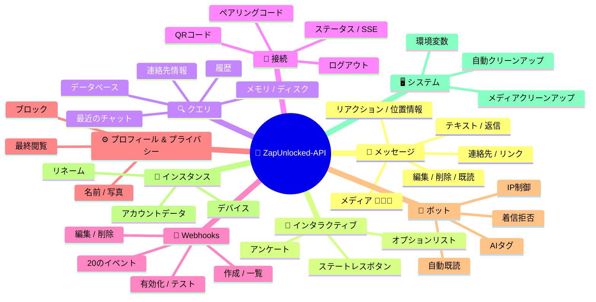
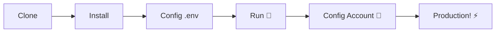

# 🚀 [ZapUnlocked-API](https://zapunlocked-api.kauafpss.com.br) 📲✨


<p align="center">
  
  
  
  
  
</p>

---

### 🌐 言語を選択:

<table width="100%">
  <tr>
    <td align="center" valign="middle"><a href="https://github.com/kauafpssx/ZapUnlocked-API/blob/main/README.MD"></a></td>
    <td align="center" valign="middle"><a href="https://github.com/kauafpssx/ZapUnlocked-API/blob/main/docs/translations/en.md"></a></td>
    <td align="center" valign="middle"><a href="https://github.com/kauafpssx/ZapUnlocked-API/blob/main/docs/translations/es.md"></a></td>
    <td align="center" valign="middle"><a href="https://github.com/kauafpssx/ZapUnlocked-API/blob/main/docs/translations/fr.md"></a></td>
    <td align="center" valign="middle"><a href="https://github.com/kauafpssx/ZapUnlocked-API/blob/main/docs/translations/de.md"></a></td>
    <td align="center" valign="middle"><a href="https://github.com/kauafpssx/ZapUnlocked-API/blob/main/docs/translations/zh.md"></a></td>
    <td align="center" valign="middle"><a href="https://github.com/kauafpssx/ZapUnlocked-API/blob/main/docs/translations/ru.md"></a></td>
    <td align="center" valign="middle"><a href="https://github.com/kauafpssx/ZapUnlocked-API/blob/main/docs/translations/it.md"></a></td>
    <td align="center" valign="middle"><a href="https://github.com/kauafpssx/ZapUnlocked-API/blob/main/docs/translations/ar.md"></a></td>
    <td align="center" valign="middle"><a href="https://github.com/kauafpssx/ZapUnlocked-API/blob/main/docs/translations/tr.md"></a></td>
    <td align="center" valign="middle"><a href="https://github.com/kauafpssx/ZapUnlocked-API/blob/main/docs/translations/ko.md"></a></td>
    <td align="center" valign="middle"><a href="https://github.com/kauafpssx/ZapUnlocked-API/blob/main/docs/translations/hi.md"></a></td>
    <td align="center" valign="middle"><a href="https://github.com/kauafpssx/ZapUnlocked-API/blob/main/docs/translations/nl.md"></a></td>
  </tr>
</table>

---

##  ZapUnlocked-APIとは？

WhatsApp API市場では毎月法外な料金が請求されています。月額数十から数百レアル(ブラジル通貨)、使用制限、会話ごとの料金、そしてサードパーティのサーバーを通過するデータ... **ZapUnlocked-APIはこれを変えるために存在します。**

**Python** と **[Neonize](https://github.com/krypton-byte/neonize)** を接続エンジンとして構築されたこのAPIは、シンプルなRESTインターフェース（FastAPI）を提供し、セッション管理、複雑なメディア送信、インテリジェントなインタラクションを**重いデータベース不要**で実現します。**月額料金なし、誰にも依存しません。**

私たちの提案は**技術的卓越性**と**開発者の独立性**に基づいています。強力なツールは、独自のソリューションを構築する人々にとってアクセス可能であるべきだと考えています。

> [!TIP]
> ボット、通知、自動化されたカスタマーサービスシステムの統合を迅速に進めたい開発者に最適です。**そのために何も支払う必要はありません。**

---

## 🗺️ API概要



---

## ✨ 主な機能

| 機能 | 説明 |
| :--- | :--- |
| 🧩 **ステートレスボタン** | 暗号化されたWebhookでデータベース不要のインタラクティブフローを作成 |
| 🔢 **QRコード不要のペアリング** | 数値コードで接続 · GUIなしサーバーに最適 |
| 🎵 **自動音声変換** | ネイティブPTTとして録音したように表示される音声を送信 |
| 📦 **スマートメディアキュー** | メモリ消費を抑える自動管理 |
| 🏷️ **動的プレースホルダー** | `{{name}}`、`{{day}}`、`{{phone}}` でメッセージとWebhookをカスタマイズ |

> [!NOTE]
> すべての機能は**100%無料**で、オープンソースコミュニティによって維持されています。

---

## 📋 APIルート

<details>
<summary><b>📨 メッセージ送信</b> · 14エンドポイント</summary>

| メソッド | ルート | 説明 |
| :------ | :---- | :--- |
| `POST` | `/send` | テキストメッセージ / 返信を送信 |
| `POST` | `/send_image` | 画像を送信 |
| `POST` | `/send_video` | 動画を送信（GIF・PTV対応） |
| `POST` | `/send_audio` | 音声を送信（自動PTT変換） |
| `POST` | `/send_document` | ドキュメントを送信 |
| `POST` | `/send_sticker` | ステッカーを送信 |
| `POST` | `/send_reaction` | 絵文字リアクションを送信 |
| `POST` | `/send_location` | 位置情報を送信 |
| `POST` | `/send_contact` | 連絡先を送信 |
| `POST` | `/send_contacts` | 複数連絡先を送信 |
| `POST` | `/send_link` | プレビュー付きリンクを送信 |
| `POST` | `/messages/delete` | メッセージを削除 |
| `POST` | `/messages/read` | 既読にする |
| `POST` | `/messages/edit` | 送信済みメッセージを編集 |
</details>

<details>
<summary><b>🔘 インタラクティブメッセージ</b> · 4エンドポイント</summary>

| メソッド | ルート | 説明 |
| :------ | :---- | :--- |
| `POST` | `/send_wbuttons` | ボタンを送信（リスト、アクション、OTP、PIX） |
| `POST` | `/messages/send-option-list` | オプションリストを送信 |
| `POST` | `/messages/send-poll` | アンケートを送信 |
| `POST` | `/messages/send-poll-vote` | アンケートに投票 |
</details>

<details>
<summary><b>🔍 クエリと管理</b> · 7エンドポイント</summary>

| メソッド | ルート | 説明 |
| :------ | :---- | :--- |
| `POST` | `/contacts/info` | 連絡先の詳細情報 |
| `POST` | `/management/fetch_messages` | メッセージ履歴を取得 |
| `POST` | `/management/recent_contacts` | 最近のチャットを一覧 |
| `GET` | `/management/memory` | メモリ使用状況 |
| `GET` | `/management/volume_stats` | ディスク使用状況 |
| `GET` | `/management/database/status` | DBのステータスと統計 |
| `POST` | `/management/database/cleanup` | DBの手動クリーンアップ |
</details>

<details>
<summary><b>🔗 接続とセッション</b> · 8エンドポイント</summary>

| メソッド | ルート | 説明 |
| :------ | :---- | :--- |
| `GET` | `/` | ウェルカムページ（HTML） |
| `GET` | `/status` | 接続とセッションのステータス |
| `GET` | `/status/stream` | リアルタイムステータス（SSE） |
| `GET` | `/qr` | インタラクティブQRコード |
| `GET` | `/qr/image` | QRコード画像を取得（Base64） |
| `POST` | `/qr/pair` | 数値ペアリングコードを生成 |
| `GET` | `/settings/phone-code/{phone}` | 電話番号からペアリングコードを生成 |
| `POST` | `/qr/logout` | 切断してセッションをリセット |
</details>

<details>
<summary><b>📡 Webhooks（CRUD）</b> · 7エンドポイント</summary>

| メソッド | ルート | 説明 |
| :------ | :---- | :--- |
| `POST` | `/webhooks` | 名前付きWebhookを作成 |
| `GET` | `/webhooks` | 全Webhookを一覧 |
| `PUT` | `/webhooks/{name}` | Webhookを編集 |
| `DELETE` | `/webhooks/{name}` | Webhookを削除 |
| `POST` | `/webhooks/{name}/toggle` | 有効化 / 無効化 |
| `POST` | `/webhooks/{name}/test` | Webhookをテスト |
| `GET` | `/webhooks/events` | イベントタイプ一覧（20種類） |
</details>

<details>
<summary><b>⚙️ プロフィールとプライバシー</b> · 3エンドポイント</summary>

| メソッド | ルート | 説明 |
| :------ | :---- | :--- |
| `POST` | `/settings/profile` | ボットの名前と写真を変更 |
| `POST` | `/settings/privacy` | プライバシー設定を調整（最終閲覧など） |
| `POST` | `/settings/block` | 連絡先をブロック / ブロック解除 |
</details>

<details>
<summary><b>🤖 ボット設定</b> · 5エンドポイント</summary>

| メソッド | ルート | 説明 |
| :------ | :---- | :--- |
| `GET` | `/settings/bot` | ボット設定を表示 |
| `POST` | `/settings/bot` | ボット設定を更新（AIタグ、IP制御） |
| `PUT` | `/settings/instance/call-reject-auto` | 着信を自動拒否 |
| `PUT` | `/settings/instance/call-reject-message` | 着信拒否メッセージ |
| `PUT` | `/settings/instance/auto-read-message` | メッセージの自動既読 |
</details>

<details>
<summary><b>📱 インスタンス</b> · 3エンドポイント</summary>

| メソッド | ルート | 説明 |
| :------ | :---- | :--- |
| `GET` | `/instance/me` | 接続済みアカウントデータ |
| `GET` | `/instance/device` | デバイスの技術データ |
| `PUT` | `/instance/update-name` | インスタンス名を変更 |
</details>

<details>
<summary><b>🖥️ システム</b> · 5エンドポイント</summary>

| メソッド | ルート | 説明 |
| :------ | :---- | :--- |
| `GET` | `/system/env` | 環境変数を表示 |
| `PUT` | `/system/env` | 環境変数を更新 |
| `POST` | `/system/cleanup/force` | 一時メディアを強制クリーンアップ |
| `GET` | `/system/cleanup/settings` | 自動クリーンアップ設定を表示 |
| `PUT` | `/system/cleanup/settings` | 自動クリーンアップ間隔を更新 |
</details>

> **全56エンドポイント** · WhatsApp自動化のための完全なREST API。

---

## 📡 Webhook イベント

すべてのWebhookは標準のエンベロープを受け取ります：

```json
{
  "event": "message.text",
  "timestamp": "2025-01-01T12:00:00Z",
  "data": { ... }
}
```

`{{placeholders}}` を含むカスタム `body` が設定されている場合、標準のエンベロープの代わりにそのbodyが送信されます。

### プレースホルダー（カスタムbody）

| プレースホルダー | 値 |
| :--------------- | :-- |
| `{{from}}` | 送信者番号 |
| `{{text}}` | メッセージテキスト |
| `{{phone}}` | `{{from}}` と同じ |
| `{{id}}` | メッセージID |
| `{{requested}}` | 要求数 (fetchMessages) |
| `{{found}}` | 見つかった数 (fetchMessages) |
| `{{timestamp}}` | 現在のUTCタイムスタンプ |
| `{{day}}` | 現在の日 (dd) |
| `{{mon}}` | 現在の月 (MM) |
| `{{yea}}` | 現在の年 (yyyy) |
| `{{hou}}` | 現在の時 (HH) |
| `{{min}}` | 現在の分 (mm) |
| `{{sec}}` | 現在の秒 (ss) |

<details>
<summary><b>📥 受信メッセージ</b> · 15イベント</summary>

受信メッセージイベントに含まれる基本フィールド：

```json
{
  "messageId": "3EB0ABCDEF123456",
  "from": "5511999999999",
  "fromName": "João Silva",
  "fromJid": "5511999999999@s.whatsapp.net",
  "isGroup": false
}
```

<details>
<summary><code>message.text</code> - プレーンテキスト / 書式付きテキスト</summary>

```json
{
  "event": "message.text",
  "data": {
    "...base": "...",
    "text": "Olá! Como posso ajudar?",
    "quoted": { "id": "3EB0...", "fromMe": true }
  }
}
```
</details>

<details>
<summary><code>message.image</code> - 受信した画像</summary>

```json
{
  "event": "message.image",
  "data": {
    "...base": "...",
    "caption": "Foto do produto",
    "mimetype": "image/jpeg",
    "fileLength": 204800
  }
}
```
</details>

<details>
<summary><code>message.video</code> - 受信した動画</summary>

```json
{
  "event": "message.video",
  "data": {
    "...base": "...",
    "caption": "Veja esse vídeo!",
    "mimetype": "video/mp4",
    "fileLength": 5242880,
    "isPTT": false,
    "isGif": false
  }
}
```
</details>

<details>
<summary><code>message.audio</code> - 音声 / ボイスメモ</summary>

```json
{
  "event": "message.audio",
  "data": {
    "...base": "...",
    "mimetype": "audio/ogg; codecs=opus",
    "fileLength": 30720,
    "isPTT": true,
    "durationSeconds": 8
  }
}
```
</details>

<details>
<summary><code>message.document</code> - ドキュメント / ファイル</summary>

```json
{
  "event": "message.document",
  "data": {
    "...base": "...",
    "fileName": "contrato.pdf",
    "caption": "Segue o contrato",
    "mimetype": "application/pdf",
    "fileLength": 102400
  }
}
```
</details>

<details>
<summary><code>message.sticker</code> - ステッカー</summary>

```json
{
  "event": "message.sticker",
  "data": {
    "...base": "...",
    "mimetype": "image/webp",
    "isAnimated": false
  }
}
```
</details>

<details>
<summary><code>message.contact</code> - 共有された連絡先</summary>

```json
{
  "event": "message.contact",
  "data": {
    "...base": "...",
    "displayName": "Maria Souza",
    "vcard": "BEGIN:VCARD\nVERSION:3.0\n..."
  }
}
```
</details>

<details>
<summary><code>message.location</code> - 位置情報</summary>

```json
{
  "event": "message.location",
  "data": {
    "...base": "...",
    "lat": -23.5505,
    "lng": -46.6333,
    "name": "Av. Paulista",
    "address": "Av. Paulista, 1000 - São Paulo"
  }
}
```
</details>

<details>
<summary><code>message.reaction</code> - リアクション（絵文字）</summary>

```json
{
  "event": "message.reaction",
  "data": {
    "...base": "...",
    "emoji": "❤️",
    "targetMessageId": "3EB0ABCDEF123456",
    "isRemoved": false
  }
}
```
</details>

<details>
<summary><code>message.poll_created</code> - 受信した投票</summary>

```json
{
  "event": "message.poll_created",
  "data": {
    "...base": "...",
    "pollName": "Qual o melhor sabor?",
    "options": ["Chocolate", "Morango", "Baunilha"]
  }
}
```
</details>

<details>
<summary><code>message.poll_vote</code> - 投票</summary>

```json
{
  "event": "message.poll_vote",
  "data": {
    "...base": "...",
    "pollId": "3EB0ABCDEF123456",
    "selectedOptions": ["Chocolate"]
  }
}
```
</details>

<details>
<summary><code>message.button_reply</code> - ボタンクリック</summary>

```json
{
  "event": "message.button_reply",
  "data": {
    "...base": "...",
    "buttonId": "opcao_sim",
    "displayText": "Sim",
    "type": "quick_reply"
  }
}
```
</details>

<details>
<summary><code>message.list_reply</code> - インタラクティブリスト選択</summary>

```json
{
  "event": "message.list_reply",
  "data": {
    "...base": "...",
    "rowId": "1",
    "title": "X-Burguer",
    "description": "R$ 18,90"
  }
}
```
</details>

<details>
<summary><code>message.deleted</code> - 送信者によって削除されたメッセージ</summary>

```json
{
  "event": "message.deleted",
  "data": {
    "...base": "..."
  }
}
```
</details>

<details>
<summary><code>message.unknown</code> - 未マッピングタイプ</summary>

```json
{
  "event": "message.unknown",
  "data": {
    "...base": "...",
    "rawType": "senderKeyDistributionMessage"
  }
}
```
</details>

</details>

<details>
<summary><b>📤 送信メッセージ</b> · 1イベント</summary>

<details>
<summary><code>message.sent</code> - 送信済みメッセージ（手動）</summary>

```json
{
  "event": "message.sent",
  "data": {
    "to": "5511999999999",
    "type": "text",
    "messageId": "3EB0ABCDEF123456"
  }
}
```
</details>

</details>

<details>
<summary><b>🔗 接続</b> · 3イベント</summary>

<details>
<summary><code>connection.connected</code> - WhatsApp接続完了</summary>

```json
{
  "event": "connection.connected",
  "data": {
    "phone": "5511999999999"
  }
}
```
</details>

<details>
<summary><code>connection.disconnected</code> - WhatsApp切断</summary>

```json
{
  "event": "connection.disconnected",
  "data": {}
}
```
</details>

<details>
<summary><code>connection.qr_ready</code> - QRコード生成完了</summary>

```json
{
  "event": "connection.qr_ready",
  "data": {
    "qr": "2@abc123..."
  }
}
```
</details>

</details>

<details>
<summary><b>📞 通話</b> · 1イベント</summary>

<details>
<summary><code>call.received</code> - 着信</summary>

```json
{
  "event": "call.received",
  "data": {
    "from": "5511999999999",
    "fromJid": "5511999999999@s.whatsapp.net",
    "callId": "ABC123DEF456"
  }
}
```
</details>

</details>

---

## 🛠️ インストールとホスティング

> **ZapUnlocked-API** を使えば、**5分以内**にプロフェッショナルなWhatsApp APIを稼働させられます。

### 💻 ローカルインストール

開発、テスト、または独自サーバーでの実行に最適です。



**1. リポジトリをクローン**

```bash
git clone https://github.com/kauafpssx/ZapUnlocked-API.git
cd ZapUnlocked-API
```

**2. 依存関係をインストール**

| システム | コマンド |
| :------ | :------ |
| 🪟 Windows | `scripts\install\install.bat` |
| 🐧 Linux / macOS | `bash scripts/install/install.sh` |

**3. 環境を設定**

| システム | コマンド |
| :------ | :------ |
| 🪟 Windows | `scripts\generate-env\generate-env.bat` |
| 🐧 Linux / macOS | `bash scripts/generate-env/generate-env.sh` |

| 変数 | 説明 |
| :--- | :--- |
| `API_KEY` | 全エンドポイントの認証パスワード |
| `INTERNAL_SECRET` | Webhook署名を検証するトークン |
| `PORT` | APIポート（デフォルト: `8300`） |

**4. APIを実行**

| システム | コマンド |
| :------ | :------ |
| 🪟 Windows | `scripts\run\run.bat` |
| 🐧 Linux / macOS | `bash scripts/run/run.sh` |

---

### ☁️ ホスティング: Alwaysdata（無料 24/7）

**Alwaysdata** は、サーバーを常時稼働させずにAPIを安定かつ無料でホスティングするための推奨オプションです。

#### 📊 無料プランのリソース

| リソース | 無料版での利用可否 |
| :------ | :---------------- |
| 💾 ストレージ | **1 GB SSD** |
| 🧠 RAM | **256 MB** |
| ⚡ CPU | **1/4 vCPU** |
| 🔄 バックアップ | **3日間**自動 |
| 📡 稼働時間 | Services経由で **24/7** |

#### 👣 デプロイ手順

**1.** [Alwaysdata.com](https://www.alwaysdata.com/) でアカウントを作成 · **Free** プラン。

**2.** SSHにアクセス: `https://ssh-[ユーザー].alwaysdata.net`。

**3.** クローンしてインストール:

```bash
git clone https://github.com/kauafpssx/ZapUnlocked-API.git ~/ZapUnlocked-API
cd ~/ZapUnlocked-API
bash scripts/install/install.sh
```

**4.** `.env` を生成:

```bash
bash scripts/generate-env/generate-env.sh
```

**5.** サービスを設定（24/7）: **Advanced · Services · Add a service**:

| フィールド | 値 |
| :------- | :--- |
| **Name** | `ZapUnlocked-API` |
| **Command** | `python3 main.py` |
| **Working directory** | `ZapUnlocked-API` |
| **Environment variables** | `PORT=8300` |

**6.** アクセスURL:

```
http://services-[ユーザー].alwaysdata.net:8300/
```

> [!TIP]
> URLはすでに外部からアクセス可能です。*(オプション)* カスタムドメインを使用するには、**Web · Sites · Add a site** で **Reverse Proxy** を設定し、`http://[ユーザー].alwaysdata.net` を指定してください。

---

## 🔐 認証（ログイン）

デプロイ後、ブラウザで以下のURLにアクセスしてWhatsAppアカウントを接続:

```text
http://services-[ユーザー].alwaysdata.net:8300/qr?API_KEY=YOUR_SECRET_KEY
```

---

## 📖 公式ドキュメント

<p align="center">
  👉 <a href="https://zapunlocked-api.kauafpss.com.br"><strong>zapunlocked-api.kauafpss.com.br</strong></a>
</p>

詳細な技術ドキュメント、コード例、インタラクティブなプレイグラウンドについては、公式ウェブサイトをご覧ください。

> [!TIP]
> **LLMs.txt** をAIのインデックスとして使用: [`zapunlocked-api.kauafpss.com.br/llms.txt`](https://zapunlocked-api.kauafpss.com.br/llms.txt)。探索する前にすべてのページを確認してください。

---

## ❤️ クレジットと謝辞

| プロジェクト | 説明 |
| :--------- | :--- |
| [](https://github.com/krypton-byte/neonize) | WhatsApp Webへのネイティブ接続のためのPythonライブラリ |
| [](https://github.com/tulir/whatsmeow) | Neonizeの基盤となるGoライブラリ · 接続の中核 |
| [](https://www.alwaysdata.com/) | 高品質な無料インフラストラクチャ |

---

## 📄 ライセンス

このプロジェクトは **MITライセンス** の下でライセンスされています。

<p align="center">
  💜 愛を込めて <a href="https://www.instagram.com/kauafpss_/">Kauã Ferreira</a> より
</p>