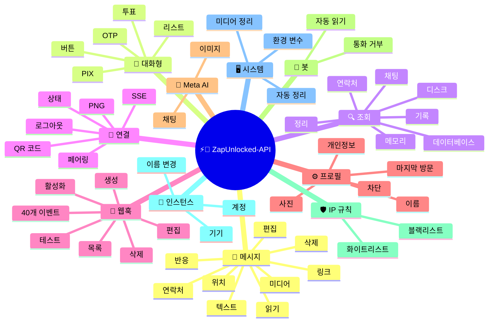
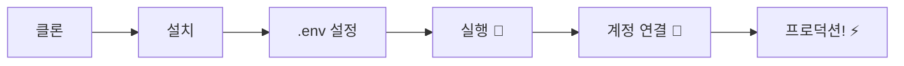

# ⚡💬 [ZapUnlocked-API](https://zapunlocked-api.kauafpss.com.br/)


<p align="center">
  
  <a href="https://downgit.github.io/#/home?url=https://github.com/kauafpssx/ZapUnlocked-API/blob/main/ZapUnlocked.collection.json">
    
  </a>
  
  
  
</p>

---

### 🌐 언어 선택:

<table width="100%">
  <tr>
    <td align="center" valign="middle"><a href="https://github.com/kauafpssx/ZapUnlocked-API/blob/main/README.md"></a></td>
    <td align="center" valign="middle"><a href="https://github.com/kauafpssx/ZapUnlocked-API/blob/main/docs/translations/en.md"></a></td>
    <td align="center" valign="middle"><a href="https://github.com/kauafpssx/ZapUnlocked-API/blob/main/docs/translations/es.md"></a></td>
    <td align="center" valign="middle"><a href="https://github.com/kauafpssx/ZapUnlocked-API/blob/main/docs/translations/fr.md"></a></td>
    <td align="center" valign="middle"><a href="https://github.com/kauafpssx/ZapUnlocked-API/blob/main/docs/translations/de.md"></a></td>
    <td align="center" valign="middle"><a href="https://github.com/kauafpssx/ZapUnlocked-API/blob/main/docs/translations/zh.md"></a></td>
    <td align="center" valign="middle"><a href="https://github.com/kauafpssx/ZapUnlocked-API/blob/main/docs/translations/ja.md"></a></td>
    <td align="center" valign="middle"><a href="https://github.com/kauafpssx/ZapUnlocked-API/blob/main/docs/translations/ru.md"></a></td>
    <td align="center" valign="middle"><a href="https://github.com/kauafpssx/ZapUnlocked-API/blob/main/docs/translations/it.md"></a></td>
    <td align="center" valign="middle"><a href="https://github.com/kauafpssx/ZapUnlocked-API/blob/main/docs/translations/ar.md"></a></td>
    <td align="center" valign="middle"><a href="https://github.com/kauafpssx/ZapUnlocked-API/blob/main/docs/translations/tr.md"></a></td>
    <td align="center" valign="middle"><a href="https://github.com/kauafpssx/ZapUnlocked-API/blob/main/docs/translations/ko.md"></a></td>
    <td align="center" valign="middle"><a href="https://github.com/kauafpssx/ZapUnlocked-API/blob/main/docs/translations/hi.md"></a></td>
    <td align="center" valign="middle"><a href="https://github.com/kauafpssx/ZapUnlocked-API/blob/main/docs/translations/nl.md"></a></td>
  </tr>
</table>

---

##  ZapUnlocked-API란?

WhatsApp API 시장은 월 수십에서 수백 달러를 청구합니다: 사용량 제한, 대화당 요금, 타사 서버를 통과하는 데이터. **ZapUnlocked-API는 무료 오픈소스 대안입니다.**

**Python**과 **[Neonize](https://github.com/krypton-byte/neonize)**로 구축된 이 API는 FastAPI를 사용하여 세션을 관리하고, 미디어를 전송하고, 봇을 생성합니다. 무거운 데이터베이스, 월 요금, 타사 서버가 없습니다.

> [!TIP]
> 봇, 알림 및 고객 서비스 시스템에 사용하세요. **100% 무료.**

> [!IMPORTANT]
> 🤖 **Meta AI 통합됨.** `/ai/ask`로 채팅하고 `/ai/imagine`으로 WhatsApp 내에서 이미지를 생성하세요. [경로 보기](#-meta-ai--2-endpoints)。

---

## 🗺️ API 개요



---

## ✨ 주요 기능

| 기능 | 설명 |
| :------------- | :-------- |
| 🧩 **상태 비저장(Stateless) 버튼** | 암호화된 웹훅으로 데이터베이스 없이 대화형 흐름 생성 |
| 🔢 **QR 코드 없는 페어링** | 숫자 코드로 연결 · GUI가 없는 서버에 이상적 |
| 🎵 **자동 오디오 변환** | iOS 및 Android에서 "방금 녹음"(PTT)으로 표시되는 오디오 전송 |
| 📦 **스마트 미디어 큐** | 과도한 메모리 소비를 방지하는 자동 관리 |
| 🏷️ **동적 플레이스홀더** | `{{name}}`, `{{day}}`, `{{phone}}` 변수로 메시지 및 웹훅 사용자 지정 |

| 🤖 **Meta AI** | WhatsApp 내에서 AI와 채팅하고 이미지를 생성합니다. |
| ⌨️ **범용 매개변수** | `delay_message`, `delay_typing`, `reply`/`quoted_id` 및 `@멘션`이 **모든** 전송 엔드포인트에서 작동합니다. |
| 🔐 **서명된 Webhook** | HMAC-SHA256을 통한 무결성. 귀하의 webhook는 합법적인 데이터만 수락합니다. |
| 🔄 **자동 재연결** | 연결 끊김, 원격 로그아웃 또는 스트림 오류 시 자동으로 재연결됩니다. |
| 📁 **파일 업로드 + URL** | 직접 업로드 **또는** 공개 URL로 미디어를 전송합니다. |

> [!NOTE]
> 모든 기능은 **100% 무료**이며 오픈소스 커뮤니티에 의해 유지 관리됩니다.

---

## 📋 API 라우트

<details>
<summary><b>📨 메시지 전송</b> · 15개 엔드포인트</summary>

| 메서드 | 라우트 | 설명 | 바디 |
| :----- | :--- | :-------- | :--- |
| `POST` | `/send` | 문자 메시지 전송 / 답장 | `phone`, `message` |
| `POST` | `/send_image` | 이미지 전송 | `phone`, `image_url` |
| `POST` | `/send_video` | 비디오 전송 (GIF 및 PTV 지원) | `phone`, `video_url` |
| `POST` | `/send_gif` | 애니메이션 GIF 전송 | `phone`, `url` |
| `POST` | `/send_audio` | 오디오 전송 (자동 PTT 변환) | `phone`, `audio_url` |
| `POST` | `/send_document` | 문서 전송 | `phone`, `document_url` |
| `POST` | `/send_sticker` | 스티커 전송 | `phone`, `sticker_url` |
| `POST` | `/send_reaction` | 이모지 반응 전송 | `phone`, `messageId`, `emoji` |
| `POST` | `/send_location` | 위치 전송 | `phone`, `lat`, `lng` |
| `POST` | `/send_contact` | 연락처 전송 | `phone`, `name`, `contactPhone` |
| `POST` | `/send_contacts` | 여러 연락처 전송 | `phone`, `contacts` |
| `POST` | `/send_link` | 미리보기가 있는 링크 전송 | `phone`, `url` |
| `POST` | `/messages/delete` | 메시지 삭제 | `phone`, `messageId` |
| `POST` | `/messages/read` | 읽음으로 표시 | `phone`, `messageIds` |
| `POST` | `/messages/edit` | 전송된 메시지 편집 | `phone`, `messageId`, `message` |

> [!TIP]
> **범용 매개변수.** **모든** 메시지 전송 엔드포인트(대화형 포함)에서 사용 가능：
>
> | 매개변수 | 기능 |
> | :-------- | :--- |
> | `delay_message` | 전송 전 N초 대기합니다. |
> | `delay_typing` | 전송 전 N초 동안 "입력 중..."을 표시합니다. |
> | `reply` / `quoted_id` | 답장할 메시지의 ID(인용). |
> | `mentioned` | @멘션할 전화번호의 JSON 배열. 예시：`["5511999999999"]` |

</details>

<details>
<summary><b>🔘 대화형 메시지</b> · 9개 엔드포인트</summary>

| 메서드 | 라우트 | 설명 | 바디 |
| :----- | :--- | :-------- | :--- |
| `POST` | `/messages/send-button-list` | 옵션 목록 버튼 | `phone`, `buttons` |
| `POST` | `/messages/send-button-quick-reply` | 빠른 답장 버튼 | `phone`, `title`, `buttons` |
| `POST` | `/messages/send-button-otp` | 복사 버튼 (OTP) | `phone`, `code` |
| `POST` | `/messages/send-button-pix` | PIX 버튼 | `phone`, `pixKey` |
| `POST` | `/messages/send-button-url` | 링크 버튼 | `phone`, `title`, `url` |
| `POST` | `/messages/send-button-call` | 전화 버튼 | `phone`, `title`, `phoneNumber` |
| `POST` | `/messages/send-option-list` | ⛔ **일시적으로 비활성화됨** (iPhone, Android 및 Web과 호환되지 않음) | `phone`, `buttons` |
| `POST` | `/messages/send-poll` | 투표 전송 | `phone`, `name`, `options` |
| `POST` | `/messages/send-poll-vote` | 투표 참여 | `phone`, `options` |
</details>

<details>
<summary><b>🔍 조회 및 관리</b> · 12개 엔드포인트</summary>

| 메서드 | 라우트 | 설명 | 바디 |
| :----- | :--- | :-------- | :--- |
| `POST` | `/management/fetch_messages` | 메시지 기록 가져오기 | `phone` |
| `POST` | `/management/recent_contacts` | 최근 채팅 목록 | ❌ |
| `GET` | `/management/chats` | 기록이 있는 채팅 목록 | ❌ |
| `GET` | `/management/chats/{phone}/messages` | 특정 채팅의 메시지 | ❌ |
| `GET` | `/management/contacts/{phone}` | 연락처 상세 정보 | ❌ |
| `GET` | `/management/groups` | 그룹 목록 | ❌ |
| `DELETE` | `/management/cleanup` | 채팅 데이터 정리 | ❌ |
| `GET` | `/management/export` | 설정 내보내기 (웹훅, 설정, IP 규칙) | ❌ |
| `POST` | `/management/import` | 파일 업로드를 통해 설정 가져오기 | `file` |
| `GET` | `/management/database/status` | 데이터베이스 상태 및 통계 | ❌ |
| `POST` | `/management/database/config` | 데이터베이스 설정 업데이트 | `interval` |
| `POST` | `/management/database/cleanup` | 수동 데이터베이스 정리 | ❌ |
</details>

<details>
<summary><b>👤 연락처</b> · 1개 엔드포인트</summary>

| 메서드 | 라우트 | 설명 | 바디 |
| :----- | :--- | :-------- | :--- |
| `POST` | `/contacts/info` | 연락처 상세 정보 | `phone` |
</details>

<details>
<summary><b>🏠 일반 / 상태</b> · 9개 엔드포인트</summary>

| 메서드 | 라우트 | 설명 | 바디 |
| :----- | :--- | :-------- | :--- |
| `GET` | `/` | 환영 페이지 (HTML) | ❌ |
| `GET` | `/status` | 전체 상태 (WhatsApp, CPU, 메모리, 디스크) | ❌ |
| `GET` | `/status/stream` | SSE를 통한 실시간 상태 | ❌ |
| `GET` | `/status/health` | 간단한 헬스 체크 (`{"ok":true}`) | ❌ |
| `GET` | `/status/readiness` | 준비 상태 확인 (WhatsApp 연결 끊김 시 503) | ❌ |
| `GET` | `/status/memory` | 메모리 상태 (프로세스 + 시스템) | ❌ |
| `GET` | `/status/volume` | 디스크 상태 (크기, 파일) | ❌ |
| `GET` | `/collection.json` | Postman 컬렉션 다운로드 | ❌ |
| `POST` | `/collection.json` | Postman 컬렉션 업데이트 | JSON body |
</details>

<details>
<summary><b>🔗 연결 (QR)</b> · 2개 엔드포인트</summary>

| 메서드 | 라우트 | 설명 | 바디 |
| :----- | :--- | :-------- | :--- |
| `GET` | `/qr` | 대화형 QR 코드 보기 (HTML) | ❌ |
| `GET` | `/qr/image` | QR 코드 이미지 가져오기 (PNG) | ❌ |
</details>

<details>
<summary><b>🔐 세션</b> · 2개 엔드포인트</summary>

| 메서드 | 라우트 | 설명 | 바디 |
| :----- | :--- | :-------- | :--- |
| `POST` | `/session/pair` | 숫자 페어링 코드 생성 | `phone` |
| `POST` | `/session/logout` | 연결 끊기 및 세션 초기화 | ❌ |
</details>

<details>
<summary><b>📡 웹훅 (CRUD)</b> · 8개 엔드포인트</summary>

| 메서드 | 라우트 | 설명 | 바디 |
| :----- | :--- | :-------- | :--- |
| `POST` | `/webhooks` | 이름 있는 웹훅 생성 | `name`, `url` |
| `GET` | `/webhooks` | 모든 웹훅 목록 | ❌ |
| `GET` | `/webhooks/{name}` | 이름으로 웹훅 조회 | ❌ |
| `PUT` | `/webhooks/{name}` | 웹훅 편집 | ❌ |
| `DELETE` | `/webhooks/{name}` | 웹훅 제거 | ❌ |
| `POST` | `/webhooks/{name}/toggle` | 활성화 / 비활성화 | `active` |
| `POST` | `/webhooks/{name}/test` | 웹훅 테스트 | ❌ |
| `GET` | `/webhooks/events` | 이벤트 유형 목록 (40개 유형) | ❌ |
</details>

<details>
<summary><b>⚙️ 프로필 및 개인정보</b> · 13개 엔드포인트</summary>

| 메서드 | 라우트 | 설명 | 바디 |
| :----- | :--- | :-------- | :--- |
| `POST` | `/settings/profile` | 봇 이름 및 사진 변경 | `name?`, `photo?` (Form) |
| `POST` | `/settings/block` | 연락처 차단 / 차단 해제 | `phone`, `action` |
| `PUT` | `/settings/privacy/last-seen` | 마지막으로 본 시간 | `value` |
| `PUT` | `/settings/privacy/online` | 온라인 상태 | `value` |
| `PUT` | `/settings/privacy/profile` | 프로필 사진 가시성 | `value` |
| `PUT` | `/settings/privacy/status` | 상태 가시성 | `value` |
| `PUT` | `/settings/privacy/read-receipts` | 읽음 확인 | `value` |
| `PUT` | `/settings/privacy/groups-add` | 그룹에 추가할 수 있는 사람 | `value` |
| `PUT` | `/settings/privacy/call-add` | 통화에 추가할 수 있는 사람 | `value` |
| `PUT` | `/settings/privacy/about` | 정보/상태 메시지 | `value?` |
| `PUT` | `/settings/privacy/disappearing-timer` | 임시 메시지 타이머 | `value?` |
| `GET` | `/settings/ip-control` | IP 제어 상태 확인 | ❌ |
| `PUT` | `/settings/ip-control` | IP 제어 활성화/비활성화 | `enabled` |
</details>

<details>
<summary><b>🤖 봇 설정</b> · 4개 엔드포인트</summary>

| 메서드 | 라우트 | 설명 | 바디 |
| :----- | :--- | :-------- | :--- |
| `PUT` | `/settings/instance/call-reject-auto` | 자동 통화 거부 | `value` |
| `PUT` | `/settings/instance/call-reject-message` | 거부된 통화 메시지 | `value` |
| `PUT` | `/settings/instance/auto-read-message` | 자동 메시지 읽기 | `value` |
| `GET` | `/settings/phone-code/{phone}` | 전화번호로 페어링 코드 생성 | ❌ |
</details>

<details>
<summary><b>📱 인스턴스</b> · 3개 엔드포인트</summary>

| 메서드 | 라우트 | 설명 | 바디 |
| :----- | :--- | :-------- | :--- |
| `GET` | `/instance/me` | 연결된 계정 데이터 | ❌ |
| `GET` | `/instance/device` | 기기 기술 데이터 | ❌ |
| `PUT` | `/instance/update-name` | 인스턴스 이름 변경 | `name` |
</details>

<details>
<summary><b>🛡️ IP 규칙</b> · 5개 엔드포인트</summary>

| 메서드 | 라우트 | 설명 | 바디 |
| :----- | :--- | :-------- | :--- |
| `GET` | `/settings/ip-rules` | IP 규칙 목록 (화이트리스트/블랙리스트) | ❌ |
| `POST` | `/settings/ip-rules/whitelist` | IP를 화이트리스트에 추가 | `ip` |
| `POST` | `/settings/ip-rules/blacklist` | IP를 블랙리스트에 추가 | `ip` |
| `DELETE` | `/settings/ip-rules/whitelist/{ip}` | IP를 화이트리스트에서 제거 | ❌ |
| `DELETE` | `/settings/ip-rules/blacklist/{ip}` | IP를 블랙리스트에서 제거 | ❌ |
</details>

<details>
<summary><b>🖥️ 시스템</b> · 5개 엔드포인트</summary>

| 메서드 | 라우트 | 설명 | 바디 |
| :----- | :--- | :-------- | :--- |
| `GET` | `/system/env` | 환경 변수 보기 | ❌ |
| `PUT` | `/system/env` | 환경 변수 업데이트 | ❌ |
| `POST` | `/system/cleanup/force` | 강제 임시 미디어 정리 | ❌ |
| `GET` | `/system/cleanup/settings` | 자동 정리 설정 보기 | ❌ |
| `PUT` | `/system/cleanup/settings` | 자동 정리 간격 업데이트 | ❌ |
</details>

<details>
<summary><b>📊 로그</b> · 3개 엔드포인트</summary>

| 메서드 | 라우트 | 설명 | 바디 |
| :----- | :--- | :-------- | :--- |
| `GET` | `/logs/files` | 로그 파일 목록 | ❌ |
| `GET` | `/logs` | 필터로 로그 보기 | ❌ |
| `POST` | `/logs/cleanup` | 로그 강제 압축/정리 | ❌ |
</details>

<details>
<summary><b>📈 통계</b> · 6개 엔드포인트</summary>

| 메서드 | 라우트 | 설명 | 바디 |
| :----- | :--- | :-------- | :--- |
| `GET` | `/stats` | 통계 (업타임, 메시지, 웹훅) | ❌ |
| `DELETE` | `/stats` | 통계 초기화 | ❌ |
| `GET` | `/stats/webhooks` | 모든 웹훅 통계 | ❌ |
| `GET` | `/stats/webhooks/{name}` | 특정 웹훅 통계 | ❌ |
| `DELETE` | `/stats/webhooks` | 모든 웹훅 통계 초기화 | ❌ |
| `DELETE` | `/stats/webhooks/{name}` | 특정 웹훅 통계 초기화 | ❌ |
</details>

<details>
<summary><b>🤖 Meta AI</b> · 2개 엔드포인트</summary>

| 메서드 | 라우트 | 설명 | 바디 |
| :----- | :--- | :-------- | :--- |
| `POST` | `/ai/ask` | Meta AI에 질문 | `message` |
| `POST` | `/ai/imagine` | Meta AI로 이미지 생성 | `prompt` |
</details>

<details>
<summary><b>🔐 멀티 세션</b> · 7개 엔드포인트</summary>

| 메서드 | 라우트 | 설명 | 바디 |
| :----- | :--- | :-------- | :--- |
| `GET` | `/sessions` | 모든 세션 목록 | ❌ |
| `POST` | `/sessions` | 새 세션 생성 | `name?` |
| `PUT` | `/sessions/{id}/rename` | 세션 이름 변경 | `name` |
| `DELETE` | `/sessions/{id}` | 세션 비활성화 | ❌ |
| `POST` | `/sessions/{id}/connect` | 세션 연결 | ❌ |
| `POST` | `/sessions/{id}/disconnect` | 세션 연결 끊기 | ❌ |
| `GET` | `/sessions/{id}/status` | 세션 상태 | ❌ |
</details>

<details>
<summary><b>📡 웹훅 (로그)</b> · 3개 엔드포인트</summary>

| 메서드 | 라우트 | 설명 | 바디 |
| :----- | :--- | :-------- | :--- |
| `GET` | `/webhooks/{name}/logs` | 웹훅 전송 로그 | ❌ |
| `DELETE` | `/webhooks/{name}/logs` | 웹훅 로그 지우기 | ❌ |
| `DELETE` | `/webhooks/logs/all` | 모든 웹훅 로그 지우기 | ❌ |
</details>

> **총합: 108개 엔드포인트**

---

## 📡 웹훅 이벤트

모든 웹훅은 표준 봉투를 수신합니다:

```json
{
  "event": "message.text",
  "timestamp": "2025-01-01T12:00:00Z",
  "data": { ... }
}
```

웹훅에 `{{placeholders}}`가 포함된 커스텀 `body`가 있는 경우, 표준 봉투 대신 해당 body가 전송됩니다.

---

<details>
<summary><b>🏷️ 커스텀 body에서 사용 가능한 플레이스홀더</b></summary>

| 플레이스홀더 | 값 |
| :---------- | :---- |
| `{{from}}` | 발신자 번호 |
| `{{text}}` | 메시지 텍스트 |
| `{{phone}}` | `{{from}}`과 동일 |
| `{{id}}` | 메시지 ID |
| `{{requested}}` | 요청된 수량 (fetchMessages) |
| `{{found}}` | 찾은 수량 (fetchMessages) |
| `{{timestamp}}` | 현재 UTC 타임스탬프 |

</details>

---

<details>
<summary><b>📥 수신 메시지</b> · 18개 이벤트</summary>

> **미디어 필드:** 미디어 이벤트(`message.image`, `message.video`, `message.audio`, `message.document`, `message.sticker`)는 `RECEIVE_MEDIA_ENABLED=true`일 때 추가 필드를 포함합니다: `mediaBase64` (파일의 base64), `fileName`, `mimeType`, `mediaTooLarge` (bool, `RECEIVE_MEDIA_MAX_SIZE_MB` 초과 시 true).

수신 메시지 이벤트에 포함된 기본 필드:

```json
{
  "messageId": "3EB0ABCDEF123456",
  "from": "5511999999999",
  "fromName": "João Silva",
  "fromJid": "5511999999999@s.whatsapp.net",
  "isGroup": false
}
```

<details>
<summary><code>message.text</code> - 일반 / 포맷된 텍스트</summary>

```json
{
  "event": "message.text",
  "data": {
    "...base": "...",
    "text": "안녕하세요! 어떻게 도와드릴까요?",
    "quoted": { "id": "3EB0...", "fromMe": true }
  }
}
```
</details>

<details>
<summary><code>message.image</code> - 수신된 이미지</summary>

```json
{
  "event": "message.image",
  "data": {
    "...base": "...",
    "caption": "제품 사진",
    "mimetype": "image/jpeg",
    "fileLength": 204800
  }
}
```
</details>

<details>
<summary><code>message.video</code> - 수신된 비디오</summary>

```json
{
  "event": "message.video",
  "data": {
    "...base": "...",
    "caption": "이 비디오를 보세요!",
    "mimetype": "video/mp4",
    "fileLength": 5242880,
    "isPTT": false,
    "isGif": false
  }
}
```
</details>

<details>
<summary><code>message.audio</code> - 오디오 / 음성 메모</summary>

```json
{
  "event": "message.audio",
  "data": {
    "...base": "...",
    "mimetype": "audio/ogg; codecs=opus",
    "fileLength": 30720,
    "isPTT": true,
    "durationSeconds": 8
  }
}
```
</details>

<details>
<summary><code>message.document</code> - 문서 / 파일</summary>

```json
{
  "event": "message.document",
  "data": {
    "...base": "...",
    "fileName": "계약서.pdf",
    "caption": "계약서입니다",
    "mimetype": "application/pdf",
    "fileLength": 102400
  }
}
```
</details>

<details>
<summary><code>message.sticker</code> - 스티커</summary>

```json
{
  "event": "message.sticker",
  "data": {
    "...base": "...",
    "mimetype": "image/webp",
    "isAnimated": false
  }
}
```
</details>

<details>
<summary><code>message.contact</code> - 공유된 연락처</summary>

```json
{
  "event": "message.contact",
  "data": {
    "...base": "...",
    "displayName": "Maria Souza",
    "vcard": "BEGIN:VCARD\nVERSION:3.0\n..."
  }
}
```
</details>

<details>
<summary><code>message.contacts</code> - 여러 연락처</summary>

```json
{
  "event": "message.contacts",
  "data": {
    "...base": "...",
    "displayName": "연락처 2개",
    "count": 2,
    "contacts": [
      { "displayName": "Maria Souza", "vcard": "BEGIN:VCARD\n..." },
      { "displayName": "João Silva", "vcard": "BEGIN:VCARD\n..." }
    ]
  }
}
```
</details>

<details>
<summary><code>message.location</code> - 위치</summary>

```json
{
  "event": "message.location",
  "data": {
    "...base": "...",
    "lat": -23.5505,
    "lng": -46.6333,
    "name": "Av. Paulista",
    "address": "Av. Paulista, 1000 - São Paulo"
  }
}
```
</details>

<details>
<summary><code>message.reaction</code> - 반응 (이모지)</summary>

```json
{
  "event": "message.reaction",
  "data": {
    "...base": "...",
    "emoji": "❤️",
    "targetMessageId": "3EB0ABCDEF123456",
    "isRemoved": false
  }
}
```
</details>

<details>
<summary><code>message.poll_created</code> - 수신된 투표</summary>

```json
{
  "event": "message.poll_created",
  "data": {
    "...base": "...",
    "pollName": "가장 좋은 맛은?",
    "options": ["초콜릿", "딸기", "바닐라"]
  }
}
```
</details>

<details>
<summary><code>message.poll_vote</code> - 투표</summary>

```json
{
  "event": "message.poll_vote",
  "data": {
    "...base": "...",
    "pollId": "3EB0ABCDEF123456",
    "selectedOptions": ["초콜릿"]
  }
}
```
</details>

<details>
<summary><code>message.button_reply</code> - 버튼 클릭</summary>

```json
{
  "event": "message.button_reply",
  "data": {
    "...base": "...",
    "buttonId": "opcao_sim",
    "displayText": "예",
    "type": "quick_reply"
  }
}
```
</details>

<details>
<summary><code>message.list_reply</code> - 대화형 목록 선택</summary>

```json
{
  "event": "message.list_reply",
  "data": {
    "...base": "...",
    "rowId": "1",
    "title": "X-버거",
    "description": "₩18,900"
  }
}
```
</details>

<details>
<summary><code>message.deleted</code> - 발신자가 삭제한 메시지</summary>

```json
{
  "event": "message.deleted",
  "data": {
    "...base": "..."
  }
}
```
</details>

<details>
<summary><code>message.unknown</code> - 매핑되지 않은 유형</summary>

```json
{
  "event": "message.unknown",
  "data": {
    "...base": "...",
    "rawType": "senderKeyDistributionMessage"
  }
}
```
</details>

<details>
<summary><code>message.undecryptable</code> - 복호화할 수 없는 메시지</summary>

```json
{
  "event": "message.undecryptable",
  "data": {
    "...base": "..."
  }
}
```
</details>

</details>

<details>
<summary><b>📤 발신 메시지</b> · 22개 이벤트</summary>

<details>
<summary><code>message.sent</code> - 메시지 전송됨 (일반)</summary>

```json
{
  "event": "message.sent",
  "data": {
    "to": "5511999999999",
    "type": "text",
    "messageId": "3EB0ABCDEF123456"
  }
}
```
</details>

<details>
<summary><code>message.sent.{type}</code> - 유형별 특정 이벤트</summary>

`message.sent`와 동일한 페이로드이지만 특정 이벤트가 포함됩니다. 단일 전송 유형만 구독할 때 유용합니다.

유형: `text`, `image`, `audio`, `video`, `document`, `sticker`, `gif`, `interactive`, `list`, `poll`, `poll_vote`, `location`, `contact`, `contacts`, `link`, `reaction`, `edit`, `delete`

```json
{
  "event": "message.sent.image",
  "data": {
    "to": "5511999999999",
    "type": "image",
    "messageId": "3EB0ABCDEF123456"
  }
}
```
</details>

<details>
<summary><code>message.delivered</code> - 수신자에게 전달됨 (리시트 유형 1)</summary>

```json
{
  "event": "message.delivered",
  "data": {
    "from": "5511999999999",
    "messageId": "3EB0ABCDEF123456"
  }
}
```
</details>

<details>
<summary><code>message.read</code> - 수신자가 읽음 (리시트 유형 4)</summary>

```json
{
  "event": "message.read",
  "data": {
    "from": "5511999999999",
    "messageId": "3EB0ABCDEF123456"
  }
}
```
</details>

<details>
<summary><code>message.receipt</code> - 기타 확인 유형 (리시트 유형 2, 3, 5+)</summary>

```json
{
  "event": "message.receipt",
  "data": {
    "from": "5511999999999",
    "messageId": "3EB0ABCDEF123456",
    "receiptType": 2
  }
}
```
</details>

</details>

<details>
<summary><b>🔗 연결</b> · 11개 이벤트</summary>

<details>
<summary><code>connection.connected</code> - WhatsApp 연결됨</summary>

```json
{
  "event": "connection.connected",
  "data": {
    "phone": "5511999999999"
  }
}
```
</details>

<details>
<summary><code>connection.disconnected</code> - WhatsApp 연결 끊김</summary>

```json
{
  "event": "connection.disconnected",
  "data": {}
}
```
</details>

<details>
<summary><code>connection.qr_ready</code> - QR 코드 생성됨</summary>

```json
{
  "event": "connection.qr_ready",
  "data": {
    "qr": "2@abc123..."
  }
}
```
</details>

<details>
<summary><code>connection.pair_code</code> - 페어링 코드 생성됨</summary>

```json
{
  "event": "connection.pair_code",
  "data": {
    "code": "ABCD-1234",
    "connected": false
  }
}
```

`connected: true`는 페어링이 완료되었을 때입니다.
</details>

<details>
<summary><code>connection.pair_status</code> - 페어링 상태</summary>

```json
{
  "event": "connection.pair_status",
  "data": {
    "jid": "5511999999999@s.whatsapp.net",
    "businessName": "My Business",
    "platform": "WEB",
    "status": "OK",
    "error": ""
  }
}
```
</details>

<details>
<summary><code>connection.logged_out</code> - 원격으로 세션 종료됨</summary>

```json
{
  "event": "connection.logged_out",
  "data": {
    "reason": "User logout"
  }
}
```
</details>

<details>
<summary><code>connection.connect_failure</code> - 연결 실패</summary>

```json
{
  "event": "connection.connect_failure",
  "data": {
    "reason": "ERROR_CONNECT",
    "message": "Connection timed out"
  }
}
```
</details>

<details>
<summary><code>connection.stream_error</code> - 스트림 오류</summary>

```json
{
  "event": "connection.stream_error",
  "data": {
    "code": "STREAM_ERR"
  }
}
```
</details>

<details>
<summary><code>connection.temporary_ban</code> - 임시 차단</summary>

```json
{
  "event": "connection.temporary_ban",
  "data": {
    "code": "BAN_CODE",
    "expire": 1704153600
  }
}
```
</details>

<details>
<summary><code>connection.client_outdated</code> - 클라이언트 업데이트 필요</summary>

```json
{
  "event": "connection.client_outdated",
  "data": {}
}
```
</details>

<details>
<summary><code>connection.stream_replaced</code> - 스트림이 대체됨</summary>

```json
{
  "event": "connection.stream_replaced",
  "data": {}
}
```
</details>

</details>

<details>
<summary><b>👥 그룹</b> · 2개 이벤트</summary>

<details>
<summary><code>group.join</code> - 봇이 그룹에 참여함</summary>

```json
{
  "event": "group.join",
  "data": {
    "groupId": "123456789@g.us",
    "groupName": "My Group",
    "reason": "invite",
    "type": ""
  }
}
```
</details>

<details>
<summary><code>group.update</code> - 그룹 업데이트됨</summary>

```json
{
  "event": "group.update",
  "data": {
    "groupId": "123456789@g.us",
    "sender": "5511999999999@s.whatsapp.net",
    "name": "New Group Name",
    "topic": "New description",
    "locked": false,
    "announce": false,
    "ephemeral": 604800,
    "delete": false,
    "link": null,
    "unlink": null,
    "newInviteLink": "https://chat.whatsapp.com/abc123"
  }
}
```
</details>

</details>

<details>
<summary><b>👤 연락처 / 프레즌스</b> · 4개 이벤트</summary>

<details>
<summary><code>contact.presence</code> - 연락처 프레즌스 상태</summary>

```json
{
  "event": "contact.presence",
  "data": {
    "from": "5511999999999",
    "fromJid": "5511999999999@s.whatsapp.net",
    "status": "online",
    "lastSeen": 0
  }
}
```

`status`: `"online"` 또는 `"offline"`.
</details>

<details>
<summary><code>contact.chat_presence</code> - 입력 상태</summary>

```json
{
  "event": "contact.chat_presence",
  "data": {
    "from": "5511999999999",
    "fromJid": "5511999999999@s.whatsapp.net",
    "state": "typing",
    "media": null
  }
}
```

`state`: `"typing"`, `"recording"` 또는 `"paused"`.
</details>

<details>
<summary><code>contact.picture_change</code> - 프로필 사진 변경됨</summary>

```json
{
  "event": "contact.picture_change",
  "data": {
    "from": "5511999999999",
    "fromJid": "5511999999999@s.whatsapp.net",
    "author": "5511999999999@s.whatsapp.net",
    "action": "changed"
  }
}
```

`action`: `"changed"` 또는 `"removed"`.
</details>

<details>
<summary><code>contact.identity_change</code> - 보안 키 변경됨</summary>

```json
{
  "event": "contact.identity_change",
  "data": {
    "from": "5511999999999",
    "fromJid": "5511999999999@s.whatsapp.net",
    "implicit": false,
    "timestamp": 1704067200
  }
}
```
</details>

</details>

<details>
<summary><b>📞 통화</b> · 3개 이벤트</summary>

<details>
<summary><code>call.received</code> - 수신 전화</summary>

```json
{
  "event": "call.received",
  "data": {
    "from": "5511999999999",
    "fromJid": "5511999999999@s.whatsapp.net",
    "callId": "ABC123DEF456"
  }
}
```
</details>

<details>
<summary><code>call.accepted</code> - 통화 수락됨</summary>

```json
{
  "event": "call.accepted",
  "data": {
    "from": "5511999999999",
    "callId": "ABC123DEF456"
  }
}
```
</details>

<details>
<summary><code>call.terminated</code> - 통화 종료됨</summary>

```json
{
  "event": "call.terminated",
  "data": {
    "from": "5511999999999",
    "callId": "ABC123DEF456",
    "reason": "timeout"
  }
}
```
</details>

</details>

<details>
<summary><b>🧹 미디어 정리</b> · 1개 이벤트</summary>

<details>
<summary><code>media.cleanup.completed</code> - 자동 미디어 정리 실행됨</summary>

```json
{
  "event": "media.cleanup.completed",
  "data": {
    "filesRemoved": 12,
    "remainingBytes": 52428800
  }
}
```

매시간 자동으로 실행됩니다. 아무것도 제거되지 않았을 때 `filesRemoved: 0`.
</details>

</details>

<details>
<summary><b>🤖 AI</b> · 1개 이벤트</summary>

<details>
<summary><code>ai.response</code> - Meta AI 응답 수신됨</summary>

```json
{
  "event": "ai.response",
  "data": {
    "text": "브라질리아입니다!",
    "hasImage": false,
    "imageBase64": null,
    "imageUrl": null,
    "mimeType": null,
    "messageId": "3EB0ABCDEF123456"
  }
}
```

Meta AI가 응답할 때마다 트리거됩니다. 비동기 응답을 처리할 때 사용하세요 (`POST /ai/ask`는 30초 타임아웃이 있습니다).
</details>

</details>

---

## 🛠️ 설치 및 호스팅

> **ZapUnlocked-API**로 전문 WhatsApp API를 **5분**에 실행하세요.

### 💻 로컬 설치

개발, 테스트, 자체 서버 실행에 적합합니다.



**1. 저장소 클론**

```bash
git clone https://github.com/kauafpssx/ZapUnlocked-API.git
cd ZapUnlocked-API
```

**2. 의존성 설치**

| 시스템 | 명령어 |
| :------ | :------ |
| 🪟 Windows | `scripts\install\install.bat` |
| 🐧 Linux / macOS | `bash scripts/install/install.sh` |

**3. 환경 설정**

| 시스템 | 명령어 |
| :------ | :------ |
| 🪟 Windows | `scripts\generate-env\generate-env.bat` |
| 🐧 Linux / macOS | `bash scripts/generate-env/generate-env.sh` |

| 변수 | 설명 |
| :------- | :-------- |
| `API_KEY` | 모든 엔드포인트 인증을 위한 비밀번호 |
| `INTERNAL_SECRET` | 웹훅 서명 검증을 위한 토큰 |
| `PORT` | API 포트 (기본값: `8300`) |

**4. API 실행**

| 시스템 | 명령어 |
| :------ | :------ |
| 🪟 Windows | `scripts\run\run.bat` |
| 🐧 Linux / macOS | `bash scripts/run/run.sh` |

---

### ☁️ 호스팅: Alwaysdata (24/7 무료)

**Alwaysdata**는 서버 유지 없이 API를 무료로 호스팅합니다.

<details>
<summary><b>📊 리소스 및 단계별 보기</b></summary>

#### 📊 무료 플랜 리소스

| 리소스 | 무료 제공 |
| :------ | :----------------- |
| 💾 저장소 | **1 GB SSD** |
| 🧠 RAM | **256 MB** |
| ⚡ CPU | **1/4 vCPU** |
| 🔄 백업 | **3일** 자동 |
| 📡 가동 시간 | 서비스를 통한 **24/7** |

#### 👣 배포 단계

**1.** [Alwaysdata.com](https://www.alwaysdata.com/)에서 계정 생성 · **무료** 플랜.

**2.** SSH 접속: `https://ssh-[사용자].alwaysdata.net`.

**3.** 클론 및 설치:

```bash
git clone https://github.com/kauafpssx/ZapUnlocked-API.git ~/ZapUnlocked-API
cd ~/ZapUnlocked-API
bash scripts/install/install.sh
```

**4.** *(선택사항)* `.env` 생성:

```bash
bash scripts/generate-env/generate-env.sh
```

> [!NOTE]
> 설치 스크립트는 이미 `.env` 구성 여부를 묻습니다. **예**라고 답했다면 이 단계를 건너뛸 수 있습니다. 그렇지 않으면 위 명령어를 실행하거나 `.env`를 수동으로 구성하세요.

**5.** 서비스 (24/7) 설정: **Advanced › Services › Add a service**:

| 필드 | 값 |
| :---- | :---- |
| **Command** | `bash scripts/run/run.sh` |
| **Working directory** | `ZapUnlocked-API` |
| **Environment variables** | `PORT=8300` |

**6.** 접속:

```
http://services-[사용자].alwaysdata.net:8300/
```

> [!TIP]
> URL은 외부에서 접근 가능합니다. *(선택 사항)* 사용자 정의 도메인을 사용하려면 **Web › Sites › Add a site**에서 `http://[사용자].alwaysdata.net`을 가리키는 **Reverse Proxy**를 설정하세요.

---

#### 🔐 인증 (로그인)

배포 후 브라우저에서 다음 주소로 접속하여 WhatsApp 계정을 연결하세요:

```text
http://services-[사용자].alwaysdata.net:8300/qr?API_KEY=비밀_키
```

</details>

---

<details>
<summary><b>📌 기타 정보</b> · 환경 변수, 시간대, 전송 매개변수, 대량 전송, 미디어 수신기</summary>

### 🌐 전체 환경 변수

`API_KEY`, `INTERNAL_SECRET`, `PORT` 외 추가 `.env` 변수:

| 변수 | 기본값 | 설명 |
| :------- | :----- | :-------- |
| `PUBLIC_URL` | auto | 로그의 `/qr` 대시보드 링크용 공개 URL |
| `TZ` | `UTC` | 타임스탬프의 시간대 (예: `America/Sao_Paulo`) |
| `DRY_RUN` | `false` | 테스트 모드, WhatsApp 호출 없이 전송 차단 |
| `RECEIVE_MEDIA_ENABLED` | `false` | 수신된 미디어를 자동으로 `temp_media/`에 다운로드 |
| `RECEIVE_MEDIA_MAX_SIZE_MB` | `15` | 수신 미디어 최대 크기 (MB) |
| `CORS_ORIGINS` | `*` | 허용된 출처 (쉼표로 구분) |
| `ENABLE_WHATSAPP` | `1` | WhatsApp 봇 비활성화 (테스트용 `0`) |
| `ENABLE_FFMPEG_WARMUP` | `1` | FFmpeg 워밍업 비활성화 (`0`) |
| `MAX_UPLOAD_SIZE_MB` | `500` | 파일당 최대 업로드 크기 |
| `CLEANUP_MAX_AGE_DAYS` | `7` | `temp_media/` 파일 최대 보관 일수 |
| `CLEANUP_MAX_SIZE_MB` | `500` | `temp_media/` 최대 총 크기 |
| `LOG_MAX_AGE_DAYS` | `30` | 압축 로그 최대 보관 일수 |
| `LOG_MAX_SIZE_MB` | `50` | 로그 최대 총 크기 |
| `META_AI_PHONE` | auto | Meta AI 전화번호 재정의 |
| `META_AI_TIMEOUT` | `30` | Meta AI 응답 시간 초과 (초) |
| `META_AI_KEEP_IMAGES` | `false` | Meta AI 이미지를 디스크에 저장 |
| `ALWAYSDATA_ACCOUNT` | auto | Alwaysdata 환경 강제 |

---

### 🕐 시간대

각 전송 엔드포인트는 오프셋이 포함된 ISO 8601 형식의 `timestamp`를 반환합니다. 우선순위에 따라 구성:

1. 프로젝트 루트의 `timezone.conf` 파일 (주석 처리되지 않은 첫 번째 줄)
2. `.env` 또는 환경 변수의 `TZ`
3. 기본값: `UTC`

일반적인 값: `America/Sao_Paulo`, `America/New_York`, `Europe/London`, `Asia/Tokyo`.

```json
{
  "success": true,
  "message": "Message sent.",
  "messageId": "3EB0ABCDEF123456",
  "timestamp": "2026-06-15T14:30:00-0300"
}
```

---

### ✏️ 동적 텍스트 형식화

전송 시 대체되는 플레이스홀더:

| 플레이스홀더 | 대체 대상 |
| :---------- | :-------------- |
| `{{day}}` | 현재 일 (01-31) |
| `{{mon}}` | 현재 월 (01-12) |
| `{{yea}}` | 현재 연도 (2026) |
| `{{hou}}` | 현재 시 (00-23) |
| `{{min}}` | 현재 분 (00-59) |
| `{{sec}}` | 현재 초 (00-59) |

```json
{
  "phone": "5511999999999",
  "message": "오늘은 {{yea}}년{{mon}}월{{day}}일 {{hou}}:{{min}}:{{sec}}입니다"
}
```

결과: `"오늘은 2026년06월15일 14:30:00입니다"`

---

### 🧪 DRY_RUN 모드

`.env`의 `DRY_RUN=true`는 모든 전송 엔드포인트가 WhatsApp을 호출하지 않고 성공을 반환하게 합니다. 응답에 `"dryRun": true`, `"messageId": null`이 포함됩니다.

용도: 통합 테스트, CI/CD, 페이로드 검증.

```json
{
  "success": true,
  "dryRun": true,
  "message": "Message sent.",
  "messageId": null,
  "timestamp": "2026-06-15T14:30:00-0300"
}
```

---

### ⚙️ 전송 엔드포인트의 선택적 매개변수

모든 `/send/*`, `/send/media`, `/send/buttons/*` 엔드포인트에서 사용 가능:

| 매개변수 | 유형 | 설명 |
| :-------- | :--- | :-------- |
| `quoted_id` | `string` | 답장할 메시지의 ID |
| `delay_message` | `number` | 전송 전 지연 (초) |
| `delay_typing` | `number` | X초 동안 입력 시뮬레이션 |
| `mentioned` | `string[]` | 멘션할 전화번호 (@mention) |

```json
{
  "phone": "5511999999999",
  "message": "안녕하세요 @5511888888888!",
  "quoted_id": "3EB0ABC123",
  "delay_message": 2,
  "delay_typing": 3,
  "mentioned": ["5511888888888"]
}
```

> [!NOTE]
> `quoted_id`는 메시지 ID(`type: "id"`) 또는 검색할 텍스트(`type: "text"`)를 허용합니다. 로컬 기록에서 ID를 찾을 수 없는 경우 API가 플레이스홀더를 생성하고 WhatsApp은 인용문을 계속 렌더링합니다.

---

### 📦 대량 전송

`POST /send/bulk`는 동일한 메시지를 여러 번호로 전송합니다:

| 매개변수 | 유형 | 필수 | 설명 |
| :-------- | :--- | :---------- | :-------- |
| `phones` | `string[]` | ✅ | 전화번호 배열 |
| `message` | `string` | ✅ | 메시지 텍스트 |
| `delay_message` | `number` | ❌ | 각 전송 전 지연 |
| `delay_typing` | `number` | ❌ | 입력 시뮬레이션 |
| `delay_between` | `number` | ❌ | 번호 간 지연 |
| `mentioned` | `string[]` | ❌ | 멘션 |

```json
{
  "phones": ["5511999999999", "5511888888888", "5511777777777"],
  "message": "할인 행사! 🔥",
  "delay_between": 3,
  "delay_typing": 2
}
```

---

### 📥 미디어 수신기

`RECEIVE_MEDIA_ENABLED=true`인 경우 API는 수신된 미디어(이미지, 비디오, 오디오, 문서, 스티커)를 다운로드하고 `mediaUrl`을 웹훅에 추가합니다:

```json
{
  "event": "message.upsert",
  "data": {
    "key": { "remoteJid": "5511999999999@s.whatsapp.net" },
    "message": { "imageMessage": {} },
    "mediaUrl": "http://services-사용자.alwaysdata.net:8300/media/uuid-파일.jpg"
  }
}
```

파일은 `temp_media/`에 저장되며 자동 스케줄러에 의해 정리됩니다.

---

### 🧹 자동 정리 (temp_media)

`temp_media/` 정리는 매시간 실행됩니다. 다음 조건 중 하나에 도달하면 트리거됩니다:

* `CLEANUP_MAX_AGE_DAYS`(기본값: 7일)보다 오래된 파일
* 총 크기가 `CLEANUP_MAX_SIZE_MB`(기본값: 500 MB)를 초과

`filesRemoved` 및 `remainingBytes`가 포함된 웹훅 `media.cleanup.completed`를 실행합니다.

</details>

---

## 📖 공식 문서

## 📖 공식 문서

<p align="center">
  👉 <a href="https://zapunlocked-api.kauafpss.com.br"><strong>zapunlocked-api.kauafpss.com.br</strong></a>
</p>

자세한 기술 문서, 코드 예제, 대화형 플레이그라운드는 공식 웹사이트에 있습니다.

> [!TIP]
> **LLMs.txt**를 AI 색인으로 사용하세요: [`zapunlocked-api.kauafpss.com.br/llms.txt`](https://zapunlocked-api.kauafpss.com.br/llms.txt). 탐색 전 모든 페이지를 확인하세요.

---

## ❤️ 크레딧 및 감사

| 프로젝트 | 설명 |
| :------ | :-------- |
| [](https://github.com/krypton-byte/neonize) | WhatsApp Web 네이티브 연결을 위한 Python 라이브러리 |
| [](https://github.com/tulir/whatsmeow) | Neonize의 기반이 되는 Go 라이브러리 · 연결의 핵심 |
| [](https://www.alwaysdata.com/) | 고품질 무료 인프라 |

---

## 📄 라이선스

이 프로젝트는 **MIT 라이선스**에 따라 라이선스가 부여됩니다.

<p align="center">
  💜로 제작: <a href="https://www.instagram.com/kauafpss_/">Kauã Ferreira</a>
</p>
