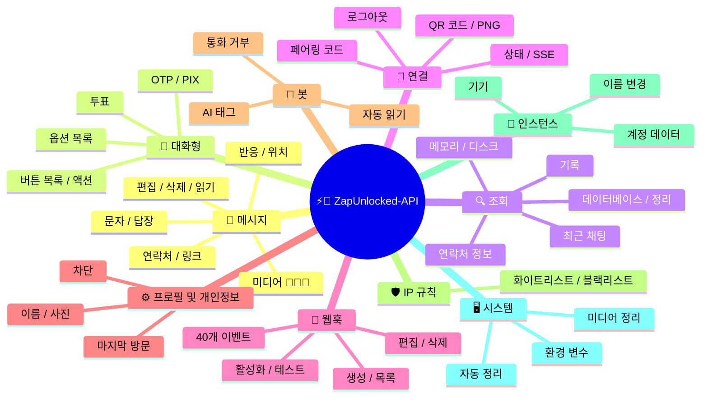
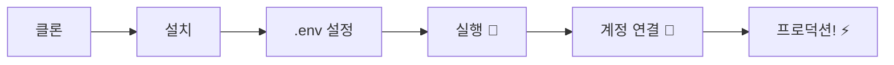

# ⚡💬 [ZapUnlocked-API](https://zapunlocked-api.kauafpss.com.br/)


<p align="center">
  
  <a href="https://downgit.github.io/#/home?url=https://github.com/kauafpssx/ZapUnlocked-API/blob/main/ZapUnlocked.collection.json">
    
  </a>
  
  
  
</p>

---

### 🌐 언어 선택:

<table width="100%">
  <tr>
    <td align="center" valign="middle"><a href="https://github.com/kauafpssx/ZapUnlocked-API/blob/main/README.md"></a></td>
    <td align="center" valign="middle"><a href="https://github.com/kauafpssx/ZapUnlocked-API/blob/main/docs/translations/en.md"></a></td>
    <td align="center" valign="middle"><a href="https://github.com/kauafpssx/ZapUnlocked-API/blob/main/docs/translations/es.md"></a></td>
    <td align="center" valign="middle"><a href="https://github.com/kauafpssx/ZapUnlocked-API/blob/main/docs/translations/fr.md"></a></td>
    <td align="center" valign="middle"><a href="https://github.com/kauafpssx/ZapUnlocked-API/blob/main/docs/translations/de.md"></a></td>
    <td align="center" valign="middle"><a href="https://github.com/kauafpssx/ZapUnlocked-API/blob/main/docs/translations/zh.md"></a></td>
    <td align="center" valign="middle"><a href="https://github.com/kauafpssx/ZapUnlocked-API/blob/main/docs/translations/ja.md"></a></td>
    <td align="center" valign="middle"><a href="https://github.com/kauafpssx/ZapUnlocked-API/blob/main/docs/translations/ru.md"></a></td>
    <td align="center" valign="middle"><a href="https://github.com/kauafpssx/ZapUnlocked-API/blob/main/docs/translations/it.md"></a></td>
    <td align="center" valign="middle"><a href="https://github.com/kauafpssx/ZapUnlocked-API/blob/main/docs/translations/ar.md"></a></td>
    <td align="center" valign="middle"><a href="https://github.com/kauafpssx/ZapUnlocked-API/blob/main/docs/translations/tr.md"></a></td>
    <td align="center" valign="middle"><a href="https://github.com/kauafpssx/ZapUnlocked-API/blob/main/docs/translations/hi.md"></a></td>
    <td align="center" valign="middle"><a href="https://github.com/kauafpssx/ZapUnlocked-API/blob/main/docs/translations/nl.md"></a></td>
  </tr>
</table>

---

##  ZapUnlocked-API란?

WhatsApp API 시장은 월 수십에서 수백 달러에 달하는 요금을 부과합니다: 사용량 제한, 대화당 요금, 타사 서버를 통과하는 데이터. **ZapUnlocked-API는 이를 바꾸기 위해 존재합니다.**

**Python**으로 구축되었으며 **[Neonize](https://github.com/krypton-byte/neonize)**를 연결 엔진으로 사용합니다. 이 API는 세션 관리, 복잡한 미디어 전송, 지능적인 상호작용 생성을 위한 간단한 REST 인터페이스(FastAPI)를 제공합니다. **무거운 데이터베이스 없읜, 월 요금 없읜, 누구에게도 의존하지 않읜.**

저희의 제안은 **기술적 우수성**과 **개발자 독립성**에 기반합니다. 강력한 도구는 자신만의 솔루션을 구축하는 사람들에게 접근 가능해야 한다고 믿습니다.

> [!TIP]
> 봇 통합, 알림 및 자동화된 고객 서비스 시스템을 구축하는 개발자에게 적합합니다. **비용 부담 없이.**

---

## 🗺️ API 개요




---

## ✨ 주요 기능

| 기능 | 설명 |
| :--- | :---- |
| 🧩 **상태 없는 버튼** | 암호화된 웹훅으로 데이터베이스 없이 대화형 흐름 생성 |
| 🔢 **QR 없는 페어링** | 숫자 코드로 연결 · GUI가 없는 서버에 이상적 |
| 🎵 **자동 오디오 변환** | iOS 및 Android에서 "방금 녹읜"(PTT)으로 표시되는 오디오 전송 |
| 📦 **스마트 미디어 큐** | 과도한 메모리 소비를 방지하는 자동 관리 |
| 🏷️ **동적 플레이스홀더** | `{{name}}`, `{{phone}}` 변수로 메시지 및 웹훅 사용자 지정 |

> [!NOTE]
> 모든 기능은 **100% 무료**이며 오픈소스 커뮤니티에 의해 유지됩니다.

---

## 📋 API 라우트

<details>
<summary><b>📨 메시지 전송</b> · 15개 엔드포인트</summary>

| 메서드 | 라우트 | 설명 | 바디 |
| :----- | :----- | :--- | :--- |
| `POST` | `/send` | 문자 메시지 전송 / 답장 | `phone`, `message` |
| `POST` | `/send_image` | 이미지 전송 | `phone`, `image_url` |
| `POST` | `/send_video` | 비디오 전송 (GIF 및 PTV 지원) | `phone`, `video_url` |
| `POST` | `/send_audio` | 오디오 전송 (자동 PTT 변환) | `phone`, `audio_url` |
| `POST` | `/send_document` | 문서 전송 | `phone`, `document_url` |
| `POST` | `/send_sticker` | 스티커 전송 | `phone`, `sticker_url` |
| `POST` | `/send_reaction` | 이모지 반응 전송 | `phone`, `messageId`, `emoji` |
| `POST` | `/send_location` | 위치 전송 | `phone`, `lat`, `lng` |
| `POST` | `/send_contact` | 연락처 전송 | `phone`, `name`, `contactPhone` |
| `POST` | `/send_contacts` | 여러 연락처 전송 | `phone`, `contacts` |
| `POST` | `/send_link` | 미리보기가 있는 링크 전송 | `phone`, `url` |
| `POST` | `/messages/delete` | 메시지 삭제 | `phone`, `messageId` |
| `POST` | `/messages/read` | 읽읜으로 표시 | `phone`, `messageIds` |
| `POST` | `/messages/edit` | 전송된 메시지 편집 | `phone`, `messageId`, `message` |
</details>

<details>
<summary><b>🔘 대화형 메시지</b> · 7개 엔드포인트</summary>

| 메서드 | 라우트 | 설명 | 바디 |
| :----- | :----- | :--- | :--- |
| `POST` | `/messages/send-button-list` | 버튼 목록 전송 | `phone`, `buttons` |
| `POST` | `/messages/send-button-actions` | 액션 버튼 전송 | `phone`, `buttons` |
| `POST` | `/messages/send-button-otp` | OTP 버튼 전송 | `phone`, `code` |
| `POST` | `/messages/send-button-pix` | PIX 버튼 전송 | `phone`, `pixKey` |
| `POST` | `/messages/send-option-list` | 옵션 목록 전송 | `phone`, `buttons` |
| `POST` | `/messages/send-poll` | 투표 전송 | `phone`, `name`, `options` |
| `POST` | `/messages/send-poll-vote` | 투표 참여 | `phone`, `options` |
</details>

<details>
<summary><b>🔍 조회 및 관리</b> · 8개 엔드포인트</summary>

| 메서드 | 라우트 | 설명 | 바디 |
| :----- | :----- | :--- | :--- |
| `POST` | `/management/fetch_messages` | 메시지 기록 가져오기 | `phone` |
| `POST` | `/management/recent_contacts` | 최근 채팅 목록 | ❌ |
| `GET` | `/management/memory` | 메모리 사용 상태 | ❌ |
| `GET` | `/management/volume_stats` | 디스크 사용량 확인 | ❌ |
| `GET` | `/management/database/status` | DB 상태 및 통계 | ❌ |
| `POST` | `/management/database/config` | DB 설정 구성 | `interval` |
| `POST` | `/management/database/cleanup` | 수동 DB 정리 | ❌ |
| `DELETE` | `/management/cleanup` | 메시지 큐 강제 정리 | ❌ |
</details>

<details>
<summary><b>📇 연락처</b> · 1개 엔드포인트</summary>

| 메서드 | 라우트 | 설명 | 바디 |
| :----- | :----- | :--- | :--- |
| `POST` | `/contacts/info` | 상세 연락처 정보 | `phone` |
</details>

<details>
<summary><b>🏠 일반</b> · 3개 엔드포인트</summary>

| 메서드 | 라우트 | 설명 | 바디 |
| :----- | :----- | :--- | :--- |
| `GET` | `/` | 환영 페이지 (HTML) | ❌ |
| `GET` | `/status` | 연결 및 세션 상태 | ❌ |
| `GET` | `/status/stream` | 실시간 상태 (SSE) | ❌ |
</details>

<details>
<summary><b>🔗 연결 (QR)</b> · 2개 엔드포인트</summary>

| 메서드 | 라우트 | 설명 | 바디 |
| :----- | :----- | :--- | :--- |
| `GET` | `/qr` | 대화형 QR 코드 보기 | ❌ |
| `GET` | `/qr/image` | QR 코드 이미지 가져오기 (Base64) | ❌ |
</details>

<details>
<summary><b>🔐 세션</b> · 2개 엔드포인트</summary>

| 메서드 | 라우트 | 설명 | 바디 |
| :----- | :----- | :--- | :--- |
| `POST` | `/session/pair` | 숫자 페어링 코드 생성 | `phone` |
| `POST` | `/session/logout` | 연결 끊기 및 세션 초기화 | ❌ |
</details>

<details>
<summary><b>📡 웹훅 (CRUD)</b> · 8개 엔드포인트</summary>

| 메서드 | 라우트 | 설명 | 바디 |
| :----- | :----- | :--- | :--- |
| `POST` | `/webhooks` | 이름 있는 웹훅 생성 | `name`, `url` |
| `GET` | `/webhooks` | 모든 웹훅 목록 | ❌ |
| `GET` | `/webhooks/{name}` | 이름으로 웹훅 가져오기 | ❌ |
| `PUT` | `/webhooks/{name}` | 웹훅 편집 | ❌ |
| `DELETE` | `/webhooks/{name}` | 웹훅 제거 | ❌ |
| `POST` | `/webhooks/{name}/toggle` | 활성화 / 비활성화 | `active` |
| `POST` | `/webhooks/{name}/test` | 웹훅 테스트 | ❌ |
| `GET` | `/webhooks/events` | 이벤트 유형 목록 (40개 유형) | ❌ |
</details>

<details>
<summary><b>⚙️ 프로필 및 개인정보</b> · 3개 엔드포인트</summary>

| 메서드 | 라우트 | 설명 | 바디 |
| :----- | :----- | :--- | :--- |
| `POST` | `/settings/profile` | 봇 이름 및 사진 변경 | ❌ |
| `POST` | `/settings/privacy` | 개인정보 설정 (마지막 방문 등) | ❌ |
| `POST` | `/settings/block` | 연락처 차단 / 차단 해제 | `phone`, `action` |
</details>

<details>
<summary><b>🤖 봇 설정</b> · 6개 엔드포인트</summary>

| 메서드 | 라우트 | 설명 | 바디 |
| :----- | :----- | :--- | :--- |
| `GET` | `/settings/bot` | 봇 설정 보기 | ❌ |
| `POST` | `/settings/bot` | 봇 설정 업데이트 (AI 태그, IP 제어) | ❌ |
| `PUT` | `/settings/instance/call-reject-auto` | 자동 통화 거부 | `value` |
| `PUT` | `/settings/instance/call-reject-message` | 통화 거부 메시지 | `value` |
| `PUT` | `/settings/instance/auto-read-message` | 자동 메시지 읽기 | `value` |
| `GET` | `/settings/phone-code/{phone}` | 전화번호로 페어링 코드 생성 | ❌ |
</details>

<details>
<summary><b>📱 인스턴스</b> · 3개 엔드포인트</summary>

| 메서드 | 라우트 | 설명 | 바디 |
| :----- | :----- | :--- | :--- |
| `GET` | `/instance/me` | 연결된 계정 데이터 | ❌ |
| `GET` | `/instance/device` | 기기 기술 데이터 | ❌ |
| `PUT` | `/instance/update-name` | 인스턴스 이름 변경 | `name` |
</details>

<details>
<summary><b>🛡️ IP 규칙</b> · 5개 엔드포인트</summary>

| 메서드 | 라우트 | 설명 | 바디 |
| :----- | :----- | :--- | :--- |
| `GET` | `/settings/ip-rules` | IP 규칙 보기 | ❌ |
| `POST` | `/settings/ip-rules/whitelist` | IP를 화이트리스트에 추가 | `ip` |
| `POST` | `/settings/ip-rules/blacklist` | IP를 블랙리스트에 추가 | `ip` |
| `DELETE` | `/settings/ip-rules/whitelist/{ip}` | IP를 화이트리스트에서 제거 | ❌ |
| `DELETE` | `/settings/ip-rules/blacklist/{ip}` | IP를 블랙리스트에서 제거 | ❌ |
</details>

<details>
<summary><b>🖥️ 시스템</b> · 5개 엔드포인트</summary>

| 메서드 | 라우트 | 설명 | 바디 |
| :----- | :----- | :--- | :--- |
| `GET` | `/system/env` | 환경 변수 보기 | ❌ |
| `PUT` | `/system/env` | 환경 변수 업데이트 | ❌ |
| `POST` | `/system/cleanup/force` | 강제 임시 미디어 정리 | ❌ |
| `GET` | `/system/cleanup/settings` | 자동 정리 설정 보기 | ❌ |
| `PUT` | `/system/cleanup/settings` | 자동 정리 간격 업데이트 | ❌ |
</details>

> **총: 68개 엔드포인트**

---

## 📡 Webhook 이벤트

모든 webhook은 표준 봉투를 수신합니다:

```json
{
  "event": "message.text",
  "timestamp": "2025-01-01T12:00:00Z",
  "data": { ... }
}
```

webhook에 `{{placeholders}}`가 포함된 커스텀 `body`가 있는 경우, 표준 봉투 대신 해당 body가 전송됩니다.


---

<details>
<summary><b>🏷️ 커스텀 body에서 사용 가능한 플레이스홀더</b></summary>

| 플레이스홀더 | 값 |
| :----------- | :-- |
| `{{from}}` | 발신자 번호 |
| `{{text}}` | 메시지 텍스트 |
| `{{phone}}` | `{{from}}`과 동일 |
| `{{id}}` | 메시지 ID |
| `{{requested}}` | 요청 수량 (fetchMessages) |
| `{{found}}` | 찾은 수량 (fetchMessages) |
| `{{timestamp}}` | 현재 UTC 타임스탬프 |

</details>

---


<details>
<summary><b>📥 수신 메시지</b> · 16개 이벤트</summary>

수신된 메시지 이벤트에 포함된 기본 필드:

```json
{
  "messageId": "3EB0ABCDEF123456",
  "from": "5511999999999",
  "fromName": "João Silva",
  "fromJid": "5511999999999@s.whatsapp.net",
  "isGroup": false
}
```

<details>
<summary><code>message.text</code> - 일반 / 포맷된 텍스트</summary>

```json
{
  "event": "message.text",
  "data": {
    "...base": "...",
    "text": "Olá! Como posso ajudar?",
    "quoted": { "id": "3EB0...", "fromMe": true }
  }
}
```
</details>

<details>
<summary><code>message.image</code> - 수신된 이미지</summary>

```json
{
  "event": "message.image",
  "data": {
    "...base": "...",
    "caption": "Foto do produto",
    "mimetype": "image/jpeg",
    "fileLength": 204800
  }
}
```
</details>

<details>
<summary><code>message.video</code> - 수신된 비디오</summary>

```json
{
  "event": "message.video",
  "data": {
    "...base": "...",
    "caption": "Veja esse vídeo!",
    "mimetype": "video/mp4",
    "fileLength": 5242880,
    "isPTT": false,
    "isGif": false
  }
}
```
</details>

<details>
<summary><code>message.audio</code> - 오디오 / 읜성 메모</summary>

```json
{
  "event": "message.audio",
  "data": {
    "...base": "...",
    "mimetype": "audio/ogg; codecs=opus",
    "fileLength": 30720,
    "isPTT": true,
    "durationSeconds": 8
  }
}
```
</details>

<details>
<summary><code>message.document</code> - 문서 / 파일</summary>

```json
{
  "event": "message.document",
  "data": {
    "...base": "...",
    "fileName": "contrato.pdf",
    "caption": "Segue o contrato",
    "mimetype": "application/pdf",
    "fileLength": 102400
  }
}
```
</details>

<details>
<summary><code>message.sticker</code> - 스티커</summary>

```json
{
  "event": "message.sticker",
  "data": {
    "...base": "...",
    "mimetype": "image/webp",
    "isAnimated": false
  }
}
```
</details>

<details>
<summary><code>message.contact</code> - 공유된 연락처</summary>

```json
{
  "event": "message.contact",
  "data": {
    "...base": "...",
    "displayName": "Maria Souza",
    "vcard": "BEGIN:VCARD\nVERSION:3.0\n..."
  }
}
```
</details>

<details>
<summary><code>message.location</code> - 위치</summary>

```json
{
  "event": "message.location",
  "data": {
    "...base": "...",
    "lat": -23.5505,
    "lng": -46.6333,
    "name": "Av. Paulista",
    "address": "Av. Paulista, 1000 - São Paulo"
  }
}
```
</details>

<details>
<summary><code>message.reaction</code> - 반응 (이모지)</summary>

```json
{
  "event": "message.reaction",
  "data": {
    "...base": "...",
    "emoji": "❤️",
    "targetMessageId": "3EB0ABCDEF123456",
    "isRemoved": false
  }
}
```
</details>

<details>
<summary><code>message.poll_created</code> - 수신된 투표</summary>

```json
{
  "event": "message.poll_created",
  "data": {
    "...base": "...",
    "pollName": "Qual o melhor sabor?",
    "options": ["Chocolate", "Morango", "Baunilha"]
  }
}
```
</details>

<details>
<summary><code>message.poll_vote</code> - 투표</summary>

```json
{
  "event": "message.poll_vote",
  "data": {
    "...base": "...",
    "pollId": "3EB0ABCDEF123456",
    "selectedOptions": ["Chocolate"]
  }
}
```
</details>

<details>
<summary><code>message.button_reply</code> - 버튼 클릭</summary>

```json
{
  "event": "message.button_reply",
  "data": {
    "...base": "...",
    "buttonId": "opcao_sim",
    "displayText": "Sim",
    "type": "quick_reply"
  }
}
```
</details>

<details>
<summary><code>message.list_reply</code> - 대화형 목록 선택</summary>

```json
{
  "event": "message.list_reply",
  "data": {
    "...base": "...",
    "rowId": "1",
    "title": "X-Burguer",
    "description": "R$ 18,90"
  }
}
```
</details>

<details>
<summary><code>message.deleted</code> - 발신자가 삭제한 메시지</summary>

```json
{
  "event": "message.deleted",
  "data": {
    "...base": "..."
  }
}
```
</details>

<details>
<summary><code>message.unknown</code> - 매핑되지 않은 유형</summary>

```json
{
  "event": "message.unknown",
  "data": {
    "...base": "...",
    "rawType": "senderKeyDistributionMessage"
  }
}
```
</details>

<details>
<summary><code>message.undecryptable</code> - 복호화할 수 없는 메시지</summary>

```json
{
  "event": "message.undecryptable",
  "data": {
    "...base": "...",
    "reason": "missing_decryption_key"
  }
}
```
</details>

</details>

<details>
<summary><b>📤 발신 메시지</b> · 4개 이벤트</summary>

<details>
<summary><code>message.sent</code> - 전송된 메시지 (수동)</summary>

```json
{
  "event": "message.sent",
  "data": {
    "to": "5511999999999",
    "type": "text",
    "messageId": "3EB0ABCDEF123456"
  }
}
```
</details>

<details>
<summary><code>message.read</code> - 수신자가 읽은 메시지</summary>

```json
{
  "event": "message.read",
  "data": {
    "from": "5511999999999",
    "messageId": "3EB0ABCDEF123456"
  }
}
```
</details>

<details>
<summary><code>message.delivered</code> - 수신자에게 전달된 메시지 (receipt type 1)</summary>

```json
{
  "event": "message.delivered",
  "data": {
    "from": "5511999999999",
    "messageId": "3EB0ABCDEF123456"
  }
}
```
</details>

<details>
<summary><code>message.receipt</code> - 기타 전달 확인 (receipt types 2, 3, 5+)</summary>

```json
{
  "event": "message.receipt",
  "data": {
    "from": "5511999999999",
    "messageId": "3EB0ABCDEF123456",
    "receiptType": 2
  }
}
```
</details>

</details>

<details>
<summary><b>🔗 연결</b> · 11개 이벤트</summary>

<details>
<summary><code>connection.connected</code> - WhatsApp 연결됨</summary>

```json
{
  "event": "connection.connected",
  "data": {
    "phone": "5511999999999"
  }
}
```
</details>

<details>
<summary><code>connection.disconnected</code> - WhatsApp 연결 끊김</summary>

```json
{
  "event": "connection.disconnected",
  "data": {}
}
```
</details>

<details>
<summary><code>connection.qr_ready</code> - QR 코드 생성됨</summary>

```json
{
  "event": "connection.qr_ready",
  "data": {
    "qr": "2@abc123..."
  }
}
```
</details>

<details>
<summary><code>connection.pair_code</code> - 페어링 코드 생성</summary>

```json
{
  "event": "connection.pair_code",
  "data": {
    "code": "ABC123"
  }
}
```
</details>

<details>
<summary><code>connection.pair_status</code> - 페어링 상태 업데이트</summary>

```json
{
  "event": "connection.pair_status",
  "data": {
    "status": "pairing"
  }
}
```
</details>

<details>
<summary><code>connection.logged_out</code> - 외부에서 로그아웃됨</summary>

```json
{
  "event": "connection.logged_out",
  "data": {}
}
```
</details>

<details>
<summary><code>connection.connect_failure</code> - 연결 오류</summary>

```json
{
  "event": "connection.connect_failure",
  "data": {
    "reason": "network_error"
  }
}
```
</details>

<details>
<summary><code>connection.stream_error</code> - 스트림 오류</summary>

```json
{
  "event": "connection.stream_error",
  "data": {
    "error": "stream_error_description"
  }
}
```
</details>

<details>
<summary><code>connection.temporary_ban</code> - 임시 차단</summary>

```json
{
  "event": "connection.temporary_ban",
  "data": {
    "phone": "5511999999999",
    "duration": 300
  }
}
```
</details>

<details>
<summary><code>connection.client_outdated</code> - 클라이언트 업데이트 필요</summary>

```json
{
  "event": "connection.client_outdated",
  "data": {
    "message": "Please update your WhatsApp client"
  }
}
```
</details>

<details>
<summary><code>connection.stream_replaced</code> - 스트림이 대체됨</summary>

```json
{
  "event": "connection.stream_replaced",
  "data": {}
}
```
</details>

</details>

<details>
<summary><b>👥 그룹</b> · 2개 이벤트</summary>

<details>
<summary><code>group.join</code> - 그룹에 새 멤버</summary>

```json
{
  "event": "group.join",
  "data": {
    "groupId": "123456789-123456@g.us",
    "who": "5511999999999",
    "author": "5511888888888"
  }
}
```
</details>

<details>
<summary><code>group.update</code> - 그룹 업데이트</summary>

```json
{
  "event": "group.update",
  "data": {
    "groupId": "123456789-123456@g.us",
    "action": "subject_change",
    "value": "새 그룹 이름"
  }
}
```
</details>

</details>

<details>
<summary><b>👤 연락처 / 프레즌스</b> · 4개 이벤트</summary>

<details>
<summary><code>contact.presence</code> - 프레즌스 상태 변경</summary>

```json
{
  "event": "contact.presence",
  "data": {
    "from": "5511999999999@s.whatsapp.net",
    "presence": "available"
  }
}
```
</details>

<details>
<summary><code>contact.chat_presence</code> - 채팅 프레즌스 변경</summary>

```json
{
  "event": "contact.chat_presence",
  "data": {
    "from": "5511999999999@s.whatsapp.net",
    "chatPresence": "composing",
    "media": 0
  }
}
```
</details>

<details>
<summary><code>contact.picture_change</code> - 프로필 사진 변경</summary>

```json
{
  "event": "contact.picture_change",
  "data": {
    "from": "5511999999999@s.whatsapp.net",
    "profilePic": "base64_encoded_image"
  }
}
```
</details>

<details>
<summary><code>contact.identity_change</code> - 연락처 ID 변경</summary>

```json
{
  "event": "contact.identity_change",
  "data": {
    "from": "5511999999999@s.whatsapp.net",
    "oldIdentity": "abc123",
    "newIdentity": "def456"
  }
}
```
</details>

</details>

<details>
<summary><b>📞 통화</b> · 3개 이벤트</summary>

<details>
<summary><code>call.received</code> - 수신 전화</summary>

```json
{
  "event": "call.received",
  "data": {
    "from": "5511999999999",
    "fromJid": "5511999999999@s.whatsapp.net",
    "callId": "ABC123DEF456"
  }
}
```
</details>

<details>
<summary><code>call.accepted</code> - 통화 수락</summary>

```json
{
  "event": "call.accepted",
  "data": {
    "from": "5511999999999",
    "fromJid": "5511999999999@s.whatsapp.net",
    "callId": "ABC123DEF456"
  }
}
```
</details>

<details>
<summary><code>call.terminated</code> - 통화 종료</summary>

```json
{
  "event": "call.terminated",
  "data": {
    "from": "5511999999999",
    "fromJid": "5511999999999@s.whatsapp.net",
    "callId": "ABC123DEF456",
    "reason": "timeout"
  }
}
```
</details>

</details>

---

## 🛠️ 설치 및 호스팅

> 전문 WhatsApp API를 **ZapUnlocked-API**로 **5분 이내에** 실행하세요.

### 💻 로컬 설치

개발, 테스트 또는 자체 서버 실행에 이상적입니다.



**1. 저장소 클론**

```bash
git clone https://github.com/kauafpssx/ZapUnlocked-API.git
cd ZapUnlocked-API
```

**2. 의존성 설치**

| 시스템 | 명령어 |
| :----- | :----- |
| 🪟 Windows | `scripts\install\install.bat` |
| 🐧 Linux / macOS | `bash scripts/install/install.sh` |

**3. 환경 설정**

| 시스템 | 명령어 |
| :----- | :----- |
| 🪟 Windows | `scripts\generate-env\generate-env.bat` |
| 🐧 Linux / macOS | `bash scripts/generate-env/generate-env.sh` |

| 변수 | 설명 |
| :--- | :--- |
| `API_KEY` | 모든 엔드포인트 인증을 위한 비밀번호 |
| `INTERNAL_SECRET` | 웹훅 서명 검증을 위한 토큰 |
| `PORT` | API 포트 (기본값: `8300`) |

**4. API 실행**

| 시스템 | 명령어 |
| :----- | :----- |
| 🪟 Windows | `scripts\run\run.bat` |
| 🐧 Linux / macOS | `bash scripts/run/run.sh` |

---

### ☁️ 호스팅: Alwaysdata (24/7 무료)

**Alwaysdata**는 서버를 직접 유지할 필요 없이 안정적이고 무료로 API를 호스팅하기 위한 권장 옵션입니다.

#### 📊 무료 플랜 기능

| 기능 | 무료 제공 |
| :--- | :-------- |
| 💾 저장소 | **1 GB SSD** |
| 🧠 RAM | **256 MB** |
| ⚡ CPU | **1/4 vCPU** |
| 🔄 백업 | **3일** 자동 |
| 📡 가동 시간 | 서비스를 통한 **24/7** |

#### 👣 배포 단계

**1.** [Alwaysdata.com](https://www.alwaysdata.com/)에서 계정 생성 · **무료** 플랜.

**2.** SSH 접속: `https://ssh-[사용자].alwaysdata.net`.

**3.** 클론 및 설치:

```bash
git clone https://github.com/kauafpssx/ZapUnlocked-API.git ~/ZapUnlocked-API
cd ~/ZapUnlocked-API
bash scripts/install/install.sh
```

**4.** *(선택사항)* `.env` 파일 생성:

```bash
bash scripts/generate-env/generate-env.sh
```

> [!NOTE]
> 설치 스크립트는 이미 `.env` 구성 여부를 묻습니다. **예**라고 답했다면 이 단계를 건너뛸 수 있습니다. 그렇지 않으면 위 명령어를 실행하거나 `.env`를 수동으로 구성하세요.

**5.** 서비스 (24/7) 설정: **Advanced > Services > Add a service**

| 필드 | 값 |
| :--- | :- |
| **Command** | `bash scripts/run/run.sh` |
| **Working directory** | `ZapUnlocked-API` |
| **Environment variables** | `PORT=8300` |

**6.** 접속 URL:

```
http://services-[사용자].alwaysdata.net:8300/
```

> [!TIP]
> URL은 이미 외부에서 접근 가능합니다. *(선택 사항)* 사용자 정의 도메인을 사용하려면 **Web > Sites > Add a site**에서 `http://[사용자].alwaysdata.net`을 가리키는 **Reverse Proxy**를 설정하세요.

---

## 🔐 인증 (로그인)

배포 후 브라우저에서 다읜 주소로 접속하여 WhatsApp 계정을 연결하세요:

```text
http://services-[사용자].alwaysdata.net:8300/qr?API_KEY=비밀_키
```

---

## 📖 공식 문서

<p align="center">
  👉 <a href="https://zapunlocked-api.kauafpss.com.br"><strong>zapunlocked-api.kauafpss.com.br</strong></a>
</p>

자세한 기술 문서, 코드 예제 및 대화형 플레이그라운드는 공식 웹사이트를 방문하세요.

> [!TIP]
> **LLMs.txt**를 AI 색인으로 사용하세요: [`zapunlocked-api.kauafpss.com.br/llms.txt`](https://zapunlocked-api.kauafpss.com.br/llms.txt). 탐색 전 모든 페이지를 확인하세요.

---

## ❤️ 크레딧 및 감사

| 프로젝트 | 설명 |
| :------- | :---- |
| [](https://github.com/krypton-byte/neonize) | WhatsApp Web 네이티브 연결을 위한 Python 라이브러리 |
| [](https://github.com/tulir/whatsmeow) | Neonize의 기반이 되는 Go 라이브러리 · 연결의 핵심 |
| [](https://www.alwaysdata.com/) | 고품질 무료 인프라 |

---

## 📄 라이선스

이 프로젝트는 **MIT 라이선스**에 따라 라이선스가 부여됩니다.

<p align="center">
  💜로 제작: <a href="https://www.instagram.com/kauafpss_/">Kauã Ferreira</a>
</p>