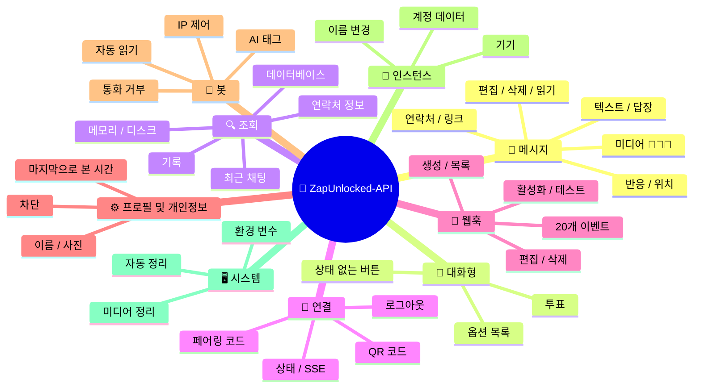
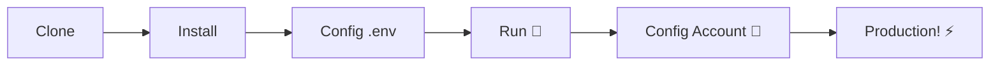

# 🚀 ZapUnlocked-API 📲✨


<p align="center">
  
  
  
  
  
</p>

<table width="100%">
  <tr>
    <td align="center" valign="middle"><a href="https://github.com/kauafpssx/ZapUnlocked-API/blob/main/docs/translations/en.md"></a></td>
    <td align="center" valign="middle"><a href="https://github.com/kauafpssx/ZapUnlocked-API/blob/main/docs/translations/es.md"></a></td>
    <td align="center" valign="middle"><a href="https://github.com/kauafpssx/ZapUnlocked-API/blob/main/docs/translations/fr.md"></a></td>
    <td align="center" valign="middle"><a href="https://github.com/kauafpssx/ZapUnlocked-API/blob/main/docs/translations/de.md"></a></td>
    <td align="center" valign="middle"><a href="https://github.com/kauafpssx/ZapUnlocked-API/blob/main/docs/translations/zh.md"></a></td>
    <td align="center" valign="middle"><a href="https://github.com/kauafpssx/ZapUnlocked-API/blob/main/docs/translations/ja.md"></a></td>
    <td align="center" valign="middle"><a href="https://github.com/kauafpssx/ZapUnlocked-API/blob/main/docs/translations/ru.md"></a></td>
    <td align="center" valign="middle"><a href="https://github.com/kauafpssx/ZapUnlocked-API/blob/main/docs/translations/it.md"></a></td>
    <td align="center" valign="middle"><a href="https://github.com/kauafpssx/ZapUnlocked-API/blob/main/docs/translations/ar.md"></a></td>
    <td align="center" valign="middle"><a href="https://github.com/kauafpssx/ZapUnlocked-API/blob/main/docs/translations/tr.md"></a></td>
    <td align="center" valign="middle"><a href="https://github.com/kauafpssx/ZapUnlocked-API/blob/main/docs/translations/hi.md"></a></td>
    <td align="center" valign="middle"><a href="https://github.com/kauafpssx/ZapUnlocked-API/blob/main/docs/translations/nl.md"></a></td>
  </tr>
</table>

---

##  ZapUnlocked-API란?

WhatsApp API 시장은 월간 구독료로 터무니없는 요금을 부과합니다: 한 달에 수십에서 수백 달러, 사용량 제한, 대화당 요금, 제3자 서버를 통과하는 데이터. **ZapUnlocked-API는 이를 바꾸기 위해 존재합니다.**

**Python**과 **[Neonize](https://github.com/krypton-byte/neonize)** 를 연결 엔진으로 구축된 이 API는 세션 관리, 복잡한 미디어 전송 및 지능형 상호 작용 생성을 위한 간단한 REST 인터페이스(FastAPI)를 제공합니다. **무거운 데이터베이스 없음, 월 사용료 없음, 누구에게도 의존하지 않음.**

우리의 제안은 **기술적 우수성**과 **개발자 독립성**에 기반을 두고 있습니다. 강력한 도구는 자신만의 솔루션을 구축하는 사람들에게 접근 가능해야 한다고 믿습니다.

> [!TIP]
> 봇 통합, 알림 및 자동화된 서비스 시스템에서 민첩성을 원하는 개발자에게 완벽합니다. **그것에 대해 아무것도 지불하지 않고.**

---

## 🗺️ API 개요



---

## ✨ 주요 기능

| 기능 | 설명 |
| :--- | :-------- |
| 🧩 **상태 없는 버튼** | 암호화된 웹훅으로 데이터베이스 없이 대화형 흐름 생성 |
| 🔢 **QR 코드 없이 페어링** | 숫자 코드로 연결 · GUI가 없는 서버에 이상적 |
| 🎵 **자동 오디오 변환** | 오디오를 녹음된 것처럼(PTT) 기본적으로 전송 |
| 📦 **스마트 미디어 대기열** | 과도한 메모리 소비를 방지하기 위한 자동 관리 |
| 🏷️ **동적 플레이스홀더** | `{{name}}`, `{{day}}`, `{{phone}}`으로 메시지 및 웹훅 사용자 정의 |

> [!NOTE]
> 모든 기능은 **100% 무료**이며 오픈 소스 커뮤니티에서 유지 관리합니다.

---

## 📋 API 라우트

<details>
<summary><b>📨 메시지 전송</b> · 13개 엔드포인트</summary>

| 메서드 | 라우트 | 설명 |
| :----- | :--- | :-------- |
| `POST` | `/send` | 텍스트 메시지 보내기 / 답장 |
| `POST` | `/send_image` | 이미지 보내기 |
| `POST` | `/send_video` | 동영상 보내기 (GIF 및 PTV 지원) |
| `POST` | `/send_audio` | 오디오 보내기 (PTT 자동 변환) |
| `POST` | `/send_document` | 문서 보내기 |
| `POST` | `/send_sticker` | 스티커 보내기 |
| `POST` | `/send_reaction` | 이모지 반응 보내기 |
| `POST` | `/send_location` | 위치 보내기 |
| `POST` | `/send_contact` | 연락처 보내기 |
| `POST` | `/send_contacts` | 여러 연락처 보내기 |
| `POST` | `/send_link` | 미리보기가 있는 링크 보내기 |
| `POST` | `/messages/delete` | 메시지 삭제 |
| `POST` | `/messages/read` | 읽음으로 표시 |
| `POST` | `/messages/edit` | 보낸 메시지 편집 |
</details>

<details>
<summary><b>🔘 대화형 메시지</b> · 4개 엔드포인트</summary>

| 메서드 | 라우트 | 설명 |
| :----- | :--- | :-------- |
| `POST` | `/send_wbuttons` | 버튼 보내기 (목록, 작업, OTP, PIX) |
| `POST` | `/messages/send-option-list` | 옵션 목록 보내기 |
| `POST` | `/messages/send-poll` | 투표 보내기 |
| `POST` | `/messages/send-poll-vote` | 투표에 참여 |
</details>

<details>
<summary><b>🔍 조회 및 관리</b> · 7개 엔드포인트</summary>

| 메서드 | 라우트 | 설명 |
| :----- | :--- | :-------- |
| `POST` | `/contacts/info` | 연락처 상세 정보 |
| `POST` | `/management/fetch_messages` | 메시지 기록 가져오기 |
| `POST` | `/management/recent_contacts` | 최근 채팅 목록 |
| `GET` | `/management/memory` | 메모리 사용 상태 |
| `GET` | `/management/volume_stats` | 디스크 사용량 확인 |
| `GET` | `/management/database/status` | 데이터베이스 상태 및 통계 |
| `POST` | `/management/database/cleanup` | 데이터베이스 수동 정리 |
</details>

<details>
<summary><b>🔗 연결 및 세션</b> · 8개 엔드포인트</summary>

| 메서드 | 라우트 | 설명 |
| :----- | :--- | :-------- |
| `GET` | `/` | 환영 페이지 (HTML) |
| `GET` | `/status` | 연결 및 세션 상태 |
| `GET` | `/status/stream` | 실시간 상태 (SSE) |
| `GET` | `/qr` | 대화형 QR 코드 보기 |
| `GET` | `/qr/image` | QR 코드 이미지 가져오기 (Base64) |
| `POST` | `/qr/pair` | 숫자 페어링 코드 생성 |
| `GET` | `/settings/phone-code/{phone}` | 번호로 코드 생성 |
| `POST` | `/qr/logout` | 연결 끊기 및 세션 재설정 |
</details>

<details>
<summary><b>📡 웹훅 (CRUD)</b> · 7개 엔드포인트</summary>

| 메서드 | 라우트 | 설명 |
| :----- | :--- | :-------- |
| `POST` | `/webhooks` | 이름이 지정된 웹훅 생성 |
| `GET` | `/webhooks` | 모든 웹훅 목록 |
| `PUT` | `/webhooks/{name}` | 웹훅 편집 |
| `DELETE` | `/webhooks/{name}` | 웹훅 제거 |
| `POST` | `/webhooks/{name}/toggle` | 활성화 / 비활성화 |
| `POST` | `/webhooks/{name}/test` | 웹훅 테스트 |
| `GET` | `/webhooks/events` | 이벤트 유형 목록 (20가지 유형) |
</details>

<details>
<summary><b>⚙️ 프로필 및 개인정보</b> · 3개 엔드포인트</summary>

| 메서드 | 라우트 | 설명 |
| :----- | :--- | :-------- |
| `POST` | `/settings/profile` | 봇 이름 및 사진 변경 |
| `POST` | `/settings/privacy` | 개인정보 조정 (마지막으로 본 시간 등) |
| `POST` | `/settings/block` | 연락처 차단 / 차단 해제 |
</details>

<details>
<summary><b>🤖 봇 설정</b> · 5개 엔드포인트</summary>

| 메서드 | 라우트 | 설명 |
| :----- | :--- | :-------- |
| `GET` | `/settings/bot` | 봇 설정 보기 |
| `POST` | `/settings/bot` | 설정 업데이트 (AI 태그, IP 제어) |
| `PUT` | `/settings/instance/call-reject-auto` | 통화 자동 거부 |
| `PUT` | `/settings/instance/call-reject-message` | 거부된 통화 메시지 |
| `PUT` | `/settings/instance/auto-read-message` | 메시지 자동 읽기 |
</details>

<details>
<summary><b>📱 인스턴스</b> · 3개 엔드포인트</summary>

| 메서드 | 라우트 | 설명 |
| :----- | :--- | :-------- |
| `GET` | `/instance/me` | 연결된 계정 데이터 |
| `GET` | `/instance/device` | 기기 기술 데이터 |
| `PUT` | `/instance/update-name` | 인스턴스 이름 변경 |
</details>

<details>
<summary><b>🖥️ 시스템</b> · 5개 엔드포인트</summary>

| 메서드 | 라우트 | 설명 |
| :----- | :--- | :-------- |
| `GET` | `/system/env` | 환경 변수 보기 |
| `PUT` | `/system/env` | 환경 변수 업데이트 |
| `POST` | `/system/cleanup/force` | 임시 미디어 강제 정리 |
| `GET` | `/system/cleanup/settings` | 자동 정리 설정 보기 |
| `PUT` | `/system/cleanup/settings` | 자동 정리 간격 업데이트 |
</details>

> **총: 56개 엔드포인트** · WhatsApp 자동화를 위한 완전한 REST.

---

## 🛠️ 설치 및 호스팅

> **ZapUnlocked-API**로 전문 WhatsApp API를 **5분 이내에** 가동하세요.

### 💻 로컬 설치

개발, 테스트 또는 자체 서버에서 실행하기에 이상적입니다.



**1. 저장소 클론**

```bash
git clone https://github.com/kauafpssx/ZapUnlocked-API.git
cd ZapUnlocked-API
```

**2. 종속성 설치**

| 시스템 | 명령어 |
| :----- | :----- |
| 🪟 Windows | `scripts\install\install.bat` |
| 🐧 Linux / macOS | `bash scripts/install/install.sh` |

**3. 환경 구성**

| 시스템 | 명령어 |
| :----- | :----- |
| 🪟 Windows | `scripts\generate-env\generate-env.bat` |
| 🐧 Linux / macOS | `bash scripts/generate-env/generate-env.sh` |

| 변수 | 설명 |
| :--- | :---- |
| `API_KEY` | 모든 엔드포인트 인증을 위한 비밀번호 |
| `INTERNAL_SECRET` | 웹훅 서명 확인을 위한 토큰 |
| `PORT` | API 포트 (기본값: `8300`) |

**4. API 실행**

| 시스템 | 명령어 |
| :----- | :----- |
| 🪟 Windows | `scripts\run\run.bat` |
| 🐧 Linux / macOS | `bash scripts/run/run.sh` |

---

### ☁️ 호스팅: Alwaysdata (24/7 무료)

**Alwaysdata**는 서버를 계속 켜둘 필요 없이 안정적이고 무료로 API를 호스팅하기 위한 권장 옵션입니다.

#### 📊 무료 플랜 리소스

| 리소스 | 무료에서 사용 가능 |
| :----- | :----------------- |
| 💾 저장소 | **1 GB SSD** |
| 🧠 RAM | **256 MB** |
| ⚡ CPU | **1/4 vCPU** |
| 🔄 백업 | **3일** 자동 |
| 📡 가동 시간 | 서비스를 통해 **24/7** |

#### 👣 배포 단계

**1.** [Alwaysdata.com](https://www.alwaysdata.com/)에서 계정 생성 · **무료** 플랜.

**2.** SSH `https://ssh-[kullanici].alwaysdata.net`에 접속.

**3.** 클론 및 설치:

```bash
git clone https://github.com/kauafpssx/ZapUnlocked-API.git ~/ZapUnlocked-API
cd ~/ZapUnlocked-API
bash scripts/install/install.sh
```

**4.** `.env` 생성:

```bash
bash scripts/generate-env/generate-env.sh
```

**5.** **Advanced · Services · Add a service**에서 서비스(24/7) 구성:

| 필드 | 값 |
| :--- | :---- |
| **Name** | `ZapUnlocked-API` |
| **Command** | `python3 main.py` |
| **Working directory** | `ZapUnlocked-API` |
| **Environment variables** | `PORT=8300` |

**6.** 다음을 통해 접속:

```
http://services-[kullanici].alwaysdata.net:8300/
```

> [!TIP]
> URL은 외부에서 이미 접근 가능합니다. *(선택 사항)* 사용자 정의 도메인을 사용하려면 **Web · Sites · Add a site**에서 `http://[kullanici].alwaysdata.net`을 가리키는 **역방향 프록시 (Reverse Proxy)** 를 구성하세요.

---

## 🔐 인증 (로그인)

배포 후 브라우저에서 다음에 접속하여 WhatsApp 계정을 연결하세요:

```text
http://services-[kullanici].alwaysdata.net:8300/qr?API_KEY=비밀_비밀번호
```

---

## 📖 공식 문서

<p align="center">
  👉 <a href="https://zapunlocked-api.kauafpss.com.br"><strong>zapunlocked-api.kauafpss.com.br</strong></a>
</p>

자세한 기술 문서, 코드 예제 및 대화형 플레이그라운드는 공식 웹사이트를 방문하세요.

> [!TIP]
> **LLMs.txt**를 AI 색인으로 사용: [`zapunlocked-api.kauafpss.com.br/llms.txt`](https://zapunlocked-api.kauafpss.com.br/llms.txt). 탐색하기 전에 모든 페이지를 찾아보세요.

---

## ❤️ 크레딧 및 감사

| 프로젝트 | 설명 |
| :------- | :-------- |
| [](https://github.com/krypton-byte/neonize) | WhatsApp Web과 기본 연결을 위한 Python 라이브러리 |
| [](https://github.com/tulir/whatsmeow) | Neonize의 기반이 되는 Go 라이브러리 · 연결의 핵심 |
| [](https://www.alwaysdata.com/) | 고품질 무료 인프라 |

---

## 📄 라이선스

이 프로젝트는 **MIT 라이선스**에 따라 라이선스가 부여됩니다.

<p align="center">
  <a href="https://www.instagram.com/kauafpss_/">Kauã Ferreira</a> 💜 제작
</p>

