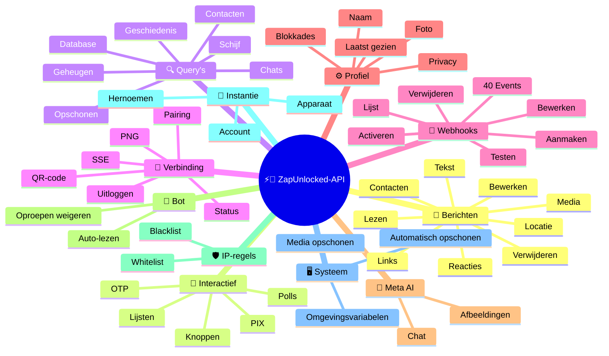
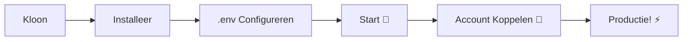

# ⚡💬 [ZapUnlocked-API](https://zapunlocked-api.kauafpss.com.br/)


<p align="center">
  
  <a href="https://downgit.github.io/#/home?url=https://github.com/kauafpssx/ZapUnlocked-API/blob/main/ZapUnlocked.collection.json">
    
  </a>
  
  
  
</p>

---

### 🌐 Taal Selecteren:

<table width="100%">
  <tr>
    <td align="center" valign="middle"><a href="https://github.com/kauafpssx/ZapUnlocked-API/blob/main/README.md"></a></td>
    <td align="center" valign="middle"><a href="https://github.com/kauafpssx/ZapUnlocked-API/blob/main/docs/translations/en.md"></a></td>
    <td align="center" valign="middle"><a href="https://github.com/kauafpssx/ZapUnlocked-API/blob/main/docs/translations/es.md"></a></td>
    <td align="center" valign="middle"><a href="https://github.com/kauafpssx/ZapUnlocked-API/blob/main/docs/translations/fr.md"></a></td>
    <td align="center" valign="middle"><a href="https://github.com/kauafpssx/ZapUnlocked-API/blob/main/docs/translations/de.md"></a></td>
    <td align="center" valign="middle"><a href="https://github.com/kauafpssx/ZapUnlocked-API/blob/main/docs/translations/zh.md"></a></td>
    <td align="center" valign="middle"><a href="https://github.com/kauafpssx/ZapUnlocked-API/blob/main/docs/translations/ja.md"></a></td>
    <td align="center" valign="middle"><a href="https://github.com/kauafpssx/ZapUnlocked-API/blob/main/docs/translations/ru.md"></a></td>
    <td align="center" valign="middle"><a href="https://github.com/kauafpssx/ZapUnlocked-API/blob/main/docs/translations/it.md"></a></td>
    <td align="center" valign="middle"><a href="https://github.com/kauafpssx/ZapUnlocked-API/blob/main/docs/translations/ar.md"></a></td>
    <td align="center" valign="middle"><a href="https://github.com/kauafpssx/ZapUnlocked-API/blob/main/docs/translations/tr.md"></a></td>
    <td align="center" valign="middle"><a href="https://github.com/kauafpssx/ZapUnlocked-API/blob/main/docs/translations/ko.md"></a></td>
    <td align="center" valign="middle"><a href="https://github.com/kauafpssx/ZapUnlocked-API/blob/main/docs/translations/hi.md"></a></td>
    <td align="center" valign="middle"><a href="https://github.com/kauafpssx/ZapUnlocked-API/blob/main/docs/translations/nl.md"></a></td>
  </tr>
</table>

---

##  Wat is ZapUnlocked-API?

De WhatsApp API-markt rekent maandelijks hoge bedragen: tientallen tot honderden euro's per maand, met gebruikslimieten, kosten per gesprek en gegevens die via servers van derden gaan. **ZapUnlocked-API is gratis en open-source.**

Gebouwd in **Python** met **[Neonize](https://github.com/krypton-byte/neonize)** als verbindingsmotor, gebruikt de API FastAPI voor het beheren van sessies, verzenden van media en maken van bots. Geen zware database, geen maandelijkse kosten, geen servers van derden.

> [!TIP]
> Gebruik voor bots, meldingen en klantenservice-systemen. **100% gratis.**

> [!IMPORTANT]
> 🤖 **Meta AI geïntegreerd.** Gebruik `/ai/ask` om te chatten en `/ai/imagine` om afbeeldingen te genereren in WhatsApp. [Zie route](#-meta-ai--2-endpoints).

---

## 🗺️ API Overzicht



---

## ✨ Hoogtepunten

| Functionaliteit | Beschrijving |
| :------------- | :-------- |
| 🧩 **Staatloze Knoppen** | Creëer interactieve stromen zonder database, met versleutelde webhooks |
| 🔢 **Koppelen zonder QR-code** | Verbind via numerieke code · voor servers zonder GUI |
| 🎵 **Automatische Audioconversie** | Stuur audio die verschijnt als "zojuist opgenomen" (PTT) native |
| 📦 **Mediawachtrij** | Automatisch beheer om overmatig geheugengebruik te voorkomen |
| 🏷️ **Dynamische Placeholders** | Personaliseer berichten en webhooks met `{{name}}`, `{{day}}`, `{{phone}}` |
| 🤖 **Meta AI** | Chat en genereer afbeeldingen met AI in WhatsApp. |
| ⌨️ **Universele Parameters** | `delay_message`, `delay_typing`, `reply`/`quoted_id` en `@vermeldingen` werken op **elk** verzend endpoint. |
| 🔐 **Ondertekende Webhooks** | Integriteit via HMAC-SHA256. Uw webhook accepteert alleen legitieme gegevens. |
| 🔄 **Automatisch Herverbinden** | Herverbindt automatisch bij verbreking, externe uitlogging of streamfout. |
| 📁 **Bestandsupload + URL** | Stuur media via directe upload **of** openbare URL. |

> [!NOTE]
> Alle functionaliteiten zijn **100% gratis** en worden onderhouden door de open-source gemeenschap.

---

## 📋 API Routes

<details>
<summary><b>📨 Berichten Verzenden</b> · 15 endpoints</summary>

| Methode | Route | Beschrijving | Body |
| :----- | :--- | :-------- | :--- |
| `POST` | `/send` | Tekstbericht verzenden / antwoorden | `phone`, `message` |
| `POST` | `/send_image` | Afbeelding verzenden | `phone`, `image_url` |
| `POST` | `/send_video` | Video verzenden (ondersteunt GIF en PTV) | `phone`, `video_url` |
| `POST` | `/send_gif` | Geanimeerde GIF verzenden | `phone`, `url` |
| `POST` | `/send_audio` | Audio verzenden (met automatische PTT-conversie) | `phone`, `audio_url` |
| `POST` | `/send_document` | Document verzenden | `phone`, `document_url` |
| `POST` | `/send_sticker` | Sticker verzenden | `phone`, `sticker_url` |
| `POST` | `/send_reaction` | Reactie met emoji verzenden | `phone`, `messageId`, `emoji` |
| `POST` | `/send_location` | Locatie verzenden | `phone`, `lat`, `lng` |
| `POST` | `/send_contact` | Contact verzenden | `phone`, `name`, `contactPhone` |
| `POST` | `/send_contacts` | Meerdere contacten verzenden | `phone`, `contacts` |
| `POST` | `/send_link` | Link met preview verzenden | `phone`, `url` |
| `POST` | `/messages/delete` | Bericht verwijderen | `phone`, `messageId` |
| `POST` | `/messages/read` | Markeren als gelezen | `phone`, `messageIds` |
| `POST` | `/messages/edit` | Verzonden bericht bewerken | `phone`, `messageId`, `message` |
</details>

> [!TIP]
> **Universele parameters.** Beschikbaar op **elk** berichten verzend endpoint (inclusief interactieve):
>
> | Parameter | Wat het doet |
> | :-------- | :----------- |
> | `delay_message` | Wacht N seconden voor het verzenden. |
> | `delay_typing` | Toont "typt..." gedurende N seconden voor het verzenden. |
> | `reply` / `quoted_id` | ID van het bericht om op te reageren (citaat). |
> | `mentioned` | JSON-array van telefoonnummers om te @vermelden. Voorbeeld: `["5511999999999"]` |

<details>
<summary><b>🔘 Interactieve Berichten</b> · 9 endpoints</summary>

| Methode | Route | Beschrijving | Body |
| :----- | :--- | :-------- | :--- |
| `POST` | `/messages/send-button-list` | Optielijst knop | `phone`, `buttons` |
| `POST` | `/messages/send-button-quick-reply` | Snelantwoord knop | `phone`, `title`, `buttons` |
| `POST` | `/messages/send-button-otp` | Kopieerknop (OTP) | `phone`, `code` |
| `POST` | `/messages/send-button-pix` | PIX-knop | `phone`, `pixKey` |
| `POST` | `/messages/send-button-url` | Knop met link | `phone`, `title`, `url` |
| `POST` | `/messages/send-button-call` | Belknop | `phone`, `title`, `phoneNumber` |
| `POST` | `/messages/send-option-list` | ⛔ **Tijdelijk uitgeschakeld**: incompatibel met iPhone, Android en Web | `phone`, `buttons` |
| `POST` | `/messages/send-poll` | Poll verzenden | `phone`, `name`, `options` |
| `POST` | `/messages/send-poll-vote` | Stemmen op poll | `phone`, `options` |
</details>

<details>
<summary><b>🔍 Query's en Beheer</b> · 12 endpoints</summary>

| Methode | Route | Beschrijving | Body |
| :----- | :--- | :-------- | :--- |
| `POST` | `/management/fetch_messages` | Berichtgeschiedenis ophalen | `phone` |
| `POST` | `/management/recent_contacts` | Recente chats weergeven | ❌ |
| `GET` | `/management/chats` | Chats met geschiedenis weergeven | ❌ |
| `GET` | `/management/chats/{phone}/messages` | Berichten van een specifieke chat | ❌ |
| `GET` | `/management/contacts/{phone}` | Gedetailleerde contactgegevens | ❌ |
| `GET` | `/management/groups` | Groepen weergeven | ❌ |
| `DELETE` | `/management/cleanup` | Chatgegevens opschonen | ❌ |
| `GET` | `/management/export` | Config exporteren (webhooks, instellingen, IP-regels) | ❌ |
| `POST` | `/management/import` | Config importeren via bestandsupload | `file` |
| `GET` | `/management/database/status` | DB-status en statistieken | ❌ |
| `POST` | `/management/database/config` | Database-instellingen bijwerken | `interval` |
| `POST` | `/management/database/cleanup` | Handmatige DB-opschoning | ❌ |
</details>

<details>
<summary><b>👤 Contacten</b> · 1 endpoint</summary>

| Methode | Route | Beschrijving | Body |
| :----- | :--- | :-------- | :--- |
| `POST` | `/contacts/info` | Gedetailleerde contactinformatie | `phone` |
</details>

<details>
<summary><b>🏠 Algemeen / Status</b> · 9 endpoints</summary>

| Methode | Route | Beschrijving | Body |
| :----- | :--- | :-------- | :--- |
| `GET` | `/` | Welkomstpagina (HTML) | ❌ |
| `GET` | `/status` | Volledige status (WhatsApp, CPU, geheugen, schijf) | ❌ |
| `GET` | `/status/stream` | Real-time status via SSE | ❌ |
| `GET` | `/status/health` | Eenvoudige health check (`{"ok":true}`) | ❌ |
| `GET` | `/status/readiness` | Readiness check (503 als WhatsApp verbroken) | ❌ |
| `GET` | `/status/memory` | Geheugenstatus (proces + systeem) | ❌ |
| `GET` | `/status/volume` | Schijfstatus (grootte, bestanden) | ❌ |
| `GET` | `/collection.json` | Download Postman Collection | ❌ |
| `POST` | `/collection.json` | Postman Collection bijwerken | JSON body |
</details>

<details>
<summary><b>🔗 Verbinding (QR)</b> · 2 endpoints</summary>

| Methode | Route | Beschrijving | Body |
| :----- | :--- | :-------- | :--- |
| `GET` | `/qr` | Interactieve QR-code bekijken (HTML) | ❌ |
| `GET` | `/qr/image` | QR-code afbeelding ophalen (PNG) | ❌ |
</details>

<details>
<summary><b>🔐 Sessie</b> · 2 endpoints</summary>

| Methode | Route | Beschrijving | Body |
| :----- | :--- | :-------- | :--- |
| `POST` | `/session/pair` | Numerieke koppelcode genereren | `phone` |
| `POST` | `/session/logout` | Verbreken en sessie resetten | ❌ |
</details>

<details>
<summary><b>📡 Webhooks (CRUD)</b> · 8 endpoints</summary>

| Methode | Route | Beschrijving | Body |
| :----- | :--- | :-------- | :--- |
| `POST` | `/webhooks` | Genoemde webhook aanmaken | `name`, `url` |
| `GET` | `/webhooks` | Alle webhooks weergeven | ❌ |
| `GET` | `/webhooks/{name}` | Webhook ophalen op naam | ❌ |
| `PUT` | `/webhooks/{name}` | Webhook bewerken | ❌ |
| `DELETE` | `/webhooks/{name}` | Webhook verwijderen | ❌ |
| `POST` | `/webhooks/{name}/toggle` | Inschakelen / uitschakelen | `active` |
| `POST` | `/webhooks/{name}/test` | Webhook testen | ❌ |
| `GET` | `/webhooks/events` | Gebeurtenistypen weergeven (40 typen) | ❌ |
</details>

<details>
<summary><b>⚙️ Profiel en Privacy</b> · 13 endpoints</summary>

| Methode | Route | Beschrijving | Body |
| :----- | :--- | :-------- | :--- |
| `POST` | `/settings/profile` | Botnaam en -foto wijzigen | `name?`, `photo?` (Form) |
| `POST` | `/settings/block` | Contact blokkeren / deblokkeren | `phone`, `action` |
| `PUT` | `/settings/privacy/last-seen` | Laatst gezien | `value` |
| `PUT` | `/settings/privacy/online` | Online status | `value` |
| `PUT` | `/settings/privacy/profile` | Profielfoto zichtbaarheid | `value` |
| `PUT` | `/settings/privacy/status` | Status zichtbaarheid | `value` |
| `PUT` | `/settings/privacy/read-receipts` | Leesbevestiging | `value` |
| `PUT` | `/settings/privacy/groups-add` | Wie kan toevoegen aan groepen | `value` |
| `PUT` | `/settings/privacy/call-add` | Wie kan toevoegen aan oproep | `value` |
| `PUT` | `/settings/privacy/about` | Over/info | `value?` |
| `PUT` | `/settings/privacy/disappearing-timer` | Timer voor verdwijnende berichten | `value?` |
| `GET` | `/settings/ip-control` | IP-control status bekijken | ❌ |
| `PUT` | `/settings/ip-control` | IP-control in-/uitschakelen | `enabled` |
</details>

<details>
<summary><b>🤖 Bot-instellingen</b> · 4 endpoints</summary>

| Methode | Route | Beschrijving | Body |
| :----- | :--- | :-------- | :--- |
| `PUT` | `/settings/instance/call-reject-auto` | Oproepen automatisch weigeren | `value` |
| `PUT` | `/settings/instance/call-reject-message` | Bericht voor geweigerde oproep | `value` |
| `PUT` | `/settings/instance/auto-read-message` | Automatisch berichten lezen | `value` |
| `GET` | `/settings/phone-code/{phone}` | Koppelcode genereren op telefoonnummer | ❌ |
</details>

<details>
<summary><b>📱 Instantie</b> · 3 endpoints</summary>

| Methode | Route | Beschrijving | Body |
| :----- | :--- | :-------- | :--- |
| `GET` | `/instance/me` | Verbonden accountgegevens | ❌ |
| `GET` | `/instance/device` | Technische apparaatgegevens | ❌ |
| `PUT` | `/instance/update-name` | Instantie hernoemen | `name` |
</details>

<details>
<summary><b>🛡️ IP-regels</b> · 5 endpoints</summary>

| Methode | Route | Beschrijving | Body |
| :----- | :--- | :-------- | :--- |
| `GET` | `/settings/ip-rules` | IP-regels weergeven (whitelist/blacklist) | ❌ |
| `POST` | `/settings/ip-rules/whitelist` | IP toevoegen aan whitelist | `ip` |
| `POST` | `/settings/ip-rules/blacklist` | IP toevoegen aan blacklist | `ip` |
| `DELETE` | `/settings/ip-rules/whitelist/{ip}` | IP verwijderen uit whitelist | ❌ |
| `DELETE` | `/settings/ip-rules/blacklist/{ip}` | IP verwijderen uit blacklist | ❌ |
</details>

<details>
<summary><b>🖥️ Systeem</b> · 5 endpoints</summary>

| Methode | Route | Beschrijving | Body |
| :----- | :--- | :-------- | :--- |
| `GET` | `/system/env` | Omgevingsvariabelen bekijken | ❌ |
| `PUT` | `/system/env` | Omgevingsvariabelen bijwerken | ❌ |
| `POST` | `/system/cleanup/force` | Geforceerde tijdelijke media-opschoning | ❌ |
| `GET` | `/system/cleanup/settings` | Automatische opschooninstellingen bekijken | ❌ |
| `PUT` | `/system/cleanup/settings` | Automatisch opschooninterval bijwerken | ❌ |
</details>

<details>
<summary><b>📊 Logs</b> · 3 endpoints</summary>

| Methode | Route | Beschrijving | Body |
| :----- | :--- | :-------- | :--- |
| `GET` | `/logs/files` | Logbestanden weergeven | ❌ |
| `GET` | `/logs` | Logs bekijken met filters | ❌ |
| `POST` | `/logs/cleanup` | Geforceerde compressie/opschoning van logs | ❌ |
</details>

<details>
<summary><b>📈 Statistieken</b> · 6 endpoints</summary>

| Methode | Route | Beschrijving | Body |
| :----- | :--- | :-------- | :--- |
| `GET` | `/stats` | Statistieken (uptime, berichten, webhooks) | ❌ |
| `DELETE` | `/stats` | Statistieken resetten | ❌ |
| `GET` | `/stats/webhooks` | Stats van alle webhooks | ❌ |
| `GET` | `/stats/webhooks/{name}` | Stats van een specifieke webhook | ❌ |
| `DELETE` | `/stats/webhooks` | Stats van alle webhooks resetten | ❌ |
| `DELETE` | `/stats/webhooks/{name}` | Stats van een webhook resetten | ❌ |
</details>

<details>
<summary><b>🤖 Meta AI</b> · 2 endpoints</summary>

| Methode | Route | Beschrijving | Body |
| :----- | :--- | :-------- | :--- |
| `POST` | `/ai/ask` | Vraag aan Meta AI | `message` |
| `POST` | `/ai/imagine` | Afbeelding genereren met Meta AI | `prompt` |
</details>

<details>
<summary><b>🔐 Multi-Sessie</b> · 7 endpoints</summary>

| Methode | Route | Beschrijving | Body |
| :----- | :--- | :-------- | :--- |
| `GET` | `/sessions` | Alle sessies weergeven | ❌ |
| `POST` | `/sessions` | Nieuwe sessie aanmaken | `name?` |
| `PUT` | `/sessions/{id}/rename` | Sessie hernoemen | `name` |
| `DELETE` | `/sessions/{id}` | Sessie deactiveren | ❌ |
| `POST` | `/sessions/{id}/connect` | Sessie verbinden | ❌ |
| `POST` | `/sessions/{id}/disconnect` | Sessie verbreken | ❌ |
| `GET` | `/sessions/{id}/status` | Sessiestatus | ❌ |
</details>

<details>
<summary><b>📡 Webhooks (Logs)</b> · 3 endpoints</summary>

| Methode | Route | Beschrijving | Body |
| :----- | :--- | :-------- | :--- |
| `GET` | `/webhooks/{name}/logs` | Afleverlogs van webhook | ❌ |
| `DELETE` | `/webhooks/{name}/logs` | Logs van webhook wissen | ❌ |
| `DELETE` | `/webhooks/logs/all` | Logs van alle webhooks wissen | ❌ |
</details>

> **Totaal: 108 endpoints**

---

## 📡 Webhook Evenementen

Alle webhooks ontvangen een standaard envelop:

```json
{
  "event": "message.text",
  "timestamp": "2025-01-01T12:00:00Z",
  "data": { ... }
}
```

Als de webhook een aangepaste `body` met `{{placeholders}}` heeft, wordt deze body verzonden in plaats van de standaard envelop.

---

<details>
<summary><b>🏷️ Beschikbare placeholders in de aangepaste body</b></summary>

| Placeholder | Waarde |
| :---------- | :---- |
| `{{from}}` | Afzendernummer |
| `{{text}}` | Berichttekst |
| `{{phone}}` | Zelfde als `{{from}}` |
| `{{id}}` | Bericht-ID |
| `{{requested}}` | Aangevraagde hoeveelheid (fetchMessages) |
| `{{found}}` | Gevonden hoeveelheid (fetchMessages) |
| `{{timestamp}}` | Huidige UTC-timestamp |

</details>

---

<details>
<summary><b>📥 Ontvangen Berichten</b> · 18 events</summary>

> **Media velden:** Media events (`message.image`, `message.video`, `message.audio`, `message.document`, `message.sticker`) bevatten extra velden wanneer `RECEIVE_MEDIA_ENABLED=true`: `mediaBase64` (base64 van het bestand), `fileName`, `mimeType`, `mediaTooLarge` (bool, true bij overschrijding van `RECEIVE_MEDIA_MAX_SIZE_MB`).

Basisvelden in ontvangen berichtgebeurtenissen:

```json
{
  "messageId": "3EB0ABCDEF123456",
  "from": "5511999999999",
  "fromName": "João Silva",
  "fromJid": "5511999999999@s.whatsapp.net",
  "isGroup": false
}
```

<details>
<summary><code>message.text</code> - Platte / opgemaakte tekst</summary>

```json
{
  "event": "message.text",
  "data": {
    "...base": "...",
    "text": "Hallo! Hoe kan ik helpen?",
    "quoted": { "id": "3EB0...", "fromMe": true }
  }
}
```
</details>

<details>
<summary><code>message.image</code> - Ontvangen afbeelding</summary>

```json
{
  "event": "message.image",
  "data": {
    "...base": "...",
    "caption": "Productfoto",
    "mimetype": "image/jpeg",
    "fileLength": 204800
  }
}
```
</details>

<details>
<summary><code>message.video</code> - Ontvangen video</summary>

```json
{
  "event": "message.video",
  "data": {
    "...base": "...",
    "caption": "Bekijk deze video!",
    "mimetype": "video/mp4",
    "fileLength": 5242880,
    "isPTT": false,
    "isGif": false
  }
}
```
</details>

<details>
<summary><code>message.audio</code> - Audio / spraakbericht</summary>

```json
{
  "event": "message.audio",
  "data": {
    "...base": "...",
    "mimetype": "audio/ogg; codecs=opus",
    "fileLength": 30720,
    "isPTT": true,
    "durationSeconds": 8
  }
}
```
</details>

<details>
<summary><code>message.document</code> - Document / bestand</summary>

```json
{
  "event": "message.document",
  "data": {
    "...base": "...",
    "fileName": "contract.pdf",
    "caption": "Hierbij het contract",
    "mimetype": "application/pdf",
    "fileLength": 102400
  }
}
```
</details>

<details>
<summary><code>message.sticker</code> - Sticker</summary>

```json
{
  "event": "message.sticker",
  "data": {
    "...base": "...",
    "mimetype": "image/webp",
    "isAnimated": false
  }
}
```
</details>

<details>
<summary><code>message.contact</code> - Gedeeld contact</summary>

```json
{
  "event": "message.contact",
  "data": {
    "...base": "...",
    "displayName": "Maria Souza",
    "vcard": "BEGIN:VCARD\nVERSION:3.0\n..."
  }
}
```
</details>

<details>
<summary><code>message.contacts</code> - Meerdere contacten</summary>

```json
{
  "event": "message.contacts",
  "data": {
    "...base": "...",
    "displayName": "2 contacten",
    "count": 2,
    "contacts": [
      { "displayName": "Maria Souza", "vcard": "BEGIN:VCARD\n..." },
      { "displayName": "João Silva", "vcard": "BEGIN:VCARD\n..." }
    ]
  }
}
```
</details>

<details>
<summary><code>message.location</code> - Locatie</summary>

```json
{
  "event": "message.location",
  "data": {
    "...base": "...",
    "lat": -23.5505,
    "lng": -46.6333,
    "name": "Av. Paulista",
    "address": "Av. Paulista, 1000 - São Paulo"
  }
}
```
</details>

<details>
<summary><code>message.reaction</code> - Reactie (emoji)</summary>

```json
{
  "event": "message.reaction",
  "data": {
    "...base": "...",
    "emoji": "❤️",
    "targetMessageId": "3EB0ABCDEF123456",
    "isRemoved": false
  }
}
```
</details>

<details>
<summary><code>message.poll_created</code> - Ontvangen poll</summary>

```json
{
  "event": "message.poll_created",
  "data": {
    "...base": "...",
    "pollName": "Wat is de beste smaak?",
    "options": ["Chocolade", "Aardbei", "Vanille"]
  }
}
```
</details>

<details>
<summary><code>message.poll_vote</code> - Stem op poll</summary>

```json
{
  "event": "message.poll_vote",
  "data": {
    "...base": "...",
    "pollId": "3EB0ABCDEF123456",
    "selectedOptions": ["Chocolade"]
  }
}
```
</details>

<details>
<summary><code>message.button_reply</code> - Knopklik</summary>

```json
{
  "event": "message.button_reply",
  "data": {
    "...base": "...",
    "buttonId": "optie_ja",
    "displayText": "Ja",
    "type": "quick_reply"
  }
}
```
</details>

<details>
<summary><code>message.list_reply</code> - Interactieve lijstselectie</summary>

```json
{
  "event": "message.list_reply",
  "data": {
    "...base": "...",
    "rowId": "1",
    "title": "X-Burger",
    "description": "€ 18,90"
  }
}
```
</details>

<details>
<summary><code>message.deleted</code> - Bericht verwijderd door afzender</summary>

```json
{
  "event": "message.deleted",
  "data": {
    "...base": "..."
  }
}
```
</details>

<details>
<summary><code>message.unknown</code> - Niet-gemapt type</summary>

```json
{
  "event": "message.unknown",
  "data": {
    "...base": "...",
    "rawType": "senderKeyDistributionMessage"
  }
}
```
</details>

<details>
<summary><code>message.undecryptable</code> - Niet-ontcijferbaar bericht</summary>

```json
{
  "event": "message.undecryptable",
  "data": {
    "...base": "..."
  }
}
```
</details>

</details>

<details>
<summary><b>📤 Verzonden Berichten</b> · 22 events</summary>

<details>
<summary><code>message.sent</code> - Bericht verzonden (algemeen)</summary>

```json
{
  "event": "message.sent",
  "data": {
    "to": "5511999999999",
    "type": "text",
    "messageId": "3EB0ABCDEF123456"
  }
}
```
</details>

<details>
<summary><code>message.sent.{type}</code> - Specifiek event per type</summary>

Zelfde payload als `message.sent`, maar met een specifiek event. Handig voor het abonneren op een enkel verzendtype.

Types: `text`, `image`, `audio`, `video`, `document`, `sticker`, `gif`, `interactive`, `list`, `poll`, `poll_vote`, `location`, `contact`, `contacts`, `link`, `reaction`, `edit`, `delete`

```json
{
  "event": "message.sent.image",
  "data": {
    "to": "5511999999999",
    "type": "image",
    "messageId": "3EB0ABCDEF123456"
  }
}
```
</details>

<details>
<summary><code>message.delivered</code> - Bericht afgeleverd bij ontvanger (receipt type 1)</summary>

```json
{
  "event": "message.delivered",
  "data": {
    "from": "5511999999999",
    "messageId": "3EB0ABCDEF123456"
  }
}
```
</details>

<details>
<summary><code>message.read</code> - Bericht gelezen door ontvanger (receipt type 4)</summary>

```json
{
  "event": "message.read",
  "data": {
    "from": "5511999999999",
    "messageId": "3EB0ABCDEF123456"
  }
}
```
</details>

<details>
<summary><code>message.receipt</code> - Andere bevestigingstypen (receipt types 2, 3, 5+)</summary>

```json
{
  "event": "message.receipt",
  "data": {
    "from": "5511999999999",
    "messageId": "3EB0ABCDEF123456",
    "receiptType": 2
  }
}
```
</details>

</details>

<details>
<summary><b>🔗 Verbinding</b> · 11 events</summary>

<details>
<summary><code>connection.connected</code> - WhatsApp verbonden</summary>

```json
{
  "event": "connection.connected",
  "data": {
    "phone": "5511999999999"
  }
}
```
</details>

<details>
<summary><code>connection.disconnected</code> - WhatsApp verbinding verbroken</summary>

```json
{
  "event": "connection.disconnected",
  "data": {}
}
```
</details>

<details>
<summary><code>connection.qr_ready</code> - QR-code gegenereerd</summary>

```json
{
  "event": "connection.qr_ready",
  "data": {
    "qr": "2@abc123..."
  }
}
```
</details>

<details>
<summary><code>connection.pair_code</code> - Koppelcode gegenereerd</summary>

```json
{
  "event": "connection.pair_code",
  "data": {
    "code": "ABCD-1234",
    "connected": false
  }
}
```

`connected: true` wanneer het koppelen is voltooid.
</details>

<details>
<summary><code>connection.pair_status</code> - Koppelstatus</summary>

```json
{
  "event": "connection.pair_status",
  "data": {
    "jid": "5511999999999@s.whatsapp.net",
    "businessName": "Mijn Bedrijf",
    "platform": "WEB",
    "status": "OK",
    "error": ""
  }
}
```
</details>

<details>
<summary><code>connection.logged_out</code> - Sessie extern beëindigd</summary>

```json
{
  "event": "connection.logged_out",
  "data": {
    "reason": "User logout"
  }
}
```
</details>

<details>
<summary><code>connection.connect_failure</code> - Verbindingsfout</summary>

```json
{
  "event": "connection.connect_failure",
  "data": {
    "reason": "ERROR_CONNECT",
    "message": "Connection timed out"
  }
}
```
</details>

<details>
<summary><code>connection.stream_error</code> - Streamfout</summary>

```json
{
  "event": "connection.stream_error",
  "data": {
    "code": "STREAM_ERR"
  }
}
```
</details>

<details>
<summary><code>connection.temporary_ban</code> - Tijdelijke ban</summary>

```json
{
  "event": "connection.temporary_ban",
  "data": {
    "code": "BAN_CODE",
    "expire": 1704153600
  }
}
```
</details>

<details>
<summary><code>connection.client_outdated</code> - Client verouderd</summary>

```json
{
  "event": "connection.client_outdated",
  "data": {}
}
```
</details>

<details>
<summary><code>connection.stream_replaced</code> - Stream vervangen</summary>

```json
{
  "event": "connection.stream_replaced",
  "data": {}
}
```
</details>

</details>

<details>
<summary><b>👥 Groep</b> · 2 events</summary>

<details>
<summary><code>group.join</code> - Bot is lid geworden van groep</summary>

```json
{
  "event": "group.join",
  "data": {
    "groupId": "123456789@g.us",
    "groupName": "Mijn Groep",
    "reason": "invite",
    "type": ""
  }
}
```
</details>

<details>
<summary><code>group.update</code> - Groep bijgewerkt</summary>

```json
{
  "event": "group.update",
  "data": {
    "groupId": "123456789@g.us",
    "sender": "5511999999999@s.whatsapp.net",
    "name": "Nieuwe Groepsnaam",
    "topic": "Nieuwe beschrijving",
    "locked": false,
    "announce": false,
    "ephemeral": 604800,
    "delete": false,
    "link": null,
    "unlink": null,
    "newInviteLink": "https://chat.whatsapp.com/abc123"
  }
}
```
</details>

</details>

<details>
<summary><b>👤 Contact / Aanwezigheid</b> · 4 events</summary>

<details>
<summary><code>contact.presence</code> - Aanwezigheidsstatus van contact</summary>

```json
{
  "event": "contact.presence",
  "data": {
    "from": "5511999999999",
    "fromJid": "5511999999999@s.whatsapp.net",
    "status": "online",
    "lastSeen": 0
  }
}
```

`status`: `"online"` of `"offline"`.
</details>

<details>
<summary><code>contact.chat_presence</code> - Typstatus</summary>

```json
{
  "event": "contact.chat_presence",
  "data": {
    "from": "5511999999999",
    "fromJid": "5511999999999@s.whatsapp.net",
    "state": "typing",
    "media": null
  }
}
```

`state`: `"typing"`, `"recording"` of `"paused"`.
</details>

<details>
<summary><code>contact.picture_change</code> - Profielfoto gewijzigd</summary>

```json
{
  "event": "contact.picture_change",
  "data": {
    "from": "5511999999999",
    "fromJid": "5511999999999@s.whatsapp.net",
    "author": "5511999999999@s.whatsapp.net",
    "action": "changed"
  }
}
```

`action`: `"changed"` of `"removed"`.
</details>

<details>
<summary><code>contact.identity_change</code> - Beveiligingssleutel gewijzigd</summary>

```json
{
  "event": "contact.identity_change",
  "data": {
    "from": "5511999999999",
    "fromJid": "5511999999999@s.whatsapp.net",
    "implicit": false,
    "timestamp": 1704067200
  }
}
```
</details>

</details>

<details>
<summary><b>📞 Oproep</b> · 3 events</summary>

<details>
<summary><code>call.received</code> - Oproep ontvangen</summary>

```json
{
  "event": "call.received",
  "data": {
    "from": "5511999999999",
    "fromJid": "5511999999999@s.whatsapp.net",
    "callId": "ABC123DEF456"
  }
}
```
</details>

<details>
<summary><code>call.accepted</code> - Oproep geaccepteerd</summary>

```json
{
  "event": "call.accepted",
  "data": {
    "from": "5511999999999",
    "callId": "ABC123DEF456"
  }
}
```
</details>

<details>
<summary><code>call.terminated</code> - Oproep beëindigd</summary>

```json
{
  "event": "call.terminated",
  "data": {
    "from": "5511999999999",
    "callId": "ABC123DEF456",
    "reason": "timeout"
  }
}
```
</details>

</details>

<details>
<summary><b>🧹 Media Opschonen</b> · 1 event</summary>

<details>
<summary><code>media.cleanup.completed</code> - Automatische media-opschoning uitgevoerd</summary>

```json
{
  "event": "media.cleanup.completed",
  "data": {
    "filesRemoved": 12,
    "remainingBytes": 52428800
  }
}
```

Wordt elk uur uitgevoerd. `filesRemoved: 0` wanneer er niets is verwijderd.
</details>

</details>

<details>
<summary><b>🤖 AI</b> · 1 event</summary>

<details>
<summary><code>ai.response</code> - Meta AI-antwoord ontvangen</summary>

```json
{
  "event": "ai.response",
  "data": {
    "text": "Brasília!",
    "hasImage": false,
    "imageBase64": null,
    "imageUrl": null,
    "mimeType": null,
    "messageId": "3EB0ABCDEF123456"
  }
}
```

Wordt altijd geactiveerd wanneer Meta AI antwoordt. Gebruik dit wanneer u met asynchrone antwoorden moet omgaan (de `POST /ai/ask` heeft een timeout van 30s).
</details>

</details>

---

## 🛠️ Installatie en Hosting

> Zet uw WhatsApp API in minder dan **5 minuten** op met **ZapUnlocked-API**.

### 💻 Lokale Installatie

Voor ontwikkeling, testen of draaien op uw eigen server.



**1. Kloon de Repository**

```bash
git clone https://github.com/kauafpssx/ZapUnlocked-API.git
cd ZapUnlocked-API
```

**2. Installeer Afhankelijkheden**

| Systeem | Commando |
| :------ | :------ |
| 🪟 Windows | `scripts\install\install.bat` |
| 🐧 Linux / macOS | `bash scripts/install/install.sh` |

**3. Configureer de Omgeving**

| Systeem | Commando |
| :------ | :------ |
| 🪟 Windows | `scripts\generate-env\generate-env.bat` |
| 🐧 Linux / macOS | `bash scripts/generate-env/generate-env.sh` |

| Variabele | Beschrijving |
| :------- | :-------- |
| `API_KEY` | Wachtwoord voor authenticatie op alle endpoints |
| `INTERNAL_SECRET` | Token om webhook-handtekeningen te valideren |
| `PORT` | API-poort (standaard: `8300`) |

**4. Start de API**

| Systeem | Commando |
| :------ | :------ |
| 🪟 Windows | `scripts\run\run.bat` |
| 🐧 Linux / macOS | `bash scripts/run/run.sh` |

---

### ☁️ Hosting: Alwaysdata (Gratis 24/7)

**Alwaysdata** host de API stabiel en gratis zonder serverbeheer.

<details>
<summary><b>📊 Bronnen en Stappen Bekijken</b></summary>

#### 📊 Gratis Plan Functies

| Functie | Beschikbaar op Gratis |
| :------ | :----------------- |
| 💾 Opslag | **1 GB SSD** |
| 🧠 RAM | **256 MB** |
| ⚡ CPU | **1/4 vCPU** |
| 🔄 Back-up | **3 dagen** automatisch |
| 📡 Uptime | **24/7** via Services |

#### 👣 Stappen voor Implementatie

**1.** Maak een account aan op [Alwaysdata.com](https://www.alwaysdata.com/) · **Gratis** plan.

**2.** Toegang tot SSH: `https://ssh-[gebruiker].alwaysdata.net`.

**3.** Kloon en installeer:

```bash
git clone https://github.com/kauafpssx/ZapUnlocked-API.git ~/ZapUnlocked-API
cd ~/ZapUnlocked-API
bash scripts/install/install.sh
```

**4.** *(Optioneel)* Genereer het `.env` bestand:

```bash
bash scripts/generate-env/generate-env.sh
```

> [!NOTE]
> Het installatiescript vraagt al of je de `.env` wilt configureren. Als je **ja** hebt geantwoord, kan deze stap worden overgeslagen. Anders voer je de bovenstaande opdracht uit of configureer je de `.env` handmatig.

**5.** Configureer de Service (24/7) in **Advanced › Services › Add a service**:

| Veld | Waarde |
| :---- | :---- |
| **Command** | `bash scripts/run/run.sh` |
| **Working directory** | `ZapUnlocked-API` |
| **Environment variables** | `PORT=8300` |

**6.** Toegang via:

```
http://services-[gebruiker].alwaysdata.net:8300/
```

> [!TIP]
> De URL is al extern toegankelijk. *(Optioneel)* Gebruik een aangepast domein door een **Reverse Proxy** in te stellen onder **Web › Sites › Add a site** die verwijst naar `http://[gebruiker].alwaysdata.net`.

---

#### 🔐 Authenticatie (Login)

Na implementatie verbindt u uw WhatsApp-account door in uw browser naar het volgende adres te gaan:

```text
http://services-[gebruiker].alwaysdata.net:8300/qr?API_KEY=UW_GEHEIME_SLEUTEL
```

</details>

---

<details>
<summary><b>📌 Andere Informatie</b> · Omgevingsvariabelen, tijdzone, verzendparameters, bulk, media-ontvanger</summary>

### 🌐 Volledige Omgevingsvariabelen

Extra `.env` variabelen naast `API_KEY`, `INTERNAL_SECRET` en `PORT`:

| Variabele | Standaard | Beschrijving |
| :------- | :----- | :-------- |
| `PUBLIC_URL` | auto | Publieke URL voor de `/qr` dashboard link in logs |
| `TZ` | `UTC` | Tijdzone voor tijdstempels (bijv. `America/Sao_Paulo`) |
| `DRY_RUN` | `false` | Testmodus, onderschept verzendingen zonder WhatsApp aan te roepen |
| `RECEIVE_MEDIA_ENABLED` | `false` | Ontvangen media automatisch downloaden naar `temp_media/` |
| `RECEIVE_MEDIA_MAX_SIZE_MB` | `15` | Maximale grootte ontvangen media (MB) |
| `CORS_ORIGINS` | `*` | Toegestane origins (komma-gescheiden) |
| `ENABLE_WHATSAPP` | `1` | WhatsApp bot uitschakelen (`0` voor testen) |
| `ENABLE_FFMPEG_WARMUP` | `1` | FFmpeg opwarmfase uitschakelen (`0`) |
| `MAX_UPLOAD_SIZE_MB` | `500` | Maximale uploadgrootte per bestand |
| `CLEANUP_MAX_AGE_DAYS` | `7` | Maximale leeftijd van bestanden in `temp_media/` |
| `CLEANUP_MAX_SIZE_MB` | `500` | Maximale totale grootte van `temp_media/` |
| `LOG_MAX_AGE_DAYS` | `30` | Maximale leeftijd van gecomprimeerde logs |
| `LOG_MAX_SIZE_MB` | `50` | Maximale totale grootte van logs |
| `META_AI_PHONE` | auto | Meta AI telefoonnummer overschrijven |
| `META_AI_TIMEOUT` | `30` | Meta AI antwoord timeout (seconden) |
| `META_AI_KEEP_IMAGES` | `false` | Meta AI afbeeldingen opslaan op schijf |
| `ALWAYSDATA_ACCOUNT` | auto | Alwaysdata omgeving afdwingen |

---

### 🕐 Tijdzone (Timezone)

Elk verzend endpoint retourneert `timestamp` in ISO 8601 formaat met offset. Configuratie op volgorde van prioriteit:

1. `timezone.conf` bestand in de projectroot (eerste niet-commentaar regel)
2. `TZ` in `.env` of omgevingsvariabele
3. Standaard: `UTC`

Veelvoorkomende waarden: `America/Sao_Paulo`, `America/New_York`, `Europe/London`, `Asia/Tokyo`.

```json
{
  "success": true,
  "message": "Message sent.",
  "messageId": "3EB0ABCDEF123456",
  "timestamp": "2026-06-15T14:30:00-0300"
}
```

---

### ✏️ Dynamische Tekstopmaak

Plaatshouders die worden vervangen op het moment van verzenden:

| Plaatshouder | Vervangen door |
| :---------- | :-------------- |
| `{{day}}` | Huidige dag (01-31) |
| `{{mon}}` | Huidige maand (01-12) |
| `{{yea}}` | Huidig jaar (2026) |
| `{{hou}}` | Huidig uur (00-23) |
| `{{min}}` | Huidige minuut (00-59) |
| `{{sec}}` | Huidige seconde (00-59) |

```json
{
  "phone": "5511999999999",
  "message": "Vandaag is het {{day}}/{{mon}}/{{yea}} en het is {{hou}}:{{min}}:{{sec}}"
}
```

Resultaat: `"Vandaag is het 15/06/2026 en het is 14:30:00"`

---

### 🧪 DRY_RUN Modus

`DRY_RUN=true` in `.env` zorgt dat alle verzend endpoints succes retourneren zonder WhatsApp aan te roepen. Het antwoord bevat `"dryRun": true`, `"messageId": null`.

Gebruik: integratietesten, CI/CD, payload validatie.

```json
{
  "success": true,
  "dryRun": true,
  "message": "Message sent.",
  "messageId": null,
  "timestamp": "2026-06-15T14:30:00-0300"
}
```

---

### ⚙️ Optionele Parameters op Verzend Endpoints

Beschikbaar op alle `/send/*`, `/send/media`, `/send/buttons/*` endpoints:

| Parameter | Type | Beschrijving |
| :-------- | :--- | :-------- |
| `quoted_id` | `string` | ID van het bericht om op te reageren |
| `delay_message` | `number` | Vertraging in seconden voor verzenden |
| `delay_typing` | `number` | Simuleer typen gedurende X seconden |
| `mentioned` | `string[]` | Telefoonnummers om te vermelden (@mention) |

```json
{
  "phone": "5511999999999",
  "message": "Hallo @5511888888888!",
  "quoted_id": "3EB0ABC123",
  "delay_message": 2,
  "delay_typing": 3,
  "mentioned": ["5511888888888"]
}
```

> [!NOTE]
> `quoted_id` accepteert bericht-ID (`type: "id"`) of tekst om te zoeken (`type: "text"`). Als het ID niet wordt gevonden in de lokale geschiedenis, maakt de API een plaatshouder en geeft WhatsApp het citaat toch weer.

---

### 📦 Bulk Verzenden

`POST /send/bulk` stuurt hetzelfde bericht naar meerdere nummers:

| Parameter | Type | Verplicht | Beschrijving |
| :-------- | :--- | :---------- | :-------- |
| `phones` | `string[]` | ✅ | Array van nummers |
| `message` | `string` | ✅ | Berichttekst |
| `delay_message` | `number` | ❌ | Vertraging voor elk bericht |
| `delay_typing` | `number` | ❌ | Simuleer typen |
| `delay_between` | `number` | ❌ | Vertraging tussen nummers |
| `mentioned` | `string[]` | ❌ | Vermeldingen |

```json
{
  "phones": ["5511999999999", "5511888888888", "5511777777777"],
  "message": "Uitverkoop! 🔥",
  "delay_between": 3,
  "delay_typing": 2
}
```

---

### 📥 Media-ontvanger

Met `RECEIVE_MEDIA_ENABLED=true` downloadt de API ontvangen media (afbeelding, video, audio, document, sticker) en voegt `mediaUrl` toe aan de webhook:

```json
{
  "event": "message.upsert",
  "data": {
    "key": { "remoteJid": "5511999999999@s.whatsapp.net" },
    "message": { "imageMessage": {} },
    "mediaUrl": "http://services-gebruiker.alwaysdata.net:8300/media/uuid-bestand.jpg"
  }
}
```

Bestanden worden opgeslagen in `temp_media/` en opgeruimd door de automatische planner.

---

### 🧹 Automatische Opschoning (temp_media)

De opschoning van `temp_media/` wordt elk uur uitgevoerd. Wordt geactiveerd wanneer een criterium wordt bereikt:

* Bestanden ouder dan `CLEANUP_MAX_AGE_DAYS` (standaard: 7 dagen)
* Totale grootte overschrijdt `CLEANUP_MAX_SIZE_MB` (standaard: 500 MB)

Activeert de webhook `media.cleanup.completed` met `filesRemoved` en `remainingBytes`.

</details>

---

## 📖 Officiële Documentatie

<p align="center">
  👉 <a href="https://zapunlocked-api.kauafpss.com.br"><strong>zapunlocked-api.kauafpss.com.br</strong></a>
</p>

Voor technische documentatie, codevoorbeelden en een interactieve playground, bezoek onze officiële website.

> [!TIP]
> Gebruik **LLMs.txt** als AI-index: [`zapunlocked-api.kauafpss.com.br/llms.txt`](https://zapunlocked-api.kauafpss.com.br/llms.txt). Bekijk alle pagina's voordat u verder verkent.

---

## ❤️ Credits en Dankbetuigingen

| Project | Beschrijving |
| :------ | :-------- |
| [](https://github.com/krypton-byte/neonize) | Python-bibliotheek voor native WhatsApp Web-verbinding |
| [](https://github.com/tulir/whatsmeow) | Go-bibliotheek die de basis vormt van Neonize · het hart van de verbinding |
| [](https://www.alwaysdata.com/) | Hoogwaardige gratis infrastructuur |

---

## 📄 Licentie

Dit project is gelicentieerd onder de **MIT Licentie**.

<p align="center">
  Gemaakt met 💜 door <a href="https://www.instagram.com/kauafpss_/">Kauã Ferreira</a>
</p>
