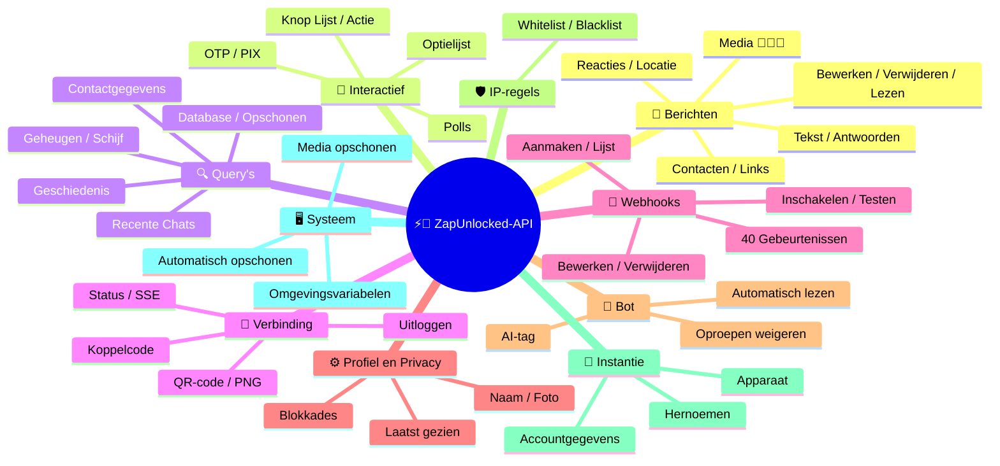
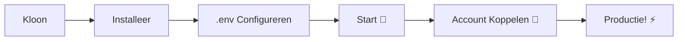

# ⚡💬 [ZapUnlocked-API](https://zapunlocked-api.kauafpss.com.br/)


<p align="center">
  
  <a href="https://downgit.github.io/#/home?url=https://github.com/kauafpssx/ZapUnlocked-API/blob/main/ZapUnlocked.collection.json">
    
  </a>
  
  
  
</p>

---

### 🌐 Taal selecteren:

<table width="100%">
  <tr>
    <td align="center" valign="middle"><a href="https://github.com/kauafpssx/ZapUnlocked-API/blob/main/README.md"></a></td>
    <td align="center" valign="middle"><a href="https://github.com/kauafpssx/ZapUnlocked-API/blob/main/docs/translations/en.md"></a></td>
    <td align="center" valign="middle"><a href="https://github.com/kauafpssx/ZapUnlocked-API/blob/main/docs/translations/es.md"></a></td>
    <td align="center" valign="middle"><a href="https://github.com/kauafpssx/ZapUnlocked-API/blob/main/docs/translations/fr.md"></a></td>
    <td align="center" valign="middle"><a href="https://github.com/kauafpssx/ZapUnlocked-API/blob/main/docs/translations/de.md"></a></td>
    <td align="center" valign="middle"><a href="https://github.com/kauafpssx/ZapUnlocked-API/blob/main/docs/translations/zh.md"></a></td>
    <td align="center" valign="middle"><a href="https://github.com/kauafpssx/ZapUnlocked-API/blob/main/docs/translations/ja.md"></a></td>
    <td align="center" valign="middle"><a href="https://github.com/kauafpssx/ZapUnlocked-API/blob/main/docs/translations/ru.md"></a></td>
    <td align="center" valign="middle"><a href="https://github.com/kauafpssx/ZapUnlocked-API/blob/main/docs/translations/it.md"></a></td>
    <td align="center" valign="middle"><a href="https://github.com/kauafpssx/ZapUnlocked-API/blob/main/docs/translations/ar.md"></a></td>
    <td align="center" valign="middle"><a href="https://github.com/kauafpssx/ZapUnlocked-API/blob/main/docs/translations/tr.md"></a></td>
    <td align="center" valign="middle"><a href="https://github.com/kauafpssx/ZapUnlocked-API/blob/main/docs/translations/ko.md"></a></td>
    <td align="center" valign="middle"><a href="https://github.com/kauafpssx/ZapUnlocked-API/blob/main/docs/translations/hi.md"></a></td>
  </tr>
</table>

---

##  Wat is [ZapUnlocked-API](https://zapunlocked-api.kauafpss.com.br)?

De WhatsApp API-markt rekent maandelijks misbruikelijke bedragen: tientallen tot honderden euro's per maand, met gebruikslimieten, kosten per gesprek en gegevens die via servers van derden gaan. **ZapUnlocked-API bestaat om dit te veranderen.**

Gebouwd in **Python** met **[Neonize](https://github.com/krypton-byte/neonize)** als verbindingsmotor, biedt deze API een eenvoudige REST-interface (FastAPI) voor het beheren van sessies, het verzenden van complexe media en het creëren van intelligente interacties. **Geen zware database, geen maandelijkse kosten, niet afhankelijk van iemand.**

Ons voorstel is gebaseerd op **technische excellentie** en **ontwikkelaarsonafhankelijkheid**. Wij geloven dat krachtige tools toegankelijk moeten zijn voor degenen die hun eigen oplossingen bouwen.

> [!TIP]
> Perfect voor ontwikkelaars die wendbaarheid zoeken bij het integreren van bots, meldingen en geautomatiseerde klantenservicesystemen. **Zonder ervoor te betalen.**

---

## 🗺️ API Overzicht




---

## ✨ Hoogtepunten

| Functionaliteit | Beschrijving |
| :-------------- | :----------- |
| 🧩 **Staatloze Knoppen** | Maak interactieve stromen zonder database, met versleutelde webhooks |
| 🔢 **Koppelen zonder QR** | Verbind via numerieke code · ideaal voor servers zonder GUI |
| 🎵 **Automatische Audioconversie** | Stuur audio die verschijnt als "zojuist opgenomen" (PTT) native op iOS en Android |
| 📦 **Slimme Mediawachtrij** | Automatisch beheer om overmatig geheugengebruik te voorkomen |
| 🏷️ **Dynamische Placeholders** | Personaliseer berichten en webhooks met variabelen zoals `{{name}}`, `{{day}}`, `{{phone}}` |

> [!NOTE]
> Alle functionaliteiten zijn **100% gratis** en worden onderhouden door de open-source gemeenschap.

---

## 📋 API Routes

<details>
<summary><b>📨 Berichten Verzenden</b> · 15 endpoints</summary>

| Methode | Route | Beschrijving | Body |
| :------ | :---- | :----------- | :--- |
| `POST` | `/send` | Tekstbericht verzenden / antwoorden | `phone`, `message` |
| `POST` | `/send_image` | Afbeelding verzenden | `phone`, `image_url` |
| `POST` | `/send_video` | Video verzenden (ondersteunt GIF en PTV) | `phone`, `video_url` |
| `POST` | `/send_audio` | Audio verzenden (met automatische PTT-conversie) | `phone`, `audio_url` |
| `POST` | `/send_document` | Document verzenden | `phone`, `document_url` |
| `POST` | `/send_sticker` | Sticker verzenden | `phone`, `sticker_url` |
| `POST` | `/send_reaction` | Reactie met emoji verzenden | `phone`, `messageId`, `emoji` |
| `POST` | `/send_location` | Locatie verzenden | `phone`, `lat`, `lng` |
| `POST` | `/send_contact` | Contact verzenden | `phone`, `name`, `contactPhone` |
| `POST` | `/send_contacts` | Meerdere contacten verzenden | `phone`, `contacts` |
| `POST` | `/send_link` | Link met voorbeeld verzenden | `phone`, `url` |
| `POST` | `/messages/delete` | Bericht verwijderen | `phone`, `messageId` |
| `POST` | `/messages/read` | Markeren als gelezen | `phone`, `messageIds` |
| `POST` | `/messages/edit` | Verzonden bericht bewerken | `phone`, `messageId`, `message` |
</details>

<details>
<summary><b>🔘 Interactieve Berichten</b> · 7 endpoints</summary>

| Methode | Route | Beschrijving | Body |
| :------ | :---- | :----------- | :--- |
| `POST` | `/messages/send-button-list` | Knoppenlijst verzenden | `phone`, `buttons` |
| `POST` | `/messages/send-button-actions` | Actieknop verzenden | `phone`, `buttons` |
| `POST` | `/messages/send-button-otp` | Kopieerknop verzenden (OTP) | `phone`, `code` |
| `POST` | `/messages/send-button-pix` | PIX-knop verzenden | `phone`, `pixKey` |
| `POST` | `/messages/send-option-list` | Optielijst verzenden | `phone`, `buttons` |
| `POST` | `/messages/send-poll` | Poll verzenden | `phone`, `name`, `options` |
| `POST` | `/messages/send-poll-vote` | Stemmen op poll | `phone`, `options` |
</details>

<details>
<summary><b>🔍 Query's en Beheer</b> · 8 endpoints</summary>

| Methode | Route | Beschrijving | Body |
| :------ | :---- | :----------- | :--- |
| `POST` | `/management/fetch_messages` | Berichtgeschiedenis ophalen | `phone` |
| `POST` | `/management/recent_contacts` | Recente chats weergeven | ❌ |
| `GET` | `/management/memory` | Geheugengebruiksstatus | ❌ |
| `GET` | `/management/volume_stats` | Schijfgebruik controleren | ❌ |
| `DELETE` | `/management/cleanup` | Tijdelijke media opschonen | ❌ |
| `GET` | `/management/database/status` | DB-status en statistieken | ❌ |
| `POST` | `/management/database/config` | Database-instellingen bijwerken | `interval` |
| `POST` | `/management/database/cleanup` | Handmatige DB-opschoning | ❌ |
</details>

<details>
<summary><b>👤 Contacten</b> · 1 endpoint</summary>

| Methode | Route | Beschrijving | Body |
| :------ | :---- | :----------- | :--- |
| `POST` | `/contacts/info` | Gedetailleerde contactgegevens | `phone` |
</details>

<details>
<summary><b>🏠 Algemeen</b> · 3 endpoints</summary>

| Methode | Route | Beschrijving | Body |
| :------ | :---- | :----------- | :--- |
| `GET` | `/` | Welkomstpagina (HTML) | ❌ |
| `GET` | `/status` | Verbindings- en sessiestatus (JSON) | ❌ |
| `GET` | `/status/stream` | Real-time status (SSE) | ❌ |
</details>

<details>
<summary><b>🔗 Verbinding (QR)</b> · 2 endpoints</summary>

| Methode | Route | Beschrijving | Body |
| :------ | :---- | :----------- | :--- |
| `GET` | `/qr` | Interactieve QR-code bekijken (HTML) | ❌ |
| `GET` | `/qr/image` | QR-code afbeelding ophalen (PNG) | ❌ |
</details>

<details>
<summary><b>🔐 Sessie</b> · 2 endpoints</summary>

| Methode | Route | Beschrijving | Body |
| :------ | :---- | :----------- | :--- |
| `POST` | `/session/pair` | Numerieke koppelcode genereren | `phone` |
| `POST` | `/session/logout` | Verbreken en sessie resetten | ❌ |
</details>

<details>
<summary><b>📡 Webhooks (CRUD)</b> · 8 endpoints</summary>

| Methode | Route | Beschrijving | Body |
| :------ | :---- | :----------- | :--- |
| `POST` | `/webhooks` | Genoemde webhook aanmaken | `name`, `url` |
| `GET` | `/webhooks` | Alle webhooks weergeven | ❌ |
| `GET` | `/webhooks/{name}` | Webhook ophalen op naam | ❌ |
| `PUT` | `/webhooks/{name}` | Webhook bewerken | ❌ |
| `DELETE` | `/webhooks/{name}` | Webhook verwijderen | ❌ |
| `POST` | `/webhooks/{name}/toggle` | Inschakelen / uitschakelen | `active` |
| `POST` | `/webhooks/{name}/test` | Webhook testen | ❌ |
| `GET` | `/webhooks/events` | Gebeurtenistypen weergeven (40 typen) | ❌ |
</details>

<details>
<summary><b>⚙️ Profiel en Privacy</b> · 3 endpoints</summary>

| Methode | Route | Beschrijving | Body |
| :------ | :---- | :----------- | :--- |
| `POST` | `/settings/profile` | Botnaam en -foto wijzigen | ❌ |
| `POST` | `/settings/privacy` | Privacy aanpassen (laatst gezien, etc.) | ❌ |
| `POST` | `/settings/block` | Contact blokkeren / deblokkeren | `phone`, `action` |
</details>

<details>
<summary><b>🤖 Bot-instellingen</b> · 6 endpoints</summary>

| Methode | Route | Beschrijving | Body |
| :------ | :---- | :----------- | :--- |
| `GET` | `/settings/bot` | Bot-instellingen bekijken | ❌ |
| `POST` | `/settings/bot` | Bot-instellingen bijwerken (AI-tag, IP-controle) | ❌ |
| `PUT` | `/settings/instance/call-reject-auto` | Oproepen automatisch weigeren | `value` |
| `PUT` | `/settings/instance/call-reject-message` | Oproepweigeringsbericht | `value` |
| `PUT` | `/settings/instance/auto-read-message` | Automatisch berichten lezen | `value` |
| `GET` | `/settings/phone-code/{phone}` | Koppelcode genereren op telefoonnummer | ❌ |
</details>

<details>
<summary><b>📱 Instantie</b> · 3 endpoints</summary>

| Methode | Route | Beschrijving | Body |
| :------ | :---- | :----------- | :--- |
| `GET` | `/instance/me` | Verbonden accountgegevens | ❌ |
| `GET` | `/instance/device` | Technische apparaatgegevens | ❌ |
| `PUT` | `/instance/update-name` | Instantie hernoemen | `name` |
</details>

<details>
<summary><b>🛡️ IP-regels</b> · 5 endpoints</summary>

| Methode | Route | Beschrijving | Body |
| :------ | :---- | :----------- | :--- |
| `GET` | `/settings/ip-rules` | IP-regels weergeven (whitelist/blacklist) | ❌ |
| `POST` | `/settings/ip-rules/whitelist` | IP toevoegen aan whitelist | `ip` |
| `POST` | `/settings/ip-rules/blacklist` | IP toevoegen aan blacklist | `ip` |
| `DELETE` | `/settings/ip-rules/whitelist/{ip}` | IP verwijderen uit whitelist | ❌ |
| `DELETE` | `/settings/ip-rules/blacklist/{ip}` | IP verwijderen uit blacklist | ❌ |
</details>

<details>
<summary><b>🖥️ Systeem</b> · 5 endpoints</summary>

| Methode | Route | Beschrijving | Body |
| :------ | :---- | :----------- | :--- |
| `GET` | `/system/env` | Omgevingsvariabelen bekijken | ❌ |
| `PUT` | `/system/env` | Omgevingsvariabelen bijwerken | ❌ |
| `POST` | `/system/cleanup/force` | Geforceerde tijdelijke media-opschoning | ❌ |
| `GET` | `/system/cleanup/settings` | Automatische opschooninstellingen bekijken | ❌ |
| `PUT` | `/system/cleanup/settings` | Automatisch opschooninterval bijwerken | ❌ |
</details>

> **Totaal: 68 endpoints**

---

## 📡 Webhook Evenementen

Alle webhooks ontvangen een standaard envelop:

```json
{
  "event": "message.text",
  "timestamp": "2025-01-01T12:00:00Z",
  "data": { ... }
}
```

Als de webhook een aangepaste `body` met `{{placeholders}}` heeft, wordt deze body verzonden in plaats van de standaard envelop.


---

<details>
<summary><b>🏷️ Beschikbare placeholders in de aangepaste body</b></summary>

| Placeholder | Waarde |
| :---------- | :----- |
| `{{from}}` | Afzendernummer |
| `{{text}}` | Berichttekst |
| `{{phone}}` | Zelfde als `{{from}}` |
| `{{id}}` | Bericht-ID |
| `{{requested}}` | Aangevraagde hoeveelheid (fetchMessages) |
| `{{found}}` | Gevonden hoeveelheid (fetchMessages) |
| `{{timestamp}}` | Huidige UTC-timestamp |
| `{{day}}` | Huidige dag (dd) |
| `{{mon}}` | Huidige maand (MM) |
| `{{yea}}` | Huidig jaar (yyyy) |
| `{{hou}}` | Huidig uur (HH) |
| `{{min}}` | Huidige minuut (mm) |
| `{{sec}}` | Huidige seconde (ss) |

</details>

---

<details>
<summary><b>📥 Ontvangen Berichten</b> · 15 evenementen</summary>

Basisvelden in ontvangen berichtgebeurtenissen:

```json
{
  "messageId": "3EB0ABCDEF123456",
  "from": "5511999999999",
  "fromName": "João Silva",
  "fromJid": "5511999999999@s.whatsapp.net",
  "isGroup": false
}
```

<details>
<summary><code>message.text</code> - Platte / opgemaakte tekst</summary>

```json
{
  "event": "message.text",
  "data": {
    "...base": "...",
    "text": "Olá! Como posso ajudar?",
    "quoted": { "id": "3EB0...", "fromMe": true }
  }
}
```
</details>

<details>
<summary><code>message.image</code> - Ontvangen afbeelding</summary>

```json
{
  "event": "message.image",
  "data": {
    "...base": "...",
    "caption": "Foto do produto",
    "mimetype": "image/jpeg",
    "fileLength": 204800
  }
}
```
</details>

<details>
<summary><code>message.video</code> - Ontvangen video</summary>

```json
{
  "event": "message.video",
  "data": {
    "...base": "...",
    "caption": "Veja esse vídeo!",
    "mimetype": "video/mp4",
    "fileLength": 5242880,
    "isPTT": false,
    "isGif": false
  }
}
```
</details>

<details>
<summary><code>message.audio</code> - Audio / spraakbericht</summary>

```json
{
  "event": "message.audio",
  "data": {
    "...base": "...",
    "mimetype": "audio/ogg; codecs=opus",
    "fileLength": 30720,
    "isPTT": true,
    "durationSeconds": 8
  }
}
```
</details>

<details>
<summary><code>message.document</code> - Document / bestand</summary>

```json
{
  "event": "message.document",
  "data": {
    "...base": "...",
    "fileName": "contrato.pdf",
    "caption": "Segue o contrato",
    "mimetype": "application/pdf",
    "fileLength": 102400
  }
}
```
</details>

<details>
<summary><code>message.sticker</code> - Sticker</summary>

```json
{
  "event": "message.sticker",
  "data": {
    "...base": "...",
    "mimetype": "image/webp",
    "isAnimated": false
  }
}
```
</details>

<details>
<summary><code>message.contact</code> - Gedeeld contact</summary>

```json
{
  "event": "message.contact",
  "data": {
    "...base": "...",
    "displayName": "Maria Souza",
    "vcard": "BEGIN:VCARD\nVERSION:3.0\n..."
  }
}
```
</details>

<details>
<summary><code>message.location</code> - Locatie</summary>

```json
{
  "event": "message.location",
  "data": {
    "...base": "...",
    "lat": -23.5505,
    "lng": -46.6333,
    "name": "Av. Paulista",
    "address": "Av. Paulista, 1000 - São Paulo"
  }
}
```
</details>

<details>
<summary><code>message.reaction</code> - Reactie (emoji)</summary>

```json
{
  "event": "message.reaction",
  "data": {
    "...base": "...",
    "emoji": "❤️",
    "targetMessageId": "3EB0ABCDEF123456",
    "isRemoved": false
  }
}
```
</details>

<details>
<summary><code>message.poll_created</code> - Ontvangen poll</summary>

```json
{
  "event": "message.poll_created",
  "data": {
    "...base": "...",
    "pollName": "Qual o melhor sabor?",
    "options": ["Chocolate", "Morango", "Baunilha"]
  }
}
```
</details>

<details>
<summary><code>message.poll_vote</code> - Poll-stem</summary>

```json
{
  "event": "message.poll_vote",
  "data": {
    "...base": "...",
    "pollId": "3EB0ABCDEF123456",
    "selectedOptions": ["Chocolate"]
  }
}
```
</details>

<details>
<summary><code>message.button_reply</code> - Knopklik</summary>

```json
{
  "event": "message.button_reply",
  "data": {
    "...base": "...",
    "buttonId": "opcao_sim",
    "displayText": "Sim",
    "type": "quick_reply"
  }
}
```
</details>

<details>
<summary><code>message.list_reply</code> - Interactieve lijstselectie</summary>

```json
{
  "event": "message.list_reply",
  "data": {
    "...base": "...",
    "rowId": "1",
    "title": "X-Burguer",
    "description": "R$ 18,90"
  }
}
```
</details>

<details>
<summary><code>message.deleted</code> - Bericht verwijderd door afzender</summary>

```json
{
  "event": "message.deleted",
  "data": {
    "...base": "..."
  }
}
```
</details>

<details>
<summary><code>message.unknown</code> - Niet-gemapt type</summary>

```json
{
  "event": "message.unknown",
  "data": {
    "...base": "...",
    "rawType": "senderKeyDistributionMessage"
  }
}
```
</details>

</details>

<details>
<summary><b>📤 Verzonden Berichten</b> · 4 evenementen</summary>

<details>
<summary><code>message.sent</code> - Verzonden bericht (handmatig)</summary>

```json
{
  "event": "message.sent",
  "data": {
    "to": "5511999999999",
    "type": "text",
    "messageId": "3EB0ABCDEF123456"
  }
}
```
</details>

<details>
<summary><code>message.read</code> - Bericht gelezen door ontvanger</summary>

```json
{
  "event": "message.read",
  "data": {
    "from": "5511999999999",
    "messageId": "3EB0ABCDEF123456"
  }
}
```
</details>

<details>
<summary><code>message.delivered</code> - Bericht afgeleverd bij ontvanger (receipt type 1)</summary>

```json
{
  "event": "message.delivered",
  "data": {
    "from": "5511999999999",
    "messageId": "3EB0ABCDEF123456"
  }
}
```
</details>

<details>
<summary><code>message.receipt</code> - Andere bezorgbevestigingen (receipt types 2, 3, 5+)</summary>

```json
{
  "event": "message.receipt",
  "data": {
    "from": "5511999999999",
    "messageId": "3EB0ABCDEF123456",
    "receiptType": 2
  }
}
```
</details>

</details>

<details>
<summary><b>🔗 Verbinding</b> · 3 evenementen</summary>

<details>
<summary><code>connection.connected</code> - WhatsApp verbonden</summary>

```json
{
  "event": "connection.connected",
  "data": {
    "phone": "5511999999999"
  }
}
```
</details>

<details>
<summary><code>connection.disconnected</code> - WhatsApp verbinding verbroken</summary>

```json
{
  "event": "connection.disconnected",
  "data": {}
}
```
</details>

<details>
<summary><code>connection.qr_ready</code> - QR-code gegenereerd</summary>

```json
{
  "event": "connection.qr_ready",
  "data": {
    "qr": "2@abc123..."
  }
}
```
</details>

</details>

<details>
<summary><b>📞 Oproep</b> · 1 evenement</summary>

<details>
<summary><code>call.received</code> - Oproep ontvangen</summary>

```json
{
  "event": "call.received",
  "data": {
    "from": "5511999999999",
    "fromJid": "5511999999999@s.whatsapp.net",
    "callId": "ABC123DEF456"
  }
}
```
</details>

</details>

---

## 🛠️ Installatie en Hosting

> Zet uw professionele WhatsApp API in minder dan **5 minuten** op met **ZapUnlocked-API**.

### 💻 Lokale Installatie

Ideaal voor ontwikkeling, testen of draaien op uw eigen server.



**1. Kloon de Repository**

```bash
git clone https://github.com/kauafpssx/ZapUnlocked-API.git
cd ZapUnlocked-API
```

**2. Installeer Afhankelijkheden**

| Systeem | Commando |
| :------ | :------- |
| 🪟 Windows | `scripts\install\install.bat` |
| 🐧 Linux / macOS | `bash scripts/install/install.sh` |

**3. Configureer de Omgeving**

| Systeem | Commando |
| :------ | :------- |
| 🪟 Windows | `scripts\generate-env\generate-env.bat` |
| 🐧 Linux / macOS | `bash scripts/generate-env/generate-env.sh` |

| Variabele | Beschrijving |
| :-------- | :----------- |
| `API_KEY` | Wachtwoord voor authenticatie op alle endpoints |
| `INTERNAL_SECRET` | Token om webhook-handtekeningen te valideren |
| `PORT` | API-poort (standaard: `8300`) |

**4. Start de API**

| Systeem | Commando |
| :------ | :------- |
| 🪟 Windows | `scripts\run\run.bat` |
| 🐧 Linux / macOS | `bash scripts/run/run.sh` |

---

### ☁️ Hosting: Alwaysdata (Gratis 24/7)

**Alwaysdata** is de aanbevolen optie om de API stabiel en gratis te hosten zonder een server aan te hoeven houden.

#### 📊 Gratis Plan Functies

| Functie | Beschikbaar op Gratis |
| :------ | :-------------------- |
| 💾 Opslag | **1 GB SSD** |
| 🧠 RAM | **256 MB** |
| ⚡ CPU | **1/4 vCPU** |
| 🔄 Back-up | **3 dagen** automatisch |
| 📡 Uptime | **24/7** via Services |

#### 👣 Stappen voor Implementatie

**1.** Maak een account aan op [Alwaysdata.com](https://www.alwaysdata.com/) · **Gratis** plan.

**2.** Toegang tot SSH: `https://ssh-[gebruiker].alwaysdata.net`.

**3.** Kloon en installeer:

```bash
git clone https://github.com/kauafpssx/ZapUnlocked-API.git ~/ZapUnlocked-API
cd ~/ZapUnlocked-API
bash scripts/install/install.sh
```

**4.** *(Optioneel)* Genereer het `.env` bestand:

```bash
bash scripts/generate-env/generate-env.sh
```

> [!NOTE]
> Het installatiescript vraagt al of je de `.env` wilt configureren. Als je **ja** hebt geantwoord, kan deze stap worden overgeslagen. Anders voer je de bovenstaande opdracht uit of configureer je de `.env` handmatig.

**5.** Configureer de Service (24/7) in **Advanced > Services > Add a service**:

| Veld | Waarde |
| :--- | :----- |
| **Command** | `bash scripts/run/run.sh` |
| **Working directory** | `ZapUnlocked-API` |
| **Environment variables** | `PORT=8300` |

**6.** Toegang via:

```
http://services-[gebruiker].alwaysdata.net:8300/
```

> [!TIP]
> De URL is al extern toegankelijk. *(Optioneel)* Gebruik een aangepast domein door een **Reverse Proxy** in te stellen onder **Web > Sites > Add a site** die verwijst naar `http://[gebruiker].alwaysdata.net`.

---

## 🔐 Authenticatie (Login)

Na implementatie verbindt u uw WhatsApp-account door in uw browser naar het volgende adres te gaan:

```text
http://services-[gebruiker].alwaysdata.net:8300/qr?API_KEY=UW_GEHEIME_SLEUTEL
```

---

## 📖 Officiële Documentatie

<p align="center">
  👉 <a href="https://zapunlocked-api.kauafpss.com.br"><strong>zapunlocked-api.kauafpss.com.br</strong></a>
</p>

Voor gedetailleerde technische documentatie, codevoorbeelden en een interactieve playground, bezoek onze officiële website.

> [!TIP]
> Gebruik **LLMs.txt** als AI-index: [`zapunlocked-api.kauafpss.com.br/llms.txt`](https://zapunlocked-api.kauafpss.com.br/llms.txt). Ontdek alle pagina's voordat u verder verkent.

---

## ❤️ Credits en Dankbetuigingen

| Project | Beschrijving |
| :------ | :----------- |
| [](https://github.com/krypton-byte/neonize) | Python-bibliotheek voor native WhatsApp Web-verbinding |
| [](https://github.com/tulir/whatsmeow) | Go-bibliotheek die de basis vormt van Neonize · het hart van de verbinding |
| [](https://www.alwaysdata.com/) | Hoogwaardige gratis infrastructuur |

---

## 📄 Licentie

Dit project is gelicentieerd onder de **MIT Licentie**.

<p align="center">
  Gemaakt met 💜 door <a href="https://www.instagram.com/kauafpss_/">Kauã Ferreira</a>
</p>