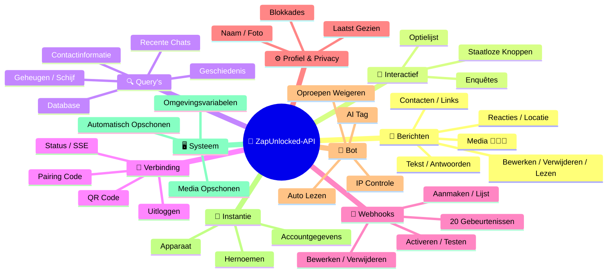
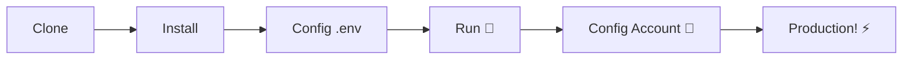

# 🚀 ZapUnlocked-API 📲✨


<p align="center">
  
  
  
  
  
</p>

<table width="100%">
  <tr>
    <td align="center" valign="middle"><a href="https://github.com/kauafpssx/ZapUnlocked-API/blob/main/docs/translations/en.md"></a></td>
    <td align="center" valign="middle"><a href="https://github.com/kauafpssx/ZapUnlocked-API/blob/main/docs/translations/es.md"></a></td>
    <td align="center" valign="middle"><a href="https://github.com/kauafpssx/ZapUnlocked-API/blob/main/docs/translations/fr.md"></a></td>
    <td align="center" valign="middle"><a href="https://github.com/kauafpssx/ZapUnlocked-API/blob/main/docs/translations/de.md"></a></td>
    <td align="center" valign="middle"><a href="https://github.com/kauafpssx/ZapUnlocked-API/blob/main/docs/translations/zh.md"></a></td>
    <td align="center" valign="middle"><a href="https://github.com/kauafpssx/ZapUnlocked-API/blob/main/docs/translations/ja.md"></a></td>
    <td align="center" valign="middle"><a href="https://github.com/kauafpssx/ZapUnlocked-API/blob/main/docs/translations/ru.md"></a></td>
    <td align="center" valign="middle"><a href="https://github.com/kauafpssx/ZapUnlocked-API/blob/main/docs/translations/it.md"></a></td>
    <td align="center" valign="middle"><a href="https://github.com/kauafpssx/ZapUnlocked-API/blob/main/docs/translations/ar.md"></a></td>
    <td align="center" valign="middle"><a href="https://github.com/kauafpssx/ZapUnlocked-API/blob/main/docs/translations/tr.md"></a></td>
    <td align="center" valign="middle"><a href="https://github.com/kauafpssx/ZapUnlocked-API/blob/main/docs/translations/ko.md"></a></td>
    <td align="center" valign="middle"><a href="https://github.com/kauafpssx/ZapUnlocked-API/blob/main/docs/translations/hi.md"></a></td>
  </tr>
</table>

---

##  Wat is ZapUnlocked-API?

De WhatsApp API-markt brengt exorbitante maandelijkse kosten in rekening: tientallen tot honderden euro's per maand, met gebruikslimieten, kosten per gesprek en gegevens die via servers van derden gaan. **ZapUnlocked-API is er om dat te veranderen.**

Gebouwd met **Python** en **[Neonize](https://github.com/krypton-byte/neonize)** als verbindingsmotor, biedt deze API een eenvoudige REST-interface (FastAPI) voor het beheren van sessies, het verzenden van complexe media en het creëren van slimme interacties. **Geen zware database, geen maandelijkse kosten, niet afhankelijk van wie dan ook.**

Ons voorstel is gebaseerd op **technische excellentie** en **ontwikkelaarsonafhankelijkheid**. Wij geloven dat krachtige tools toegankelijk moeten zijn voor degenen die hun eigen oplossingen bouwen.

> [!TIP]
> Perfect voor ontwikkelaars die op zoek zijn naar wendbaarheid bij het integreren van bots, meldingen en geautomatiseerde servicesystemen. **Zonder ervoor te betalen.**

---

## 🗺️ API Overzicht



---

## ✨ Hoofdfuncties

| Functionaliteit | Beschrijving |
| :-------------- | :----------- |
| 🧩 **Staatloze Knoppen** | Creëer interactieve flows zonder database, met versleutelde webhooks |
| 🔢 **Pairing zonder QR Code** | Verbind via numerieke code · ideaal voor servers zonder GUI |
| 🎵 **Automatische Audioconversie** | Verzend audio die eruitziet als live opgenomen (PTT) native |
| 📦 **Slimme Media Queue** | Automatisch beheer om overmatig geheugengebruik te voorkomen |
| 🏷️ **Dynamische Placeholders** | Personaliseer berichten en webhooks met `{{name}}`, `{{day}}`, `{{phone}}` |

> [!NOTE]
> Alle functies zijn **100% gratis** en worden onderhouden door de open-source gemeenschap.

---

## 📋 API Routes

<details>
<summary><b>📨 Berichten Verzenden</b> · 13 endpoints</summary>

| Methode | Route | Beschrijving |
| :------ | :---- | :----------- |
| `POST` | `/send` | Tekstbericht verzenden / beantwoorden |
| `POST` | `/send_image` | Afbeelding verzenden |
| `POST` | `/send_video` | Video verzenden (ondersteunt GIF en PTV) |
| `POST` | `/send_audio` | Audio verzenden (met automatische conversie naar PTT) |
| `POST` | `/send_document` | Document verzenden |
| `POST` | `/send_sticker` | Sticker verzenden |
| `POST` | `/send_reaction` | Reactie met emoji verzenden |
| `POST` | `/send_location` | Locatie verzenden |
| `POST` | `/send_contact` | Contact verzenden |
| `POST` | `/send_contacts` | Meerdere contacten verzenden |
| `POST` | `/send_link` | Link met preview verzenden |
| `POST` | `/messages/delete` | Bericht verwijderen |
| `POST` | `/messages/read` | Markeren als gelezen |
| `POST` | `/messages/edit` | Verzonden bericht bewerken |
</details>

<details>
<summary><b>🔘 Interactieve Berichten</b> · 4 endpoints</summary>

| Methode | Route | Beschrijving |
| :------ | :---- | :----------- |
| `POST` | `/send_wbuttons` | Knoppen verzenden (lijst, actie, OTP, PIX) |
| `POST` | `/messages/send-option-list` | Optielijst verzenden |
| `POST` | `/messages/send-poll` | Enquête verzenden |
| `POST` | `/messages/send-poll-vote` | Stemmen op enquête |
</details>

<details>
<summary><b>🔍 Query's en Beheer</b> · 7 endpoints</summary>

| Methode | Route | Beschrijving |
| :------ | :---- | :----------- |
| `POST` | `/contacts/info` | Gedetailleerde contactinformatie |
| `POST` | `/management/fetch_messages` | Berichtgeschiedenis ophalen |
| `POST` | `/management/recent_contacts` | Recente chats lijsten |
| `GET` | `/management/memory` | Geheugengebruik status |
| `GET` | `/management/volume_stats` | Schijfgebruik controleren |
| `GET` | `/management/database/status` | Database status en statistieken |
| `POST` | `/management/database/cleanup` | Handmatige database opschoning |
</details>

<details>
<summary><b>🔗 Verbinding en Sessie</b> · 8 endpoints</summary>

| Methode | Route | Beschrijving |
| :------ | :---- | :----------- |
| `GET` | `/` | Welkomstpagina (HTML) |
| `GET` | `/status` | Verbindings- en sessiestatus |
| `GET` | `/status/stream` | Real-time status (SSE) |
| `GET` | `/qr` | Interactieve QR Code bekijken |
| `GET` | `/qr/image` | QR Code afbeelding ophalen (Base64) |
| `POST` | `/qr/pair` | Numerieke pairing code genereren |
| `GET` | `/settings/phone-code/{phone}` | Code genereren op nummer |
| `POST` | `/qr/logout` | Ontkoppelen en sessie resetten |
</details>

<details>
<summary><b>📡 Webhooks (CRUD)</b> · 7 endpoints</summary>

| Methode | Route | Beschrijving |
| :------ | :---- | :----------- |
| `POST` | `/webhooks` | Genoemde webhook aanmaken |
| `GET` | `/webhooks` | Alle webhooks lijsten |
| `PUT` | `/webhooks/{name}` | Webhook bewerken |
| `DELETE` | `/webhooks/{name}` | Webhook verwijderen |
| `POST` | `/webhooks/{name}/toggle` | Activeren / deactiveren |
| `POST` | `/webhooks/{name}/test` | Webhook testen |
| `GET` | `/webhooks/events` | Gebeurtenistypen lijsten (20 typen) |
</details>

<details>
<summary><b>⚙️ Profiel en Privacy</b> · 3 endpoints</summary>

| Methode | Route | Beschrijving |
| :------ | :---- | :----------- |
| `POST` | `/settings/profile` | Bot naam en foto wijzigen |
| `POST` | `/settings/privacy` | Privacy aanpassen (laatst gezien, etc.) |
| `POST` | `/settings/block` | Contact blokkeren / deblokkeren |
</details>

<details>
<summary><b>🤖 Bot Instellingen</b> · 5 endpoints</summary>

| Methode | Route | Beschrijving |
| :------ | :---- | :----------- |
| `GET` | `/settings/bot` | Bot instellingen bekijken |
| `POST` | `/settings/bot` | Instellingen bijwerken (AI tag, IP controle) |
| `PUT` | `/settings/instance/call-reject-auto` | Oproepen automatisch weigeren |
| `PUT` | `/settings/instance/call-reject-message` | Geweigerde oproep bericht |
| `PUT` | `/settings/instance/auto-read-message` | Automatisch berichten lezen |
</details>

<details>
<summary><b>📱 Instantie</b> · 3 endpoints</summary>

| Methode | Route | Beschrijving |
| :------ | :---- | :----------- |
| `GET` | `/instance/me` | Verbonden accountgegevens |
| `GET` | `/instance/device` | Technische apparaatgegevens |
| `PUT` | `/instance/update-name` | Instantie hernoemen |
</details>

<details>
<summary><b>🖥️ Systeem</b> · 5 endpoints</summary>

| Methode | Route | Beschrijving |
| :------ | :---- | :----------- |
| `GET` | `/system/env` | Omgevingsvariabelen bekijken |
| `PUT` | `/system/env` | Omgevingsvariabelen bijwerken |
| `POST` | `/system/cleanup/force` | Geforceerde opschoning van tijdelijke media |
| `GET` | `/system/cleanup/settings` | Automatische opschooninstellingen bekijken |
| `PUT` | `/system/cleanup/settings` | Automatisch opschooninterval bijwerken |
</details>

> **Totaal: 56 endpoints** · Volledige REST voor WhatsApp automatisering.

---

## 🛠️ Installatie en Hosting

> Zet uw professionele WhatsApp API in minder dan **5 minuten** op met **ZapUnlocked-API**.

### 💻 Lokale Installatie

Ideaal voor ontwikkeling, testen of draaien op uw eigen server.



**1. Kloon de Repository**

```bash
git clone https://github.com/kauafpssx/ZapUnlocked-API.git
cd ZapUnlocked-API
```

**2. Installeer de Afhankelijkheden**

| Systeem | Commando |
| :------ | :------- |
| 🪟 Windows | `scripts\install\install.bat` |
| 🐧 Linux / macOS | `bash scripts/install/install.sh` |

**3. Configureer de Omgeving**

| Systeem | Commando |
| :------ | :------- |
| 🪟 Windows | `scripts\generate-env\generate-env.bat` |
| 🐧 Linux / macOS | `bash scripts/generate-env/generate-env.sh` |

| Variabele | Beschrijving |
| :-------- | :----------- |
| `API_KEY` | Wachtwoord voor authenticatie op alle endpoints |
| `INTERNAL_SECRET` | Token voor het valideren van webhook handtekeningen |
| `PORT` | API poort (standaard: `8300`) |

**4. Voer de API uit**

| Systeem | Commando |
| :------ | :------- |
| 🪟 Windows | `scripts\run\run.bat` |
| 🐧 Linux / macOS | `bash scripts/run/run.sh` |

---

### ☁️ Hosting: Alwaysdata (Gratis 24/7)

**Alwaysdata** is de aanbevolen optie om de API stabiel en gratis te hosten zonder een server aan te hoeven houden.

#### 📊 Gratis Plan Bronnen

| Bron | Beschikbaar in Gratis |
| :--- | :-------------------- |
| 💾 Opslag | **1 GB SSD** |
| 🧠 RAM | **256 MB** |
| ⚡ CPU | **1/4 vCPU** |
| 🔤 Backup | **3 dagen** automatisch |
| 📡 Uptime | **24/7** via Services |

#### 👣 Stap-voor-Stap Implementatie

**1.** Maak een account aan op [Alwaysdata.com](https://www.alwaysdata.com/) · **Gratis** plan.

**2.** Toegang via SSH op `https://ssh-[gebruiker].alwaysdata.net`.

**3.** Kloon en installeer:

```bash
git clone https://github.com/kauafpssx/ZapUnlocked-API.git ~/ZapUnlocked-API
cd ~/ZapUnlocked-API
bash scripts/install/install.sh
```

**4.** Genereer het `.env` bestand:

```bash
bash scripts/generate-env/generate-env.sh
```

**5.** Configureer de Service (24/7) onder **Advanced · Services · Add a service**:

| Veld | Waarde |
| :--- | :----- |
| **Name** | `ZapUnlocked-API` |
| **Command** | `python3 main.py` |
| **Working directory** | `ZapUnlocked-API` |
| **Environment variables** | `PORT=8300` |

**6.** Toegang via:

```
http://services-[gebruiker].alwaysdata.net:8300/
```

> [!TIP]
> De URL is extern al bereikbaar. *(Optioneel)* Voor een aangepast domein configureert u een **Reverse Proxy** onder **Web · Sites · Add a site** die verwijst naar `http://[gebruiker].alwaysdata.net`.

---

## 🔐 Authenticatie (Login)

Na implementatie, verbind uw WhatsApp-account door in de browser te navigeren naar:

```text
http://services-[gebruiker].alwaysdata.net:8300/qr?API_KEY=UW_GEHEIME_WACHTWOORD
```

---

## 📖 Officiële Documentatie

<p align="center">
  👉 <a href="https://zapunlocked-api.kauafpss.com.br"><strong>zapunlocked-api.kauafpss.com.br</strong></a>
</p>

Voor gedetailleerde technische documentatie, codevoorbeelden en een interactieve playground, bezoek onze officiële website.

> [!TIP]
> Gebruik **LLMs.txt** als AI-index: [`zapunlocked-api.kauafpss.com.br/llms.txt`](https://zapunlocked-api.kauafpss.com.br/llms.txt). Ontdek alle pagina's voordat u gaat verkennen.

---

## ❤️ Credits & Dankbetuigingen

| Project | Beschrijving |
| :------ | :----------- |
| [](https://github.com/krypton-byte/neonize) | Python bibliotheek voor native verbinding met WhatsApp Web |
| [](https://github.com/tulir/whatsmeow) | Go bibliotheek basis van Neonize · het hart van de verbinding |
| [](https://www.alwaysdata.com/) | Gratis infrastructuur van hoge kwaliteit |

---

## 📄 Licentie

Dit project is gelicentieerd onder de **MIT Licentie**.

<p align="center">
  Gemaakt met 💜 door <a href="https://www.instagram.com/kauafpss_/">Kauã Ferreira</a>
</p>

