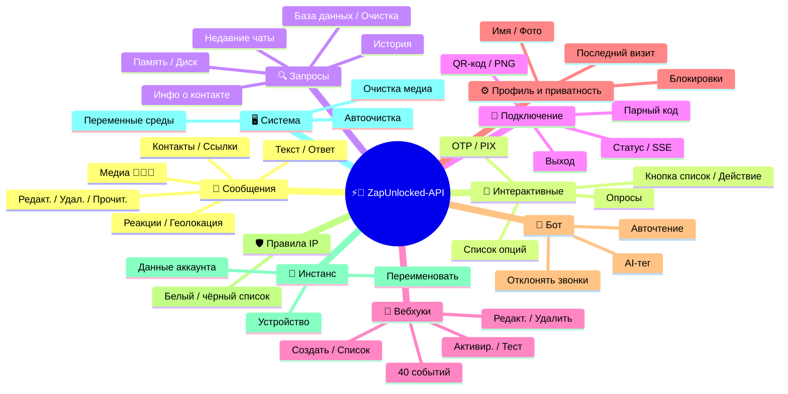
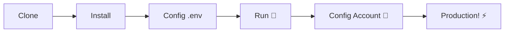

# ⚡💬 [ZapUnlocked-API](https://zapunlocked-api.kauafpss.com.br/)


<p align="center">
  
  <a href="https://downgit.github.io/#/home?url=https://github.com/kauafpssx/ZapUnlocked-API/blob/main/ZapUnlocked.collection.json">
    
  </a>
  
  
  
</p>

---

### 🌐 Выберите язык:

<table width="100%">
  <tr>
    <td align="center" valign="middle"><a href="https://github.com/kauafpssx/ZapUnlocked-API/blob/main/README.md"></a></td>
    <td align="center" valign="middle"><a href="https://github.com/kauafpssx/ZapUnlocked-API/blob/main/docs/translations/en.md"></a></td>
    <td align="center" valign="middle"><a href="https://github.com/kauafpssx/ZapUnlocked-API/blob/main/docs/translations/es.md"></a></td>
    <td align="center" valign="middle"><a href="https://github.com/kauafpssx/ZapUnlocked-API/blob/main/docs/translations/fr.md"></a></td>
    <td align="center" valign="middle"><a href="https://github.com/kauafpssx/ZapUnlocked-API/blob/main/docs/translations/de.md"></a></td>
    <td align="center" valign="middle"><a href="https://github.com/kauafpssx/ZapUnlocked-API/blob/main/docs/translations/zh.md"></a></td>
    <td align="center" valign="middle"><a href="https://github.com/kauafpssx/ZapUnlocked-API/blob/main/docs/translations/ja.md"></a></td>
    <td align="center" valign="middle"><a href="https://github.com/kauafpssx/ZapUnlocked-API/blob/main/docs/translations/it.md"></a></td>
    <td align="center" valign="middle"><a href="https://github.com/kauafpssx/ZapUnlocked-API/blob/main/docs/translations/ar.md"></a></td>
    <td align="center" valign="middle"><a href="https://github.com/kauafpssx/ZapUnlocked-API/blob/main/docs/translations/tr.md"></a></td>
    <td align="center" valign="middle"><a href="https://github.com/kauafpssx/ZapUnlocked-API/blob/main/docs/translations/ko.md"></a></td>
    <td align="center" valign="middle"><a href="https://github.com/kauafpssx/ZapUnlocked-API/blob/main/docs/translations/hi.md"></a></td>
    <td align="center" valign="middle"><a href="https://github.com/kauafpssx/ZapUnlocked-API/blob/main/docs/translations/nl.md"></a></td>
  </tr>
</table>

---

##  Что такое ZapUnlocked-API?

Рынок API для WhatsApp взимает непомерную ежемесячную плату: десятки и сотни рублей в месяц, лимиты использования, плата за каждый разговор и данные, проходящие через сторонние серверы. **ZapUnlocked-API существует, чтобы изменить это.**

Построенная на **Python** с **[Neonize](https://github.com/krypton-byte/neonize)** в качестве движка подключения, эта API предоставляет простой REST-интерфейс (FastAPI) для управления сессиями, отправки сложных медиафайлов и создания интеллектуальных взаимодействий. **Без тяжелой базы данных, без ежемесячной платы, без зависимости от кого-либо.**

Наше предложение основано на **техническом превосходстве** и **независимости разработчика**. Мы считаем, что мощные инструменты должны быть доступны тем, кто создает собственные решения.

> [!TIP]
> Идеально подходит для разработчиков, которым нужна быстрая интеграция ботов, уведомлений и автоматизированных систем обслуживания клиентов. **Не платя за это ничего.**

---

## 🗺️ Обзор API




---

## ✨ Ключевые возможности

| Функция | Описание |
| :------ | :------- |
| 🧩 **Stateless-кнопки** | Создавайте интерактивные потоки без базы данных, используя зашифрованные вебхуки |
| 🔢 **Парное подключение без QR** | Подключайтесь по числовому коду · идеально для серверов без GUI |
| 🎵 **Автоматическая конвертация аудио** | Отправляйте аудио, которое отображается как записанное (PTT) нативно |
| 📦 **Умная очередь медиа** | Автоматическое управление для предотвращения избыточного потребления памяти |
| 🏷️ **Динамические плейсхолдеры** | Настраивайте сообщения и вебхуки с `{{name}}`, `{{day}}`, `{{phone}}` |

> [!NOTE]
> Все функции **100% бесплатны** и поддерживаются open-source сообществом.

---

## 📋 Маршруты API

<details>
<summary><b>📨 Отправка сообщений</b> · 15 эндпоинтов</summary>

| Метод | Маршрут | Описание | Тело |
| :---- | :------ | :------- | :--- |
| `POST` | `/send` | Отправить текстовое сообщение / ответ | `phone`, `message` |
| `POST` | `/send_image` | Отправить изображение | `phone`, `image_url` |
| `POST` | `/send_video` | Отправить видео (поддержка GIF и PTV) | `phone`, `video_url` |
| `POST` | `/send_audio` | Отправить аудио (с автоматической конвертацией в PTT) | `phone`, `audio_url` |
| `POST` | `/send_document` | Отправить документ | `phone`, `document_url` |
| `POST` | `/send_sticker` | Отправить стикер | `phone`, `sticker_url` |
| `POST` | `/send_reaction` | Отправить реакцию с эмодзи | `phone`, `messageId`, `emoji` |
| `POST` | `/send_location` | Отправить геолокацию | `phone`, `lat`, `lng` |
| `POST` | `/send_contact` | Отправить контакт | `phone`, `name`, `contactPhone` |
| `POST` | `/send_contacts` | Отправить несколько контактов | `phone`, `contacts` |
| `POST` | `/send_link` | Отправить ссылку с превью | `phone`, `url` |
| `POST` | `/messages/delete` | Удалить сообщение | `phone`, `messageId` |
| `POST` | `/messages/read` | Отметить как прочитанное | `phone`, `messageIds` |
| `POST` | `/messages/edit` | Редактировать отправленное сообщение | `phone`, `messageId`, `message` |
</details>

<details>
<summary><b>🔘 Интерактивные сообщения</b> · 7 эндпоинтов</summary>

| Метод | Маршрут | Описание | Тело |
| :---- | :------ | :------- | :--- |
| `POST` | `/messages/send-button-list` | Отправить список кнопок | `phone`, `buttons` |
| `POST` | `/messages/send-button-actions` | Отправить кнопку действия | `phone`, `buttons` |
| `POST` | `/messages/send-button-otp` | Отправить кнопку копирования (OTP) | `phone`, `code` |
| `POST` | `/messages/send-button-pix` | Отправить кнопку PIX | `phone`, `pixKey` |
| `POST` | `/messages/send-option-list` | Отправить список опций | `phone`, `buttons` |
| `POST` | `/messages/send-poll` | Отправить опрос | `phone`, `name`, `options` |
| `POST` | `/messages/send-poll-vote` | Проголосовать в опросе | `phone`, `options` |
</details>

<details>
<summary><b>🔍 Запросы и управление</b> · 8 эндпоинтов</summary>

| Метод | Маршрут | Описание | Тело |
| :---- | :------ | :------- | :--- |
| `POST` | `/management/fetch_messages` | Получить историю сообщений | `phone` |
| `POST` | `/management/recent_contacts` | Список недавних чатов | ❌ |
| `GET` | `/management/memory` | Статус использования памяти | ❌ |
| `GET` | `/management/volume_stats` | Проверить использование диска | ❌ |
| `DELETE` | `/management/cleanup` | Очистить временные медиафайлы | ❌ |
| `GET` | `/management/database/status` | Статус и статистика БД | ❌ |
| `POST` | `/management/database/config` | Обновить настройки БД | `interval` |
| `POST` | `/management/database/cleanup` | Ручная очистка БД | ❌ |
</details>

<details>
<summary><b>👤 Контакты</b> · 1 эндпоинт</summary>

| Метод | Маршрут | Описание | Тело |
| :---- | :------ | :------- | :--- |
| `POST` | `/contacts/info` | Детальная информация о контакте | `phone` |
</details>

<details>
<summary><b>🏠 Общее</b> · 3 эндпоинта</summary>

| Метод | Маршрут | Описание | Тело |
| :---- | :------ | :------- | :--- |
| `GET` | `/` | Приветственная страница (HTML) | ❌ |
| `GET` | `/status` | Статус подключения и сессии (JSON) | ❌ |
| `GET` | `/status/stream` | Статус в реальном времени (SSE) | ❌ |
</details>

<details>
<summary><b>🔗 Подключение (QR)</b> · 2 эндпоинта</summary>

| Метод | Маршрут | Описание | Тело |
| :---- | :------ | :------- | :--- |
| `GET` | `/qr` | Просмотр интерактивного QR-кода (HTML) | ❌ |
| `GET` | `/qr/image` | Получить изображение QR-кода (PNG) | ❌ |
</details>

<details>
<summary><b>🔐 Сессия</b> · 2 эндпоинта</summary>

| Метод | Маршрут | Описание | Тело |
| :---- | :------ | :------- | :--- |
| `POST` | `/session/pair` | Сгенерировать числовой парный код | `phone` |
| `POST` | `/session/logout` | Отключиться и сбросить сессию | ❌ |
</details>

<details>
<summary><b>📡 Вебхуки (CRUD)</b> · 8 эндпоинтов</summary>

| Метод | Маршрут | Описание | Тело |
| :---- | :------ | :------- | :--- |
| `POST` | `/webhooks` | Создать именованный вебхук | `name`, `url` |
| `GET` | `/webhooks` | Список всех вебхуков | ❌ |
| `GET` | `/webhooks/{name}` | Получить вебхук по имени | ❌ |
| `PUT` | `/webhooks/{name}` | Редактировать вебхук | ❌ |
| `DELETE` | `/webhooks/{name}` | Удалить вебхук | ❌ |
| `POST` | `/webhooks/{name}/toggle` | Включить / отключить | `active` |
| `POST` | `/webhooks/{name}/test` | Протестировать вебхук | ❌ |
| `GET` | `/webhooks/events` | Список типов событий (40 типов) | ❌ |
</details>

<details>
<summary><b>⚙️ Профиль и приватность</b> · 3 эндпоинта</summary>

| Метод | Маршрут | Описание | Тело |
| :---- | :------ | :------- | :--- |
| `POST` | `/settings/profile` | Изменить имя и фото бота | ❌ |
| `POST` | `/settings/privacy` | Настроить приватность (последний визит и т.д.) | ❌ |
| `POST` | `/settings/block` | Заблокировать / разблокировать контакт | `phone`, `action` |
</details>

<details>
<summary><b>🤖 Настройки бота</b> · 6 эндпоинтов</summary>

| Метод | Маршрут | Описание | Тело |
| :---- | :------ | :------- | :--- |
| `GET` | `/settings/bot` | Просмотр настроек бота | ❌ |
| `POST` | `/settings/bot` | Обновить настройки (AI-тег, IP-контроль) | ❌ |
| `PUT` | `/settings/instance/call-reject-auto` | Автоматически отклонять звонки | `value` |
| `PUT` | `/settings/instance/call-reject-message` | Сообщение при отклонении звонка | `value` |
| `PUT` | `/settings/instance/auto-read-message` | Автоматическое чтение сообщений | `value` |
| `GET` | `/settings/phone-code/{phone}` | Сгенерировать код по номеру телефона | ❌ |
</details>

<details>
<summary><b>📱 Инстанс</b> · 3 эндпоинта</summary>

| Метод | Маршрут | Описание | Тело |
| :---- | :------ | :------- | :--- |
| `GET` | `/instance/me` | Данные подключенного аккаунта | ❌ |
| `GET` | `/instance/device` | Технические данные устройства | ❌ |
| `PUT` | `/instance/update-name` | Переименовать инстанс | `name` |
</details>

<details>
<summary><b>🛡️ Правила IP</b> · 5 эндпоинтов</summary>

| Метод | Маршрут | Описание | Тело |
| :---- | :------ | :------- | :--- |
| `GET` | `/settings/ip-rules` | Список правил IP (белый/чёрный список) | ❌ |
| `POST` | `/settings/ip-rules/whitelist` | Добавить IP в белый список | `ip` |
| `POST` | `/settings/ip-rules/blacklist` | Добавить IP в чёрный список | `ip` |
| `DELETE` | `/settings/ip-rules/whitelist/{ip}` | Удалить IP из белого списка | ❌ |
| `DELETE` | `/settings/ip-rules/blacklist/{ip}` | Удалить IP из чёрного списка | ❌ |
</details>

<details>
<summary><b>🖥️ Система</b> · 5 эндпоинтов</summary>

| Метод | Маршрут | Описание | Тело |
| :---- | :------ | :------- | :--- |
| `GET` | `/system/env` | Просмотр переменных среды | ❌ |
| `PUT` | `/system/env` | Обновить переменные среды | ❌ |
| `POST` | `/system/cleanup/force` | Принудительная очистка временных медиа | ❌ |
| `GET` | `/system/cleanup/settings` | Просмотр настроек автоочистки | ❌ |
| `PUT` | `/system/cleanup/settings` | Обновить интервал автоочистки | ❌ |
</details>

> **Всего: 68 эндпоинтов**

---

## 📡 События Webhook

Все вебхуки получают стандартный конверт:

```json
{
  "event": "message.text",
  "timestamp": "2025-01-01T12:00:00Z",
  "data": { ... }
}
```

Если у вебхука есть пользовательский `body` с `{{placeholders}}`, этот body отправляется вместо стандартного конверта.


---

<details>
<summary><b>🏷️ Доступные плейсхолдеры в пользовательском body</b></summary>

| Плейсхолдер | Значение |
| :---------- | :------- |
| `{{from}}` | Номер отправителя |
| `{{text}}` | Текст сообщения |
| `{{phone}}` | То же, что `{{from}}` |
| `{{id}}` | ID сообщения |
| `{{requested}}` | Запрошенное количество (fetchMessages) |
| `{{found}}` | Найденное количество (fetchMessages) |
| `{{timestamp}}` | Текущая метка UTC |
| `{{day}}` | Текущий день (дд) |
| `{{mon}}` | Текущий месяц (ММ) |
| `{{yea}}` | Текущий год (гггг) |
| `{{hou}}` | Текущий час (ЧЧ) |
| `{{min}}` | Текущая минута (мм) |
| `{{sec}}` | Текущая секунда (сс) |

</details>

---

<details>
<summary><b>📥 Полученные сообщения</b> · 15 событий</summary>

Базовые поля в событиях полученных сообщений:

```json
{
  "messageId": "3EB0ABCDEF123456",
  "from": "5511999999999",
  "fromName": "João Silva",
  "fromJid": "5511999999999@s.whatsapp.net",
  "isGroup": false
}
```

<details>
<summary><code>message.text</code> - Обычный / форматированный текст</summary>

```json
{
  "event": "message.text",
  "data": {
    "...base": "...",
    "text": "Olá! Como posso ajudar?",
    "quoted": { "id": "3EB0...", "fromMe": true }
  }
}
```
</details>

<details>
<summary><code>message.image</code> - Полученное изображение</summary>

```json
{
  "event": "message.image",
  "data": {
    "...base": "...",
    "caption": "Foto do produto",
    "mimetype": "image/jpeg",
    "fileLength": 204800
  }
}
```
</details>

<details>
<summary><code>message.video</code> - Полученное видео</summary>

```json
{
  "event": "message.video",
  "data": {
    "...base": "...",
    "caption": "Veja esse vídeo!",
    "mimetype": "video/mp4",
    "fileLength": 5242880,
    "isPTT": false,
    "isGif": false
  }
}
```
</details>

<details>
<summary><code>message.audio</code> - Аудио / голосовое сообщение</summary>

```json
{
  "event": "message.audio",
  "data": {
    "...base": "...",
    "mimetype": "audio/ogg; codecs=opus",
    "fileLength": 30720,
    "isPTT": true,
    "durationSeconds": 8
  }
}
```
</details>

<details>
<summary><code>message.document</code> - Документ / файл</summary>

```json
{
  "event": "message.document",
  "data": {
    "...base": "...",
    "fileName": "contrato.pdf",
    "caption": "Segue o contrato",
    "mimetype": "application/pdf",
    "fileLength": 102400
  }
}
```
</details>

<details>
<summary><code>message.sticker</code> - Стикер</summary>

```json
{
  "event": "message.sticker",
  "data": {
    "...base": "...",
    "mimetype": "image/webp",
    "isAnimated": false
  }
}
```
</details>

<details>
<summary><code>message.contact</code> - Поделились контактом</summary>

```json
{
  "event": "message.contact",
  "data": {
    "...base": "...",
    "displayName": "Maria Souza",
    "vcard": "BEGIN:VCARD\nVERSION:3.0\n..."
  }
}
```
</details>

<details>
<summary><code>message.location</code> - Местоположение</summary>

```json
{
  "event": "message.location",
  "data": {
    "...base": "...",
    "lat": -23.5505,
    "lng": -46.6333,
    "name": "Av. Paulista",
    "address": "Av. Paulista, 1000 - São Paulo"
  }
}
```
</details>

<details>
<summary><code>message.reaction</code> - Реакция (эмодзи)</summary>

```json
{
  "event": "message.reaction",
  "data": {
    "...base": "...",
    "emoji": "❤️",
    "targetMessageId": "3EB0ABCDEF123456",
    "isRemoved": false
  }
}
```
</details>

<details>
<summary><code>message.poll_created</code> - Полученный опрос</summary>

```json
{
  "event": "message.poll_created",
  "data": {
    "...base": "...",
    "pollName": "Qual o melhor sabor?",
    "options": ["Chocolate", "Morango", "Baunilha"]
  }
}
```
</details>

<details>
<summary><code>message.poll_vote</code> - Голос в опросе</summary>

```json
{
  "event": "message.poll_vote",
  "data": {
    "...base": "...",
    "pollId": "3EB0ABCDEF123456",
    "selectedOptions": ["Chocolate"]
  }
}
```
</details>

<details>
<summary><code>message.button_reply</code> - Нажатие кнопки</summary>

```json
{
  "event": "message.button_reply",
  "data": {
    "...base": "...",
    "buttonId": "opcao_sim",
    "displayText": "Sim",
    "type": "quick_reply"
  }
}
```
</details>

<details>
<summary><code>message.list_reply</code> - Выбор в интерактивном списке</summary>

```json
{
  "event": "message.list_reply",
  "data": {
    "...base": "...",
    "rowId": "1",
    "title": "X-Burguer",
    "description": "R$ 18,90"
  }
}
```
</details>

<details>
<summary><code>message.deleted</code> - Сообщение удалено отправителем</summary>

```json
{
  "event": "message.deleted",
  "data": {
    "...base": "..."
  }
}
```
</details>

<details>
<summary><code>message.unknown</code> - Неотображенный тип</summary>

```json
{
  "event": "message.unknown",
  "data": {
    "...base": "...",
    "rawType": "senderKeyDistributionMessage"
  }
}
```
</details>

</details>

<details>
<summary><b>📤 Отправленные сообщения</b> · 4 события</summary>

<details>
<summary><code>message.sent</code> - Отправленное сообщение (вручную)</summary>

```json
{
  "event": "message.sent",
  "data": {
    "to": "5511999999999",
    "type": "text",
    "messageId": "3EB0ABCDEF123456"
  }
}
```
</details>

<details>
<summary><code>message.read</code> - Сообщение прочитано получателем</summary>

```json
{
  "event": "message.read",
  "data": {
    "from": "5511999999999",
    "messageId": "3EB0ABCDEF123456"
  }
}
```
</details>

<details>
<summary><code>message.delivered</code> - Сообщение доставлено получателю (receipt type 1)</summary>

```json
{
  "event": "message.delivered",
  "data": {
    "from": "5511999999999",
    "messageId": "3EB0ABCDEF123456"
  }
}
```
</details>

<details>
<summary><code>message.receipt</code> - Другие подтверждения доставки (receipt types 2, 3, 5+)</summary>

```json
{
  "event": "message.receipt",
  "data": {
    "from": "5511999999999",
    "messageId": "3EB0ABCDEF123456",
    "receiptType": 2
  }
}
```
</details>

</details>

<details>
<summary><b>🔗 Подключение</b> · 3 события</summary>

<details>
<summary><code>connection.connected</code> - WhatsApp подключён</summary>

```json
{
  "event": "connection.connected",
  "data": {
    "phone": "5511999999999"
  }
}
```
</details>

<details>
<summary><code>connection.disconnected</code> - WhatsApp отключён</summary>

```json
{
  "event": "connection.disconnected",
  "data": {}
}
```
</details>

<details>
<summary><code>connection.qr_ready</code> - QR-код сгенерирован</summary>

```json
{
  "event": "connection.qr_ready",
  "data": {
    "qr": "2@abc123..."
  }
}
```
</details>

</details>

<details>
<summary><b>📞 Звонок</b> · 1 событие</summary>

<details>
<summary><code>call.received</code> - Получен звонок</summary>

```json
{
  "event": "call.received",
  "data": {
    "from": "5511999999999",
    "fromJid": "5511999999999@s.whatsapp.net",
    "callId": "ABC123DEF456"
  }
}
```
</details>

</details>

---

## 🛠️ Установка и хостинг

> Разместите свой профессиональный WhatsApp API менее чем за **5 минут** с **ZapUnlocked-API**.

### 💻 Локальная установка

Идеально для разработки, тестирования или запуска на собственном сервере.



**1. Клонируйте репозиторий**

```bash
git clone https://github.com/kauafpssx/ZapUnlocked-API.git
cd ZapUnlocked-API
```

**2. Установите зависимости**

| Система | Команда |
| :------ | :------ |
| 🪟 Windows | `scripts\install\install.bat` |
| 🐧 Linux / macOS | `bash scripts/install/install.sh` |

**3. Настройте окружение**

| Система | Команда |
| :------ | :------ |
| 🪟 Windows | `scripts\generate-env\generate-env.bat` |
| 🐧 Linux / macOS | `bash scripts/generate-env/generate-env.sh` |

| Переменная | Описание |
| :--------- | :------- |
| `API_KEY` | Пароль для аутентификации на всех эндпоинтах |
| `INTERNAL_SECRET` | Токен для проверки подписей вебхуков |
| `PORT` | Порт API (по умолчанию: `8300`) |

**4. Запустите API**

| Система | Команда |
| :------ | :------ |
| 🪟 Windows | `scripts\run\run.bat` |
| 🐧 Linux / macOS | `bash scripts/run/run.sh` |

---

### ☁️ Хостинг: Alwaysdata (Бесплатно 24/7)

**Alwaysdata** - это рекомендуемый вариант для стабильного и бесплатного хостинга API без необходимости держать сервер включенным.

#### 📊 Ресурсы бесплатного плана

| Ресурс | Доступно в Free |
| :----- | :-------------- |
| 💾 Хранилище | **1 GB SSD** |
| 🧠 RAM | **256 MB** |
| ⚡ CPU | **1/4 vCPU** |
| 🔄 Резервное копирование | **3 дня** автоматически |
| 📡 Аптайм | **24/7** через Services |

#### 👣 Пошаговая инструкция по деплою

**1.** Создайте аккаунт на [Alwaysdata.com](https://www.alwaysdata.com/) · план **Free**.

**2.** Подключитесь по SSH: `https://ssh-[пользователь].alwaysdata.net`.

**3.** Клонируйте и установите:

```bash
git clone https://github.com/kauafpssx/ZapUnlocked-API.git ~/ZapUnlocked-API
cd ~/ZapUnlocked-API
bash scripts/install/install.sh
```

**4.** *(Опционально)* Сгенерируйте `.env`:

```bash
bash scripts/generate-env/generate-env.sh
```

> [!NOTE]
> Скрипт установки уже спрашивает, хотите ли вы настроить `.env`. Если вы ответили **да**, этот шаг можно пропустить. В противном случае выполните команду выше или настройте `.env` вручную.

**5.** Настройте Сервис (24/7) в **Advanced · Services · Add a service**:

| Поле | Значение |
| :--- | :------- |
| **Name** | `ZapUnlocked-API` |
| **Command** | `python3 main.py` |
| **Working directory** | `ZapUnlocked-API` |
| **Environment variables** | `PORT=8300` |

**6.** Доступ по URL:

```
http://services-[пользователь].alwaysdata.net:8300/
```

> [!TIP]
> URL уже доступен извне. *(Опционально)* Для использования собственного домена настройте **Reverse Proxy** в **Web · Sites · Add a site**, указав `http://[пользователь].alwaysdata.net`.

---

## 🔐 Аутентификация (Вход)

После деплоя подключите свой аккаунт WhatsApp, перейдя в браузере по адресу:

```text
http://services-[пользователь].alwaysdata.net:8300/qr?API_KEY=YOUR_SECRET_KEY
```

---

## 📖 Официальная документация

<p align="center">
  👉 <a href="https://zapunlocked-api.kauafpss.com.br"><strong>zapunlocked-api.kauafpss.com.br</strong></a>
</p>

Для подробной технической документации, примеров кода и интерактивной площадки посетите наш официальный сайт.

> [!TIP]
> Используйте **LLMs.txt** как индекс для ИИ: [`zapunlocked-api.kauafpss.com.br/llms.txt`](https://zapunlocked-api.kauafpss.com.br/llms.txt). Откройте все страницы перед исследованием.

---

## ❤️ Кредиты и благодарности

| Проект | Описание |
| :----- | :------- |
| [](https://github.com/krypton-byte/neonize) | Python-библиотека для нативного подключения к WhatsApp Web |
| [](https://github.com/tulir/whatsmeow) | Go-библиотека, основа Neonize · сердце подключения |
| [](https://www.alwaysdata.com/) | Высококачественная бесплатная инфраструктура |

---

## 📄 Лицензия

Этот проект лицензирован под **лицензией MIT**.

<p align="center">
  Сделано с 💜 <a href="https://www.instagram.com/kauafpss_/">Kauã Ferreira</a>
</p>