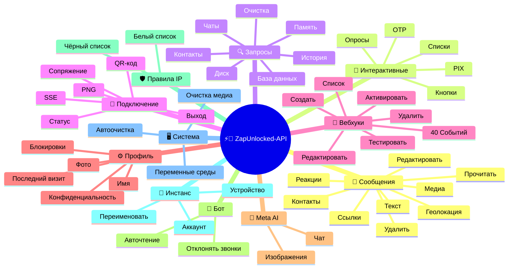
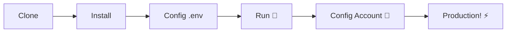

# ⚡💬 [ZapUnlocked-API](https://zapunlocked-api.kauafpss.com.br/)


<p align="center">
  
  <a href="https://downgit.github.io/#/home?url=https://github.com/kauafpssx/ZapUnlocked-API/blob/main/ZapUnlocked.collection.json">
    
  </a>
  
  
  
</p>

---

### 🌐 Выберите язык:

<table width="100%">
  <tr>
    <td align="center" valign="middle"><a href="https://github.com/kauafpssx/ZapUnlocked-API/blob/main/README.md"></a></td>
    <td align="center" valign="middle"><a href="https://github.com/kauafpssx/ZapUnlocked-API/blob/main/docs/translations/en.md"></a></td>
    <td align="center" valign="middle"><a href="https://github.com/kauafpssx/ZapUnlocked-API/blob/main/docs/translations/es.md"></a></td>
    <td align="center" valign="middle"><a href="https://github.com/kauafpssx/ZapUnlocked-API/blob/main/docs/translations/fr.md"></a></td>
    <td align="center" valign="middle"><a href="https://github.com/kauafpssx/ZapUnlocked-API/blob/main/docs/translations/de.md"></a></td>
    <td align="center" valign="middle"><a href="https://github.com/kauafpssx/ZapUnlocked-API/blob/main/docs/translations/zh.md"></a></td>
    <td align="center" valign="middle"><a href="https://github.com/kauafpssx/ZapUnlocked-API/blob/main/docs/translations/ja.md"></a></td>
    <td align="center" valign="middle"><a href="https://github.com/kauafpssx/ZapUnlocked-API/blob/main/docs/translations/ru.md"></a></td>
    <td align="center" valign="middle"><a href="https://github.com/kauafpssx/ZapUnlocked-API/blob/main/docs/translations/it.md"></a></td>
    <td align="center" valign="middle"><a href="https://github.com/kauafpssx/ZapUnlocked-API/blob/main/docs/translations/ar.md"></a></td>
    <td align="center" valign="middle"><a href="https://github.com/kauafpssx/ZapUnlocked-API/blob/main/docs/translations/tr.md"></a></td>
    <td align="center" valign="middle"><a href="https://github.com/kauafpssx/ZapUnlocked-API/blob/main/docs/translations/ko.md"></a></td>
    <td align="center" valign="middle"><a href="https://github.com/kauafpssx/ZapUnlocked-API/blob/main/docs/translations/hi.md"></a></td>
    <td align="center" valign="middle"><a href="https://github.com/kauafpssx/ZapUnlocked-API/blob/main/docs/translations/nl.md"></a></td>
  </tr>
</table>

---

##  Что такое ZapUnlocked-API?

WhatsApp API провайдеры берут ежемесячную плату: десятки и сотни реалов, с лимитами, платой за разговор и передачей данных через сторонние серверы. **ZapUnlocked-API — бесплатная и open-source альтернатива.**

Построена на **Python** с **[Neonize](https://github.com/krypton-byte/neonize)** в качестве движка подключения, API использует FastAPI для управления сессиями, отправки медиа и создания ботов. Без тяжелой базы данных, без ежемесячной платы, без сторонних серверов.

> [!TIP]
> Используйте для ботов, уведомлений и систем обслуживания клиентов. **100% бесплатно.**

> [!IMPORTANT]
> 🤖 **Meta AI интегрирован.** Используйте `/ai/ask` для общения и `/ai/imagine` для создания изображений внутри WhatsApp. [Смотреть маршрут](#-meta-ai--2-endpoints).

---

## 🗺️ Обзор API



---

## ✨ Ключевые возможности

| Функция | Описание |
| :------ | :------- |
| 🧩 **Stateless-кнопки** | Создавайте интерактивные потоки без базы данных с зашифрованными вебхуками |
| 🔢 **Сопряжение без QR-кода** | Подключайтесь по числовому коду · идеально для серверов без GUI |
| 🎵 **Автоконвертация аудио** | Отправляйте аудио, которые отображаются как записанные (PTT) нативно |
| 📦 **Умная очередь медиа** | Автоматическое управление для предотвращения чрезмерного потребления памяти |
| 🏷️ **Динамические плейсхолдеры** | Настраивайте сообщения и вебхуки с `{{name}}`, `{{day}}`, `{{phone}}` |
| 🤖 **Meta AI** | Общайтесь и создавайте изображения с ИИ внутри WhatsApp. |
| ⌨️ **Универсальные параметры** | `delay_message`, `delay_typing`, `reply`/`quoted_id` и `@упоминания` работают на **всех** endpoint отправки. |
| 🔐 **Подписанные Webhook** | Целостность через HMAC-SHA256. Ваш webhook принимает только легитимные данные. |
| 🔄 **Автопереподключение** | Переподключается автоматически при отключении, удаленном выходе или ошибке потока. |
| 📁 **Загрузка файла + URL** | Отправляйте медиа через прямую загрузку **или** публичный URL. |

> [!NOTE]
> Все функции **100% бесплатны**. Open-source сообщество поддерживает проект.

---

## 📋 Маршруты API

<details>
<summary><b>📨 Отправка сообщений</b> · 15 эндпоинтов</summary>

| Метод | Маршрут | Описание | Тело |
| :----- | :--- | :-------- | :--- |
| `POST` | `/send` | Отправить текстовое сообщение / ответить | `phone`, `message` |
| `POST` | `/send_image` | Отправить изображение | `phone`, `image_url` |
| `POST` | `/send_video` | Отправить видео (поддержка GIF и PTV) | `phone`, `video_url` |
| `POST` | `/send_gif` | Отправить анимированный GIF | `phone`, `url` |
| `POST` | `/send_audio` | Отправить аудио (с автоматической конвертацией в PTT) | `phone`, `audio_url` |
| `POST` | `/send_document` | Отправить документ | `phone`, `document_url` |
| `POST` | `/send_sticker` | Отправить стикер | `phone`, `sticker_url` |
| `POST` | `/send_reaction` | Отправить реакцию с эмодзи | `phone`, `messageId`, `emoji` |
| `POST` | `/send_location` | Отправить геолокацию | `phone`, `lat`, `lng` |
| `POST` | `/send_contact` | Отправить контакт | `phone`, `name`, `contactPhone` |
| `POST` | `/send_contacts` | Отправить несколько контактов | `phone`, `contacts` |
| `POST` | `/send_link` | Отправить ссылку с превью | `phone`, `url` |
| `POST` | `/messages/delete` | Удалить сообщение | `phone`, `messageId` |
| `POST` | `/messages/read` | Отметить как прочитанное | `phone`, `messageIds` |
| `POST` | `/messages/edit` | Редактировать отправленное сообщение | `phone`, `messageId`, `message` |
</details>

> [!TIP]
> **Универсальные параметры.** Доступны на **каждом** endpoint отправки сообщений (включая интерактивные):
>
> | Параметр | Назначение |
> | :------- | :--------- |
> | `delay_message` | Ожидает N секунд перед отправкой. |
> | `delay_typing` | Показывает "печатает..." N секунд перед отправкой. |
> | `reply` / `quoted_id` | ID сообщения для ответа (цитата). |
> | `mentioned` | JSON массив номеров для @упоминания. Пример: `["5511999999999"]` |

<details>
<summary><b>🔘 Интерактивные сообщения</b> · 9 эндпоинтов</summary>

| Метод | Маршрут | Описание | Тело |
| :----- | :--- | :-------- | :--- |
| `POST` | `/messages/send-button-list` | Кнопка со списком опций | `phone`, `buttons` |
| `POST` | `/messages/send-button-quick-reply` | Кнопка быстрого ответа | `phone`, `title`, `buttons` |
| `POST` | `/messages/send-button-otp` | Кнопка копирования (OTP) | `phone`, `code` |
| `POST` | `/messages/send-button-pix` | Кнопка PIX | `phone`, `pixKey` |
| `POST` | `/messages/send-button-url` | Кнопка со ссылкой | `phone`, `title`, `url` |
| `POST` | `/messages/send-button-call` | Кнопка звонка | `phone`, `title`, `phoneNumber` |
| `POST` | `/messages/send-option-list` | ⛔ **Временно отключена** (несовместимо с iPhone, Android и Web) | `phone`, `buttons` |
| `POST` | `/messages/send-poll` | Отправить опрос | `phone`, `name`, `options` |
| `POST` | `/messages/send-poll-vote` | Проголосовать в опросе | `phone`, `options` |
</details>

<details>
<summary><b>🔍 Запросы и управление</b> · 12 эндпоинтов</summary>

| Метод | Маршрут | Описание | Тело |
| :----- | :--- | :-------- | :--- |
| `POST` | `/management/fetch_messages` | Получить историю сообщений | `phone` |
| `POST` | `/management/recent_contacts` | Список недавних чатов | ❌ |
| `GET` | `/management/chats` | Список чатов с историей | ❌ |
| `GET` | `/management/chats/{phone}/messages` | Сообщения конкретного чата | ❌ |
| `GET` | `/management/contacts/{phone}` | Детальная информация о контакте | ❌ |
| `GET` | `/management/groups` | Список групп | ❌ |
| `DELETE` | `/management/cleanup` | Очистить данные чата | ❌ |
| `GET` | `/management/export` | Экспорт конфигурации (webhooks, settings, IP rules) | ❌ |
| `POST` | `/management/import` | Импорт конфигурации через загрузку файла | `file` |
| `GET` | `/management/database/status` | Статус и статистика БД | ❌ |
| `POST` | `/management/database/config` | Обновить настройки БД | `interval` |
| `POST` | `/management/database/cleanup` | Ручная очистка БД | ❌ |
</details>

<details>
<summary><b>👤 Контакты</b> · 1 эндпоинт</summary>

| Метод | Маршрут | Описание | Тело |
| :----- | :--- | :-------- | :--- |
| `POST` | `/contacts/info` | Детальная информация о контакте | `phone` |
</details>

<details>
<summary><b>🏠 Общее / Статус</b> · 9 эндпоинтов</summary>

| Метод | Маршрут | Описание | Тело |
| :----- | :--- | :-------- | :--- |
| `GET` | `/` | Приветственная страница (HTML) | ❌ |
| `GET` | `/status` | Полный статус (WhatsApp, CPU, память, диск) | ❌ |
| `GET` | `/status/stream` | Статус в реальном времени через SSE | ❌ |
| `GET` | `/status/health` | Простой health check (`{"ok":true}`) | ❌ |
| `GET` | `/status/readiness` | Readiness check (503, если WhatsApp отключён) | ❌ |
| `GET` | `/status/memory` | Статус памяти (процесс + система) | ❌ |
| `GET` | `/status/volume` | Статус диска (размер, файлы) | ❌ |
| `GET` | `/collection.json` | Скачать Collection Postman | ❌ |
| `POST` | `/collection.json` | Обновить Collection Postman | JSON body |
</details>

<details>
<summary><b>🔗 Подключение (QR)</b> · 2 эндпоинта</summary>

| Метод | Маршрут | Описание | Тело |
| :----- | :--- | :-------- | :--- |
| `GET` | `/qr` | Просмотр интерактивного QR-кода (HTML) | ❌ |
| `GET` | `/qr/image` | Получить изображение QR-кода (PNG) | ❌ |
</details>

<details>
<summary><b>🔐 Сессия</b> · 2 эндпоинта</summary>

| Метод | Маршрут | Описание | Тело |
| :----- | :--- | :-------- | :--- |
| `POST` | `/session/pair` | Сгенерировать числовой код сопряжения | `phone` |
| `POST` | `/session/logout` | Отключиться и сбросить сессию | ❌ |
</details>

<details>
<summary><b>📡 Вебхуки (CRUD)</b> · 8 эндпоинтов</summary>

| Метод | Маршрут | Описание | Тело |
| :----- | :--- | :-------- | :--- |
| `POST` | `/webhooks` | Создать именованный вебхук | `name`, `url` |
| `GET` | `/webhooks` | Список всех вебхуков | ❌ |
| `GET` | `/webhooks/{name}` | Получить вебхук по имени | ❌ |
| `PUT` | `/webhooks/{name}` | Редактировать вебхук | ❌ |
| `DELETE` | `/webhooks/{name}` | Удалить вебхук | ❌ |
| `POST` | `/webhooks/{name}/toggle` | Включить / отключить | `active` |
| `POST` | `/webhooks/{name}/test` | Тестировать вебхук | ❌ |
| `GET` | `/webhooks/events` | Список типов событий (40 типов) | ❌ |
</details>

<details>
<summary><b>⚙️ Профиль и конфиденциальность</b> · 13 эндпоинтов</summary>

| Метод | Маршрут | Описание | Тело |
| :----- | :--- | :-------- | :--- |
| `POST` | `/settings/profile` | Изменить имя и фото бота | `name?`, `photo?` (Form) |
| `POST` | `/settings/block` | Заблокировать / разблокировать контакт | `phone`, `action` |
| `PUT` | `/settings/privacy/last-seen` | Последний визит | `value` |
| `PUT` | `/settings/privacy/online` | Статус онлайн | `value` |
| `PUT` | `/settings/privacy/profile` | Видимость фото | `value` |
| `PUT` | `/settings/privacy/status` | Видимость статуса | `value` |
| `PUT` | `/settings/privacy/read-receipts` | Подтверждение прочтения | `value` |
| `PUT` | `/settings/privacy/groups-add` | Кто может добавлять в группы | `value` |
| `PUT` | `/settings/privacy/call-add` | Кто может добавлять в звонки | `value` |
| `PUT` | `/settings/privacy/about` | О себе | `value?` |
| `PUT` | `/settings/privacy/disappearing-timer` | Таймер временных сообщений | `value?` |
| `GET` | `/settings/ip-control` | Просмотр статуса IP control | ❌ |
| `PUT` | `/settings/ip-control` | Включить/отключить IP control | `enabled` |
</details>

<details>
<summary><b>🤖 Настройки бота</b> · 4 эндпоинта</summary>

| Метод | Маршрут | Описание | Тело |
| :----- | :--- | :-------- | :--- |
| `PUT` | `/settings/instance/call-reject-auto` | Автоматически отклонять звонки | `value` |
| `PUT` | `/settings/instance/call-reject-message` | Сообщение при отклонении звонка | `value` |
| `PUT` | `/settings/instance/auto-read-message` | Автоматическое чтение сообщений | `value` |
| `GET` | `/settings/phone-code/{phone}` | Сгенерировать код сопряжения по номеру | ❌ |
</details>

<details>
<summary><b>📱 Инстанс</b> · 3 эндпоинта</summary>

| Метод | Маршрут | Описание | Тело |
| :----- | :--- | :-------- | :--- |
| `GET` | `/instance/me` | Данные подключённого аккаунта | ❌ |
| `GET` | `/instance/device` | Технические данные устройства | ❌ |
| `PUT` | `/instance/update-name` | Переименовать инстанс | `name` |
</details>

<details>
<summary><b>🛡️ Правила IP</b> · 5 эндпоинтов</summary>

| Метод | Маршрут | Описание | Тело |
| :----- | :--- | :-------- | :--- |
| `GET` | `/settings/ip-rules` | Список правил IP (белый/чёрный список) | ❌ |
| `POST` | `/settings/ip-rules/whitelist` | Добавить IP в белый список | `ip` |
| `POST` | `/settings/ip-rules/blacklist` | Добавить IP в чёрный список | `ip` |
| `DELETE` | `/settings/ip-rules/whitelist/{ip}` | Удалить IP из белого списка | ❌ |
| `DELETE` | `/settings/ip-rules/blacklist/{ip}` | Удалить IP из чёрного списка | ❌ |
</details>

<details>
<summary><b>🖥️ Система</b> · 5 эндпоинтов</summary>

| Метод | Маршрут | Описание | Тело |
| :----- | :--- | :-------- | :--- |
| `GET` | `/system/env` | Просмотр переменных среды | ❌ |
| `PUT` | `/system/env` | Обновить переменные среды | ❌ |
| `POST` | `/system/cleanup/force` | Принудительная очистка временных медиа | ❌ |
| `GET` | `/system/cleanup/settings` | Просмотр настроек автоочистки | ❌ |
| `PUT` | `/system/cleanup/settings` | Обновить интервал автоочистки | ❌ |
</details>

<details>
<summary><b>📊 Логи</b> · 3 эндпоинта</summary>

| Метод | Маршрут | Описание | Тело |
| :----- | :--- | :-------- | :--- |
| `GET` | `/logs/files` | Список файлов логов | ❌ |
| `GET` | `/logs` | Просмотр логов с фильтрами | ❌ |
| `POST` | `/logs/cleanup` | Принудительное сжатие/очистка логов | ❌ |
</details>

<details>
<summary><b>📈 Статистика</b> · 6 эндпоинтов</summary>

| Метод | Маршрут | Описание | Тело |
| :----- | :--- | :-------- | :--- |
| `GET` | `/stats` | Статистика (uptime, сообщения, вебхуки) | ❌ |
| `DELETE` | `/stats` | Сбросить статистику | ❌ |
| `GET` | `/stats/webhooks` | Статистика всех вебхуков | ❌ |
| `GET` | `/stats/webhooks/{name}` | Статистика конкретного вебхука | ❌ |
| `DELETE` | `/stats/webhooks` | Сбросить статистику всех вебхуков | ❌ |
| `DELETE` | `/stats/webhooks/{name}` | Сбросить статистику вебхука | ❌ |
</details>

<details>
<summary><b>🤖 Meta AI</b> · 2 эндпоинта</summary>

| Метод | Маршрут | Описание | Тело |
| :----- | :--- | :-------- | :--- |
| `POST` | `/ai/ask` | Спросить у Meta AI | `message` |
| `POST` | `/ai/imagine` | Сгенерировать изображение с Meta AI | `prompt` |
</details>

<details>
<summary><b>🔐 Мульти-сессии</b> · 7 эндпоинтов</summary>

| Метод | Маршрут | Описание | Тело |
| :----- | :--- | :-------- | :--- |
| `GET` | `/sessions` | Список всех сессий | ❌ |
| `POST` | `/sessions` | Создать новую сессию | `name?` |
| `PUT` | `/sessions/{id}/rename` | Переименовать сессию | `name` |
| `DELETE` | `/sessions/{id}` | Деактивировать сессию | ❌ |
| `POST` | `/sessions/{id}/connect` | Подключить сессию | ❌ |
| `POST` | `/sessions/{id}/disconnect` | Отключить сессию | ❌ |
| `GET` | `/sessions/{id}/status` | Статус сессии | ❌ |
</details>

<details>
<summary><b>📡 Вебхуки (Логи)</b> · 3 эндпоинта</summary>

| Метод | Маршрут | Описание | Тело |
| :----- | :--- | :-------- | :--- |
| `GET` | `/webhooks/{name}/logs` | Логи доставки вебхука | ❌ |
| `DELETE` | `/webhooks/{name}/logs` | Очистить логи вебхука | ❌ |
| `DELETE` | `/webhooks/logs/all` | Очистить логи всех вебхуков | ❌ |
</details>

> **Всего: 108 эндпоинтов**

---

## 📡 События Webhook

Все вебхуки получают стандартный конверт:

```json
{
  "event": "message.text",
  "timestamp": "2025-01-01T12:00:00Z",
  "data": { ... }
}
```

Если у вебхука есть пользовательский `body` с `{{placeholders}}`, этот body отправляется вместо стандартного конверта.

---

<details>
<summary><b>🏷️ Доступные плейсхолдеры в пользовательском body</b></summary>

| Placeholder | Значение |
| :---------- | :---- |
| `{{from}}` | Номер отправителя |
| `{{text}}` | Текст сообщения |
| `{{phone}}` | То же, что `{{from}}` |
| `{{id}}` | ID сообщения |
| `{{requested}}` | Запрошенное количество (fetchMessages) |
| `{{found}}` | Найденное количество (fetchMessages) |
| `{{timestamp}}` | Текущая метка UTC |

</details>

---

<details>
<summary><b>📥 Полученные сообщения</b> · 18 событий</summary>

> **Media fields:** Медиа-события (`message.image`, `message.video`, `message.audio`, `message.document`, `message.sticker`) включают дополнительные поля, когда `RECEIVE_MEDIA_ENABLED=true`: `mediaBase64` (base64 файла), `fileName`, `mimeType`, `mediaTooLarge` (bool, true при превышении `RECEIVE_MEDIA_MAX_SIZE_MB`).

Базовые поля в событиях полученных сообщений:

```json
{
  "messageId": "3EB0ABCDEF123456",
  "from": "5511999999999",
  "fromName": "João Silva",
  "fromJid": "5511999999999@s.whatsapp.net",
  "isGroup": false
}
```

<details>
<summary><code>message.text</code> - Простой / форматированный текст</summary>

```json
{
  "event": "message.text",
  "data": {
    "...base": "...",
    "text": "Здравствуйте! Чем могу помочь?",
    "quoted": { "id": "3EB0...", "fromMe": true }
  }
}
```
</details>

<details>
<summary><code>message.image</code> - Полученное изображение</summary>

```json
{
  "event": "message.image",
  "data": {
    "...base": "...",
    "caption": "Фото товара",
    "mimetype": "image/jpeg",
    "fileLength": 204800
  }
}
```
</details>

<details>
<summary><code>message.video</code> - Полученное видео</summary>

```json
{
  "event": "message.video",
  "data": {
    "...base": "...",
    "caption": "Посмотрите это видео!",
    "mimetype": "video/mp4",
    "fileLength": 5242880,
    "isPTT": false,
    "isGif": false
  }
}
```
</details>

<details>
<summary><code>message.audio</code> - Аудио / голосовое сообщение</summary>

```json
{
  "event": "message.audio",
  "data": {
    "...base": "...",
    "mimetype": "audio/ogg; codecs=opus",
    "fileLength": 30720,
    "isPTT": true,
    "durationSeconds": 8
  }
}
```
</details>

<details>
<summary><code>message.document</code> - Документ / файл</summary>

```json
{
  "event": "message.document",
  "data": {
    "...base": "...",
    "fileName": "договор.pdf",
    "caption": "Вот договор",
    "mimetype": "application/pdf",
    "fileLength": 102400
  }
}
```
</details>

<details>
<summary><code>message.sticker</code> - Стикер</summary>

```json
{
  "event": "message.sticker",
  "data": {
    "...base": "...",
    "mimetype": "image/webp",
    "isAnimated": false
  }
}
```
</details>

<details>
<summary><code>message.contact</code> - Поделились контактом</summary>

```json
{
  "event": "message.contact",
  "data": {
    "...base": "...",
    "displayName": "Maria Souza",
    "vcard": "BEGIN:VCARD\nVERSION:3.0\n..."
  }
}
```
</details>

<details>
<summary><code>message.contacts</code> - Несколько контактов</summary>

```json
{
  "event": "message.contacts",
  "data": {
    "...base": "...",
    "displayName": "2 contacts",
    "count": 2,
    "contacts": [
      { "displayName": "Maria Souza", "vcard": "BEGIN:VCARD\n..." },
      { "displayName": "João Silva", "vcard": "BEGIN:VCARD\n..." }
    ]
  }
}
```
</details>

<details>
<summary><code>message.location</code> - Геолокация</summary>

```json
{
  "event": "message.location",
  "data": {
    "...base": "...",
    "lat": -23.5505,
    "lng": -46.6333,
    "name": "Av. Paulista",
    "address": "Av. Paulista, 1000 - São Paulo"
  }
}
```
</details>

<details>
<summary><code>message.reaction</code> - Реакция (эмодзи)</summary>

```json
{
  "event": "message.reaction",
  "data": {
    "...base": "...",
    "emoji": "❤️",
    "targetMessageId": "3EB0ABCDEF123456",
    "isRemoved": false
  }
}
```
</details>

<details>
<summary><code>message.poll_created</code> - Полученный опрос</summary>

```json
{
  "event": "message.poll_created",
  "data": {
    "...base": "...",
    "pollName": "Какой вкус лучший?",
    "options": ["Шоколад", "Клубника", "Ваниль"]
  }
}
```
</details>

<details>
<summary><code>message.poll_vote</code> - Голос в опросе</summary>

```json
{
  "event": "message.poll_vote",
  "data": {
    "...base": "...",
    "pollId": "3EB0ABCDEF123456",
    "selectedOptions": ["Шоколад"]
  }
}
```
</details>

<details>
<summary><code>message.button_reply</code> - Нажатие кнопки</summary>

```json
{
  "event": "message.button_reply",
  "data": {
    "...base": "...",
    "buttonId": "opcao_sim",
    "displayText": "Да",
    "type": "quick_reply"
  }
}
```
</details>

<details>
<summary><code>message.list_reply</code> - Выбор в интерактивном списке</summary>

```json
{
  "event": "message.list_reply",
  "data": {
    "...base": "...",
    "rowId": "1",
    "title": "X-Burguer",
    "description": "R$ 18,90"
  }
}
```
</details>

<details>
<summary><code>message.deleted</code> - Сообщение удалено отправителем</summary>

```json
{
  "event": "message.deleted",
  "data": {
    "...base": "..."
  }
}
```
</details>

<details>
<summary><code>message.unknown</code> - Неотображённый тип</summary>

```json
{
  "event": "message.unknown",
  "data": {
    "...base": "...",
    "rawType": "senderKeyDistributionMessage"
  }
}
```
</details>

<details>
<summary><code>message.undecryptable</code> - Недешифруемое сообщение</summary>

```json
{
  "event": "message.undecryptable",
  "data": {
    "...base": "..."
  }
}
```
</details>

</details>

<details>
<summary><b>📤 Отправленные сообщения</b> · 22 события</summary>

<details>
<summary><code>message.sent</code> - Отправленное сообщение (общее)</summary>

```json
{
  "event": "message.sent",
  "data": {
    "to": "5511999999999",
    "type": "text",
    "messageId": "3EB0ABCDEF123456"
  }
}
```
</details>

<details>
<summary><code>message.sent.{type}</code> - Событие по типу</summary>

Тот же payload, что и `message.sent`, но с конкретным событием. Полезно для подписки на один тип отправки.

Типы: `text`, `image`, `audio`, `video`, `document`, `sticker`, `gif`, `interactive`, `list`, `poll`, `poll_vote`, `location`, `contact`, `contacts`, `link`, `reaction`, `edit`, `delete`

```json
{
  "event": "message.sent.image",
  "data": {
    "to": "5511999999999",
    "type": "image",
    "messageId": "3EB0ABCDEF123456"
  }
}
```
</details>

<details>
<summary><code>message.delivered</code> - Сообщение доставлено получателю (receipt type 1)</summary>

```json
{
  "event": "message.delivered",
  "data": {
    "from": "5511999999999",
    "messageId": "3EB0ABCDEF123456"
  }
}
```
</details>

<details>
<summary><code>message.read</code> - Сообщение прочитано получателем (receipt type 4)</summary>

```json
{
  "event": "message.read",
  "data": {
    "from": "5511999999999",
    "messageId": "3EB0ABCDEF123456"
  }
}
```
</details>

<details>
<summary><code>message.receipt</code> - Другие типы подтверждений (receipt types 2, 3, 5+)</summary>

```json
{
  "event": "message.receipt",
  "data": {
    "from": "5511999999999",
    "messageId": "3EB0ABCDEF123456",
    "receiptType": 2
  }
}
```
</details>

</details>

<details>
<summary><b>🔗 Подключение</b> · 11 событий</summary>

<details>
<summary><code>connection.connected</code> - WhatsApp подключён</summary>

```json
{
  "event": "connection.connected",
  "data": {
    "phone": "5511999999999"
  }
}
```
</details>

<details>
<summary><code>connection.disconnected</code> - WhatsApp отключён</summary>

```json
{
  "event": "connection.disconnected",
  "data": {}
}
```
</details>

<details>
<summary><code>connection.qr_ready</code> - QR-код сгенерирован</summary>

```json
{
  "event": "connection.qr_ready",
  "data": {
    "qr": "2@abc123..."
  }
}
```
</details>

<details>
<summary><code>connection.pair_code</code> - Код сопряжения сгенерирован</summary>

```json
{
  "event": "connection.pair_code",
  "data": {
    "code": "ABCD-1234",
    "connected": false
  }
}
```

`connected: true`, когда сопряжение завершено.
</details>

<details>
<summary><code>connection.pair_status</code> - Статус сопряжения</summary>

```json
{
  "event": "connection.pair_status",
  "data": {
    "jid": "5511999999999@s.whatsapp.net",
    "businessName": "My Business",
    "platform": "WEB",
    "status": "OK",
    "error": ""
  }
}
```
</details>

<details>
<summary><code>connection.logged_out</code> - Сессия завершена удалённо</summary>

```json
{
  "event": "connection.logged_out",
  "data": {
    "reason": "User logout"
  }
}
```
</details>

<details>
<summary><code>connection.connect_failure</code> - Ошибка подключения</summary>

```json
{
  "event": "connection.connect_failure",
  "data": {
    "reason": "ERROR_CONNECT",
    "message": "Connection timed out"
  }
}
```
</details>

<details>
<summary><code>connection.stream_error</code> - Ошибка потока</summary>

```json
{
  "event": "connection.stream_error",
  "data": {
    "code": "STREAM_ERR"
  }
}
```
</details>

<details>
<summary><code>connection.temporary_ban</code> - Временная блокировка</summary>

```json
{
  "event": "connection.temporary_ban",
  "data": {
    "code": "BAN_CODE",
    "expire": 1704153600
  }
}
```
</details>

<details>
<summary><code>connection.client_outdated</code> - Клиент устарел</summary>

```json
{
  "event": "connection.client_outdated",
  "data": {}
}
```
</details>

<details>
<summary><code>connection.stream_replaced</code> - Поток заменён</summary>

```json
{
  "event": "connection.stream_replaced",
  "data": {}
}
```
</details>

</details>

<details>
<summary><b>👥 Группа</b> · 2 события</summary>

<details>
<summary><code>group.join</code> - Бот вошёл в группу</summary>

```json
{
  "event": "group.join",
  "data": {
    "groupId": "123456789@g.us",
    "groupName": "My Group",
    "reason": "invite",
    "type": ""
  }
}
```
</details>

<details>
<summary><code>group.update</code> - Группа обновлена</summary>

```json
{
  "event": "group.update",
  "data": {
    "groupId": "123456789@g.us",
    "sender": "5511999999999@s.whatsapp.net",
    "name": "New Group Name",
    "topic": "New description",
    "locked": false,
    "announce": false,
    "ephemeral": 604800,
    "delete": false,
    "link": null,
    "unlink": null,
    "newInviteLink": "https://chat.whatsapp.com/abc123"
  }
}
```
</details>

</details>

<details>
<summary><b>👤 Контакт / Присутствие</b> · 4 события</summary>

<details>
<summary><code>contact.presence</code> - Статус присутствия контакта</summary>

```json
{
  "event": "contact.presence",
  "data": {
    "from": "5511999999999",
    "fromJid": "5511999999999@s.whatsapp.net",
    "status": "online",
    "lastSeen": 0
  }
}
```

`status`: `"online"` или `"offline"`.
</details>

<details>
<summary><code>contact.chat_presence</code> - Статус набора текста</summary>

```json
{
  "event": "contact.chat_presence",
  "data": {
    "from": "5511999999999",
    "fromJid": "5511999999999@s.whatsapp.net",
    "state": "typing",
    "media": null
  }
}
```

`state`: `"typing"`, `"recording"` или `"paused"`.
</details>

<details>
<summary><code>contact.picture_change</code> - Фото профиля изменено</summary>

```json
{
  "event": "contact.picture_change",
  "data": {
    "from": "5511999999999",
    "fromJid": "5511999999999@s.whatsapp.net",
    "author": "5511999999999@s.whatsapp.net",
    "action": "changed"
  }
}
```

`action`: `"changed"` или `"removed"`.
</details>

<details>
<summary><code>contact.identity_change</code> - Ключ безопасности изменён</summary>

```json
{
  "event": "contact.identity_change",
  "data": {
    "from": "5511999999999",
    "fromJid": "5511999999999@s.whatsapp.net",
    "implicit": false,
    "timestamp": 1704067200
  }
}
```
</details>

</details>

<details>
<summary><b>📞 Звонок</b> · 3 события</summary>

<details>
<summary><code>call.received</code> - Входящий звонок</summary>

```json
{
  "event": "call.received",
  "data": {
    "from": "5511999999999",
    "fromJid": "5511999999999@s.whatsapp.net",
    "callId": "ABC123DEF456"
  }
}
```
</details>

<details>
<summary><code>call.accepted</code> - Звонок принят</summary>

```json
{
  "event": "call.accepted",
  "data": {
    "from": "5511999999999",
    "callId": "ABC123DEF456"
  }
}
```
</details>

<details>
<summary><code>call.terminated</code> - Звонок завершён</summary>

```json
{
  "event": "call.terminated",
  "data": {
    "from": "5511999999999",
    "callId": "ABC123DEF456",
    "reason": "timeout"
  }
}
```
</details>

</details>

<details>
<summary><b>🧹 Очистка медиа</b> · 1 событие</summary>

<details>
<summary><code>media.cleanup.completed</code> - Автоматическая очистка медиа выполнена</summary>

```json
{
  "event": "media.cleanup.completed",
  "data": {
    "filesRemoved": 12,
    "remainingBytes": 52428800
  }
}
```

Выполняется автоматически каждый час. `filesRemoved: 0`, когда ничего не было удалено.
</details>

</details>

<details>
<summary><b>🤖 ИИ</b> · 1 событие</summary>

<details>
<summary><code>ai.response</code> - Ответ Meta AI получен</summary>

```json
{
  "event": "ai.response",
  "data": {
    "text": "Бразилиа!",
    "hasImage": false,
    "imageBase64": null,
    "imageUrl": null,
    "mimeType": null,
    "messageId": "3EB0ABCDEF123456"
  }
}
```

Срабатывает, когда Meta AI отвечает. Используйте для обработки асинхронных ответов (`POST /ai/ask` имеет таймаут 30 с).
</details>

</details>

---

## 🛠️ Установка и хостинг

> Разместите WhatsApp API менее чем за **5 минут** с **ZapUnlocked-API**.

### 💻 Локальная установка

Для разработки, тестирования или запуска на собственном сервере.



**1. Клонируйте репозиторий**

```bash
git clone https://github.com/kauafpssx/ZapUnlocked-API.git
cd ZapUnlocked-API
```

**2. Установите зависимости**

| Система | Команда |
| :------ | :------ |
| 🪟 Windows | `scripts\install\install.bat` |
| 🐧 Linux / macOS | `bash scripts/install/install.sh` |

**3. Настройте окружение**

| Система | Команда |
| :------ | :------ |
| 🪟 Windows | `scripts\generate-env\generate-env.bat` |
| 🐧 Linux / macOS | `bash scripts/generate-env/generate-env.sh` |

| Переменная | Описание |
| :------- | :-------- |
| `API_KEY` | Пароль для аутентификации на всех эндпоинтах |
| `INTERNAL_SECRET` | Токен для проверки подписей вебхуков |
| `PORT` | Порт API (по умолчанию: `8300`) |

**4. Запустите API**

| Система | Команда |
| :------ | :------ |
| 🪟 Windows | `scripts\run\run.bat` |
| 🐧 Linux / macOS | `bash scripts/run/run.sh` |

---

### ☁️ Хостинг: Alwaysdata (Бесплатно 24/7)

**Alwaysdata** предоставляет стабильный и бесплатный хостинг API. Вам не нужен собственный сервер.

<details>
<summary><b>📊 Ресурсы и пошаговая инструкция</b></summary>

#### 📊 Ресурсы бесплатного плана

| Ресурс | Доступно в Free |
| :------ | :----------------- |
| 💾 Хранилище | **1 GB SSD** |
| 🧠 RAM | **256 MB** |
| ⚡ CPU | **1/4 vCPU** |
| 🔄 Резервное копирование | **3 дня** автоматически |
| 📡 Аптайм | **24/7** через Services |

#### 👣 Пошаговая инструкция по деплою

**1.** Создайте аккаунт на [Alwaysdata.com](https://www.alwaysdata.com/) · план **Free**.

**2.** Подключитесь по SSH: `https://ssh-[пользователь].alwaysdata.net`.

**3.** Клонируйте и установите:

```bash
git clone https://github.com/kauafpssx/ZapUnlocked-API.git ~/ZapUnlocked-API
cd ~/ZapUnlocked-API
bash scripts/install/install.sh
```

**4.** *(Опционально)* Сгенерируйте `.env`:

```bash
bash scripts/generate-env/generate-env.sh
```

> [!NOTE]
> Скрипт установки спросит, хотите ли вы настроить `.env`. При ответе **да** этот шаг не нужен. Иначе выполните команду выше или настройте `.env` вручную.

**5.** Настройте Сервис (24/7) в **Advanced · Services · Add a service**:

| Поле | Значение |
| :---- | :---- |
| **Command** | `bash scripts/run/run.sh` |
| **Working directory** | `ZapUnlocked-API` |
| **Environment variables** | `PORT=8300` |

**6.** Доступ по URL:

```
http://services-[пользователь].alwaysdata.net:8300/
```

> [!TIP]
> URL уже доступен извне. *(Опционально)* Для использования собственного домена настройте **Reverse Proxy** в **Web · Sites · Add a site**, указав `http://[пользователь].alwaysdata.net`.

---

#### 🔐 Аутентификация (Вход)

После деплоя подключите свой аккаунт WhatsApp, перейдя в браузере по адресу:

```text
http://services-[пользователь].alwaysdata.net:8300/qr?API_KEY=ВАШ_СЕКРЕТНЫЙ_КЛЮЧ
```

</details>

---

<details>
<summary><b>📌 Другая информация</b> · Переменные окружения, часовой пояс, параметры отправки, массовая рассылка, прием медиа</summary>

### 🌐 Полные переменные окружения

Дополнительные переменные `.env` помимо `API_KEY`, `INTERNAL_SECRET` и `PORT`:

| Переменная | По умолчанию | Описание |
| :------- | :----- | :-------- |
| `PUBLIC_URL` | auto | Публичный URL для ссылки на панель `/qr` в логах |
| `TZ` | `UTC` | Часовой пояс для временных меток (напр. `America/Sao_Paulo`) |
| `DRY_RUN` | `false` | Режим тестирования, перехватывает отправку без вызова WhatsApp |
| `RECEIVE_MEDIA_ENABLED` | `false` | Автоскачивание полученных медиа в `temp_media/` |
| `RECEIVE_MEDIA_MAX_SIZE_MB` | `15` | Макс. размер полученных медиа (МБ) |
| `CORS_ORIGINS` | `*` | Разрешенные источники (через запятую) |
| `ENABLE_WHATSAPP` | `1` | Отключить бот WhatsApp (`0` для тестов) |
| `ENABLE_FFMPEG_WARMUP` | `1` | Отключить прогрев FFmpeg (`0`) |
| `MAX_UPLOAD_SIZE_MB` | `500` | Макс. размер загрузки на файл |
| `CLEANUP_MAX_AGE_DAYS` | `7` | Макс. возраст файлов в `temp_media/` |
| `CLEANUP_MAX_SIZE_MB` | `500` | Макс. общий размер `temp_media/` |
| `LOG_MAX_AGE_DAYS` | `30` | Макс. возраст сжатых логов |
| `LOG_MAX_SIZE_MB` | `50` | Макс. общий размер логов |
| `META_AI_PHONE` | auto | Переопределить номер Meta AI |
| `META_AI_TIMEOUT` | `30` | Тайм-аут ответа Meta AI (секунды) |
| `META_AI_KEEP_IMAGES` | `false` | Сохранять изображения Meta AI на диск |
| `ALWAYSDATA_ACCOUNT` | auto | Принудительное окружение Alwaysdata |

---

### 🕐 Часовой пояс (Timezone)

Каждый endpoint отправки возвращает `timestamp` в ISO 8601 со смещением. Настройка по приоритету:

1. `timezone.conf` в корне проекта (первая не закомментированная строка)
2. `TZ` в `.env` или переменной окружения
3. По умолчанию: `UTC`

Примеры значений: `America/Sao_Paulo`, `America/New_York`, `Europe/London`, `Asia/Tokyo`.

```json
{
  "success": true,
  "message": "Message sent.",
  "messageId": "3EB0ABCDEF123456",
  "timestamp": "2026-06-15T14:30:00-0300"
}
```

---

### ✏️ Динамическое форматирование текста

Плейсхолдеры, заменяемые при отправке:

| Плейсхолдер | Заменяется на |
| :---------- | :-------------- |
| `{{day}}` | Текущий день (01-31) |
| `{{mon}}` | Текущий месяц (01-12) |
| `{{yea}}` | Текущий год (2026) |
| `{{hou}}` | Текущий час (00-23) |
| `{{min}}` | Текущая минута (00-59) |
| `{{sec}}` | Текущая секунда (00-59) |

Новый текст:
```text
{
  "phone": "5511999999999",
  "message": "Сегодня {{day}}.{{mon}}.{{yea}}, время {{hou}}:{{min}}:{{sec}}"
}
```

Результат: `"Сегодня 15.06.2026, время 14:30:00"`

---

### 🧪 Режим DRY_RUN

`DRY_RUN=true` в `.env` заставляет все endpoint отправки возвращать успех без вызова WhatsApp. Ответ включает `"dryRun": true`, `"messageId": null`.

Использование: тестирование интеграции, CI/CD, проверка payload.

```json
{
  "success": true,
  "dryRun": true,
  "message": "Message sent.",
  "messageId": null,
  "timestamp": "2026-06-15T14:30:00-0300"
}
```

---

### ⚙️ Необязательные параметры endpoint отправки

Доступны на всех endpoint `/send/*`, `/send/media`, `/send/buttons/*`:

| Параметр | Тип | Описание |
| :-------- | :--- | :-------- |
| `quoted_id` | `string` | ID сообщения для ответа |
| `delay_message` | `number` | Задержка в секундах перед отправкой |
| `delay_typing` | `number` | Имитация печати на X секунд |
| `mentioned` | `string[]` | Номера для упоминания (@mention) |

```json
{
  "phone": "5511999999999",
  "message": "Привет @5511888888888!",
  "quoted_id": "3EB0ABC123",
  "delay_message": 2,
  "delay_typing": 3,
  "mentioned": ["5511888888888"]
}
```

> [!NOTE]
> `quoted_id` принимает ID сообщения (`type: "id"`) или текст для поиска (`type: "text"`). Если ID не найден в локальной истории, API создает placeholder и WhatsApp отображает цитату.

---

### 📦 Массовая отправка (Bulk Send)

`POST /send/bulk` отправляет одно сообщение на несколько номеров:

| Параметр | Тип | Обязательно | Описание |
| :-------- | :--- | :---------- | :-------- |
| `phones` | `string[]` | ✅ | Массив номеров |
| `message` | `string` | ✅ | Текст сообщения |
| `delay_message` | `number` | ❌ | Задержка перед каждой отправкой |
| `delay_typing` | `number` | ❌ | Имитация печати |
| `delay_between` | `number` | ❌ | Задержка между номерами |
| `mentioned` | `string[]` | ❌ | Упоминания |

```json
{
  "phones": ["5511999999999", "5511888888888", "5511777777777"],
  "message": "Срочная распродажа! 🔥",
  "delay_between": 3,
  "delay_typing": 2
}
```

---

### 📥 Прием медиа

С `RECEIVE_MEDIA_ENABLED=true` API скачивает полученные медиа (изображение, видео, аудио, документ, стикер) и добавляет `mediaUrl` в webhook:

```json
{
  "event": "message.upsert",
  "data": {
    "key": { "remoteJid": "5511999999999@s.whatsapp.net" },
    "message": { "imageMessage": {} },
    "mediaUrl": "http://services-пользователь.alwaysdata.net:8300/media/uuid-файл.jpg"
  }
}
```

Файлы хранятся в `temp_media/` и очищаются автоматическим планировщиком.

---

### 🧹 Автоматическая очистка (temp_media)

Очистка `temp_media/` запускается каждый час. Срабатывает при достижении любого критерия:

* Файлы старше `CLEANUP_MAX_AGE_DAYS` (по умолчанию: 7 дней)
* Общий размер превышает `CLEANUP_MAX_SIZE_MB` (по умолчанию: 500 МБ)

Запускает webhook `media.cleanup.completed` с `filesRemoved` и `remainingBytes`.

</details>

---

## 📖 Официальная документация

<p align="center">
  👉 <a href="https://zapunlocked-api.kauafpss.com.br"><strong>zapunlocked-api.kauafpss.com.br</strong></a>
</p>

Для подробной технической документации, примеров кода и интерактивной площадки посетите наш официальный сайт.

> [!TIP]
> Используйте **LLMs.txt** как индекс для ИИ: [`zapunlocked-api.kauafpss.com.br/llms.txt`](https://zapunlocked-api.kauafpss.com.br/llms.txt). Откройте все страницы перед изучением.

---

## ❤️ Кредиты и благодарности

| Проект | Описание |
| :------ | :-------- |
| [](https://github.com/krypton-byte/neonize) | Python-библиотека для нативного подключения к WhatsApp Web |
| [](https://github.com/tulir/whatsmeow) | Go-библиотека, основа Neonize · сердце подключения |
| [](https://www.alwaysdata.com/) | Высококачественная бесплатная инфраструктура |

---

## 📄 Лицензия

Этот проект лицензирован под **лицензией MIT**.

<p align="center">
  Сделано с 💜 <a href="https://www.instagram.com/kauafpss_/">Kauã Ferreira</a>
</p>
