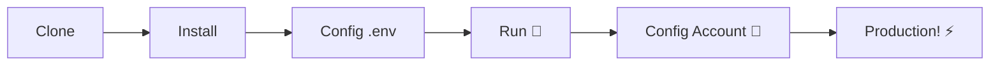

# 🚀 [ZapUnlocked-API](https://zapunlocked-api.kauafpss.com.br) 📲✨


<p align="center">
  
  
  
  
  
</p>

<table width="100%">
  <tr>
    <td align="center" valign="middle"><a href="https://github.com/kauafpssx/ZapUnlocked-API/blob/main/docs/translations/en.md"></a></td>
    <td align="center" valign="middle"><a href="https://github.com/kauafpssx/ZapUnlocked-API/blob/main/docs/translations/es.md"></a></td>
    <td align="center" valign="middle"><a href="https://github.com/kauafpssx/ZapUnlocked-API/blob/main/docs/translations/fr.md"></a></td>
    <td align="center" valign="middle"><a href="https://github.com/kauafpssx/ZapUnlocked-API/blob/main/docs/translations/de.md"></a></td>
    <td align="center" valign="middle"><a href="https://github.com/kauafpssx/ZapUnlocked-API/blob/main/docs/translations/zh.md"></a></td>
    <td align="center" valign="middle"><a href="https://github.com/kauafpssx/ZapUnlocked-API/blob/main/docs/translations/ja.md"></a></td>
    <td align="center" valign="middle"><a href="https://github.com/kauafpssx/ZapUnlocked-API/blob/main/docs/translations/it.md"></a></td>
    <td align="center" valign="middle"><a href="https://github.com/kauafpssx/ZapUnlocked-API/blob/main/docs/translations/ar.md"></a></td>
    <td align="center" valign="middle"><a href="https://github.com/kauafpssx/ZapUnlocked-API/blob/main/docs/translations/tr.md"></a></td>
    <td align="center" valign="middle"><a href="https://github.com/kauafpssx/ZapUnlocked-API/blob/main/docs/translations/kr.md"></a></td>
    <td align="center" valign="middle"><a href="https://github.com/kauafpssx/ZapUnlocked-API/blob/main/docs/translations/in.md"></a></td>
    <td align="center" valign="middle"><a href="https://github.com/kauafpssx/ZapUnlocked-API/blob/main/docs/translations/nl.md"></a></td>
  </tr>
</table>

---

##  Что такое ZapUnlocked-API?

Рынок API для WhatsApp взимает абсурдную ежемесячную плату: десятки и сотни рублей в месяц, с лимитами использования, платой за каждый диалог и данными, проходящими через сторонние серверы. **ZapUnlocked-API создан, чтобы это изменить.**

Построенный на **Python** с **[Neonize](https://github.com/krypton-byte/neonize)** в качестве движка подключения, этот API предоставляет простой REST-интерфейс (FastAPI) для управления сессиями, отправки сложных медиафайлов и создания интеллектуальных взаимодействий. **Без тяжелой базы данных, без ежемесячной платы, без зависимости от кого-либо.**

Наше предложение основано на **техническом превосходстве** и **независимости разработчика**. Мы считаем, что мощные инструменты должны быть доступны тем, кто создает собственные решения.

> [!TIP]
> Идеально подходит для разработчиков, стремящихся к быстрой интеграции ботов, уведомлений и автоматизированных систем обслуживания. **Не платя за это ничего.**

---

## 🗺️ Обзор API

```mermaid
mindmap
  root((📲 ZapUnlocked-API))
    📨 Сообщения
      Текст / Ответ
      Медиа 📸🎥🎵
      Реакции / Геолокация
      Контакты / Ссылки
      Редакт. / Удалить / Прочит.
    🔘 Интерактивные
      Кнопки Stateless
      Список опций
      Опросы
    🔍 Запросы
      Инфо о контакте
      История
      Недавние чаты
      Память / Диск
      База данных
    🔗 Подключение
      Статус / SSE
      QR-код
      Pairing Code
      Выход
    📡 Вебхуки
      Создать / Список
      Редакт. / Удалить
      Активир. / Тест
      20 Событий
    ⚙️ Профиль и Приватность
      Имя / Фото
      Был(а) в сети
      Блокировки
    🤖 Бот
      Тег ИИ
      IP Control
      Отклонить звонки
      Авточтение
    📱 Инстанс
      Данные аккаунта
      Устройство
      Переименовать
    🖥️ Система
      Переменные среды
      Очистка медиа
      Автоочистка
```

---

## ✨ Ключевые возможности

| Возможность | Описание |
| :--- | :--- |
| 🧩 **Stateless Кнопки** | Создавайте интерактивные сценарии без базы данных, используя зашифрованные вебхуки |
| 🔢 **Сопряжение без QR-кода** | Подключайтесь по числовому коду · идеально для серверов без GUI |
| 🎵 **Автоконвертация аудио** | Отправляйте аудио, которые отображаются как записанные нативно (PTT) |
| 📦 **Умная очередь медиа** | Автоматическое управление для предотвращения чрезмерного потребления памяти |
| 🏷️ **Динамические плейсхолдеры** | Настраивайте сообщения и вебхуки с `{{name}}`, `{{day}}`, `{{phone}}` |

> [!NOTE]
> Все возможности **100% бесплатны** и поддерживаются сообществом open-source.

---

## 📋 Маршруты API

<details>
<summary><b>📨 Отправка сообщений</b> · 13 endpoints</summary>

| Метод | Маршрут | Описание |
| :----- | :--- | :-------- |
| `POST` | `/send` | Отправить текстовое сообщение / ответить |
| `POST` | `/send_image` | Отправить изображение |
| `POST` | `/send_video` | Отправить видео (поддержка GIF и PTV) |
| `POST` | `/send_audio` | Отправить аудио (автоконвертация в PTT) |
| `POST` | `/send_document` | Отправить документ |
| `POST` | `/send_sticker` | Отправить стикер |
| `POST` | `/send_reaction` | Отправить реакцию с эмодзи |
| `POST` | `/send_location` | Отправить геолокацию |
| `POST` | `/send_contact` | Отправить контакт |
| `POST` | `/send_contacts` | Отправить несколько контактов |
| `POST` | `/send_link` | Отправить ссылку с превью |
| `POST` | `/messages/delete` | Удалить сообщение |
| `POST` | `/messages/read` | Отметить как прочитанное |
| `POST` | `/messages/edit` | Редактировать отправленное сообщение |
</details>

<details>
<summary><b>🔘 Интерактивные сообщения</b> · 4 endpoints</summary>

| Метод | Маршрут | Описание |
| :----- | :--- | :-------- |
| `POST` | `/send_wbuttons` | Отправить кнопки (список, действие, OTP, PIX) |
| `POST` | `/messages/send-option-list` | Отправить список опций |
| `POST` | `/messages/send-poll` | Отправить опрос |
| `POST` | `/messages/send-poll-vote` | Проголосовать в опросе |
</details>

<details>
<summary><b>🔍 Запросы и управление</b> · 7 endpoints</summary>

| Метод | Маршрут | Описание |
| :----- | :--- | :-------- |
| `POST` | `/contacts/info` | Детальная информация о контакте |
| `POST` | `/management/fetch_messages` | Получить историю сообщений |
| `POST` | `/management/recent_contacts` | Список недавних чатов |
| `GET` | `/management/memory` | Статус использования памяти |
| `GET` | `/management/volume_stats` | Проверить использование диска |
| `GET` | `/management/database/status` | Статус и статистика БД |
| `POST` | `/management/database/cleanup` | Ручная очистка БД |
</details>

<details>
<summary><b>🔗 Подключение и сессия</b> · 8 endpoints</summary>

| Метод | Маршрут | Описание |
| :----- | :--- | :-------- |
| `GET` | `/` | Приветственная страница (HTML) |
| `GET` | `/status` | Статус подключения и сессии |
| `GET` | `/status/stream` | Статус в реальном времени (SSE) |
| `GET` | `/qr` | Просмотр интерактивного QR-кода |
| `GET` | `/qr/image` | Получить QR-код (Base64) |
| `POST` | `/qr/pair` | Сгенерировать числовой код сопряжения |
| `GET` | `/settings/phone-code/{phone}` | Сгенерировать код по номеру |
| `POST` | `/qr/logout` | Отключить и сбросить сессию |
</details>

<details>
<summary><b>📡 Вебхуки (CRUD)</b> · 7 endpoints</summary>

| Метод | Маршрут | Описание |
| :----- | :--- | :-------- |
| `POST` | `/webhooks` | Создать именованный вебхук |
| `GET` | `/webhooks` | Список всех вебхуков |
| `PUT` | `/webhooks/{name}` | Редактировать вебхук |
| `DELETE` | `/webhooks/{name}` | Удалить вебхук |
| `POST` | `/webhooks/{name}/toggle` | Активировать / деактивировать |
| `POST` | `/webhooks/{name}/test` | Тестировать вебхук |
| `GET` | `/webhooks/events` | Список типов событий (20 типов) |
</details>

<details>
<summary><b>⚙️ Профиль и приватность</b> · 3 endpoints</summary>

| Метод | Маршрут | Описание |
| :----- | :--- | :-------- |
| `POST` | `/settings/profile` | Изменить имя и фото бота |
| `POST` | `/settings/privacy` | Настроить приватность (был(а) в сети и т.д.) |
| `POST` | `/settings/block` | Заблокировать / разблокировать контакт |
</details>

<details>
<summary><b>🤖 Настройки бота</b> · 5 endpoints</summary>

| Метод | Маршрут | Описание |
| :----- | :--- | :-------- |
| `GET` | `/settings/bot` | Просмотреть настройки бота |
| `POST` | `/settings/bot` | Обновить настройки (тег ИИ, IP control) |
| `PUT` | `/settings/instance/call-reject-auto` | Автоматически отклонять звонки |
| `PUT` | `/settings/instance/call-reject-message` | Сообщение отклоненного звонка |
| `PUT` | `/settings/instance/auto-read-message` | Автоматическое чтение сообщений |
</details>

<details>
<summary><b>📱 Инстанс</b> · 3 endpoints</summary>

| Метод | Маршрут | Описание |
| :----- | :--- | :-------- |
| `GET` | `/instance/me` | Данные подключенного аккаунта |
| `GET` | `/instance/device` | Технические данные устройства |
| `PUT` | `/instance/update-name` | Переименовать инстанс |
</details>

<details>
<summary><b>🖥️ Система</b> · 5 endpoints</summary>

| Метод | Маршрут | Описание |
| :----- | :--- | :-------- |
| `GET` | `/system/env` | Просмотреть переменные среды |
| `PUT` | `/system/env` | Обновить переменные среды |
| `POST` | `/system/cleanup/force` | Принудительная очистка временных медиа |
| `GET` | `/system/cleanup/settings` | Настройки автоочистки |
| `PUT` | `/system/cleanup/settings` | Обновить интервал автоочистки |
</details>

> **Итого: 56 endpoints** · Полный REST для автоматизации WhatsApp.

---

## 🛠️ Установка и хостинг

> Запустите свой профессиональный WhatsApp API менее чем за **5 минут** с **ZapUnlocked-API**.

### 💻 Локальная установка

Идеально для разработки, тестирования или запуска на собственном сервере.



**1. Клонируйте репозиторий**

```bash
git clone https://github.com/kauafpssx/ZapUnlocked-API.git
cd ZapUnlocked-API
```

**2. Установите зависимости**

| Система | Команда |
| :------ | :------ |
| 🪟 Windows | `scripts\install\install.bat` |
| 🐧 Linux / macOS | `bash scripts/install/install.sh` |

**3. Настройте окружение**

| Система | Команда |
| :------ | :------ |
| 🪟 Windows | `scripts\generate-env\generate-env.bat` |
| 🐧 Linux / macOS | `bash scripts/generate-env/generate-env.sh` |

| Переменная | Описание |
| :------- | :-------- |
| `API_KEY` | Пароль для аутентификации на всех эндпоинтах |
| `INTERNAL_SECRET` | Токен для проверки подписей вебхуков |
| `PORT` | Порт API (по умолчанию: `8300`) |

**4. Запустите API**

| Система | Команда |
| :------ | :------ |
| 🪟 Windows | `scripts\run\run.bat` |
| 🐧 Linux / macOS | `bash scripts/run/run.sh` |

---

### ☁️ Хостинг: Alwaysdata (Бесплатно 24/7)

**Alwaysdata** · рекомендуемый вариант для стабильного и бесплатного хостинга API без необходимости поддерживать собственный сервер.

#### 📊 Ресурсы бесплатного плана

| Ресурс | Доступно в Free |
| :------ | :----------------- |
| 💾 Хранилище | **1 GB SSD** |
| 🧠 RAM | **256 MB** |
| ⚡ CPU | **1/4 vCPU** |
| 🔄 Резервное копирование | **3 дня** автоматически |
| 📡 Аптайм | **24/7** через Services |

#### 👣 Пошаговое руководство по деплою

**1.** Создайте аккаунт на [Alwaysdata.com](https://www.alwaysdata.com/) · план **Free**.

**2.** Подключитесь по SSH: `https://ssh-[usuario].alwaysdata.net`.

**3.** Клонируйте и установите:

```bash
git clone https://github.com/kauafpssx/ZapUnlocked-API.git ~/ZapUnlocked-API
cd ~/ZapUnlocked-API
bash scripts/install/install.sh
```

**4.** Сгенерируйте `.env`:

```bash
bash scripts/generate-env/generate-env.sh
```

**5.** Настройте Service (24/7) в **Advanced › Services › Add a service**:

| Поле | Значение |
| :---- | :---- |
| **Name** | `ZapUnlocked-API` |
| **Command** | `python3 main.py` |
| **Working directory** | `ZapUnlocked-API` |
| **Environment variables** | `PORT=8300` |

**6.** Доступ через:

```
http://services-[usuario].alwaysdata.net:8300/
```

> [!TIP]
> URL уже доступен извне. *(Необязательно)* Для использования собственного домена настройте **Reverse Proxy** в **Web › Sites › Add a site**, указав `http://[usuario].alwaysdata.net`.

---

## 🔐 Аутентификация (Вход)

После деплоя подключите свой аккаунт WhatsApp, перейдя в браузере по адресу:

```text
http://services-[usuario].alwaysdata.net:8300/qr?API_KEY=SUA_SENHA_SECRETA
```

---

## 📖 Официальная документация

<p align="center">
  👉 <a href="https://zapunlocked-api.kauafpss.com.br"><strong>zapunlocked-api.kauafpss.com.br</strong></a>
</p>

Для подробной технической документации, примеров кода и интерактивной песочницы посетите наш официальный сайт.

> [!TIP]
> Используйте **LLMs.txt** как индекс для ИИ: [`zapunlocked-api.kauafpss.com.br/llms.txt`](https://zapunlocked-api.kauafpss.com.br/llms.txt). Найдите все страницы перед изучением.

---

## ❤️ Благодарности

| Проект | Описание |
| :------ | :-------- |
| [](https://github.com/krypton-byte/neonize) | Python библиотека для нативного подключения к WhatsApp Web |
| [](https://github.com/tulir/whatsmeow) | Базовая Go библиотека Neonize · сердце подключения |
| [](https://www.alwaysdata.com/) | Бесплатная инфраструктура высокого качества |

---

## 📄 Лицензия

Этот проект лицензирован под **лицензией MIT**.

<p align="center">
  Создано с 💜 от <a href="https://www.instagram.com/kauafpss_/">Kauã Ferreira</a>
</p>

