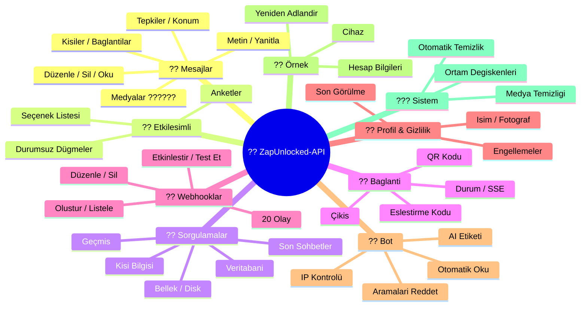
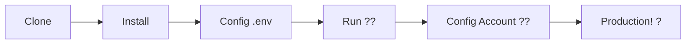

# ?? ZapUnlocked-API ???


<p align="center">
  
  
  
  
  
</p>

<table width="100%">
  <tr>
    <td align="center" valign="middle"><a href="https://github.com/kauafpssx/ZapUnlocked-API/blob/main/README.md"></a></td>
    <td align="center" valign="middle"><a href="https://github.com/kauafpssx/ZapUnlocked-API/blob/main/docs/translations/en.md"></a></td>
    <td align="center" valign="middle"><a href="https://github.com/kauafpssx/ZapUnlocked-API/blob/main/docs/translations/es.md"></a></td>
    <td align="center" valign="middle"><a href="https://github.com/kauafpssx/ZapUnlocked-API/blob/main/docs/translations/fr.md"></a></td>
    <td align="center" valign="middle"><a href="https://github.com/kauafpssx/ZapUnlocked-API/blob/main/docs/translations/de.md"></a></td>
    <td align="center" valign="middle"><a href="https://github.com/kauafpssx/ZapUnlocked-API/blob/main/docs/translations/zh.md"></a></td>
    <td align="center" valign="middle"><a href="https://github.com/kauafpssx/ZapUnlocked-API/blob/main/docs/translations/ja.md"></a></td>
    <td align="center" valign="middle"><a href="https://github.com/kauafpssx/ZapUnlocked-API/blob/main/docs/translations/ru.md"></a></td>
    <td align="center" valign="middle"><a href="https://github.com/kauafpssx/ZapUnlocked-API/blob/main/docs/translations/it.md"></a></td>
    <td align="center" valign="middle"><a href="https://github.com/kauafpssx/ZapUnlocked-API/blob/main/docs/translations/ar.md"></a></td>
    <td align="center" valign="middle"><a href="https://github.com/kauafpssx/ZapUnlocked-API/blob/main/docs/translations/ko.md"></a></td>
    <td align="center" valign="middle"><a href="https://github.com/kauafpssx/ZapUnlocked-API/blob/main/docs/translations/hi.md"></a></td>
    <td align="center" valign="middle"><a href="https://github.com/kauafpssx/ZapUnlocked-API/blob/main/docs/translations/nl.md"></a></td>
  </tr>
</table>

---

##  ZapUnlocked-API Nedir?

WhatsApp API pazari aylik aboneliklerle fahis ücretler aliyor: ayda onlarca ila yüzlerce dolar, kullanim limitleri, konusma basina ücretler ve üçüncü taraf sunucularindan geçen veriler. **ZapUnlocked-API bunu degistirmek için var.**

**Python** ile **[Neonize](https://github.com/krypton-byte/neonize)** baglanti motoru olarak insa edilen bu API, oturumlari yönetmek, karmasik medyalar göndermek ve akilli etkilesimler olusturmak için basit bir REST arayüzü (FastAPI) sunar. **Agir veritabani yok, aylik ücret yok, kimseye bagimlilik yok.**

Teklifimiz **teknik mükemmellik** ve **gelistirici bagimsizligi** üzerine kuruludur. Güçlü araçlarin, kendi çözümlerini insa edenler için erisilebilir olmasi gerektigine inaniyoruz.

> [!TIP]
> Bot entegrasyonu, bildirimler ve otomatik hizmet sistemlerinde çeviklik arayan gelistiriciler için mükemmel. **Bunun için hiçbir sey ödemeden.**

---

## ??? API Genel Görünümü



---

## ? Öne Çikan Özellikler

| Özellik | Açiklama |
| :------ | :-------- |
| ?? **Durumsuz Dügmeler** | Sifreli webhooklar ile veritabani olmadan etkilesimli akislar olusturun |
| ?? **QR Kodu Olmadan Eslestirme** | Sayisal kod ile baglanin · GUI'siz sunucular için ideal |
| ?? **Otomatik Ses Dönüsümü** | Sesleri dogal olarak anlik kaydedilmis (PTT) gibi gönderin |
| ?? **Akilli Medya Kuyrugu** | Asiri bellek tüketimini önlemek için otomatik yönetim |
| ??? **Dinamik Yer Tutucular** | Mesajlari ve webhooklari `{{name}}`, `{{day}}`, `{{phone}}` ile özellestirin |

> [!NOTE]
> Tüm özellikler **%100 ücretsizdir** ve açik kaynak toplulugu tarafindan sürdürülmektedir.

---

## ?? API Rotalari

<details>
<summary><b>?? Mesaj Gönderme</b> · 13 uç nokta</summary>

| Metot | Rota | Açiklama |
| :---- | :--- | :------- |
| `POST` | `/send` | Metin mesaji gönderme / yanitlama |
| `POST` | `/send_image` | Resim gönderme |
| `POST` | `/send_video` | Video gönderme (GIF ve PTV destekler) |
| `POST` | `/send_audio` | Ses gönderme (PTT'ye otomatik dönüsüm) |
| `POST` | `/send_document` | Belge gönderme |
| `POST` | `/send_sticker` | Çikartma gönderme |
| `POST` | `/send_reaction` | Emoji ile tepki gönderme |
| `POST` | `/send_location` | Konum gönderme |
| `POST` | `/send_contact` | Kisi gönderme |
| `POST` | `/send_contacts` | Birden çok kisi gönderme |
| `POST` | `/send_link` | Önizlemeli baglanti gönderme |
| `POST` | `/messages/delete` | Mesaji silme |
| `POST` | `/messages/read` | Okundu olarak isaretleme |
| `POST` | `/messages/edit` | Gönderilen mesaji düzenleme |
</details>

<details>
<summary><b>?? Etkilesimli Mesajlar</b> · 4 uç nokta</summary>

| Metot | Rota | Açiklama |
| :---- | :--- | :------- |
| `POST` | `/send_wbuttons` | Dügme gönderme (liste, eylem, OTP, PIX) |
| `POST` | `/messages/send-option-list` | Seçenek listesi gönderme |
| `POST` | `/messages/send-poll` | Anket gönderme |
| `POST` | `/messages/send-poll-vote` | Ankete oy verme |
</details>

<details>
<summary><b>?? Sorgulamalar ve Yönetim</b> · 7 uç nokta</summary>

| Metot | Rota | Açiklama |
| :---- | :--- | :------- |
| `POST` | `/contacts/info` | Kisi detayli bilgileri |
| `POST` | `/management/fetch_messages` | Mesaj geçmisini getirme |
| `POST` | `/management/recent_contacts` | Son sohbetleri listeleme |
| `GET` | `/management/memory` | Bellek kullanim durumu |
| `GET` | `/management/volume_stats` | Disk kullanimini kontrol etme |
| `GET` | `/management/database/status` | Veritabani durumu ve istatistikleri |
| `POST` | `/management/database/cleanup` | Veritabani manuel temizligi |
</details>

<details>
<summary><b>?? Baglanti ve Oturum</b> · 8 uç nokta</summary>

| Metot | Rota | Açiklama |
| :---- | :--- | :------- |
| `GET` | `/` | Karsilama sayfasi (HTML) |
| `GET` | `/status` | Baglanti ve oturum durumu |
| `GET` | `/status/stream` | Gerçek zamanli durum (SSE) |
| `GET` | `/qr` | Etkilesimli QR Kodu görüntüleme |
| `GET` | `/qr/image` | QR Kodu resmi alma (Base64) |
| `POST` | `/qr/pair` | Sayisal eslestirme kodu olusturma |
| `GET` | `/settings/phone-code/{phone}` | Numara ile kod olusturma |
| `POST` | `/qr/logout` | Baglantiyi kesme ve oturumu sifirlama |
</details>

<details>
<summary><b>?? Webhooklar (CRUD)</b> · 7 uç nokta</summary>

| Metot | Rota | Açiklama |
| :---- | :--- | :------- |
| `POST` | `/webhooks` | Adlandirilmis webhook olusturma |
| `GET` | `/webhooks` | Tüm webhooklari listeleme |
| `PUT` | `/webhooks/{name}` | Webhook düzenleme |
| `DELETE` | `/webhooks/{name}` | Webhook kaldirma |
| `POST` | `/webhooks/{name}/toggle` | Etkinlestirme / devre disi birakma |
| `POST` | `/webhooks/{name}/test` | Webhook test etme |
| `GET` | `/webhooks/events` | Olay türlerini listeleme (20 tür) |
</details>

<details>
<summary><b>?? Profil ve Gizlilik</b> · 3 uç nokta</summary>

| Metot | Rota | Açiklama |
| :---- | :--- | :------- |
| `POST` | `/settings/profile` | Bot adini ve fotografini degistirme |
| `POST` | `/settings/privacy` | Gizlilik ayarlari (son görülme vb.) |
| `POST` | `/settings/block` | Kisiyi engelleme / engeli kaldirma |
</details>

<details>
<summary><b>?? Bot Ayarlari</b> · 5 uç nokta</summary>

| Metot | Rota | Açiklama |
| :---- | :--- | :------- |
| `GET` | `/settings/bot` | Bot ayarlarini görüntüleme |
| `POST` | `/settings/bot` | Ayarlari güncelleme (AI etiketi, IP kontrolü) |
| `PUT` | `/settings/instance/call-reject-auto` | Aramalari otomatik reddetme |
| `PUT` | `/settings/instance/call-reject-message` | Reddedilen arama mesaji |
| `PUT` | `/settings/instance/auto-read-message` | Mesajlari otomatik okuma |
</details>

<details>
<summary><b>?? Örnek</b> · 3 uç nokta</summary>

| Metot | Rota | Açiklama |
| :---- | :--- | :------- |
| `GET` | `/instance/me` | Bagli hesap verileri |
| `GET` | `/instance/device` | Cihaz teknik verileri |
| `PUT` | `/instance/update-name` | Örnegi yeniden adlandirma |
</details>

<details>
<summary><b>??? Sistem</b> · 5 uç nokta</summary>

| Metot | Rota | Açiklama |
| :---- | :--- | :------- |
| `GET` | `/system/env` | Ortam degiskenlerini görüntüleme |
| `PUT` | `/system/env` | Ortam degiskenlerini güncelleme |
| `POST` | `/system/cleanup/force` | Geçici medyayi zorla temizleme |
| `GET` | `/system/cleanup/settings` | Otomatik temizlik ayarlarini görüntüleme |
| `PUT` | `/system/cleanup/settings` | Otomatik temizlik araligini güncelleme |
</details>

> **Toplam: 56 uç nokta** · WhatsApp otomasyonu için eksiksiz REST.

---

## ??? Kurulum ve Barindirma

> Profesyonel WhatsApp API'nizi **ZapUnlocked-API** ile **5 dakikadan kisa sürede** çalisir hale getirin.

### ?? Yerel Kurulum

Gelistirme, test veya kendi sunucunuzda çalistirmak için idealdir.



**1. Depoyu Klonlayin**

```bash
git clone https://github.com/kauafpssx/ZapUnlocked-API.git
cd ZapUnlocked-API
```

**2. Bagimliliklari Yükleyin**

| Sistem | Komut |
| :----- | :---- |
| ?? Windows | `scripts\install\install.bat` |
| ?? Linux / macOS | `bash scripts/install/install.sh` |

**3. Ortami Yapilandirin**

| Sistem | Komut |
| :----- | :---- |
| ?? Windows | `scripts\generate-env\generate-env.bat` |
| ?? Linux / macOS | `bash scripts/generate-env/generate-env.sh` |

| Degisken | Açiklama |
| :------- | :------- |
| `API_KEY` | Tüm uç noktalarda kimlik dogrulama için sifre |
| `INTERNAL_SECRET` | Webhook imzalarini dogrulama tokeni |
| `PORT` | API portu (varsayilan: `8300`) |

**4. API'yi Çalistirin**

| Sistem | Komut |
| :----- | :---- |
| ?? Windows | `scripts\run\run.bat` |
| ?? Linux / macOS | `bash scripts/run/run.sh` |

---

### ?? Barindirma: Alwaysdata (24/7 Ücretsiz)

**Alwaysdata**, API'yi sunucunuzu açik tutmaniza gerek kalmadan istikrarli ve ücretsiz bir sekilde barindirmak için önerilen seçenektir.

#### ?? Ücretsiz Plan Özellikleri

| Özellik | Ücretsizde Mevcut |
| :------ | :---------------- |
| ?? Depolama | **1 GB SSD** |
| ?? RAM | **256 MB** |
| ? CPU | **1/4 vCPU** |
| ?? Yedekleme | **3 gün** otomatik |
| ?? Çalisma Süresi | Hizmetler ile **24/7** |

#### ?? Dagitim Adimlari

**1.** [Alwaysdata.com](https://www.alwaysdata.com/) adresinde hesap olusturun · **Ücretsiz** plan.

**2.** SSH üzerinden `https://ssh-[kullanici].alwaysdata.net` adresine erisin.

**3.** Klonlayin ve yükleyin:

```bash
git clone https://github.com/kauafpssx/ZapUnlocked-API.git ~/ZapUnlocked-API
cd ~/ZapUnlocked-API
bash scripts/install/install.sh
```

**4.** `.env` dosyasini olusturun:

```bash
bash scripts/generate-env/generate-env.sh
```

**5.** Hizmeti (24/7) **Advanced · Services · Add a service** bölümünde yapilandirin:

| Alan | Deger |
| :--- | :---- |
| **Name** | `ZapUnlocked-API` |
| **Command** | `python3 main.py` |
| **Working directory** | `ZapUnlocked-API` |
| **Environment variables** | `PORT=8300` |

**6.** Suradan erisin:

```
http://services-[kullanici].alwaysdata.net:8300/
```

> [!TIP]
> URL harici olarak zaten erisilebilir. *(Istege bagli)* Özel bir alan adi kullanmak için **Web · Sites · Add a site** altinda `http://[kullanici].alwaysdata.net` adresine yönlendiren bir **Ters Vekil (Reverse Proxy)** yapilandirin.

---

## ?? Kimlik Dogrulama (Giris)

Dagitimdan sonra, tarayicidan asagidakine eriserek WhatsApp hesabinizi baglayin:

```text
http://services-[kullanici].alwaysdata.net:8300/qr?API_KEY=SIRF_SIFRENIZ
```

---

## ?? Resmi Dokümantasyon

<p align="center">
  ?? <a href="https://zapunlocked-api.kauafpss.com.br"><strong>zapunlocked-api.kauafpss.com.br</strong></a>
</p>

Detayli teknik dokümantasyon, kod örnekleri ve etkilesimli oyun alani için resmi web sitemizi ziyaret edin.

> [!TIP]
> **LLMs.txt** dosyasini yapay zeka dizini olarak kullanin: [`zapunlocked-api.kauafpss.com.br/llms.txt`](https://zapunlocked-api.kauafpss.com.br/llms.txt). Kesfetmeden önce tüm sayfalari kesfedin.

---

## ?? Katkida Bulunanlar ve Tesekkürler

| Proje | Açiklama |
| :---- | :------- |
| [](https://github.com/krypton-byte/neonize) | WhatsApp Web ile yerel baglanti için Python kütüphanesi |
| [](https://github.com/tulir/whatsmeow) | Neonize'nin temelini olusturan Go kütüphanesi · baglantinin kalbi |
| [](https://www.alwaysdata.com/) | Yüksek kaliteli ücretsiz altyapi |

---

## ?? Lisans

Bu proje **MIT Lisansi** altinda lisanslanmistir.

<p align="center">
  <a href="https://www.instagram.com/kauafpss_/">Kauã Ferreira</a> ?? tarafindan yapildi
</p>

