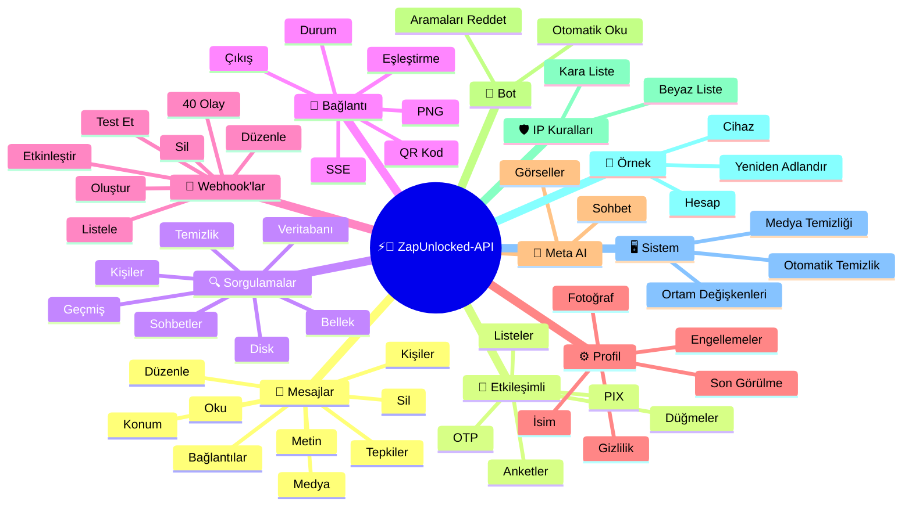
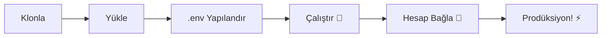

# ⚡💬 [ZapUnlocked-API](https://zapunlocked-api.kauafpss.com.br/)


<p align="center">
  
  <a href="https://downgit.github.io/#/home?url=https://github.com/kauafpssx/ZapUnlocked-API/blob/main/ZapUnlocked.collection.json">
    
  </a>
  
  
  
</p>

---

### 🌐 Dil Seçin:

<table width="100%">
  <tr>
    <td align="center" valign="middle"><a href="https://github.com/kauafpssx/ZapUnlocked-API/blob/main/README.md"></a></td>
    <td align="center" valign="middle"><a href="https://github.com/kauafpssx/ZapUnlocked-API/blob/main/docs/translations/en.md"></a></td>
    <td align="center" valign="middle"><a href="https://github.com/kauafpssx/ZapUnlocked-API/blob/main/docs/translations/es.md"></a></td>
    <td align="center" valign="middle"><a href="https://github.com/kauafpssx/ZapUnlocked-API/blob/main/docs/translations/fr.md"></a></td>
    <td align="center" valign="middle"><a href="https://github.com/kauafpssx/ZapUnlocked-API/blob/main/docs/translations/de.md"></a></td>
    <td align="center" valign="middle"><a href="https://github.com/kauafpssx/ZapUnlocked-API/blob/main/docs/translations/zh.md"></a></td>
    <td align="center" valign="middle"><a href="https://github.com/kauafpssx/ZapUnlocked-API/blob/main/docs/translations/ja.md"></a></td>
    <td align="center" valign="middle"><a href="https://github.com/kauafpssx/ZapUnlocked-API/blob/main/docs/translations/ru.md"></a></td>
    <td align="center" valign="middle"><a href="https://github.com/kauafpssx/ZapUnlocked-API/blob/main/docs/translations/it.md"></a></td>
    <td align="center" valign="middle"><a href="https://github.com/kauafpssx/ZapUnlocked-API/blob/main/docs/translations/ar.md"></a></td>
    <td align="center" valign="middle"><a href="https://github.com/kauafpssx/ZapUnlocked-API/blob/main/docs/translations/tr.md"></a></td>
    <td align="center" valign="middle"><a href="https://github.com/kauafpssx/ZapUnlocked-API/blob/main/docs/translations/ko.md"></a></td>
    <td align="center" valign="middle"><a href="https://github.com/kauafpssx/ZapUnlocked-API/blob/main/docs/translations/hi.md"></a></td>
    <td align="center" valign="middle"><a href="https://github.com/kauafpssx/ZapUnlocked-API/blob/main/docs/translations/nl.md"></a></td>
  </tr>
</table>

---

##  ZapUnlocked-API Nedir?

WhatsApp API pazarı aylık aboneliklerle onlarca ila yüzlerce dolar talep eder. Kullanım sınırları, konuşma başına ücretler ve üçüncü taraf sunucular vardır. **ZapUnlocked-API ücretsiz ve açık kaynaktır.**

**Python** ve **[Neonize](https://github.com/krypton-byte/neonize)** ile inşa edilen bu API, oturumları yönetmek, medya göndermek ve bot oluşturmak için FastAPI kullanır. Ağır veritabanı yok, aylık ücret yok, üçüncü taraf sunucu yok.

> [!TIP]
> Bot, bildirim ve müşteri hizmet sistemleri için kullanın. **100% ücretsiz.**

> [!IMPORTANT]
> 🤖 **Meta AI entegre.** Sohbet için `/ai/ask`, WhatsApp içinde görsel oluşturmak için `/ai/imagine` kullanın. [Rotayı gör](#-meta-ai--2-endpoints).

---

## 🗺️ API Genel Bakış



---

## ✨ Öne Çıkan Özellikler

| Özellik | Açıklama |
| :------ | :------- |
| 🧩 **Durumsuz Düğmeler** | Şifrelenmiş webhook'lar ile veritabanı olmadan etkileşimli akışlar oluşturun |
| 🔢 **QR Kodsuz Eşleştirme** | Sayısal kod ile bağlanın · GUI'siz sunucular için ideal |
| 🎵 **Otomatik Ses Dönüşümü** | Sesi doğal olarak "şimdi kaydedildi" (PTT) olarak görünecek şekilde gönderin |
| 📦 **Akıllı Medya Kuyruğu** | Aşırı bellek tüketimini önlemek için otomatik yönetim |
| 🏷️ **Dinamik Yer Tutucular** | Mesajları ve webhook'ları `{{name}}`, `{{day}}`, `{{phone}}` ile kişiselleştirin |
| 🤖 **Meta AI** | WhatsApp içinde AI ile sohbet edin ve görsel oluşturun. |
| ⌨️ **Evrensel Parametreler** | `delay_message`, `delay_typing`, `reply`/`quoted_id` ve `@bahsetmeler` **tüm** gönderim uç noktalarında çalışır. |
| 🔐 **İmzalı Webhook'lar** | HMAC-SHA256 ile bütünlük. Webhook'unuz yalnızca meşru verileri kabul eder. |
| 🔄 **Otomatik Yeniden Bağlanma** | Bağlantı kesintisi, uzaktan çıkış veya akış hatasında otomatik olarak yeniden bağlanır. |
| 📁 **Dosya Yükleme + URL** | Doğrudan yükleme **veya** genel URL ile medya gönderin. |

> [!NOTE]
> Tüm özellikler **%100 ücretsizdir** ve açık kaynak topluluğu sürdürmektedir.

---

## 📋 API Rotaları

<details>
<summary><b>📨 Mesaj Gönderimi</b> · 15 uç nokta</summary>

| Metot | Rota | Açıklama | Body |
| :---- | :--- | :------- | :--- |
| `POST` | `/send` | Metin mesajı gönder / yanıtla | `phone`, `message` |
| `POST` | `/send_image` | Resim gönder | `phone`, `image_url` |
| `POST` | `/send_video` | Video gönder (GIF ve PTV destekler) | `phone`, `video_url` |
| `POST` | `/send_gif` | Animasyonlu GIF gönder | `phone`, `url` |
| `POST` | `/send_audio` | Ses gönder (otomatik PTT dönüşümü ile) | `phone`, `audio_url` |
| `POST` | `/send_document` | Belge gönder | `phone`, `document_url` |
| `POST` | `/send_sticker` | Çıkartma gönder | `phone`, `sticker_url` |
| `POST` | `/send_reaction` | Emoji ile tepki gönder | `phone`, `messageId`, `emoji` |
| `POST` | `/send_location` | Konum gönder | `phone`, `lat`, `lng` |
| `POST` | `/send_contact` | Kişi gönder | `phone`, `name`, `contactPhone` |
| `POST` | `/send_contacts` | Birden çok kişi gönder | `phone`, `contacts` |
| `POST` | `/send_link` | Önizlemeli bağlantı gönder | `phone`, `url` |
| `POST` | `/messages/delete` | Mesajı sil | `phone`, `messageId` |
| `POST` | `/messages/read` | Okundu olarak işaretle | `phone`, `messageIds` |
| `POST` | `/messages/edit` | Gönderilen mesajı düzenle | `phone`, `messageId`, `message` |

> [!TIP]
> **Evrensel parametreler.** **Her** mesaj gönderim uç noktasında (etkileşimli dahil) kullanılabilir:
>
> | Parametre | Ne yapar |
> | :-------- | :------- |
> | `delay_message` | Göndermeden önce N saniye bekler. |
> | `delay_typing` | Göndermeden önce N saniye "yazıyor..." gösterir. |
> | `reply` / `quoted_id` | Yanıtlanacak mesajın kimliği (alıntı). |
> | `mentioned` | @bahsetmek için telefon numaralarının JSON dizisi. Örnek: `["5511999999999"]` |

</details>

<details>
<summary><b>🔘 Etkileşimli Mesajlar</b> · 9 uç nokta</summary>

| Metot | Rota | Açıklama | Body |
| :---- | :--- | :------- | :--- |
| `POST` | `/messages/send-button-list` | Seçenek listesi düğmesi | `phone`, `buttons` |
| `POST` | `/messages/send-button-quick-reply` | Hızlı yanıt düğmesi | `phone`, `title`, `buttons` |
| `POST` | `/messages/send-button-otp` | Kopyalama düğmesi (OTP) | `phone`, `code` |
| `POST` | `/messages/send-button-pix` | PIX düğmesi | `phone`, `pixKey` |
| `POST` | `/messages/send-button-url` | Bağlantılı düğme | `phone`, `title`, `url` |
| `POST` | `/messages/send-button-call` | Arama düğmesi | `phone`, `title`, `phoneNumber` |
| `POST` | `/messages/send-option-list` | ⛔ **Geçici olarak devre dışı** (iPhone, Android ve Web ile uyumsuz) | `phone`, `buttons` |
| `POST` | `/messages/send-poll` | Anket gönder | `phone`, `name`, `options` |
| `POST` | `/messages/send-poll-vote` | Ankete oy ver | `phone`, `options` |
</details>

<details>
<summary><b>🔍 Sorgulamalar ve Yönetim</b> · 12 uç nokta</summary>

| Metot | Rota | Açıklama | Body |
| :---- | :--- | :------- | :--- |
| `POST` | `/management/fetch_messages` | Mesaj geçmişini getir | `phone` |
| `POST` | `/management/recent_contacts` | Son sohbetleri listele | ❌ |
| `GET` | `/management/chats` | Geçmişli sohbetleri listele | ❌ |
| `GET` | `/management/chats/{phone}/messages` | Belirli bir sohbetin mesajları | ❌ |
| `GET` | `/management/contacts/{phone}` | Kişi detaylı bilgisi | ❌ |
| `GET` | `/management/groups` | Grupları listele | ❌ |
| `DELETE` | `/management/cleanup` | Sohbet verilerini temizle | ❌ |
| `GET` | `/management/export` | Yapılandırmayı dışa aktar (webhook'lar, ayarlar, IP kuralları) | ❌ |
| `POST` | `/management/import` | Dosya yükleme ile yapılandırmayı içe aktar | `file` |
| `GET` | `/management/database/status` | Veritabanı durumu ve istatistikleri | ❌ |
| `POST` | `/management/database/config` | Veritabanı ayarlarını güncelle | `interval` |
| `POST` | `/management/database/cleanup` | Manuel veritabanı temizliği | ❌ |
</details>

<details>
<summary><b>👤 Kişiler</b> · 1 uç nokta</summary>

| Metot | Rota | Açıklama | Body |
| :---- | :--- | :------- | :--- |
| `POST` | `/contacts/info` | Detaylı kişi bilgileri | `phone` |
</details>

<details>
<summary><b>🏠 Genel / Durum</b> · 9 uç nokta</summary>

| Metot | Rota | Açıklama | Body |
| :---- | :--- | :------- | :--- |
| `GET` | `/` | Karşılama sayfası (HTML) | ❌ |
| `GET` | `/status` | Tam durum (WhatsApp, CPU, bellek, disk) | ❌ |
| `GET` | `/status/stream` | SSE ile gerçek zamanlı durum | ❌ |
| `GET` | `/status/health` | Basit health check (`{"ok":true}`) | ❌ |
| `GET` | `/status/readiness` | Readiness check (WhatsApp bağlı değilse 503) | ❌ |
| `GET` | `/status/memory` | Bellek durumu (işlem + sistem) | ❌ |
| `GET` | `/status/volume` | Disk durumu (boyut, dosyalar) | ❌ |
| `GET` | `/collection.json` | Postman Collection indir | ❌ |
| `POST` | `/collection.json` | Postman Collection güncelle | JSON body |
</details>

<details>
<summary><b>🔗 Bağlantı (QR)</b> · 2 uç nokta</summary>

| Metot | Rota | Açıklama | Body |
| :---- | :--- | :------- | :--- |
| `GET` | `/qr` | Etkileşimli QR Kodu görüntüle (HTML) | ❌ |
| `GET` | `/qr/image` | QR Kod resmini al (PNG) | ❌ |
</details>

<details>
<summary><b>🔐 Oturum</b> · 2 uç nokta</summary>

| Metot | Rota | Açıklama | Body |
| :---- | :--- | :------- | :--- |
| `POST` | `/session/pair` | Sayısal eşleştirme kodu oluştur | `phone` |
| `POST` | `/session/logout` | Bağlantıyı kes ve oturumu sıfırla | ❌ |
</details>

<details>
<summary><b>📡 Webhook'lar (CRUD)</b> · 8 uç nokta</summary>

| Metot | Rota | Açıklama | Body |
| :---- | :--- | :------- | :--- |
| `POST` | `/webhooks` | Adlandırılmış webhook oluştur | `name`, `url` |
| `GET` | `/webhooks` | Tüm webhook'ları listele | ❌ |
| `GET` | `/webhooks/{name}` | İsme göre webhook al | ❌ |
| `PUT` | `/webhooks/{name}` | Webhook'u düzenle | ❌ |
| `DELETE` | `/webhooks/{name}` | Webhook'u kaldır | ❌ |
| `POST` | `/webhooks/{name}/toggle` | Etkinleştir / devre dışı bırak | `active` |
| `POST` | `/webhooks/{name}/test` | Webhook'u test et | ❌ |
| `GET` | `/webhooks/events` | Olay türlerini listele (40 tür) | ❌ |
</details>

<details>
<summary><b>⚙️ Profil ve Gizlilik</b> · 13 uç nokta</summary>

| Metot | Rota | Açıklama | Body |
| :---- | :--- | :------- | :--- |
| `POST` | `/settings/profile` | Bot adını ve fotoğrafını değiştir | `name?`, `photo?` (Form) |
| `POST` | `/settings/block` | Kişiyi engelle / engeli kaldır | `phone`, `action` |
| `PUT` | `/settings/privacy/last-seen` | Son görülme | `value` |
| `PUT` | `/settings/privacy/online` | Çevrimiçi durumu | `value` |
| `PUT` | `/settings/privacy/profile` | Fotoğraf görünürlüğü | `value` |
| `PUT` | `/settings/privacy/status` | Durum görünürlüğü | `value` |
| `PUT` | `/settings/privacy/read-receipts` | Okundu bilgisi | `value` |
| `PUT` | `/settings/privacy/groups-add` | Gruba kimler ekleyebilir | `value` |
| `PUT` | `/settings/privacy/call-add` | Aramaya kimler ekleyebilir | `value` |
| `PUT` | `/settings/privacy/about` | Hakkında / mesaj | `value?` |
| `PUT` | `/settings/privacy/disappearing-timer` | Geçici mesaj zamanlayıcısı | `value?` |
| `GET` | `/settings/ip-control` | IP kontrol durumunu gör | ❌ |
| `PUT` | `/settings/ip-control` | IP kontrolü etkinleştir/devre dışı bırak | `enabled` |
</details>

<details>
<summary><b>🤖 Bot Ayarları</b> · 4 uç nokta</summary>

| Metot | Rota | Açıklama | Body |
| :---- | :--- | :------- | :--- |
| `PUT` | `/settings/instance/call-reject-auto` | Aramaları otomatik reddet | `value` |
| `PUT` | `/settings/instance/call-reject-message` | Reddedilen arama mesajı | `value` |
| `PUT` | `/settings/instance/auto-read-message` | Otomatik mesaj okuma | `value` |
| `GET` | `/settings/phone-code/{phone}` | Numara ile eşleştirme kodu oluştur | ❌ |
</details>

<details>
<summary><b>📱 Örnek</b> · 3 uç nokta</summary>

| Metot | Rota | Açıklama | Body |
| :---- | :--- | :------- | :--- |
| `GET` | `/instance/me` | Bağlı hesap verileri | ❌ |
| `GET` | `/instance/device` | Cihaz teknik verileri | ❌ |
| `PUT` | `/instance/update-name` | Örneği yeniden adlandır | `name` |
</details>

<details>
<summary><b>🛡️ IP Kuralları</b> · 5 uç nokta</summary>

| Metot | Rota | Açıklama | Body |
| :---- | :--- | :------- | :--- |
| `GET` | `/settings/ip-rules` | IP kurallarını listele (beyaz/kara liste) | ❌ |
| `POST` | `/settings/ip-rules/whitelist` | IP'yi beyaz listeye ekle | `ip` |
| `POST` | `/settings/ip-rules/blacklist` | IP'yi kara listeye ekle | `ip` |
| `DELETE` | `/settings/ip-rules/whitelist/{ip}` | IP'yi beyaz listeden kaldır | ❌ |
| `DELETE` | `/settings/ip-rules/blacklist/{ip}` | IP'yi kara listeden kaldır | ❌ |
</details>

<details>
<summary><b>🖥️ Sistem</b> · 5 uç nokta</summary>

| Metot | Rota | Açıklama | Body |
| :---- | :--- | :------- | :--- |
| `GET` | `/system/env` | Ortam değişkenlerini görüntüle | ❌ |
| `PUT` | `/system/env` | Ortam değişkenlerini güncelle | ❌ |
| `POST` | `/system/cleanup/force` | Zorunlu geçici medya temizliği | ❌ |
| `GET` | `/system/cleanup/settings` | Otomatik temizlik ayarlarını görüntüle | ❌ |
| `PUT` | `/system/cleanup/settings` | Otomatik temizlik aralığını güncelle | ❌ |
</details>

<details>
<summary><b>📊 Loglar</b> · 3 uç nokta</summary>

| Metot | Rota | Açıklama | Body |
| :---- | :--- | :------- | :--- |
| `GET` | `/logs/files` | Log dosyalarını listele | ❌ |
| `GET` | `/logs` | Filtrelerle logları görüntüle | ❌ |
| `POST` | `/logs/cleanup` | Logları sıkıştırmaya/temizlemeye zorla | ❌ |
</details>

<details>
<summary><b>📈 İstatistikler</b> · 6 uç nokta</summary>

| Metot | Rota | Açıklama | Body |
| :---- | :--- | :------- | :--- |
| `GET` | `/stats` | İstatistikler (çalışma süresi, mesajlar, webhook'lar) | ❌ |
| `DELETE` | `/stats` | İstatistikleri sıfırla | ❌ |
| `GET` | `/stats/webhooks` | Tüm webhook'ların istatistikleri | ❌ |
| `GET` | `/stats/webhooks/{name}` | Belirli bir webhook'un istatistikleri | ❌ |
| `DELETE` | `/stats/webhooks` | Tüm webhook istatistiklerini sıfırla | ❌ |
| `DELETE` | `/stats/webhooks/{name}` | Bir webhook istatistiklerini sıfırla | ❌ |
</details>

<details>
<summary><b>🤖 Meta AI</b> · 2 uç nokta</summary>

| Metot | Rota | Açıklama | Body |
| :---- | :--- | :------- | :--- |
| `POST` | `/ai/ask` | Meta AI'ya sor | `message` |
| `POST` | `/ai/imagine` | Meta AI ile resim oluştur | `prompt` |
</details>

<details>
<summary><b>🔐 Çoklu Oturum</b> · 7 uç nokta</summary>

| Metot | Rota | Açıklama | Body |
| :---- | :--- | :------- | :--- |
| `GET` | `/sessions` | Tüm oturumları listele | ❌ |
| `POST` | `/sessions` | Yeni oturum oluştur | `name?` |
| `PUT` | `/sessions/{id}/rename` | Oturumu yeniden adlandır | `name` |
| `DELETE` | `/sessions/{id}` | Oturumu devre dışı bırak | ❌ |
| `POST` | `/sessions/{id}/connect` | Oturumu bağla | ❌ |
| `POST` | `/sessions/{id}/disconnect` | Oturum bağlantısını kes | ❌ |
| `GET` | `/sessions/{id}/status` | Oturum durumu | ❌ |
</details>

<details>
<summary><b>📡 Webhook'lar (Loglar)</b> · 3 uç nokta</summary>

| Metot | Rota | Açıklama | Body |
| :---- | :--- | :------- | :--- |
| `GET` | `/webhooks/{name}/logs` | Webhook teslim logları | ❌ |
| `DELETE` | `/webhooks/{name}/logs` | Webhook loglarını temizle | ❌ |
| `DELETE` | `/webhooks/logs/all` | Tüm webhook loglarını temizle | ❌ |
</details>

> **Toplam: 108 uç nokta**

---

## 📡 Webhook Olayları

Tüm webhook'lar standart bir zarf alır:

```json
{
  "event": "message.text",
  "timestamp": "2025-01-01T12:00:00Z",
  "data": { ... }
}
```

Webhook'un `{{placeholders}}` içeren özel bir `body`'si varsa, API standart zarf yerine bu body'yi gönderir.

---

<details>
<summary><b>🏷️ Özel body'de kullanılabilir yer tutucular</b></summary>

| Yer Tutucu | Değer |
| :--------- | :---- |
| `{{from}}` | Gönderen numarası |
| `{{text}}` | Mesaj metni |
| `{{phone}}` | `{{from}}` ile aynı |
| `{{id}}` | Mesaj ID'si |
| `{{requested}}` | İstenen miktar (fetchMessages) |
| `{{found}}` | Bulunan miktar (fetchMessages) |
| `{{timestamp}}` | Geçerli UTC zaman damgası |

</details>

---

<details>
<summary><b>📥 Alınan Mesajlar</b> · 18 olay</summary>

> **Medya alanları:** Medya olayları (`message.image`, `message.video`, `message.audio`, `message.document`, `message.sticker`), `RECEIVE_MEDIA_ENABLED=true` olduğunda ek alanlar içerir: `mediaBase64` (dosyanın base64'ü), `fileName`, `mimeType`, `mediaTooLarge` (bool. `RECEIVE_MEDIA_MAX_SIZE_MB` değerini aştığında true).

Alınan mesaj olaylarında bulunan temel alanlar:

```json
{
  "messageId": "3EB0ABCDEF123456",
  "from": "5511999999999",
  "fromName": "João Silva",
  "fromJid": "5511999999999@s.whatsapp.net",
  "isGroup": false
}
```

<details>
<summary><code>message.text</code> - Düz / biçimlendirilmiş metin</summary>

```json
{
  "event": "message.text",
  "data": {
    "...base": "...",
    "text": "Olá! Como posso ajudar?",
    "quoted": { "id": "3EB0...", "fromMe": true }
  }
}
```
</details>

<details>
<summary><code>message.image</code> - Alınan resim</summary>

```json
{
  "event": "message.image",
  "data": {
    "...base": "...",
    "caption": "Foto do produto",
    "mimetype": "image/jpeg",
    "fileLength": 204800
  }
}
```
</details>

<details>
<summary><code>message.video</code> - Alınan video</summary>

```json
{
  "event": "message.video",
  "data": {
    "...base": "...",
    "caption": "Veja esse vídeo!",
    "mimetype": "video/mp4",
    "fileLength": 5242880,
    "isPTT": false,
    "isGif": false
  }
}
```
</details>

<details>
<summary><code>message.audio</code> - Ses / sesli not</summary>

```json
{
  "event": "message.audio",
  "data": {
    "...base": "...",
    "mimetype": "audio/ogg; codecs=opus",
    "fileLength": 30720,
    "isPTT": true,
    "durationSeconds": 8
  }
}
```
</details>

<details>
<summary><code>message.document</code> - Belge / dosya</summary>

```json
{
  "event": "message.document",
  "data": {
    "...base": "...",
    "fileName": "contrato.pdf",
    "caption": "Segue o contrato",
    "mimetype": "application/pdf",
    "fileLength": 102400
  }
}
```
</details>

<details>
<summary><code>message.sticker</code> - Çıkartma</summary>

```json
{
  "event": "message.sticker",
  "data": {
    "...base": "...",
    "mimetype": "image/webp",
    "isAnimated": false
  }
}
```
</details>

<details>
<summary><code>message.contact</code> - Paylaşılan kişi</summary>

```json
{
  "event": "message.contact",
  "data": {
    "...base": "...",
    "displayName": "Maria Souza",
    "vcard": "BEGIN:VCARD\nVERSION:3.0\n..."
  }
}
```
</details>

<details>
<summary><code>message.contacts</code> - Birden çok kişi</summary>

```json
{
  "event": "message.contacts",
  "data": {
    "...base": "...",
    "displayName": "2 contacts",
    "count": 2,
    "contacts": [
      { "displayName": "Maria Souza", "vcard": "BEGIN:VCARD\n..." },
      { "displayName": "João Silva", "vcard": "BEGIN:VCARD\n..." }
    ]
  }
}
```
</details>

<details>
<summary><code>message.location</code> - Konum</summary>

```json
{
  "event": "message.location",
  "data": {
    "...base": "...",
    "lat": -23.5505,
    "lng": -46.6333,
    "name": "Av. Paulista",
    "address": "Av. Paulista, 1000 - São Paulo"
  }
}
```
</details>

<details>
<summary><code>message.reaction</code> - Tepki (emoji)</summary>

```json
{
  "event": "message.reaction",
  "data": {
    "...base": "...",
    "emoji": "❤️",
    "targetMessageId": "3EB0ABCDEF123456",
    "isRemoved": false
  }
}
```
</details>

<details>
<summary><code>message.poll_created</code> - Alınan anket</summary>

```json
{
  "event": "message.poll_created",
  "data": {
    "...base": "...",
    "pollName": "Qual o melhor sabor?",
    "options": ["Chocolate", "Morango", "Baunilha"]
  }
}
```
</details>

<details>
<summary><code>message.poll_vote</code> - Anket oyu</summary>

```json
{
  "event": "message.poll_vote",
  "data": {
    "...base": "...",
    "pollId": "3EB0ABCDEF123456",
    "selectedOptions": ["Chocolate"]
  }
}
```
</details>

<details>
<summary><code>message.button_reply</code> - Düğme tıklaması</summary>

```json
{
  "event": "message.button_reply",
  "data": {
    "...base": "...",
    "buttonId": "opcao_sim",
    "displayText": "Sim",
    "type": "quick_reply"
  }
}
```
</details>

<details>
<summary><code>message.list_reply</code> - Etkileşimli liste seçimi</summary>

```json
{
  "event": "message.list_reply",
  "data": {
    "...base": "...",
    "rowId": "1",
    "title": "X-Burguer",
    "description": "R$ 18,90"
  }
}
```
</details>

<details>
<summary><code>message.deleted</code> - Gönderen tarafından silinen mesaj</summary>

```json
{
  "event": "message.deleted",
  "data": {
    "...base": "..."
  }
}
```
</details>

<details>
<summary><code>message.unknown</code> - Eşleşmeyen tür</summary>

```json
{
  "event": "message.unknown",
  "data": {
    "...base": "...",
    "rawType": "senderKeyDistributionMessage"
  }
}
```
</details>

<details>
<summary><code>message.undecryptable</code> - Şifresi çözülemeyen mesaj</summary>

```json
{
  "event": "message.undecryptable",
  "data": {
    "...base": "..."
  }
}
```
</details>

</details>

<details>
<summary><b>📤 Gönderilen Mesajlar</b> · 22 olay</summary>

<details>
<summary><code>message.sent</code> - Gönderilen mesaj (genel)</summary>

```json
{
  "event": "message.sent",
  "data": {
    "to": "5511999999999",
    "type": "text",
    "messageId": "3EB0ABCDEF123456"
  }
}
```
</details>

<details>
<summary><code>message.sent.{type}</code> - Türüne göre spesifik olay</summary>

`message.sent` ile aynı payload, ancak spesifik olay. Tek bir gönderim türüne abone olmak içindir.

Türler: `text`, `image`, `audio`, `video`, `document`, `sticker`, `gif`, `interactive`, `list`, `poll`, `poll_vote`, `location`, `contact`, `contacts`, `link`, `reaction`, `edit`, `delete`

```json
{
  "event": "message.sent.image",
  "data": {
    "to": "5511999999999",
    "type": "image",
    "messageId": "3EB0ABCDEF123456"
  }
}
```
</details>

<details>
<summary><code>message.delivered</code> - Mesaj alıcıya teslim edildi (receipt type 1)</summary>

```json
{
  "event": "message.delivered",
  "data": {
    "from": "5511999999999",
    "messageId": "3EB0ABCDEF123456"
  }
}
```
</details>

<details>
<summary><code>message.read</code> - Mesaj alıcı tarafından okundu (receipt type 4)</summary>

```json
{
  "event": "message.read",
  "data": {
    "from": "5511999999999",
    "messageId": "3EB0ABCDEF123456"
  }
}
```
</details>

<details>
<summary><code>message.receipt</code> - Diğer teslimat onayları (receipt types 2, 3, 5+)</summary>

```json
{
  "event": "message.receipt",
  "data": {
    "from": "5511999999999",
    "messageId": "3EB0ABCDEF123456",
    "receiptType": 2
  }
}
```
</details>

</details>

<details>
<summary><b>🔗 Bağlantı</b> · 11 olay</summary>

<details>
<summary><code>connection.connected</code> - WhatsApp bağlandı</summary>

```json
{
  "event": "connection.connected",
  "data": {
    "phone": "5511999999999"
  }
}
```
</details>

<details>
<summary><code>connection.disconnected</code> - WhatsApp bağlantısı kesildi</summary>

```json
{
  "event": "connection.disconnected",
  "data": {}
}
```
</details>

<details>
<summary><code>connection.qr_ready</code> - QR Kodu oluşturuldu</summary>

```json
{
  "event": "connection.qr_ready",
  "data": {
    "qr": "2@abc123..."
  }
}
```
</details>

<details>
<summary><code>connection.pair_code</code> - Eşleştirme kodu oluşturuldu</summary>

```json
{
  "event": "connection.pair_code",
  "data": {
    "code": "ABCD-1234",
    "connected": false
  }
}
```

`connected: true` eşleştirme tamamlandığında.
</details>

<details>
<summary><code>connection.pair_status</code> - Eşleştirme durumu</summary>

```json
{
  "event": "connection.pair_status",
  "data": {
    "jid": "5511999999999@s.whatsapp.net",
    "businessName": "My Business",
    "platform": "WEB",
    "status": "OK",
    "error": ""
  }
}
```
</details>

<details>
<summary><code>connection.logged_out</code> - Oturum uzaktan sonlandırıldı</summary>

```json
{
  "event": "connection.logged_out",
  "data": {
    "reason": "User logout"
  }
}
```
</details>

<details>
<summary><code>connection.connect_failure</code> - Bağlantı hatası</summary>

```json
{
  "event": "connection.connect_failure",
  "data": {
    "reason": "ERROR_CONNECT",
    "message": "Connection timed out"
  }
}
```
</details>

<details>
<summary><code>connection.stream_error</code> - Stream hatası</summary>

```json
{
  "event": "connection.stream_error",
  "data": {
    "code": "STREAM_ERR"
  }
}
```
</details>

<details>
<summary><code>connection.temporary_ban</code> - Geçici yasaklama</summary>

```json
{
  "event": "connection.temporary_ban",
  "data": {
    "code": "BAN_CODE",
    "expire": 1704153600
  }
}
```
</details>

<details>
<summary><code>connection.client_outdated</code> - İstemci güncel değil</summary>

```json
{
  "event": "connection.client_outdated",
  "data": {}
}
```
</details>

<details>
<summary><code>connection.stream_replaced</code> - Stream değiştirildi</summary>

```json
{
  "event": "connection.stream_replaced",
  "data": {}
}
```
</details>

</details>

<details>
<summary><b>👥 Grup</b> · 2 olay</summary>

<details>
<summary><code>group.join</code> - Bot gruba katıldı</summary>

```json
{
  "event": "group.join",
  "data": {
    "groupId": "123456789@g.us",
    "groupName": "My Group",
    "reason": "invite",
    "type": ""
  }
}
```
</details>

<details>
<summary><code>group.update</code> - Grup güncellendi</summary>

```json
{
  "event": "group.update",
  "data": {
    "groupId": "123456789@g.us",
    "sender": "5511999999999@s.whatsapp.net",
    "name": "New Group Name",
    "topic": "New description",
    "locked": false,
    "announce": false,
    "ephemeral": 604800,
    "delete": false,
    "link": null,
    "unlink": null,
    "newInviteLink": "https://chat.whatsapp.com/abc123"
  }
}
```
</details>

</details>

<details>
<summary><b>👤 Kişi / Varlık</b> · 4 olay</summary>

<details>
<summary><code>contact.presence</code> - Kişi varlık durumu</summary>

```json
{
  "event": "contact.presence",
  "data": {
    "from": "5511999999999",
    "fromJid": "5511999999999@s.whatsapp.net",
    "status": "online",
    "lastSeen": 0
  }
}
```

`status`: `"online"` veya `"offline"`.
</details>

<details>
<summary><code>contact.chat_presence</code> - Yazma durumu</summary>

```json
{
  "event": "contact.chat_presence",
  "data": {
    "from": "5511999999999",
    "fromJid": "5511999999999@s.whatsapp.net",
    "state": "typing",
    "media": null
  }
}
```

`state`: `"typing"`, `"recording"` veya `"paused"`.
</details>

<details>
<summary><code>contact.picture_change</code> - Profil fotoğrafı değişti</summary>

```json
{
  "event": "contact.picture_change",
  "data": {
    "from": "5511999999999",
    "fromJid": "5511999999999@s.whatsapp.net",
    "author": "5511999999999@s.whatsapp.net",
    "action": "changed"
  }
}
```

`action`: `"changed"` veya `"removed"`.
</details>

<details>
<summary><code>contact.identity_change</code> - Güvenlik anahtarı değişti</summary>

```json
{
  "event": "contact.identity_change",
  "data": {
    "from": "5511999999999",
    "fromJid": "5511999999999@s.whatsapp.net",
    "implicit": false,
    "timestamp": 1704067200
  }
}
```
</details>

</details>

<details>
<summary><b>📞 Arama</b> · 3 olay</summary>

<details>
<summary><code>call.received</code> - Gelen arama</summary>

```json
{
  "event": "call.received",
  "data": {
    "from": "5511999999999",
    "fromJid": "5511999999999@s.whatsapp.net",
    "callId": "ABC123DEF456"
  }
}
```
</details>

<details>
<summary><code>call.accepted</code> - Arama kabul edildi</summary>

```json
{
  "event": "call.accepted",
  "data": {
    "from": "5511999999999",
    "callId": "ABC123DEF456"
  }
}
```
</details>

<details>
<summary><code>call.terminated</code> - Arama sonlandırıldı</summary>

```json
{
  "event": "call.terminated",
  "data": {
    "from": "5511999999999",
    "callId": "ABC123DEF456",
    "reason": "timeout"
  }
}
```
</details>

</details>

<details>
<summary><b>🧹 Medya Temizliği</b> · 1 olay</summary>

<details>
<summary><code>media.cleanup.completed</code> - Otomatik medya temizliği yapıldı</summary>

```json
{
  "event": "media.cleanup.completed",
  "data": {
    "filesRemoved": 12,
    "remainingBytes": 52428800
  }
}
```

Her saat çalışır. Hiçbir şey kaldırılmadığında `filesRemoved: 0`.
</details>

</details>

<details>
<summary><b>🤖 AI</b> · 1 olay</summary>

<details>
<summary><code>ai.response</code> - Meta AI yanıtı alındı</summary>

```json
{
  "event": "ai.response",
  "data": {
    "text": "Brasília!",
    "hasImage": false,
    "imageBase64": null,
    "imageUrl": null,
    "mimeType": null,
    "messageId": "3EB0ABCDEF123456"
  }
}
```

Meta AI yanıt verdiğinde tetiklenir. Asenkron yanıtlar için kullanın (`POST /ai/ask` 30s zaman aşımına sahiptir).
</details>

</details>

---

## 🛠️ Kurulum ve Barındırma

> **ZapUnlocked-API** ile WhatsApp API'nizi **5 dakikadan kısa sürede** çalışır hale getirin.

### 💻 Yerel Kurulum

Geliştirme, test veya kendi sunucunuzda çalıştırmak içindir.



**1. Depoyu Klonlayın**

```bash
git clone https://github.com/kauafpssx/ZapUnlocked-API.git
cd ZapUnlocked-API
```

**2. Bağımlılıkları Yükleyin**

| Sistem | Komut |
| :----- | :---- |
| 🪟 Windows | `scripts\install\install.bat` |
| 🐧 Linux / macOS | `bash scripts/install/install.sh` |

**3. Ortamı Yapılandırın**

| Sistem | Komut |
| :----- | :---- |
| 🪟 Windows | `scripts\generate-env\generate-env.bat` |
| 🐧 Linux / macOS | `bash scripts/generate-env/generate-env.sh` |

| Değişken | Açıklama |
| :------- | :------- |
| `API_KEY` | Tüm uç noktalarda kimlik doğrulama için şifre |
| `INTERNAL_SECRET` | Webhook imzalarını doğrulamak için token |
| `PORT` | API portu (varsayılan: `8300`) |

**4. API'yi Çalıştırın**

| Sistem | Komut |
| :----- | :---- |
| 🪟 Windows | `scripts\run\run.bat` |
| 🐧 Linux / macOS | `bash scripts/run/run.sh` |

---

### ☁️ Barındırma: Alwaysdata (7/24 Ücretsiz)

**Alwaysdata**, API'yi bir sunucuyu açık tutmanıza gerek kalmadan ücretsiz ve istikrarlı barındırır.

<details>
<summary><b>📊 Kaynakları ve Adımları Gör</b></summary>

#### 📊 Ücretsiz Plan Özellikleri

| Özellik | Ücretsizde Mevcut |
| :------ | :----------------- |
| 💾 Depolama | **1 GB SSD** |
| 🧠 RAM | **256 MB** |
| ⚡ CPU | **1/4 vCPU** |
| 🔄 Yedekleme | **3 gün** otomatik |
| 📡 Çalışma Süresi | Servisler ile **7/24** |

#### 👣 Dağıtım Adımları

**1.** [Alwaysdata.com](https://www.alwaysdata.com/) adresinde hesap oluşturun · **Ücretsiz** plan.

**2.** SSH'ye erişin: `https://ssh-[kullanici].alwaysdata.net`.

**3.** Klonlayın ve yükleyin:

```bash
git clone https://github.com/kauafpssx/ZapUnlocked-API.git ~/ZapUnlocked-API
cd ~/ZapUnlocked-API
bash scripts/install/install.sh
```

**4.** *(İsteğe bağlı)* `.env` dosyasını oluşturun:

```bash
bash scripts/generate-env/generate-env.sh
```

> [!NOTE]
> Kurulum betiği `.env`'yi yapılandırmak isteyip istemediğinizi sorar. **Evet** yanıtladıysanız bu adımı atlayın. Aksi takdirde, yukarıdaki komutu çalıştırın veya `.env`'yi manuel yapılandırın.

**5.** Servisi (7/24) **Advanced > Services > Add a service** bölümünde yapılandırın:

| Alan | Değer |
| :--- | :---- |
| **Command** | `bash scripts/run/run.sh` |
| **Working directory** | `ZapUnlocked-API` |
| **Environment variables** | `PORT=8300` |

**6.** Şuradan erişin:

```
http://services-[kullanici].alwaysdata.net:8300/
```

> [!TIP]
> URL haricen erişilebilir. *(İsteğe bağlı)* Özel bir alan adı kullanmak için **Web > Sites > Add a site** altında `http://[kullanici].alwaysdata.net` adresine yönlendiren bir **Reverse Proxy** yapılandırın.

---

#### 🔐 Kimlik Doğrulama (Giriş)

Dağıtımdan sonra, tarayıcınızda aşağıdaki adrese erişerek WhatsApp hesabınızı bağlayın:

```text
http://services-[kullanici].alwaysdata.net:8300/qr?API_KEY=SIFRENIZ
```

</details>

---

<details>
<summary><b>📌 Diğer Bilgiler</b> · Ortam değişkenleri, saat dilimi, gönderim parametreleri, toplu gönderim, medya alıcısı</summary>

### 🌐 Tam Ortam Değişkenleri

`API_KEY`, `INTERNAL_SECRET` ve `PORT` dışındaki ek `.env` değişkenleri:

| Değişken | Varsayılan | Açıklama |
| :------- | :----- | :-------- |
| `PUBLIC_URL` | otomatik | Günlüklerdeki `/qr` panel bağlantısı için genel URL |
| `TZ` | `UTC` | Zaman damgaları için saat dilimi (örn. `America/Sao_Paulo`) |
| `DRY_RUN` | `false` | Test modu, WhatsApp'ı çağırmadan gönderimleri durdurur |
| `RECEIVE_MEDIA_ENABLED` | `false` | Alınan medyayı otomatik olarak `temp_media/` klasörüne indirir |
| `RECEIVE_MEDIA_MAX_SIZE_MB` | `15` | Alınan medya maksimum boyutu (MB) |
| `CORS_ORIGINS` | `*` | İzin verilen kaynaklar (virgülle ayrılmış) |
| `ENABLE_WHATSAPP` | `1` | WhatsApp botunu devre dışı bırakır (test için `0`) |
| `ENABLE_FFMPEG_WARMUP` | `1` | FFmpeg ısınmasını devre dışı bırakır (`0`) |
| `MAX_UPLOAD_SIZE_MB` | `500` | Dosya başına maksimum yükleme boyutu |
| `CLEANUP_MAX_AGE_DAYS` | `7` | `temp_media/` içindeki dosyaların maksimum yaşı |
| `CLEANUP_MAX_SIZE_MB` | `500` | `temp_media/` maksimum toplam boyutu |
| `LOG_MAX_AGE_DAYS` | `30` | Sıkıştırılmış günlüklerin maksimum yaşı |
| `LOG_MAX_SIZE_MB` | `50` | Günlüklerin maksimum toplam boyutu |
| `META_AI_PHONE` | otomatik | Meta AI telefon numarasını geçersiz kılar |
| `META_AI_TIMEOUT` | `30` | Meta AI yanıt zaman aşımı (saniye) |
| `META_AI_KEEP_IMAGES` | `false` | Meta AI görüntülerini diske kaydeder |
| `ALWAYSDATA_ACCOUNT` | otomatik | Alwaysdata ortamını zorlar |

---

### 🕐 Saat Dilimi (Timezone)

Her gönderim uç noktası, ISO 8601 formatında ofset ile `timestamp` döndürür. Öncelik sırasına göre yapılandırma:

1. Proje kökündeki `timezone.conf` dosyası (yorum satırı olmayan ilk satır)
2. `.env` veya ortam değişkenindeki `TZ`
3. Varsayılan: `UTC`

Yaygın değerler: `America/Sao_Paulo`, `America/New_York`, `Europe/London`, `Asia/Tokyo`.

```json
{
  "success": true,
  "message": "Message sent.",
  "messageId": "3EB0ABCDEF123456",
  "timestamp": "2026-06-15T14:30:00-0300"
}
```

---

### ✏️ Dinamik Metin Biçimlendirme

Gönderim sırasında değiştirilen yer tutucular:

| Yer Tutucu | Şununla Değiştirilir |
| :---------- | :-------------- |
| `{{day}}` | Geçerli gün (01-31) |
| `{{mon}}` | Geçerli ay (01-12) |
| `{{yea}}` | Geçerli yıl (2026) |
| `{{hou}}` | Geçerli saat (00-23) |
| `{{min}}` | Geçerli dakika (00-59) |
| `{{sec}}` | Geçerli saniye (00-59) |

```json
{
  "phone": "5511999999999",
  "message": "Bugün {{day}}/{{mon}}/{{yea}} ve saat {{hou}}:{{min}}:{{sec}}"
}
```

Sonuç: `"Bugün 15/06/2026 ve saat 14:30:00"`

---

### 🧪 DRY_RUN Modu

`.env` dosyasındaki `DRY_RUN=true` tüm gönderim uç noktalarının WhatsApp'ı çağırmadan başarı döndürmesini sağlar. Yanıt `"dryRun": true`, `"messageId": null` içerir.

Kullanımlar: entegrasyon testi, CI/CD, yük doğrulama.

```json
{
  "success": true,
  "dryRun": true,
  "message": "Message sent.",
  "messageId": null,
  "timestamp": "2026-06-15T14:30:00-0300"
}
```

---

### ⚙️ Gönderim Uç Noktalarında İsteğe Bağlı Parametreler

Tüm `/send/*`, `/send/media`, `/send/buttons/*` uç noktalarında kullanılabilir:

| Parametre | Tür | Açıklama |
| :-------- | :--- | :-------- |
| `quoted_id` | `string` | Yanıt verilecek mesajın kimliği |
| `delay_message` | `number` | Göndermeden önceki saniye cinsinden gecikme |
| `delay_typing` | `number` | X saniye yazmayı simüle eder |
| `mentioned` | `string[]` | Bahsedilecek telefon numaraları (@mention) |

```json
{
  "phone": "5511999999999",
  "message": "Merhaba @5511888888888!",
  "quoted_id": "3EB0ABC123",
  "delay_message": 2,
  "delay_typing": 3,
  "mentioned": ["5511888888888"]
}
```

> [!NOTE]
> `quoted_id` mesaj kimliğini (`type: "id"`) veya aranacak metni (`type: "text"`) kabul eder. Kimlik yerel geçmişte bulunamazsa API bir yer tutucu oluşturur ve WhatsApp yine de alıntıyı görüntüler.

---

### 📦 Toplu Gönderim

`POST /send/bulk` aynı mesajı birden çok numaraya gönderir:

| Parametre | Tür | Zorunlu | Açıklama |
| :-------- | :--- | :---------- | :-------- |
| `phones` | `string[]` | ✅ | Numara dizisi |
| `message` | `string` | ✅ | Mesaj metni |
| `delay_message` | `number` | ❌ | Her gönderimden önce gecikme |
| `delay_typing` | `number` | ❌ | Yazmayı simüle et |
| `delay_between` | `number` | ❌ | Numaralar arası gecikme |
| `mentioned` | `string[]` | ❌ | Bahsetmeler |

```json
{
  "phones": ["5511999999999", "5511888888888", "5511777777777"],
  "message": "Anlık indirim! 🔥",
  "delay_between": 3,
  "delay_typing": 2
}
```

---

### 📥 Medya Alıcısı

`RECEIVE_MEDIA_ENABLED=true` ile API alınan medyayı (görüntü, video, ses, belge, çıkartma) indirir ve webhook'a `mediaUrl` ekler:

```json
{
  "event": "message.upsert",
  "data": {
    "key": { "remoteJid": "5511999999999@s.whatsapp.net" },
    "message": { "imageMessage": {} },
    "mediaUrl": "http://services-kullanici.alwaysdata.net:8300/media/uuid-dosya.jpg"
  }
}
```

Dosyalar `temp_media/` içinde saklanır ve otomatik zamanlayıcı tarafından temizlenir.

---

### 🧹 Otomatik Temizlik (temp_media)

`temp_media/` temizliği her saat çalışır. Herhangi bir kriter karşılandığında tetiklenir:

* `CLEANUP_MAX_AGE_DAYS` (varsayılan: 7 gün) değerinden eski dosyalar
* Toplam boyut `CLEANUP_MAX_SIZE_MB` (varsayılan: 500 MB) değerini aşar

`filesRemoved` ve `remainingBytes` ile webhook `media.cleanup.completed` olayını tetikler.

</details>

---

## 📖 Resmi Dokümantasyon

<p align="center">
  👉 <a href="https://zapunlocked-api.kauafpss.com.br"><strong>zapunlocked-api.kauafpss.com.br</strong></a>
</p>

Detaylı teknik dokümantasyon, kod örnekleri ve etkileşimli bir oyun alanı için resmi web sitemizi ziyaret edin.

> [!TIP]
> **LLMs.txt** dosyasını AI dizini olarak kullanın: [`zapunlocked-api.kauafpss.com.br/llms.txt`](https://zapunlocked-api.kauafpss.com.br/llms.txt). Tüm sayfaları keşfedin.

---

## ❤️ Krediler ve Teşekkürler

| Proje | Açıklama |
| :---- | :------- |
| [](https://github.com/krypton-byte/neonize) | WhatsApp Web'e yerel bağlantı için Python kütüphanesi |
| [](https://github.com/tulir/whatsmeow) | Neonize'in temelini oluşturan Go kütüphanesi · bağlantının kalbi |
| [](https://www.alwaysdata.com/) | Yüksek kaliteli ücretsiz altyapı |

---

## 📄 Lisans

Bu proje **MIT Lisansı** altında lisanslanmıştır.

<p align="center">
  <a href="https://www.instagram.com/kauafpss_/">Kauã Ferreira</a> 💜 ile yaptı
</p>
