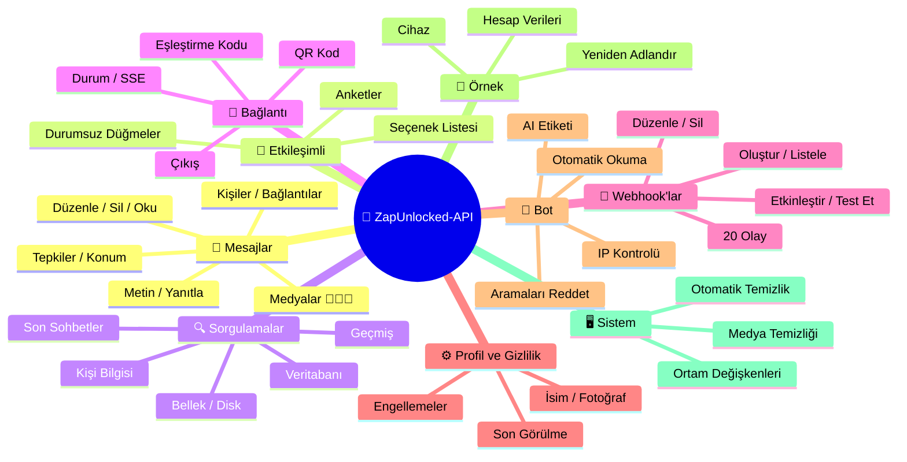
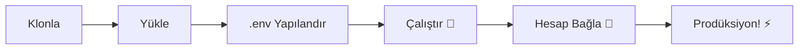

# 🚀 [ZapUnlocked-API](https://zapunlocked-api.kauafpss.com.br) 📲✨


<p align="center">
  
  
  
  
  
</p>

---

### 🌐 Dil Seçin:

<table width="100%">
  <tr>
    <td align="center" valign="middle"><a href="https://github.com/kauafpssx/ZapUnlocked-API/blob/main/README.MD"></a></td>
    <td align="center" valign="middle"><a href="https://github.com/kauafpssx/ZapUnlocked-API/blob/main/docs/translations/en.md"></a></td>
    <td align="center" valign="middle"><a href="https://github.com/kauafpssx/ZapUnlocked-API/blob/main/docs/translations/es.md"></a></td>
    <td align="center" valign="middle"><a href="https://github.com/kauafpssx/ZapUnlocked-API/blob/main/docs/translations/fr.md"></a></td>
    <td align="center" valign="middle"><a href="https://github.com/kauafpssx/ZapUnlocked-API/blob/main/docs/translations/de.md"></a></td>
    <td align="center" valign="middle"><a href="https://github.com/kauafpssx/ZapUnlocked-API/blob/main/docs/translations/zh.md"></a></td>
    <td align="center" valign="middle"><a href="https://github.com/kauafpssx/ZapUnlocked-API/blob/main/docs/translations/ja.md"></a></td>
    <td align="center" valign="middle"><a href="https://github.com/kauafpssx/ZapUnlocked-API/blob/main/docs/translations/ru.md"></a></td>
    <td align="center" valign="middle"><a href="https://github.com/kauafpssx/ZapUnlocked-API/blob/main/docs/translations/it.md"></a></td>
    <td align="center" valign="middle"><a href="https://github.com/kauafpssx/ZapUnlocked-API/blob/main/docs/translations/ar.md"></a></td>
    <td align="center" valign="middle"><a href="https://github.com/kauafpssx/ZapUnlocked-API/blob/main/docs/translations/ko.md"></a></td>
    <td align="center" valign="middle"><a href="https://github.com/kauafpssx/ZapUnlocked-API/blob/main/docs/translations/hi.md"></a></td>
    <td align="center" valign="middle"><a href="https://github.com/kauafpssx/ZapUnlocked-API/blob/main/docs/translations/nl.md"></a></td>
  </tr>
</table>

---

##  ZapUnlocked-API Nedir?

WhatsApp API pazarı, aylık onlarca ila yüzlerce dolar ücret talep ediyor: kullanım sınırlamaları, konuşma başına ücretler ve üçüncü taraf sunuculardan geçen veriler. **ZapUnlocked-API bunu değiştirmek için var.**

**Python** ile inşa edilmiş ve bağlantı motoru olarak **[Neonize](https://github.com/krypton-byte/neonize)** kullanılmıştır. Bu API, oturumları yönetmek, karmaşık medyalar göndermek ve akıllı etkileşimler oluşturmak için basit bir REST arayüzü (FastAPI) sunar. **Ağır veritabanı yok, aylık ücret yok, kimseye bağımlılık yok.**

Amacımız **teknik mükemmellik** ve **geliştirici bağımsızlığı** temellerine dayanmaktadır. Güçlü araçların, kendi çözümlerini inşa edenler için erişilebilir olması gerektiğine inanıyoruz.

> [!TIP]
> Bot entegrasyonu, bildirimler ve otomatik müşteri hizmetleri sistemlerinde çeviklik arayan geliştiriciler için mükemmeldir. **Bunun için hiçbir şey ödemeden.**

---

## 🗺️ API Genel Bakış



---

## ✨ Öne Çıkan Özellikler

| Özellik | Açıklama |
| :------ | :------- |
| 🧩 **Durumsuz Düğmeler** | Şifrelenmiş webhook'lar ile veritabanı olmadan etkileşimli akışlar oluşturun |
| 🔢 **QR Kodsuz Eşleştirme** | Sayısal kod ile bağlanın · GUI'siz sunucular için ideal |
| 🎵 **Otomatik Ses Dönüşümü** | iOS ve Android'de doğal olarak "şimdi kaydedildi" (PTT) olarak görünen ses gönderimi |
| 📦 **Akıllı Medya Kuyruğu** | Aşırı bellek tüketimini önlemek için otomatik yönetim |
| 🏷️ **Dinamik Yer Tutucular** | `{{name}}`, `{{day}}`, `{{phone}}` gibi değişkenlerle mesajları ve webhook'ları kişiselleştirin |

> [!NOTE]
> Tüm özellikler **%100 ücretsizdir** ve açık kaynak topluluğu tarafından sürdürülmektedir.

---

## 📋 API Rotaları

<details>
<summary><b>📨 Mesaj Gönderimi</b> · 14 uç nokta</summary>

| Metot | Rota | Açıklama |
| :---- | :--- | :------- |
| `POST` | `/send` | Metin mesajı gönder / yanıtla |
| `POST` | `/send_image` | Resim gönder |
| `POST` | `/send_video` | Video gönder (GIF ve PTV destekler) |
| `POST` | `/send_audio` | Ses gönder (otomatik PTT dönüşümü ile) |
| `POST` | `/send_document` | Belge gönder |
| `POST` | `/send_sticker` | Çıkartma gönder |
| `POST` | `/send_reaction` | Emoji ile tepki gönder |
| `POST` | `/send_location` | Konum gönder |
| `POST` | `/send_contact` | Kişi gönder |
| `POST` | `/send_contacts` | Birden çok kişi gönder |
| `POST` | `/send_link` | Önizlemeli bağlantı gönder |
| `POST` | `/messages/delete` | Mesajı sil |
| `POST` | `/messages/read` | Okundu olarak işaretle |
| `POST` | `/messages/edit` | Gönderilen mesajı düzenle |
</details>

<details>
<summary><b>🔘 Etkileşimli Mesajlar</b> · 4 uç nokta</summary>

| Metot | Rota | Açıklama |
| :---- | :--- | :------- |
| `POST` | `/send_wbuttons` | Düğme gönder (liste, eylem, OTP, PIX) |
| `POST` | `/messages/send-option-list` | Seçenek listesi gönder |
| `POST` | `/messages/send-poll` | Anket gönder |
| `POST` | `/messages/send-poll-vote` | Ankete oy ver |
</details>

<details>
<summary><b>🔍 Sorgulamalar ve Yönetim</b> · 7 uç nokta</summary>

| Metot | Rota | Açıklama |
| :---- | :--- | :------- |
| `POST` | `/contacts/info` | Detaylı kişi bilgileri |
| `POST` | `/management/fetch_messages` | Mesaj geçmişini getir |
| `POST` | `/management/recent_contacts` | Son sohbetleri listele |
| `GET` | `/management/memory` | Bellek kullanım durumu |
| `GET` | `/management/volume_stats` | Disk kullanımını kontrol et |
| `GET` | `/management/database/status` | Veritabanı durumu ve istatistikleri |
| `POST` | `/management/database/cleanup` | Manuel veritabanı temizliği |
</details>

<details>
<summary><b>🔗 Bağlantı ve Oturum</b> · 8 uç nokta</summary>

| Metot | Rota | Açıklama |
| :---- | :--- | :------- |
| `GET` | `/` | Karşılama sayfası (HTML) |
| `GET` | `/status` | Bağlantı ve oturum durumu |
| `GET` | `/status/stream` | Gerçek zamanlı durum (SSE) |
| `GET` | `/qr` | Etkileşimli QR Kodu görüntüle |
| `GET` | `/qr/image` | QR Kod resmini al (Base64) |
| `POST` | `/qr/pair` | Sayısal eşleştirme kodu oluştur |
| `GET` | `/settings/phone-code/{phone}` | Telefon numarası ile eşleştirme kodu oluştur |
| `POST` | `/qr/logout` | Bağlantıyı kes ve oturumu sıfırla |
</details>

<details>
<summary><b>📡 Webhook'lar (CRUD)</b> · 7 uç nokta</summary>

| Metot | Rota | Açıklama |
| :---- | :--- | :------- |
| `POST` | `/webhooks` | Adlandırılmış webhook oluştur |
| `GET` | `/webhooks` | Tüm webhook'ları listele |
| `PUT` | `/webhooks/{name}` | Webhook'u düzenle |
| `DELETE` | `/webhooks/{name}` | Webhook'u kaldır |
| `POST` | `/webhooks/{name}/toggle` | Etkinleştir / devre dışı bırak |
| `POST` | `/webhooks/{name}/test` | Webhook'u test et |
| `GET` | `/webhooks/events` | Olay türlerini listele (20 tür) |
</details>

<details>
<summary><b>⚙️ Profil ve Gizlilik</b> · 3 uç nokta</summary>

| Metot | Rota | Açıklama |
| :---- | :--- | :------- |
| `POST` | `/settings/profile` | Bot adını ve fotoğrafını değiştir |
| `POST` | `/settings/privacy` | Gizliliği ayarla (son görülme, vb.) |
| `POST` | `/settings/block` | Kişiyi engelle / engeli kaldır |
</details>

<details>
<summary><b>🤖 Bot Ayarları</b> · 5 uç nokta</summary>

| Metot | Rota | Açıklama |
| :---- | :--- | :------- |
| `GET` | `/settings/bot` | Bot ayarlarını görüntüle |
| `POST` | `/settings/bot` | Bot ayarlarını güncelle (AI etiketi, IP kontrolü) |
| `PUT` | `/settings/instance/call-reject-auto` | Aramaları otomatik reddet |
| `PUT` | `/settings/instance/call-reject-message` | Reddedilen arama mesajı |
| `PUT` | `/settings/instance/auto-read-message` | Otomatik mesaj okuma |
</details>

<details>
<summary><b>📱 Örnek</b> · 3 uç nokta</summary>

| Metot | Rota | Açıklama |
| :---- | :--- | :------- |
| `GET` | `/instance/me` | Bağlı hesap verileri |
| `GET` | `/instance/device` | Cihaz teknik verileri |
| `PUT` | `/instance/update-name` | Örneği yeniden adlandır |
</details>

<details>
<summary><b>🖥️ Sistem</b> · 5 uç nokta</summary>

| Metot | Rota | Açıklama |
| :---- | :--- | :------- |
| `GET` | `/system/env` | Ortam değişkenlerini görüntüle |
| `PUT` | `/system/env` | Ortam değişkenlerini güncelle |
| `POST` | `/system/cleanup/force` | Zorunlu geçici medya temizliği |
| `GET` | `/system/cleanup/settings` | Otomatik temizlik ayarlarını görüntüle |
| `PUT` | `/system/cleanup/settings` | Otomatik temizlik aralığını güncelle |
</details>

> **Toplam: 56 uç nokta** · WhatsApp otomasyonu için eksiksiz REST.

---

## 📡 Webhook Olayları

Tüm webhook'lar standart bir zarf alır:

```json
{
  "event": "message.text",
  "timestamp": "2025-01-01T12:00:00Z",
  "data": { ... }
}
```

Webhook'un `{{placeholders}}` içeren özel bir `body`'si varsa, standart zarf yerine bu body gönderilir.

### Kullanılabilir Olaylar (20 tür)

| Olay | Açıklama |
| :--- | :------- |
| `message.text` | Düz / biçimlendirilmiş metin |
| `message.image` | Alınan resim |
| `message.video` | Alınan video |
| `message.audio` | Ses / sesli not |
| `message.document` | Belge / dosya |
| `message.sticker` | Çıkartma |
| `message.contact` | Paylaşılan kişi |
| `message.location` | Konum |
| `message.reaction` | Tepki (emoji) |
| `message.poll_created` | Alınan anket |
| `message.poll_vote` | Anket oyu |
| `message.button_reply` | Buton tıklaması |
| `message.list_reply` | Etkileşimli liste seçimi |
| `message.deleted` | Gönderen tarafından silinen mesaj |
| `message.unknown` | Eşleşmeyen mesaj türü |
| `message.sent` | Gönderilen mesaj (manuel) |
| `connection.connected` | WhatsApp bağlandı |
| `connection.disconnected` | WhatsApp bağlantısı kesildi |
| `connection.qr_ready` | QR Kodu oluşturuldu |
| `call.received` | Gelen arama |

### Yer Tutucular (özel body)

| Yer Tutucu | Değer |
| :--------- | :---- |
| `{{from}}` | Gönderen numarası |
| `{{text}}` | Mesaj metni |
| `{{phone}}` | `{{from}}` ile aynı |
| `{{id}}` | Mesaj ID'si |
| `{{timestamp}}` | Geçerli UTC zaman damgası |

<details>
<summary><b>📦 Olaya Göre Payload Örnekleri</b></summary>

Alınan mesaj olaylarında bulunan temel alanlar:

```json
{
  "messageId": "3EB0ABCDEF123456",
  "from": "5511999999999",
  "fromName": "João Silva",
  "fromJid": "5511999999999@s.whatsapp.net",
  "isGroup": false
}
```

#### `message.text`
```json
{
  "event": "message.text",
  "data": {
    "...base": "...",
    "text": "Olá! Como posso ajudar?",
    "quoted": { "id": "3EB0...", "fromMe": true }
  }
}
```

#### `message.image`
```json
{
  "event": "message.image",
  "data": {
    "...base": "...",
    "caption": "Foto do produto",
    "mimetype": "image/jpeg",
    "fileLength": 204800
  }
}
```

#### `message.video`
```json
{
  "event": "message.video",
  "data": {
    "...base": "...",
    "caption": "Veja esse vídeo!",
    "mimetype": "video/mp4",
    "fileLength": 5242880,
    "isPTT": false,
    "isGif": false
  }
}
```

#### `message.audio`
```json
{
  "event": "message.audio",
  "data": {
    "...base": "...",
    "mimetype": "audio/ogg; codecs=opus",
    "fileLength": 30720,
    "isPTT": true,
    "durationSeconds": 8
  }
}
```

#### `message.document`
```json
{
  "event": "message.document",
  "data": {
    "...base": "...",
    "fileName": "contrato.pdf",
    "caption": "Segue o contrato",
    "mimetype": "application/pdf",
    "fileLength": 102400
  }
}
```

#### `message.sticker`
```json
{
  "event": "message.sticker",
  "data": {
    "...base": "...",
    "mimetype": "image/webp",
    "isAnimated": false
  }
}
```

#### `message.contact`
```json
{
  "event": "message.contact",
  "data": {
    "...base": "...",
    "displayName": "Maria Souza",
    "vcard": "BEGIN:VCARD\nVERSION:3.0\n..."
  }
}
```

#### `message.location`
```json
{
  "event": "message.location",
  "data": {
    "...base": "...",
    "lat": -23.5505,
    "lng": -46.6333,
    "name": "Av. Paulista",
    "address": "Av. Paulista, 1000 - São Paulo"
  }
}
```

#### `message.reaction`
```json
{
  "event": "message.reaction",
  "data": {
    "...base": "...",
    "emoji": "❤️",
    "targetMessageId": "3EB0ABCDEF123456",
    "isRemoved": false
  }
}
```

#### `message.poll_created`
```json
{
  "event": "message.poll_created",
  "data": {
    "...base": "...",
    "pollName": "Qual o melhor sabor?",
    "options": ["Chocolate", "Morango", "Baunilha"]
  }
}
```

#### `message.poll_vote`
```json
{
  "event": "message.poll_vote",
  "data": {
    "...base": "...",
    "pollId": "3EB0ABCDEF123456",
    "selectedOptions": ["Chocolate"]
  }
}
```

#### `message.button_reply`
```json
{
  "event": "message.button_reply",
  "data": {
    "...base": "...",
    "buttonId": "opcao_sim",
    "displayText": "Sim",
    "type": "quick_reply"
  }
}
```

#### `message.list_reply`
```json
{
  "event": "message.list_reply",
  "data": {
    "...base": "...",
    "rowId": "1",
    "title": "X-Burguer",
    "description": "R$ 18,90"
  }
}
```

#### `message.deleted`
```json
{
  "event": "message.deleted",
  "data": {
    "...base": "..."
  }
}
```

#### `message.unknown`
```json
{
  "event": "message.unknown",
  "data": {
    "...base": "...",
    "rawType": "senderKeyDistributionMessage"
  }
}
```

#### `message.sent`
```json
{
  "event": "message.sent",
  "data": {
    "to": "5511999999999",
    "type": "text",
    "messageId": "3EB0ABCDEF123456"
  }
}
```

#### `connection.connected`
```json
{
  "event": "connection.connected",
  "data": {
    "phone": "5511999999999"
  }
}
```

#### `connection.disconnected`
```json
{
  "event": "connection.disconnected",
  "data": {}
}
```

#### `connection.qr_ready`
```json
{
  "event": "connection.qr_ready",
  "data": {
    "qr": "2@abc123..."
  }
}
```

#### `call.received`
```json
{
  "event": "call.received",
  "data": {
    "from": "5511999999999",
    "fromJid": "5511999999999@s.whatsapp.net",
    "callId": "ABC123DEF456"
  }
}
```

</details>

---

## 🛠️ Kurulum ve Barındırma

> Profesyonel WhatsApp API'nizi **ZapUnlocked-API** ile **5 dakikadan kısa sürede** çalışır hale getirin.

### 💻 Yerel Kurulum

Geliştirme, test veya kendi sunucunuzda çalıştırmak için idealdir.



**1. Depoyu Klonlayın**

```bash
git clone https://github.com/kauafpssx/ZapUnlocked-API.git
cd ZapUnlocked-API
```

**2. Bağımlılıkları Yükleyin**

| Sistem | Komut |
| :----- | :---- |
| 🪟 Windows | `scripts\install\install.bat` |
| 🐧 Linux / macOS | `bash scripts/install/install.sh` |

**3. Ortamı Yapılandırın**

| Sistem | Komut |
| :----- | :---- |
| 🪟 Windows | `scripts\generate-env\generate-env.bat` |
| 🐧 Linux / macOS | `bash scripts/generate-env/generate-env.sh` |

| Değişken | Açıklama |
| :------- | :------- |
| `API_KEY` | Tüm uç noktalarda kimlik doğrulama için şifre |
| `INTERNAL_SECRET` | Webhook imzalarını doğrulamak için token |
| `PORT` | API portu (varsayılan: `8300`) |

**4. API'yi Çalıştırın**

| Sistem | Komut |
| :----- | :---- |
| 🪟 Windows | `scripts\run\run.bat` |
| 🐧 Linux / macOS | `bash scripts/run/run.sh` |

---

### ☁️ Barındırma: Alwaysdata (7/24 Ücretsiz)

**Alwaysdata**, API'yi bir sunucuyu açık tutmanıza gerek kalmadan ücretsiz ve istikrarlı bir şekilde barındırmak için önerilen seçenektir.

#### 📊 Ücretsiz Plan Özellikleri

| Özellik | Ücretsizde Mevcut |
| :------ | :----------------- |
| 💾 Depolama | **1 GB SSD** |
| 🧠 RAM | **256 MB** |
| ⚡ CPU | **1/4 vCPU** |
| 🔄 Yedekleme | **3 gün** otomatik |
| 📡 Çalışma Süresi | Servisler ile **7/24** |

#### 👣 Dağıtım Adımları

**1.** [Alwaysdata.com](https://www.alwaysdata.com/) adresinde hesap oluşturun · **Ücretsiz** plan.

**2.** SSH'ye erişin: `https://ssh-[kullanıcı].alwaysdata.net`.

**3.** Klonlayın ve yükleyin:

```bash
git clone https://github.com/kauafpssx/ZapUnlocked-API.git ~/ZapUnlocked-API
cd ~/ZapUnlocked-API
bash scripts/install/install.sh
```

**4.** `.env` dosyasını oluşturun:

```bash
bash scripts/generate-env/generate-env.sh
```

**5.** Servisi (7/24) **Advanced > Services > Add a service** bölümünde yapılandırın:

| Alan | Değer |
| :--- | :---- |
| **Name** | `ZapUnlocked-API` |
| **Command** | `python3 main.py` |
| **Working directory** | `ZapUnlocked-API` |
| **Environment variables** | `PORT=8300` |

**6.** Şuradan erişin:

```
http://services-[kullanıcı].alwaysdata.net:8300/
```

> [!TIP]
> URL harici olarak zaten erişilebilir. *(İsteğe bağlı)* Özel bir alan adı kullanmak için **Web > Sites > Add a site** altında `http://[kullanıcı].alwaysdata.net` adresine yönlendiren bir **Reverse Proxy** yapılandırın.

---

## 🔐 Kimlik Doğrulama (Giriş)

Dağıtımdan sonra, tarayıcınızda aşağıdaki adrese erişerek WhatsApp hesabınızı bağlayın:

```text
http://services-[kullanıcı].alwaysdata.net:8300/qr?API_KEY=GIZLI_SIFRENIZ
```

---

## 📖 Resmi Dokümantasyon

<p align="center">
  👉 <a href="https://zapunlocked-api.kauafpss.com.br"><strong>zapunlocked-api.kauafpss.com.br</strong></a>
</p>

Detaylı teknik dokümantasyon, kod örnekleri ve etkileşimli bir oyun alanı için resmi web sitemizi ziyaret edin.

> [!TIP]
> **LLMs.txt** dosyasını AI dizini olarak kullanın: [`zapunlocked-api.kauafpss.com.br/llms.txt`](https://zapunlocked-api.kauafpss.com.br/llms.txt). Keşfetmeden önce tüm sayfaları keşfedin.

---

## ❤️ Krediler ve Teşekkürler

| Proje | Açıklama |
| :---- | :------- |
| [](https://github.com/krypton-byte/neonize) | WhatsApp Web'e yerel bağlantı için Python kütüphanesi |
| [](https://github.com/tulir/whatsmeow) | Neonize'in temelini oluşturan Go kütüphanesi · bağlantının kalbi |
| [](https://www.alwaysdata.com/) | Yüksek kaliteli ücretsiz altyapı |

---

## 📄 Lisans

Bu proje **MIT Lisansı** altında lisanslanmıştır.

<p align="center">
  💜 ile <a href="https://www.instagram.com/kauafpss_/">Kauã Ferreira</a> tarafından yapıldı
</p>
