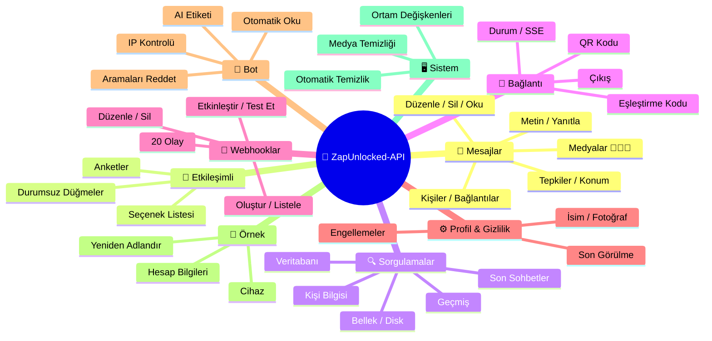
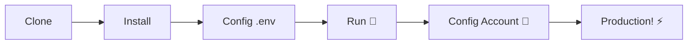

# 🚀 ZapUnlocked-API 📲✨


<p align="center">
  
  
  
  
  
</p>

<table width="100%">
  <tr>
    <td align="center" valign="middle"><a href="https://github.com/kauafpssx/ZapUnlocked-API/blob/main/docs/translations/en.md"></a></td>
    <td align="center" valign="middle"><a href="https://github.com/kauafpssx/ZapUnlocked-API/blob/main/docs/translations/es.md"></a></td>
    <td align="center" valign="middle"><a href="https://github.com/kauafpssx/ZapUnlocked-API/blob/main/docs/translations/fr.md"></a></td>
    <td align="center" valign="middle"><a href="https://github.com/kauafpssx/ZapUnlocked-API/blob/main/docs/translations/de.md"></a></td>
    <td align="center" valign="middle"><a href="https://github.com/kauafpssx/ZapUnlocked-API/blob/main/docs/translations/zh.md"></a></td>
    <td align="center" valign="middle"><a href="https://github.com/kauafpssx/ZapUnlocked-API/blob/main/docs/translations/ja.md"></a></td>
    <td align="center" valign="middle"><a href="https://github.com/kauafpssx/ZapUnlocked-API/blob/main/docs/translations/ru.md"></a></td>
    <td align="center" valign="middle"><a href="https://github.com/kauafpssx/ZapUnlocked-API/blob/main/docs/translations/it.md"></a></td>
    <td align="center" valign="middle"><a href="https://github.com/kauafpssx/ZapUnlocked-API/blob/main/docs/translations/ar.md"></a></td>
    <td align="center" valign="middle"><a href="https://github.com/kauafpssx/ZapUnlocked-API/blob/main/docs/translations/ko.md"></a></td>
    <td align="center" valign="middle"><a href="https://github.com/kauafpssx/ZapUnlocked-API/blob/main/docs/translations/hi.md"></a></td>
    <td align="center" valign="middle"><a href="https://github.com/kauafpssx/ZapUnlocked-API/blob/main/docs/translations/nl.md"></a></td>
  </tr>
</table>

---

##  ZapUnlocked-API Nedir?

WhatsApp API pazarı aylık aboneliklerle fahiş ücretler alıyor: ayda onlarca ila yüzlerce dolar, kullanım limitleri, konuşma başına ücretler ve üçüncü taraf sunucularından geçen veriler. **ZapUnlocked-API bunu değiştirmek için var.**

**Python** ile **[Neonize](https://github.com/krypton-byte/neonize)** bağlantı motoru olarak inşa edilen bu API, oturumları yönetmek, karmaşık medyalar göndermek ve akıllı etkileşimler oluşturmak için basit bir REST arayüzü (FastAPI) sunar. **Ağır veritabanı yok, aylık ücret yok, kimseye bağımlılık yok.**

Teklifimiz **teknik mükemmellik** ve **geliştirici bağımsızlığı** üzerine kuruludur. Güçlü araçların, kendi çözümlerini inşa edenler için erişilebilir olması gerektiğine inanıyoruz.

> [!TIP]
> Bot entegrasyonu, bildirimler ve otomatik hizmet sistemlerinde çeviklik arayan geliştiriciler için mükemmel. **Bunun için hiçbir şey ödemeden.**

---

## 🗺️ API Genel Görünümü



---

## ✨ Öne Çıkan Özellikler

| Özellik | Açıklama |
| :------ | :-------- |
| 🧩 **Durumsuz Düğmeler** | Şifreli webhooklar ile veritabanı olmadan etkileşimli akışlar oluşturun |
| 🔢 **QR Kodu Olmadan Eşleştirme** | Sayısal kod ile bağlanın · GUI'siz sunucular için ideal |
| 🎵 **Otomatik Ses Dönüşümü** | Sesleri doğal olarak anlık kaydedilmiş (PTT) gibi gönderin |
| 📦 **Akıllı Medya Kuyruğu** | Aşırı bellek tüketimini önlemek için otomatik yönetim |
| 🏷️ **Dinamik Yer Tutucular** | Mesajları ve webhookları `{{name}}`, `{{day}}`, `{{phone}}` ile özelleştirin |

> [!NOTE]
> Tüm özellikler **%100 ücretsizdir** ve açık kaynak topluluğu tarafından sürdürülmektedir.

---

## 📋 API Rotaları

<details>
<summary><b>📨 Mesaj Gönderme</b> · 13 uç nokta</summary>

| Metot | Rota | Açıklama |
| :---- | :--- | :------- |
| `POST` | `/send` | Metin mesajı gönderme / yanıtlama |
| `POST` | `/send_image` | Resim gönderme |
| `POST` | `/send_video` | Video gönderme (GIF ve PTV destekler) |
| `POST` | `/send_audio` | Ses gönderme (PTT'ye otomatik dönüşüm) |
| `POST` | `/send_document` | Belge gönderme |
| `POST` | `/send_sticker` | Çıkartma gönderme |
| `POST` | `/send_reaction` | Emoji ile tepki gönderme |
| `POST` | `/send_location` | Konum gönderme |
| `POST` | `/send_contact` | Kişi gönderme |
| `POST` | `/send_contacts` | Birden çok kişi gönderme |
| `POST` | `/send_link` | Önizlemeli bağlantı gönderme |
| `POST` | `/messages/delete` | Mesajı silme |
| `POST` | `/messages/read` | Okundu olarak işaretleme |
| `POST` | `/messages/edit` | Gönderilen mesajı düzenleme |
</details>

<details>
<summary><b>🔘 Etkileşimli Mesajlar</b> · 4 uç nokta</summary>

| Metot | Rota | Açıklama |
| :---- | :--- | :------- |
| `POST` | `/send_wbuttons` | Düğme gönderme (liste, eylem, OTP, PIX) |
| `POST` | `/messages/send-option-list` | Seçenek listesi gönderme |
| `POST` | `/messages/send-poll` | Anket gönderme |
| `POST` | `/messages/send-poll-vote` | Ankete oy verme |
</details>

<details>
<summary><b>🔍 Sorgulamalar ve Yönetim</b> · 7 uç nokta</summary>

| Metot | Rota | Açıklama |
| :---- | :--- | :------- |
| `POST` | `/contacts/info` | Kişi detaylı bilgileri |
| `POST` | `/management/fetch_messages` | Mesaj geçmişini getirme |
| `POST` | `/management/recent_contacts` | Son sohbetleri listeleme |
| `GET` | `/management/memory` | Bellek kullanım durumu |
| `GET` | `/management/volume_stats` | Disk kullanımını kontrol etme |
| `GET` | `/management/database/status` | Veritabanı durumu ve istatistikleri |
| `POST` | `/management/database/cleanup` | Veritabanı manuel temizliği |
</details>

<details>
<summary><b>🔗 Bağlantı ve Oturum</b> · 8 uç nokta</summary>

| Metot | Rota | Açıklama |
| :---- | :--- | :------- |
| `GET` | `/` | Karşılama sayfası (HTML) |
| `GET` | `/status` | Bağlantı ve oturum durumu |
| `GET` | `/status/stream` | Gerçek zamanlı durum (SSE) |
| `GET` | `/qr` | Etkileşimli QR Kodu görüntüleme |
| `GET` | `/qr/image` | QR Kodu resmi alma (Base64) |
| `POST` | `/qr/pair` | Sayısal eşleştirme kodu oluşturma |
| `GET` | `/settings/phone-code/{phone}` | Numara ile kod oluşturma |
| `POST` | `/qr/logout` | Bağlantıyı kesme ve oturumu sıfırlama |
</details>

<details>
<summary><b>📡 Webhooklar (CRUD)</b> · 7 uç nokta</summary>

| Metot | Rota | Açıklama |
| :---- | :--- | :------- |
| `POST` | `/webhooks` | Adlandırılmış webhook oluşturma |
| `GET` | `/webhooks` | Tüm webhookları listeleme |
| `PUT` | `/webhooks/{name}` | Webhook düzenleme |
| `DELETE` | `/webhooks/{name}` | Webhook kaldırma |
| `POST` | `/webhooks/{name}/toggle` | Etkinleştirme / devre dışı bırakma |
| `POST` | `/webhooks/{name}/test` | Webhook test etme |
| `GET` | `/webhooks/events` | Olay türlerini listeleme (20 tür) |
</details>

<details>
<summary><b>⚙️ Profil ve Gizlilik</b> · 3 uç nokta</summary>

| Metot | Rota | Açıklama |
| :---- | :--- | :------- |
| `POST` | `/settings/profile` | Bot adını ve fotoğrafını değiştirme |
| `POST` | `/settings/privacy` | Gizlilik ayarları (son görülme vb.) |
| `POST` | `/settings/block` | Kişiyi engelleme / engeli kaldırma |
</details>

<details>
<summary><b>🤖 Bot Ayarları</b> · 5 uç nokta</summary>

| Metot | Rota | Açıklama |
| :---- | :--- | :------- |
| `GET` | `/settings/bot` | Bot ayarlarını görüntüleme |
| `POST` | `/settings/bot` | Ayarları güncelleme (AI etiketi, IP kontrolü) |
| `PUT` | `/settings/instance/call-reject-auto` | Aramaları otomatik reddetme |
| `PUT` | `/settings/instance/call-reject-message` | Reddedilen arama mesajı |
| `PUT` | `/settings/instance/auto-read-message` | Mesajları otomatik okuma |
</details>

<details>
<summary><b>📱 Örnek</b> · 3 uç nokta</summary>

| Metot | Rota | Açıklama |
| :---- | :--- | :------- |
| `GET` | `/instance/me` | Bağlı hesap verileri |
| `GET` | `/instance/device` | Cihaz teknik verileri |
| `PUT` | `/instance/update-name` | Örneği yeniden adlandırma |
</details>

<details>
<summary><b>🖥️ Sistem</b> · 5 uç nokta</summary>

| Metot | Rota | Açıklama |
| :---- | :--- | :------- |
| `GET` | `/system/env` | Ortam değişkenlerini görüntüleme |
| `PUT` | `/system/env` | Ortam değişkenlerini güncelleme |
| `POST` | `/system/cleanup/force` | Geçici medyayı zorla temizleme |
| `GET` | `/system/cleanup/settings` | Otomatik temizlik ayarlarını görüntüleme |
| `PUT` | `/system/cleanup/settings` | Otomatik temizlik aralığını güncelleme |
</details>

> **Toplam: 56 uç nokta** · WhatsApp otomasyonu için eksiksiz REST.

---

## 🛠️ Kurulum ve Barındırma

> Profesyonel WhatsApp API'nizi **ZapUnlocked-API** ile **5 dakikadan kısa sürede** çalışır hale getirin.

### 💻 Yerel Kurulum

Geliştirme, test veya kendi sunucunuzda çalıştırmak için idealdir.



**1. Depoyu Klonlayın**

```bash
git clone https://github.com/kauafpssx/ZapUnlocked-API.git
cd ZapUnlocked-API
```

**2. Bağımlılıkları Yükleyin**

| Sistem | Komut |
| :----- | :---- |
| 🪟 Windows | `scripts\install\install.bat` |
| 🐧 Linux / macOS | `bash scripts/install/install.sh` |

**3. Ortamı Yapılandırın**

| Sistem | Komut |
| :----- | :---- |
| 🪟 Windows | `scripts\generate-env\generate-env.bat` |
| 🐧 Linux / macOS | `bash scripts/generate-env/generate-env.sh` |

| Değişken | Açıklama |
| :------- | :------- |
| `API_KEY` | Tüm uç noktalarda kimlik doğrulama için şifre |
| `INTERNAL_SECRET` | Webhook imzalarını doğrulama tokenı |
| `PORT` | API portu (varsayılan: `8300`) |

**4. API'yi Çalıştırın**

| Sistem | Komut |
| :----- | :---- |
| 🪟 Windows | `scripts\run\run.bat` |
| 🐧 Linux / macOS | `bash scripts/run/run.sh` |

---

### ☁️ Barındırma: Alwaysdata (24/7 Ücretsiz)

**Alwaysdata**, API'yi sunucunuzu açık tutmanıza gerek kalmadan istikrarlı ve ücretsiz bir şekilde barındırmak için önerilen seçenektir.

#### 📊 Ücretsiz Plan Özellikleri

| Özellik | Ücretsizde Mevcut |
| :------ | :---------------- |
| 💾 Depolama | **1 GB SSD** |
| 🧠 RAM | **256 MB** |
| ⚡ CPU | **1/4 vCPU** |
| 🔄 Yedekleme | **3 gün** otomatik |
| 📡 Çalışma Süresi | Hizmetler ile **24/7** |

#### 👣 Dağıtım Adımları

**1.** [Alwaysdata.com](https://www.alwaysdata.com/) adresinde hesap oluşturun · **Ücretsiz** plan.

**2.** SSH üzerinden `https://ssh-[kullanici].alwaysdata.net` adresine erişin.

**3.** Klonlayın ve yükleyin:

```bash
git clone https://github.com/kauafpssx/ZapUnlocked-API.git ~/ZapUnlocked-API
cd ~/ZapUnlocked-API
bash scripts/install/install.sh
```

**4.** `.env` dosyasını oluşturun:

```bash
bash scripts/generate-env/generate-env.sh
```

**5.** Hizmeti (24/7) **Advanced · Services · Add a service** bölümünde yapılandırın:

| Alan | Değer |
| :--- | :---- |
| **Name** | `ZapUnlocked-API` |
| **Command** | `python3 main.py` |
| **Working directory** | `ZapUnlocked-API` |
| **Environment variables** | `PORT=8300` |

**6.** Şuradan erişin:

```
http://services-[kullanici].alwaysdata.net:8300/
```

> [!TIP]
> URL harici olarak zaten erişilebilir. *(İsteğe bağlı)* Özel bir alan adı kullanmak için **Web · Sites · Add a site** altında `http://[kullanici].alwaysdata.net` adresine yönlendiren bir **Ters Vekil (Reverse Proxy)** yapılandırın.

---

## 🔐 Kimlik Doğrulama (Giriş)

Dağıtımdan sonra, tarayıcıdan aşağıdakine erişerek WhatsApp hesabınızı bağlayın:

```text
http://services-[kullanici].alwaysdata.net:8300/qr?API_KEY=SIRF_SIFRENIZ
```

---

## 📖 Resmi Dokümantasyon

<p align="center">
  👉 <a href="https://zapunlocked-api.kauafpss.com.br"><strong>zapunlocked-api.kauafpss.com.br</strong></a>
</p>

Detaylı teknik dokümantasyon, kod örnekleri ve etkileşimli oyun alanı için resmi web sitemizi ziyaret edin.

> [!TIP]
> **LLMs.txt** dosyasını yapay zeka dizini olarak kullanın: [`zapunlocked-api.kauafpss.com.br/llms.txt`](https://zapunlocked-api.kauafpss.com.br/llms.txt). Keşfetmeden önce tüm sayfaları keşfedin.

---

## ❤️ Katkıda Bulunanlar ve Teşekkürler

| Proje | Açıklama |
| :---- | :------- |
| [](https://github.com/krypton-byte/neonize) | WhatsApp Web ile yerel bağlantı için Python kütüphanesi |
| [](https://github.com/tulir/whatsmeow) | Neonize'nın temelini oluşturan Go kütüphanesi · bağlantının kalbi |
| [](https://www.alwaysdata.com/) | Yüksek kaliteli ücretsiz altyapı |

---

## 📄 Lisans

Bu proje **MIT Lisansı** altında lisanslanmıştır.

<p align="center">
  <a href="https://www.instagram.com/kauafpss_/">Kauã Ferreira</a> 💜 tarafından yapıldı
</p>

