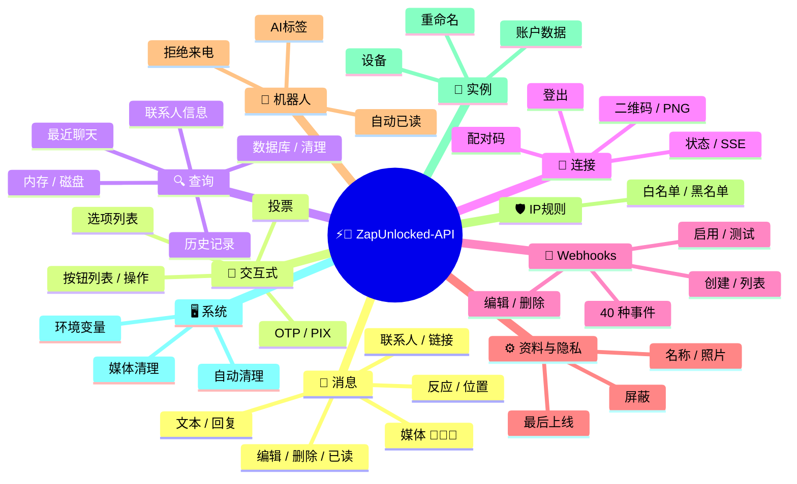
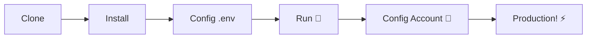

# ⚡💬 [ZapUnlocked-API](https://zapunlocked-api.kauafpss.com.br/)


<p align="center">
  
  <a href="https://downgit.github.io/#/home?url=https://github.com/kauafpssx/ZapUnlocked-API/blob/main/ZapUnlocked.collection.json" target="_blank">
    
  </a>
  
  
  
</p>

---

### 🌐 选择语言:

<table width="100%">
  <tr>
    <td align="center" valign="middle"><a href="https://github.com/kauafpssx/ZapUnlocked-API/blob/main/README.md"></a></td>
    <td align="center" valign="middle"><a href="https://github.com/kauafpssx/ZapUnlocked-API/blob/main/docs/translations/en.md"></a></td>
    <td align="center" valign="middle"><a href="https://github.com/kauafpssx/ZapUnlocked-API/blob/main/docs/translations/es.md"></a></td>
    <td align="center" valign="middle"><a href="https://github.com/kauafpssx/ZapUnlocked-API/blob/main/docs/translations/fr.md"></a></td>
    <td align="center" valign="middle"><a href="https://github.com/kauafpssx/ZapUnlocked-API/blob/main/docs/translations/de.md"></a></td>
    <td align="center" valign="middle"><a href="https://github.com/kauafpssx/ZapUnlocked-API/blob/main/docs/translations/ja.md"></a></td>
    <td align="center" valign="middle"><a href="https://github.com/kauafpssx/ZapUnlocked-API/blob/main/docs/translations/ru.md"></a></td>
    <td align="center" valign="middle"><a href="https://github.com/kauafpssx/ZapUnlocked-API/blob/main/docs/translations/it.md"></a></td>
    <td align="center" valign="middle"><a href="https://github.com/kauafpssx/ZapUnlocked-API/blob/main/docs/translations/ar.md"></a></td>
    <td align="center" valign="middle"><a href="https://github.com/kauafpssx/ZapUnlocked-API/blob/main/docs/translations/tr.md"></a></td>
    <td align="center" valign="middle"><a href="https://github.com/kauafpssx/ZapUnlocked-API/blob/main/docs/translations/ko.md"></a></td>
    <td align="center" valign="middle"><a href="https://github.com/kauafpssx/ZapUnlocked-API/blob/main/docs/translations/hi.md"></a></td>
    <td align="center" valign="middle"><a href="https://github.com/kauafpssx/ZapUnlocked-API/blob/main/docs/translations/nl.md"></a></td>
  </tr>
</table>

---

##  什么是 ZapUnlocked-API？

WhatsApp API市场收取高昂的月费：每月数十到数百雷亚尔，附带使用限制、按对话收费以及数据经过第三方服务器。**ZapUnlocked-API 的存在就是为了改变这一现状。**

基于 **Python** 构建，使用 **[Neonize](https://github.com/krypton-byte/neonize)** 作为连接引擎，本API提供简单的REST接口（FastAPI）来管理会话、发送复杂媒体以及创建智能交互。**无需重型数据库，无需月费，不依赖任何第三方。**

我们的理念基于**技术卓越**和**开发者独立性**。我们相信强大的工具应该对构建自己解决方案的人开放。

> [!TIP]
> 非常适合需要快速集成机器人、通知和自动化客服系统的开发者。**完全免费。**

---

## 🗺️ API概览




---

## ✨ 主要功能

| 功能 | 描述 |
| :--- | :--- |
| 🧩 **无状态按钮** | 使用加密的Webhook创建无需数据库的交互流程 |
| 🔢 **无QR码配对** | 通过数字码连接 · 适用于无GUI服务器 |
| 🎵 **自动音频转换** | 发送在原生PTT中显示为"刚刚录制"的音频 |
| 📦 **智能媒体队列** | 自动管理以防止过度内存消耗 |
| 🏷️ **动态占位符** | 使用 `{{name}}`、`{{day}}`、`{{phone}}` 自定义消息和Webhook |

> [!NOTE]
> 所有功能均为**100%免费**，由开源社区维护。

---

## 📋 API路由

<details>
<summary><b>📨 发送消息</b> · 15个端点</summary>

| 方法 | 路由 | 描述 | 请求体 |
| :--- | :--- | :--- | :--- |
| `POST` | `/send` | 发送文本消息 / 回复 | `phone`, `message` |
| `POST` | `/send_image` | 发送图片 | `phone`, `image_url` |
| `POST` | `/send_video` | 发送视频（支朁GIF和PTV） | `phone`, `video_url` |
| `POST` | `/send_audio` | 发送音频（自动PTT转换） | `phone`, `audio_url` |
| `POST` | `/send_document` | 发送文档 | `phone`, `document_url` |
| `POST` | `/send_sticker` | 发送贴纸 | `phone`, `sticker_url` |
| `POST` | `/send_reaction` | 发送表情反应 | `phone`, `messageId`, `emoji` |
| `POST` | `/send_location` | 发送位置 | `phone`, `lat`, `lng` |
| `POST` | `/send_contact` | 发送联系人 | `phone`, `name`, `contactPhone` |
| `POST` | `/send_contacts` | 发送多个联系人 | `phone`, `contacts` |
| `POST` | `/send_link` | 发送带预览的链接 | `phone`, `url` |
| `POST` | `/messages/delete` | 删除消息 | `phone`, `messageId` |
| `POST` | `/messages/read` | 标记为已读 | `phone`, `messageIds` |
| `POST` | `/messages/edit` | 编辑已发送消息 | `phone`, `messageId`, `message` |
</details>

<details>
<summary><b>🔘 交互式消息</b> · 7个端点</summary>

| 方法 | 路由 | 描述 | 请求体 |
| :--- | :--- | :--- | :--- |
| `POST` | `/messages/send-button-list` | 发送按钮列表 | `phone`, `buttons` |
| `POST` | `/messages/send-button-actions` | 发送操作按钮 | `phone`, `buttons` |
| `POST` | `/messages/send-button-otp` | 发送复制按钮（OTP） | `phone`, `code` |
| `POST` | `/messages/send-button-pix` | 发送PIX按钮 | `phone`, `pixKey` |
| `POST` | `/messages/send-option-list` | 发送选项列表 | `phone`, `buttons` |
| `POST` | `/messages/send-poll` | 发送投票 | `phone`, `name`, `options` |
| `POST` | `/messages/send-poll-vote` | 参与投票 | `phone`, `options` |
</details>

<details>
<summary><b>🔍 查询与管理</b> · 8个端点</summary>

| 方法 | 路由 | 描述 | 请求体 |
| :--- | :--- | :--- | :--- |
| `POST` | `/management/fetch_messages` | 获取消息历史 | `phone` |
| `POST` | `/management/recent_contacts` | 列出最近聊天 | ❌ |
| `GET` | `/management/memory` | 内存使用状态 | ❌ |
| `GET` | `/management/volume_stats` | 检查磁盘使用情况 | ❌ |
| `DELETE` | `/management/cleanup` | 清理临时媒体 | ❌ |
| `GET` | `/management/database/status` | 数据库状态和统计 | ❌ |
| `POST` | `/management/database/config` | 更新数据库设置 | `interval` |
| `POST` | `/management/database/cleanup` | 手动数据库清理 | ❌ |
</details>

<details>
<summary><b>👤 联系人</b> · 1个端点</summary>

| 方法 | 路由 | 描述 | 请求体 |
| :--- | :--- | :--- | :--- |
| `POST` | `/contacts/info` | 联系人详细信息 | `phone` |
</details>

<details>
<summary><b>🏠 常规</b> · 3个端点</summary>

| 方法 | 路由 | 描述 | 请求体 |
| :--- | :--- | :--- | :--- |
| `GET` | `/` | 欢迎页面（HTML） | ❌ |
| `GET` | `/status` | 连接和会话状态（JSON） | ❌ |
| `GET` | `/status/stream` | 实时状态（SSE） | ❌ |
</details>

<details>
<summary><b>🔗 连接（QR）</b> · 2个端点</summary>

| 方法 | 路由 | 描述 | 请求体 |
| :--- | :--- | :--- | :--- |
| `GET` | `/qr` | 查看交互式二维码（HTML） | ❌ |
| `GET` | `/qr/image` | 获取二维码图片（PNG） | ❌ |
</details>

<details>
<summary><b>🔐 会话</b> · 2个端点</summary>

| 方法 | 路由 | 描述 | 请求体 |
| :--- | :--- | :--- | :--- |
| `POST` | `/session/pair` | 生成数字配对码 | `phone` |
| `POST` | `/session/logout` | 断开连接并重置会话 | ❌ |
</details>

<details>
<summary><b>📡 Webhooks（CRUD）</b> · 8个端点</summary>

| 方法 | 路由 | 描述 | 请求体 |
| :--- | :--- | :--- | :--- |
| `POST` | `/webhooks` | 创建命名Webhook | `name`, `url` |
| `GET` | `/webhooks` | 列出所有Webhook | ❌ |
| `GET` | `/webhooks/{name}` | 按名称获取Webhook | ❌ |
| `PUT` | `/webhooks/{name}` | 编辑Webhook | ❌ |
| `DELETE` | `/webhooks/{name}` | 删除Webhook | ❌ |
| `POST` | `/webhooks/{name}/toggle` | 启用 / 禁用 | `active` |
| `POST` | `/webhooks/{name}/test` | 测试Webhook | ❌ |
| `GET` | `/webhooks/events` | 列出事件类型（40种） | ❌ |
</details>

<details>
<summary><b>⚙️ 资料与隐私</b> · 3个端点</summary>

| 方法 | 路由 | 描述 | 请求体 |
| :--- | :--- | :--- | :--- |
| `POST` | `/settings/profile` | 更改机器人名称和头像 | ❌ |
| `POST` | `/settings/privacy` | 调整隐私设置（最后上线等） | ❌ |
| `POST` | `/settings/block` | 屏蔽 / 解除屏蔽联系人 | `phone`, `action` |
</details>

<details>
<summary><b>🤖 机器人设置</b> · 6个端点</summary>

| 方法 | 路由 | 描述 | 请求体 |
| :--- | :--- | :--- | :--- |
| `GET` | `/settings/bot` | 查看机器人设置 | ❌ |
| `POST` | `/settings/bot` | 更新机器人设置（AI标签、IP控制） | ❌ |
| `PUT` | `/settings/instance/call-reject-auto` | 自动拒绝来电 | `value` |
| `PUT` | `/settings/instance/call-reject-message` | 拒接来电消息 | `value` |
| `PUT` | `/settings/instance/auto-read-message` | 自动已读消息 | `value` |
| `GET` | `/settings/phone-code/{phone}` | 通过电话号码生成配对码 | ❌ |
</details>

<details>
<summary><b>📱 实例</b> · 3个端点</summary>

| 方法 | 路由 | 描述 | 请求体 |
| :--- | :--- | :--- | :--- |
| `GET` | `/instance/me` | 已连接账户数据 | ❌ |
| `GET` | `/instance/device` | 设备技术数据 | ❌ |
| `PUT` | `/instance/update-name` | 重命名实例 | `name` |
</details>

<details>
<summary><b>🛡️ IP规则</b> · 5个端点</summary>

| 方法 | 路由 | 描述 | 请求体 |
| :--- | :--- | :--- | :--- |
| `GET` | `/settings/ip-rules` | 列出IP规则（白名单/黑名单） | ❌ |
| `POST` | `/settings/ip-rules/whitelist` | 添加IP到白名单 | `ip` |
| `POST` | `/settings/ip-rules/blacklist` | 添加IP到黑名单 | `ip` |
| `DELETE` | `/settings/ip-rules/whitelist/{ip}` | 从白名单删除IP | ❌ |
| `DELETE` | `/settings/ip-rules/blacklist/{ip}` | 从黑名单删除IP | ❌ |
</details>

<details>
<summary><b>🖥️ 系统</b> · 5个端点</summary>

| 方法 | 路由 | 描述 | 请求体 |
| :--- | :--- | :--- | :--- |
| `GET` | `/system/env` | 查看环境变量 | ❌ |
| `PUT` | `/system/env` | 更新环境变量 | ❌ |
| `POST` | `/system/cleanup/force` | 强制清理临时媒体 | ❌ |
| `GET` | `/system/cleanup/settings` | 查看自动清理设置 | ❌ |
| `PUT` | `/system/cleanup/settings` | 更新自动清理间隔 | ❌ |
</details>

> **共68个端点**

---

## 📡 Webhook 事件

所有 webhook 都会收到一个标准信封：

```json
{
  "event": "message.text",
  "timestamp": "2025-01-01T12:00:00Z",
  "data": { ... }
}
```

如果 webhook 有带有 `{{placeholders}}` 的自定义 `body`，则将发送该 body 而不是标准信封。


---

<details>
<summary><b>🏷️ 自定义 body 中可用的占位符</b></summary>

| 占位符 | 值 |
| :----- | :-- |
| `{{from}}` | 发送者号码 |
| `{{text}}` | 消息文本 |
| `{{phone}}` | 吜 `{{from}}` |
| `{{id}}` | 消息 ID |
| `{{requested}}` | 请求数量 (fetchMessages) |
| `{{found}}` | 找到数量 (fetchMessages) |
| `{{timestamp}}` | 当前 UTC 时间戳 |
| `{{day}}` | 当前日 (dd) |
| `{{mon}}` | 当前月 (MM) |
| `{{yea}}` | 当前年 (yyyy) |
| `{{hou}}` | 当前时 (HH) |
| `{{min}}` | 当前分 (mm) |
| `{{sec}}` | 当前秒 (ss) |

</details>

---

<details>
<summary><b>📥 收到的消息</b> · 15个事件</summary>

收到的消息事件中的基础字段：

```json
{
  "messageId": "3EB0ABCDEF123456",
  "from": "5511999999999",
  "fromName": "João Silva",
  "fromJid": "5511999999999@s.whatsapp.net",
  "isGroup": false
}
```

<details>
<summary><code>message.text</code> - 纯文本 / 格式化文本</summary>

```json
{
  "event": "message.text",
  "data": {
    "...base": "...",
    "text": "Olá! Como posso ajudar?",
    "quoted": { "id": "3EB0...", "fromMe": true }
  }
}
```
</details>

<details>
<summary><code>message.image</code> - 收到图片</summary>

```json
{
  "event": "message.image",
  "data": {
    "...base": "...",
    "caption": "Foto do produto",
    "mimetype": "image/jpeg",
    "fileLength": 204800
  }
}
```
</details>

<details>
<summary><code>message.video</code> - 收到视频</summary>

```json
{
  "event": "message.video",
  "data": {
    "...base": "...",
    "caption": "Veja esse vídeo!",
    "mimetype": "video/mp4",
    "fileLength": 5242880,
    "isPTT": false,
    "isGif": false
  }
}
```
</details>

<details>
<summary><code>message.audio</code> - 音频 / 语音消息</summary>

```json
{
  "event": "message.audio",
  "data": {
    "...base": "...",
    "mimetype": "audio/ogg; codecs=opus",
    "fileLength": 30720,
    "isPTT": true,
    "durationSeconds": 8
  }
}
```
</details>

<details>
<summary><code>message.document</code> - 文档 / 文件</summary>

```json
{
  "event": "message.document",
  "data": {
    "...base": "...",
    "fileName": "contrato.pdf",
    "caption": "Segue o contrato",
    "mimetype": "application/pdf",
    "fileLength": 102400
  }
}
```
</details>

<details>
<summary><code>message.sticker</code> - 贴纸</summary>

```json
{
  "event": "message.sticker",
  "data": {
    "...base": "...",
    "mimetype": "image/webp",
    "isAnimated": false
  }
}
```
</details>

<details>
<summary><code>message.contact</code> - 分享的联系人</summary>

```json
{
  "event": "message.contact",
  "data": {
    "...base": "...",
    "displayName": "Maria Souza",
    "vcard": "BEGIN:VCARD\nVERSION:3.0\n..."
  }
}
```
</details>

<details>
<summary><code>message.location</code> - 位置</summary>

```json
{
  "event": "message.location",
  "data": {
    "...base": "...",
    "lat": -23.5505,
    "lng": -46.6333,
    "name": "Av. Paulista",
    "address": "Av. Paulista, 1000 - São Paulo"
  }
}
```
</details>

<details>
<summary><code>message.reaction</code> - 反应（表情符号）</summary>

```json
{
  "event": "message.reaction",
  "data": {
    "...base": "...",
    "emoji": "❤️",
    "targetMessageId": "3EB0ABCDEF123456",
    "isRemoved": false
  }
}
```
</details>

<details>
<summary><code>message.poll_created</code> - 收到投票</summary>

```json
{
  "event": "message.poll_created",
  "data": {
    "...base": "...",
    "pollName": "Qual o melhor sabor?",
    "options": ["Chocolate", "Morango", "Baunilha"]
  }
}
```
</details>

<details>
<summary><code>message.poll_vote</code> - 投票</summary>

```json
{
  "event": "message.poll_vote",
  "data": {
    "...base": "...",
    "pollId": "3EB0ABCDEF123456",
    "selectedOptions": ["Chocolate"]
  }
}
```
</details>

<details>
<summary><code>message.button_reply</code> - 按钮点击</summary>

```json
{
  "event": "message.button_reply",
  "data": {
    "...base": "...",
    "buttonId": "opcao_sim",
    "displayText": "Sim",
    "type": "quick_reply"
  }
}
```
</details>

<details>
<summary><code>message.list_reply</code> - 交互式列表选择</summary>

```json
{
  "event": "message.list_reply",
  "data": {
    "...base": "...",
    "rowId": "1",
    "title": "X-Burguer",
    "description": "R$ 18,90"
  }
}
```
</details>

<details>
<summary><code>message.deleted</code> - 发送者删除的消息</summary>

```json
{
  "event": "message.deleted",
  "data": {
    "...base": "..."
  }
}
```
</details>

<details>
<summary><code>message.unknown</code> - 未映射类型</summary>

```json
{
  "event": "message.unknown",
  "data": {
    "...base": "...",
    "rawType": "senderKeyDistributionMessage"
  }
}
```
</details>

</details>

<details>
<summary><b>📤 已发送的消息</b> · 4个事件</summary>

<details>
<summary><code>message.sent</code> - 已发送消息（手动）</summary>

```json
{
  "event": "message.sent",
  "data": {
    "to": "5511999999999",
    "type": "text",
    "messageId": "3EB0ABCDEF123456"
  }
}
```
</details>

<details>
<summary><code>message.read</code> - 收件人已读消息</summary>

```json
{
  "event": "message.read",
  "data": {
    "from": "5511999999999",
    "messageId": "3EB0ABCDEF123456"
  }
}
```
</details>

<details>
<summary><code>message.delivered</code> - 消息已送达收件人 (receipt type 1)</summary>

```json
{
  "event": "message.delivered",
  "data": {
    "from": "5511999999999",
    "messageId": "3EB0ABCDEF123456"
  }
}
```
</details>

<details>
<summary><code>message.receipt</code> - 其他送达确认 (receipt types 2, 3, 5+)</summary>

```json
{
  "event": "message.receipt",
  "data": {
    "from": "5511999999999",
    "messageId": "3EB0ABCDEF123456",
    "receiptType": 2
  }
}
```
</details>

</details>

<details>
<summary><b>🔗 连接</b> · 3个事件</summary>

<details>
<summary><code>connection.connected</code> - WhatsApp 已连接</summary>

```json
{
  "event": "connection.connected",
  "data": {
    "phone": "5511999999999"
  }
}
```
</details>

<details>
<summary><code>connection.disconnected</code> - WhatsApp 已断开</summary>

```json
{
  "event": "connection.disconnected",
  "data": {}
}
```
</details>

<details>
<summary><code>connection.qr_ready</code> - 二维码已生成</summary>

```json
{
  "event": "connection.qr_ready",
  "data": {
    "qr": "2@abc123..."
  }
}
```
</details>

</details>

<details>
<summary><b>📞 通话</b> · 1个事件</summary>

<details>
<summary><code>call.received</code> - 收到来电</summary>

```json
{
  "event": "call.received",
  "data": {
    "from": "5511999999999",
    "fromJid": "5511999999999@s.whatsapp.net",
    "callId": "ABC123DEF456"
  }
}
```
</details>

</details>

---

## 🛠️ 安装与托管

> 使用 **ZapUnlocked-API** 在**5分钟**内上线您的专业WhatsApp API。

### 💻 本地安装

适合开发、测试或在自有服务器上运行。



**1. 克隆仓库**

```bash
git clone https://github.com/kauafpssx/ZapUnlocked-API.git
cd ZapUnlocked-API
```

**2. 安装依赖**

| 系统 | 命令 |
| :--- | :--- |
| 🪟 Windows | `scripts\install\install.bat` |
| 🐧 Linux / macOS | `bash scripts/install/install.sh` |

**3. 配置环境**

| 系统 | 命令 |
| :--- | :--- |
| 🪟 Windows | `scripts\generate-env\generate-env.bat` |
| 🐧 Linux / macOS | `bash scripts/generate-env/generate-env.sh` |

| 变量 | 描述 |
| :--- | :--- |
| `API_KEY` | 所有端点的认证密码 |
| `INTERNAL_SECRET` | 用于验证Webhook签名的令牌 |
| `PORT` | API端口（默认: `8300`） |

**4. 运行API**

| 系统 | 命令 |
| :--- | :--- |
| 🪟 Windows | `scripts\run\run.bat` |
| 🐧 Linux / macOS | `bash scripts/run/run.sh` |

---

### ☁️ 托管: Alwaysdata（免费 24/7）

**Alwaysdata** 是推荐的托管方案，可稳定免费运行API，无需保朁计算机开机。

#### 📊 免费计划资源

| 资源 | 免费版可用 |
| :--- | :-------- |
| 💾 存储 | **1 GB SSD** |
| 🧠 内存 | **256 MB** |
| ⚡ CPU | **1/4 vCPU** |
| 🔄 备份 | **3天**自动备份 |
| 📡 在线时间 | 通过Services **24/7** |

#### 👣 部署步骤

**1.** 在 [Alwaysdata.com](https://www.alwaysdata.com/) 创建账户 · **Free** 计划。

**2.** 通过SSH访问: `https://ssh-[用户名].alwaysdata.net`。

**3.** 克隆并安装:

```bash
git clone https://github.com/kauafpssx/ZapUnlocked-API.git ~/ZapUnlocked-API
cd ~/ZapUnlocked-API
bash scripts/install/install.sh
```

**4.** *（可选）* 生成 `.env`:

```bash
bash scripts/generate-env/generate-env.sh
```

> [!NOTE]
> 安装脚本已询问是否要配置 `.env`。如果回答了**是**，可跳过此步骤。否则，运行上方命令或手动配置 `.env`。

**5.** 配置服务（24/7）: **Advanced · Services · Add a service**:

| 字段 | 值 |
| :-- | :-- |
| **Name** | `ZapUnlocked-API` |
| **Command** | `python3 main.py` |
| **Working directory** | `ZapUnlocked-API` |
| **Environment variables** | `PORT=8300` |

**6.** 访问地址:

```
http://services-[用户名].alwaysdata.net:8300/
```

> [!TIP]
> URL已可外部访问。*(可选)* 如需使用自定义域名，请在 **Web · Sites · Add a site** 配置 **Reverse Proxy**，指向 `http://[用户名].alwaysdata.net`。

---

## 🔐 认证（登录）

部署后，在浏览器中访问以下地址以连接您的WhatsApp账户:

```text
http://services-[用户名].alwaysdata.net:8300/qr?API_KEY=YOUR_SECRET_KEY
```

---

## 📖 官方文档

<p align="center">
  👉 <a href="https://zapunlocked-api.kauafpss.com.br"><strong>zapunlocked-api.kauafpss.com.br</strong></a>
</p>

有关详细技术文档、代码示例和交互式测试平台，请访问我们的官方网站。

> [!TIP]
> 使用 **LLMs.txt** 作为AI索引: [`zapunlocked-api.kauafpss.com.br/llms.txt`](https://zapunlocked-api.kauafpss.com.br/llms.txt)。在探索前发现所有页面。

---

## ❤️ 致谢

| 项目 | 描述 |
| :--- | :--- |
| [](https://github.com/krypton-byte/neonize) | 用于原生连接WhatsApp Web的Python库 |
| [](https://github.com/tulir/whatsmeow) | Neonize的Go基础库 · 连接的核心 |
| [](https://www.alwaysdata.com/) | 高质量的免费基础设施 |

---

## 📄 许可证

本项目采用 **MIT许可证** 授权。

<p align="center">
  由 <a href="https://www.instagram.com/kauafpss_/">Kauã Ferreira</a> 用💜制作
</p>