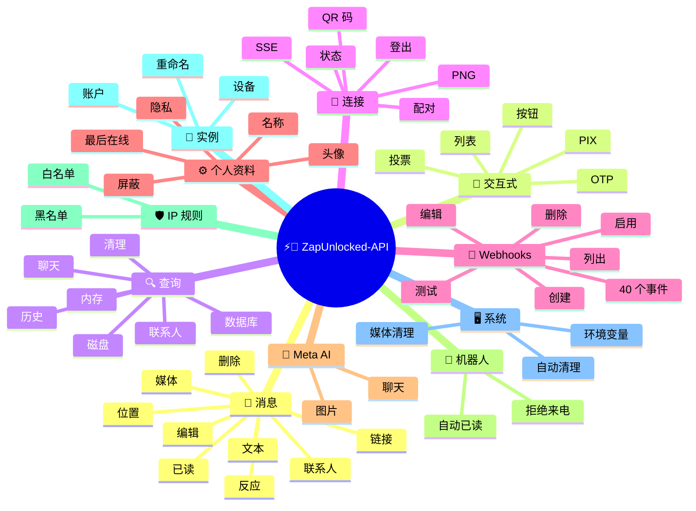
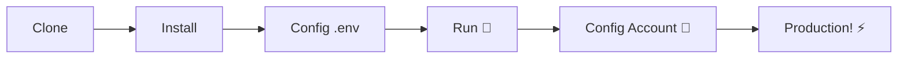

# ⚡💬 [ZapUnlocked-API](https://zapunlocked-api.kauafpss.com.br/)


<p align="center">
  
  <a href="https://downgit.github.io/#/home?url=https://github.com/kauafpssx/ZapUnlocked-API/blob/main/ZapUnlocked.collection.json">
    
  </a>
  
  
  
</p>

---

### 🌐 选择语言:

<table width="100%">
  <tr>
    <td align="center" valign="middle"><a href="https://github.com/kauafpssx/ZapUnlocked-API/blob/main/README.md"></a></td>
    <td align="center" valign="middle"><a href="https://github.com/kauafpssx/ZapUnlocked-API/blob/main/docs/translations/en.md"></a></td>
    <td align="center" valign="middle"><a href="https://github.com/kauafpssx/ZapUnlocked-API/blob/main/docs/translations/es.md"></a></td>
    <td align="center" valign="middle"><a href="https://github.com/kauafpssx/ZapUnlocked-API/blob/main/docs/translations/fr.md"></a></td>
    <td align="center" valign="middle"><a href="https://github.com/kauafpssx/ZapUnlocked-API/blob/main/docs/translations/de.md"></a></td>
    <td align="center" valign="middle"><a href="https://github.com/kauafpssx/ZapUnlocked-API/blob/main/docs/translations/zh.md"></a></td>
    <td align="center" valign="middle"><a href="https://github.com/kauafpssx/ZapUnlocked-API/blob/main/docs/translations/ja.md"></a></td>
    <td align="center" valign="middle"><a href="https://github.com/kauafpssx/ZapUnlocked-API/blob/main/docs/translations/ru.md"></a></td>
    <td align="center" valign="middle"><a href="https://github.com/kauafpssx/ZapUnlocked-API/blob/main/docs/translations/it.md"></a></td>
    <td align="center" valign="middle"><a href="https://github.com/kauafpssx/ZapUnlocked-API/blob/main/docs/translations/ar.md"></a></td>
    <td align="center" valign="middle"><a href="https://github.com/kauafpssx/ZapUnlocked-API/blob/main/docs/translations/tr.md"></a></td>
    <td align="center" valign="middle"><a href="https://github.com/kauafpssx/ZapUnlocked-API/blob/main/docs/translations/ko.md"></a></td>
    <td align="center" valign="middle"><a href="https://github.com/kauafpssx/ZapUnlocked-API/blob/main/docs/translations/hi.md"></a></td>
    <td align="center" valign="middle"><a href="https://github.com/kauafpssx/ZapUnlocked-API/blob/main/docs/translations/nl.md"></a></td>
  </tr>
</table>

---

##  什么是 ZapUnlocked-API？

WhatsApp API 市场收取高昂月费：每月几十到几百雷亚尔，附带使用限制、按对话收费、数据经过第三方服务器。**ZapUnlocked-API 是免费且开源的替代方案。**

使用 **Python** 和 **[Neonize](https://github.com/krypton-byte/neonize)** 构建，API 使用 FastAPI 管理会话、发送媒体、创建机器人。无需重型数据库、无需月费、无需第三方服务器。

> [!TIP]
> 用于机器人、通知和客户服务系统。**100% 免费。**

> [!IMPORTANT]
> 🤖 **Meta AI 已集成。** 使用 `/ai/ask` 聊天，使用 `/ai/imagine` 在 WhatsApp 内生成图像。[查看路由](#-meta-ai--2-endpoints)。

---

## 🗺️ API 概览



---

## ✨ 主要功能

| 功能 | 描述 |
| :------------- | :-------- |
| 🧩 **无状态按钮** | 使用加密 Webhook 创建无需数据库的交互流程 |
| 🔢 **无 QR 码配对** | 通过数字码连接 · 适用于无 GUI 的服务器 |
| 🎵 **自动音频转换** | 发送在原生 PTT 中显示为"刚刚录制"的音频 |
| 📦 **智能媒体队列** | 自动管理以防止过度内存消耗 |
| 🏷️ **动态占位符** | 使用 `{{name}}`、`{{day}}`、`{{phone}}` 自定义消息和 Webhook |

| 🤖 **Meta AI** | 在 WhatsApp 内与 AI 聊天并生成图像。 |
| ⌨️ **通用参数** | `delay_message`、`delay_typing`、`reply`/`quoted_id` 和 `@提及` 在**所有**发送端点上均有效。 |
| 🔐 **签名 Webhook** | 通过 HMAC-SHA256 确保完整性。您的 webhook 只接受合法数据。 |
| 🔄 **自动重连** | 在断开连接、远程注销或流错误时自动重新连接。 |
| 📁 **文件上传 + URL** | 通过直接上传**或**公共 URL 发送媒体。 |

> [!NOTE]
> 所有功能均为 **100% 免费**，由开源社区维护。

---

## 📋 API 路由

<details>
<summary><b>📨 发送消息</b> · 15 个端点</summary>

| 方法 | 路由 | 描述 | 请求体 |
| :----- | :--- | :-------- | :--- |
| `POST` | `/send` | 发送文本消息 / 回复 | `phone`, `message` |
| `POST` | `/send_image` | 发送图片 | `phone`, `image_url` |
| `POST` | `/send_video` | 发送视频（支持 GIF 和 PTV） | `phone`, `video_url` |
| `POST` | `/send_gif` | 发送动画 GIF | `phone`, `url` |
| `POST` | `/send_audio` | 发送音频（自动转换为 PTT） | `phone`, `audio_url` |
| `POST` | `/send_document` | 发送文档 | `phone`, `document_url` |
| `POST` | `/send_sticker` | 发送贴纸 | `phone`, `sticker_url` |
| `POST` | `/send_reaction` | 发送表情反应 | `phone`, `messageId`, `emoji` |
| `POST` | `/send_location` | 发送位置 | `phone`, `lat`, `lng` |
| `POST` | `/send_contact` | 发送联系人 | `phone`, `name`, `contactPhone` |
| `POST` | `/send_contacts` | 发送多个联系人 | `phone`, `contacts` |
| `POST` | `/send_link` | 发送带预览的链接 | `phone`, `url` |
| `POST` | `/messages/delete` | 删除消息 | `phone`, `messageId` |
| `POST` | `/messages/read` | 标记为已读 | `phone`, `messageIds` |
| `POST` | `/messages/edit` | 编辑已发送消息 | `phone`, `messageId`, `message` |

> [!TIP]
> **通用参数。** 适用于**每个**消息发送端点（包括交互式）：
>
> | 参数 | 功能 |
> | :-------- | :-- |
> | `delay_message` | 发送前等待 N 秒。 |
> | `delay_typing` | 发送前显示"正在输入..." N 秒。 |
> | `reply` / `quoted_id` | 要回复的消息 ID（引用）。 |
> | `mentioned` | 要 @提及 的电话号码 JSON 数组。示例：`["5511999999999"]` |

</details>

<details>
<summary><b>🔘 交互式消息</b> · 9 个端点</summary>

| 方法 | 路由 | 描述 | 请求体 |
| :----- | :--- | :-------- | :--- |
| `POST` | `/messages/send-button-list` | 选项列表按钮 | `phone`, `buttons` |
| `POST` | `/messages/send-button-quick-reply` | 快速回复按钮 | `phone`, `title`, `buttons` |
| `POST` | `/messages/send-button-otp` | 复制按钮（OTP） | `phone`, `code` |
| `POST` | `/messages/send-button-pix` | PIX 按钮 | `phone`, `pixKey` |
| `POST` | `/messages/send-button-url` | 链接按钮 | `phone`, `title`, `url` |
| `POST` | `/messages/send-button-call` | 呼叫按钮 | `phone`, `title`, `phoneNumber` |
| `POST` | `/messages/send-option-list` | ⛔ **暂时禁用**（不兼容 iPhone、Android 和 Web） | `phone`, `buttons` |
| `POST` | `/messages/send-poll` | 发送投票 | `phone`, `name`, `options` |
| `POST` | `/messages/send-poll-vote` | 参与投票 | `phone`, `options` |
</details>

<details>
<summary><b>🔍 查询与管理</b> · 12 个端点</summary>

| 方法 | 路由 | 描述 | 请求体 |
| :----- | :--- | :-------- | :--- |
| `POST` | `/management/fetch_messages` | 获取消息历史 | `phone` |
| `POST` | `/management/recent_contacts` | 列出最近聊天 | ❌ |
| `GET` | `/management/chats` | 列出有历史的聊天 | ❌ |
| `GET` | `/management/chats/{phone}/messages` | 指定聊天的消息 | ❌ |
| `GET` | `/management/contacts/{phone}` | 联系人详细信息 | ❌ |
| `GET` | `/management/groups` | 列出群组 | ❌ |
| `DELETE` | `/management/cleanup` | 清理聊天数据 | ❌ |
| `GET` | `/management/export` | 导出配置（webhooks, settings, IP rules） | ❌ |
| `POST` | `/management/import` | 通过文件上传导入配置 | `file` |
| `GET` | `/management/database/status` | 数据库状态和统计 | ❌ |
| `POST` | `/management/database/config` | 更新数据库设置 | `interval` |
| `POST` | `/management/database/cleanup` | 手动数据库清理 | ❌ |
</details>

<details>
<summary><b>👤 联系人</b> · 1 个端点</summary>

| 方法 | 路由 | 描述 | 请求体 |
| :----- | :--- | :-------- | :--- |
| `POST` | `/contacts/info` | 联系人详细信息 | `phone` |
</details>

<details>
<summary><b>🏠 常规 / 状态</b> · 9 个端点</summary>

| 方法 | 路由 | 描述 | 请求体 |
| :----- | :--- | :-------- | :--- |
| `GET` | `/` | 欢迎页面（HTML） | ❌ |
| `GET` | `/status` | 完整状态（WhatsApp, CPU, 内存, 磁盘） | ❌ |
| `GET` | `/status/stream` | 通过 SSE 实时状态 | ❌ |
| `GET` | `/status/health` | 简单健康检查（`{"ok":true}`） | ❌ |
| `GET` | `/status/readiness` | 就绪检查（WhatsApp 断开时返回 503） | ❌ |
| `GET` | `/status/memory` | 内存状态（进程 + 系统） | ❌ |
| `GET` | `/status/volume` | 磁盘状态（大小, 文件） | ❌ |
| `GET` | `/collection.json` | 下载 Postman Collection | ❌ |
| `POST` | `/collection.json` | 更新 Postman Collection | JSON body |
</details>

<details>
<summary><b>🔗 连接（QR）</b> · 2 个端点</summary>

| 方法 | 路由 | 描述 | 请求体 |
| :----- | :--- | :-------- | :--- |
| `GET` | `/qr` | 查看交互式二维码（HTML） | ❌ |
| `GET` | `/qr/image` | 获取二维码图片（PNG） | ❌ |
</details>

<details>
<summary><b>🔐 会话</b> · 2 个端点</summary>

| 方法 | 路由 | 描述 | 请求体 |
| :----- | :--- | :-------- | :--- |
| `POST` | `/session/pair` | 生成数字配对码 | `phone` |
| `POST` | `/session/logout` | 断开连接并重置会话 | ❌ |
</details>

<details>
<summary><b>📡 Webhooks（CRUD）</b> · 8 个端点</summary>

| 方法 | 路由 | 描述 | 请求体 |
| :----- | :--- | :-------- | :--- |
| `POST` | `/webhooks` | 创建命名 Webhook | `name`, `url` |
| `GET` | `/webhooks` | 列出所有 Webhook | ❌ |
| `GET` | `/webhooks/{name}` | 按名称获取 Webhook | ❌ |
| `PUT` | `/webhooks/{name}` | 编辑 Webhook | ❌ |
| `DELETE` | `/webhooks/{name}` | 删除 Webhook | ❌ |
| `POST` | `/webhooks/{name}/toggle` | 启用 / 禁用 | `active` |
| `POST` | `/webhooks/{name}/test` | 测试 Webhook | ❌ |
| `GET` | `/webhooks/events` | 列出事件类型（40 种） | ❌ |
</details>

<details>
<summary><b>⚙️ 个人资料与隐私</b> · 13 个端点</summary>

| 方法 | 路由 | 描述 | 请求体 |
| :----- | :--- | :-------- | :--- |
| `POST` | `/settings/profile` | 更改机器人名称和头像 | `name?`, `photo?` (Form) |
| `POST` | `/settings/block` | 屏蔽 / 解除屏蔽联系人 | `phone`, `action` |
| `PUT` | `/settings/privacy/last-seen` | 最后上线时间 | `value` |
| `PUT` | `/settings/privacy/online` | 在线状态 | `value` |
| `PUT` | `/settings/privacy/profile` | 头像可见性 | `value` |
| `PUT` | `/settings/privacy/status` | 状态可见性 | `value` |
| `PUT` | `/settings/privacy/read-receipts` | 已读回执 | `value` |
| `PUT` | `/settings/privacy/groups-add` | 谁可以添加至群组 | `value` |
| `PUT` | `/settings/privacy/call-add` | 谁可以添加至通话 | `value` |
| `PUT` | `/settings/privacy/about` | 个人说明 | `value?` |
| `PUT` | `/settings/privacy/disappearing-timer` | 临时消息计时器 | `value?` |
| `GET` | `/settings/ip-control` | 查看 IP 控制状态 | ❌ |
| `PUT` | `/settings/ip-control` | 启用/禁用 IP 控制 | `enabled` |
</details>

<details>
<summary><b>🤖 机器人设置</b> · 4 个端点</summary>

| 方法 | 路由 | 描述 | 请求体 |
| :----- | :--- | :-------- | :--- |
| `PUT` | `/settings/instance/call-reject-auto` | 自动拒绝来电 | `value` |
| `PUT` | `/settings/instance/call-reject-message` | 拒接来电消息 | `value` |
| `PUT` | `/settings/instance/auto-read-message` | 自动已读消息 | `value` |
| `GET` | `/settings/phone-code/{phone}` | 通过电话号码生成配对码 | ❌ |
</details>

<details>
<summary><b>📱 实例</b> · 3 个端点</summary>

| 方法 | 路由 | 描述 | 请求体 |
| :----- | :--- | :-------- | :--- |
| `GET` | `/instance/me` | 已连接账户数据 | ❌ |
| `GET` | `/instance/device` | 设备技术数据 | ❌ |
| `PUT` | `/instance/update-name` | 重命名实例 | `name` |
</details>

<details>
<summary><b>🛡️ IP 规则</b> · 5 个端点</summary>

| 方法 | 路由 | 描述 | 请求体 |
| :----- | :--- | :-------- | :--- |
| `GET` | `/settings/ip-rules` | 列出 IP 规则（白名单/黑名单） | ❌ |
| `POST` | `/settings/ip-rules/whitelist` | 添加 IP 到白名单 | `ip` |
| `POST` | `/settings/ip-rules/blacklist` | 添加 IP 到黑名单 | `ip` |
| `DELETE` | `/settings/ip-rules/whitelist/{ip}` | 从白名单删除 IP | ❌ |
| `DELETE` | `/settings/ip-rules/blacklist/{ip}` | 从黑名单删除 IP | ❌ |
</details>

<details>
<summary><b>🖥️ 系统</b> · 5 个端点</summary>

| 方法 | 路由 | 描述 | 请求体 |
| :----- | :--- | :-------- | :--- |
| `GET` | `/system/env` | 查看环境变量 | ❌ |
| `PUT` | `/system/env` | 更新环境变量 | ❌ |
| `POST` | `/system/cleanup/force` | 强制清理临时媒体 | ❌ |
| `GET` | `/system/cleanup/settings` | 查看自动清理设置 | ❌ |
| `PUT` | `/system/cleanup/settings` | 更新自动清理间隔 | ❌ |
</details>

<details>
<summary><b>📊 日志</b> · 3 个端点</summary>

| 方法 | 路由 | 描述 | 请求体 |
| :----- | :--- | :-------- | :--- |
| `GET` | `/logs/files` | 列出日志文件 | ❌ |
| `GET` | `/logs` | 查看带过滤器的日志 | ❌ |
| `POST` | `/logs/cleanup` | 强制压缩/清理日志 | ❌ |
</details>

<details>
<summary><b>📈 统计</b> · 6 个端点</summary>

| 方法 | 路由 | 描述 | 请求体 |
| :----- | :--- | :-------- | :--- |
| `GET` | `/stats` | 统计（运行时间, 消息, webhooks） | ❌ |
| `DELETE` | `/stats` | 重置统计 | ❌ |
| `GET` | `/stats/webhooks` | 所有 Webhook 的统计 | ❌ |
| `GET` | `/stats/webhooks/{name}` | 指定 Webhook 的统计 | ❌ |
| `DELETE` | `/stats/webhooks` | 重置所有 Webhook 统计 | ❌ |
| `DELETE` | `/stats/webhooks/{name}` | 重置指定 Webhook 统计 | ❌ |
</details>

<details>
<summary><b>🤖 Meta AI</b> · 2 个端点</summary>

| 方法 | 路由 | 描述 | 请求体 |
| :----- | :--- | :-------- | :--- |
| `POST` | `/ai/ask` | 向 Meta AI 提问 | `message` |
| `POST` | `/ai/imagine` | 使用 Meta AI 生成图片 | `prompt` |
</details>

<details>
<summary><b>🔐 多会话</b> · 7 个端点</summary>

| 方法 | 路由 | 描述 | 请求体 |
| :----- | :--- | :-------- | :--- |
| `GET` | `/sessions` | 列出所有会话 | ❌ |
| `POST` | `/sessions` | 创建新会话 | `name?` |
| `PUT` | `/sessions/{id}/rename` | 重命名会话 | `name` |
| `DELETE` | `/sessions/{id}` | 停用会话 | ❌ |
| `POST` | `/sessions/{id}/connect` | 连接会话 | ❌ |
| `POST` | `/sessions/{id}/disconnect` | 断开会话 | ❌ |
| `GET` | `/sessions/{id}/status` | 会话状态 | ❌ |
</details>

<details>
<summary><b>📡 Webhooks（日志）</b> · 3 个端点</summary>

| 方法 | 路由 | 描述 | 请求体 |
| :----- | :--- | :-------- | :--- |
| `GET` | `/webhooks/{name}/logs` | Webhook 投递日志 | ❌ |
| `DELETE` | `/webhooks/{name}/logs` | 清理 Webhook 日志 | ❌ |
| `DELETE` | `/webhooks/logs/all` | 清理所有 Webhook 日志 | ❌ |
</details>

> **总计：108 个端点**

---

## 📡 Webhook 事件

所有 Webhook 都会收到一个标准信封：

```json
{
  "event": "message.text",
  "timestamp": "2025-01-01T12:00:00Z",
  "data": { ... }
}
```

如果 Webhook 带有 `{{placeholders}}` 的自定义 `body`，则发送该 body 而非标准信封。

---

<details>
<summary><b>🏷️ 自定义 body 中可用的占位符</b></summary>

| 占位符 | 值 |
| :---------- | :---- |
| `{{from}}` | 发送者号码 |
| `{{text}}` | 消息文本 |
| `{{phone}}` | 同 `{{from}}` |
| `{{id}}` | 消息 ID |
| `{{requested}}` | 请求数量（fetchMessages） |
| `{{found}}` | 找到数量（fetchMessages） |
| `{{timestamp}}` | 当前 UTC 时间戳 |

</details>

---

<details>
<summary><b>📥 收到的消息</b> · 17 个事件</summary>

> **Media fields:** 媒体事件（`message.image`, `message.video`, `message.audio`, `message.document`, `message.sticker`）在 `RECEIVE_MEDIA_ENABLED=true` 时会包含额外字段：`mediaBase64`（文件的 base64）、`fileName`、`mimeType`、`mediaTooLarge`（布尔值，超过 `RECEIVE_MEDIA_MAX_SIZE_MB` 时为 true）。

收到的消息事件中的基础字段：

```json
{
  "messageId": "3EB0ABCDEF123456",
  "from": "5511999999999",
  "fromName": "João Silva",
  "fromJid": "5511999999999@s.whatsapp.net",
  "isGroup": false
}
```

<details>
<summary><code>message.text</code> - 纯文本 / 格式化文本</summary>

```json
{
  "event": "message.text",
  "data": {
    "...base": "...",
    "text": "Olá! Como posso ajudar?",
    "quoted": { "id": "3EB0...", "fromMe": true }
  }
}
```
</details>

<details>
<summary><code>message.image</code> - 收到图片</summary>

```json
{
  "event": "message.image",
  "data": {
    "...base": "...",
    "caption": "Foto do produto",
    "mimetype": "image/jpeg",
    "fileLength": 204800
  }
}
```
</details>

<details>
<summary><code>message.video</code> - 收到视频</summary>

```json
{
  "event": "message.video",
  "data": {
    "...base": "...",
    "caption": "Veja esse vídeo!",
    "mimetype": "video/mp4",
    "fileLength": 5242880,
    "isPTT": false,
    "isGif": false
  }
}
```
</details>

<details>
<summary><code>message.audio</code> - 音频 / 语音消息</summary>

```json
{
  "event": "message.audio",
  "data": {
    "...base": "...",
    "mimetype": "audio/ogg; codecs=opus",
    "fileLength": 30720,
    "isPTT": true,
    "durationSeconds": 8
  }
}
```
</details>

<details>
<summary><code>message.document</code> - 文档 / 文件</summary>

```json
{
  "event": "message.document",
  "data": {
    "...base": "...",
    "fileName": "contrato.pdf",
    "caption": "Segue o contrato",
    "mimetype": "application/pdf",
    "fileLength": 102400
  }
}
```
</details>

<details>
<summary><code>message.sticker</code> - 贴纸</summary>

```json
{
  "event": "message.sticker",
  "data": {
    "...base": "...",
    "mimetype": "image/webp",
    "isAnimated": false
  }
}
```
</details>

<details>
<summary><code>message.contact</code> - 分享的联系人</summary>

```json
{
  "event": "message.contact",
  "data": {
    "...base": "...",
    "displayName": "Maria Souza",
    "vcard": "BEGIN:VCARD\nVERSION:3.0\n..."
  }
}
```
</details>

<details>
<summary><code>message.contacts</code> - 多个联系人</summary>

```json
{
  "event": "message.contacts",
  "data": {
    "...base": "...",
    "displayName": "2 contacts",
    "count": 2,
    "contacts": [
      { "displayName": "Maria Souza", "vcard": "BEGIN:VCARD\n..." },
      { "displayName": "João Silva", "vcard": "BEGIN:VCARD\n..." }
    ]
  }
}
```
</details>

<details>
<summary><code>message.location</code> - 位置</summary>

```json
{
  "event": "message.location",
  "data": {
    "...base": "...",
    "lat": -23.5505,
    "lng": -46.6333,
    "name": "Av. Paulista",
    "address": "Av. Paulista, 1000 - São Paulo"
  }
}
```
</details>

<details>
<summary><code>message.reaction</code> - 反应（表情符号）</summary>

```json
{
  "event": "message.reaction",
  "data": {
    "...base": "...",
    "emoji": "❤️",
    "targetMessageId": "3EB0ABCDEF123456",
    "isRemoved": false
  }
}
```
</details>

<details>
<summary><code>message.poll_created</code> - 收到投票</summary>

```json
{
  "event": "message.poll_created",
  "data": {
    "...base": "...",
    "pollName": "Qual o melhor sabor?",
    "options": ["Chocolate", "Morango", "Baunilha"]
  }
}
```
</details>

<details>
<summary><code>message.poll_vote</code> - 投票</summary>

```json
{
  "event": "message.poll_vote",
  "data": {
    "...base": "...",
    "pollId": "3EB0ABCDEF123456",
    "selectedOptions": ["Chocolate"]
  }
}
```
</details>

<details>
<summary><code>message.button_reply</code> - 按钮点击</summary>

```json
{
  "event": "message.button_reply",
  "data": {
    "...base": "...",
    "buttonId": "opcao_sim",
    "displayText": "Sim",
    "type": "quick_reply"
  }
}
```
</details>

<details>
<summary><code>message.list_reply</code> - 交互式列表选择</summary>

```json
{
  "event": "message.list_reply",
  "data": {
    "...base": "...",
    "rowId": "1",
    "title": "X-Burguer",
    "description": "R$ 18,90"
  }
}
```
</details>

<details>
<summary><code>message.deleted</code> - 发送者删除的消息</summary>

```json
{
  "event": "message.deleted",
  "data": {
    "...base": "..."
  }
}
```
</details>

<details>
<summary><code>message.unknown</code> - 未映射类型</summary>

```json
{
  "event": "message.unknown",
  "data": {
    "...base": "...",
    "rawType": "senderKeyDistributionMessage"
  }
}
```
</details>

<details>
<summary><code>message.undecryptable</code> - 无法解密的消息</summary>

```json
{
  "event": "message.undecryptable",
  "data": {
    "...base": "..."
  }
}
```
</details>

</details>

<details>
<summary><b>📤 已发送的消息</b> · 22 个事件</summary>

<details>
<summary><code>message.sent</code> - 消息已发送（通用）</summary>

```json
{
  "event": "message.sent",
  "data": {
    "to": "5511999999999",
    "type": "text",
    "messageId": "3EB0ABCDEF123456"
  }
}
```
</details>

<details>
<summary><code>message.sent.{type}</code> - 按类型的特定事件</summary>

与 `message.sent` 相同的 payload，但使用特定事件名称。适用于订阅单一发送类型。

类型: `text`, `image`, `audio`, `video`, `document`, `sticker`, `gif`, `interactive`, `list`, `poll`, `poll_vote`, `location`, `contact`, `contacts`, `link`, `reaction`, `edit`, `delete`

```json
{
  "event": "message.sent.image",
  "data": {
    "to": "5511999999999",
    "type": "image",
    "messageId": "3EB0ABCDEF123456"
  }
}
```
</details>

<details>
<summary><code>message.delivered</code> - 消息已送达收件人（receipt type 1）</summary>

```json
{
  "event": "message.delivered",
  "data": {
    "from": "5511999999999",
    "messageId": "3EB0ABCDEF123456"
  }
}
```
</details>

<details>
<summary><code>message.read</code> - 收件人已读消息（receipt type 4）</summary>

```json
{
  "event": "message.read",
  "data": {
    "from": "5511999999999",
    "messageId": "3EB0ABCDEF123456"
  }
}
```
</details>

<details>
<summary><code>message.receipt</code> - 其他类型的回执（receipt types 2, 3, 5+）</summary>

```json
{
  "event": "message.receipt",
  "data": {
    "from": "5511999999999",
    "messageId": "3EB0ABCDEF123456",
    "receiptType": 2
  }
}
```
</details>

</details>

<details>
<summary><b>🔗 连接</b> · 11 个事件</summary>

<details>
<summary><code>connection.connected</code> - WhatsApp 已连接</summary>

```json
{
  "event": "connection.connected",
  "data": {
    "phone": "5511999999999"
  }
}
```
</details>

<details>
<summary><code>connection.disconnected</code> - WhatsApp 已断开</summary>

```json
{
  "event": "connection.disconnected",
  "data": {}
}
```
</details>

<details>
<summary><code>connection.qr_ready</code> - QR 码已生成</summary>

```json
{
  "event": "connection.qr_ready",
  "data": {
    "qr": "2@abc123..."
  }
}
```
</details>

<details>
<summary><code>connection.pair_code</code> - 配对码已生成</summary>

```json
{
  "event": "connection.pair_code",
  "data": {
    "code": "ABCD-1234",
    "connected": false
  }
}
```

`connected: true` 表示配对已完成。
</details>

<details>
<summary><code>connection.pair_status</code> - 配对状态</summary>

```json
{
  "event": "connection.pair_status",
  "data": {
    "jid": "5511999999999@s.whatsapp.net",
    "businessName": "My Business",
    "platform": "WEB",
    "status": "OK",
    "error": ""
  }
}
```
</details>

<details>
<summary><code>connection.logged_out</code> - 会话远程终止</summary>

```json
{
  "event": "connection.logged_out",
  "data": {
    "reason": "User logout"
  }
}
```
</details>

<details>
<summary><code>connection.connect_failure</code> - 连接失败</summary>

```json
{
  "event": "connection.connect_failure",
  "data": {
    "reason": "ERROR_CONNECT",
    "message": "Connection timed out"
  }
}
```
</details>

<details>
<summary><code>connection.stream_error</code> - 流错误</summary>

```json
{
  "event": "connection.stream_error",
  "data": {
    "code": "STREAM_ERR"
  }
}
```
</details>

<details>
<summary><code>connection.temporary_ban</code> - 临时封禁</summary>

```json
{
  "event": "connection.temporary_ban",
  "data": {
    "code": "BAN_CODE",
    "expire": 1704153600
  }
}
```
</details>

<details>
<summary><code>connection.client_outdated</code> - 客户端已过期</summary>

```json
{
  "event": "connection.client_outdated",
  "data": {}
}
```
</details>

<details>
<summary><code>connection.stream_replaced</code> - 流被替换</summary>

```json
{
  "event": "connection.stream_replaced",
  "data": {}
}
```
</details>

</details>

<details>
<summary><b>👥 群组</b> · 2 个事件</summary>

<details>
<summary><code>group.join</code> - 机器人加入群组</summary>

```json
{
  "event": "group.join",
  "data": {
    "groupId": "123456789@g.us",
    "groupName": "My Group",
    "reason": "invite",
    "type": ""
  }
}
```
</details>

<details>
<summary><code>group.update</code> - 群组已更新</summary>

```json
{
  "event": "group.update",
  "data": {
    "groupId": "123456789@g.us",
    "sender": "5511999999999@s.whatsapp.net",
    "name": "New Group Name",
    "topic": "New description",
    "locked": false,
    "announce": false,
    "ephemeral": 604800,
    "delete": false,
    "link": null,
    "unlink": null,
    "newInviteLink": "https://chat.whatsapp.com/abc123"
  }
}
```
</details>

</details>

<details>
<summary><b>👤 联系人 / 状态</b> · 4 个事件</summary>

<details>
<summary><code>contact.presence</code> - 联系人状态</summary>

```json
{
  "event": "contact.presence",
  "data": {
    "from": "5511999999999",
    "fromJid": "5511999999999@s.whatsapp.net",
    "status": "online",
    "lastSeen": 0
  }
}
```

`status`: `"online"` 或 `"offline"`。
</details>

<details>
<summary><code>contact.chat_presence</code> - 输入状态</summary>

```json
{
  "event": "contact.chat_presence",
  "data": {
    "from": "5511999999999",
    "fromJid": "5511999999999@s.whatsapp.net",
    "state": "typing",
    "media": null
  }
}
```

`state`: `"typing"`、`"recording"` 或 `"paused"`。
</details>

<details>
<summary><code>contact.picture_change</code> - 头像已更改</summary>

```json
{
  "event": "contact.picture_change",
  "data": {
    "from": "5511999999999",
    "fromJid": "5511999999999@s.whatsapp.net",
    "author": "5511999999999@s.whatsapp.net",
    "action": "changed"
  }
}
```

`action`: `"changed"` 或 `"removed"`。
</details>

<details>
<summary><code>contact.identity_change</code> - 安全密钥已更改</summary>

```json
{
  "event": "contact.identity_change",
  "data": {
    "from": "5511999999999",
    "fromJid": "5511999999999@s.whatsapp.net",
    "implicit": false,
    "timestamp": 1704067200
  }
}
```
</details>

</details>

<details>
<summary><b>📞 通话</b> · 3 个事件</summary>

<details>
<summary><code>call.received</code> - 收到来电</summary>

```json
{
  "event": "call.received",
  "data": {
    "from": "5511999999999",
    "fromJid": "5511999999999@s.whatsapp.net",
    "callId": "ABC123DEF456"
  }
}
```
</details>

<details>
<summary><code>call.accepted</code> - 通话已接受</summary>

```json
{
  "event": "call.accepted",
  "data": {
    "from": "5511999999999",
    "callId": "ABC123DEF456"
  }
}
```
</details>

<details>
<summary><code>call.terminated</code> - 通话已结束</summary>

```json
{
  "event": "call.terminated",
  "data": {
    "from": "5511999999999",
    "callId": "ABC123DEF456",
    "reason": "timeout"
  }
}
```
</details>

</details>

<details>
<summary><b>🧹 媒体清理</b> · 1 个事件</summary>

<details>
<summary><code>media.cleanup.completed</code> - 自动媒体清理已执行</summary>

```json
{
  "event": "media.cleanup.completed",
  "data": {
    "filesRemoved": 12,
    "remainingBytes": 52428800
  }
}
```

每小时自动执行一次。`filesRemoved: 0` 表示没有文件被删除。
</details>

</details>

<details>
<summary><b>🤖 AI</b> · 1 个事件</summary>

<details>
<summary><code>ai.response</code> - 收到 Meta AI 响应</summary>

```json
{
  "event": "ai.response",
  "data": {
    "text": "Brasília!",
    "hasImage": false,
    "imageBase64": null,
    "imageUrl": null,
    "mimeType": null,
    "messageId": "3EB0ABCDEF123456"
  }
}
```

每当 Meta AI 响应时触发。用于处理异步响应（`POST /ai/ask` 有 30 秒超时）。
</details>

</details>

---

## 🛠️ 安装与托管

> 使用 **ZapUnlocked-API** 在**5 分钟**内上线您的专业 WhatsApp API。

### 💻 本地安装

适合开发、测试或在自有服务器上运行。



**1. 克隆仓库**

```bash
git clone https://github.com/kauafpssx/ZapUnlocked-API.git
cd ZapUnlocked-API
```

**2. 安装依赖**

| 系统 | 命令 |
| :------ | :------ |
| 🪟 Windows | `scripts\install\install.bat` |
| 🐧 Linux / macOS | `bash scripts/install/install.sh` |

**3. 配置环境**

| 系统 | 命令 |
| :------ | :------ |
| 🪟 Windows | `scripts\generate-env\generate-env.bat` |
| 🐧 Linux / macOS | `bash scripts/generate-env/generate-env.sh` |

| 变量 | 描述 |
| :------- | :-------- |
| `API_KEY` | 所有端点的认证密码 |
| `INTERNAL_SECRET` | 用于验证 Webhook 签名的令牌 |
| `PORT` | API 端口（默认: `8300`） |

**4. 运行 API**

| 系统 | 命令 |
| :------ | :------ |
| 🪟 Windows | `scripts\run\run.bat` |
| 🐧 Linux / macOS | `bash scripts/run/run.sh` |

---

### ☁️ 托管: Alwaysdata（免费 24/7）

**Alwaysdata** 是推荐的托管方案，可稳定免费运行 API，无需保持电脑开机。

<details>
<summary><b>📊 查看资源和步骤</b></summary>

#### 📊 免费计划资源

| 资源 | 免费版可用 |
| :------ | :----------------- |
| 💾 存储 | **1 GB SSD** |
| 🧠 内存 | **256 MB** |
| ⚡ CPU | **1/4 vCPU** |
| 🔄 备份 | **3 天**自动备份 |
| 📡 在线时间 | 通过 Services **24/7** |

#### 👣 部署步骤

**1.** 在 [Alwaysdata.com](https://www.alwaysdata.com/) 创建账户 · **Free** 计划。

**2.** 通过 SSH 访问: `https://ssh-[用户名].alwaysdata.net`。

**3.** 克隆并安装:

```bash
git clone https://github.com/kauafpssx/ZapUnlocked-API.git ~/ZapUnlocked-API
cd ~/ZapUnlocked-API
bash scripts/install/install.sh
```

**4.** *（可选）* 生成 `.env`:

```bash
bash scripts/generate-env/generate-env.sh
```

> [!NOTE]
> 安装脚本已询问是否要配置 `.env`。如果回答了**是**，可跳过此步骤。否则，运行上方命令或手动配置 `.env`。

**5.** 配置服务（24/7）: **Advanced › Services › Add a service**:

| 字段 | 值 |
| :---- | :---- |
| **Command** | `bash scripts/run/run.sh` |
| **Working directory** | `ZapUnlocked-API` |
| **Environment variables** | `PORT=8300` |

**6.** 访问地址:

```
http://services-[用户名].alwaysdata.net:8300/
```

> [!TIP]
> URL 已可外部访问。*(可选)* 如需使用自定义域名，请在 **Web › Sites › Add a site** 配置 **Reverse Proxy**，指向 `http://[用户名].alwaysdata.net`。

---

#### 🔐 身份验证（登录）

部署后，在浏览器中访问以下地址以连接您的 WhatsApp 账户:

```text
http://services-[用户名].alwaysdata.net:8300/qr?API_KEY=您的密钥
```

</details>

---

<details>
<summary><b>📌 其他信息</b> · 环境变量、时区、发送参数、批量发送、媒体接收器</summary>

### 🌐 完整环境变量

除 `API_KEY`、`INTERNAL_SECRET` 和 `PORT` 外的额外 `.env` 变量:

| 变量 | 默认值 | 描述 |
| :------- | :----- | :-------- |
| `PUBLIC_URL` | auto | 用于日志中 `/qr` 面板链接的公共 URL |
| `TZ` | `UTC` | 时间戳的时区（例如 `America/Sao_Paulo`） |
| `DRY_RUN` | `false` | 测试模式，拦截发送而不调用 WhatsApp |
| `RECEIVE_MEDIA_ENABLED` | `false` | 自动下载接收到的媒体到 `temp_media/` |
| `RECEIVE_MEDIA_MAX_SIZE_MB` | `15` | 接收媒体的最大大小 (MB) |
| `CORS_ORIGINS` | `*` | 允许的来源（逗号分隔） |
| `ENABLE_WHATSAPP` | `1` | 禁用 WhatsApp 机器人（`0` 用于测试） |
| `ENABLE_FFMPEG_WARMUP` | `1` | 禁用 FFmpeg 预热（`0`） |
| `MAX_UPLOAD_SIZE_MB` | `500` | 每次上传的最大文件大小 |
| `CLEANUP_MAX_AGE_DAYS` | `7` | `temp_media/` 中文件的最大保留天数 |
| `CLEANUP_MAX_SIZE_MB` | `500` | `temp_media/` 的最大总大小 |
| `LOG_MAX_AGE_DAYS` | `30` | 压缩日志的最大保留天数 |
| `LOG_MAX_SIZE_MB` | `50` | 日志的最大总大小 |
| `META_AI_PHONE` | auto | 覆盖 Meta AI 电话号码 |
| `META_AI_TIMEOUT` | `30` | Meta AI 响应超时（秒） |
| `META_AI_KEEP_IMAGES` | `false` | 将 Meta AI 图像保存到磁盘 |
| `ALWAYSDATA_ACCOUNT` | auto | 强制 Alwaysdata 环境 |

---

### 🕐 时区

每个发送端点返回带偏移量的 ISO 8601 格式的 `timestamp`。按优先级配置:

1. 项目根目录下的 `timezone.conf` 文件（第一个未注释的行）
2. `.env` 或环境变量中的 `TZ`
3. 默认: `UTC`

常见值: `America/Sao_Paulo`、`America/New_York`、`Europe/London`、`Asia/Tokyo`。

```json
{
  "success": true,
  "message": "Message sent.",
  "messageId": "3EB0ABCDEF123456",
  "timestamp": "2026-06-15T14:30:00-0300"
}
```

---

### ✏️ 动态文本格式化

发送时替换的占位符:

| 占位符 | 替换为 |
| :---------- | :-------------- |
| `{{day}}` | 当前日期 (01-31) |
| `{{mon}}` | 当前月份 (01-12) |
| `{{yea}}` | 当前年份 (2026) |
| `{{hou}}` | 当前小时 (00-23) |
| `{{min}}` | 当前分钟 (00-59) |
| `{{sec}}` | 当前秒 (00-59) |

```json
{
  "phone": "5511999999999",
  "message": "今天是 {{yea}}年{{mon}}月{{day}}日 {{hou}}:{{min}}:{{sec}}"
}
```

结果: `"今天是 2026年06月15日 14:30:00"`

---

### 🧪 DRY_RUN 模式

`.env` 中的 `DRY_RUN=true` 使所有发送端点返回成功而不调用 WhatsApp。响应包含 `"dryRun": true`、`"messageId": null`。

用途: 集成测试、CI/CD、验证 payload。

```json
{
  "success": true,
  "dryRun": true,
  "message": "Message sent.",
  "messageId": null,
  "timestamp": "2026-06-15T14:30:00-0300"
}
```

---

### ⚙️ 发送端点的可选参数

在所有 `/send/*`、`/send/media`、`/send/buttons/*` 端点上可用:

| 参数 | 类型 | 描述 |
| :-------- | :--- | :-------- |
| `quoted_id` | `string` | 要回复的消息 ID |
| `delay_message` | `number` | 发送前的延迟秒数 |
| `delay_typing` | `number` | 模拟输入 X 秒 |
| `mentioned` | `string[]` | 要提及的电话号码 (@mention) |

```json
{
  "phone": "5511999999999",
  "message": "你好 @5511888888888！",
  "quoted_id": "3EB0ABC123",
  "delay_message": 2,
  "delay_typing": 3,
  "mentioned": ["5511888888888"]
}
```

> [!NOTE]
> `quoted_id` 接受消息 ID（`type: "id"`）或要搜索的文本（`type: "text"`）。如果本地历史中未找到该 ID，API 会创建一个占位符，WhatsApp 仍会渲染引用。

---

### 📦 批量发送

`POST /send/bulk` 将同一条消息发送到多个号码:

| 参数 | 类型 | 必填 | 描述 |
| :-------- | :--- | :---------- | :-------- |
| `phones` | `string[]` | ✅ | 号码数组 |
| `message` | `string` | ✅ | 消息文本 |
| `delay_message` | `number` | ❌ | 每次发送前的延迟 |
| `delay_typing` | `number` | ❌ | 模拟输入 |
| `delay_between` | `number` | ❌ | 号码之间的延迟 |
| `mentioned` | `string[]` | ❌ | 提及 |

```json
{
  "phones": ["5511999999999", "5511888888888", "5511777777777"],
  "message": "限时抢购！🔥",
  "delay_between": 3,
  "delay_typing": 2
}
```

---

### 📥 媒体接收器

当 `RECEIVE_MEDIA_ENABLED=true` 时，API 会下载接收到的媒体（图片、视频、音频、文档、贴纸）并将 `mediaUrl` 添加到 webhook:

```json
{
  "event": "message.upsert",
  "data": {
    "key": { "remoteJid": "5511999999999@s.whatsapp.net" },
    "message": { "imageMessage": {} },
    "mediaUrl": "http://services-用户名.alwaysdata.net:8300/media/uuid-文件.jpg"
  }
}
```

文件存储在 `temp_media/` 中，由自动调度程序清理。

---

### 🧹 自动清理 (temp_media)

`temp_media/` 的清理每小时运行一次。达到任一条件时触发:

* 文件超过 `CLEANUP_MAX_AGE_DAYS`（默认: 7 天）
* 总大小超过 `CLEANUP_MAX_SIZE_MB`（默认: 500 MB）

触发 webhook `media.cleanup.completed`，包含 `filesRemoved` 和 `remainingBytes`。

</details>

---

## 📖 官方文档

<p align="center">
  👉 <a href="https://zapunlocked-api.kauafpss.com.br"><strong>zapunlocked-api.kauafpss.com.br</strong></a>
</p>

详细技术文档、代码示例和交互式测试平台，请访问官方网站。

> [!TIP]
> 使用 **LLMs.txt** 作为 AI 索引: [`zapunlocked-api.kauafpss.com.br/llms.txt`](https://zapunlocked-api.kauafpss.com.br/llms.txt)。在探索前发现所有页面。

---

## ❤️ 致谢与鸣谢

| 项目 | 描述 |
| :------ | :-------- |
| [](https://github.com/krypton-byte/neonize) | 用于原生连接 WhatsApp Web 的 Python 库 |
| [](https://github.com/tulir/whatsmeow) | Neonize 的 Go 基础库 · 连接的核心 |
| [](https://www.alwaysdata.com/) | 高质量的免费基础设施 |

---

## 📄 许可证

本项目采用 **MIT 许可证** 授权。

<p align="center">
  由 <a href="https://www.instagram.com/kauafpss_/">Kauã Ferreira</a> 用 💜 制作
</p>
