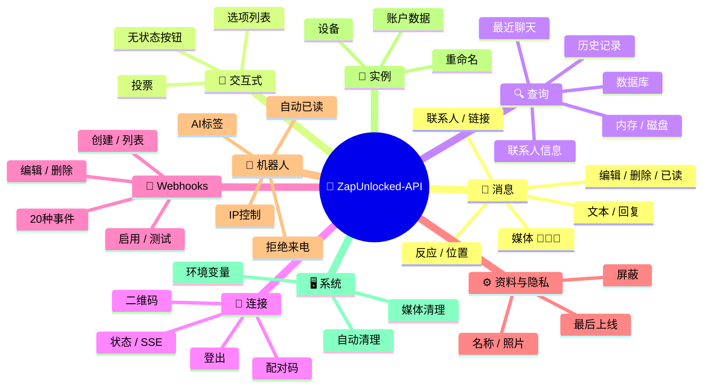
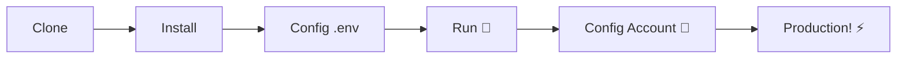

# 🚀 [ZapUnlocked-API](https://zapunlocked-api.kauafpss.com.br) 📲✨


<p align="center">
  
  
  
  
  
</p>

---

### 🌐 选择语言:

<table width="100%">
  <tr>
    <td align="center" valign="middle"><a href="https://github.com/kauafpssx/ZapUnlocked-API/blob/main/README.MD"></a></td>
    <td align="center" valign="middle"><a href="https://github.com/kauafpssx/ZapUnlocked-API/blob/main/docs/translations/en.md"></a></td>
    <td align="center" valign="middle"><a href="https://github.com/kauafpssx/ZapUnlocked-API/blob/main/docs/translations/es.md"></a></td>
    <td align="center" valign="middle"><a href="https://github.com/kauafpssx/ZapUnlocked-API/blob/main/docs/translations/fr.md"></a></td>
    <td align="center" valign="middle"><a href="https://github.com/kauafpssx/ZapUnlocked-API/blob/main/docs/translations/de.md"></a></td>
    <td align="center" valign="middle"><a href="https://github.com/kauafpssx/ZapUnlocked-API/blob/main/docs/translations/ja.md"></a></td>
    <td align="center" valign="middle"><a href="https://github.com/kauafpssx/ZapUnlocked-API/blob/main/docs/translations/ru.md"></a></td>
    <td align="center" valign="middle"><a href="https://github.com/kauafpssx/ZapUnlocked-API/blob/main/docs/translations/it.md"></a></td>
    <td align="center" valign="middle"><a href="https://github.com/kauafpssx/ZapUnlocked-API/blob/main/docs/translations/ar.md"></a></td>
    <td align="center" valign="middle"><a href="https://github.com/kauafpssx/ZapUnlocked-API/blob/main/docs/translations/tr.md"></a></td>
    <td align="center" valign="middle"><a href="https://github.com/kauafpssx/ZapUnlocked-API/blob/main/docs/translations/ko.md"></a></td>
    <td align="center" valign="middle"><a href="https://github.com/kauafpssx/ZapUnlocked-API/blob/main/docs/translations/hi.md"></a></td>
    <td align="center" valign="middle"><a href="https://github.com/kauafpssx/ZapUnlocked-API/blob/main/docs/translations/nl.md"></a></td>
  </tr>
</table>

---

##  什么是 ZapUnlocked-API？

WhatsApp API市场收取高昂的月费：每月数十到数百雷亚尔，附带使用限制、按对话收费以及数据经过第三方服务器。**ZapUnlocked-API 的存在就是为了改变这一现状。**

基于 **Python** 构建，使用 **[Neonize](https://github.com/krypton-byte/neonize)** 作为连接引擎，本API提供简单的REST接口（FastAPI）来管理会话、发送复杂媒体以及创建智能交互。**无需重型数据库，无需月费，不依赖任何第三方。**

我们的理念基于**技术卓越**和**开发者独立性**。我们相信强大的工具应该对构建自己解决方案的人开放。

> [!TIP]
> 非常适合需要快速集成机器人、通知和自动化客服系统的开发者。**完全免费。**

---

## 🗺️ API概览



---

## ✨ 主要功能

| 功能 | 描述 |
| :--- | :--- |
| 🧩 **无状态按钮** | 使用加密的Webhook创建无需数据库的交互流程 |
| 🔢 **无QR码配对** | 通过数字码连接 · 适用于无GUI服务器 |
| 🎵 **自动音频转换** | 发送在原生PTT中显示为"刚刚录制"的音频 |
| 📦 **智能媒体队列** | 自动管理以防止过度内存消耗 |
| 🏷️ **动态占位符** | 使用 `{{name}}`、`{{day}}`、`{{phone}}` 自定义消息和Webhook |

> [!NOTE]
> 所有功能均为**100%免费**，由开源社区维护。

---

## 📋 API路由

<details>
<summary><b>📨 发送消息</b> · 14个端点</summary>

| 方法 | 路由 | 描述 |
| :--- | :--- | :--- |
| `POST` | `/send` | 发送文本消息 / 回复 |
| `POST` | `/send_image` | 发送图片 |
| `POST` | `/send_video` | 发送视频（支持GIF和PTV） |
| `POST` | `/send_audio` | 发送音频（自动PTT转换） |
| `POST` | `/send_document` | 发送文档 |
| `POST` | `/send_sticker` | 发送贴纸 |
| `POST` | `/send_reaction` | 发送表情反应 |
| `POST` | `/send_location` | 发送位置 |
| `POST` | `/send_contact` | 发送联系人 |
| `POST` | `/send_contacts` | 发送多个联系人 |
| `POST` | `/send_link` | 发送带预览的链接 |
| `POST` | `/messages/delete` | 删除消息 |
| `POST` | `/messages/read` | 标记为已读 |
| `POST` | `/messages/edit` | 编辑已发送消息 |
</details>

<details>
<summary><b>🔘 交互式消息</b> · 4个端点</summary>

| 方法 | 路由 | 描述 |
| :--- | :--- | :--- |
| `POST` | `/send_wbuttons` | 发送按钮（列表、操作、OTP、PIX） |
| `POST` | `/messages/send-option-list` | 发送选项列表 |
| `POST` | `/messages/send-poll` | 发送投票 |
| `POST` | `/messages/send-poll-vote` | 参与投票 |
</details>

<details>
<summary><b>🔍 查询与管理</b> · 7个端点</summary>

| 方法 | 路由 | 描述 |
| :--- | :--- | :--- |
| `POST` | `/contacts/info` | 联系人详细信息 |
| `POST` | `/management/fetch_messages` | 获取消息历史 |
| `POST` | `/management/recent_contacts` | 列出最近聊天 |
| `GET` | `/management/memory` | 内存使用状态 |
| `GET` | `/management/volume_stats` | 检查磁盘使用情况 |
| `GET` | `/management/database/status` | 数据库状态和统计 |
| `POST` | `/management/database/cleanup` | 手动数据库清理 |
</details>

<details>
<summary><b>🔗 连接与会话</b> · 8个端点</summary>

| 方法 | 路由 | 描述 |
| :--- | :--- | :--- |
| `GET` | `/` | 欢迎页面（HTML） |
| `GET` | `/status` | 连接和会话状态 |
| `GET` | `/status/stream` | 实时状态（SSE） |
| `GET` | `/qr` | 查看交互式二维码 |
| `GET` | `/qr/image` | 获取二维码图片（Base64） |
| `POST` | `/qr/pair` | 生成数字配对码 |
| `GET` | `/settings/phone-code/{phone}` | 通过电话号码生成配对码 |
| `POST` | `/qr/logout` | 断开连接并重置会话 |
</details>

<details>
<summary><b>📡 Webhooks（CRUD）</b> · 7个端点</summary>

| 方法 | 路由 | 描述 |
| :--- | :--- | :--- |
| `POST` | `/webhooks` | 创建命名Webhook |
| `GET` | `/webhooks` | 列出所有Webhook |
| `PUT` | `/webhooks/{name}` | 编辑Webhook |
| `DELETE` | `/webhooks/{name}` | 删除Webhook |
| `POST` | `/webhooks/{name}/toggle` | 启用 / 禁用 |
| `POST` | `/webhooks/{name}/test` | 测试Webhook |
| `GET` | `/webhooks/events` | 列出事件类型（20种） |
</details>

<details>
<summary><b>⚙️ 资料与隐私</b> · 3个端点</summary>

| 方法 | 路由 | 描述 |
| :--- | :--- | :--- |
| `POST` | `/settings/profile` | 更改机器人名称和头像 |
| `POST` | `/settings/privacy` | 调整隐私设置（最后上线等） |
| `POST` | `/settings/block` | 屏蔽 / 解除屏蔽联系人 |
</details>

<details>
<summary><b>🤖 机器人设置</b> · 5个端点</summary>

| 方法 | 路由 | 描述 |
| :--- | :--- | :--- |
| `GET` | `/settings/bot` | 查看机器人设置 |
| `POST` | `/settings/bot` | 更新机器人设置（AI标签、IP控制） |
| `PUT` | `/settings/instance/call-reject-auto` | 自动拒绝来电 |
| `PUT` | `/settings/instance/call-reject-message` | 拒接来电消息 |
| `PUT` | `/settings/instance/auto-read-message` | 自动已读消息 |
</details>

<details>
<summary><b>📱 实例</b> · 3个端点</summary>

| 方法 | 路由 | 描述 |
| :--- | :--- | :--- |
| `GET` | `/instance/me` | 已连接账户数据 |
| `GET` | `/instance/device` | 设备技术数据 |
| `PUT` | `/instance/update-name` | 重命名实例 |
</details>

<details>
<summary><b>🖥️ 系统</b> · 5个端点</summary>

| 方法 | 路由 | 描述 |
| :--- | :--- | :--- |
| `GET` | `/system/env` | 查看环境变量 |
| `PUT` | `/system/env` | 更新环境变量 |
| `POST` | `/system/cleanup/force` | 强制清理临时媒体 |
| `GET` | `/system/cleanup/settings` | 查看自动清理设置 |
| `PUT` | `/system/cleanup/settings` | 更新自动清理间隔 |
</details>

> **共56个端点** · 用于WhatsApp自动化的完整REST API。

---

## 🛠️ 安装与托管

> 使用 **ZapUnlocked-API** 在**5分钟**内上线您的专业WhatsApp API。

### 💻 本地安装

适合开发、测试或在自有服务器上运行。



**1. 克隆仓库**

```bash
git clone https://github.com/kauafpssx/ZapUnlocked-API.git
cd ZapUnlocked-API
```

**2. 安装依赖**

| 系统 | 命令 |
| :--- | :--- |
| 🪟 Windows | `scripts\install\install.bat` |
| 🐧 Linux / macOS | `bash scripts/install/install.sh` |

**3. 配置环境**

| 系统 | 命令 |
| :--- | :--- |
| 🪟 Windows | `scripts\generate-env\generate-env.bat` |
| 🐧 Linux / macOS | `bash scripts/generate-env/generate-env.sh` |

| 变量 | 描述 |
| :--- | :--- |
| `API_KEY` | 所有端点的认证密码 |
| `INTERNAL_SECRET` | 用于验证Webhook签名的令牌 |
| `PORT` | API端口（默认: `8300`） |

**4. 运行API**

| 系统 | 命令 |
| :--- | :--- |
| 🪟 Windows | `scripts\run\run.bat` |
| 🐧 Linux / macOS | `bash scripts/run/run.sh` |

---

### ☁️ 托管: Alwaysdata（免费 24/7）

**Alwaysdata** 是推荐的托管方案，可稳定免费运行API，无需保持计算机开机。

#### 📊 免费计划资源

| 资源 | 免费版可用 |
| :--- | :-------- |
| 💾 存储 | **1 GB SSD** |
| 🧠 内存 | **256 MB** |
| ⚡ CPU | **1/4 vCPU** |
| 🔄 备份 | **3天**自动备份 |
| 📡 在线时间 | 通过Services **24/7** |

#### 👣 部署步骤

**1.** 在 [Alwaysdata.com](https://www.alwaysdata.com/) 创建账户 · **Free** 计划。

**2.** 通过SSH访问: `https://ssh-[用户名].alwaysdata.net`。

**3.** 克隆并安装:

```bash
git clone https://github.com/kauafpssx/ZapUnlocked-API.git ~/ZapUnlocked-API
cd ~/ZapUnlocked-API
bash scripts/install/install.sh
```

**4.** 生成 `.env`:

```bash
bash scripts/generate-env/generate-env.sh
```

**5.** 配置服务（24/7）: **Advanced · Services · Add a service**:

| 字段 | 值 |
| :-- | :-- |
| **Name** | `ZapUnlocked-API` |
| **Command** | `python3 main.py` |
| **Working directory** | `ZapUnlocked-API` |
| **Environment variables** | `PORT=8300` |

**6.** 访问地址:

```
http://services-[用户名].alwaysdata.net:8300/
```

> [!TIP]
> URL已可外部访问。*(可选)* 如需使用自定义域名，请在 **Web · Sites · Add a site** 配置 **Reverse Proxy**，指向 `http://[用户名].alwaysdata.net`。

---

## 🔐 认证（登录）

部署后，在浏览器中访问以下地址以连接您的WhatsApp账户:

```text
http://services-[用户名].alwaysdata.net:8300/qr?API_KEY=YOUR_SECRET_KEY
```

---

## 📖 官方文档

<p align="center">
  👉 <a href="https://zapunlocked-api.kauafpss.com.br"><strong>zapunlocked-api.kauafpss.com.br</strong></a>
</p>

有关详细技术文档、代码示例和交互式测试平台，请访问我们的官方网站。

> [!TIP]
> 使用 **LLMs.txt** 作为AI索引: [`zapunlocked-api.kauafpss.com.br/llms.txt`](https://zapunlocked-api.kauafpss.com.br/llms.txt)。在探索前发现所有页面。

---

## ❤️ 致谢

| 项目 | 描述 |
| :--- | :--- |
| [](https://github.com/krypton-byte/neonize) | 用于原生连接WhatsApp Web的Python库 |
| [](https://github.com/tulir/whatsmeow) | Neonize的Go基础库 · 连接的核心 |
| [](https://www.alwaysdata.com/) | 高质量的免费基础设施 |

---

## 📄 许可证

本项目采用 **MIT许可证** 授权。

<p align="center">
  由 <a href="https://www.instagram.com/kauafpss_/">Kauã Ferreira</a> 用💜制作
</p>